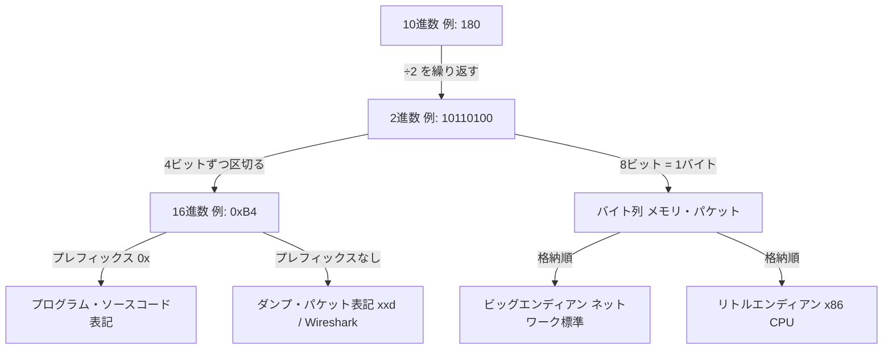
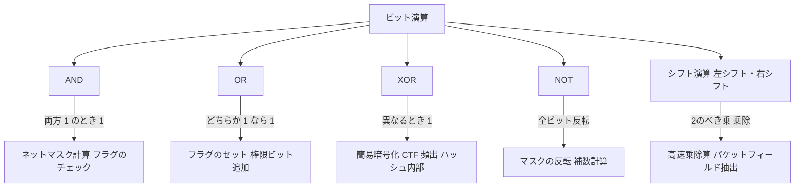
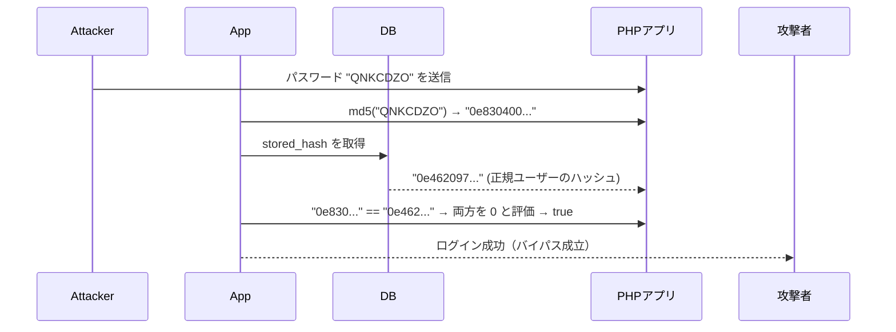

## TL;DR

- コンピューターはすべてのデータを **0 と 1（ビット）** で扱っており、セキュリティエンジニアはその表現を直接読み書きできる必要がある。
- **16進数（hex）** はバイナリの省略記法として広く使われ、パケット解析・メモリダンプ・シェルコードの全場面で登場する。
- **ビット演算（AND / OR / XOR / シフト）** はフラグ管理・暗号・難読化の核心であり、CTF の頻出テーマでもある。

---

## なぜ重要か

セキュリティを学び始めると、すぐにこんな場面に出くわす。

```
45 00 00 3c 1a 2b 40 00 40 06 ...   ← Wireshark のパケットダンプ
\x41\x42\x43\x44                    ← シェルコードのエスケープ
0b10110100 & 0b11110000 = 0b10110000 ← ネットマスク計算
```

これらが読めないと、ツールの出力をコピペするだけになってしまう。「なぜそうなるか」が分からなければ、想定外の挙動に対処できない。

具体的にどんな場面で使うか：

| 場面 | 知識 |
|------|------|
| Wireshark / tcpdump | 16進ダンプを人間が読む |
| バッファオーバーフロー | アドレスをリトルエンディアンで書く |
| XOR 暗号化 (CTF) | ビット演算で復号する |
| ネットワーク設計 | サブネットマスクの計算 |
| フラグ管理 (Unix パーミッション) | ビット AND で権限チェック |
| ハッシュ・エンコーディング | バイト列を hex 文字列に変換 |

この記事を読み終えると、上記すべてを「なぜそうなるか」まで説明できるようになる。

---

## 仕組み



### 1. なぜコンピューターは 2 進数を使うのか

トランジスタは「電圧が高い（ON）」か「低い（OFF）」の 2 状態しか安定して保持できない。これが **ビット（bit = binary digit）** の起源だ。ビット 8 個 = **1 バイト（byte）**。

```
1 バイト = 8 ビット → 2^8 = 256 通りの値（0〜255）
```

### 2. 2 進数 ↔ 10 進数の変換

各桁は「2 の何乗か」を表す **重み** を持つ。

```
ビット位置:  7    6    5    4    3    2    1    0
重み:       128   64   32   16    8    4    2    1

例: 0b10110100
     1×128 + 0×64 + 1×32 + 1×16 + 0×8 + 1×4 + 0×2 + 0×1
   = 128 + 32 + 16 + 4
   = 180
```

**10 進 → 2 進** は「2 で割り続けて余りを逆に並べる」。

```
180 ÷ 2 = 90 余り 0
 90 ÷ 2 = 45 余り 0
 45 ÷ 2 = 22 余り 1
 22 ÷ 2 = 11 余り 0
 11 ÷ 2 =  5 余り 1
  5 ÷ 2 =  2 余り 1
  2 ÷ 2 =  1 余り 0
  1 ÷ 2 =  0 余り 1
                ↑ 逆に読む → 10110100
```

### 3. 16 進数（Hexadecimal）

2 進数 4 ビットをそのまま 1 桁に対応させたのが 16 進数だ。

```
2進  | 10進 | 16進
0000 |   0  |  0
0001 |   1  |  1
...
1001 |   9  |  9
1010 |  10  |  A
1011 |  11  |  B
1100 |  12  |  C
1101 |  13  |  D
1110 |  14  |  E
1111 |  15  |  F
```

1 バイト = 8 ビット = 16 進 2 桁。これが重要。

```
0b10110100 = 0xB4
  ^^^^       ^
  1011=B     4=0100
```

`0x` プレフィックスが付いていれば確実に 16 進数だが、`xxd` や Wireshark のダンプではプレフィックスなしで hex が並ぶことが多い。文脈と桁数（2 桁 = 1 バイト）で判断しよう。

### 4. エンディアン（バイト順）

複数バイトの数値をメモリに格納する順番に 2 種類ある。これを **エンディアン** という。

```
数値: 0x12345678（4 バイト）

ビッグエンディアン（ネットワーク標準）:
アドレス: 00  01  02  03
データ:   12  34  56  78   ← 上位バイトから

リトルエンディアン（x86 / x86_64 CPU）:
アドレス: 00  01  02  03
データ:   78  56  34  12   ← 下位バイトから
```

エンディアンはパケット解析やメモリダンプを読む際にすぐ役立つ知識だ。バッファオーバーフローへの応用（リターンアドレスのバイト順など）は後続の「バッファオーバーフロー入門」で詳しく扱う。

### 5. ビット演算の 4 基本



#### AND（`&`） — 両方が 1 のときだけ 1

```
  10110100
& 11110000
----------
  10110000

用途: ネットマスク計算、フラグのチェック
例: IPアドレス & サブネットマスク = ネットワークアドレス
```

#### OR（`|`） — どちらか 1 つでも 1 なら 1

```
  10110100
| 00001111
----------
  10111111

用途: フラグのセット（立てる）
例: パーミッションビットを追加する
```

#### XOR（`^`） — 異なるとき 1、同じとき 0

```
  10110100
^ 11001100
----------
  01111000

重要な性質:
  A ^ B ^ B = A  （同じ値で 2 回 XOR すると元に戻る）
  
用途: 簡易暗号化・CTF の頻出・ハッシュ関数内部
```

#### NOT（`~`） / ビットシフト（`<<` `>>`）

```
~10110100 = 01001011  （全ビット反転）

10110100 << 2 = 1011010000  （左に 2 ビットシフト = ×4）
10110100 >> 2 =   00101101  （右に 2 ビットシフト = ÷4）
```

シフト演算は **非負整数（または論理右シフト）の場合**、`x << n` は `x × 2^n`、`x >> n` は `x ÷ 2^n` と数学的に等価だ。符号付き整数の右シフト挙動は言語・処理系によって異なるため（算術シフト vs 論理シフト）、依存したコードは移植性に注意しよう。

### 6. Unix ファイルパーミッションとビット演算

`ls -l` で見える `rwxr-xr--` は 9 ビットで表現されている。

```
rwx r-x r--
111 101 100  ← 2進数
 7   5   4   ← 8進数

chmod 754 file.txt と同義
```

概念的にはビット AND によって権限ビットを照合しているが、実際の Linux カーネルは所有者・グループ・ACL（アクセス制御リスト）・Capabilities なども評価する。ここでは「AND による照合が基本構造」と理解しておけばよい。

```c
// カーネルの権限チェック（概念コード）
if (file_mode & 0x001) {  // 最下位ビット = other execute
    allow_execute();
}
```

---

## 脆弱なコード例（PHP / Node.js / Python）

ここからは「ビット演算の知識がないと発生するバグ」と「XOR を使った雑な暗号化の危険性」を示す。これらは実際の CTF やペネトレーションテストで頻出のパターンだ。

### PHP — 型の曖昧さによるビット比較バグ



```php
<?php
/**
 * 脆弱なコード例: PHPの型強制による比較バグ
 * 
 * 問題: PHP は "==" で比較すると型変換が起き、
 *       16進数文字列が数値として解釈される場合がある。
 *       これによりハッシュ比較がバイパスされる。
 */

// ❌ 脆弱: "0e..." で始まる MD5 ハッシュは科学的記数法として 0 に評価される
function vulnerable_login(string $input_password, string $stored_hash): bool {
    $input_hash = md5($input_password);
    
    // == を使っているため "0e123..." == "0e456..." が true になる（マジックハッシュ）
    return ($input_hash == $stored_hash);
}

// 既知のマジックハッシュ: md5("240610708") = "0e462097431906509019562988736854"
// md5("QNKCDZO")  = "0e830400451993494058024219903391"
// 上記 2 つは == で比較すると true → ログインバイパス成立

$stored = md5("240610708");  // 正規ユーザーのパスワードハッシュ
$attack = "QNKCDZO";        // 攻撃者が入力する別の文字列

if (vulnerable_login($attack, $stored)) {
    echo "ログイン成功！（本来はできないはず） ";  // ← これが表示されてしまう
}

// ✅ 安全: === を使って型と値の両方を比較する
function secure_login(string $input_password, string $stored_hash): bool {
    $input_hash = md5($input_password);
    return hash_equals($stored_hash, $input_hash);  // タイミング攻撃も防ぐ
}
?>
```

> **なぜこうなるか**: PHP の `==` は比較前に型変換を行う。`"0e123"` は「0 × 10^123」= `0` として評価される。異なるパスワードでも MD5 ハッシュが `0e` で始まる組み合わせが存在し、これを **マジックハッシュ** という。

---

### Node.js — XOR による雑な難読化

```javascript
/**
 * 脆弱なコード例: XOR による「暗号化」
 * 
 * 問題: 単一キーの XOR は既知平文攻撃に弱い。
 *       CTF でよく見るパターン。ラボ環境での演習用。
 */

// ❌ 脆弱: 固定キーによる XOR 暗号化
function xorEncrypt(plaintext, key) {
    // 文字列をバイト配列に変換して XOR する
    return Buffer.from(plaintext).map(
        (byte, i) => byte ^ key.charCodeAt(i % key.length)  // キーを循環させる
    );
}

function xorDecrypt(ciphertext, key) {
    // XOR の性質: A ^ K ^ K = A なので同じ関数で復号できる
    return Buffer.from(ciphertext).map(
        (byte, i) => byte ^ key.charCodeAt(i % key.length)
    ).toString('utf8');
}

const secretKey = "K";             // 1バイトキー（最悪のケース）
const message   = "Hello, recon0x!";

const encrypted = xorEncrypt(message, secretKey);
//
console.log("暗号化後 (hex):", encrypted.toString('hex'));

// 攻撃: 1バイトキーなら 256 通り全試行（ブルートフォース）で解読可能
console.log(" --- ブルートフォース解読 ---");
for (let k = 0; k < 256; k++) {
    const candidate = Buffer.from(encrypted).map(b => b ^ k).toString('utf8');
    // 可読文字が多ければキーの候補として表示
    const printable = candidate.split('').filter(c => c.charCodeAt(0) >= 32 && c.charCodeAt(0) < 127).length;
    if (printable === candidate.length) {
        console.log(`key=0x${k.toString(16).padStart(2,'0')} (${String.fromCharCode(k)}): ${candidate}`);
    }
}

// ✅ 安全: 暗号化には crypto モジュールの AES-256-GCM を使う
const crypto = require('crypto');

function secureEncrypt(plaintext, password) {
    const salt = crypto.randomBytes(16);
    const key  = crypto.scryptSync(password, salt, 32);  // 鍵導出
    const iv   = crypto.randomBytes(12);
    const cipher = crypto.createCipheriv('aes-256-gcm', key, iv);
    
    const encrypted = Buffer.concat([cipher.update(plaintext, 'utf8'), cipher.final()]);
    const tag = cipher.getAuthTag();  // 改ざん検知タグ
    
    // salt + iv + tag + encrypted を結合して返す
    return Buffer.concat([salt, iv, tag, encrypted]).toString('hex');
}
```

---

### Python — バイト操作とビット演算の実用例

```python
#!/usr/bin/env python3
"""
脆弱なコード例 + 安全なコード例:
バイト列操作とビット演算を使った簡易フラグシステム

ラボ環境（HTB / TryHackMe）での演習を想定。
"""

# ─────────────────────────────────────────────
# ❌ 脆弱: 外部入力をそのまま権限ビットとして解釈した場合の例
# 
}
# ─────────────────────────────────────────────

# ユーザー権限フラグ（ビットフラグ）
PERM_READ    = 0b00000001  # 1
PERM_WRITE   = 0b00000010  # 2
PERM_EXEC    = 0b00000100  # 4
PERM_ADMIN   = 0b10000000  # 128

def check_permission_vulnerable(user_flags: int, required: int) -> bool:
    """
    脆弱なチェック: 外部入力をそのまま権限ビットとして解釈した場合の例。

    例えば API 経由で -1 が渡された場合、Python の任意精度 int では
    全ビットが立った状態として AND 演算され、あらゆる権限チェックを通過する。
    """
    return bool(user_flags & required)  # ← user_flags の検証がない

# 攻撃例: 外部から -1 を渡すと全権限フラグが成立する
print(check_permission_vulnerable(-1, PERM_ADMIN))  # True → 権限昇格


# ─────────────────────────────────────────────
# ✅ 安全: 入力範囲のバリデーション付き
# ─────────────────────────────────────────────

def check_permission_safe(user_flags: int, required: int) -> bool:
    """
    安全なチェック: フラグを 8 ビットに制限してから評価する
    """
    # フラグは 0〜255 の範囲に正規化
    if not (0 <= user_flags <= 0xFF):
        raise ValueError(f"不正なフラグ値: {user_flags}")
    return bool(user_flags & required)


# ─────────────────────────────────────────────
# 発展: バイト列の XOR 解析（CTF 演習）
#
# ─────────────────────────────────────────────

def xor_bytes(data: bytes, key: bytes) -> bytes:
    """バイト列を XOR する（CTF の復号でよく使うパターン）"""
    return bytes(a ^ b for a, b in zip(data, key * (len(data) // len(key) + 1)))

def crack_single_byte_xor(ciphertext: bytes) -> tuple[int, str]:
    """
    単一バイト XOR 暗号を英文スコアで解読する（発展的内容）
    CTF の最頻出パターンの 1 つ
    """
    # 英語の頻度が高い文字（スコアリング用）
    english_freq = set(b' etaoinshrdlu')
    
    best_score = -1
    best_key   = 0
    best_plain = ""
    
    for key in range(256):  # 256通り全試行
        plain = bytes(b ^ key for b in ciphertext)
        # 可読文字の割合でスコアリング
        score = sum(1 for b in plain if b in english_freq)
        if score > best_score:
            best_score = score
            best_key   = key
            best_plain = plain.decode('ascii', errors='replace')
    
    return best_key, best_plain


# 変換ユーティリティ（ペネトレーションテストでよく使う）
def demo_conversions():
    n = 0xDEADBEEF  # よく見る魔法の数値
    
    print(f"10進数: {n}")
    print(f"16進数: {hex(n)}")
    print(f"2進数:  {bin(n)}")
    print(f"バイト列(ビッグエンディアン):    {n.to_bytes(4, 'big').hex()}")
    print(f"バイト列(リトルエンディアン):  {n.to_bytes(4, 'little').hex()}")
    # エンディアンへの応用（BOF など）は後続の「バッファオーバーフロー入門」で扱う

if __name__ == "__main__":
    demo_conversions()
    
    # XOR クラッキング演習（発展）
    cipher = bytes([0x1b, 0x37, 0x37, 0x33, 0x31, 0x36, 0x3f, 0x78,
                    0x15, 0x1b, 0x7f, 0x2b, 0x78, 0x36, 0x23])
    key, plain = crack_single_byte_xor(cipher)
    print(f" XOR解読結果 → key: 0x{key:02x} ({chr(key)}), plain: {plain}")
```

---

## 実践例 / 演習例

> ⚠️ **注意**: 以下の演習はすべて自分が所有・管理する環境、または HTB / TryHackMe のような **利用規約に明示された合法ラボ** のみで実施すること。許可のない第三者システムへの適用は **不正アクセス禁止法（第 3 条）** に違反する（日本法）。海外在住の読者は各国の法令およびサービス利用規約にも必ず従うこと。

### 演習 1: Linux でバイナリ / hex を直接操作する

```bash
# 10進数 → 16進数 → 2進数 変換
printf '%x ' 255          # → ff
printf '%d ' 0xff         # → 255
echo "obase=2; 255" | bc   # → 11111111

# ファイルの hex ダンプ（バイナリ解析の基本）
echo -n "Hello" | xxd
# 00000000: 4865 6c6c 6f                             Hello

# xxd で hex → バイナリに戻す（逆変換）
echo "48656c6c6f" | xxd -r -p
# → Hello

# XOR をシェルで計算
python3 -c "print(0xAB ^ 0xCD)"   # → 102
python3 -c "print(hex(0xAB ^ 0xCD))"  # → 0x66

# ビット AND でサブネット計算
python3 -c "
ip   = int('11000000101010000000000100000001', 2)  # 192.168.1.1
mask = int('11111111111111111111111100000000', 2)  # /24
net  = ip & mask
print('.'.join(str((net >> (8*i)) & 0xFF) for i in range(3,-1,-1)))
"
# → 192.168.1.0
```

### 演習 2: Wireshark のパケットを hex で読む

1. Wireshark を起動し、TCP パケットをキャプチャ
2. `View > Packet Bytes` で hex ダンプを確認
3. 最初の数バイトを手動で 10 進数に変換してみる
}
4. `0x45` は **Ethernet ヘッダーの後ろに現れる IPv4 ヘッダーの先頭バイト**（Version=4, IHL=5）

```
例: 45 00 00 3c ...
│   │  └── Total Length = 0x003c = 60 バイト
│   └───── DSCP/ECN = 0x00
│
└───────── Version=4, IHL=5

           IHL=5 → 5 × 4 = 20 バイトのヘッダー長
```

### 演習 3: HTB CTF での XOR 解読（発展）

HTB の "Crypto" カテゴリのビギナー問題は単一バイト XOR が頻出。上記 Python コードの `crack_single_byte_xor()` をそのまま使える。

```bash
# 暗号化されたファイルを受け取ったとき
python3 - << 'EOF'
ciphertext = open("encrypted.bin", "rb").read()

best_score, best_key, best_plain = 0, 0, b""
for key in range(256):
    plain = bytes(b ^ key for b in ciphertext)
    # 印刷可能な ASCII 文字の割合でスコアリング
    score = sum(32 <= b < 127 for b in plain)
    if score > best_score:
        best_score, best_key, best_plain = score, key, plain

print(f"key=0x{best_key:02x}, plain={best_plain[:64]}")
EOF
```

### 演習 4: Unix パーミッションのビット演算確認

```bash
# ファイルのパーミッションを数値で確認
stat -c "%a %n" /etc/passwd   # → 644 /etc/passwd

# Python でビット分解
python3 -c "
mode = 0o644  # 8進数（rw-r--r--）
print(f'owner : r={bool(mode & 0o400)} w={bool(mode & 0o200)} x={bool(mode & 0o100)}')
print(f'group : r={bool(mode & 0o040)} w={bool(mode & 0o020)} x={bool(mode & 0o010)}')
print(f'others: r={bool(mode & 0o004)} w={bool(mode & 0o002)} x={bool(mode & 0o001)}')
"
```

---

## 防御策

### 1. 入力値の数値範囲バリデーション

ビットフラグを外部入力から受け取る場合は必ずビット幅を制限する。

```python
# ✅ フラグは許可されたビットのみを受け入れる
ALLOWED_FLAGS = 0b00000111  # READ | WRITE | EXEC のみ許可

def sanitize_flags(user_input: int) -> int:
    return user_input & ALLOWED_FLAGS  # 未定義ビットを強制的にクリア
```

### 2. 型安全な比較（PHP / Python）

- PHP: `===`（厳密比較）または `hash_equals()` を使う
- Python: `hmac.compare_digest()` でタイミング攻撃を防ぐ

### 3. XOR を暗号として使わない

XOR は暗号化の「構成部品」にはなるが、それ単体では安全な暗号ではない。既知平文攻撃・頻度分析に対して脆弱。

| 用途 | 推奨 |
|------|------|
| 対称暗号 | AES-256-GCM |
| 鍵導出 | PBKDF2 / scrypt / Argon2 |
| ハッシュ | SHA-256 以上 |
| パスワードハッシュ | **Argon2id 推奨**（bcrypt は互換性目的の選択肢）(OWASP, 2021) |

### 4. エンディアン変換は標準ライブラリに任せる

手書きのバイトシフト処理はバグの温床。

```python
import struct
# ✅ struct モジュールで安全に変換
value = 0x12345678
big_endian    = struct.pack('>I', value)   # ネットワークバイト順
little_endian = struct.pack('<I', value)   # x86 メモリバイト順
```

---

## 実演ラボ案内

| プラットフォーム | 推奨コンテンツ | 難易度 |
|---|---|---|
| **TryHackMe** | [CC: Crypto](https://tryhackme.com/room/ccpentesting) → Binary & Hex 基礎 | ⭐ |
| **TryHackMe** | [Advent of Cyber](https://tryhackme.com/room/adventofcyber4) → Day 10 (XOR) | ⭐⭐ |
| **Hack The Box** | Starting Point → Tier 0 (各マシンで hex dump 観察) | ⭐ |
| **HTB CTF Archive** | "Crypto" タグの Easy 問題（単一 XOR が多い） | ⭐⭐ |
| **自宅 VM** | Python インタラクティブシェルで上記コードを動かす | ⭐ |
| **CyberChef** | https://gchq.github.io/CyberChef/ — GUI で変換・XOR を試す | ⭐ |

### 自宅 VM でのセットアップ（Kali Linux）

```bash
# 数値変換・バイト操作に便利なツール
sudo apt install -y python3 xxd binutils hexedit

# Python3 の対話モードが最強の電卓
python3
>>> hex(255)
>>> bin(0xff)
>>> 0b10110100 ^ 0b11001100
>>> import struct; struct.pack('<Q', 0xdeadbeef)
```

---

## よくある誤解

### 誤解 1: 「16 進数は別の数値体系だ」

**実際**: 16 進数は 10 進数・2 進数と **同じ数値** を別の表記で書いているだけ。`255 = 0xFF = 0b11111111` はすべて同じ量。表記の違いであって、演算結果は変わらない。

### 誤解 2: 「XOR は暗号化に使える」

**実際**: XOR 単体は One-Time Pad（ワンタイムパッド）でない限り安全でない。繰り返しキーの XOR は頻度分析で破られる。CTF の問題として出るのは「破ること」が目的だからで、実装に使ってはいけない。

### 誤解 3: 「シフト演算と乗除算は別物だ」

**実際**: 非負整数に対して `x << n` は `x × 2^n`、`x >> n` は `x ÷ 2^n` と数学的に等価。ただし符号付き整数の右シフトは言語・処理系によって挙動が異なるため（算術シフト vs 論理シフト）、依存したコードは移植性に注意が必要だ。

### 誤解 4: 「エンディアンは低レイヤの話で CTF には関係ない」

**実際**: パケット解析・メモリダンプ・バイナリ解析において即座に登場する。pwn 系 CTF でのリターンアドレス操作など発展的な応用は後続の「バッファオーバーフロー入門」で取り上げる。

### 誤解 5: 「マジックハッシュは古い問題で現代のアプリは影響を受けない」

**実際**: PHP 8.x でも `==` で MD5 文字列を比較している古いコードは今も稼働している。レガシーコードのセキュリティレビューでは今でも発見される。

---

## 関連 CVE と被害事例

| CVE / 事例 | 概要 | 関連する知識 |
|---|---|---|
| **CVE-2023-0386** | Linux カーネルの OverlayFS でファイル権限ビットの不正昇格 | ビットフラグ / パーミッション管理 |
| **CVE-2021-3156** (Sudo) | 整数のオフバイワン → ヒープバッファオーバーフロー | バイト境界・整数演算 |
| **PHP マジックハッシュ問題** | `==` によるハッシュ型強制比較。多数の CTF 問題・実際の CMS に存在 | 16 進数文字列の型解釈 |
| **WEP の XOR 脆弱性 (2001)** | WEP 暗号化が RC4 + CRC32（XOR ベース）で実装されており、既知平文攻撃で鍵を回収可能。Wi-Fi セキュリティの歴史的転換点 | XOR 暗号の限界 |
| **Heartbleed (CVE-2014-0160)** | OpenSSL の長さフィールドをバイト単位で操作。`memcpy` のバイト数ミスによる情報漏洩 | バイト演算・エンディアン |

---

## 次に学ぶべき記事

- **[Linux ファイルシステムとパーミッション完全解説]** — ビット演算の実用例としてのパーミッション管理
- **[ネットワーク基礎: IP / サブネット / TCP ヘッダーを読む]** — 16 進ダンプとエンディアンの実践
- **[バッファオーバーフロー入門: スタックの仕組み]** — リトルエンディアン・アドレス操作の応用
- **[CTF Crypto 入門: エンコーディングと古典暗号]** — XOR・シフト暗号の解読演習
- **[Python for セキュリティエンジニア: pwntools / pycryptodome]** — 本記事コードの本格的な発展

---

## 参考文献

1. **OWASP Top 10 2021 - A02: Cryptographic Failures**  
   https://owasp.org/Top10/A02_2021-Cryptographic_Failures/

2. **OWASP Password Storage Cheat Sheet（Argon2id 推奨）**  
   https://cheatsheetseries.owasp.org/cheatsheets/Password_Storage_Cheat_Sheet.html

3. **PHP Manual: Comparison Operators (Type Juggling)**  
   https://www.php.net/manual/en/language.operators.comparison.php

4. **NIST SP 800-57 Part 1 Rev. 5: Recommendation for Key Management**  
   https://csrc.nist.gov/publications/detail/sp/800-57-part-1/rev-5/final

5. **"Cryptopals Crypto Challenges" — Set 1 (Hex / XOR 基礎)**  
   https://cryptopals.com/sets/1

6. **Intel 64 and IA-32 Architectures Software Developer's Manual Vol. 1 — Chapter 4: Data Types**  
   https://www.intel.com/content/www/us/en/developer/articles/technical/intel-sdm.html

7. **Linux `man 2 stat` — ファイルパーミッションのビットフラグ定義**  
   https://man7.org/linux/man-pages/man2/stat.2.html

8. **HTB Academy: "Introduction to Binary Exploitation"**  
   https://academy.hackthebox.com/module/details/31

9. **CyberChef — GCHQ のオンライン変換ツール**  
   https://gchq.github.io/CyberChef/

10. **不正アクセス行為の禁止等に関する法律（不正アクセス禁止法）第 3 条**  
    https://elaws.e-gov.go.jp/document?lawid=411AC0000000128
