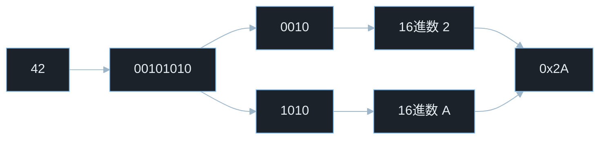
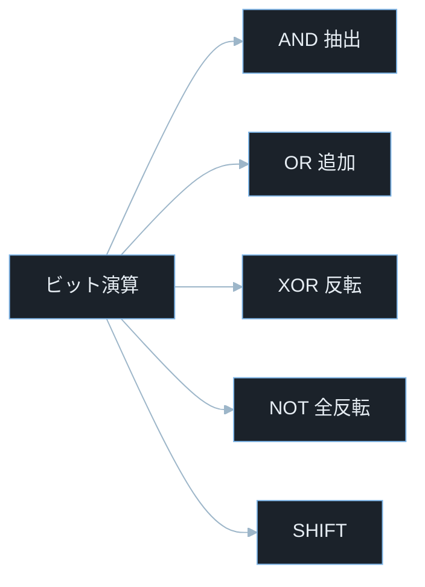
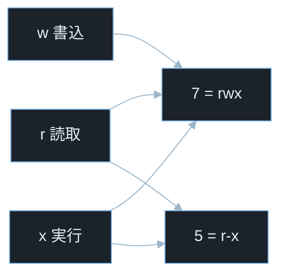
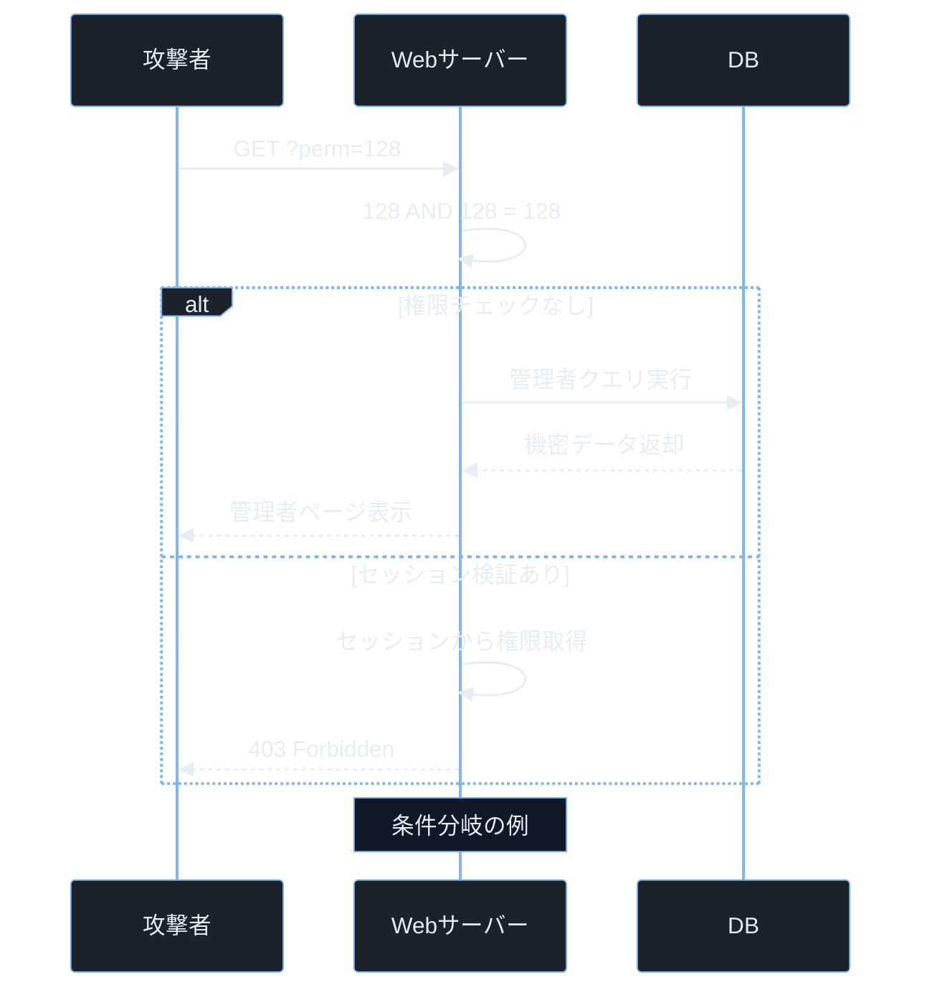

## TL;DR

- コンピューターはすべてのデータを 2進数（0と1）で処理し、16進数はその省略表記としてメモリ解析・シェルコード・パケットキャプチャで毎日登場する。
- ビット演算（AND / OR / XOR / シフト）は権限チェックやフラグ管理に広く使われており、実装ミスが権限バイパスや認証ロジック不備に直結する。
- CTF や実務で「おかしな数値」を見たら、まずビット操作の視点から眺める習慣が突破口になる。

> **本記事で前提とする用語の超ざっくり整理**
> - **CTF**: Capture The Flag。セキュリティの腕試しコンテスト。隠された「フラグ」と呼ばれる文字列を見つけて提出する形式。
> - **ペネトレーションテスト**: 合法的に許可を受けて、システムにわざと侵入を試みて脆弱性を見つける作業。
> - **HTB / TryHackMe**: いずれも合法な学習用ハッキング演習プラットフォーム。本記事では「ラボ」と呼ぶ。
> - **シェルコード**: 攻撃者がメモリに送り込む小さな実行コード。多くは機械語の生バイト列。

---

## なぜ重要か

セキュリティの現場では、数値を 10進数のまま眺めていると見逃すパターンが多い。

Nmap（ポートスキャンツール）のスキャン結果に `0x1F` が出てきたとき、即座に `31` と読めるか。シェルコードで `\x90` が x86 系 CPU で NOP（何もしない）命令として使われ、NOP sled（ノップ・スレッド。攻撃時に「どこに着地しても安全にシェルコードへ辿り着ける滑り台」のような構造）の構成要素になると理解できるか。バッファオーバーフローのオフセット計算でビット境界がずれたときに気づけるか。

> **0x1F の読み方**: 先頭の `0x` は「これは16進数ですよ」というマーカー。`1F` が本体。16進数の `1F` = `1 × 16 + 15` = `31`（10進数）。`F` は 15 を意味する。

これらはすべて「2進数・16進数・ビット演算の感覚」があるかどうかの話だ。プログラミングの問題ではなく、コンピューターが何をしているかを直接読む能力の問題である。

ペネトレーションテストの実務では、次の場面で必須知識になる。

- ファイルパーミッション（`chmod 755` の各桁が何を意味するか）
- ネットワークのサブネットマスク計算（AND 演算そのもの）
- メモリダンプ・パケットキャプチャの 16進数読み取り
- CTF の Reversing（リバースエンジニアリング）/ Pwn（バイナリ脆弱性悪用）/ Crypto（暗号解読）カテゴリ全般
- 整数オーバーフロー・ビットマスクバイパスの再現と分析

基礎を固めておかないと、脆弱なコードをレビューしても「なぜ問題なのか」が説明できない。

---

## 仕組み

### 2進数と16進数の変換

10進数 `42` を 2進数に変換する。やり方は「2 で割って余りを書き出す」を繰り返すだけだ。

```
42 ÷ 2 = 21 ... 0
21 ÷ 2 = 10 ... 1
10 ÷ 2 =  5 ... 0
 5 ÷ 2 =  2 ... 1
 2 ÷ 2 =  1 ... 0
 1 ÷ 2 =  0 ... 1
```

余りを下から読むと `101010`。8ビットに揃えると `0010 1010` になる（先頭にゼロを足して 8桁にしただけで、値は同じ）。

16進数は 4ビットを 1桁に圧縮する表記だ。`0010` は `2`、`1010` は `A`（10進で 10）。つまり `0x2A`。

> **なぜ 4ビット = 16進数 1桁なのか**: 4ビットで表現できる値の範囲は 0〜15 で、ちょうど 16通り。16進数の 1桁も 0〜F の 16通り。つまり「ぴったり対応する」ので、長い 2進数を短く読みやすくするために 16進数が使われる。



### ビット演算の種類と用途

ビット演算は、整数を 2進数として見て、各ビットに対して「論理操作」を一気にかける処理のことだ。



| 演算 | 記号 | 典型的な用途 |
|------|------|-------------|
| AND  | `&`  | 特定ビットの抽出・マスク処理 |
| OR   | `｜` | 特定ビットのセット・フラグ追加 |
| XOR  | `^`  | ビット反転・簡易暗号化 |
| NOT  | `~`  | 全ビット反転・マスク生成 |
| 左シフト | `<<` | 多くの環境で 2のn乗倍相当（オーバーフローに注意） |
| 右シフト | `>>` | 多くの環境で 2のn乗除算相当（符号付き整数では実装差異あり） |

> **記号の覚え方（イメージ重視）**
> - **AND `&`**: 両方が 1 のときだけ 1。「両方の条件をくぐり抜けたものだけ通す」フィルター。
> - **OR `|`**: どちらかが 1 なら 1。「どちらかに当てはまれば OK」のスタンプ。
> - **XOR `^`**: 違うときだけ 1。「差分検出」「同じ鍵で 2回かけると元に戻る」性質があり、暗号で多用される。
> - **NOT `~`**: 0 と 1 をすべて反転。
> - **左シフト `<<`**: ビット列を左にずらす。空いた右側には 0 が入る。
> - **右シフト `>>`**: ビット列を右にずらす。あふれた右端のビットは捨てられる。

### Linux ファイルパーミッションとビット演算

> **前提:** `chmod` は Linux でファイルやディレクトリの権限を変更するコマンド（**ch**ange **mod**e の略）。`chmod 755 script.sh` のように使う。3桁の数字はそれぞれ「**オーナー（ファイル所有者） / グループ（同じグループのユーザー） / その他（全員）**」の権限を表し、各桁の中身は「読取(r=4) + 書込(w=2) + 実行(x=1)」の足し算で作る。たとえば 7 なら r+w+x 全部許可、5 なら r+x 許可（書込なし）、0 なら全部禁止。

`chmod 755` は内部で次のように処理される。

```
オーナー: 1 1 1  →  r=4, w=2, x=1 → 合計7
グループ: 1 0 1  →  r=4, w=0, x=1 → 合計5
その他:   1 0 1  →  r=4, w=0, x=1 → 合計5
```

上の表の `1 1 1` は左から「読取 / 書込 / 実行」のビットを表している。`1` が「許可」、`0` が「禁止」。つまり `755` は「オーナーは全部 OK、グループとその他は読取と実行のみ OK（書込はダメ）」という意味だ。

7 = 4(r)+2(w)+1(x)、5 = 4(r)+1(x) であり、各権限は独立したビットとして管理される。この設計があるからこそ、AND 演算で特定の権限だけを取り出せる。



次のコードは、パーミッション値から「特定の権限ビットだけ」を AND で取り出す例だ。

> **`0o755` の読み方**: Python では先頭 `0o` が「これは 8進数ですよ」というマーカー。`0o755` は 8進数の 755 で、これがちょうど `chmod 755` と同じ意味になる（8進数なのは、3ビット × 3グループの構造に綺麗に対応するから）。`0o400` は「オーナーの読取ビットだけが立った値」、`0o200` は「オーナーの書込ビットだけ」、`0o001` は「その他の実行ビットだけ」を表す。これを AND すると、その権限の有無だけを True/False で取り出せる。

```python
mode = 0o755

has_owner_read  = bool(mode & 0o400)
has_owner_write = bool(mode & 0o200)
has_other_exec  = bool(mode & 0o001)

print(has_owner_read, has_owner_write, has_other_exec)
```

実行結果は `True True True` になる（755 はオーナーの読取・書込・その他の実行すべてを許可しているから）。この「特定ビットを見る」操作の実装を誤ると、権限バイパスが発生する。

---

## 脆弱なコード例

> 本記事の攻撃例は学習環境・CTF・明示的に許可された検証環境のみで実施してください。
> 実システムへの無断検証は不正アクセス禁止法や各国法令、利用規約違反となる可能性があります。

### 攻撃フロー — ビットマスクバイパス

この図は「攻撃者がブラウザの URL を細工して `?perm=128` を送ると、サーバーが管理者権限と誤認してしまう」という流れを表している。`128` は 2進数で `10000000`（管理者ビットだけが立った状態）に相当する値だ。

> **`GET ?perm=128` の意味**: `GET` は HTTP のリクエスト方式の一種（ページを取得するときの基本動作）。`?perm=128` は URL の末尾につけるクエリパラメータで、`perm` というキーに `128` という値を渡している。たとえば `https://example.com/admin?perm=128` のような URL を攻撃者がブラウザに入力するだけで送信できる。



図の「128 AND 128 = 128」の行は、サーバー内部で `userPerm & PERM_ADMIN` というビット演算が走った結果を示している。両方が `0b10000000` なので AND の結果も `0b10000000`（= 128）になり、`> 0` の判定が真になってしまう。

### PHP — ビットマスク権限チェックの設計ミス

```php
<?php
define('PERM_READ',  0b00000001);
define('PERM_WRITE', 0b00000010);
define('PERM_ADMIN', 0b10000000);

function hasPermission(int $userPerm, int $required): bool {
    return ($userPerm & $required) > 0;
}

$userInput = $_GET['perm'] ?? 0;
$userPerm  = (int)$userInput;

if (hasPermission($userPerm, PERM_ADMIN)) {
    echo "管理者機能にアクセスできます";
} else {
    echo "権限不足";
}
```

> **`0b00000001` の読み方**: PHP / Python / JavaScript などで先頭 `0b` は「これは 2進数ですよ」というマーカー。`0b10000000` は 2進数の `10000000` = 10進数の 128。
> **`$_GET['perm']`**: PHP で URL のクエリパラメータ（`?perm=128` の値）を取り出す書き方。ここに攻撃者が好きな値を入れて送信できてしまう。

**問題点:** クエリパラメータ `perm` に `128`（= `0b10000000`）を渡すだけで管理者判定が通る。権限値をユーザーが自由に指定できる構造が根本的な欠陥だ。攻撃者がブラウザで `?perm=128` を送信すれば管理者パネルに到達できる。

---

### Node.js — 32ビット整数への強制変換による認証ロジック不備

```javascript
function checkAge(age) {
    const ageInt = age | 0;
    if (ageInt === 18) {
        return true;
    }
    return false;
}

const userInput = "4294967314";
const age = parseInt(userInput, 10);
console.log("年齢確認:", checkAge(age));
```

> **`age | 0` の意味**: JavaScript で「小数を切り捨てて 32ビット整数へ変換する古いテクニック」。`Math.floor()` の代わりに昔よく使われた。実体は「OR 演算で 0 と OR を取る」（何も足さないので値は変わらないが、副作用として `ToInt32` という内部変換が走る）。
> **`ToInt32`**: JavaScript の内部仕様で定義された「数値を 32ビット符号付き整数に強制変換するルール」。32ビットを超える値は下位 32ビットだけが残る。

**問題点:** 入力値が 32ビットの範囲を超えると、`| 0` は下位 32ビットだけを残して切り捨てる。`4294967314` は 16進で `0x100000012`。`| 0` 後は `0x12` = 18 になるため、本来 18 ではない `4294967314` が「18 として認証ロジックを通過」してしまう。JavaScript の Number は IEEE754 倍精度浮動小数（小数も整数も同じ Number 型で扱う方式）であり、これは典型的な整数オーバーフローとは異なる性質の問題だ。

---

### Python — XOR 暗号の鍵再利用（Two-time pad 攻撃）

```python
def encrypt(data: bytes, key: bytes) -> bytes:
    return bytes(b ^ key[i % len(key)] for i, b in enumerate(data))

key  = b"SECRET"
msg1 = b"Hello, World!!!"
msg2 = b"Admin Access OK"

enc1 = encrypt(msg1, key)
enc2 = encrypt(msg2, key)

xor_of_ciphertexts = bytes(a ^ b for a, b in zip(enc1, enc2))
print("暗号文 XOR:", xor_of_ciphertexts.hex())
```

> **XOR を使った暗号化の仕組み**: 平文の各バイトと鍵の各バイトを XOR すると暗号文ができる。受け取り側は同じ鍵で再度 XOR すれば元の平文に戻る（XOR は 2回かけると元に戻る性質があるため）。
> **ワンタイムパッド**: 平文と同じ長さの「真の乱数鍵」を 1回だけ使う暗号方式。理論的には完全に安全だが、鍵の管理が非現実的なので実用では使われない。
> **Two-time pad 攻撃**: 同じ鍵を 2回以上使ったときに、暗号文同士の XOR を取ると平文同士の XOR が露出する攻撃。鍵を一切知らなくても、平文の関係式が見えてしまう。

**問題点:** 同一の鍵で 2つのメッセージを暗号化すると `enc1 XOR enc2 = msg1 XOR msg2` が成立する。鍵の情報が一切なくても平文の関係式が露出する。

XOR 暗号は「真の乱数キーを一度だけ使う」ワンタイムパッドの条件を満たさない限り、実用暗号として使ってはいけない (OWASP, 2021)。

---

## 実践例 / 演習例

### 16進数を ASCII に変換する

```bash
echo "48656c6c6f2c20576f726c6421" | xxd -r -p
```

> **`xxd` コマンド**: 16進ダンプを表示・変換する Linux 標準ツール。`-r` は「逆変換（16進文字列をバイナリに戻す）」、`-p` は「プレーン（区切りなしの連続した16進文字列）として扱う」のオプション。

実行すると `Hello, World!` が出力される。CTF の Reversing / Forensics（フォレンジック。デジタル痕跡の解析）では毎回登場するコマンドだ。

### Python でビット演算を体感する

```python
x = 0b10110100

print(f"元の値       {x:08b}  ({x})")
print(f"AND 0x0F     {x & 0x0F:08b}  ({x & 0x0F})")
print(f"OR  0x01     {x | 0x01:08b}  ({x | 0x01})")
print(f"XOR 0xFF     {x ^ 0xFF:08b}  ({x ^ 0xFF})")
print(f"左シフト 2   {(x << 2) & 0xFF:08b}  ({(x << 2) & 0xFF})")
print(f"右シフト 2   {x >> 2:08b}  ({x >> 2})")
```

> **`{x:08b}` の意味**: Python の f文字列フォーマットで「`x` を 8桁の 2進数で表示、足りない桁は 0 で埋める」という指定。

各演算の出力を眺めながら「どのビットが変わったか」を目で追う練習が、脆弱性解析の直感を鍛える。

### Wireshark / xxd でパケットのフラグを読む

```bash
tcpdump -i eth0 -c 20 -w /tmp/capture.pcap
xxd /tmp/capture.pcap | head -30
```

> **`tcpdump`**: Linux 標準のパケットキャプチャツール。`-i eth0` でネットワークインターフェース指定、`-c 20` で 20パケット取得、`-w ファイル名` で .pcap 形式に保存。
> **Wireshark**: パケット解析の GUI ツール。tcpdump で取った .pcap ファイルを開いて中身を可視化できる。

TCP ヘッダーのフラグフィールド（SYN = `0x02`、ACK = `0x10`、FIN = `0x01`）はすべてビット単位で管理されている。Wireshark のフィルタ `tcp.flags.syn == 1` もビット演算の結果だ。

---

## 防御策

### 1. 権限値はサーバーサイドのみで管理する

ユーザー入力から権限ビットを直接取得しない。権限はデータベースやセッションサーバーが保持し、リクエストごとに照合する。

```python
PERM_ADMIN = 0b10000000

def get_user_permission(user_id: int) -> int:
    row = db.query("SELECT perm FROM users WHERE id = ?", (user_id,))
    return row["perm"] if row else 0

if get_user_permission(session["user_id"]) & PERM_ADMIN:
    grant_admin_access()
```

ポイントは「権限値は DB から取る」「ユーザー入力（クエリパラメータ・Cookie・隠しフォームなど）は信用しない」の 2点だ。

### 2. 整数入力の範囲を明示的に検証する

```javascript
function safeCheckAge(input) {
    const age = Number(input);
    if (!Number.isInteger(age) || age < 0 || age > 150) {
        throw new RangeError("不正な年齢値");
    }
    return age >= 18;
}
```

32ビット符号付き整数の最大値は `2,147,483,647`（`0x7FFFFFFF`）だ。これを超えた値が入力されうる状況では、言語の型変換を信頼せず上限チェックを入れる。

> **符号付き整数の最大値**: 32ビットのうち 1ビットは「正負の符号」を表すために使われるので、表現できる値の範囲は約 ±21億になる。これを超えると意図しない挙動が起きる。

### 3. XOR 暗号を独自実装しない

ストリーム暗号が必要な場合は標準ライブラリの AES-GCM を使う。Python なら `cryptography` パッケージが推奨される (OWASP, 2021)。

> **AES-GCM**: AES（Advanced Encryption Standard）という業界標準の暗号アルゴリズムを、GCM（Galois/Counter Mode）という認証付きモードで使ったもの。「暗号化」と「改ざん検出」を同時にやってくれる。現代のウェブで広く使われている。

```python
from cryptography.hazmat.primitives.ciphers.aead import AESGCM
import os

key    = AESGCM.generate_key(bit_length=256)
aesgcm = AESGCM(key)
nonce  = os.urandom(12)
ct     = aesgcm.encrypt(nonce, b"Admin Access OK", None)
pt     = aesgcm.decrypt(nonce, ct, None)
```

> **nonce（ナンス）**: Number used once の略。1回しか使わない数。同じ鍵で同じ nonce を 2回使うと安全性が崩れるので、毎回ランダム生成する。

### 4. 符号付き・符号なし整数の境界を意識する

言語によって `+1` や `*2` の結果が型の上限を越えた瞬間に負数になったりゼロに折り返したりする（未定義動作になる言語もある）。セキュリティ上重要な計算では、演算前に上限チェックを実施するか、C/C++ では SafeInt、JavaScript では BigInt や検証済み数値ライブラリを利用する。

> **BigInt**: JavaScript で任意精度（とても大きな値でも誤差なし）の整数を扱う型。`123n` のように末尾に `n` を付けて宣言する。

---

## 実演ラボ案内

### Hack The Box

推奨学習順: Linux Fundamentals → Networking Fundamentals → Crypto Challenges

- **Starting Point（Meow / Fawn）**: Linux・ネットワークの基礎に触れながら、16進表現やバイト列に慣れる出発点として最適。
- **Challenges — Crypto カテゴリ**: XOR の Two-time pad 問題が複数用意されており、本記事の知識を直接試せる。

### TryHackMe

- **Intro to Networking**: サブネットマスクの計算で AND 演算が実際に登場する。
- **Cryptography モジュール**: XOR・ビット操作を使う問題が段階的に並んでいる。

### 自宅 VM（合法環境）

```bash
python3 -c "
import struct
data = struct.pack('>I', 0xDEADBEEF)
print('big-endian hex:', data.hex())
print('値:', struct.unpack('>I', data)[0])
"
```

> **`struct.pack('>I', ...)`**: Python の `struct` モジュールで、`>` はビッグエンディアン（後述）、`I` は符号なし32ビット整数を表す指定。
> **エンディアン**: バイト列の並び順。ビッグエンディアン（人間の読み方と同じ）とリトルエンディアン（下位バイトが先）がある。x86 CPU はリトルエンディアン、ネットワーク通信はビッグエンディアンが基本。
> **`0xDEADBEEF`**: 「死んだ牛肉」と読める覚えやすい 16進数で、デバッグやテストで「目印用の値」としてよく使われる。

Python の `struct` モジュールでバイトオーダーの違いを体験する。実際のバイナリ解析でエンディアンの差に気づけるかどうかが解読速度を左右する。

---

## よくある誤解

**誤解 1: 「16進数は難しい」**
4ビットを 1文字に変換するルールだ。`0〜9` と `A〜F` の 16文字のマッピングを覚えれば、変換は機械的にできる。慣れれば `0xCA` を見た瞬間に `11001010` と頭に浮かぶようになる。

**誤解 2: 「ビット演算はアセンブリを書くときだけ使うもの」**
権限フラグ・ネットワークマスク・RGB カラー値や画像フォーマット内の色表現・HTTP ヘッダーのフラグなど、高レベルなウェブアプリ開発でも日常的に使われている。知らずに書いていたコードが実はビット演算だったというケースは多い。

**誤解 3: 「XOR 暗号は鍵を知らないと解読できない」**
同じ鍵を 2回以上使えば Two-time pad 攻撃で解読できる。ワンタイムパッドが安全な理由は「真の乱数」を「絶対に1回しか使わない」ことが前提になっているからだ。この条件を満たせない設計では XOR 暗号を使ってはいけない。

**誤解 4: 「パーミッション 777 は便利で無害」**
`chmod 777` は `rwxrwxrwx`（全員に読み書き実行を許可）を意味する。共有サーバー上では第三者がファイルを書き換えたり悪意あるスクリプトを実行したりできてしまう。Web サーバーの公開ディレクトリを 777 にした結果、任意コード実行に至った事例は現実に数多い。

**誤解 5: 「整数は符号なし型にすれば安全」**
符号なし整数でも加算・乗算の結果が上限を超えればオーバーフローする。C 言語の符号なし整数はラップアラウンドが規格で保証されているが、それを悪用した攻撃（例: サイズ計算のバイパス）が実際に CVE になっている。

---

## 関連 CVE と被害事例

> **CVE とは**: Common Vulnerabilities and Exposures の略。世界共通の脆弱性識別番号。`CVE-2021-3156` は「2021年に登録された 3156番目の脆弱性」という意味。
> **CVSS スコア**: 脆弱性の深刻度を 0.0〜10.0 で評価した指標。7.0 以上が High、9.0 以上が Critical 扱い。

**CVE-2021-3156（sudo Baron Samedit）**
sudoedit のバックスラッシュエスケープ処理に起因するヒープベースバッファオーバーフロー脆弱性。主因は引数処理ロジックの不整合であり、ローカルユーザーが root 権限を取得できた。CVSS スコア 7.8。パッチを当てるまでの間、多数の Linux ディストリビューションが影響を受けた。本記事との関連: 境界管理

**CVE-2022-0185（Linux カーネル heap out-of-bounds write）**
`fsconfig()` の `legacy_parse_param()` におけるサイズ検証不備によりヒープ領域への書き込みが発生し、コンテナ環境からホスト OS への権限昇格が可能になった。入力値のサイズチェックが適切に機能しなかったことが直接の原因だ。CVSS スコア 8.4。本記事との関連: サイズ検証

**CVE-2021-41617（OpenSSH 権限昇格）**
OpenSSH の特権分離後のグループ権限管理に不備があり、期待しないグループ権限がセッションに付与されるケースがあった。影響範囲は限定的だったが、権限管理の実装がいかに繊細かを示す事例だ。本記事との関連: 権限管理

3つの CVE に共通するのは「境界チェックと権限管理の甘さ」という根本原因だ。基礎知識がなければ脆弱なコードを読んでも問題に気づけない。

---

## 次に学ぶべき記事

- **スタック・ヒープとメモリレイアウト** — ビット演算の知識を活かしてバッファオーバーフローのオフセット計算を理解する
- **整数オーバーフロー攻撃の実践** — 本記事で学んだ型変換の挙動を CTF の Pwn 問題で実際に使う
- **ネットワーク基礎とサブネット計算** — AND 演算でサブネットマスクを計算する実用的な応用編

---

## 参考文献

- OWASP Foundation. "OWASP Top 10 2021: A02 Cryptographic Failures". https://owasp.org/Top10/A02_2021-Cryptographic_Failures/
- OWASP Foundation. "OWASP Top 10 2021: A01 Broken Access Control". https://owasp.org/Top10/A01_2021-Broken_Access_Control/
- Red Hat Security Advisory. "CVE-2021-3156 sudo heap overflow". https://access.redhat.com/security/cve/CVE-2021-3156
- NVD. "CVE-2022-0185 Detail". https://nvd.nist.gov/vuln/detail/CVE-2022-0185
- NVD. "CVE-2021-41617 Detail". https://nvd.nist.gov/vuln/detail/CVE-2021-41617
- Python Software Foundation. "struct — Interpret bytes as packed binary data". https://docs.python.org/3/library/struct.html
- PyCA. "cryptography — Hazardous Materials layer". https://cryptography.io/en/latest/hazmat/primitives/aead/
