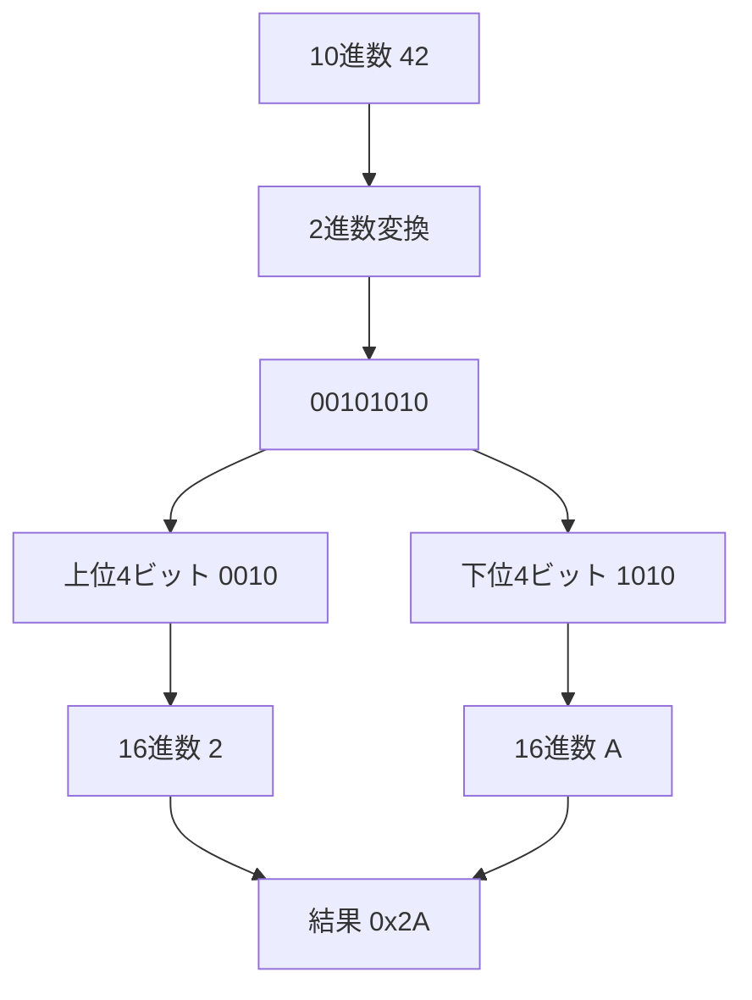
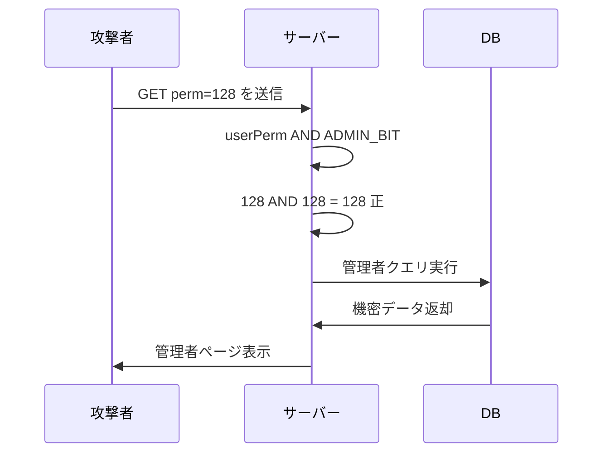

## TL;DR

- コンピューターはすべてのデータを 2進数（0と1）で処理し、16進数はその省略表記としてメモリ解析・シェルコード・パケットキャプチャで毎日登場する。
- ビット演算（AND / OR / XOR / シフト）は権限チェックやフラグ管理に広く使われており、実装ミスが権限バイパスや整数オーバーフロー脆弱性に直結する。
- CTF や実務で「おかしな数値」を見たら、まずビット操作の視点から眺める習慣が突破口になる。

---

## なぜ重要か

セキュリティの現場では、数値を 10進数のまま眺めていると見逃すパターンが多い。

Nmap のスキャン結果に `0x1F` が出てきたとき、即座に `31` と読めるか。シェルコードで `\x90` が x86 系で NOP 命令として使われ、NOP sled の構成要素になると理解できるか。バッファオーバーフローのオフセット計算でビット境界がずれたときに気づけるか。

これらはすべて「2進数・16進数・ビット演算の感覚」があるかどうかの話だ。プログラミングの問題ではなく、コンピューターが何をしているかを直接読む能力の問題である。

ペネトレーションテストの実務では、次の場面で必須知識になる。

- ファイルパーミッション（`chmod 755` の各桁が何を意味するか）
- ネットワークのサブネットマスク計算（AND 演算そのもの）
- メモリダンプ・パケットキャプチャの 16進数読み取り
- CTF の Reversing / Pwn / Crypto カテゴリ全般
- 整数オーバーフロー・ビットマスクバイパスの再現と分析

基礎を固めておかないと、脆弱なコードをレビューしても「なぜ問題なのか」が説明できない。

---

## 仕組み

### 2進数と16進数の変換

10進数 `42` を 2進数に変換する。

```
42 ÷ 2 = 21 ... 0
21 ÷ 2 = 10 ... 1
10 ÷ 2 =  5 ... 0
 5 ÷ 2 =  2 ... 1
 2 ÷ 2 =  1 ... 0
 1 ÷ 2 =  0 ... 1
```

余りを下から読むと `101010`。8ビットに揃えると `0010 1010`。

16進数は 4ビットを 1桁に圧縮する表記だ。`0010` は `2`、`1010` は `A`（10進で 10）。つまり `0x2A`。



### ビット演算の種類と用途

| 演算 | 記号 | 典型的な用途 |
|------|------|-------------|
| AND  | `&`  | 特定ビットの抽出・マスク処理 |
| OR   | `\|`  | 特定ビットのセット・フラグ追加 |
| XOR  | `^`  | ビット反転・簡易暗号化 |
| NOT  | `~`  | 全ビット反転・マスク生成 |
| 左シフト | `<<` | 多くの環境で 2のn乗倍相当（オーバーフローに注意） |
| 右シフト | `>>` | 多くの環境で 2のn乗除算相当（符号付き整数では実装差異あり） |

### Linux ファイルパーミッションとビット演算

`chmod 755` は内部で次のように処理される。

```
オーナー: 1 1 1  →  r=4, w=2, x=1 → 合計7
グループ: 1 0 1  →  r=4, w=0, x=1 → 合計5
その他:   1 0 1  →  r=4, w=0, x=1 → 合計5
```

7 = 4(r)+2(w)+1(x)、5 = 4(r)+1(x) であり、各権限は独立したビットとして管理される。この設計があるからこそ、AND 演算で特定の権限だけを取り出せる。

パーミッション確認のコードは AND 演算そのものだ。

```python
mode = 0o755

has_owner_read  = bool(mode & 0o400)
has_owner_write = bool(mode & 0o200)
has_other_exec  = bool(mode & 0o001)

print(has_owner_read, has_owner_write, has_other_exec)
```

この「特定ビットを見る」操作の実装を誤ると、権限バイパスが発生する。

### ビットマスク攻撃のフロー



---

## 脆弱なコード例

### PHP — ビットマスク権限チェックの設計ミス

```php
<?php
define('PERM_READ',  0b00000001);
define('PERM_WRITE', 0b00000010);
define('PERM_ADMIN', 0b10000000);

function hasPermission(int $userPerm, int $required): bool {
    return ($userPerm & $required) > 0;
}

$userInput = $_GET['perm'] ?? 0;
$userPerm  = (int)$userInput;

if (hasPermission($userPerm, PERM_ADMIN)) {
    echo "管理者機能にアクセスできます";
} else {
    echo "権限不足";
}
```

**問題点:** クエリパラメータ `perm` に `128`（= `0b10000000`）を渡すだけで管理者判定が通る。権限値をユーザーが自由に指定できる構造が根本的な欠陥だ。攻撃者がブラウザで `?perm=128` を送信すれば管理者パネルに到達できる。

---

### Node.js — 32ビット整数への強制変換による認証ロジック不備

```javascript
function checkAge(age) {
    const ageInt = age | 0;
    if (ageInt >= 18) {
        return true;
    }
    return false;
}

const userInput = "4294967314";
const age = parseInt(userInput, 10);
console.log("年齢確認:", checkAge(age));
```

**問題点:** `| 0` は JavaScript でよく使われる「高速整数化」イディオムだが、32ビット符号付き整数への強制変換（ToInt32）を行う。`4294967314` は 16進で `0x100000012`。下位32ビットは `0x12` = 18 になるため、`checkAge` は `true` を返す。

`| 0` による ToInt32 変換で値が 18 に丸め込まれるため、入力検証の実装次第では年齢判定ロジックを誤動作させる可能性がある。JavaScript の Number は IEEE754 倍精度浮動小数であり、これは典型的な整数オーバーフローとは異なる性質の問題だ。

---

### Python — XOR 暗号の鍵再利用（Two-time pad 攻撃）

```python
def encrypt(data: bytes, key: bytes) -> bytes:
    return bytes(b ^ key[i % len(key)] for i, b in enumerate(data))

key  = b"SECRET"
msg1 = b"Hello, World!!!"
msg2 = b"Admin Access OK"

enc1 = encrypt(msg1, key)
enc2 = encrypt(msg2, key)

xor_of_ciphertexts = bytes(a ^ b for a, b in zip(enc1, enc2))
print("暗号文 XOR:", xor_of_ciphertexts.hex())
```

**問題点:** 同一の鍵で 2つのメッセージを暗号化すると `enc1 XOR enc2 = msg1 XOR msg2` が成立する。鍵の情報が一切なくても平文の関係式が露出する（Two-time pad 攻撃）。

XOR 暗号は「真の乱数キーを一度だけ使う」ワンタイムパッドの条件を満たさない限り、実用暗号として使ってはいけない (OWASP, 2021)。

---

## 実践例 / 演習例

### 16進数を ASCII に変換する

```bash
echo "48656c6c6f2c20576f726c6421" | xxd -r -p
```

`xxd -r -p` で 16進文字列をバイナリに戻す。CTF の Reversing / Forensics では毎回登場するコマンドだ。

### Python でビット演算を体感する

```python
x = 0b10110100

print(f"元の値       {x:08b}  ({x})")
print(f"AND 0x0F     {x & 0x0F:08b}  ({x & 0x0F})")
print(f"OR  0x01     {x | 0x01:08b}  ({x | 0x01})")
print(f"XOR 0xFF     {x ^ 0xFF:08b}  ({x ^ 0xFF})")
print(f"左シフト 2   {(x << 2) & 0xFF:08b}  ({(x << 2) & 0xFF})")
print(f"右シフト 2   {x >> 2:08b}  ({x >> 2})")
```

各演算の出力を眺めながら「どのビットが変わったか」を目で追う練習が、脆弱性解析の直感を鍛える。

### Wireshark / xxd でパケットのフラグを読む

```bash
tcpdump -i eth0 -c 20 -w /tmp/capture.pcap
xxd /tmp/capture.pcap | head -30
```

TCP ヘッダーのフラグフィールド（SYN = `0x02`、ACK = `0x10`、FIN = `0x01`）はすべてビット単位で管理されている。Wireshark のフィルタ `tcp.flags.syn == 1` もビット演算の結果だ。

---

## 防御策

### 1. 権限値はサーバーサイドのみで管理する

ユーザー入力から権限ビットを直接取得しない。権限はデータベースやセッションサーバーが保持し、リクエストごとに照合する。

```python
PERM_ADMIN = 0b10000000

def get_user_permission(user_id: int) -> int:
    row = db.query("SELECT perm FROM users WHERE id = ?", (user_id,))
    return row["perm"] if row else 0

if get_user_permission(session["user_id"]) & PERM_ADMIN:
    grant_admin_access()
```

### 2. 整数入力の範囲を明示的に検証する

```javascript
function safeCheckAge(input) {
    const age = Number(input);
    if (!Number.isInteger(age) || age < 0 || age > 150) {
        throw new RangeError("不正な年齢値");
    }
    return age >= 18;
}
```

32ビット符号付き整数の最大値は `2,147,483,647`（`0x7FFFFFFF`）だ。これを超えた値が入力されうる状況では、言語の型変換を信頼せず上限チェックを入れる。

### 3. XOR 暗号を独自実装しない

ストリーム暗号が必要な場合は標準ライブラリの AES-GCM を使う。Python なら `cryptography` パッケージが推奨される (OWASP, 2021)。

```python
from cryptography.hazmat.primitives.ciphers.aead import AESGCM
import os

key    = AESGCM.generate_key(bit_length=256)
aesgcm = AESGCM(key)
nonce  = os.urandom(12)
ct     = aesgcm.encrypt(nonce, b"Admin Access OK", None)
pt     = aesgcm.decrypt(nonce, ct, None)
```

### 4. 符号付き・符号なし整数の境界を意識する

言語によって `+1` や `*2` の結果が型の上限を越えた瞬間に負数になったりゼロに折り返したりする（未定義動作になる言語もある）。セキュリティ上重要な計算では、演算前に上限チェックを実施するか、C/C++ では SafeInt、JavaScript では BigInt や検証済み数値ライブラリを利用する。

---

## 実演ラボ案内

### Hack The Box

- **Starting Point（Meow / Fawn）**: Linux・ネットワークの基礎に触れながら、16進表現やバイト列に慣れる出発点として最適。
- **Challenges — Crypto カテゴリ**: XOR の Two-time pad 問題が複数用意されており、本記事の知識を直接試せる。

### TryHackMe

- **Intro to Networking**: サブネットマスクの計算で AND 演算が実際に登場する。
- **Cryptography モジュール**: XOR・ビット操作を使う問題が段階的に並んでいる。

### 自宅 VM（合法環境）

```bash
python3 -c "
import struct
data = struct.pack('>I', 0xDEADBEEF)
print('big-endian hex:', data.hex())
print('値:', struct.unpack('>I', data)[0])
"
```

Python の `struct` モジュールでバイトオーダー（ビッグエンディアン / リトルエンディアン）の違いを体験する。実際のバイナリ解析でエンディアンの差に気づけるかどうかが解読速度を左右する。

---

## よくある誤解

**誤解 1: 「16進数は難しい」**
4ビットを 1文字に変換するルールだ。`0〜9` と `A〜F` の 16文字のマッピングを覚えれば、変換は機械的にできる。慣れれば `0xCA` を見た瞬間に `11001010` と頭に浮かぶようになる。

**誤解 2: 「ビット演算はアセンブリを書くときだけ使うもの」**
権限フラグ・ネットワークマスク・RGB カラー値や画像フォーマット内の色表現・HTTP ヘッダーのフラグなど、高レベルなウェブアプリ開発でも日常的に使われている。知らずに書いていたコードが実はビット演算だったというケースは多い。

**誤解 3: 「XOR 暗号は鍵を知らないと解読できない」**
同じ鍵を 2回以上使えば Two-time pad 攻撃で解読できる。ワンタイムパッドが安全な理由は「真の乱数」を「絶対に1回しか使わない」ことが前提になっているからだ。この条件を満たせない設計では XOR 暗号を使ってはいけない。

**誤解 4: 「パーミッション 777 は便利で無害」**
`chmod 777` は `rwxrwxrwx`（全員に読み書き実行を許可）を意味する。共有サーバー上では第三者がファイルを書き換えたり悪意あるスクリプトを実行したりできてしまう。Web サーバーの公開ディレクトリを 777 にした結果、任意コード実行に至った事例は現実に数多い。

**誤解 5: 「整数は符号なし型にすれば安全」**
符号なし整数でも加算・乗算の結果が上限を超えればオーバーフローする。C 言語の符号なし整数はラップアラウンドが規格で保証されているが、それを悪用した攻撃（例: サイズ計算のバイパス）が実際に CVE になっている。

---

## 関連 CVE と被害事例

**CVE-2021-3156（sudo Baron Samedit）**
sudoedit のバックスラッシュエスケープ処理に起因するヒープベースバッファオーバーフロー脆弱性。主因は引数処理ロジックの不整合であり、ローカルユーザーが root 権限を取得できた。CVSS スコア 7.8。パッチを当てるまでの間、多数の Linux ディストリビューションが影響を受けた。

**CVE-2022-0185（Linux カーネル整数オーバーフロー）**
`fsconfig()` の `legacy_parse_param()` におけるサイズ検証不備によりヒープ領域への書き込みが発生し、コンテナ環境からホスト OS への権限昇格が可能になった。入力値のサイズチェックが適切に機能しなかったことが直接の原因だ。CVSS スコア 8.4。

**CVE-2021-41617（OpenSSH 権限昇格）**
OpenSSH の特権分離後のグループ権限管理に不備があり、期待しないグループ権限がセッションに付与されるケースがあった。影響範囲は限定的だったが、権限管理の実装がいかに繊細かを示す事例だ。

3つの CVE に共通するのは「ビット演算・整数境界の甘さ」という根本原因だ。基礎知識がなければ脆弱なコードを読んでも問題に気づけない。

---

## 次に学ぶべき記事

- **スタック・ヒープとメモリレイアウト** — ビット演算の知識を活かしてバッファオーバーフローのオフセット計算を理解する
- **整数オーバーフロー攻撃の実践** — 本記事で学んだ型変換の挙動を CTF の Pwn 問題で実際に使う
- **ネットワーク基礎とサブネット計算** — AND 演算でサブネットマスクを計算する実用的な応用編

---

## 参考文献

- OWASP Foundation. "OWASP Top 10 2021: A02 Cryptographic Failures". https://owasp.org/Top10/A02_2021-Cryptographic_Failures/
- OWASP Foundation. "OWASP Top 10 2021: A01 Broken Access Control". https://owasp.org/Top10/A01_2021-Broken_Access_Control/
- Red Hat Security Advisory. "CVE-2021-3156 sudo heap overflow". https://access.redhat.com/security/cve/CVE-2021-3156
- NVD. "CVE-2022-0185 Detail". https://nvd.nist.gov/vuln/detail/CVE-2022-0185
- NVD. "CVE-2021-41617 Detail". https://nvd.nist.gov/vuln/detail/CVE-2021-41617
- Python Software Foundation. "struct — Interpret bytes as packed binary data". https://docs.python.org/3/library/struct.html
- PyCA. "cryptography — Hazardous Materials layer". https://cryptography.io/en/latest/hazmat/primitives/aead/
