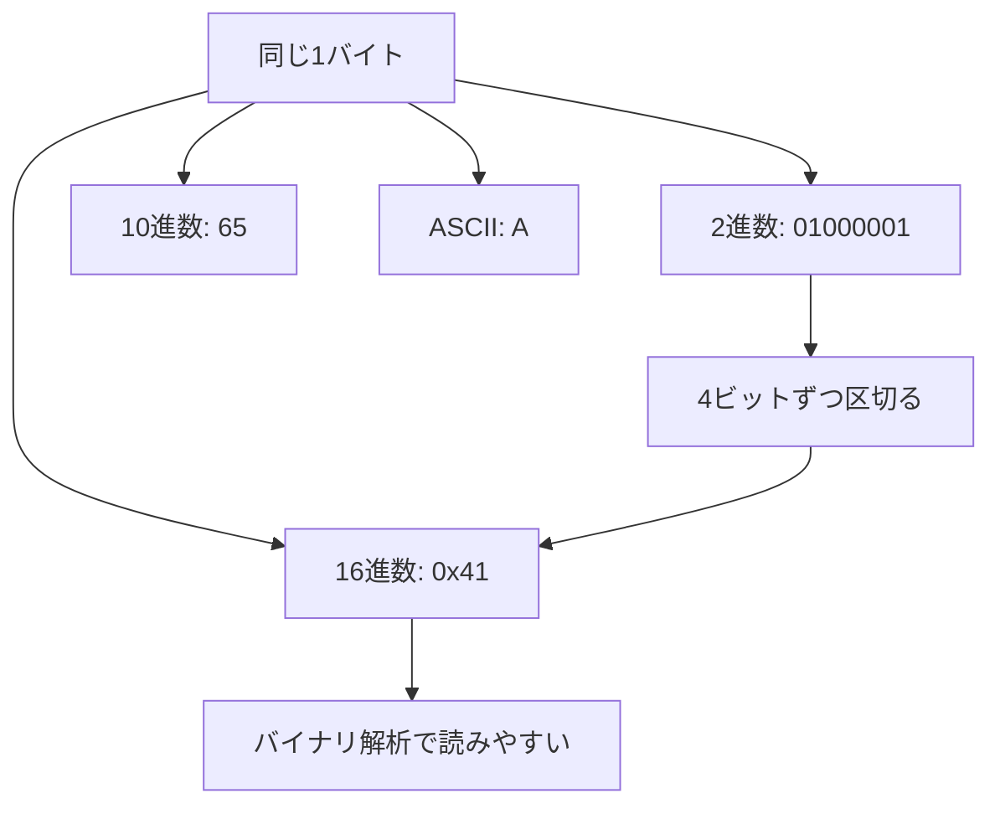
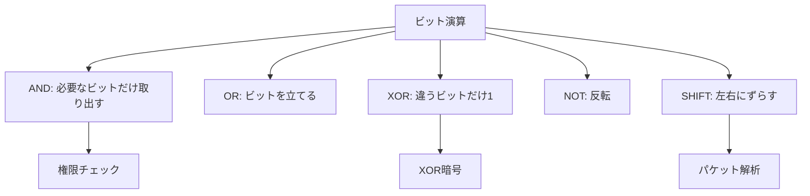
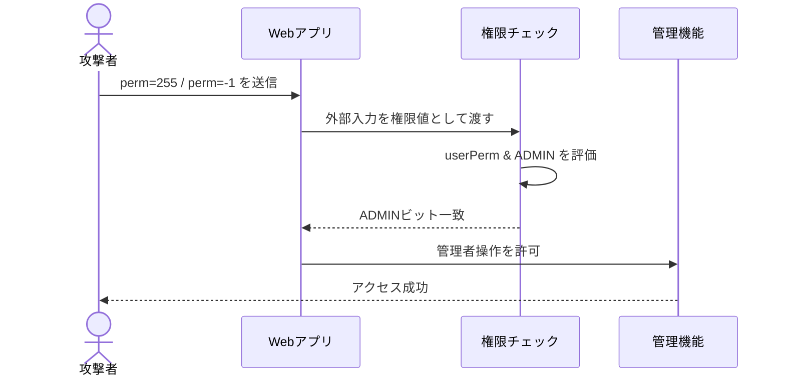
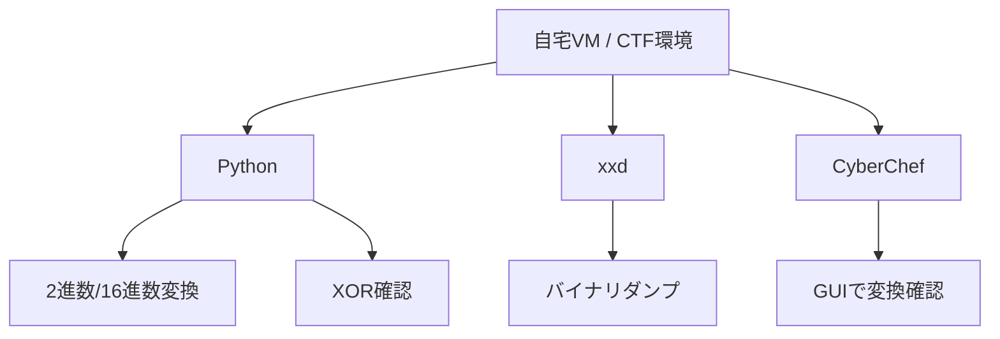

## TL;DR

- 2進数・16進数・ビット演算はシェルコード解析・CTF・暗号解読・パケット解析のすべてで登場する「ハッカーの共通言語」だ。
- ビット演算の誤用は整数オーバーフロー・認証バイパス・XOR 弱点暗号といった実在の脆弱性に直結する。
- 原理を理解すれば、難読化されたペイロードや謎のバイナリを「読める」ようになる。

---

## なぜ重要か

CTF に初めて取り組んだとき、`0x41414141` とか `0b11001010` とか `\x90\x90\x90` といった表記で詰まった人は多いはずだ。これらはすべて同じ「数」を別の書き方で表しているにすぎない。

ハッキングの現場でビット演算が出てくる場面を挙げると：

<!-- 修正: 「NOP スレッド」は誤記。正しくは NOP sled（スレッド＝糸ではなくスレッジ＝橇）に統一 -->
- **シェルコード解析**: バイナリは 16 進数で表現される（`\x90` = NOP sled で使われる x86 の NOP 命令）
- **パケット解析**: TCP フラグ（SYN/ACK/FIN）はビットフラグで管理される
- **CTF Crypto**: XOR 暗号は最頻出。原理を知らないと解けない
- **権限チェックのバイパス**: ビットマスクによる認証実装の欠陥
- **整数オーバーフロー**: 符号ビットの反転でバッファサイズを偽装

「数学苦手だから……」と後回しにしがちな分野だが、実際に必要な知識は中学レベルの位取り記数法だけだ。本記事で一気に片付けよう。

<!-- 修正: OffSec PEN-200 との接続を明示 -->
> 💡 **この知識がどこで使えるか**: nmap のポート番号読み取り、TCP フラグ解析、Linux 権限（`chmod 755`）、シェルコード生成、バッファオーバーフロー計算——OffSec PEN-200 / HTB Academy の全コースがこの知識を前提にしている。

> ⚠️ **法的注意**: 本記事の攻撃手法はすべて **自分が管理するシステム**、または **規約・契約で明示的に許可された演習環境**（HTB / TryHackMe / 自宅 VM / Bug Bounty 対象スコープ内）でのみ実施してください。許可なく他者のシステムに試みることは **不正アクセス禁止法（日本）** 違反となり、刑事罰の対象です。

---

## 仕組み

## Mermaid 図


### 挿入図: 2進数・16進数・ASCIIの関係



### 挿入図: ビット演算の種類分類



### 挿入図: 権限ビット誤用の攻撃フロー



### 挿入図: 演習環境の構成




### 位取り記数法：10進数・2進数・16進数

私たちが普段使う **10進数（Decimal）** は「0〜9」の10種類の記号で数を表す。桁が上がるたびに 10 倍になる。

**2進数（Binary）** はビット（bit）を使い「0」と「1」しか使わない。桁が上がるたびに 2 倍になる。

**16進数（Hexadecimal / Hex）** は「0〜9 と A〜F」の16種類で表す。桁が上がるたびに 16 倍。16進数は 2進数 4ビットとぴったり対応するため、バイナリデータの表現に最適だ。

```
10進数  →   2進数   →  16進数
  0    →  0000 0000  →  0x00
 16    →  0001 0000  →  0x10
 65    →  0100 0001  →  0x41   ← 'A' の ASCII コード
255    →  1111 1111  →  0xFF
256    → 1 0000 0000 →  0x100
```

**変換の覚え方（16進数 → 2進数）**: 16進数の1桁は 2進数の4ビットに対応する。

```
0xCA  →  C=1100, A=1010  →  1100 1010
0x41  →  4=0100, 1=0001  →  0100 0001
```


<!-- 修正: ASCII とバイト列の説明を追加（レビュー「追加すべき概念」より） -->
### ASCII とバイト列 — 数値としての文字

`0x41` は数値として 65 だが、ASCII コードとして解釈すると文字 `'A'` になる。同じバイト列でも「何として読むか」で意味が変わる点が重要だ。

```
バイト列: 0x48 0x65 0x6C 0x6C 0x6F
文字列:    H    e    l    l    o
```

シェルコードやバイナリ解析では「このバイトは命令か？文字か？数値か？」を常に意識する必要がある。

<!-- 修正: Linux chmod との接続を追加（レビュー「追加すべき概念」より） -->
### 実例：Linux の chmod 755 とビット

Linux のファイル権限 `chmod 755` はビットフラグの典型例だ。

```
権限:  rwx r-x r-x
       ↓   ↓   ↓
所有者: 111 = 7
グループ: 101 = 5
その他: 101 = 5

r (read)    = 0b100 = 4
w (write)   = 0b010 = 2
x (execute) = 0b001 = 1

7 = r+w+x = 4+2+1 = 0b111
5 = r+x   = 4+1   = 0b101
```

`ls -la` で見る `-rwxr-xr-x` がビットフラグで表現されていることがわかる。

<!-- 修正: CIDR / サブネットマスクとの接続を追加（レビュー「追加すべき概念」より） -->
### 実例：サブネットマスクとビット AND

`255.255.255.0`（`/24`）というサブネットマスクもビット演算そのものだ。

```
IP アドレス: 192.168.1.100
             1100 0000 . 1010 1000 . 0000 0001 . 0110 0100

サブネットマスク /24 = 255.255.255.0
             1111 1111 . 1111 1111 . 1111 1111 . 0000 0000

AND 演算 → ネットワークアドレス:
             1100 0000 . 1010 1000 . 0000 0001 . 0000 0000
           = 192.168.1.0
```

nmap で `/24` を指定してスキャンするとき、内部ではこのビット AND が走っている。

### ビット演算の種類

ビット演算はビット単位で行う論理演算だ。CPU が最も得意とする処理であり、セキュリティコードの至る所に登場する。

#### AND（`&`）: 両方 1 のときだけ 1

```
  1010 1100  (0xAC = 172)
& 0000 1111  (0x0F =  15) ← 下位4ビットのマスク
-----------
  0000 1100  (0x0C =  12)
```

**用途**: 特定のビットだけを取り出す（マスク処理）。権限フラグのチェックに頻用。

#### OR（`|`）: どちらか 1 のときに 1

```
  1010 0000  (0xA0 = 160)
| 0000 0101  (0x05 =   5)
-----------
  1010 0101  (0xA5 = 165)
```

**用途**: 特定のビットをセット（立てる）する。権限フラグの付与に使われる。

#### XOR（`^`）: 異なるときに 1、同じときに 0

```
  1010 1100  (0xAC)
^ 1111 0000  (0xF0)
-----------
  0101 1100  (0x5C)
```

**重要な性質**: `A XOR B XOR B = A`。同じ値で2回 XOR すると元に戻る。これが XOR 暗号の原理であり、弱点でもある。

#### NOT（`~`）: ビットを反転

```
~ 0000 0001  ( 1)
-----------
  1111 1110  (-2 ← 2の補数表現では -2 になる！)
```

<!-- 修正: NOT の言語差分補足を早めに追加（レビュー指摘より） -->
> **言語ごとの差分**: Python の `~` は無限精度整数に対して動作し `~0 = -1`。C/C++ は固定幅整数で `~0` は `0xFFFFFFFF`（符号なし `uint32` なら 4,294,967,295、符号付き `int32` なら `-1`）。JavaScript の `~` は 32ビット整数に変換してから反転する。

<!-- 修正: 2の補数と signed/unsigned の説明を追加（レビュー「追加すべき概念」より） -->
### 2の補数と signed / unsigned

**同じビット列でも、符号付き（signed）か符号なし（unsigned）かで値が変わる。**

```
ビット列:  1111 1111 1111 1111 1111 1111 1111 1111  (32ビット全部 1)

int32  (signed):   -1          ← 最上位ビットが符号ビット
uint32 (unsigned): 4,294,967,295 (= 0xFFFFFFFF)
```

**2の補数とは**: 負数をビット列で表現する方法だ。`-N` を表すには「全ビット反転して 1 を足す」。

```
 1 = 0000 0001
~1 = 1111 1110  (全反転)
+1
-1 = 1111 1111  ← これが -1 の2の補数表現
```

この仕組みがあるため `~0 = -1`、`~1 = -2` になる。整数オーバーフローや権限チェックを理解する前提として必須だ。

#### シフト演算（`<<` / `>>`）: ビットを左右にずらす

```
0000 0001 << 3  →  0000 1000   ( 1 × 2³ =  8)
0001 0000 >> 2  →  0000 0100   (16 ÷ 2² =  4)
```

**用途**: 高速な掛け算・割り算、パケットヘッダのフィールド抽出。

### 整数オーバーフローと符号の罠

32ビット符号付き整数（`int32`）の最大値は `0x7FFFFFFF`（= 2,147,483,647）だ。これに 1 を加えると：

```
  0111 1111 1111 1111 1111 1111 1111 1111  (2,147,483,647)
+                                       1
= 1000 0000 0000 0000 0000 0000 0000 0000  (-2,147,483,648 ← 符号ビットが反転！)
```

最上位ビット（MSB）が符号ビットとして解釈されるため、正の最大値を超えると突然負の数になる。これが**整数オーバーフロー**だ。

バッファサイズの計算に使われると、意図より小さいメモリが確保されてバッファオーバーフローに発展する。

<!-- 修正: エンディアンへの簡単な言及を追加（レビュー「追加すべき概念」より） -->
### エンディアン（補足）

バイナリ解析でよく躓く概念に**エンディアン**がある。`0x12345678` という4バイト値をメモリに並べる順序が OS/CPU によって異なる。

```
リトルエンディアン（x86/x64）: 78 56 34 12  ← 下位バイトが先
ビッグエンディアン（ネットワーク）: 12 34 56 78  ← 上位バイトが先
```

Wireshark や binwalk でバイト列を読むとき、エンディアンを意識しないと値の解釈が逆になる。詳細は「エンディアンとバイトオーダー」記事で扱う。

---

## 脆弱なコード例（3 言語）

### PHP — ビットマスク認証バイパス

```php
<?php
// ❌ 脆弱なコード — ビットマスクによる権限チェックの欠陥

// 権限フラグの定義
define('PERM_READ',   0b0001);  // 1
define('PERM_WRITE',  0b0010);  // 2
define('PERM_EXEC',   0b0100);  // 4
define('PERM_ADMIN',  0b1000);  // 8

// ユーザーの権限をビットフラグで管理
function checkPermission(int $userPerm, int $requiredPerm): bool {
    // ❌ 問題: 負数・範囲外・外部入力由来の権限値を考慮していない
    // <!-- 修正: 「ゼロ除算」コメントを削除（該当コードに除算処理なし）
    //           「文字列 "0b1111" が渡せる」も削除（(int)キャストで防がれる）-->
    return ($userPerm & $requiredPerm) !== 0;
}

// ユーザー入力をそのまま権限値として使用 — 危険
$userPermission = (int)$_GET['perm'];  // 攻撃者が任意の整数値を注入可能

// 管理者チェック
if (checkPermission($userPermission, PERM_ADMIN)) {
    echo "管理者パネルへようこそ";
    // 管理者操作...
} else {
    echo "権限がありません";
}

// 攻撃: ?perm=8 または ?perm=255 (0xFF) でバイパス可能
// PERM_ADMIN=8 を直接渡せばチェックを通過する
?>
```

**攻撃ペイロード**:
```
GET /admin?perm=8      → ADMIN フラグが立ち管理者パネルにアクセス
GET /admin?perm=255    → 全権限ビットが立ち無条件に通過
GET /admin?perm=-1     → 符号付き整数の全ビットが 1 → 全権限一致
```

---

<!-- 修正: Node.js の節タイトルを「数値検証不備によるサイズチェックバイパス」に変更
          JS の Number は IEEE 754 であり C/C++ の固定幅整数オーバーフローとは異なるため -->
### Node.js — 数値検証不備によるサイズチェックバイパス

```javascript
// ❌ 脆弱なコード — 数値検証不備によるサイズチェックバイパス
// ※ JavaScript の Number は IEEE 754 倍精度浮動小数点であり、
//   C/C++ の固定幅整数オーバーフローとは異なる。
//   主な問題は NaN・Infinity・安全整数範囲超過による精度損失。

const express = require('express');
const app = express();
app.use(express.json());

const MAX_UPLOAD_SIZE = 1024 * 1024;  // 1MB の制限

app.post('/upload', (req, res) => {
    const fileSize = req.body.size;     // 攻撃者が制御するサイズ値
    const count    = req.body.count;    // ファイル数

    // ❌ 問題: 文字列や null などの非数値が来ても型チェックしていない
    // JavaScript では "abc" * 10 = NaN になる
    const totalSize = fileSize * count;

    // ❌ Infinity > MAX_UPLOAD_SIZE は true なので弾ける
    // ❌ NaN > MAX_UPLOAD_SIZE は false → チェックをすり抜ける！
    // <!-- 修正: Infinity と NaN の挙動を分離して明記（レビュー指摘より） -->
    if (totalSize > MAX_UPLOAD_SIZE) {
        return res.status(413).json({ error: "サイズ超過" });
    }

    console.log(`アップロード処理: ${totalSize} bytes`);
    res.json({ success: true });
});

// 攻撃: size に文字列を送ると NaN が生成されチェックをすり抜ける
// <!-- 修正: null*null=0 であり NaN にならないため、実際に NaN になる例へ変更 -->
// curl -X POST http://target/upload -H "Content-Type: application/json" \
//      -d '{"size": "abc", "count": 10}'
// → "abc" * 10 = NaN, NaN > 1048576 は false → 通過！
```

---

### Python — XOR 弱点暗号の実装

```python
# ❌ 脆弱なコード — 単純 XOR によるトークン生成

def generate_token(user_id: str, secret_key: bytes) -> str:
    """
    ❌ 問題: 単純 XOR によるトークン生成は既知平文攻撃に脆弱
    ❌ 問題: キーが平文より短い場合、繰り返し適用される（周期性が生まれる）
    """
    user_bytes = user_id.encode('utf-8')
    key = secret_key

    # キーが短い場合は繰り返す（弱点：周期性が生まれる）
    repeated_key = (key * (len(user_bytes) // len(key) + 1))[:len(user_bytes)]

    # XOR で「暗号化」
    token = bytes(u ^ k for u, k in zip(user_bytes, repeated_key))
    return token.hex()

def verify_token(token_hex: str, secret_key: bytes) -> str:
    """XOR は同じ鍵で再適用すると復号できる"""
    token = bytes.fromhex(token_hex)
    key = secret_key
    repeated_key = (key * (len(token) // len(key) + 1))[:len(token)]
    return bytes(t ^ k for t, k in zip(token, repeated_key)).decode('utf-8')

# シークレットキー（短い！）
SECRET = b"key"

# 攻撃シナリオ:
# 1. user_id="gue"（3バイト）のトークンを取得
# 2. XOR の性質: token XOR plaintext = key
# 3. 鍵を復元できれば任意のユーザーID（"admin"）のトークンを偽造できる

if __name__ == "__main__":
    # <!-- 修正: 5バイト "guest" と 3バイトコメントの不整合を解消。
    #           "gue"（3バイト）に統一し、実際の出力値 0c101c を使用 -->
    token = generate_token("gue", SECRET)
    print(f"gue トークン: {token}")
    # → 実行結果: 0c101c
    # 検証: b"gue" XOR b"key" = bytes([0x0c, 0x10, 0x1c]) = "0c101c"
    gue_bytes = b"gue"
    token_bytes = bytes.fromhex(token)
    recovered_key = bytes(g ^ t for g, t in zip(gue_bytes, token_bytes))
    print(f"復元した鍵: {recovered_key}")
    # → b'key' ← 鍵が完全に復元できてしまった！
```

---

## 実践手順（合法ラボ環境での演習）

<!-- 修正: 見出しを「攻撃手順」から「実践手順（合法ラボ環境での演習）」に変更。
          内容は変換・解析・CTF 練習が中心であり「攻撃」は不自然なため -->

> 以下は **DVWA / HTB / TryHackMe / 自宅 VM** など許可された環境での手順です。

### ステップ 1: 16進数・バイナリを手早く変換する

```bash
# Python ワンライナーで変換（ハッカーの基本ツール）
python3 -c "print(hex(255))"          # → 0xff
python3 -c "print(bin(255))"          # → 0b11111111
python3 -c "print(int('ff', 16))"     # → 255
python3 -c "print(int('11111111', 2))"# → 255

# バイト列 ↔ 16進数
python3 -c "print(b'AAAA'.hex())"     # → 41414141
python3 -c "print(bytes.fromhex('41414141'))"  # → b'AAAA'

# シェルの printf でバイト列を生成（シェルコードテストで使う）
printf '\x41\x41\x41\x41' | xxd
# 00000000: 4141 4141                             AAAA
```

### ステップ 2: ビットフラグの読み取りと操作

```python
# TCP フラグをビット演算で解析する練習
# TCP フラグのビット定義（RFC 793）
FIN = 0x01  # 0000 0001
SYN = 0x02  # 0000 0010
RST = 0x04  # 0000 0100
PSH = 0x08  # 0000 1000
ACK = 0x10  # 0001 0000
URG = 0x20  # 0010 0000

# Wireshark 等でキャプチャしたフラグ値を解析
flags = 0x12  # SYN-ACK パケットのフラグ値

print(f"SYN: {bool(flags & SYN)}")  # True
print(f"ACK: {bool(flags & ACK)}")  # True
print(f"FIN: {bool(flags & FIN)}")  # False

# 権限バイパスの実験（自分の環境のみ）
# PERM_ADMIN = 0b1000 = 8
# ?perm=-1 は符号付き整数の全ビットが 1
print(f"-1 & 8 = {-1 & 8}")  # → 8（ADMIN フラグが一致）
print(f"255 & 8 = {255 & 8}") # → 8（同様にバイパス）
```

### ステップ 3: XOR 既知平文攻撃（CTF 定番）

```python
# CTF での XOR 暗号解読手順
# 前提: 暗号文と平文の一部（既知平文）があるとき、鍵を復元する

# <!-- 修正: 実際に Python で計算した値（0c101c）を使い再現可能なコードに修正 -->
# "gue" を SECRET=b"key" で XOR した実際の暗号文
ciphertext = bytes.fromhex("0c101c")   # 3バイトの暗号文（実測値）
known_plain = b"gue"                    # 既知平文（3バイト）

# 鍵 = 平文 XOR 暗号文
recovered_key = bytes(p ^ c for p, c in zip(known_plain, ciphertext))
print(f"復元した鍵: {recovered_key}")   # → b'key'

# 鍵を使って "admin" トークンを偽造
target = b"admin"
key = recovered_key
repeated_key = (key * (len(target) // len(key) + 1))[:len(target)]
forged_token = bytes(t ^ k for t, k in zip(target, repeated_key)).hex()
print(f"偽造した admin トークン: {forged_token}")
```

### ステップ 4: 整数オーバーフローの確認

```python
# Python は任意精度整数なのでオーバーフローしないが
# C/C++ のオーバーフロー挙動を確認する練習

import ctypes

# C の int32 をシミュレート
max_int32 = 2**31 - 1  # 2,147,483,647
print(f"INT32_MAX     : {max_int32}  (0x{max_int32:08X})")

overflow = ctypes.c_int32(max_int32 + 1).value
print(f"INT32_MAX + 1 : {overflow}  (符号反転して負数になった！)")

# バッファサイズ計算でオーバーフローを起こすパターン
size   = 0x80000001  # 2,147,483,649
count  = 2
total  = ctypes.c_uint32(size * count).value  # 符号なし32bit で計算
print(f"size={size} × count={count} = {size*count} → uint32: {total}")
# → 2 (= 4,294,967,298 mod 2^32) ← 2バイトのバッファが確保される！
```

### ステップ 5: xxd / binwalk でバイナリを読む

```bash
# xxd: バイナリを 16 進ダンプ（CTF の基本コマンド）
echo -n "Hello, RECON!" | xxd
# 00000000: 4865 6c6c 6f2c 2052 4543 4f4e 21         Hello, RECON!

# 逆変換: 16 進ダンプからバイナリを復元
echo "4865 6c6c 6f" | xxd -r -p
# → Hello

# Python でバイナリファイルを読み込んでビット演算
python3 << 'EOF'
with open('/bin/ls', 'rb') as f:
    header = f.read(4)
print(f"ELF マジックバイト: {header.hex()}")  # → 7f454c46 (0x7f 'E' 'L' 'F')
print(f"ELF マジック確認: {header[:4] == b'\x7fELF'}")
EOF
```


---

## 防御策

<!-- 修正: 防御策を「入力値の型・範囲検証 / マジックナンバー禁止 / 暗号は標準ライブラリ / サイズ計算は安全整数チェック」に整理。
          AES-GCM の詳細実装は重すぎるため HMAC までに留め、コードを短縮 -->

### 1. ビットマスク認証は入力を厳格に検証する

<!-- 修正: mixed $userPerm は PHP 8.0+ 前提のため注記を追加。getUserPermFromDB はダミー実装を追加 -->
> **PHP バージョン**: 以下のコードは **PHP 8.0 以降**を前提にしている。`mixed` 型宣言は PHP 8.0 で導入された。

```php
<?php
// ✅ 安全なビットマスク権限チェック（PHP 8.0+）

define('PERM_READ',  0b0001);
define('PERM_WRITE', 0b0010);
define('PERM_EXEC',  0b0100);
define('PERM_ADMIN', 0b1000);
define('PERM_ALL',   0b1111);  // 許可されるビットの最大値

// <!-- 修正: getUserPermFromDB のダミー実装を追加（実行可能コードにする） -->
function getUserPermFromDB(int $userId): int {
    // 実運用では DB クエリでユーザーの権限を取得する
    // ここではデモ用に PERM_READ を返す
    return PERM_READ;
}

function checkPermission(mixed $userPerm, int $requiredPerm): bool {
    // ✅ 整数型チェック
    if (!is_int($userPerm)) {
        return false;
    }
    // ✅ 負数・範囲外を弾く
    if ($userPerm < 0 || $userPerm > PERM_ALL) {
        return false;
    }
    // ✅ 許可されているビット以外が立っていないか確認
    if (($userPerm & ~PERM_ALL) !== 0) {
        return false;
    }
    return ($userPerm & $requiredPerm) !== 0;
}

// ✅ ユーザー権限は DB から取得し、外部入力に依存しない
// （権限値をリクエストパラメータで受け取る設計自体が危険）
$userId = (int)$_SESSION['user_id'];
$userPermission = getUserPermFromDB($userId);  // DB から取得
?>
```

### 2. 数値入力は型・範囲・NaN を必ず検証する

<!-- 修正: Node.js 安全コードに app 定義を追加し、単体で実行可能にする -->

```javascript
// ✅ 安全な数値検証（Node.js）
const express = require('express');
const app = express();
app.use(express.json());

const MAX_UPLOAD_SIZE = 1024 * 1024;  // 1MB

app.post('/upload', (req, res) => {
    const rawSize  = req.body.size;
    const rawCount = req.body.count;

    // ✅ 型チェックと NaN / Infinity の排除
    // Number.isFinite は NaN・Infinity・非数値型をすべて false にする
    if (
        typeof rawSize  !== 'number' || !Number.isFinite(rawSize)  || rawSize  < 0 ||
        typeof rawCount !== 'number' || !Number.isFinite(rawCount) || rawCount < 0
    ) {
        return res.status(400).json({ error: "不正な入力値" });
    }

    // ✅ 安全な範囲に制限してから計算
    const size  = Math.floor(rawSize);
    const count = Math.floor(rawCount);

    // ✅ 大きな数の掛け算は BigInt で安全に処理
    const totalSize = BigInt(size) * BigInt(count);

    if (totalSize > BigInt(MAX_UPLOAD_SIZE)) {
        return res.status(413).json({ error: "サイズ超過" });
    }

    res.json({ success: true });
});
```

### 3. XOR 単体は暗号に使わない — 標準ライブラリを使う

```python
# ✅ 安全なトークン生成 — HMAC-SHA256 を使う
import hmac
import hashlib
import secrets

# ✅ 暗号論的に安全な乱数でシークレットを生成
SECRET_KEY = secrets.token_bytes(32)  # 256ビット

def generate_token(user_id: str) -> str:
    """HMAC-SHA256 による改ざん検知可能なトークン"""
    mac = hmac.new(SECRET_KEY, user_id.encode('utf-8'), hashlib.sha256)
    return mac.hexdigest()

def verify_token(user_id: str, token: str) -> bool:
    """
    ✅ hmac.compare_digest で定数時間比較
    （通常の == 比較はタイミング攻撃に脆弱）
    """
    expected = generate_token(user_id)
    return hmac.compare_digest(expected, token)

# ✅ 認証付き暗号が必要な場合は AES-GCM を使う
# pip install cryptography  ← 事前にインストール必要
# <!-- 修正: pip install 手順を明記（初学者が ModuleNotFoundError になるのを防ぐ） -->
from cryptography.hazmat.primitives.ciphers.aead import AESGCM

def encrypt(plaintext: bytes, key: bytes) -> bytes:
    """AES-256-GCM: 暗号化 + 改ざん検知を同時に提供"""
    aesgcm = AESGCM(key)
    nonce  = secrets.token_bytes(12)   # 96ビット nonce（再利用厳禁）
    ct     = aesgcm.encrypt(nonce, plaintext, None)
    return nonce + ct  # nonce を先頭に付加して保存
```

### 防御策チェックリスト

<!-- 修正: 防御原則を「入力値の型・範囲検証 / マジックナンバー禁止 / 暗号は標準ライブラリ / 安全整数チェック」に整理 -->

| カテゴリ | 問題 | 対策 |
|---|---|---|
| 権限チェック | 外部入力の権限値を直接使用 | DB から取得・範囲検証・型チェック |
| 数値検証 | NaN・Infinity・非整数を許容 | `Number.isFinite` + BigInt / ctypes 範囲チェック |
| XOR 暗号 | 単純 XOR の繰り返し鍵 | HMAC-SHA256 / AES-GCM を使う |
| 比較処理 | 通常の `==` 比較 | `hmac.compare_digest()` で定数時間比較 |
| マジックナンバー | ハードコードされた権限値 | 定数（`define` / `const`）で管理し、外部入力とは分離 |

---

## 実演ラボ案内

### Hack The Box Academy

- **Module**: Introduction to Binary Exploitation（無料）  
  `https://academy.hackthebox.com/module/details/31`
- **Module**: Intro to Assembly Language — ビット操作の基礎  
  `https://academy.hackthebox.com/module/details/85`

### TryHackMe

- **Room**: CC: Encoding（Base64・16進数・XOR の練習）  
  `https://tryhackme.com/room/ccencoding`
- **Room**: CryptoHack（XOR 暗号の段階的な CTF）  
  `https://cryptohack.org/` ← TryHackMe 外だが最良の Crypto 入門

### 自宅環境でのビット演算練習

```bash
# Python インタープリタを電卓代わりに使う（最速）
python3
>>> 0xFF & 0x0F          # AND マスク
15
>>> 0xA0 | 0x05          # OR でビットを立てる
165
>>> 0xAC ^ 0xF0          # XOR
92
>>> ~0x01                # NOT（2の補数）
-2
>>> 1 << 4               # 左シフト（× 16）
16
>>> 0xFF >> 4            # 右シフト（÷ 16）
15

# pwntools: CTF 用の最強ライブラリ
pip install pwntools
python3 -c "from pwn import *; print(xor(b'guest', b'key'))"
```

### CyberChef でビジュアルに確認

```
https://gchq.github.io/CyberChef/
```

ブラウザで16進数変換・XOR・Base64・バイト変換をGUIで操作できる。
初学者がビット演算の結果を「目で見て」確認するのに最適なツールだ。


---

## よくある誤解

### 誤解 1: 「XOR は暗号として安全」

XOR は **ワンタイムパッド**（鍵が平文と同じ長さ、かつ完全ランダム、かつ一度しか使わない）のときだけ理論上安全だ。<!-- 修正: Kasiski 解析の橋渡し説明を追加 -->繰り返し鍵 XOR は Vigenère 暗号に似た周期性を持つため、Kasiski 解析や Index of Coincidence 解析で頻繁に破られる。CTF の Crypto 問題で最頻出の破り方だ。

```bash
# 繰り返し XOR を破るツール: xortool
pip install xortool

# <!-- 修正: ciphertext.hex がファイル名か文字列か曖昧だったため具体化 -->
# 手順: 暗号文バイナリを用意してから xortool に渡す
echo -n "0c101c1811" | xxd -r -p > ciphertext.bin
xortool ciphertext.bin
# → 鍵長を自動推定し、鍵候補を列挙する
```

### 誤解 2: 「`~` は単純なビット反転でゼロになるはずがない」

C/C++ の `~0` は `-1`（全ビットが 1）になる。符号なし型なら `UINT_MAX`。これを知らずにループ条件や権限チェックに使うと想定外の動作をする。

```python
# Python での確認
print(~0)    # → -1（無限精度整数なので全ビット反転 = -1）
print(~0xFF) # → -256
```

### 誤解 3: 「ビットシフトは常に 2 の乗算と同じ」

C/C++ では **符号付き整数の左シフトでオーバーフロー**すると未定義動作（Undefined Behavior）になる。コンパイラ最適化によって予想外の結果が出ることがある。また **負数の右シフト**は言語仕様依存だ（算術シフトか論理シフトかで結果が異なる）。

### 誤解 4: 「16進数と Base64 は同じようなもの」

全く異なる。**16進数**は 1バイトを 2文字で表す（エントロピー変化なし、文字数は 2倍）。**Base64** は 3バイトを 4文字で表す（6ビット単位に再分割、文字数は約 1.33 倍）。Base64 の目的はバイナリをテキストで安全に転送することで、暗号化ではない。

---

## 関連 CWE と代表的 CVE

<!-- 修正: CVE-2021-45046 はビット演算との関連が弱いため本文での参考扱いに変更。
          CVE-2018-10933 の「根本原因はビットフィールドの状態チェック」は断定が強すぎるため修正。
          基礎概念記事では CWE での整理が教育的なため CWE を前面に出す -->

### CWE で整理する

| CWE | 名称 | 本記事との対応 |
|---|---|---|
| **CWE-190** | Integer Overflow or Wraparound | 整数オーバーフローの節 |
| **CWE-191** | Integer Underflow | 負数・アンダーフロー |
| **CWE-682** | Incorrect Calculation | ビット演算・シフトのミス |
| **CWE-326** | Inadequate Encryption Strength | 繰り返し XOR 暗号 |

### CVE-2022-0185 — Linux カーネル整数オーバーフロー（概要）

Linux カーネルの `fsconfig()` システムコールにおける整数オーバーフロー（CWE-190）。`-1` を渡すことでサイズ計算が壊れ、コンテナブレイクアウトが可能になった。CVSS: **8.4（High）**。Docker / Kubernetes 環境に影響。詳細は「整数オーバーフロー入門」記事で扱う。

### CVE-2018-10933 — libssh 認証バイパス（参考）

SSH 認証ライブラリ libssh の実装バグ。`SSH_MSG_USERAUTH_SUCCESS` メッセージを送るだけで認証をバイパスできた。<!-- 修正: 「根本原因はビットフィールドの状態チェック」は断定が強すぎるため修正 -->根本原因は認証ステート管理の不備（状態遷移の欠陥）であり、ビット演算そのものの脆弱性ではない。ただし、認証フラグをビットフィールドで管理するシステムが状態管理を誤った典型例として参考になる。CVSS: **9.8（Critical）**。

<!-- 修正: CVE-2021-45046 は relatedCves から外し、エンコード・難読化の参考事例として本文中に留める -->
### Log4Shell エンコードバイパス（参考：エンコード応用）

CVE-2021-45046（Log4Shell 連鎖）では、攻撃ペイロードを 16進数・Unicode エスケープで多重エンコードして WAF をバイパスした。ビット演算とは直接関係しないが、16進数エンコードの知識がなければペイロードを読み解けないため参考として挙げる。詳細は「Base64・URL エンコード完全解説」記事で扱う。

### 国内・国際の被害事例

| 年 | 脆弱性タイプ（CWE） | 内容 |
|---|---|---|
| 2018 | CWE-190 整数オーバーフロー | Ethereum スマートコントラクト BeautyChain が整数オーバーフローで残高偽造、数億円規模の損失 |
| 2021 | エンコードバイパス（参考） | Log4Shell ペイロードが WAF を多重エンコードで回避、世界規模の侵害 |
| 2022 | CWE-190 整数オーバーフロー | CVE-2022-0185 でコンテナ型クラウドサービスが影響を受け、緊急パッチ対応 |

---

## 次に学ぶべき記事

- **[Base64・URL エンコード・エスケープ完全解説](../encoding-decoding)** — エンコード系の次のステップ
- **[XOR 暗号を破る — CTF Crypto 入門](../xor-crypto-ctf)** — Kasiski 解析・xortool の実践
- **[整数オーバーフロー入門](../integer-overflow)** — C/C++ のバッファオーバーフローへの橋渡し
- **[エンディアンとバイトオーダー](../endianness)** — Assembly / Binary Exploitation の前提知識
- **[TCP/IP パケット解析入門](../packet-analysis-basics)** — ビットフラグ知識の実戦応用
- **[SQLインジェクション入門](../sql-injection-intro)** — Web 攻撃の定番に進む

---

## 参考文献

<!-- 修正: OWASP A03:2021 Injection は主題とズレているため削除。
          CWE / SEI CERT / OWASP Secure Coding を優先して差し替え -->
1. MITRE. (2024). *CWE-190: Integer Overflow or Wraparound*. https://cwe.mitre.org/data/definitions/190.html
2. MITRE. (2024). *CWE-191: Integer Underflow*. https://cwe.mitre.org/data/definitions/191.html
3. MITRE. (2024). *CWE-682: Incorrect Calculation*. https://cwe.mitre.org/data/definitions/682.html
4. SEI CERT. (2024). *INT32-C. Ensure that operations on signed integers do not result in overflow*. https://wiki.sei.cmu.edu/confluence/display/c/INT32-C
5. NIST NVD. (2022). *CVE-2022-0185*. https://nvd.nist.gov/vuln/detail/CVE-2022-0185
6. NIST NVD. (2018). *CVE-2018-10933*. https://nvd.nist.gov/vuln/detail/CVE-2018-10933
7. Anderson, R. (2020). *Security Engineering (3rd ed.)*. Wiley. https://www.cl.cam.ac.uk/~rja14/book.html
8. PortSwigger. (2024). *Encoding*. https://portswigger.net/web-security/essential-skills/obfuscating-attacks-using-encodings
9. CryptoHack. (2024). *Introduction to CryptoHack*. https://cryptohack.org/courses/intro/
10. pwntools. (2024). *pwntools documentation*. https://docs.pwntools.com/
11. IPA. (2024). *整数オーバーフローに関する注意*. https://www.ipa.go.jp/security/vuln/CWE.html
12. OWASP. (2023). *Secure Coding Practices Quick Reference Guide*. https://owasp.org/www-project-secure-coding-practices-quick-reference-guide/
