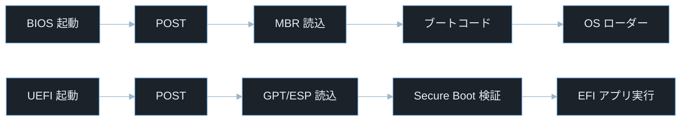
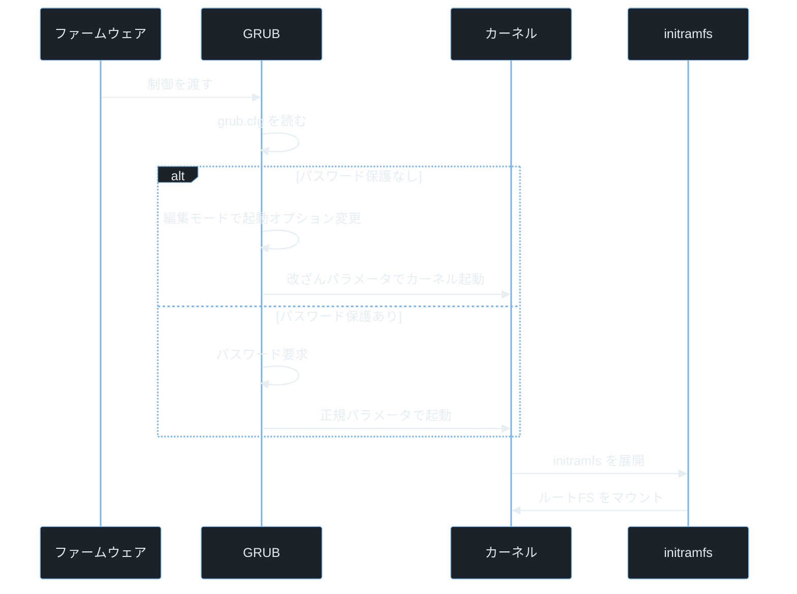

## TL;DR

- コンピュータの電源を入れると **BIOS/UEFI → ブートローダー（GRUB） → カーネル → init/systemd** の順に起動する。各段階で何が行われるかを知ると、ブート時の攻撃（Evil Maid・Secure Boot バイパス・ブートキット）がなぜ成立するかが見えてくる。
- **Secure Boot** は UEFI が署名付きブートローダーのみを許可する仕組みで、ブートローダー改ざんの検出に使う。ただし設定ミスや脆弱な署名があると迂回される（CVE-2020-10713、CVE-2023-24932）。
- ブートプロセスへの攻撃は OS 起動前に行われるため、OS 上の検知ツールでは見えにくい。**TPM・Measured Boot・ディスク暗号化** を組み合わせて物理アクセスからの改ざんを防ぐ。

---

## なぜ重要か

「OS が起動してからしかセキュリティを守れない」という思い込みは正しいか？

**答えはノーだ。ブートプロセスへの攻撃は OS より前の段階で行われるため、OS 上のセキュリティツールは完全に無力になる。** 具体的に挙げると：

- ブートキット（Bootkit）は MBR や EFI パーティションに潜伏し、OS のカーネルが読み込まれる前に悪意あるコードを実行する
- Evil Maid 攻撃は物理アクセスを持つ攻撃者がブートローダーを改ざんし、次回起動時にディスク暗号化のパスフレーズを窃取する
- Secure Boot の脆弱性（BootHole 等）を悪用すると、OS のセキュリティが堅固でも署名検証を回避して任意コードを実行できる
- CTF の Forensics・Pwn カテゴリでは initramfs やディスクイメージを解析してフラグを見つける問題が出題される

> **CTF とは**: Capture The Flag の略。セキュリティ技術を競う演習形式。Forensics はディスクイメージ・ログ・メモリダンプの解析、Pwn はバイナリ脆弱性悪用が主題。

> **ペネトレーションテストとは**: 依頼を受けてシステムへ合法的に侵入テストを行うこと。自組織・許可を得たシステムのみが対象。

---

## 読む前に確認したい用語

難しい用語は出てきたタイミングで解説するが、以下の概念は記事全体を通して何度も登場する。ざっと目を通してから先に進もう。

**ファームウェアとブートローダー**
- **BIOS（Basic Input/Output System）**: マザーボードに書き込まれた最古のファームウェア規格。電源投入直後に CPU が実行する。16 ビットリアルモードで動作し、MBR を読んでブートローダーに制御を渡す。
- **UEFI（Unified Extensible Firmware Interface）**: BIOS の後継。32/64 ビットモードで動作し、GPT をサポートし、Secure Boot・ネットワークブート・GUI を持つ。
- **GRUB（GRand Unified Bootloader）**: Linux 標準のブートローダー。UEFI または BIOS から制御を受け取り、カーネルを選んでメモリに展開する。

**ディスクパーティション構造**
- **MBR（Master Boot Record）**: 従来のディスク先頭 512 バイトの領域。最大 4 つのパーティション・2TB 上限という制約がある。先頭 446 バイトがブートコード。
- **GPT（GUID Partition Table）**: UEFI 時代のパーティション形式。最大 128 パーティション・8ZB 超をサポート。バックアップパーティションテーブルをディスク末尾にも保持する。
- **ESP（EFI System Partition）**: UEFI が読むブートローダーや署名証明書を格納する FAT32 パーティション。Linux では通常 `/boot/efi` にマウントされる。

**セキュリティ機構**
- **Secure Boot**: UEFI がブートローダーのデジタル署名を検証し、信頼されていない署名のコードを拒否する仕組み。
- **TPM（Trusted Platform Module）**: マザーボードに搭載された暗号チップ。ブートの各段階の計測値（ハッシュ）を保存し、改ざん検出に使う。
- **Measured Boot**: ブートの各段階でコードのハッシュを TPM の PCR（Platform Configuration Register）に記録する仕組み。
- **initramfs（initial RAM filesystem）**: カーネル起動直後に一時的にマウントされる RAM ディスク上のルートファイルシステム。本物のルートファイルシステムをマウントするために必要なドライバ・ツールを含む。

**init システム**
- **PID 1**: Linux でカーネルが最初に起動するプロセス。`init` または `systemd` が担う。全てのプロセスはこの子孫になる。
- **systemd**: 現代 Linux の標準 init システム。ユニットファイル（`.service`・`.target`）で起動順序を管理する。
- **runlevel / target**: システムの動作モード。SysV init では数値（0〜6）、systemd では `multi-user.target`・`graphical.target` などで表現する。

---

## 仕組み

### 電源投入からログインまでの全体フロー


各段階が直列に依存しているため、どこか一箇所でも改ざんされると後続の全段階が汚染された状態で動く。これがブートキットの脅威の本質だ。

**計算量まとめ**

ブートプロセスに「計算量」は直接当てはまらないが、各段階のタイムラインを把握しておくと問題の切り分けに役立つ。

- **POST**: 数百ミリ秒〜数秒。ハードウェアの自己診断。
- **GRUB メニュー**: 設定次第で 0〜30 秒。タイムアウトで自動起動。
- **カーネル展開 + initramfs**: 1〜5 秒。ストレージ速度に依存。
- **systemd 起動**: 数秒〜数十秒。起動するサービス数に比例。

**ブートプロセスの弱点 — 信頼の連鎖（Chain of Trust）**

各段階が「前の段階を信頼して実行を引き継ぐ」という設計になっている。一番最初の BIOS/UEFI が正しく動作することを前提とし、そこから先は検証なしに次の段階へ渡す（Secure Boot がない場合）。物理アクセスがあれば ESP の GRUB バイナリを差し替えるだけで後続の全段階を支配できる。

---

### BIOS と UEFI の違い



BIOS は MBR の先頭 446 バイトのブートコードに制御を渡すだけで署名検証を一切行わない。UEFI は ESP 内の EFI アプリケーション（`grubx64.efi` 等）を実行する前に Secure Boot データベースと照合して署名を検証できる。BIOS は署名検証を持たないため改ざんされたブートコードをそのまま実行してしまうが、UEFI は Secure Boot によって信頼の連鎖（Chain of Trust）を構築でき、この違いがブートキット耐性を大きく左右する。

> **POST（Power-On Self Test）とは**: BIOS/UEFI が起動直後に行うハードウェア診断。RAM・CPU・ストレージの基本動作を確認し、問題があればビープ音やエラーコードで知らせる。

**計算量まとめ**

- **MBR ブートコード実行**: 446 バイトを実行。ステージ 2 ローダーをロードするだけ。
- **Secure Boot 検証**: EFI アプリの署名を公開鍵データベース（db）と照合。証明書チェーンの検証を行う。

**BIOS/UEFI の弱点 — ファームウェアの永続性**

UEFI ファームウェア自体に書き込まれたルートキット（UEFI インプラント）は OS の再インストールでは除去できない。2022 年以降に発見された CosmicStrand・MoonBounce 等のマルウェアはこの手法を使う。

---

### GRUB の仕組み



GRUB 起動時に `e` キーを押すと起動オプションを編集できる。パスワード保護がなければ、起動パラメータを改ざんして特権シェルを取得したり、レスキューモードを悪用してシステムへの無制限アクセスを得ることができる。パスワード保護が設定されていない GRUB は物理アクセスがあれば完全に突破される。

> **`grub.cfg` とは**: GRUB の設定ファイル。起動するカーネルのパス・起動オプション・メニューのタイムアウトなどを定義する。通常 `/boot/grub/grub.cfg` に配置される。

**計算量まとめ**

- **grub.cfg 読み込み**: ファイルサイズに比例。通常数 KB。
- **カーネルイメージ展開**: カーネルサイズに依存。`vmlinuz` は圧縮されており展開に CPU 負荷がかかる。

**GRUB の弱点 — 起動パラメータの未保護**

GRUB にパスワードが設定されていない場合、物理アクセスを持つ誰でも起動オプションを編集できる。カーネルの初期プロセスを差し替える起動パラメータ改ざん・シングルユーザーモードの強制起動・initramfs 段階でシェルを呼び出すデバッグパラメータなどが代表的な悪用手法だ。

> **起動パラメータ改ざんの例（参考情報）**: カーネルに渡す引数を変更することで、通常とは異なるプロセスを PID 1 として起動させたり、最小限の管理者モードで起動させたりできる。具体的なパラメータ名は公式 GRUB ドキュメントを参照のこと。

---

### カーネル初期化と initramfs


> **`vmlinuz` とは**: Linux カーネルの圧縮イメージファイル名。`vmlinux`（非圧縮）を `z`（zlib/gzip 等）で圧縮したもの。`/boot/vmlinuz-[バージョン]` として保存される。

initramfs は「一時的な最小 Linux 環境」だ。本物のルートファイルシステムが暗号化されている場合はここでパスフレーズを受け取って復号する。initramfs に改ざんを仕込めば、ディスク暗号化のパスフレーズが盗める（Evil Maid 攻撃の原理）。

**計算量まとめ**

- **initramfs 展開**: 通常数十 MB を RAM に展開。展開速度は CPU に依存。
- **ルートファイルシステムマウント**: 暗号化ありの場合は鍵導出関数（PBKDF2・Argon2）の計算が加わる。

> **PBKDF2 / Argon2 とは**: パスフレーズからディスク暗号化キーを生成する鍵導出関数。意図的に計算コストが高く設計されており、ブルートフォース攻撃を遅くする。LUKS（Linux Unified Key Setup）が使用する。

**initramfs の弱点 — Evil Maid 攻撃**

物理アクセスを持つ攻撃者が initramfs を改ざんし、パスフレーズを記録するコードを仕込む。被害者が次回起動時に暗号化パスフレーズを入力すると、改ざんされた initramfs がそれをログファイルや USB メモリに書き出す。その後攻撃者がデバイスを再度入手してパスフレーズを回収する。Secure Boot + TPM による initramfs の完全性検証がなければこの攻撃を防げない。

---

### systemd の起動順序


> **`target` とは**: systemd でシステムの起動状態を表す単位。従来の SysV init のランレベル（数値）に対応する概念。`multi-user.target` はネットワーク付きのテキストモード、`graphical.target` は GUI 付きの状態を指す。

systemd は各ユニットの依存関係グラフを解析し、並列起動できるサービスを同時に起動することで起動時間を短縮する。`Depends=` や `After=` の設定ミスにより、依存先サービスが完全に起動する前に後続サービスが先に起動してしまう場合があり、レース条件や初期化順序の問題につながる。

**計算量まとめ**

- **依存関係解決**: ユニット数を N とすると概ね O(N) での起動（並列処理によりボトルネックに依存）。
- **ソケットアクティベーション**: サービス本体は接続が来るまで起動しない遅延起動。CPU・メモリの無駄を減らす。

> **ソケットアクティベーションとは**: systemd の機能で、ソケット（ネットワーク接続口）を先に準備しておき、実際にリクエストが来たときにサービスを起動する仕組み。待機時のリソース消費を最小化する。

**systemd の弱点 — ユニットファイルの書き込み権限**

`/etc/systemd/system/` 以下のユニットファイルに書き込み権限を持つ攻撃者は、任意のコマンドを起動時に root として実行できる。侵害後の永続化手法として悪用される典型的なパターンだ。

---

## よくある誤解

実装に進む前に、間違えやすいポイントを整理しておく。「あー、そうか」と思えるものがあれば、コードを書くときに思い出してほしい。

**「BIOS と UEFI は設定画面が違うだけ」**
見た目は似ていても根本的に異なる。BIOS はリアルモード（16 ビット）で動作しディスクアクセスに INT 13h 割り込みを使う。UEFI はプロテクトモード（32/64 ビット）で動作し FAT32 のファイルシステムを直接読める。**Secure Boot・TPM 連携・ネットワークブート** は UEFI のみの機能だ。

**「Secure Boot をオフにすればいいだけ」**
Secure Boot は Linux のデュアルブートを妨げることがあるため「オフにする方法」をネットで検索するユーザーが多い。しかし Secure Boot を無効にすると **ブートローダー改ざんを検出できなくなる**。代わりに Linux の署名付きシムローダー（`shim`）を使えば Secure Boot を有効にしたまま Linux を起動できる。

> **shim とは**: Microsoft の署名を持つ小さなブートローダー。UEFI の Secure Boot データベースには Microsoft の証明書が登録されているため、shim を経由することで独自の Linux ブートローダーに自前の証明書を使える。

**「initramfs はカーネルの一部」**
initramfs はカーネルとは別のアーカイブ（`cpio` 形式 + 圧縮）で、GRUB がカーネルとは独立して渡す。`lsinitramfs /boot/initrd.img-[バージョン]` で中身を確認できる。initramfs を改ざんしてもカーネル自体は変わらない点が Evil Maid 攻撃で重要だ。

> **`cpio` とは**: ファイルをアーカイブする Unix コマンド（copy in/out）。`tar` に似ているが initramfs はこの形式を使う。

**「GRUB パスワードを設定すれば完全に安全」**
GRUB パスワードはメニュー編集・コマンドラインへのアクセスを保護するが、ESP パーティションに物理アクセスできれば GRUB バイナリごと差し替えられる。パスワード設定と同時に **Secure Boot + UEFI のファームウェアパスワード** も設定しないと意味が薄い。

**「systemd の PID 1 がクラッシュしたら何も起動できない」**
PID 1 がクラッシュすると Linux はカーネルパニックを起こして停止する。これはシステムが依存関係の根を失うため正常な挙動だが、攻撃者が意図的に systemd をクラッシュさせてサービス妨害（DoS）を起こす手法としても使われる。`systemd` は非常に堅牢だが、ユニットファイルの `ExecStart` に問題のあるコマンドを書くとサービスが繰り返しクラッシュし続けることがある。

---

## 脆弱なコード例

> 本記事の攻撃例は学習環境・CTF・明示的に許可された検証環境のみで実施してください。
> 実システムへの無断検証は不正アクセス禁止法や各国法令・利用規約違反となる可能性があります。

### PHP — initramfs ビルドスクリプトへのコマンドインジェクション

システム管理 Web UI で initramfs の再生成を行う機能を持つアプリの例。

```php
<?php
$kernel_version = $_GET['version'] ?? '';

$output = shell_exec("update-initramfs -u -k {$kernel_version} 2>&1");
echo "<pre>" . htmlspecialchars($output) . "</pre>";
```

> **`$_GET['version']` とは**: HTTP GET リクエストのクエリパラメータ `version` の値を取得する PHP の超グローバル変数。例えば `/admin?version=5.15.0-91-generic` というリクエストで `$_GET['version']` が `"5.15.0-91-generic"` になる。

> **`update-initramfs -u -k` とは**: Debian/Ubuntu 系で initramfs を更新するコマンド。`-u` は更新（update）、`-k` はカーネルバージョンの指定（kernel）。root 権限で実行される。

**どこが問題か**: `$kernel_version` をそのまま `shell_exec` に渡しているため、`?version=5.15.0;id` のようなペイロードを送るだけで任意コマンドが root として実行できる。initramfs を再生成するコマンドは root 権限で動くため、攻撃者がシステム全体を掌握できる。

```php
<?php
$kernel_version = $_GET['version'] ?? '';

if (!preg_match('/^[0-9]+\.[0-9]+\.[0-9]+-[0-9]+-[a-z]+$/', $kernel_version)) {
    http_response_code(400);
    exit("無効なカーネルバージョン形式です");
}

$safe_version = escapeshellarg($kernel_version);
$output = shell_exec("update-initramfs -u -k {$safe_version} 2>&1");
echo htmlspecialchars($output ?? '', ENT_QUOTES, 'UTF-8');
```

> **`escapeshellarg()` とは**: PHP で文字列をシェルの引数として安全にエスケープする関数。文字列全体をシングルクォートで囲み、シェルのメタ文字を無効化する。

入力を正規表現でカーネルバージョン形式（数値とハイフンとアルファベットのみ）に制限してから `escapeshellarg()` で追加エスケープすることで、二重の防御になる。

---

### Node.js — systemd ユニットファイルの動的生成における書き込み先検証漏れ

```javascript
const express = require('express');
const fs = require('fs');
const path = require('path');
const app = express();
app.use(express.json());

app.post('/service/create', (req, res) => {
    const { name, command } = req.body;
    const unitContent = `[Unit]
Description=${name}

[Service]
ExecStart=${command}

[Install]
WantedBy=multi-user.target
`;
    const unitPath = `/etc/systemd/system/${name}.service`;
    fs.writeFileSync(unitPath, unitContent);
    res.json({ created: unitPath });
});

app.listen(3000);
```

> **`/etc/systemd/system/` とは**: systemd がシステム管理者によって追加されたユニットファイルを探すディレクトリ。ここにファイルを置いて `systemctl enable` すると次回起動時から自動実行される。root 権限で読み書きされる。

> **`fs.writeFileSync(path, content)` とは**: Node.js の `fs` モジュールでファイルを同期的に書き込む関数。ファイルが存在しない場合は作成し、存在する場合は上書きする。

**どこが問題か**: `name` フィールドに `../cron.d/evil` のようなパストラバーサルを指定すると、意図しないディレクトリにファイルを書き込める。さらに `command` フィールドに任意のシェルコマンドを指定でき、次回 `systemctl daemon-reload` のタイミングで root として実行されるバックドアを仕込むだけで済む。

```javascript
const express = require('express');
const fs = require('fs');
const path = require('path');
const app = express();
app.use(express.json());

const UNIT_DIR = '/etc/systemd/system/';
const ALLOWED_NAME = /^[a-zA-Z0-9\-_]{1,64}$/;
const ALLOWED_CMD = /^\/usr\/local\/bin\/[a-zA-Z0-9\-_]+$/;

app.post('/service/create', (req, res) => {
    const { name, command } = req.body;

    if (!ALLOWED_NAME.test(name)) {
        return res.status(400).json({ error: 'サービス名が不正です' });
    }
    if (!ALLOWED_CMD.test(command)) {
        return res.status(400).json({ error: 'コマンドパスが不正です' });
    }

    const unitPath = path.join(UNIT_DIR, `${name}.service`);
    if (!unitPath.startsWith(UNIT_DIR)) {
        return res.status(400).json({ error: 'パストラバーサルを検出しました' });
    }

    const unitContent = `[Unit]\nDescription=${name}\n\n[Service]\nExecStart=${command}\n\n[Install]\nWantedBy=multi-user.target\n`;
    fs.writeFileSync(unitPath, unitContent, { mode: 0o644 });
    res.json({ created: unitPath });
});

app.listen(3000);
```

> **`path.join()` と `startsWith()` の組み合わせ**: `path.join` はパスを正規化（`../` を解決）したうえで結合する。その結果が想定ディレクトリで始まることを `startsWith` で確認することで、パストラバーサルを検出できる。

> **`mode: 0o644` とは**: ファイルの作成時にパーミッションを指定するオプション。`0o` は Python と同じく JavaScript での 8 進数プレフィックス。`644` は「オーナーが読み書き可、グループ・その他は読み取りのみ」を意味する。

サービス名・コマンドパスをホワイトリスト正規表現で制限し、書き込み先ディレクトリをパス正規化後に検証することで、パストラバーサルと任意コマンド注入の両方を防ぐ。

---

### Python — GRUB 設定ファイルの読み取りと機密情報の露出

```python
from flask import Flask, request

app = Flask(__name__)

@app.route('/boot/config')
def get_boot_config():
    config_file = request.args.get('file', 'grub.cfg')
    with open(f'/boot/grub/{config_file}', 'r') as f:
        return f.read()
```

> **`f'/boot/grub/{config_file}'` とは**: Python の f 文字列（フォーマット文字列）でパスを構築している。`config_file` がそのまま埋め込まれるため、パストラバーサルが可能。

**どこが問題か**: `?file=../../etc/shadow` のようなパストラバーサルを送るだけで、`/etc/shadow`（パスワードハッシュが入ったファイル）を読める。また `/boot/grub/grub.cfg` 自体にも暗号化パーティションの UUID・起動オプション・GRUB パスワードハッシュが含まれることがあり、そのまま返すと攻撃者に有益な情報を与える。

```python
import os
from flask import Flask, request, abort

app = Flask(__name__)

BOOT_DIR = '/boot/grub/'
ALLOWED_FILES = {'grub.cfg', 'grubenv'}

@app.route('/boot/config')
def get_boot_config():
    config_file = request.args.get('file', 'grub.cfg')

    if config_file not in ALLOWED_FILES:
        abort(400)

    safe_path = os.path.join(BOOT_DIR, config_file)
    real_path = os.path.realpath(safe_path)

    if not real_path.startswith(os.path.realpath(BOOT_DIR)):
        abort(400)

    with open(real_path, 'r') as f:
        return f.read()
```

> **`os.path.realpath()` とは**: シンボリックリンクを解決して絶対パスを返す Python の関数。`../` を含むパスやシンボリックリンクを全て解決した後で想定ディレクトリと比較することで、パストラバーサルを確実に検出できる。

許可ファイルをホワイトリストで明示し、`os.path.realpath()` でシンボリックリンクを含む全てのパス迂回を解決してから比較することで、パストラバーサルと symlink 攻撃の両方を防ぐ。

---

## 実践例 / 演習例

### ブートプロセスを観察するコマンド群

```bash
systemd-analyze
```

> **`systemd-analyze` とは**: systemd の起動時間を分析するコマンド。全体の起動時間・カーネル初期化時間・initramfs 時間・ユーザースペース起動時間を表示する。`systemd-analyze blame` でサービス別の起動時間も確認できる。

```bash
systemd-analyze blame | head -20
```

> **`head -N` とは**: ファイルやパイプの先頭 N 行だけを表示するコマンド。`head -20` なら先頭 20 行、`head -50` なら先頭 50 行を表示する。大量の出力から最初の部分だけ確認したいときに使う。

```bash
journalctl -b 0 --no-pager | head -50
```

> **`journalctl -b 0` とは**: systemd のジャーナルログから現在のブート（`0` = 今回の起動）のログを表示するコマンド（journal control の略）。`-1` で前回のブート、`-2` で2回前のブートのログを見られる。

```bash
journalctl -b -1 -p err
```

> **`-b [番号]` とは**: `journalctl` でブート（起動セッション）を指定するオプション。`-b 0` が今回の起動、`-b -1` が前回の起動、`-b -2` が 2 回前の起動を指す。クラッシュや障害の直前ログを確認するときに便利。

> **`-p err` とは**: `journalctl` のフィルタオプション。priority（優先度）が `err`（エラー）以上のログだけ表示する。`emerg・alert・crit・err` が対象になる。

### initramfs の中身を確認する

```bash
lsinitramfs /boot/initrd.img-$(uname -r) | head -30
```

> **`lsinitramfs` とは**: initramfs アーカイブの中身を一覧表示するコマンド（list initramfs）。`uname -r` は現在実行中のカーネルバージョンを出力する。

```bash
unmkinitramfs /boot/initrd.img-$(uname -r) /tmp/initramfs_extract/
ls -la /tmp/initramfs_extract/
```

> **`unmkinitramfs` とは**: initramfs アーカイブを展開するコマンド（unmake initramfs）。展開して中身のスクリプト・バイナリを直接確認できる。セキュリティ監査やフォレンジックで initramfs が改ざんされていないか確認するときに使う。

### Secure Boot の状態を確認する

```bash
mokutil --sb-state
```

> **`mokutil` とは**: Machine Owner Key（MOK）を管理するコマンド。`--sb-state` で Secure Boot が有効かどうかを表示する。`SecureBoot enabled` なら Secure Boot が機能している。

```bash
efibootmgr -v
```

> **`efibootmgr` とは**: UEFI のブートエントリを表示・管理するコマンド（EFI boot manager）。`-v` は詳細表示。起動順序・登録されているブートエントリ・ESP 内のブートローダーパスが確認できる。

### GRUB の設定を確認する

```bash
cat /boot/grub/grub.cfg | grep -E "menuentry|set timeout|password"
```

> **`grep -E` とは**: 拡張正規表現（Extended Regular Expression）を使って複数パターンを `｜` でまとめて検索するオプション。`menuentry`（起動エントリ名）・`timeout`（自動起動秒数）・`password`（GRUB パスワード設定）の有無を一度に確認できる。

---

## 防御策

### 1. Secure Boot を有効にし UEFI パスワードを設定する

```bash
mokutil --sb-state
```

Secure Boot が無効の場合は UEFI 設定画面（起動時 F2 / Del / Esc 等）から有効にする。同時にファームウェア設定にアクセスするための **スーパーバイザーパスワード** を設定し、物理アクセスされても UEFI 設定を変更できないようにする。

### 2. GRUB にパスワードを設定する

```bash
grub-mkpasswd-pbkdf2
```

> **`grub-mkpasswd-pbkdf2` とは**: GRUB のパスワードを PBKDF2 でハッシュ化するコマンド。出力されるハッシュ文字列を `/etc/grub.d/40_custom` に追記して `update-grub` を実行する。

```bash
cat >> /etc/grub.d/40_custom << 'EOF'
set superusers="admin"
password_pbkdf2 admin grub.pbkdf2.sha512.10000.[ハッシュ値]
EOF
update-grub
```

> **`>>` と `<< 'EOF'` とは**: `>>` はファイル末尾に追記するシェルのリダイレクト演算子（`>` は上書き、`>>` は追記）。`<< 'EOF'` はヒアドキュメント記法で、`EOF` という終端文字列が現れるまでの複数行テキストを標準入力として渡す。合わせて「指定テキストをファイル末尾に追記する」操作になる。

> **`update-grub` とは**: `/etc/grub.d/` 以下のスクリプトと `/etc/default/grub` の設定から `grub.cfg` を自動生成するコマンド。設定変更後は必ず実行が必要。

### 3. ディスク暗号化（LUKS）を有効にする

```bash
cryptsetup luksFormat /dev/sdb1
cryptsetup luksOpen /dev/sdb1 encrypted_root
mkfs.ext4 /dev/mapper/encrypted_root
```

> **`/dev/sdb1` とは**: Linux でデバイスファイルを指すパス。`/dev/sd` はストレージデバイス、`b` は 2 台目のディスク、`1` は 1 番目のパーティションを意味する。1 台目なら `/dev/sda1`、NVMe SSD なら `/dev/nvme0n1p1` のようになる。演習環境に合わせてデバイス名を確認すること。

> **`cryptsetup` とは**: Linux Unified Key Setup（LUKS）によるディスク暗号化を管理するコマンド。`luksFormat` で暗号化パーティションを初期化、`luksOpen` で復号して `/dev/mapper/` 以下にデバイスを作成する。

### 4. TPM を使った Measured Boot の設定

```bash
tpm2-tools tpm2_pcrread sha256:0,1,2,3,4,5,6,7
```

> **`sha256:0,1,2,3,4,5,6,7` の意味**: `sha256` は PCR の計測に使うハッシュアルゴリズム。`0〜7` は PCR（Platform Configuration Register）番号。PCR 0 は BIOS/UEFI ファームウェア、PCR 1 はファームウェア設定、PCR 4 はブートローダー、PCR 7 は Secure Boot の状態など、ブートの各段階のコードのハッシュがそれぞれ記録される。

> **`tpm2-tools` とは**: TPM 2.0 を操作するコマンド群。`tpm2_pcrread` で PCR（Platform Configuration Register）の値を読み取る。PCR 0〜7 には BIOS/UEFI・ドライバ・ブートローダーのハッシュが順次記録される。

TPM の PCR 値が既知の正常値と異なれば、ブートの何らかの段階で改ざんが発生したことを検出できる。`systemd-cryptenroll` で LUKS キーを TPM に結び付けると、ブートが改ざんされた場合にディスクが自動復号されなくなる。

### 5. systemd ユニットファイルの権限を確認する

```bash
find /etc/systemd/system/ /lib/systemd/system/ \
    -name "*.service" -newer /etc/passwd \
    -exec ls -la {} \;
```

最近変更されたユニットファイルを検出する。変更があれば内容を確認して不審な `ExecStart` がないか調べる。

```bash
systemctl list-units --failed
```

> **`systemctl list-units --failed` とは**: 起動に失敗したユニットの一覧を表示するコマンド。インシデントレスポンスや定期監査で使う。

---

## 実演ラボ案内

### 推奨学習順序

- compile-link-flow（ELF・カーネルモジュールの基礎）
- vm-container-virtualization（仮想化とブートの関係）
- boot-process（本記事）
- linux-permissions（ファイル権限・systemd サービスの権限）
- forensics-disk-analysis（ディスクイメージとブートセクタの解析）

### Hack The Box

- **Challenges — Forensics カテゴリ**: ディスクイメージから MBR・ESP・GRUB 設定を読み取る問題が出題される。`mmls`・`icat`・`autopsy` などのフォレンジックツールと本記事の知識を組み合わせる。
- **Challenges — Reversing カテゴリ**: カーネルモジュール（`.ko` ファイル）の解析問題では ELF 構造と本記事のカーネル初期化の知識が組み合わさる。

> **`mmls` とは**: The Sleuth Kit（TSK）のコマンド。ディスクイメージのパーティション構造（MBR・GPT）を表示する（Media Management List の略）。

> **`icat` とは**: TSK のコマンド。inode 番号を指定してファイルの内容を取り出す。フォレンジックで削除済みファイルの復元にも使う。

### TryHackMe

- **Linux Fundamentals**: systemd・journalctl・ブートパラメータの基礎を練習できる。
- **Disk Analysis & Autopsy**: MBR・パーティションテーブルの読み取りを Autopsy で実践できる。

### 自宅 VM（合法演習）

```bash
virtualbox &
qemu-system-x86_64 -m 2048 -hda disk.img -enable-kvm
```

> **`virtualbox &` とは**: Oracle VirtualBox の GUI を起動するコマンド。末尾の `&` はバックグラウンドで実行するシェル記法で、起動後もターミナルを使い続けられる。

> **`qemu-system-x86_64` とは**: x86-64 アーキテクチャの仮想マシンを起動する QEMU コマンド。`-m 2048` は RAM 2GB、`-hda disk.img` はディスクイメージを指定、`-enable-kvm` は KVM ハードウェア仮想化を有効にする。

VM 内での GRUB 操作・initramfs 改ざん実験はホスト OS に影響しないため安全に実施できる。以下の手順でテスト環境を作れる。

```bash
sudo apt install grub2-common grub-efi-amd64 ovmf
```

> **`ovmf` とは**: UEFI ファームウェアの OSS 実装（Open Virtual Machine Firmware）。QEMU と組み合わせて VM 上で UEFI・Secure Boot のテスト環境を作れる。

---

## 関連 CVE と被害事例

> **CVE とは**: Common Vulnerabilities and Exposures の略。世界共通の脆弱性識別番号。
> **CVSS スコア**: 脆弱性の深刻度を 0.0〜10.0 で評価した指標。7.0 以上が High、9.0 以上が Critical。

**CVE-2020-10713（BootHole — GRUB2 バッファオーバーフロー）**
GRUB2 の設定ファイルパーサー（`grub.cfg`）にバッファオーバーフローが存在し、Secure Boot が有効な環境でも細工した `grub.cfg` を使って任意コードを実行できることが発見された。`grub.cfg` は Secure Boot の署名対象でなかったため、攻撃者が GRUB バイナリは正規のまま設定ファイルだけを改ざんするという迂回が可能だった。攻撃前提: ブートパーティションへの書き込みアクセス（ローカル権限または物理アクセス）が必要。影響を受ける GRUB バイナリを Secure Boot の失効リスト（DBX）に追加する広範な対応が必要となり、パッチ適用が複雑だった。CVSS スコア 8.2（High）。本記事との関連: Secure Boot・GRUB・設定ファイルの重要性

**CVE-2023-24932（Windows Secure Boot バイパス — BlackLotus）**
BlackLotus というブートキットが Windows の Secure Boot をバイパスして UEFI レベルで永続化できることが発見された。攻撃前提: 管理者権限またはデバイスへの物理アクセスが必要。脆弱なバージョンの Windows ブートマネージャーが Secure Boot の検証をすり抜けられるという設計上の問題を悪用し、感染後は OS の再インストールでは除去できない状態になる。修正には Secure Boot の失効リスト更新が必要で、更新を急ぎすぎると古い Windows イメージからのブートができなくなるというトレードオフがあった。CVSS スコア 6.7。本記事との関連: Secure Boot バイパス・ブートキット・UEFI 永続化

**CVE-2021-42553（systemd — `systemd-resolved` のスタックオーバーフロー）**
systemd の DNS リゾルバーコンポーネント `systemd-resolved` に、細工された DNS パケットによるスタックオーバーフロー脆弱性が発見された。攻撃前提: 攻撃者が制御する DNS サーバーへの名前解決リクエストをターゲットが送ること（公衆 Wi-Fi や内部ネットワークへの到達が必要）。`systemd-resolved` は systemd として PID 1 とは別プロセスで動くが、起動時から動作する重要なシステムサービスであり影響範囲が広かった。CVSS スコア 7.5（High）。本記事との関連: systemd サービス・init プロセス・起動時サービスの脆弱性

---

## 次に学ぶべき記事

- **linux-permissions** — ファイルパーミッション・SUID・systemd ユニットファイルの権限設定
- **forensics-disk-analysis** — ディスクイメージから MBR・パーティションテーブル・削除済みファイルを復元するフォレンジック実践
- **kernel-modules** — Linux カーネルモジュールの仕組みと、rootkit がカーネルモジュールとして実装される原理

---

## 参考文献

- GNU. "GNU GRUB Manual". https://www.gnu.org/software/grub/manual/grub/grub.html
- UEFI Forum. "UEFI Specification". https://uefi.org/specifications
- Linux Kernel. "initramfs". https://www.kernel.org/doc/html/latest/driver-api/early-userspace/buffer-format.html
- systemd. "systemd System and Service Manager". https://systemd.io/
- OWASP. "Path Traversal". https://owasp.org/www-community/attacks/Path_Traversal
- NVD. "CVE-2020-10713 Detail (BootHole)". https://nvd.nist.gov/vuln/detail/CVE-2020-10713
- NVD. "CVE-2023-24932 Detail (BlackLotus)". https://nvd.nist.gov/vuln/detail/CVE-2023-24932
- NVD. "CVE-2021-42553 Detail". https://nvd.nist.gov/vuln/detail/CVE-2021-42553
- Microsoft. "Secure Boot". https://learn.microsoft.com/en-us/windows-hardware/design/device-experiences/oem-secure-boot
- Eclypsium. "BootHole: There's a Hole in the Boot". https://eclypsium.com/2020/07/29/theres-a-hole-in-the-boot/
