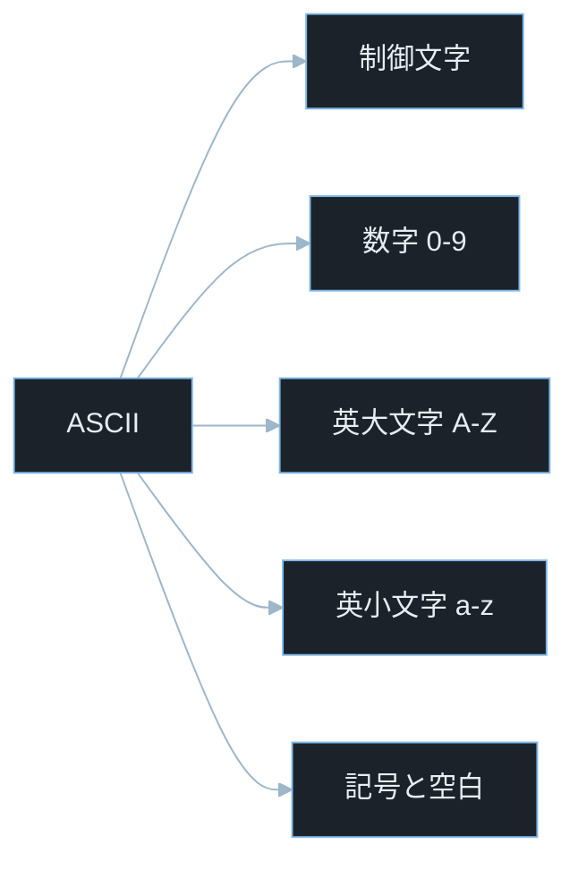
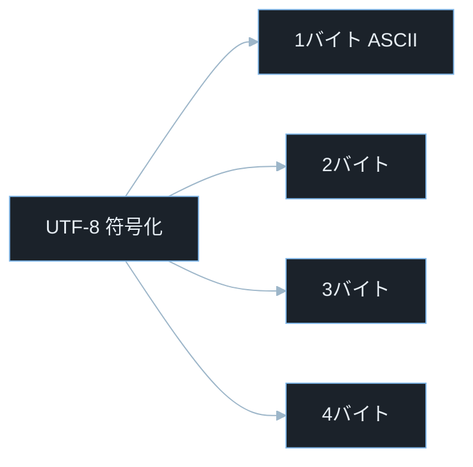
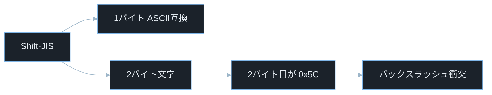
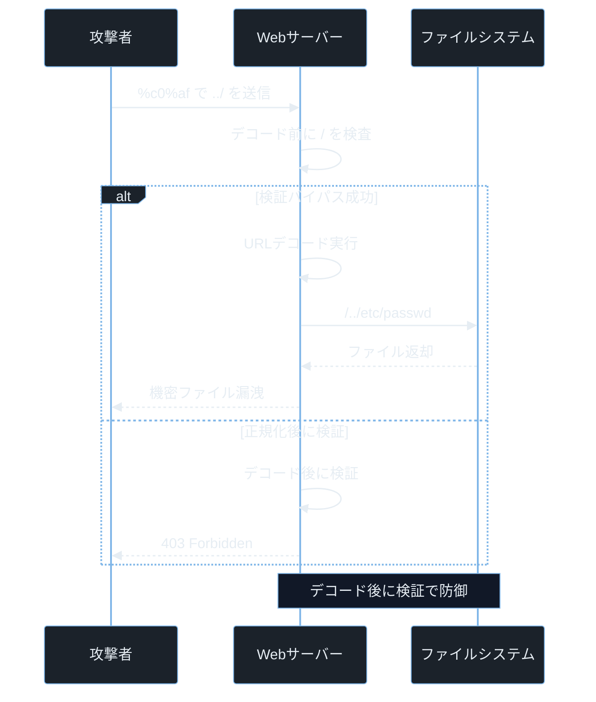

## TL;DR

- 文字コード（エンコーディング）とは「文字を数値（バイト列）に変換するルール」だ。ASCII・UTF-8・Shift-JIS はそれぞれ異なるルールを持ち、同じバイト列を別の文字に解釈することがある。
- この「解釈の違い」を悪用すると、セキュリティチェックを通過した入力が内部処理でまったく別の文字に化ける。結果として SQL インジェクション・パストラバーサル・フィルターバイパスが成立する。
- Web アプリは入力の文字コードを統一し、URLデコード後・正規化後に検証し、出力時に適切なエスケープを施すことで防御できる。

> **本記事で前提とする用語の超ざっくり整理**
> - **文字コード（エンコーディング）**: 文字を数値（バイト列）に変換・復元するためのルール。以降「文字コード」で統一する。
> - **コードポイント（Code Point）**: Unicode で各文字に割り当てられた番号。`A` のコードポイントは `U+0041`、`あ` は `U+3042`。
> - **ASCII**: 0〜127（7 ビット）の番号に英数字・制御文字を割り当てた最古の文字コード規格。
> - **UTF-8**: Unicode のコードポイントを 1〜4 バイトで表す可変長符号。ASCII の `0x00`〜`7F` はそのまま使え、日本語は 3 バイト、絵文字は 4 バイトになる。現在の Web 標準。UTF-16 など ASCII 非互換な文字コードも存在するため「すべての文字コードが ASCII 互換」というわけではない。
> - **Shift-JIS**: 日本語を表すために作られた 1〜2 バイトの可変長符号。一部の 2 バイト文字の 2 バイト目が `0x5C`（ASCII のバックスラッシュ `\`）と一致するため、バイト操作でバグが起きやすい。
> - **GBK**: 中国語向けの可変長文字コード。Shift-JIS と同様にマルチバイト文字処理由来の脆弱性で頻繁に登場する。
> - **URLエンコード（パーセントエンコーディング）**: URL に使えない文字を `%XX`（16 進数 2 桁）形式へ変換する仕組み。`/` → `%2F`、`.` → `%2E` など。
> - **Unicode 正規化（Normalization）**: 見た目が同じだが異なるコードポイントで表現された文字を統一する処理。`NFKC` 形式では `ａ`（全角 a）が `a`（半角 a）に変換される。
> - **オーバーロング UTF-8（Overlong Encoding）**: 本来 1 バイトで表せる文字を、わざと 2 バイト以上で表した不正な UTF-8。古い実装では通常の文字として処理されることがあり、セキュリティチェックのバイパスに悪用された。
> - **BOM（Byte Order Mark）**: ファイル先頭に置いてエンコードを示すバイト列。UTF-8 の BOM は `0xEF 0xBB 0xBF`。
> - **CVSS**: 脆弱性の深刻度を 0.0〜10.0 で数値化する評価指標。9.0 以上が Critical。
> - **CTF**: Capture The Flag。Web カテゴリでは文字コードの知識が必須な問題が頻出する。

---

## なぜ重要か

Web アプリのセキュリティチェックは多くの場合「文字列レベル」で行われる。`../` が含まれていないか、`'` が含まれていないかを文字列として確認する。しかし「同じバイト列が、どの文字コードとして解釈するかで別の文字に見える」という問題が起きると、チェックを通過した入力が内部処理でまったく別の文字に化ける。

具体的な被害パターンを挙げる。

- **パストラバーサル**: `/` を `0xC0 0xAF`（オーバーロング UTF-8）でエンコードして送ると、文字列チェックは `/` を検出できず通過させる。内部でURLデコードするとパス区切りになり `../etc/passwd` へアクセスされる（CVE-2000-0884）。
- **SQL インジェクション**: Shift-JIS や GBK の一部文字は 2 バイト目が `0x5C`（バックスラッシュ）になる。`addslashes()` でエスケープしても、バイト境界のずれでクォートが有効になる。
- **フィルターバイパス**: 「`../` を除去した」後に Unicode 正規化を行うと、除去前は全角の `．．／` だったものが正規化後に `../` に変化してパストラバーサルが成立する。
- **文字化けによる認証バイパス**: 入力時と検索時で異なる文字コードを使うと、別のユーザー名が同一に見えてアカウント乗っ取りにつながる。

---

## 仕組み

### ASCII — すべての基礎

ASCII は 1963 年に制定された 7 ビット（0〜127）の文字コードだ。英小文字・大文字・数字・記号・制御文字が含まれる。

この図は ASCII が扱う文字の種類分類を示している。



セキュリティ上重要な値を押さえておく。

- `0x00`〜`0x1F`: 制御文字（改行 `0x0A`、キャリッジリターン `0x0D`、ヌル文字 `0x00` など）
- `0x41`〜`0x5A`: 大文字 A〜Z（`A` = `0x41`）
- `0x61`〜`0x7A`: 小文字 a〜z
- `0x2F`: スラッシュ `/`（パス区切り）
- `0x5C`: バックスラッシュ `\`（Windows パス区切り・SQL エスケープ）
- `0x27`: シングルクォート `'`（SQL 文字列区切り）

> **`0x` 接頭辞とは**: 16 進数であることを示すマーカー。`0x41` は 10 進数の 65 で、ASCII の `A` に対応する。`binary-hex-bitwise` の記事で詳しく解説している。

### UTF-8 — 可変長の世界標準

UTF-8 は Unicode のコードポイントを 1〜4 バイトで表す。先頭バイトのビットパターンが何バイト使うかを示す。

この図は文字のコードポイント範囲によって UTF-8 が使うバイト数が変わることを示している。



各バイト数に対応するコードポイント範囲とビットパターン:

**1 バイト（ASCII と完全互換）**: `U+0000`〜`U+007F`
先頭ビットが `0` の形式: `0xxxxxxx`。例: `A` = `0x41`

**2 バイト**: `U+0080`〜`U+07FF`
形式: `110xxxxx 10xxxxxx`（先頭が `110`、継続バイトが `10` で始まる）。例: `é` (`U+00E9`) = `0xC3 0xA9`

**3 バイト**: `U+0800`〜`U+FFFF`（日本語のひらがな・漢字など）
形式: `1110xxxx 10xxxxxx 10xxxxxx`。例: `あ` (`U+3042`) = `0xE3 0x81 0x82`

**4 バイト**: `U+10000`〜`U+10FFFF`（絵文字など）
形式: `11110xxx 10xxxxxx 10xxxxxx 10xxxxxx`。例: 😀 (`U+1F600`) = `0xF0 0x9F 0x98 0x80`

> **継続バイトとは**: UTF-8 の 2〜4 バイト文字において、先頭バイト以外のバイト。`10xxxxxx` のビットパターン（先頭 2 ビットが `10`）を持つ。先頭バイトの後にしか現れてはならない。この制約を守らない「不正な UTF-8」が攻撃に使われる。

### オーバーロング UTF-8 — 古い実装を騙す不正表現

`/`（U+002F）は本来 `0x2F` の 1 バイトで表す。しかし UTF-8 の 2 バイト形式を無理やり使うと `0xC0 0xAF` でも書けてしまう。これが「オーバーロング UTF-8」だ。

```
正規 UTF-8: /  → 0x2F
オーバーロング: /  → 0xC0 0xAF  （古い実装ではこれも / と解釈した）
             /  → 0xE0 0x80 0xAF （3バイト形式の悪用）
```

現代の正規の UTF-8 デコーダはこれを「不正な入力」として拒否する。しかし CVE-2000-0884 の IIS 5.0 などの古い実装はデコードして `/` として使用した。フィルターは `0x2F` だけ検査しているため、`0xC0 0xAF` はスルーされてパストラバーサルが成立した。

### Shift-JIS — 2 バイト目がバックスラッシュになる日本語文字コード

この図は Shift-JIS の文字種と、2 バイト文字の一部が `0x5C`（バックスラッシュ）を 2 バイト目として持つ構造を示している。



Shift-JIS は 1 バイト（ASCII 互換）または 2 バイトの可変長符号だ。

> **`0x5C` が危険な理由**: `0x5C` は ASCII のバックスラッシュ `\` と完全に同じバイト値だ。一方 Shift-JIS では日本語文字の 2 バイト目としても出現する。バイト操作ライブラリは「文字の境界」ではなく「バイト単位」で処理するため、日本語文字の 2 バイト目に `0x5C` が現れたとき、それを「バックスラッシュ」と誤解して処理してしまうことがある。この二重解釈が SQL インジェクションの原因になる。

例:
- `ソ`（カタカナ）: Shift-JIS では `0x83 0x5C`。2 バイト目が `\`
- `十`（漢字）: Shift-JIS では `0x8F 0x5C`。2 バイト目が `\`

### Unicode 正規化 — 見た目同じ・コードポイント違い

Unicode には同じ文字に見えるが異なるコードポイントを持つ文字が多数存在する。

- `a`（0x61、ASCII の a）と `ａ`（U+FF41、全角の a）
- `/`（0x2F、ASCII のスラッシュ）と `∕`（U+2215、Division Slash）・`／`（U+FF0F、全角スラッシュ）
- `.`（0x2E、ASCII のピリオド）と `．`（U+FF0E、全角ピリオド）

NFKC 正規化を適用すると、全角文字や特殊な形が半角 ASCII に変換される。

> **NFKC 正規化とは**: Unicode の標準的な正規化形式の一つ（Normalization Form KC）。互換性分解（Compatibility Decomposition）の後に標準合成（Canonical Composition）を行う。全角英数字→半角変換、特殊スラッシュ→通常スラッシュなどが起きる。

### 攻撃フロー — オーバーロング UTF-8 によるパストラバーサル

この図は「攻撃者が `%c0%af` でスラッシュをオーバーロング表現した場合に、URLデコード前の検証では通過し、内部でURLデコードされてパストラバーサルが成立する流れ」と「URLデコード後に検証する正しい実装でブロックされる流れ」を示している。

**見るポイント**:
- URLデコード前の検査と後の検査で結果がどう変わるか
- `%c0%af` は `0xC0 0xAF` のパーセントエンコードで、古い実装では `/` に解釈された
- デコード後に検証することでバイパスを防げる



---

## 脆弱なコード例

> 本記事の攻撃例は学習環境・CTF・明示的に許可された検証環境のみで実施してください。
> 実システムへの無断検証は不正アクセス禁止法や各国法令、利用規約違反となる可能性があります。

### PHP — Shift-JIS / GBK 文字コードを使った addslashes() バイパス

```php
<?php
header('Content-Type: text/html; charset=Shift_JIS');

$db = new mysqli('localhost', 'user', 'pass', 'testdb');
$db->set_charset('sjis');

$name = addslashes($_GET['name'] ?? '');
$sql = "SELECT * FROM users WHERE name = '$name'";
$result = $db->query($sql);
```

> **`mysqli` とは**: PHP から MySQL を操作するための拡張ライブラリ（MySQL Improved Extension の略）。`new mysqli()` でデータベースに接続し、`query()` で SQL を実行する。
> **`addslashes()`**: PHP でシングルクォート `'`・ダブルクォート `"`・バックスラッシュ `\`・ヌル文字 `\0` の前に `\` を挿入する関数。SQL インジェクション対策として使われることがあるが、マルチバイト文字環境では不十分だ。

**問題点（Shift-JIS バックスラッシュ問題）**:

Shift-JIS の文字 `ソ` は 2 バイト `[0x83, 0x5C]` で表される。`0x5C` は ASCII のバックスラッシュと同じバイト値だ。

攻撃者が `ソ'`（`[0x83, 0x5C, 0x27]`）を送った場合:

`addslashes()` はバイト単位で処理するため `0x5C` をバックスラッシュとして認識してエスケープする。処理後のバイト列は `[0x83, 0x5C, 0x5C, 0x5C, 0x27]` になる。

MySQL の Shift-JIS パーサーがこれを読むと:
- `[0x83, 0x5C]` → 文字 `ソ`（1 文字として消費）
- `[0x5C, 0x5C]` → エスケープされたバックスラッシュ `\\`（リテラルの `\`）
- `[0x27]` → シングルクォート `'`（**エスケープされていない！**）

クォートが有効になり SQL インジェクションが成立する。GBK も同様で、`0xBF 0x5C` が 1 文字として消費されクォートが残る。

**防御策:**

```php
<?php
$dsn = 'mysql:host=localhost;dbname=testdb;charset=utf8mb4';
$db = new PDO($dsn, 'user', 'pass', [
    PDO::ATTR_EMULATE_PREPARES => false,
]);

$stmt = $db->prepare("SELECT * FROM users WHERE name = ?");
$stmt->execute([$_GET['name'] ?? '']);
$result = $stmt->fetchAll();
```

> **`PDO` とは**: PHP Data Objects の略。PHP のデータベースアクセス統一インターフェースで、MySQL・PostgreSQL・SQLite など複数のデータベースを同じ API で扱える。
> **`PDO::ATTR_EMULATE_PREPARES => false`**: PHP の PDO でプリペアドステートメントをサーバー側で実行するよう強制するオプション。`false` にしないとクライアント側でエミュレーションが行われ、エスケープ処理が挟まるためマルチバイト問題が残る可能性がある。
> **プリペアドステートメント**: SQL 文とデータを分離して DB に送る仕組み。SQL の構造は先に送って確定させ、データは後から別経路で渡す。文字コードに関わらず SQL インジェクションを防げる。

接続には `charset=utf8mb4` を使い、アプリ全体で文字コードを UTF-8 に統一する。`SET NAMES sjis` のような Shift-JIS / GBK 接続は避ける。

---

### Node.js — 生 URL とデコード済み文字列の混在によるパストラバーサル

Express などのフレームワークは `req.query` に URLデコード済みの値を渡す。生の URL（URLデコード前）を使ってパスを検証しても、実際に使う値がデコード済みだと検証が空振りになる。

```javascript
const express = require('express');
const path = require('path');
const fs = require('fs');
const app = express();

const BASE_DIR = '/var/www/files/';

app.get('/file', (req, res) => {
    const rawUrl = req.url;

    if (rawUrl.includes('../') || rawUrl.includes('..\\')) {
        return res.status(400).send('不正なパス');
    }

    const filename = req.query.name || '';
    const filePath = path.join(BASE_DIR, filename);

    try {
        res.send(fs.readFileSync(filePath, 'utf8'));
    } catch {
        res.status(404).send('ファイルが見つかりません');
    }
});

app.listen(3000);
```

> **`req.url`**: Express でリクエストの生 URL 文字列（URLデコード前）を参照するプロパティ。
> **`req.query.name`**: Express でクエリパラメータをURLデコード済みの値として取得するプロパティ。フレームワークが内部で `decodeURIComponent()` を適用している。

**問題点**: `rawUrl` を使ってパスを検査しているが、実際に使う `filename` は `req.query.name`（URLデコード済み）だ。フレームワークやミドルウェアによっては既にデコード済みの値が渡される場合がある。

```
?name=%2E%2E%2Fetc%2Fpasswd
→ rawUrl: "/file?name=%2E%2E%2Fetc%2Fpasswd"（../ がないので検査通過）
→ req.query.name: "../etc/passwd"（Express がデコード済み）
→ filePath: "/etc/passwd"
```

生 URL とデコード済み値の「どちらを使って検証し、どちらを実際の処理に使うか」が一致していないことがこの問題の本質だ。

**防御策:**

```javascript
const BASE_DIR = path.resolve('/var/www/files');

app.get('/file', (req, res) => {
    const filename = req.query.name || '';

    const filePath = path.resolve(BASE_DIR, filename);

    if (!filePath.startsWith(BASE_DIR + path.sep)) {
        return res.status(403).send('アクセス禁止');
    }

    try {
        res.send(fs.readFileSync(filePath, 'utf8'));
    } catch {
        res.status(404).send('ファイルが見つかりません');
    }
});
```

> **`path.resolve()`**: 与えられたパス要素を結合して絶対パスに変換する Node.js 関数。`../` も解決される。その後 `startsWith(BASE_DIR)` で許可ディレクトリ内かを確認することで、URLエンコードに依存しない安全な検証が実現できる。
> **`path.sep`**: OS のパス区切り文字（Linux では `/`、Windows では `\\`）を返すプロパティ。末尾に付けて比較することで `/var/www/files-extra` のような隣接ディレクトリへの誤許可を防ぐ。

重要なのは「**検証と実際の処理で同じ値を使う**」ことだ。

---

### Python — Unicode 正規化の前にフィルターを適用するバイパス

```python
from flask import Flask, request
import os

app = Flask(__name__)
BASE_DIR = '/var/www/profiles/'

@app.route('/profile')
def get_profile():
    username = request.args.get('user', '')

    if '/' in username or '..' in username or '\\' in username:
        return 'Invalid username', 400

    import unicodedata
    normalized = unicodedata.normalize('NFKC', username)

    path = os.path.join(BASE_DIR, normalized)
    try:
        with open(path) as f:
            return f.read()
    except FileNotFoundError:
        return 'Not found', 404
```

> **`unicodedata.normalize('NFKC', text)`**: Python 標準ライブラリの Unicode 正規化関数。`NFKC` モードでは全角文字を半角に変換するなど「互換等価な文字を統一する」処理が行われる。正規化後、見た目が違っていたが意味が同じ文字が同一のバイト列になる。

**問題点**: フィルターを**正規化の前**に適用しているため、正規化後に危険な文字に変わる入力が通過する。

攻撃者は次のような全角（または特殊 Unicode）文字を使って `../etc/passwd` を表現できる。

- `．．／etc／passwd`（全角ピリオドと全角スラッシュ）
  - `．` は U+FF0E（FULLWIDTH FULL STOP）→ NFKC で `.` に変換
  - `／` は U+FF0F（FULLWIDTH SOLIDUS）→ NFKC で `/` に変換

フィルターは ASCII の `/` と `..` だけを見ているため全角版をスルーする。正規化後は `../etc/passwd` になりパストラバーサルが成立する。

**防御策:**

```python
import re
import unicodedata
import os
from flask import Flask, request

app = Flask(__name__)
BASE_DIR = os.path.realpath('/var/www/profiles')

@app.route('/profile')
def get_profile():
    username = request.args.get('user', '')

    normalized = unicodedata.normalize('NFKC', username)

    if not re.fullmatch(r'[A-Za-z0-9_.\-]+', normalized):
        return 'Invalid username', 400

    resolved = os.path.realpath(os.path.join(BASE_DIR, normalized))

    if not resolved.startswith(BASE_DIR + os.sep):
        return 'Access denied', 403

    try:
        with open(resolved) as f:
            return f.read()
    except FileNotFoundError:
        return 'Not found', 404
```

> **`re.fullmatch(r'[A-Za-z0-9_.\-]+', text)`**: 文字列全体が正規表現にマッチするか確認する Python 関数。`[A-Za-z0-9_.\-]+` は英数字・アンダースコア・ピリオド・ハイフンのみを許可する許可リスト方式。正規化した後に検証することでバイパスを防げる。
> **`os.path.realpath()`**: シンボリックリンクと `../` を解決して絶対パスを返す Python 関数。Node.js の `path.resolve()` に対応する。

**処理の正しい順序**: 正規化 → フィルター → `realpath()` → 許可ディレクトリ内チェック → 使用。この順序を守ることでどの段階のバイパスも防げる。

---

## 実践例 / 演習例

### Python で UTF-8 バイト列を確認する

```python
chars = ['A', 'é', 'あ', '😀']
for c in chars:
    encoded = c.encode('utf-8')
    hex_bytes = ' '.join(f'0x{b:02X}' for b in encoded)
    print(f"'{c}' U+{ord(c):04X} → {hex_bytes} ({len(encoded)}バイト)")
```

> **`f'0x{b:02X}'`**: Python の f-string フォーマット指定子。`b` を 16 進数・2 桁・大文字（`X`）で表示する。`{b:02X}` の `02` は「最低 2 桁、足りない場合は 0 埋め」を意味する。

### オーバーロング UTF-8 を検証する

```python
overlong_slash = bytes([0xC0, 0xAF])
print(f"オーバーロング /: {overlong_slash.hex()}")

try:
    decoded = overlong_slash.decode('utf-8', errors='strict')
    print(f"デコード結果: {decoded}")
except UnicodeDecodeError as e:
    print(f"正常: 不正な UTF-8 として拒否 → {e}")
```

> **`errors='strict'`**: Python の `decode()` で不正なバイト列を例外（`UnicodeDecodeError`）として拒否するモード。デフォルト値。`errors='ignore'`（無視）や `errors='replace'`（`?` に置換）より安全なのでセキュリティ用途ではこちらを使う。

### Shift-JIS で 0x5C を持つ文字を確認する

```python
test_chars = ['ソ', '噂', '廼']
for c in test_chars:
    try:
        encoded = c.encode('shift_jis')
        hex_bytes = ' '.join(f'{b:02X}' for b in encoded)
        has_5c = 0x5C in encoded
        print(f"'{c}': {hex_bytes} {'← 2バイト目が 0x5C !' if has_5c else ''}")
    except UnicodeEncodeError:
        print(f"'{c}': Shift-JIS で表現不可")
```

### Unicode 正規化の効果を確認する

```python
import unicodedata

variants = [
    ('全角スラッシュ', '／'),
    ('全角ピリオド', '．'),
    ('全角 a', 'ａ'),
    ('Division Slash', '∕'),
]

for name, char in variants:
    nfkc = unicodedata.normalize('NFKC', char)
    print(f"{name}: '{char}' (U+{ord(char):04X}) → '{nfkc}' (U+{ord(nfkc):04X})")
```

### URLエンコードの実験

```python
import urllib.parse

payload = '../etc/passwd'
encoded = urllib.parse.quote(payload, safe='')
double_encoded = urllib.parse.quote(encoded, safe='')
print(f"元: {payload}")
print(f"1重エンコード: {encoded}")
print(f"2重エンコード: {double_encoded}")
```

> **`urllib.parse.quote(payload, safe='')`**: Python で文字列を URLエンコードする関数。`safe=''` を指定することで `/` も含むすべての非英数字文字をエンコードする。デフォルト（`safe='/'`）では `/` はエンコードされないため、パストラバーサルの実験では `safe=''` を指定する。
> **二重エンコードとは**: `%2F`（スラッシュ）を URLエンコードした `%252F` のこと。`%25` が `%` にURLデコードされ、その後 `%2F` が `/` にURLデコードされる。一段目のURLデコードしか行わないサーバーではスルーされる。

---

## 防御策

### 1. アプリ全体で UTF-8 に統一する

Shift-JIS・EUC-JP・GBK などは特殊なバイト値問題を持つ。新規開発では全ての層（HTTP ヘッダ・DB 接続・ファイル I/O）を UTF-8 に統一する。

```php
<?php
mb_internal_encoding('UTF-8');
header('Content-Type: text/html; charset=UTF-8');
```

```bash
# MySQL の場合
# /etc/mysql/mysql.conf.d/mysqld.cnf に追記
# character-set-server = utf8mb4
# collation-server = utf8mb4_unicode_ci
```

### 2. 検証は必ずURLデコード後・正規化後に行う

**処理の正しい順序**:
- URLデコード → 正規化 → 検証 → 使用

**誤った順序（バイパスされる）**:
- 検証 → URLデコード → 使用（URLエンコードバイパス）
- 検証 → 正規化 → 使用（正規化バイパス）

```python
import unicodedata, os, re

def safe_path(user_input: str, base_dir: str) -> str:
    normalized = unicodedata.normalize('NFKC', user_input)
    if not re.fullmatch(r'[A-Za-z0-9_.\-]+', normalized):
        raise ValueError("不正な入力")
    resolved = os.path.realpath(os.path.join(base_dir, normalized))
    if not resolved.startswith(os.path.realpath(base_dir) + os.sep):
        raise ValueError("パストラバーサルを検出")
    return resolved
```

### 3. SQL には必ずプリペアドステートメントを使う

文字コードに関わらず、SQL のデータはプリペアドステートメントで分離する。`addslashes()`・`mysql_real_escape_string()` はマルチバイト問題があるため使わない。

```python
import sqlite3
conn = sqlite3.connect('test.db')
username = "' OR '1'='1"
cursor = conn.execute("SELECT * FROM users WHERE name = ?", (username,))
```

### 4. UTF-8 の厳格な検証を行う

不正な UTF-8（オーバーロング・サロゲートペア・コードポイント外）を受け入れない。

```python
def is_valid_utf8(data: bytes) -> bool:
    try:
        data.decode('utf-8', errors='strict')
        return True
    except UnicodeDecodeError:
        return False
```

### 5. Content-Type と charset を明示する

HTTP レスポンスで `Content-Type: text/html; charset=UTF-8` を必ず指定する。未指定の場合ブラウザが自動判定し、XSS が成立するケースがある（UTF-7 XSS が代表例）。

> **UTF-7 XSS とは**: UTF-7 という古い文字コードを悪用して HTML エスケープ済みの `+ADw-script+AD4-` のような文字列が、ブラウザが UTF-7 と判断した場合に `<script>` として実行される攻撃。`charset=UTF-8` の明示で防げる。

---

## 実演ラボ案内

### 推奨学習順序

- binary-hex-bitwise（16 進数・バイト列の基礎）
- character-encoding（本記事）
- パストラバーサル実践
- SQL インジェクション実践（マルチバイト環境含む）

### Hack The Box

- **Challenges — Web カテゴリ**: `Path Traversal` 系問題で URLエンコードバイパスが頻出する。`%2E%2E%2F` や `%252E%252E%252F`（二重エンコード）を試す問題がある。

### TryHackMe

- **Web Fundamentals**: HTTP の文字コードと URLエンコードの基礎を練習できる。
- **OWASP Top 10**: インジェクション系の問題で文字コードの知識が使える。

### 自宅 VM（合法演習）

```bash
python3 -c "
import urllib.parse
payload = '../etc/passwd'
encoded = urllib.parse.quote(payload, safe='')
double = urllib.parse.quote(encoded, safe='')
print('1重:', encoded)
print('2重:', double)
"
```

---

## よくある誤解

**誤解 1: 「UTF-8 を使えば文字コード問題は起きない」**
UTF-8 を使ってもURLデコードの順序・正規化の順序・ライブラリの設定が正しくなければ攻撃は成立する。文字コードの統一はあくまで必要条件であり、十分条件ではない。

**誤解 2: 「addslashes() は PHP でも MySQL でも安全なエスケープ」**
Shift-JIS・GBK 接続では `addslashes()` がバイパスされる。プリペアドステートメントを使えば文字コードに関わらず安全だ。

**誤解 3: 「URLデコードは自動で安全に処理される」**
Web フレームワークは多くの場合 URL をURLデコードしてからルーティングに渡す。しかし「生 URL を使って検証し、URLデコード済みの値を実際の処理に使う」というパターンは検証が空振りになる。検証と実際の処理で同じ値を使うことが重要だ。

**誤解 4: 「全角文字はセキュリティ上無害」**
全角 `.` や全角 `/` は NFKC 正規化で半角に変わり、フィルターをすり抜けてパストラバーサルやインジェクションに使われる。見た目で安全性を判断してはいけない。

**誤解 5: 「BOM 付き UTF-8 ファイルは問題ない」**
UTF-8 の BOM (`0xEF 0xBB 0xBF`) は不要だ。一部のパーサーは BOM を文字列の一部として扱い、先頭一致の比較や JSON パースで予期しない動作を起こす。PHP の場合、BOM 付き `.php` ファイルは `header()` より先に BOM が出力されてヘッダ送信後のエラーになることがある。

---

## 関連 CVE と被害事例

> **CVE とは**: Common Vulnerabilities and Exposures の略。世界共通の脆弱性識別番号。
> **CVSS スコア**: 脆弱性の深刻度を 0.0〜10.0 で評価した指標。9.0 以上が Critical。

**CVE-2000-0884（IIS 5.0 — オーバーロング UTF-8 によるパストラバーサル）**
Microsoft IIS 5.0 がオーバーロング UTF-8 シーケンス（`%c0%af` = `0xC0 0xAF`・`%c0%ae` = `0xC0 0xAE`）を受け入れ、`../` チェックを回避したパストラバーサルが成立した。攻撃者が Web ルート外のファイル閲覧やスクリプト実行を行えた。本記事との関連: オーバーロング UTF-8・URLデコード前検証

**CVE-2021-41773（Apache httpd 2.4.49 — URLエンコードによるパストラバーサル）**
Apache HTTP Server 2.4.49 で `%2e` による `.` のエンコードがパストラバーサルチェックをすり抜けた。さらに CGI が有効な環境ではリモートコード実行（RCE: Remote Code Execution）にまで発展した。CVSS スコア 9.8。本記事との関連: URLエンコードバイパス・URLデコード前検証

> **RCE（Remote Code Execution）とは**: 遠隔から任意のコードを実行できる状態。パストラバーサルと組み合わさると CGI スクリプトを呼び出せるため最大級の影響になる。

**CVE-2008-2938（Apache Tomcat — UTF-8 パストラバーサル）**
Apache Tomcat が `%c0%ae`（オーバーロング UTF-8 の `.`）を受け入れ、`../` チェックを回避するパストラバーサルが成立した。Web アプリのコンテキスト外にあるファイルへのアクセスが可能だった。CVSS スコア 4.3。本記事との関連: オーバーロング UTF-8・マルチバイト処理

---

## 次に学ぶべき記事

- **パストラバーサル完全解説** — 本記事で学んだエンコードバイパスを使った実際のパス操作攻撃の詳細
- **SQL インジェクション入門** — マルチバイト環境での SQL エスケープバイパスをさらに深掘りする
- **XSS 完全解説** — UTF-7 XSS など文字コードを悪用した Cross-Site Scripting の手法

---

## 参考文献

- Unicode Consortium. "Unicode Standard". https://www.unicode.org/standard/standard.html
- WHATWG. "Encoding Standard". https://encoding.spec.whatwg.org/
- NVD. "CVE-2000-0884 Detail". https://nvd.nist.gov/vuln/detail/CVE-2000-0884
- NVD. "CVE-2021-41773 Detail". https://nvd.nist.gov/vuln/detail/CVE-2021-41773
- NVD. "CVE-2008-2938 Detail". https://nvd.nist.gov/vuln/detail/CVE-2008-2938
- OWASP. "Path Traversal". https://owasp.org/www-community/attacks/Path_Traversal
- Python Docs. "unicodedata — Unicode Database". https://docs.python.org/3/library/unicodedata.html
