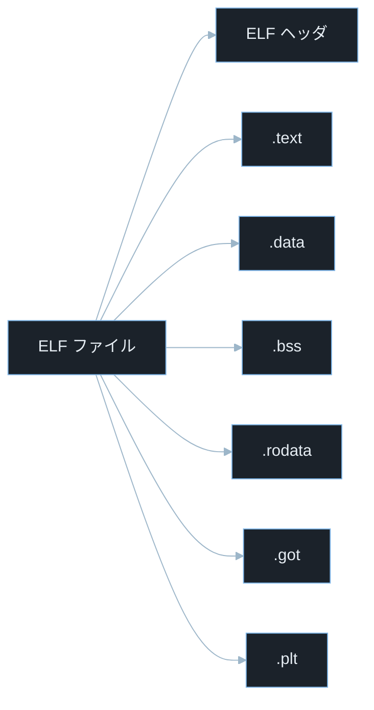

## TL;DR

- C言語のソースコードは **プリプロセス → コンパイル → アセンブル → リンク** の 4 段階を経て実行ファイルになる。各段階が何をしているかを知ると、バイナリの挙動・脆弱性の位置・デバッグの方法が見えてくる。
- Linux の実行ファイルは **ELF（Executable and Linkable Format）** 形式で、テキスト・データ・BSS などのセクションに分かれている。CTF の Pwn・Reversing はこの構造を読み取ることから始まる。
- GCC には **PIE・RELRO・NX・Stack Canary** などのセキュリティ強化オプションがあり、これらの有無がエクスプロイトの難易度を左右する。

> **本記事で前提とする用語の超ざっくり整理**
> - **コンパイラ**: ソースコード（人間が読める）を機械語（CPU が実行できる）に変換するプログラム。GCC・Clang が代表例。
> - **リンカ**: 複数のオブジェクトファイルやライブラリを結合して 1 つの実行ファイルにするプログラム。
> - **ELF（エルフ、Executable and Linkable Format）**: Linux 標準の実行ファイル・オブジェクトファイル・共有ライブラリのフォーマット。
> - **オブジェクトファイル**: コンパイル後の中間ファイル（`.o` 拡張子）。機械語だがまだリンクされていない。
> - **セクション**: ELF ファイル内のデータの区画。コード・データ・シンボルテーブルなどが別セクションに格納される。
> - **シンボル**: 関数名・変数名などの識別子。リンカがシンボルを解決して各コード間の参照をつなぐ。
> - **PIE（Position Independent Executable）**: 実行ファイルを任意のアドレスに配置できる形式。ASLR と組み合わせてアドレスをランダム化する。
> - **RELRO（RELocation Read-Only）**: リンク後に GOT などの再配置テーブルを読み取り専用にする保護機構。
> - **NX（No-Execute）**: スタックやヒープなどのデータ領域をコード実行不可にする CPU・OS レベルの保護。
> - **Stack Canary**: スタックの戻りアドレスの手前にランダム値を置き、バッファオーバーフローを検出する保護機構。
> - **CTF**: Capture The Flag。Pwn はバイナリ脆弱性悪用、Reversing はバイナリ解析が主題。
> - **CVE**: Common Vulnerabilities and Exposures の略。世界共通の脆弱性識別番号。
> - **CVSS**: Common Vulnerability Scoring System。脆弱性の深刻度を 0.0〜10.0 で評価する指標。

---

## なぜ重要か

「コンパイルの仕組みなんてセキュリティと関係ない」と思うかもしれないが、実際は直結している。

- **バッファオーバーフローがなぜ起きるか**: スタックのレイアウトはコンパイラが決める。どこに戻りアドレスが置かれるかを知るには、コンパイル結果のアセンブリを読む必要がある。
- **ASLR・PIE・NX・RELRO が何を守るか**: これらはコンパイル時・ロード時に設定される保護だ。CTF の Pwn で「ASLR が有効か」「PIE が有効か」を最初に確認する理由はここにある。
- **ライブラリの関数がどこにあるか**: `printf` や `malloc` のような関数は共有ライブラリ（`libc.so`）に入っている。リンクの仕組みを知ると、GOT（Global Offset Table）や PLT（Procedure Linkage Table）を使ったエクスプロイト技法が理解できる。
- **逆アセンブルで何が読めるか**: `objdump` や `gdb` でバイナリを読むとき、セクション構造を知っていると目的の情報を素早く見つけられる。

> **ASLR（Address Space Layout Randomization）とは**: OS がプログラムをメモリに配置するとき、スタック・ヒープ・ライブラリのアドレスをランダム化する機能。毎回アドレスが変わるため、固定アドレスを使うエクスプロイトを無効化する。Linux では `/proc/sys/kernel/randomize_va_space` で制御される。

セキュリティエンジニアとして実務で使う場面:

- **CTF Pwn**: `checksec` でバイナリの保護状態を確認し、攻撃可能な経路を判断する
- **マルウェア解析**: ELF セクションを読んでパッカーやシェルコードの埋め込みを検出する
- **コードレビュー**: コンパイルオプションが本番ビルドに正しく設定されているか確認する
- **インシデントレスポンス**: クラッシュダンプのセクション情報から攻撃箇所を特定する

> **パッカーとは**: 実行ファイルを圧縮・暗号化してマルウェア解析を困難にするツール。UPX が代表例。パックされたバイナリは ELF セクションの名称や構造が通常と異なる。

---

## 仕組み

### 4 段階のコンパイルパイプライン

このフローは `hello.c` という C ソースファイルが実行ファイル `hello` になるまでの 4 段階の変換を示している。各段階で生成される中間ファイルの形式も含む。


> **各拡張子の意味**: `.c` は C ソースファイル、`.i` はプリプロセス後の展開済みソース、`.s` はアセンブリコード（テキスト形式の機械語命令）、`.o` はオブジェクトファイル（機械語だがリンク前）、拡張子なしの `hello` がリンク後の実行ファイル。

**ステップ 1: プリプロセス（Preprocessing）**

`#include`・`#define`・`#ifdef` などのマクロを展開する。

```bash
gcc -E hello.c -o hello.i
```

> **`gcc -E` とは**: GCC（GNU Compiler Collection）のプリプロセスだけを実行するオプション。`-E` は「プリプロセスで止まれ（Execute preprocessor only）」の意。出力は拡張子 `.i` の展開済みソースファイル。

`#include <stdio.h>` は実際には `stdio.h` の中身をそのまま展開するため、`hello.i` は元の数行から数百〜数千行に膨らむ。

**ステップ 2: コンパイル（Compilation）**

C ソースをアセンブリ言語（`.s` ファイル）に変換する。

```bash
gcc -S hello.i -o hello.s
```

> **`gcc -S` とは**: アセンブリコードの出力で止まるオプション（Stop at assembly）。出力の `.s` ファイルはテキスト形式のアセンブリ言語で、人間が読める。

このステップで最適化・型チェック・構文解析が行われる。`-O2`（最適化レベル 2）などのオプションはここで効く。

**ステップ 3: アセンブル（Assembly）**

アセンブリ言語を機械語のオブジェクトファイル（`.o`）に変換する。

```bash
gcc -c hello.s -o hello.o
```

> **`gcc -c` とは**: リンクせずにオブジェクトファイルを生成するオプション（Compile only）。出力の `.o` ファイルは機械語だが、他のファイルへの参照（外部シンボル）はまだ未解決のまま。

**ステップ 4: リンク（Linking）**

複数の `.o` ファイルと共有ライブラリを結合して実行ファイルを生成する。

```bash
gcc hello.o -o hello
```

このとき `printf` などの標準ライブラリ関数は `libc.so`（C 標準ライブラリの共有ライブラリ）から解決される。

> **`libc.so` とは**: C 標準ライブラリの共有ライブラリファイル。`printf`・`malloc`・`strcpy` など C の標準関数が実装されている。Linux システムでは通常 `libc.so.6` という名前で `/lib/x86_64-linux-gnu/` 以下にある。CTF の Pwn では `libc.so` のバージョンを特定してから Return-to-libc 攻撃などを組み立てる。

---

### ELF ファイルの構造

ELF ファイルは用途別にセクションに分かれている。この図は主要セクションの役割分担を示している。



主要セクションの役割:

- **`.text`**: プログラムのコード（機械語命令）が入るセクション。実行可能・読み取り可能だが書き込み不可。
- **`.data`**: 初期値を持つグローバル変数・静的変数が入る。`int x = 42;` のような変数。実行時に読み書き可能。
- **`.bss`**: 初期値のないグローバル変数・静的変数が入る。`int x;` のような変数。ファイルサイズを消費しないが、実行時にゼロ初期化される。

> **`.bss` の意味**: Block Started by Symbol の略（諸説あり）。ファイル上にはサイズ情報だけを持ち、実際のゼロ埋めは OS のローダーが実行時に行う。大きなゼロ初期化済み配列をプログラムに含めてもファイルサイズが増えない理由はここにある。

- **`.rodata`**: 読み取り専用データ。`const char *msg = "Hello";` のような文字列リテラルが格納される。
- **`.got`（Global Offset Table）**: 共有ライブラリ関数のアドレスが実行時に書き込まれるテーブル。実行時に解決された関数アドレス表として機能する。
- **`.plt`（Procedure Linkage Table）**: 共有ライブラリ関数を呼び出すためのスタブコード（小さな中継コード）。

> **GOT と PLT の関係**: `printf` を初めて呼ぶとき、`.plt` のスタブが `.got` の対応エントリを参照して `libc.so` 内の本物の `printf` のアドレスを取得する（遅延バインディング）。この `.got` エントリを書き換えることで任意コードへリダイレクトするのが GOT 書き換え攻撃だ。

---

### 静的リンクと動的リンク

リンクには 2 種類ある。

- **静的リンク**: ライブラリのコードを実行ファイルに全て埋め込む。実行ファイルは大きくなるが依存関係がない。`gcc -static` で指定。
- **動的リンク**: ライブラリを実行時に共有ライブラリ（`.so` ファイル）から読み込む。ファイルは小さいが、システムにライブラリが必要。デフォルト動作。

CTF での違い: 静的リンクのバイナリは `libc` の関数が全て埋め込まれているため、GOT・PLT を使った攻撃が使えない代わりに `ROP ガジェット`（Return-Oriented Programming で使うコード断片）が豊富に存在する。

> **ROP（Return-Oriented Programming）とは**: NX 保護でシェルコード実行が封じられたとき、バイナリ内に既に存在するコード断片（ガジェット）を `ret` 命令でつないで任意の処理を実行するエクスプロイト技法。

---

### セキュリティ強化オプション

このシーケンス図は「コンパイル時に設定されたセキュリティオプションがバッファオーバーフロー攻撃に対してどう機能するか」を示している。各保護は独立して動作し、複数を重ねることで突破の難易度が上がる。


> **SIGABRT とは**: プログラムが異常終了したことを示す UNIX シグナル（Signal Abort）。Stack Canary が破壊を検出したとき `abort()` 関数が呼ばれ、このシグナルが発生してプロセスが強制終了する。
> **SIGSEGV とは**: 不正なメモリアクセスが発生したときに OS が送るシグナル（Signal Segmentation Violation）。NX が有効なデータ領域でコードを実行しようとしたとき、CPU が保護例外を起こしてこのシグナルが発生する。

GCC で設定するセキュリティオプションの一覧:

- **Stack Canary**: `-fstack-protector-strong`（GCC デフォルトで有効な環境も多い）
- **NX（DEP）**: コンパイラオプションではなく CPU・OS が設定。GCC では `-z execstack` で無効化できる（テスト用）
- **PIE**: `-fPIE -pie`（最近の GCC ではデフォルト）
- **RELRO**: `-Wl,-z,relro` で Partial RELRO、`-Wl,-z,now` を追加で Full RELRO

> **`-Wl,` とは**: GCC からリンカ（ld）にオプションを渡す記法。`-Wl,-z,relro` は「リンカに `-z relro` を渡せ」という意味。`Wl` は "Warning to Linker" ではなく "pass option to Linker" の意。

---

## 脆弱なコード例

> 本記事の攻撃例は学習環境・CTF・明示的に許可された検証環境のみで実施してください。
> 実システムへの無断検証は不正アクセス禁止法や各国法令・利用規約違反となる可能性があります。

### PHP — `system()` 呼び出しと引数インジェクション

コンパイル済みバイナリを PHP から呼び出す場面は珍しくない。その際に引数のサニタイズを怠ると OS コマンドインジェクションになる。

```php
<?php
$filename = $_GET['file'] ?? '';

$output = shell_exec('/usr/local/bin/converter ' . $filename);
echo $output;
```

> **`shell_exec()` とは**: PHP でシェルコマンドを実行してその出力を文字列として返す関数。内部で `/bin/sh -c` を呼ぶため、シェルのメタ文字（`;`・`|`・`&&` 等）が有効になる。

> **`$_GET['file']` とは**: HTTP GET リクエストのクエリパラメータ `file` の値を取得する PHP 超グローバル変数。例えば `/page?file=report.pdf` というリクエストで `$_GET['file']` が `"report.pdf"` になる。

**問題点**: `?file=report.pdf;cat /etc/passwd` のように `;` を挟むと、`/etc/passwd` の内容が出力される。外部コンパイル済みバイナリを呼ぶ場合でも引数は必ずエスケープが必要だ。

**防御策:**

```php
<?php
$filename = $_GET['file'] ?? '';

if (!preg_match('/^[a-zA-Z0-9_\-\.]+$/', $filename)) {
    http_response_code(400);
    exit("無効なファイル名です");
}

$safe = escapeshellarg($filename);
$output = shell_exec('/usr/local/bin/converter ' . $safe);
echo htmlspecialchars($output ?? '', ENT_QUOTES, 'UTF-8');
```

> **`escapeshellarg()` とは**: PHP で文字列をシェルの引数として安全にエスケープする関数。文字列全体をシングルクォートで囲み、中のシングルクォートをエスケープする。シェルがメタ文字として解釈できなくなる。

---

### Node.js — `child_process.exec` のコマンドインジェクション

```javascript
const express = require('express');
const { exec } = require('child_process');
const app = express();

app.get('/compile', (req, res) => {
    const src = req.query.src || '';
    exec(`gcc ${src} -o /tmp/output`, (err, stdout, stderr) => {
        res.json({ stdout, stderr, error: err ? err.message : null });
    });
});

app.listen(3000);
```

> **`child_process.exec` とは**: Node.js でシェルコマンドを実行する関数。`exec` はシェル（`/bin/sh`）を経由するためシェルのメタ文字が有効になる。`execFile` を使うとシェルを経由せずにプログラムを直接起動できる。

**問題点**: `?src=; rm -rf /tmp/` のようなペイロードで任意コマンドが実行される。コンパイラを外部入力で呼び出す設計自体が危険であり、入力はホワイトリストで厳しく制限する必要がある。

**防御策:**

```javascript
const express = require('express');
const { execFile } = require('child_process');
const path = require('path');
const app = express();

const ALLOWED_SRC_PATTERN = /^[a-zA-Z0-9_\-]+\.c$/;

app.get('/compile', (req, res) => {
    const src = req.query.src || '';

    if (!ALLOWED_SRC_PATTERN.test(src)) {
        return res.status(400).json({ error: '無効なファイル名' });
    }

    const safeSrc = path.basename(src);
    const outputPath = `/tmp/output_${Date.now()}`;

    execFile('gcc', [safeSrc, '-o', outputPath,
        '-fstack-protector-strong', '-pie', '-fPIE',
        '-Wl,-z,relro', '-Wl,-z,now'
    ], { cwd: '/tmp/sandbox' }, (err, stdout, stderr) => {
        res.json({ stdout, stderr, error: err ? err.message : null });
    });
});

app.listen(3000);
```

> **`execFile` とは**: Node.js でシェルを経由せずに直接プログラムを起動する関数。第 2 引数に配列で引数を渡すため、シェルのメタ文字が解釈されない。`exec` より安全な代替手段。
> **`path.basename(src)` とは**: ファイルパスからファイル名部分だけを取り出す Node.js の関数。`path.basename('../../etc/passwd')` は `'passwd'` を返す。パストラバーサルを防ぐ。

また `execFile` に `-fstack-protector-strong -pie -fPIE -Wl,-z,relro -Wl,-z,now` を渡すことで、コンパイル結果にもセキュリティ強化オプションが適用される。

---

### Python — `subprocess` でのシェルインジェクション

```python
import subprocess
from flask import Flask, request

app = Flask(__name__)

@app.route('/objdump')
def run_objdump():
    binary = request.args.get('binary', '')
    result = subprocess.run(
        f'objdump -d {binary}',
        shell=True,
        capture_output=True,
        text=True
    )
    return result.stdout
```

> **`subprocess.run(..., shell=True)` とは**: Python でシェルを経由してコマンドを実行する関数。`shell=True` にするとコマンド文字列が `/bin/sh -c` に渡されるため、シェルのメタ文字が有効になる。

**問題点**: `?binary=/tmp/a.out;id` で `id` コマンドが実行される。`objdump` のようなバイナリ解析ツールを Web 経由で提供する CTF プラットフォームの設計ミスでよく見られるパターンだ。

**防御策:**

```python
import subprocess
import os
import re
from flask import Flask, request, abort

app = Flask(__name__)

ALLOWED_BINARY_PATTERN = re.compile(r'^[a-zA-Z0-9_\-\.]+$')
BINARY_DIR = '/tmp/sandbox'

@app.route('/objdump')
def run_objdump():
    binary = request.args.get('binary', '')

    if not ALLOWED_BINARY_PATTERN.match(binary):
        abort(400)

    binary_path = os.path.join(BINARY_DIR, binary)

    if not os.path.isfile(binary_path):
        abort(404)

    result = subprocess.run(
        ['objdump', '-d', binary_path],
        capture_output=True,
        text=True,
        timeout=10
    )
    return result.stdout
```

> **`subprocess.run(['objdump', '-d', binary_path])` とリスト形式**: 第 1 引数をリストにすると `shell=True` なしでも動作し、各要素が別個の引数として渡される。シェルを経由しないため、メタ文字が解釈されない。`shell=True` を使う代わりにリスト形式が鉄則。
> **`timeout=10` とは**: サブプロセスの最大実行時間を秒単位で設定するオプション。指定秒数を超えると `TimeoutExpired` 例外が発生し、プロセスが強制終了される。巨大なバイナリや意図的に時間のかかる入力でのリソース枯渇を防ぐ。

---

## 実践例 / 演習例

### checksec でバイナリの保護状態を確認する

CTF Pwn の最初のステップとしてバイナリの保護状態を確認する。

```bash
checksec --file=./target
```

> **`checksec` とは**: ELF バイナリのセキュリティ強化オプション（NX・PIE・Canary・RELRO 等）の有効・無効を一覧表示するツール。`apt install checksec` や `pip install checksec` でインストールできる。

出力例:

```
    Arch:     amd64-64-little
    RELRO:    Partial RELRO
    Stack:    Canary found
    NX:       NX enabled
    PIE:      No PIE (0x400000)
```

> **`amd64-64-little` の読み方**: `amd64` は x86-64 CPU アーキテクチャ（64 ビット）を指す。`little` はリトルエンディアン（多バイト整数を下位バイトから格納する方式）を意味する。x86/x64 CPU はリトルエンディアンを採用しているため、CTF の Pwn でアドレスをバイト列に変換するときはバイト順を逆にする必要がある。

> **`No PIE (0x400000)` の意味**: PIE が無効なため、テキストセクションは常に `0x400000` 番地から始まる。これは x86-64 Linux の慣例的な固定アドレスで、ASLR が有効でもテキストセグメントのアドレスが変わらない。エクスプロイトで関数アドレスを直接指定できることを意味する。

### ELF セクションを読む

```bash
readelf -S ./target | head -30
```

> **`readelf` とは**: ELF ファイルの各種情報（ヘッダ・セクション・シンボル・動的リンク情報）を表示するコマンド。`-S` はセクションヘッダ一覧を表示するオプション（Sections）。

```bash
objdump -d -M intel ./target | grep -A 20 '<main>'
```

> **`objdump` とは**: オブジェクトファイルや実行ファイルの逆アセンブルやセクション情報を表示するコマンド。`-d` は逆アセンブル（disassemble）、`-M intel` は Intel 構文（AT&T 構文より読みやすいと感じる人が多い）で表示するオプション。

### GCC のコンパイルオプションを段階的に確認する

```bash
gcc -v hello.c -o hello 2>&1 | grep -E "cc1|collect2|as "
```

> **`2>&1` とは**: シェルのリダイレクト記法で「標準エラー出力（ファイルディスクリプタ 2）を標準出力（1）に合流させる」という意味。GCC の詳細ログは標準エラーに出るため、パイプで `grep` に渡すには合流が必要。
> **`grep -E` とは**: 拡張正規表現（Extended Regular Expression）を使うオプション。`-E` なしの基本正規表現では `|`（OR）が使えないため、複数パターンを同時に検索するときに指定する。

> **`gcc -v` とは**: GCC が内部で実行するコマンド（cc1・as・ld 等）を全て表示する詳細モードオプション（verbose）。プリプロセッサ・コンパイラ本体・アセンブラ・リンカがどのパスで呼ばれているかが確認できる。

```bash
gcc -Q --help=optimizers | grep "\[enabled\]" | head -10
```

> **`-Q --help=optimizers` とは**: GCC が現在有効にしている最適化オプションの一覧を表示するオプション。`\[enabled\]` でフィルタすることで有効な最適化だけ確認できる。

### gdb で ELF のセクションとスタックを確認する

```bash
gdb ./target
(gdb) info files
(gdb) break main
(gdb) run
(gdb) info proc mappings
```

> **`gdb` とは**: GNU Debugger の略。プログラムをステップ実行・ブレークポイント設定・メモリ内容確認などができる。CTF Pwn では欠かせないツール。
> **`info files` とは**: gdb でロードされた ELF ファイルの各セクションのアドレス範囲を表示するコマンド。`.text`・`.data`・`.bss` などがどこに配置されているか確認できる。
> **`info proc mappings` とは**: 実行中プロセスのメモリマップを表示する gdb コマンド。スタック・ヒープ・共有ライブラリのアドレスが確認でき、ASLR の効果も確認できる。

---

## 防御策

### 1. 本番ビルドには必ずセキュリティオプションを付ける

```bash
gcc -o app src/*.c \
    -fstack-protector-strong \
    -D_FORTIFY_SOURCE=2 \
    -O2 \
    -fPIE -pie \
    -Wl,-z,relro \
    -Wl,-z,now \
    -Wl,-z,noexecstack
```

> **`-D_FORTIFY_SOURCE=2` とは**: `strcpy`・`memcpy` などの標準関数に境界チェック強化版を使わせる GCC マクロ定義。`-O1` 以上の最適化と組み合わせることで、コンパイル時・実行時の両方でバッファオーバーフローを検出できる。`-D` は「マクロを定義する」オプション（Define）。

- `-fstack-protector-strong`: Stack Canary を配置（`-all` より軽量）
- `-D_FORTIFY_SOURCE=2`: 標準関数の境界チェック強化
- `-O2`: 最適化レベル 2（`FORTIFY_SOURCE` の効果に必要）
- `-fPIE -pie`: PIE を有効化
- `-Wl,-z,relro`: Partial RELRO
- `-Wl,-z,now`: 起動時に全シンボルを解決（Full RELRO に必要）
- `-Wl,-z,noexecstack`: スタックを実行不可に

### 2. Makefile にセキュリティフラグを定義して強制する

```makefile
CC = gcc
CFLAGS = -Wall -Wextra -O2 -fPIE -fstack-protector-strong -D_FORTIFY_SOURCE=2
LDFLAGS = -pie -Wl,-z,relro,-z,now,-z,noexecstack

all: app

app: main.o utils.o
	$(CC) $(LDFLAGS) -o $@ $^

%.o: %.c
	$(CC) $(CFLAGS) -c -o $@ $<
```

> **`Makefile` とは**: ビルド手順を記述する設定ファイル。`make` コマンドで読み込まれ、依存関係に基づいてコンパイル・リンクを自動化する。`CFLAGS` にセキュリティフラグを定義しておくことで、開発者がオプションを忘れてもビルド全体に適用される。

### 3. CI/CD パイプラインで checksec を実行する

```bash
checksec --output=json --file=./build/app | python3 -c "
import sys, json
data = json.load(sys.stdin)
props = list(data['app'].values())[0]
required = {'nx': 'yes', 'pie': 'yes', 'canary': 'yes', 'relro': 'full'}
failed = []
for k, v in required.items():
    if props.get(k, '').lower() != v:
        failed.append(f'{k}: expected {v}, got {props.get(k)}')
if failed:
    print('FAIL:', failed)
    sys.exit(1)
print('OK: all security features enabled')
"
```

ビルド後に `checksec` でセキュリティフラグを自動検証する CI ステップを追加することで、オプション抜けのバイナリが本番に出ることを防ぐ。

### 4. コンパイラ警告を全て有効にして修正する

```bash
gcc -Wall -Wextra -Wshadow -Wformat=2 -Wconversion -Wstrict-overflow=5 \
    -Werror src/main.c -o app
```

> **`-Wall` とは**: 一般的な警告を全て有効にするオプション（All warnings）。未使用変数・型不一致・未初期化変数などを検出する。
> **`-Werror` とは**: 警告をエラーとして扱うオプション。警告があるとコンパイルが失敗するため、警告の放置を防ぐ。

---

## 実演ラボ案内

### 推奨学習順序

- binary-hex-bitwise（16進数・メモリアドレスの基礎）
- data-structures-intro（配列・スタックの仕組み）
- compile-link-flow（本記事）
- memory-model（スタック・ヒープの詳細）
- buffer-overflow-basics（BOF 実践）

### Hack The Box

- **Challenges — Reversing カテゴリ**: ELF ファイルを `readelf`・`objdump`・`strings` で解析して隠されたフラグや処理を読み取る問題が多い。本記事の「各セクションの役割」が直接役立つ。
- **Challenges — Pwn カテゴリ**: `checksec` でバイナリの保護状態を確認し、保護の組み合わせに応じた攻撃手法を選ぶ流れが基本手順。

> **`strings` とは**: バイナリファイルから印字可能な文字列を抽出するコマンド。マルウェア解析の初期調査や CTF でのフラグ探しに使う。`strings ./target | grep -i flag` のように使う。

### TryHackMe

- **Buffer Overflow Prep**: Stack Canary・NX・RELRO のないバイナリで基礎的な BOF を練習できる。本記事の保護オプションを無効にしたビルドがなぜ危険かを体感できる。
- **x86 Assembly Crash Course**: アセンブリを読む基礎を学べる。コンパイラが生成したアセンブリを理解する前提知識として有用。

### 自宅 VM（合法演習）

```bash
echo '#include <stdio.h>
int main() { printf("hello\n"); return 0; }' > /tmp/hello.c
```

> **`>` とは**: シェルのリダイレクト演算子。コマンドの標準出力をファイルに保存する。ファイルが存在する場合は上書き、存在しない場合は新規作成する。`>>` は追記モード。

```bash
gcc -E /tmp/hello.c -o /tmp/hello.i && wc -l /tmp/hello.i
gcc -S /tmp/hello.i -o /tmp/hello.s && cat /tmp/hello.s
gcc -c /tmp/hello.s -o /tmp/hello.o && file /tmp/hello.o
gcc /tmp/hello.o -o /tmp/hello && checksec --file=/tmp/hello
```

4 つのコマンドで 4 段階を確認できる。`wc -l` で展開後の行数を見ると、`#include` がいかに多くのコードを展開するかが実感できる。

> **`wc -l` とは**: ファイルの行数を数えるコマンド（word count の `-l` は lines）。`hello.c` が数行でも `hello.i` は数千行になることがある。

```bash
gcc -fstack-protector-strong -pie -fPIE -Wl,-z,relro -Wl,-z,now \
    /tmp/hello.c -o /tmp/hello_secure
checksec --file=/tmp/hello_secure

gcc -fno-stack-protector -no-pie -z execstack \
    /tmp/hello.c -o /tmp/hello_insecure
checksec --file=/tmp/hello_insecure
```

セキュア版とインセキュア版を両方ビルドして `checksec` で比較する演習。

---

## よくある誤解

**誤解 1: 「最適化するとセキュリティが下がる」**
最適化（`-O2`）自体はセキュリティを下げない。むしろ `_FORTIFY_SOURCE=2` の効果は `-O1` 以上の最適化がないと発揮されない。ただし過剰な最適化（`-O3` 以上）でコンパイラが保護コードを除去することがある。セキュリティオプションと組み合わせる場合は `-O2` が基準となる。

**誤解 2: 「PIE を有効にするだけで ASLR が効く」**
PIE は「実行ファイルを任意アドレスに配置できる形式」で、ASLR は「OS が実際にランダムなアドレスを選ぶ機能」だ。両方が必要で、OS の ASLR が無効（`/proc/sys/kernel/randomize_va_space` が `0`）なら PIE を有効にしても毎回同じアドレスになる。

**誤解 3: 「`-fstack-protector` と `-fstack-protector-all` は同じ」**
`-fstack-protector` は「バッファを含む関数にのみ」Canary を置く。`-fstack-protector-all` は「全関数に」置く。`-fstack-protector-strong` はその中間で、バッファ・ポインタ・`alloca` を使う関数に絞って Canary を置く。通常は `-strong` が性能と保護のバランスがよい。

**誤解 4: 「動的リンクは静的リンクより安全」**
動的リンクは `libc.so` のアップデートが即座に反映されるため、ライブラリ脆弱性への対応が速い。一方、攻撃者は GOT・PLT を利用した攻撃手法を使える。静的リンクは GOT が存在しない代わりに ROP ガジェットが多い。どちらにもトレードオフがある。

**誤解 5: 「デバッグシンボル（`-g`）を残しても動作に影響しない」**
動作に影響はしないが、デバッグシンボルには関数名・変数名・ソースファイルのパス・行番号が含まれる。本番バイナリにデバッグシンボルを残すと逆アセンブルが容易になり、攻撃者に有益な情報を与える。`strip` コマンドでシンボルを除去するか、`-g` を本番ビルドから外すべきだ。

> **`strip` とは**: ELF バイナリからデバッグシンボルや不要なシンボルテーブルを除去するコマンド。`strip ./app` でファイルが小さくなり、`objdump` での関数名表示が困難になる。本番環境では `objcopy --only-keep-debug ./app ./app.debug && strip ./app` のようにデバッグ情報を別ファイルに分離して保管するとクラッシュ時の解析に使える。

---

## 関連 CVE と被害事例

> **CVE とは**: Common Vulnerabilities and Exposures の略。世界共通の脆弱性識別番号。
> **CVSS スコア**: 脆弱性の深刻度を 0.0〜10.0 で評価した指標。7.0 以上が High、9.0 以上が Critical。

**CVE-2021-3156（sudo — Heap BOF、Baron Samedit）**
`sudo` の引数エスケープ処理に起因するヒープバッファオーバーフロー脆弱性。`sudoedit -s '\' $(python3 -c 'print("A"*65536)')` のような引数でバックスラッシュの処理を誤り、ヒープ上のバッファが破壊される。ローカルユーザーが root 権限を取得できた。PIE・RELRO・NX が有効でもヒープ BOF テクニックで突破された事例で、コンパイル保護だけでは不十分なことを示す。CVSS スコア 7.8（High）。本記事との関連: ヒープバッファオーバーフロー・セキュリティオプションの限界

**CVE-2017-8393（GNU Binutils — ELF セクション処理の BOF）**
GNU Binutils（`objdump` を含むツール群）のセクション名処理に境界チェック漏れがあり、細工した ELF ファイルを `objdump` で解析するとクラッシュ・任意コード実行が可能だった。悪意ある ELF ファイルを用意してターゲットに解析させる、いわゆる「ツールへの攻撃」の事例。CVSS スコア 5.5。本記事との関連: ELF ファイル構造の悪用・セクション処理の脆弱性

**CVE-2014-8080（Ruby — REXML XML DoS）**
直接コンパイルとは関係しないが、Ruby の REXML ライブラリが静的にリンクしている XML パーサーに Billion Laughs 攻撃（再帰的なエンティティ展開で XML を指数関数的に膨らませる攻撃）が成立した。ライブラリを静的リンクしているため、動的ライブラリのパッチだけでは修正が不完全になる事例。CVSS スコア 5.0。本記事との関連: 静的リンク・動的リンクのアップデート戦略

---

## 次に学ぶべき記事

- **memory-model 完全解説** — スタックフレームの詳細構造と、コンパイラが生成するプロローグ・エピローグコードの読み方
- **buffer-overflow-basics** — checksec・ROPgadget・pwntools を使ったスタック BOF 実践
- **elf-pe-format** — ELF（Linux）と PE（Windows）の構造比較と、マルウェア解析・アンパッキングへの応用

---

## 参考文献

- GNU. "GCC Manual — Options for Code Generation". https://gcc.gnu.org/onlinedocs/gcc/Code-Gen-Options.html
- GNU. "GNU Binutils". https://www.gnu.org/software/binutils/
- OWASP. "OS Command Injection". https://owasp.org/www-community/attacks/Command_Injection
- NVD. "CVE-2021-3156 Detail". https://nvd.nist.gov/vuln/detail/CVE-2021-3156
- NVD. "CVE-2017-8393 Detail". https://nvd.nist.gov/vuln/detail/CVE-2017-8393
- NVD. "CVE-2014-8080 Detail". https://nvd.nist.gov/vuln/detail/CVE-2014-8080
- Redhat. "Security Technologies: RELRO". https://www.redhat.com/en/blog/hardening-elf-binaries-using-relocation-read-only-relro
- slimm609. "checksec.sh". https://github.com/slimm609/checksec.sh
