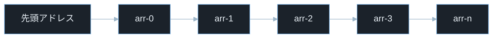
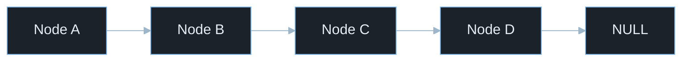
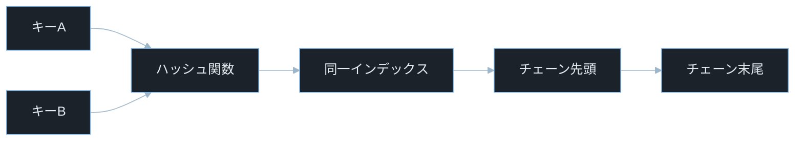

## TL;DR

- **配列・連結リスト・ハッシュテーブル**はあらゆるプログラムの土台となるデータ構造だ。それぞれ「速さ」「柔軟さ」「検索効率」という異なる特性を持つ。
- セキュリティの文脈では、配列の**バッファオーバーフロー**・ハッシュテーブルの**ハッシュフラッディング**・連結リストの**use-after-free** が実際の脆弱性と直結する。
- データ構造を「仕組みから」理解することで、攻撃がなぜ成立するかを論理的に追えるようになる。これが CTF の Pwn / Reversing カテゴリの出発点だ。

---

## なぜ重要か

「なぜバッファオーバーフローで任意コード実行ができるのか？」

この問いに即答できないなら、この記事が助けになる。答えはシンプルだ——**配列がメモリ上で連続していて、隣に戻りアドレスがあるから**。データ構造の仕組みを知れば、攻撃がなぜ成立するかを論理的に追えるようになる。

具体的に挙げると：

- **なぜハッシュテーブルへの大量リクエストでサーバーが落ちるのか？** → ハッシュ衝突が連鎖して O(1) が O(n²) に劣化するから。
- **なぜ `free()` 済みのポインタを再利用すると危険なのか？** → 解放されたノードが別の用途で上書きされ、攻撃者が内容を制御できるから。

セキュリティエンジニアとして実務で使う場面は多い。

- **CTF Pwn**: スタックやヒープのレイアウトを把握してエクスプロイトを書く
- **コードレビュー**: 配列の境界チェック漏れ・連結リストのメモリ解放バグを発見する
- **インシデントレスポンス**: クラッシュダンプからデータ構造を読み取って原因を特定する
- **ペネトレーションテスト**: ハッシュフラッディングで Web アプリのパースに負荷をかける

> **ペネトレーションテストとは**: 依頼を受けてシステムへ合法的に侵入テストを行うこと。「ペンテスト」と略す。自組織・許可を得たシステムのみを対象とする。

---

## 読む前に確認したい用語

難しい用語は出てきたタイミングで解説するが、以下の概念は記事全体を通して何度も登場する。ざっと目を通してから先に進もう。

**データ構造の 3 種**
- **配列（Array）**: 連続したメモリ領域に同じ型のデータを並べたデータ構造。インデックス（番号）で O(1) アクセスできる。
- **連結リスト（Linked List）**: 各要素が「次の要素へのポインタ」を持ち、鎖のようにつながるデータ構造。メモリが連続している必要はない。
- **ハッシュテーブル（Hash Table）**: キーをハッシュ関数で整数に変換してインデックスにするデータ構造。平均 O(1) で検索できる。辞書型・連想配列とも呼ばれる。

**計算量と速さ**
- **計算量 O(n) / O(1)**: アルゴリズムの速さを表す記法。O(1) は「入力サイズに関係なく一定時間」、O(n) は「入力サイズに比例した時間」。
- **ハッシュ関数**: 任意長のデータを固定長の整数（ハッシュ値）に変換する関数。同じ入力は必ず同じ出力になる。

**メモリ操作**
- **ポインタ**: メモリ上のアドレスを格納する変数。C言語では `int *p` のように `*` を付けて宣言する。「住所が書かれたメモ」に例えられる。

**セキュリティ用語**
- **バッファオーバーフロー**: 配列やバッファに確保したサイズを超えてデータを書き込み、隣接するメモリ領域を破壊する脆弱性。
- **ハッシュフラッディング**: 同じハッシュ値になる大量のキーをハッシュテーブルに挿入し、O(1) の性能を O(n) まで劣化させる DoS 攻撃。
- **use-after-free**: `free()` でメモリを解放した後も同じポインタを使い続けてしまう脆弱性。解放済みメモリが別の用途で上書きされると、攻撃者が内容を制御できる。
- **DoS（Denial of Service）**: サービス妨害攻撃。サーバーを過負荷にして正規ユーザーが利用できない状態にする攻撃手法の総称。
- **CTF**: Capture The Flag。セキュリティ技術を競う演習形式。Pwn はバイナリ脆弱性悪用、Reversing はバイナリ解析、Forensics はログ・ダンプ解析が主題。
- **CVE**: Common Vulnerabilities and Exposures の略。世界共通の脆弱性識別番号。
- **CVSS**: Common Vulnerability Scoring System。脆弱性の深刻度を 0.0〜10.0 で評価する指標。

---

## 仕組み

### 配列（Array）

配列はメモリ上に連続して並んだデータの列だ。「先頭アドレス + インデックス × 要素サイズ」という単純な計算で任意の要素に直接アクセスできる。



各要素が隣り合って並んでいるのがポイントだ。この「連続性」が O(1) アクセスを可能にする一方で、後述するバッファオーバーフローの原因にもなる。

**計算量まとめ**

- **アクセス**: O(1)。`arr[i]` は `先頭アドレス + i × 要素サイズ` で計算できる

> **要素サイズとは**: 配列の 1 要素が消費するバイト数。`int` 型なら多くの環境で 4 バイト、`char` 型なら 1 バイト。配列は全要素が同じ型・同じサイズなので、先頭アドレスからのオフセット計算が一定になる。

- **挿入/削除**: O(n)。要素をずらす必要がある
- **検索（線形）**: O(n)。先頭から順に比較する

> **O(1)の実感**: 配列の要素数が 10 個でも 100 万個でも、インデックスアクセスの時間は変わらない。アドレス計算一発で済むから。

**メモリ上の実態（C言語の例）**:

```c
int arr[4] = {10, 20, 30, 40};
```

メモリをイメージすると以下のようになる。先頭アドレスを `0x1000` とすると:

```
アドレス   値
0x1000    10  (arr[0])
0x1004    20  (arr[1])
0x1008    30  (arr[2])
0x100C    40  (arr[3])
```

> **`0x1000` の読み方**: 先頭の `0x` は「16進数（hexadecimal）」を示す接頭辞。`0x1000` は10進数で4096番地を指す。メモリアドレスは慣例的に16進数で表記する。なお `0x1000` はここでの説明用の仮想アドレス例であり、実際の実行環境では OS やランダム化（ASLR）によって異なる値になる。

`int` は多くの環境で 4 バイトなので、各要素が 4 バイトずつ並んでいる。`arr[3]` を読む時は `0x1000 + 3 × 4 = 0x100C` を参照する。

**配列の弱点 — 境界チェック**

C言語では配列の範囲外を書いても、言語レベルでエラーにならない。

```c
char buf[8];
strcpy(buf, "AAAAAAAAAAAAAAAA");
```

> **`strcpy` とは**: C言語の文字列コピー関数（string copy の略）。コピー先バッファのサイズを確認せず書き込むため、長い文字列を渡すとバッファの範囲外を上書きする。

`buf` は 8 バイトしかないが、16 バイトのデータを書き込むと「バッファオーバーフロー」が発生し、隣接するメモリ（スタック上の戻りアドレス等）を破壊する。

---

### 連結リスト（Linked List）

連結リストは各ノードが「データ」と「次のノードへのポインタ」を持つデータ構造だ。配列と違い、メモリ上で連続している必要はない。

> **NULL とは**: 「どこも指していない」を意味する特殊値。ポインタに `NULL` を代入すると「次のノードはない（末尾）」や「まだ初期化していない」を表せる。C言語では `0` と同義で、デリファレンス（`*p` でアクセス）するとセグメンテーション違反でクラッシュする。



ポインタをたどって次の要素へ移動するのが連結リストの本質だ。配列と違って「次はどこにある？」をポインタで毎回確認する必要がある——この構造がランダムアクセス O(n) の理由であり、ポインタ破壊が即座に任意メモリ参照につながる理由でもある。

**計算量まとめ**

- **アクセス**: O(n)。先頭から順にポインタをたどる必要がある
- **先頭への挿入**: O(1)。ポインタを付け替えるだけ
- **末尾への挿入**: O(n)。末尾まで移動してから追加
- **削除**: O(1)（ノードが特定できている場合）

**C言語での構造体定義**:

```c
struct Node {
    int data;
    struct Node *next;
};
```

> **`struct` とは**: C言語で複数の変数をまとめる「構造体」を定義するキーワード。`struct Node` は「int 型の data」と「次のノードへのポインタ next」を一組にしたものを定義している。

> **`*next` のアスタリスク**: `struct Node *next` の `*` はポインタ型を示す。`next` は「次のノードの先頭アドレス」を格納する変数。`NULL` を代入すると「次はない（末尾）」を意味する。

**連結リストの弱点 — use-after-free**

```c
struct Node *p = malloc(sizeof(struct Node));
p->data = 42;
free(p);
p->data = 99;
```

> **`malloc` と `free`**: `malloc`（memory allocate）はヒープ領域にメモリを動的に確保する関数。`free` は確保したメモリを解放する。`free` 後にポインタを使い続けると use-after-free になる。
> **`sizeof` とは**: 型や変数のサイズをバイト単位で返す演算子。`sizeof(struct Node)` は `Node` 構造体 1 個分のバイト数を返す。`malloc` に渡すことで「ちょうど 1 ノード分のメモリ」を確保できる。

> **ダングリングポインタ**: `free` 後に自動で `NULL` にはならない。`free(p)` の直後に `p = NULL` を書く習慣が重要。これを怠ると use-after-free や double-free（同じポインタを2回 free する）の原因になる。

`free(p)` でメモリを返却した後も `p` はそのアドレスを指したまま。解放された領域は別の `malloc` 呼び出しで再利用される可能性があり、攻撃者がその内容を制御できると任意コード実行につながる。

---

### ハッシュテーブル（Hash Table）

ハッシュテーブルはキーをハッシュ関数で整数に変換し、その値を配列のインデックスとして使うデータ構造だ。平均的に O(1) でのデータ検索・追加・削除を実現する。



異なるキーが同じインデックスに衝突したとき、連結リスト（チェーン）でぶら下げて管理するのがポイントだ。このチェーンが長くなるほど検索コストが増大する——ハッシュフラッディングはこの性質を意図的に引き起こす攻撃だ。

> **チェーン法とは**: 同じハッシュ値になった複数の要素を、連結リストを使ってぶら下げて管理する衝突解決手法。バケット（配列の 1 マス）に複数の要素が格納でき、検索時はそのバケットのリストを先頭から順にたどる。衝突が多いほどリストが長くなり、検索コストが増大する。

**計算量まとめ**

- **検索・挿入・削除（平均）**: O(1)
- **最悪ケース（全衝突時）**: O(n)

**衝突（Collision）**: 異なるキーが同じハッシュ値になることを「衝突」と呼ぶ。衝突の解決策として「チェーン法（連結リストでつなぐ）」が広く使われる。

**ハッシュ関数の簡単な例（Python）**:

```python
def simple_hash(key: str, table_size: int) -> int:
    total = 0
    for ch in key:
        total += ord(ch)
    return total % table_size
```

> **`ord(ch)` とは**: Python でキャラクタ（1文字の文字列）をその Unicode コードポイント（整数）に変換する組み込み関数。`ord('A')` は 65 を返す。
> **`%` は剰余演算子**: 割り算の余りを返す。`10 % 8` は `2`。ハッシュ値をテーブルサイズで割った余りをインデックスにすることで、必ず配列の範囲内（0 以上 `table_size` 未満）に収まる。

この例では各文字のコードポイントを足し合わせてテーブルサイズで割った余りをインデックスにしている。非常にシンプルなので衝突が起きやすく、実際のハッシュテーブルはより複雑な関数を使う。

**ハッシュテーブルの弱点 — ハッシュフラッディング**

全キーが同じハッシュ値になるよう細工された大量のキーを挿入すると、全てが同一のバケットに連結リストとしてチェーンされる。すると本来 O(1) の検索が O(n) になり、n 件挿入で検索コストが O(n²) に達し、CPU が枯渇する。

---

## よくある誤解

実装に進む前に、間違えやすいポイントを整理しておく。「あー、そうか」と思えるものがあれば、コードを書くときに思い出してほしい。

**「Python や JavaScript に配列の境界チェックは不要」**
Python のリストや JavaScript の配列はインデックス範囲外アクセスで例外を投げてくれるが、ユーザー入力のインデックスをそのまま使うと負のインデックスで末尾からアクセスされる（Python のスライス仕様）。`arr[-1]` は最後の要素だ。**想定外のアクセスを防ぐには明示的な範囲チェックが必要**だ。

**「ハッシュテーブルは常に O(1)」**
ハッシュテーブルの O(1) は「衝突が少ない場合の平均計算量」であり、**最悪ケースは O(n)** だ。ハッシュフラッディング攻撃は意図的に最悪ケースを引き起こす。Python 3.3 以降のハッシュランダム化はこの攻撃を緩和するが、キー数制限も組み合わせるべきだ。

**「連結リストは配列より遅い」**
先頭への挿入・削除は連結リストが O(1)、配列が O(n)（全要素をずらす必要）なので、**挿入削除が多い用途では連結リストの方が速い**。ただしランダムアクセスは配列が O(1)、連結リストが O(n)。用途に応じた使い分けが重要だ。

**「free() したポインタは自動的に NULL になる」**
C言語では `free(p)` を呼んでもポインタ `p` の値（アドレス）は変わらない。これを「ダングリングポインタ」と呼ぶ。**`free` 後に明示的に `p = NULL` を代入する習慣**をつけないと use-after-free や double-free の原因になる。

**「ハッシュ値が等しければキーも等しい」**
ハッシュ値は固定長なので衝突（異なるキーが同じハッシュ値になる）は必ず起きる。ハッシュテーブルの実装は「ハッシュ値が等しい」かつ「`==` で等しい」の両方を確認してからキーが一致したと判断する。**ハッシュ値だけで一致を確認するコードは誤り**だ。

---

## 脆弱なコード例

> 本記事の攻撃例は学習環境・CTF・明示的に許可された検証環境のみで実施してください。
> 実システムへの無断検証は不正アクセス禁止法や各国法令、利用規約違反となる可能性があります。

### PHP — 配列の境界チェック漏れによる情報漏洩

```php
<?php
$users = ['alice', 'bob', 'carol'];

$idx = (int)$_GET['id'];

echo "ユーザー: " . $users[$idx];
```

> **`$_GET['id']` とは**: HTTP GET リクエストのクエリパラメータ `id` の値を取得する PHP の超グローバル変数。例えば `/page?id=2` というリクエストで `$_GET['id']` が `"2"` になる。`(int)` でキャストして整数に変換しているが、負のインデックスや範囲外インデックスのチェックはしていない。

**どこが問題か**: `?id=-1` や `?id=9999` のような範囲外インデックスを送ると、想定外の配列要素にアクセスされる。より深刻な例では、他のユーザーデータが詰まった配列に対して想定外のインデックスでアクセスし情報が漏洩する。**攻撃者はクエリパラメータを書き換えるだけで、他ユーザーの情報を引き出せる**。

**防御策:**

```php
<?php
$users = ['alice', 'bob', 'carol'];

$idx = (int)($_GET['id'] ?? -1);

if ($idx < 0 || $idx >= count($users)) {
    http_response_code(400);
    exit("無効なインデックスです");
}

echo "ユーザー: " . $users[$idx];
```

> **`count($users)` とは**: PHP で配列の要素数を返す関数。`$idx >= count($users)` で「インデックスが配列の最後の要素より大きい」ことをチェックしている。

範囲チェックを先に行い、不正なインデックスは早期リターンで弾く。**この「入力バリデーションを最初に行う」パターンは全てのデータ構造操作に共通する防御原則だ。**

---

### Node.js — ハッシュフラッディングによる DoS

```javascript
const express = require('express');
const app = express();
app.use(express.json());

app.post('/data', (req, res) => {
    const body = req.body;
    const keys = Object.keys(body);

    let result = {};
    keys.forEach(key => {
        result[key] = body[key].toString().toUpperCase();
    });

    res.json(result);
});

app.listen(3000);
```

> **`Object.keys(body)` とは**: JavaScript オブジェクトの全プロパティ名（キー）を配列として返す組み込み関数。ここでは受け取った JSON のキー一覧を取得している。

**どこが問題か**: 攻撃者が数万個のキーを持つ JSON を POST するだけで、大量のキー処理と巨大 JSON のパースにより CPU・メモリ消費が急増する。**ボディサイズ制限がないため、1 リクエストでサーバーを占有できる**。ハッシュフラッディングと組み合わせることで被害はさらに大きくなる。

**防御策:**

```javascript
const express = require('express');
const app = express();

const MAX_KEYS = 100;
const MAX_BODY_SIZE = '10kb';

app.use(express.json({ limit: MAX_BODY_SIZE }));

app.post('/data', (req, res) => {
    const body = req.body;
    const keys = Object.keys(body);

    if (keys.length > MAX_KEYS) {
        return res.status(400).json({ error: 'キー数が多すぎます' });
    }

    let result = {};
    keys.forEach(key => {
        if (typeof body[key] === 'string') {
            result[key] = body[key].toUpperCase();
        }
    });

    res.json(result);
});

app.listen(3000);
```

> **`express.json({ limit: MAX_BODY_SIZE })` とは**: Express フレームワークの JSON ボディパーサーにサイズ制限を設けるオプション。`'10kb'` で 10 キロバイトを超えるリクエストを 413 エラーで拒否する。

キー数制限・ボディサイズ制限の両方を組み合わせることで、ハッシュフラッディングの前提となる大量データの投入を防ぐ。**「サイズ制限とキー数制限の 2 層で守る」のがポイントだ。**

---

### Python — 辞書のキー型混在による予期せぬ上書き

```python
from flask import Flask, request, jsonify

app = Flask(__name__)

store = {}

@app.route('/set')
def set_value():
    key = request.args.get('key', '')
    value = request.args.get('value', '')
    store[key] = value
    return jsonify({'ok': True})

@app.route('/get')
def get_value():
    key = request.args.get('key', '')
    return jsonify({'value': store.get(key)})

if __name__ == '__main__':
    app.run()
```

> **`request.args.get('key', '')` とは**: Flask で HTTP GET リクエストのクエリパラメータを取得するメソッド。第 2 引数はデフォルト値で、パラメータが存在しない場合に返される。

**どこが問題か**: キーのバリデーションが一切ないため、攻撃者は内部の予約キーや管理用キーを上書きできる。また Python では `store[True]` と `store[1]` が同じキーになる（`True == 1` が成立するため）など、型の違いで意図しない衝突が起きる。**キーを無制限に受け付けると、ストアのサイズを際限なく増やす DoS にもなる。**

> **Python のハッシュ等価**: Python のハッシュテーブル（dict）はキーの「ハッシュ値」と「等価性（`==`）」の両方が一致したときに同じキーと判断する。`hash(True) == hash(1)` かつ `True == 1` なので、`d[True]` と `d[1]` は同じバケットを指す。

**防御策:**

```python
from flask import Flask, request, jsonify, abort
import re

app = Flask(__name__)

store = {}
ALLOWED_KEY_PATTERN = re.compile(r'^[a-zA-Z0-9_\-]{1,64}$')
MAX_STORE_SIZE = 1000

@app.route('/set')
def set_value():
    key = request.args.get('key', '')
    value = request.args.get('value', '')

    if not ALLOWED_KEY_PATTERN.match(key):
        abort(400)

    if len(store) >= MAX_STORE_SIZE and key not in store:
        abort(429)

    store[key] = value
    return jsonify({'ok': True})

@app.route('/get')
def get_value():
    key = request.args.get('key', '')
    if not ALLOWED_KEY_PATTERN.match(key):
        abort(400)
    return jsonify({'value': store.get(key)})

if __name__ == '__main__':
    app.run()
```

> **`re.compile(r'^[a-zA-Z0-9_\-]{1,64}$')` とは**: 正規表現をコンパイルしたパターンオブジェクト。`^` は先頭、`$` は末尾、`[a-zA-Z0-9_\-]` は英数字・アンダースコア・ハイフンのみ許可、`{1,64}` は 1 文字以上 64 文字以下を意味する。キーをこのホワイトリストで絞ることで予期せぬ文字の混入を防ぐ。
> **`abort(429)` とは**: Flask でHTTPステータスコード 429（Too Many Requests）を返す関数。ストアのサイズが上限に達したとき、新規キーの追加を拒否する。

**型の罠は見た目ではわかりにくいので、キーのホワイトリスト検証が欠かせない。**

---

## 実践例 / 演習例

### 配列のバッファオーバーフローを観察する（Python で安全に）

C言語レベルの挙動を Python で擬似的に再現してみる。`ctypes` を使うとメモリ操作を直接行える。

```python
import ctypes

buf = (ctypes.c_char * 8)()

data = b"A" * 16

print(f"バッファサイズ: {ctypes.sizeof(buf)} バイト")
print(f"書き込もうとするデータ: {len(data)} バイト")

try:
    ctypes.memmove(buf, data, len(data))
    print("書き込み完了")
    print("※ このコードは未定義動作であり、実際に境界外書き込みが発生したかは保証されない。")
    print("   環境によってはクラッシュ・例外・無反応など挙動が異なる。")
except Exception as e:
    print(f"エラー: {e}")
```

> **`ctypes` とは**: Python から C言語の型やメモリ操作を行う標準ライブラリ。`ctypes.c_char * 8` は「8バイトの char 配列」を意味する。`ctypes.memmove` は C言語の `memmove` と同様にメモリを直接コピーする。

> **`b"A" * 16` の `b` プレフィックスとは**: Python でバイト列リテラルを示す。`"A"` は文字列だが `b"A"` は 1 バイトのデータ。`b"A" * 16` は `0x41` が 16 個並んだ 16 バイトのバイト列になる。

### ハッシュテーブルの衝突を意図的に引き起こす

```python
def bad_hash(key: str, size: int = 8) -> int:
    return len(key) % size

keys = ["a", "b", "c", "aa", "bb", "cc", "aaa", "bbb"]

collisions = {}
for key in keys:
    h = bad_hash(key)
    collisions.setdefault(h, []).append(key)

for h, ks in sorted(collisions.items()):
    print(f"ハッシュ値 {h}: {ks}")
```

このコードを実行すると、文字列長のみをハッシュとする粗末な実装が全てのキーを少数のバケットに集中させることが確認できる。実際のハッシュフラッディング攻撃はこの原理を利用する。

### grep でバッファオーバーフロー候補を探す

ソースコードから危険な C 関数を検索する。

```bash
grep -rn "strcpy\|strcat\|sprintf\|gets\b" --include="*.c" --include="*.h" ./src/
```

> **`grep -rn` とは**: `-r` はディレクトリを再帰的に検索（recursive）、`-n` はマッチした行番号を表示（line number）するオプション。
> **`\|` とは**: grep の Basic Regular Expression（BRE）モードで「または（OR）」を表す演算子。`grep -E` を使う拡張正規表現（ERE）モードでは `|`（バックスラッシュなし）と書ける。初学者はエスケープ文字と混同しやすいが、BRE での OR 演算子という別の意味を持つ。
> **`gets\b` の `\b` とは**: 単語の境界（word boundary）を意味する正規表現のアンカー。`gets` という単語全体にマッチし、`getstring` のような別の関数名を誤検出しない。

`strcpy`・`strcat`・`sprintf`・`gets` は境界チェックを行わない C の危険関数として知られる。これらをコードレビューやペンテストの調査で検索する定番のワンライナーだ。

---

## 防御策

### 1. 配列アクセスには常に境界チェックを行う

全ての言語で「インデックスが 0 以上かつ配列長未満か」を確認してからアクセスする。

```python
def safe_get(arr: list, idx: int):
    if not isinstance(idx, int):
        raise TypeError("インデックスは整数のみ")
    if idx < 0 or idx >= len(arr):
        raise IndexError(f"範囲外: idx={idx}, len={len(arr)}")
    return arr[idx]
```

### 2. ハッシュテーブルへの入力サイズを制限する

```javascript
function validateRequestBody(body, maxKeys = 50, maxValueLen = 256) {
    const keys = Object.keys(body);
    if (keys.length > maxKeys) {
        throw new Error(`キー数超過: ${keys.length} > ${maxKeys}`);
    }
    for (const key of keys) {
        if (typeof body[key] === 'string' && body[key].length > maxValueLen) {
            throw new Error(`値が長すぎます: key=${key}`);
        }
    }
}
```

### 3. ランダムハッシュシード（ハッシュランダム化）を有効にする

Python 3.3 以降はデフォルトで `PYTHONHASHSEED` がランダム化されており、起動するたびにハッシュ値が変わる。これによりハッシュフラッディングで同じバケットを狙い打ちにすることが難しくなる。

```bash
PYTHONHASHSEED=0 python3 -c "print(hash('hello'))"
PYTHONHASHSEED=1 python3 -c "print(hash('hello'))"
```

> **`PYTHONHASHSEED` とは**: Python のハッシュ関数に使われるシード値を設定する環境変数。デフォルトはランダム（プロセスごとに変わる）。`0` に設定すると固定値になり再現性が得られるが、ハッシュフラッディングに対して脆弱になる。

### 4. 安全な文字列操作関数を使う（C言語）

```c
char dst[8];
strncpy(dst, src, sizeof(dst) - 1);
dst[sizeof(dst) - 1] = '\0';
```

> **`strncpy` とは**: `strcpy` の安全版。コピーするバイト数の上限を第 3 引数で指定できる。ただし末尾の null 終端が保証されないため、`dst[sizeof(dst) - 1] = '\0'` で手動で終端を書く必要がある。

または `strlcpy`（BSD 系）・`snprintf` を使う方が null 終端の扱いが確実だ。

### 5. 静的解析ツールで境界チェック漏れを検出する

```bash
cppcheck --enable=all --check-level=exhaustive ./src/

clang --analyze ./src/main.c
```

> **`cppcheck` とは**: C/C++ のソースコードを静的解析してバッファオーバーフローやメモリリークを検出するオープンソースツール。コンパイルせずにコードを解析できる。

---

## 実演ラボ案内

### 推奨学習順序

- binary-hex-bitwise（16進数・メモリアドレスの読み方）
- data-structures-intro（本記事）
- memory-model（スタック・ヒープの詳細）
- process-thread（プロセスのメモリ空間）
- buffer-overflow-basics（BOF の実践）

### Hack The Box

- **Challenges — Pwn カテゴリ**: バッファオーバーフローを使ってスタック上の戻りアドレスを書き換える問題が入門レベルで多い。本記事の「配列はメモリ上で連続している」という理解が直接使える。
- **Challenges — Reversing カテゴリ**: バイナリを逆アセンブルして配列・構造体・ハッシュテーブルのコードパターンを読み取る問題がある。

> **`gdb` とは**: GNU Debugger の略。C/C++ プログラムのデバッグや CTF Pwn でのエクスプロイト開発に使う。`gdb ./binary` で起動し、`break main` でブレークポイントを設定して `run` で実行する。

### TryHackMe

- **Buffer Overflow Prep**: スタック BOF の基礎から EIP（実行命令ポインタ）制御まで段階的に学べる。
- **Linux Fundamentals**: `grep` / `gdb` / `python3 -c` ワンライナーの使い方を練習できる。

### 自宅 VM（合法演習）

```bash
cat /proc/self/maps | head -20
```

> **`/proc/self/maps` とは**: Linux の仮想ファイルシステム `/proc` 以下にある、現在のプロセスのメモリマップを示すファイル。スタック・ヒープ・共有ライブラリのアドレス範囲が確認できる。

```bash
python3 -c "
import struct
addr = 0x7fffffffe000
print(f'アドレス: 0x{addr:016x}')
packed = struct.pack('<Q', addr)
print(f'リトルエンディアン: {packed.hex()}')
"
```

> **`struct.pack('<Q', addr)` とは**: Python の `struct` モジュールで整数をバイト列に変換する関数。`<` はリトルエンディアン（下位バイトが先）、`Q` は 8 バイト符号なし整数を意味する。CTF の Pwn でエクスプロイトのアドレスをペイロードに埋め込む際に使う。
> **リトルエンディアンとは**: 多バイト整数をメモリに格納するとき、下位バイト（小さい桁）を先に置く方式。x86/x64 CPU はこの方式を採用している。対義語はビッグエンディアン。

---

## 関連 CVE と被害事例

> **CVE とは**: Common Vulnerabilities and Exposures の略。世界共通の脆弱性識別番号。
> **CVSS スコア**: 脆弱性の深刻度を 0.0〜10.0 で評価した指標。7.0 以上が High、9.0 以上が Critical。

**CVE-2011-4885（PHP — ハッシュフラッディング DoS）**
PHP 5.3.9 以前が POST パラメータをハッシュテーブルで管理する際、衝突を引き起こすキー群を大量に送ると CPU が枯渇することが発見された。攻撃者は特定のキーセット（PHP の djb ハッシュ関数で全て衝突するよう計算した文字列群）を含む POST リクエストを送るだけで、シングルコアを 1 分以上占有できた。CVSS スコア 5.0。本記事との関連: ハッシュテーブルのO(n²)劣化

**CVE-2012-5371（Ruby — ハッシュフラッディング DoS）**
Ruby 1.9.x が使うハッシュ関数（MurmurHash）に、衝突を意図的に引き起こせる入力セットが存在することが判明した。Ruby on Rails アプリへの JSON / XML リクエストに細工したキー群を混入させると、ハッシュテーブルが O(n²) に劣化し DoS が成立した。PHP と同時期に複数言語で発見された類似問題で、各言語がハッシュランダム化（シードのランダム化）を導入するきっかけとなった。CVSS スコア 5.0。本記事との関連: ハッシュフラッディング・ハッシュランダム化の必要性

> **CVE-2011-4885 と CVE-2012-5371 の共通点**: どちらも「ハッシュ衝突を利用して計算量を悪化させる Algorithmic Complexity Attack（アルゴリズム複雑度攻撃）」の代表例だ。特定の入力を選ぶことで平均 O(1) の処理を O(n) に引き下げ、n 回の操作で O(n²) の CPU コストを発生させる。

**CVE-2014-1912（Python — `socket.recvfrom_into()` のバッファオーバーフロー）**
Python 2.x / 3.x の `socket.recvfrom_into()` 関数に整数オーバーフローが存在し、渡されたバッファサイズより大きいデータを受け取った場合にバッファオーバーフローが発生した。配列（バッファ）のサイズ計算に整数オーバーフローが絡む典型的な脆弱性。CVSS スコア 7.5（High）。本記事との関連: 配列境界チェック・整数オーバーフローとバッファオーバーフローの連鎖

> **整数オーバーフローとは**: 整数型の最大値を超える計算を行うと値が 0 や負数に巻き戻る現象。`size_t` 型（符号なし整数）で `size - 1` を計算したとき `size = 0` だと巨大な正の整数になる。これがバッファサイズの計算に使われると配列の範囲外書き込みにつながる。

---

## 次に学ぶべき記事

- **memory-model 完全解説** — スタック・ヒープ・BSS・テキストセグメントの配置と、バッファオーバーフローが戻りアドレスをどう上書きするか
- **process-thread** — プロセスのメモリ空間とスレッドの関係。複数スレッドが同じハッシュテーブルを操作する race condition の危険性
- **binary-hex-bitwise** — メモリアドレスの16進数表記と、バイト列の読み方の基礎

---

## 参考文献

- OWASP. "Buffer Overflow". https://owasp.org/www-community/vulnerabilities/Buffer_Overflow
- NVD. "CVE-2011-4885 Detail". https://nvd.nist.gov/vuln/detail/CVE-2011-4885
- NVD. "CVE-2012-5371 Detail". https://nvd.nist.gov/vuln/detail/CVE-2012-5371
- NVD. "CVE-2014-1912 Detail". https://nvd.nist.gov/vuln/detail/CVE-2014-1912
- Python Docs. "ctypes — A foreign function library for Python". https://docs.python.org/3/library/ctypes.html
- Python Docs. "PYTHONHASHSEED". https://docs.python.org/3/using/cmdline.html#envvar-PYTHONHASHSEED
- GNU. "GDB: The GNU Project Debugger". https://www.gnu.org/software/gdb/
- Crosby, S. and Wallach, D. "Denial of Service via Algorithmic Complexity Attacks". https://www.usenix.org/legacy/events/sec03/tech/full_papers/crosby/crosby.pdf
