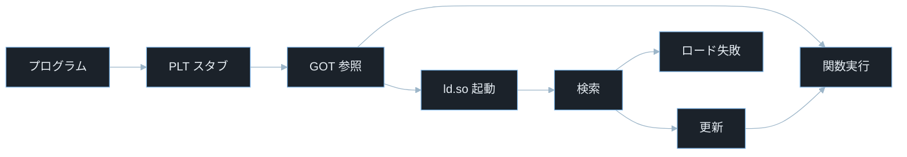
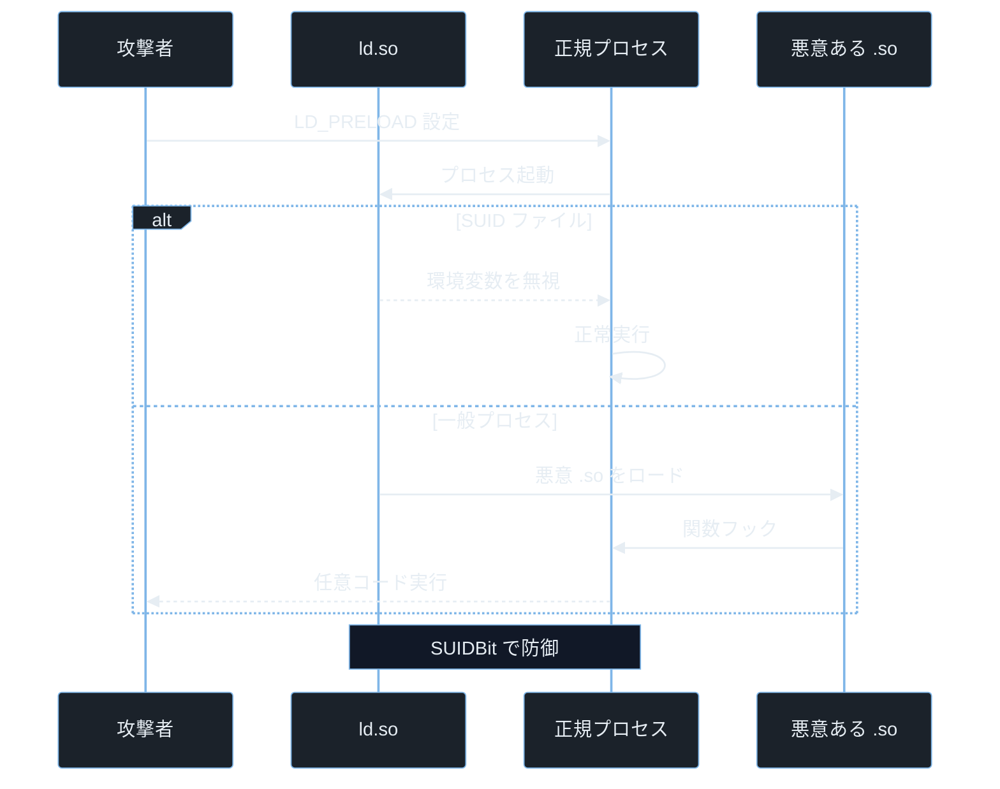

## TL;DR

- Linux のプログラムは ELF の `PT_INTERP` に指定された `ld.so`（動的リンカ）が起動時に依存ライブラリを探して読み込む。このとき参照するのが PLT（スタブコード）と GOT（アドレステーブル）の 2 層構造だ。
- GOT に書かれた関数アドレスは初回呼び出し時に `ld.so` が解決して上書きする（遅延バインディング）。この仕組みを悪用すると、GOT を書き換えるだけで任意関数に制御フローを奪える。
- `LD_PRELOAD` 環境変数で悪意ある共有ライブラリを正規プロセスより先にロードさせることで、正規関数を丸ごと置き換えるインジェクション攻撃が成立する。

---

## なぜ重要か

「`printf("hello")` を書いたとき、そのコードはどうやって libc の `printf` の実装にたどり着くのか？」

この問いに即答できないなら、この記事が助けになる。答えはシンプルだ——**PLT・GOT・ld.so が連携して、実行時に `printf` の「住所」を解決している**。動的リンクの仕組みを知れば、GOT 上書き・LD_PRELOAD インジェクション・ライブラリパスハイジャックがなぜ成立するかを根本から理解できる。

具体的に挙げると：

- **GOT 上書き攻撃**: バッファオーバーフローで GOT のエントリを書き換え、正規関数の呼び出しを攻撃者が用意した関数にリダイレクトする。CTF Pwn の最頻出テクニックのひとつ。
- **LD_PRELOAD インジェクション**: 正規プロセスを起動する前に `LD_PRELOAD` を仕掛けることで、認証や暗号化などの関数を丸ごとフックできる。
- **ライブラリパスハイジャック**: `LD_LIBRARY_PATH`・RPATH・RUNPATH の解決順序を悪用して、正規ライブラリより先に悪意ある `.so` を読み込ませる。
- **CVE 解読**: `CVE-2021-4034`（pkexec）・`CVE-2023-4911`（Looney Tunables）など、ld.so 関連の CVE は定期的に登場する。これらを読むには本記事の知識が前提になる。

---

## 読む前に確認したい用語

難しい用語は出てきたタイミングで解説するが、以下の概念は記事全体を通して何度も登場する。ざっと目を通してから先に進もう。

**リンク方式の 2 種**
- **動的リンク（Dynamic Linking）**: プログラムの起動時やランタイムに共有ライブラリ（`.so` / `.dll`）を読み込む方式。バイナリにライブラリを埋め込まない分ファイルサイズが小さく、ライブラリの更新がバイナリを再ビルドせず反映される。
- **静的リンク（Static Linking）**: ライブラリをバイナリに完全に組み込む方式。`LD_PRELOAD` やライブラリパスハイジャックの影響は受けないが、静的リンク固有の攻撃面やライブラリ脆弱性（組み込まれたバージョンの脆弱性）は残る。

**動的リンクの主役 3 つ**
- **ld.so（動的リンカ）**: ELF バイナリが起動するとき `main()` より前に実行される特殊なプログラム。依存ライブラリを探してメモリにマップし、シンボル（関数名）を解決する。正式名は `ld-linux.so` や `ld-linux-x86-64.so.2` など。
- **PLT（Procedure Linkage Table）**: 外部関数呼び出しのスタブコード置き場。`printf@plt` のように ELF 内に存在し、GOT を参照して実際の関数にジャンプする。
- **GOT（Global Offset Table）**: 外部関数や変数の「実際のアドレス」が書かれたテーブル。最初は PLT のリゾルバを指しており、初回呼び出し後に実際のアドレスで更新される。

**ELF の補助知識**
- **PT_INTERP**: ELF ファイルのプログラムヘッダのひとつ。「この ELF を実行するときどの動的リンカを使うか」のパスが書かれている。通常は `/lib64/ld-linux-x86-64.so.2`。`readelf -l ./binary | grep INTERP` で確認できる。
- **遅延バインディング（Lazy Binding）**: 関数を初めて呼んだときだけアドレスを解決して GOT を更新する最適化。起動速度向上のために使われるが、GOT が書き込み可能な期間が存在するためセキュリティリスクにもなる。
- **mmap()**: ファイルや匿名メモリを仮想アドレス空間へ割り当てるシステムコール。共有ライブラリのロードに内部的に使われる。

**ライブラリ検索パス**
- **LD_PRELOAD**: `ld.so` が参照する環境変数。ここに `.so` ファイルのパスを書くと、他のどのライブラリより先にロードされ、同名の関数を上書きできる。
- **RPATH**: ELF に埋め込まれたライブラリ検索パス。`readelf -d` で確認できる。
- **RUNPATH**: RPATH の後継仕様。`RPATH` より優先順位が低く、`LD_LIBRARY_PATH` で上書き可能。

**セキュリティ保護**
- **RELRO（RELocation Read-Only）**: GOT を起動後すぐに読み取り専用にする保護機構。Full RELRO なら GOT 書き込みによる攻撃を防げる。
- **CTF**: Capture The Flag。Pwn カテゴリでは GOT 上書きと PLT ハイジャックが頻出テーマ。

---

## 仕組み

### 動的リンクの全体フロー

ELF バイナリが起動すると、カーネルは ELF の `PT_INTERP` セクションに指定された動的リンカ（通常は `ld.so`）をメモリに読み込む。`ld.so` がその後、`.dynamic` セクション（動的リンク情報）を読んで依存ライブラリを `mmap()` でメモリにマップする。

> **`readelf -l ./binary | grep INTERP`**: プログラムヘッダ一覧から `PT_INTERP` を探し、「どの動的リンカが使われるか」を確認するコマンド。`readelf` は ELF ファイル構造を読む標準ツール（read ELF の略）、`-l` はプログラムヘッダ（program headers）の表示オプション。

### ライブラリ検索順序

`ld.so` は次の順番でライブラリを検索する。この順序が攻撃面になることがある。

```mermaid
%%{init: {"theme":"base","themeVariables":{"background":"#0b1117","primaryColor":"#1b222a","primaryBorderColor":"#7fb6e8","primaryTextColor":"#e6edf3","lineColor":"#9db6c9","secondaryColor":"#111827","tertiaryColor":"#0b1117"}}}%%
flowchart LR
    A[LD_LIBRARY_PATH] --> B[RUNPATH]
    B --> C[ld.so.cache]
    C --> D[/usr/lib]
```

左側ほど高優先で、**攻撃者が制御しやすいほど危険**という構造になっている。`LD_LIBRARY_PATH` は環境変数なので攻撃者が操作しやすく、`/usr/lib` は root 権限がなければ書き換えられない。

- `LD_LIBRARY_PATH` 環境変数に指定されたディレクトリ（SUID 時は無視）
- バイナリの `RUNPATH` または `RPATH`（ELF に埋め込まれたパス）
- `/etc/ld.so.cache`（`ldconfig` が生成するキャッシュ）
- `/lib`・`/usr/lib` などのデフォルトパス

> **`ldconfig` とは**: `/etc/ld.so.cache` を更新するコマンド（Linux Dynamic Linker COnFIGuration の略）。新しいライブラリを `/usr/lib` に置いた後 `sudo ldconfig` を実行するのが慣例。

**ライブラリ検索の弱点 — 上位パスへの悪意ある .so 配置**

攻撃者が `LD_LIBRARY_PATH` を操作できる、または `RUNPATH`/`RPATH` に書き込み可能なディレクトリが含まれている場合、正規ライブラリと同名の悪意ある `.so` を上位パスに置くだけでハイジャックが成立する。

### PLT / GOT の解決フロー（遅延バインディング）



「初回は ld.so 経由、2 回目以降は GOT から直接」という 2 段階の流れがポイントだ。この GOT が書き込み可能な状態（Partial RELRO）で存在することが GOT 上書き攻撃の温床になる。

詳細な手順を追う。

**初回呼び出し:**

- プログラムが `printf()` を呼ぶと、実際には `.plt` セクションの `printf@plt` スタブにジャンプする
- `printf@plt` は GOT の `printf@got` エントリを参照する
- 初回は `printf@got` が PLT のリゾルバアドレスを指しているため、`ld.so` の `_dl_runtime_resolve()` が呼ばれる
- `ld.so` が libc の `printf` の実際のアドレスを見つけ、`printf@got` をその値で更新する（シンボル未発見の場合はロード失敗となりプロセスが終了する）
- `printf` が実行される

**2 回目以降:**

- `printf@plt` → `printf@got` 参照 → libc の `printf` アドレスが直接書かれているためジャンプして実行
- `ld.so` を経由しないため高速

> **リゾルバ（resolver）とは**: `_dl_runtime_resolve()` のこと。PLT スタブが初回呼び出し時に `ld.so` 内のこの関数を呼んでシンボル解決を依頼する。Full RELRO を使うと起動時に全シンボルを解決し、その後 GOT を読み取り専用にするため、このリゾルバを呼ぶ必要がなくなる。

**計算量まとめ**

- **初回呼び出し**: GOT 更新コストあり（`ld.so` によるシンボル解決）
- **2 回目以降**: GOT 参照のみ。O(1) で直接ジャンプ

**PLT/GOT の弱点 — GOT 書き換えによる制御フロー奪取**

Full RELRO が有効でなければ、GOT は実行中も書き込み可能なメモリ領域に存在する。バッファオーバーフローや任意書き込み脆弱性があれば、GOT の特定エントリを攻撃者が用意した関数のアドレスに書き換えられる。

例: `printf@got` を `system` 関数のアドレスに書き換えると、プログラムが次に `printf("hello")` を呼んだとき実際には `system("hello")` が実行される。

> **`checksec` で GOT の書き込み可否を確認する方法**:
> ```bash
> checksec --file=./vulnerable
> ```
> 出力の `RELRO: Partial RELRO` なら GOT は書き込み可能。`Full RELRO` なら書き込み不可。

### LD_PRELOAD インジェクション攻撃フロー



SUID バイナリでは `ld.so` がセキュア実行モードに入り `LD_PRELOAD` を無視する。一般プロセスはこの保護がないため、`LD_PRELOAD` を設定できる状況であれば任意の `.so` を正規ライブラリより先に読み込ませられる。

> **SUID ビットとは**: Set User ID の略。このビットが立ったファイルは実行時にファイルオーナーの権限で動く。root 所有の SUID ファイルで `LD_PRELOAD` を使ったインジェクションができると即座に権限昇格につながるため、Linux カーネルと `ld.so` は SUID 実行時に `LD_PRELOAD` や `LD_LIBRARY_PATH` を自動的に無効化する（セキュア実行モード）。
> **セキュア実行モード（Secure Execution Mode）とは**: `ld.so` が「特権を持つプロセス」と判断したとき、`LD_PRELOAD` / `LD_LIBRARY_PATH` / `LD_AUDIT` などの環境変数を無視する動作モード。SUID/SGID ビット・Linux ケーパビリティが判断基準になる。

---

## よくある誤解

実装に進む前に、間違えやすいポイントを整理しておく。「あー、そうか」と思えるものがあれば、コードを書くときに思い出してほしい。

**「LD_PRELOAD はデバッグ専用で攻撃には使えない」**
`LD_PRELOAD` は本来デバッグや測定（malloc の差し替えなど）のための機能だが、**一般ユーザー権限があれば誰でも設定できる**。SUID バイナリには効かないが、Web サーバー・デーモン・開発用スクリプトなど SUID でないプロセスには有効だ。

**「GOT は実行中に書き換えられない」**
Full RELRO が有効な場合は起動直後に読み取り専用になるが、**Partial RELRO（デフォルト）では実行中も書き込み可能なまま**。`checksec` で確認せずに「GOT は安全」と思い込むのは危険だ。

**「ld.so は OS の一部だから脆弱性はない」**
`CVE-2023-4911`（Looney Tunables）は glibc の `ld.so` 自体のバッファオーバーフローで、ローカルユーザーが root 権限昇格できた重大な脆弱性だ。**`ld.so` もパッチが必要な通常のソフトウェア**だ。

**「静的リンクすれば動的リンク系の攻撃はすべて防げる」**
静的リンクすると `LD_PRELOAD`・`LD_LIBRARY_PATH` は効かなくなる。ただし**静的リンク固有の攻撃面やライブラリ脆弱性の固定化などのデメリット**もある。PIE と ASLR のアドレスランダム化は静的リンクでも利用可能だ。

**「PHP の putenv() は子プロセスに影響しない」**
PHP の `putenv()` は `setenv()` C 関数のラッパーで、カレントプロセスの環境変数テーブルを書き換える。**その後 `system()`・`exec()`・`mail()` などで生成された子プロセスは親の環境変数を継承するため `LD_PRELOAD` が引き継がれる**。

---

## 脆弱なコード例

> 本記事の攻撃例は学習環境・CTF・明示的に許可された検証環境のみで実施してください。
> 実システムへの無断検証は不正アクセス禁止法や各国法令、利用規約違反となる可能性があります。

### PHP — putenv() で LD_PRELOAD を操作する脆弱な設計

PHP の `putenv()` で環境変数を設定した後に `mail()` などを呼ぶと、子プロセスが `LD_PRELOAD` を継承して悪意ある `.so` をロードする脆弱性パターンがある。

```php
<?php
$user_lib = $_GET['lib'] ?? '';

if ($user_lib) {
    putenv("LD_PRELOAD=/tmp/" . $user_lib);
    putenv("EVIL_CMD=" . ($_GET['cmd'] ?? 'id'));

    mail('x@x.com', 'x', 'x');

    $out = file_get_contents('/tmp/evil_output.txt');
    echo $out;
}
```

> **`putenv()`**: PHP でプロセスの環境変数を変更する関数。変更はカレントプロセスとその子プロセスに引き継がれる。
> **`mail()`**: PHP の標準メール送信関数。内部で `sendmail` バイナリを子プロセスとして起動するため、`LD_PRELOAD` が設定されていると子プロセスで悪意ある `.so` がロードされる。

**どこが問題か**: `?lib=evil.so&cmd=id` を送ると `LD_PRELOAD=/tmp/evil.so` が設定された状態で `mail()` が子プロセス（`sendmail`）を起動する。`evil.so` は `__attribute__((constructor))` でロード時に `EVIL_CMD` の内容を実行し結果を `/tmp/evil_output.txt` に書き出す。**攻撃者はクエリパラメータを書き換えるだけで、サーバー上で任意コマンドを実行できる**。

**防御策（LD_PRELOAD を使わない設計へ）:**

```php
<?php
$allowed_actions = ['math', 'stat', 'format'];
$action = $_GET['action'] ?? '';

if (!in_array($action, $allowed_actions, true)) {
    http_response_code(400);
    exit;
}

$result = process_action($action, $_GET['input'] ?? '');
echo htmlspecialchars($result);

function process_action(string $action, string $input): string {
    return match($action) {
        'math'   => strval(intval($input) * 2),
        'stat'   => strlen($input) . ' 文字',
        'format' => strtoupper($input),
        default  => '',
    };
}
```

Web アプリケーションから `putenv()` で `LD_PRELOAD` を操作する設計は根本的に避ける。`php.ini` の `disable_functions` に `putenv,mail,system,exec,popen,proc_open,shell_exec` を追加して外部プロセス起動と環境変数操作を禁止することも重要だ。**「外部プロセスを起動する前に LD_* 系の環境変数を除外する」か、そもそも外部プロセスを起動しない設計にするのが根本的な防御だ。**

---

### Node.js — ユーザー入力を require() に渡す脆弱な設計

```javascript
const express = require('express');
const app = express();

app.get('/exec', (req, res) => {
    const moduleName = req.query.module || 'lodash';
    try {
        const mod = require(moduleName);
        res.json({ result: mod.version });
    } catch (e) {
        res.status(500).send('エラー: ' + e.message);
    }
});

app.listen(3000);
```

> **`require(moduleName)`**: Node.js でモジュールを読み込む関数。`moduleName` が `./` や `/` で始まる場合は相対・絶対パスとして読み込む。それ以外は `node_modules` を遡って検索する。`.node` 拡張子のファイル（ネイティブアドオン）は ELF/PE バイナリで、`dlopen()` API でロードされ、ロード時にコンストラクタ関数が自動実行される。

**どこが問題か**: `?module=./../../tmp/evil` のような相対パスを指定すると任意の JavaScript ファイルや `.node` ネイティブアドオンが読み込まれる。`.node` ファイルは ELF 形式のため、**ロードされた瞬間に `__attribute__((constructor))` のコードが実行され、サーバー上での任意コード実行につながる**。

**防御策:**

```javascript
const path = require('path');
const fs = require('fs');

const ALLOWED_MODULES = new Set(['lodash', 'moment', 'axios']);

app.get('/exec', (req, res) => {
    const moduleName = req.query.module || '';

    if (!ALLOWED_MODULES.has(moduleName)) {
        return res.status(400).json({ error: '許可されていないモジュール' });
    }

    try {
        const mod = require(moduleName);
        res.json({ result: mod.version });
    } catch (e) {
        res.status(500).send('モジュールエラー');
    }
});
```

許可リスト方式で受け入れるモジュール名を固定する。`./`・`../`・絶対パスを含む入力はすべて拒否する。依存モジュールは `package-lock.json` で整合性を管理し、`npm audit` で定期確認する。**「モジュール名を許可リストで完全固定する」ことで、パス操作・ネイティブアドオンロードの両方をまとめて防げる。**

---

### Python — LD_LIBRARY_PATH を子プロセスに継承させる脆弱性

```python
import os
import subprocess
from flask import Flask, request

app = Flask(__name__)

@app.route('/run')
def run_tool():
    lib_path = request.args.get('lib_path', '')

    env = dict(os.environ)
    if lib_path:
        env['LD_LIBRARY_PATH'] = lib_path + ':' + env.get('LD_LIBRARY_PATH', '')

    result = subprocess.run(
        ['/usr/local/bin/analyzer'],
        env=env,
        capture_output=True,
        text=True,
        timeout=10
    )
    return result.stdout
```

> **`LD_LIBRARY_PATH`**: `ld.so` が共有ライブラリを検索するディレクトリを追加で指定する環境変数。このパスは通常の検索パス（`/usr/lib` など）より優先される。攻撃者が書き込めるディレクトリを指定できると、正規ライブラリと同名の悪意ある `.so` を先にロードさせられる。
> **`subprocess.run(env=...)`**: 子プロセスに渡す環境変数を辞書で指定する。`os.environ` のコピーに追加して渡すパターンはよく見られるが、ユーザー入力を直接 `LD_LIBRARY_PATH` に追加すると深刻なリスクになる。

**どこが問題か**: `?lib_path=/tmp/evil` を送ると `/tmp/evil` に置かれた悪意ある `.so` が `/usr/local/bin/analyzer` より先に読み込まれる。**`analyzer` が依存する `libssl.so` などの正規ライブラリを同名で `/tmp/evil/` に配置しておくだけで関数置き換えが成立し、`analyzer` の権限でコードが実行される**。

**防御策:**

```python
import os
import subprocess
from flask import Flask, request

app = Flask(__name__)

SAFE_ENV_KEYS = {'PATH', 'LANG', 'HOME', 'TZ'}

@app.route('/run')
def run_tool():
    safe_env = {k: v for k, v in os.environ.items() if k in SAFE_ENV_KEYS}

    result = subprocess.run(
        ['/usr/local/bin/analyzer'],
        env=safe_env,
        capture_output=True,
        text=True,
        timeout=10
    )
    return result.stdout
```

> **環境変数のサニタイズ**: 子プロセスに渡す環境変数は許可リスト方式で管理する。`LD_LIBRARY_PATH`・`LD_PRELOAD`・`LD_AUDIT` など `LD_*` 系の変数は原則として子プロセスに渡さない。

**「子プロセスに渡す環境変数を許可リストで完全に絞る」ことで、どの LD_* 変数も引き継がれなくなる。ブロックリスト方式（特定の変数だけ除外）より漏れが少なく確実だ。**

---

## 実践例 / 演習例

### ldd でライブラリ依存を確認する

```bash
ldd /usr/bin/ls
ldd /usr/bin/sudo
```

> **`ldd` とは**: ELF バイナリが依存する共有ライブラリ一覧を表示するコマンド（List Dynamic Dependencies の略）。内部的には `LD_TRACE_LOADED_OBJECTS=1` 環境変数を設定して対象バイナリを実行し、`ld.so` に依存関係を表示させる。**注意**: 信頼できないバイナリに `ldd` を実行すると `.so` のコンストラクタが実行されることがある。

出力の読み方:

```
linux-vdso.so.1 => (0x00007ffd...)
libselinux.so.1 => /lib/x86_64-linux-gnu/libselinux.so.1
libc.so.6       => /lib/x86_64-linux-gnu/libc.so.6
```

左側がバイナリが要求するライブラリ名、`=>` の右側が `ld.so` が実際にロードするファイルパスを示す。

### ltrace で動的リンク呼び出しをトレースする

```bash
ltrace /bin/ls 2>&1 | head -20
```

> **`ltrace` とは**: プロセスが呼び出す共有ライブラリ関数（`printf`・`malloc`・`strcmp` など）をリアルタイムで記録するツール（Library TRACE の略）。`strace` がシステムコールを記録するのに対し、`ltrace` はライブラリ関数レベルで記録する。
> **`2>&1`**: 標準エラー出力（ファイルディスクリプタ番号 2）を標準出力（番号 1）に結合するリダイレクト。`ltrace` はトレース情報を標準エラーに出力するため、`｜` でパイプするにはこの変換が必要。
> **stderr（標準エラー出力）**: エラーメッセージやデバッグ情報を出力する専用ストリーム。通常の出力（stdout）とは別経路で表示される。`2>&1` で stdout に合流させると `head` などでフィルタリングできる。

### LD_DEBUG で ld.so の動作を詳細に見る

```bash
LD_DEBUG=libs /usr/bin/ls 2>&1 | head -30
LD_DEBUG=symbols /usr/bin/ls 2>&1 | grep printf | head -10
```

> **`LD_DEBUG` とは**: `ld.so` のデバッグ出力を有効にする環境変数。`libs` でライブラリ検索経路、`symbols` でシンボル解決の詳細、`bindings` で PLT/GOT バインディング、`all` で全情報を表示する。

### GOT のアドレスを objdump で確認する

```bash
objdump -d /usr/bin/ls | grep -A3 "printf@plt"
objdump -R /usr/bin/ls | grep -i "printf\|puts"
```

> **`objdump -d`**: バイナリを逆アセンブル（機械語をアセンブリ言語で表示）するオプション（object dump の略）。
> **`-A3`**: `grep` のオプションで「マッチした行の後ろ 3 行も表示する」（After 3 lines の略）。PLT スタブの逆アセンブリを 3 行分確認するのに使う。
> **`objdump -R`**: 再配置エントリを表示するオプション。GOT の各エントリがどのシンボルに対応するかと現在書かれているアドレスを確認できる。

### LD_PRELOAD で関数をフックしてみる（合法演習）

```bash
cat > /tmp/hook_puts.c << 'C'
#include <stdio.h>
int puts(const char *s) {
    fprintf(stderr, "[フック] puts 呼び出し: %s\n", s);
    return 0;
}
C

gcc -shared -fPIC -o /tmp/hook_puts.so /tmp/hook_puts.c
LD_PRELOAD=/tmp/hook_puts.so /bin/ls
```

> **`gcc -shared -fPIC`**: 共有ライブラリ（`.so`）をビルドするオプション。`-shared` で共有ライブラリ形式に、`-fPIC`（Position Independent Code）でどのアドレスにロードされても動作するコードを生成する。
> この演習は自分のマシンで `puts()` をフックして動的リンクの仕組みを体感するための安全な実験だ。フックした `puts` が呼ばれると stderr に `[フック]` と表示され、`ls` の通常出力が消えることが確認できる。

---

## 防御策

### 1. Full RELRO を有効にしてコンパイルする

```bash
gcc -o myapp myapp.c \
    -Wl,-z,relro \
    -Wl,-z,now \
    -fPIE -pie
```

`-z now` で起動時に全シンボルを解決し、`-z relro` で GOT を読み取り専用にする（Full RELRO）。これにより実行中の GOT 書き込みを防げる。

```bash
readelf -d ./myapp | grep BIND_NOW
checksec --file=./myapp
```

### 2. 子プロセスへの LD_* 環境変数の継承を禁止する

```python
import os
import subprocess

BLOCKED_ENV = {k for k in os.environ if k.startswith('LD_') or k.startswith('GLIBC_')}
safe_env = {k: v for k, v in os.environ.items() if k not in BLOCKED_ENV}

subprocess.run(['./child_process'], env=safe_env)
```

`LD_PRELOAD`・`LD_LIBRARY_PATH`・`LD_AUDIT`・`LD_BIND_NOW` など `LD_*` 系は子プロセスに渡さない。

### 3. RPATH / RUNPATH に安全なパスのみ指定する

```bash
readelf -d ./binary | grep -i "rpath\|runpath"
patchelf --print-rpath ./binary
```

`$ORIGIN` 以外の相対パスが RPATH/RUNPATH に入っていると、カレントディレクトリのライブラリを読み込んでしまう危険性がある。安全な例:

```bash
patchelf --set-rpath '$ORIGIN/../lib' ./binary
```

> **`$ORIGIN` とは**: ELF の RPATH/RUNPATH で使える特殊変数。バイナリが置かれているディレクトリを指す。`$ORIGIN/../lib` のように使うことで、バイナリの位置を基準にライブラリを検索できる。予測可能な絶対パスに絞れるため、カレントディレクトリ依存のリスクを回避できる。
> **`patchelf` とは**: ビルド後の ELF バイナリの RPATH・インタプリタ・ライブラリ依存を書き換えるツール。`--set-rpath` で安全なパスに修正できる。

### 4. PHP では disable_functions で外部プロセス起動を禁止する

```ini
disable_functions = putenv,mail,system,exec,passthru,popen,proc_open,shell_exec
```

`php.ini` の `open_basedir` と組み合わせてファイルシステムアクセスも制限する。コンテナで PHP を動かす場合は `seccomp` で `execve()` 自体を制限するとより確実だ。

### 5. 実行環境を最小権限で隔離する

- Docker の `--security-opt no-new-privileges` フラグで SUID バイナリの権限昇格を防ぐ
- `seccomp` で `execve()`・`mmap()` などを制限する
- 書き込み可能なディレクトリと実行可能なライブラリロードパスを分離し、攻撃者が書き込める場所に悪意ある `.so` を置けない設計にする

> **注意**: Linux の `noexec` マウントオプションはスクリプトやバイナリの直接実行を防ぐが、`dlopen()` による共有ライブラリの読み込みを防げない環境も存在する。`noexec` は多層防御の一部として使うものであり、`/tmp/evil.so` 配置を完全に防ぐ単独の対策にはならない。コンテナ隔離・SELinux・AppArmor などと組み合わせることが重要だ。

---

## 実演ラボ案内

### 推奨学習順序

- elf-pe-format（ELF のセクション構造・PLT/GOT の配置確認）
- syscall-basics（`mmap()`・`dlopen()` と syscall の関係）
- dynamic-linking（本記事）
- GOT 上書き実践（CTF Pwn の ret2plt・GOT overwrite）

### Hack The Box

- **Challenges — Pwn カテゴリ**: `got_overwrite`・`ret2plt` などのタグが付いた問題が直接練習になる。`checksec` で RELRO を確認してから方針を決める習慣をつけよう。
- **Challenges — Reversing カテゴリ**: `ltrace` と `LD_DEBUG` で動的リンクの挙動を追いながら難読化を解く問題が出る。

### TryHackMe

- **Linux PrivEsc**: SUID バイナリと `LD_PRELOAD` を組み合わせた権限昇格問題がある。SUID ファイルでは `LD_PRELOAD` が無効になる理由を体感できる。
- **Linux Fundamentals**: `ldd`・`ldconfig`・`objdump` の基礎操作を練習できる。

### 自宅 VM（合法環境）

```bash
LD_DEBUG=libs /bin/ls 2>&1 | grep "search path"
```

`ld.so` がどのパスの順番でライブラリを探すかをリアルタイムで確認できる演習だ。攻撃者がどのパスに悪意ある `.so` を置けばハイジャックできるかも見えてくる。

---

## 関連 CVE と被害事例

> **CVE とは**: Common Vulnerabilities and Exposures の略。世界共通の脆弱性識別番号。
> **CVSS スコア**: 脆弱性の深刻度を 0.0〜10.0 で評価した指標。9.0 以上が Critical。

**CVE-2021-4034（Polkit pkexec 権限昇格）**
SUID root の `pkexec` が `argc=0` で起動されたとき、`argv[0]` を `NULL` チェックせずに環境変数として扱う処理ミスがあった。攻撃者は細工した環境変数テーブルを通じて `LD_PRELOAD` 相当の効果を SUID バイナリに対して発動させ、root 権限を取得できた。通常 SUID はセキュア実行モードで `LD_PRELOAD` を無視するが、この実装バグがそれを回避した。CVSS スコア 7.8。本記事との関連: LD_PRELOAD バイパス・セキュア実行モード迂回

**CVE-2023-4911（Looney Tunables — glibc ld.so バッファオーバーフロー）**
glibc の `ld.so` が処理する `GLIBC_TUNABLES` 環境変数のパース処理にバッファオーバーフローが存在した。攻撃者が細工した `GLIBC_TUNABLES` を設定してプログラムを起動すると、`ld.so` 内でオーバーフローが発生し、ローカルユーザーが root 権限昇格できた。Ubuntu・Fedora・Debian の主要バージョンが影響を受け、2023 年 10 月に公開された。CVSS スコア 7.8。本記事との関連: ld.so の脆弱性・環境変数処理

> **`GLIBC_TUNABLES` とは**: glibc の動作を細かく調整するための環境変数。`glibc.malloc.mmap_threshold=4096` のようにカーネルパラメータ風に指定する。`ld.so` が起動直後にこれを解析する。

**CVE-2017-1000366（ld.so — ORIGIN 展開によるパストラバーサル）**
glibc の `ld.so` が RPATH/RUNPATH の `$ORIGIN` を展開する処理に問題があり、攻撃者がシンボリックリンクを悪用して `$ORIGIN` を意図しないディレクトリに向けられた。これにより SUID バイナリが攻撃者の制御するライブラリをロードし、root 権限昇格が可能だった。CVSS スコア 7.8。本記事との関連: RPATH/RUNPATH・`$ORIGIN` 展開・ライブラリパスハイジャック

---

## 次に学ぶべき記事

- **GOT 上書き実践 — ret2plt と libc リーク** — 本記事で学んだ PLT/GOT 構造を使って Pwn CTF の GOT overwrite 問題を実際に解く
- **Return-Oriented Programming（ROP）入門** — Full RELRO で GOT を守られた状態での次のステップ
- **コンテナ隔離の仕組みと突破技法** — Docker の `--security-opt no-new-privileges` と `seccomp` が動的リンク攻撃をどう制限するかを理解する

---

## 参考文献

- Linux man-pages. "ld.so(8)". https://man7.org/linux/man-pages/man8/ld.so.8.html
- glibc source. "elf/dl-lookup.c". https://sourceware.org/git/glibc.git
- NVD. "CVE-2021-4034 Detail". https://nvd.nist.gov/vuln/detail/CVE-2021-4034
- NVD. "CVE-2023-4911 Detail". https://nvd.nist.gov/vuln/detail/CVE-2023-4911
- NVD. "CVE-2017-1000366 Detail". https://nvd.nist.gov/vuln/detail/CVE-2017-1000366
- Qualys Research. "Looney Tunables". https://www.qualys.com/2023/10/03/cve-2023-4911/looney-tunables-local-privilege-escalation-glibc-dynamic-linker.txt
- OWASP. "Using Components with Known Vulnerabilities". https://owasp.org/Top10/A06_2021-Vulnerable_and_Outdated_Components/
