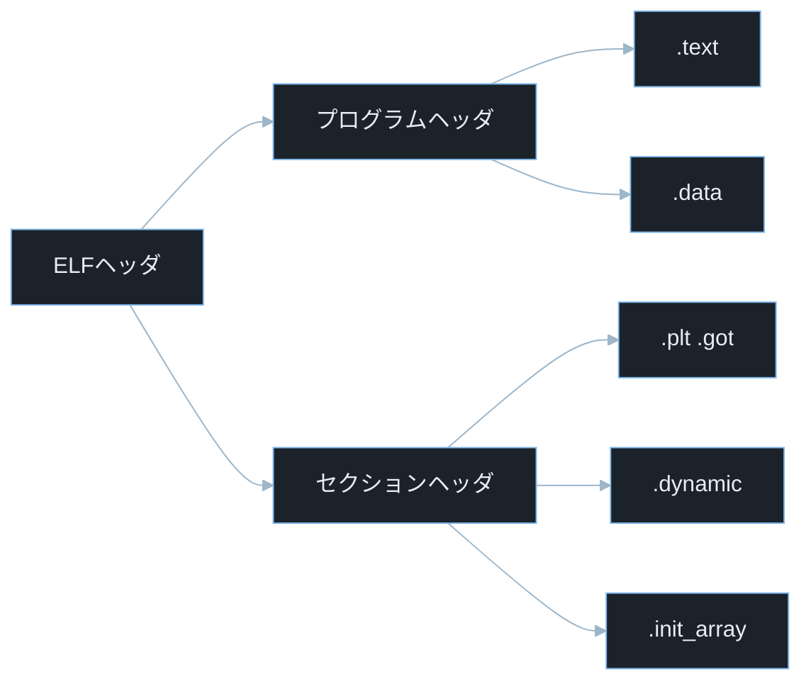
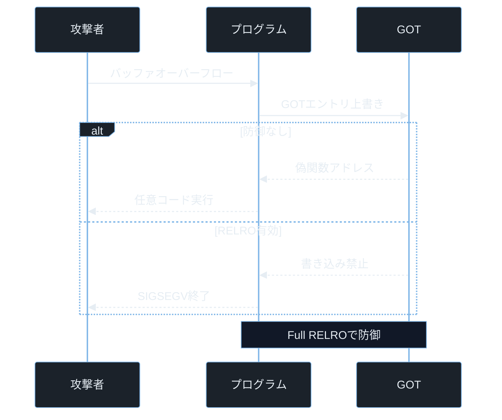

## TL;DR

- Linux の実行ファイルは ELF（Executable and Linkable Format）、Windows の実行ファイルは PE（Portable Executable）という共通フォーマットで構成されており、ヘッダ・セクション・セグメントの 3 層構造を持つ。
- `.text`（コード）・`.data`（初期化済みデータ）・`.bss`（未初期化データ）・`.plt` / `.got`（動的リンク）など各セクションの役割を知ることで、バッファオーバーフロー後の攻撃ターゲットや SUID ファイルの悪用経路が見えてくる。
- `readelf`・`objdump`・`strings` などのツールで実行ファイルを解析する能力は、CTF の Reversing / Pwn カテゴリと実際のマルウェア解析・脆弱性調査の両方で必須だ。

---

## なぜ重要か

「`objdump -d malware` を実行してアセンブリを読もうとしたとき、何をどこから見ればいいか分かるか？」

この問いに即答できないなら、この記事が助けになる。答えはシンプルだ——**セクション構造を知れば、コード・データ・動的リンク・マルウェアが仕込まれやすい場所がどこにあるかがすぐ分かる**。ELF / PE フォーマットを知れば、バイナリ解析の「どこを見るか」が明確になる。

具体的に挙げると：

- **CTF Reversing カテゴリ**: ELF ファイルを解析してフラグを探すには、セクション配置・シンボルテーブル・動的リンクの仕組みを知らないと始まらない。
- **CVE 調査と Pwn**: GOT の書き換え・PLT のハイジャック・SUID ファイルの悪用は実際の CVE で繰り返し登場するパターンだ。
- **マルウェア解析**: ELF の `.init_array` にコードを埋め込んだマルウェアや、DLL インジェクションで PE を乗っ取る手法は実際の攻撃で使われている。
- **悪意ある共有ライブラリ**: `LD_PRELOAD` 環境変数で悪意ある ELF `.so` を正規プロセスに差し込むインジェクション技法は、知識がないと発見や原因分析が難しくなる。

---

## 読む前に確認したい用語

難しい用語は出てきたタイミングで解説するが、以下の概念は記事全体を通して何度も登場する。ざっと目を通してから先に進もう。

**実行ファイルフォーマット**
- **ELF（Executable and Linkable Format）ファイル**: Linux・Android・BSD 系などで使われる実行ファイルのフォーマット。`.out`・共有ライブラリ `.so`・オブジェクトファイル `.o` もすべて ELF フォーマット。
- **PE（Portable Executable）**: Windows で使われる実行ファイルのフォーマット。`.exe`・`.dll`・`.sys`（ドライバ）などが PE フォーマット。

**ELF の構造単位**
- **セクション（Section）**: 実行ファイル内のデータのまとまり。`.text`（コード）や `.data`（変数）など目的ごとに分かれている。
- **セグメント（Segment）**: OS がプロセスをロードする際の「メモリ領域の単位」。複数のセクションをひとまとめにして仮想メモリにマップする。

**動的リンクの仕組み**
- **PLT（Procedure Linkage Table）**: 動的リンクされた関数を初回呼び出し時に解決するための仕組み。
- **GOT（Global Offset Table）**: PLT が参照する「関数や変数の実際のアドレスが書かれたテーブル」。ここを書き換えると関数呼び出しをハイジャックできる。

**セキュリティ保護機構**
- **SUID（Set User ID）**: 実行時にファイルオーナーの権限で動く特殊な属性。root 所有の SUID ファイルは root 権限で動く。
- **RELRO（RELocation Read-Only）**: PLT/GOT のメモリ領域を読み取り専用にしてハイジャックを防ぐ保護機構。
- **PIE（Position Independent Executable）**: 実行ファイルをどのアドレスにもロードできるようにした形式。
- **ASLR（Address Space Layout Randomization）**: 実行時のアドレス配置をランダム化する OS の保護機構。PIE と組み合わせてアドレスを毎回変える。

**解析ツール**
- **readelf**: ELF ヘッダやセクション情報を表示する解析ツール。
- **objdump**: アセンブリやセクション情報を表示する解析ツール（object dump の略）。
- **strings**: バイナリから可読文字列を抽出するツール。
- **CTF**: Capture The Flag。Reversing（バイナリ解析）・Pwn（バイナリ脆弱性悪用）カテゴリで ELF 解析は頻出。

---

## 仕組み

### ELF フォーマットの構造

ELF ファイルは先頭 4 バイトが必ず `7f 45 4c 46` から始まる。これが「マジックバイト」と呼ばれる識別子だ。

> **マジックバイト（Magic Bytes）とは**: ファイルの先頭に置かれる固定バイト列で、ファイル形式を識別するために使う。OS や `file` コマンドはこれを見てファイル種別を判定する。
> **`7f 45 4c 46` の意味**: `45 4c 46` は ASCII（文字コード）で E・L・F に対応する（16進 45 = 69 = 'E'、4c = 76 = 'L'、46 = 70 = 'F'）。先頭の `7f` は制御文字領域のバイトで、テキストファイルや他のフォーマットとの衝突を避けるための識別用プレフィックスとして選ばれた。

ELF ヘッダには次の情報が含まれる。

- **e_type**: ファイルの種類（実行可能ファイル・共有ライブラリ・オブジェクトファイル）
- **e_machine**: 対象 CPU アーキテクチャ（`x86-64`・`ARM` など）
- **e_entry**: プログラムのエントリポイント（最初に実行される命令のアドレス）
- **e_phoff**: プログラムヘッダ表のオフセット
- **e_shoff**: セクションヘッダ表のオフセット

> **エントリポイントとは**: プログラムが実行を開始するアドレス。`main()` 関数そのものではなく、`_start` という初期化コードが先に呼ばれる。
> **オフセットとは**: ファイルの先頭（バイト 0）からの距離（バイト数）。ELF ヘッダ内の各フィールドは「ファイル先頭から何バイト目に何があるか」をオフセットで示す。



ヘッダが「どこに何があるか」を指示し、プログラムヘッダが OS のメモリロードに、セクションヘッダがリンカや解析ツールに使われる二重構造になっているのがポイントだ。特に `.dynamic` と `.init_array` はマルウェアがコードを仕込む対象として注目する。

**計算量まとめ**

主要セクションの役割を押さえておく。

- **`.text`**: 実行可能なコード（機械語命令）が入る。通常は読み取り専用・実行可能。
- **`.data`**: 初期値ありのグローバル変数・静的変数が入る。読み書き可能。
- **`.bss`**: 初期値なし（ゼロ初期化）のグローバル変数。ファイル上には実体がなく、ロード時にゼロで埋められる。
- **`.rodata`**: 読み取り専用のデータ（文字列リテラルなど）が入る。`strings` コマンドで抽出できる。
- **`.plt`**: Procedure Linkage Table。外部関数（`printf` など）を呼ぶためのスタブコードが入る。
- **`.got` / `.got.plt`**: Global Offset Table。動的リンカが解決した関数やグローバル変数のアドレスが書き込まれる。
- **`.dynamic`**: 動的リンクに必要な情報（依存ライブラリ名・初期化関数など）が入る。
- **`.init_array`**: プログラム開始前に実行される初期化関数のアドレス配列。マルウェアがここにコードを仕込むことがある。

> **`strings` コマンドとは**: バイナリファイルから印刷可能な ASCII 文字列を抽出するコマンド。パスワードのハードコード・URL・ファイルパスなどを発見するのに使う。
> **遅延バインディング（Lazy Binding）とは**: 動的リンクの最適化。関数を初めて呼んだときに初めてアドレスを解決する。GOT エントリは最初は PLT のリゾルバを指しており、解決後に実際のアドレスで上書きされる。

**ELF 構造の弱点 — GOT の書き換えと .init_array への仕込み**

セクションに分けられた構造は目的別アクセス制御を可能にするが、GOT が書き込み可能（Partial RELRO）なら任意コード実行に直結し、`.init_array` に関数を追加されるとロード時に実行されてしまう。

---

### PE フォーマットの構造

Windows の PE ファイルは先頭 2 バイトが `4d 5a` から始まる。

> **`4d 5a`（MZ）の意味**: 16 進 `4d` = ASCII 'M'、`5a` = ASCII 'Z'。DOS 時代の Microsoft 開発者 Mark Zbikowski の頭文字。現在も Windows の実行ファイル識別子として使われている。

PE フォーマットの主要構造体を整理する。

- **DOS ヘッダ**: 先頭 64 バイト。`MZ` マジックバイトと、PE ヘッダへのオフセット（`e_lfanew`）を含む。
- **NT ヘッダ**: `PE\0\0` から始まる。マシン種別・エントリポイント・タイムスタンプなどを含む。
- **セクションヘッダ群**: 各セクションの名前・オフセット・サイズ・属性を定義する。

> **`e_lfanew` とは**: DOS ヘッダの最後のフィールド。PE ヘッダの先頭が「ファイル先頭から何バイト目にあるか」を示す 4 バイトのオフセット値。解析ツールやマルウェアはまずここを読んで PE ヘッダの位置を特定する。

PE の主要セクションは ELF とほぼ対応する。

- **`.text`**: 実行可能コード。ELF の `.text` に対応。
- **`.data`**: 初期値ありのグローバル変数。ELF の `.data` に対応。
- **`.rdata`**: 読み取り専用データ。ELF の `.rodata` に対応。文字列・定数が入る。
- **`.rsrc`**: リソース（アイコン・バージョン情報・埋め込みファイル）を格納する PE 固有のセクション。マルウェアがペイロードをここに隠すことがある。
- **`.idata`**: インポートテーブル。プログラムが使う DLL と関数名のリスト。ELF の PLT/GOT に対応。
- **`.reloc`**: リロケーション情報。PIE 相当の ASLR 対応に使う。

### PLT/GOT ハイジャック攻撃フロー

> **任意コード実行（RCE: Remote/Arbitrary Code Execution）とは**: 攻撃者が用意したプログラムやシェルを対象プロセス上で実行できる状態。OS コマンド実行・シェル取得につながる最も深刻な結果のひとつ。
> **RELRO（RELocation Read-Only）とは**: ELF ファイルのリンク時オプション。Partial RELRO は GOT の一部を、Full RELRO は GOT 全体を起動後すぐに読み取り専用にする。
> **Segmentation Fault（SIGSEGV）とは**: 許可されていないメモリアドレスに書き込もうとしたときに OS が発生させるシグナル。SIGSEGV を受けたプロセスは即座に終了する。



GOT が書き込み可能かどうかが攻撃成否を左右する——そして Full RELRO がその書き込みを起動直後に禁止する位置にある。この「書き込み可能な期間の有無」を `checksec` で必ず確認する習慣が Pwn の出発点だ。

---

## よくある誤解

実装に進む前に、間違えやすいポイントを整理しておく。「あー、そうか」と思えるものがあれば、コードを書くときに思い出してほしい。

**「拡張子が `.txt` なら安全」**
Linux の `file` コマンドは拡張子を無視し、先頭バイト（マジックバイト）でファイル種別を判定する。`malware.txt` の先頭が `7f 45 4c 46` なら ELF ファイルとして実行できる。**ファイルアップロードの検証はマジックバイトで行う**。

**「静的リンクすれば GOT ハイジャックは防げる」**
静的リンクすると PLT/GOT が存在しないため GOT ハイジャックはできなくなる。ただしファイルサイズが大幅に増加し、ASLR の効果が下がるデメリットがある。**`LD_PRELOAD` による共有ライブラリ差し込みは防げるが、`.init_array` のような他の攻撃ベクターは残る**。

**「SUID root ファイルは危険だからすべて削除すればいい」**
`sudo`・`ping`・`passwd` など多くのシステムツールが SUID を必要とする。削除すると OS の正常動作に支障が出る。**正しい対策は SUID ファイルの棚卸し・最小権限の原則の適用・カーネル/ライブラリのアップデート**だ。

**「Windows EXE と Linux ELF は全く別物」**
構造は異なるが役割は対称的だ。`.text` / `.data` / `.bss` のようなセクション概念は共通し、動的リンク（PE の `.idata` と ELF の PLT/GOT）・リソース埋め込み（PE の `.rsrc` と ELF の `.rodata`）も対応する。**どちらか一方を理解していれば、もう一方の習得は速い**。

**「`strings` で見つからない文字列はファイルに存在しない」**
文字列が XOR や ROT13 などで難読化されていると `strings` では見えない。マルウェアは意図的に文字列をエンコードして `strings` による解析を妨害する。**より深い解析には動的解析（実際に実行して `strace` で観察する）が必要**だ。

---

## 脆弱なコード例

> 本記事の攻撃例は学習環境・CTF・明示的に許可された検証環境のみで実施してください。
> 実システムへの無断検証は不正アクセス禁止法や各国法令、利用規約違反となる可能性があります。

### PHP — ELF ファイルを偽装したファイルアップロード

```php
<?php
$upload_dir = '/var/www/uploads/';
$filename = $_FILES['file']['name'];
$tmp_path = $_FILES['file']['tmp_name'];

$mime = $_FILES['file']['type'];
if ($mime !== 'text/plain' && $mime !== 'image/jpeg') {
    die('許可されていない MIME タイプ');
}

$target = $upload_dir . basename($filename);
move_uploaded_file($tmp_path, $target);
echo "アップロード完了: " . htmlspecialchars($filename);

if (isset($_GET['exec'])) {
    chmod($target, 0755);
    $output = shell_exec($target);
    echo $output;
}
```

> **`$_FILES['file']['type']`**: HTTP アップロード時にブラウザが送る MIME タイプ。**攻撃者がリクエストを改ざんして自由に設定できる**。サーバーはこの値を信頼してはいけない。
> **MIME タイプとは**: ファイルの種類を示す文字列。`text/plain`（テキスト）・`image/jpeg`（JPEG 画像）・`application/octet-stream`（バイナリ）など。HTTP ヘッダの `Content-Type` フィールドで送られる。
> **`curl` とは**: HTTP リクエストをコマンドラインから送信できるツール。`-H "Content-Type: text/plain"` のように任意のヘッダを付けてリクエストを改ざんできる。攻撃者はこれを使って MIME チェックを突破する。

**どこが問題か**: `$_FILES['file']['type']` はブラウザが送るだけで攻撃者が自由に書き換えられる。`curl` で `Content-Type: text/plain` を付けながら ELF ファイルを送るだけで MIME チェックを突破でき、さらに `?exec=1` で `chmod()` が実行権限を付与し `shell_exec()` がその ELF を直接実行する。**ELF ファイルを 1 つアップロードするだけでサーバー上で任意コードを実行できる**。

**防御策:**

```php
<?php
$allowed_extensions = ['txt', 'png', 'jpg', 'pdf'];
$filename = basename($_FILES['file']['name']);
$ext = strtolower(pathinfo($filename, PATHINFO_EXTENSION));

if (!in_array($ext, $allowed_extensions, true)) {
    http_response_code(400);
    die('許可されていない拡張子');
}

$finfo = finfo_open(FILEINFO_MIME_TYPE);
$detected_mime = finfo_file($finfo, $_FILES['file']['tmp_name']);
finfo_close($finfo);

$allowed_mimes = ['text/plain', 'image/png', 'image/jpeg', 'application/pdf'];
if (!in_array($detected_mime, $allowed_mimes, true)) {
    http_response_code(400);
    die('不正なファイル形式');
}

$safe_name = bin2hex(random_bytes(16)) . '.' . $ext;
$upload_dir = '/var/uploads/';
$target = $upload_dir . $safe_name;
move_uploaded_file($_FILES['file']['tmp_name'], $target);
echo "アップロード完了";
```

> **`finfo_open(FILEINFO_MIME_TYPE)`**: PHP の `fileinfo` 拡張が提供する、**ファイルの内容（マジックバイト）を読んで** MIME タイプを検出する関数。`\x7fELF` で始まるファイルは `application/x-elf` と判定されるため、攻撃者が MIME タイプを偽装しても検出できる。

防御の 3 原則:
- アップロードディレクトリは Web ルート（`/var/www/`）の**外**（`/var/uploads/`）に配置し、URL から直接アクセスできなくする
- `chmod()` による実行権限付与は禁止する
- `shell_exec()` などのシェル実行関数でアップロードファイルを実行する設計は原則禁止とする

**「MIME タイプはブラウザ申告を信じず、サーバー側でマジックバイトを読んで判定する」——この原則が ELF 偽装ファイルアップロード全般への対策だ。**

---

### Node.js — 悪意あるネイティブアドオン（ELF .node ファイル）のロード

```javascript
const path = require('path');
const express = require('express');
const app = express();

app.get('/plugin', (req, res) => {
    const pluginName = req.query.name || 'default';

    const pluginPath = path.join('/var/app/plugins', pluginName);
    const plugin = require(pluginPath);

    res.json({ result: plugin.run() });
});

app.listen(3000);
```

> **`.node` ファイルとは**: Node.js のネイティブアドオン（C++ で書かれた拡張モジュール）のファイル形式。中身は Linux では ELF 形式の共有ライブラリ（`.so`）、Windows では PE 形式の DLL だ。`require()` でロードすると C++ コードが直接実行される。
> **`require()`**: Node.js でモジュールを読み込む関数。`.node` 拡張子のファイルをロードすると、ELF/PE ファイルを動的リンカの `dlopen()` API でロードして実行する。

> **`dlopen()` とは**: glibc（GNU C ライブラリ）が提供する動的リンカ API。共有ライブラリを実行時にロードする機能を持つ。syscall（カーネル呼び出し）ではなく、ユーザー空間のライブラリ関数だ。

**どこが問題か**: `pluginName` が `?name=../../../../tmp/malware` のようなパストラバーサルを含む場合、攻撃者が書き込み可能なディレクトリに置いた悪意ある `.node` ファイルが読み込まれる。**`.node` は ELF 形式のため `require()` した瞬間に `__attribute__((constructor))` のコードが実行され、`plugin.run()` を呼ぶ前から攻撃者のコードが動いている**。

**防御策:**

```javascript
const path = require('path');
const fs = require('fs');

const PLUGIN_DIR = '/var/app/plugins';
const ALLOWED_PLUGINS = new Set(['analytics', 'logger', 'validator']);

app.get('/plugin', (req, res) => {
    const pluginName = req.query.name || '';

    if (!ALLOWED_PLUGINS.has(pluginName)) {
        return res.status(400).json({ error: '許可されていないプラグイン名' });
    }

    const pluginPath = path.join(PLUGIN_DIR, pluginName + '.js');
    const realPath = fs.realpathSync(pluginPath);

    if (!realPath.startsWith(PLUGIN_DIR + path.sep)) {
        return res.status(403).json({ error: 'パストラバーサル検出' });
    }

    const plugin = require(realPath);
    res.json({ result: plugin.run() });
});
```

> **`fs.realpathSync()`**: シンボリックリンクや `../` を解決して絶対パスを返す Node.js の関数。これでパストラバーサルを防げる。ネイティブアドオン（`.node`）のロードはさらに禁止することが望ましい。

**「許可リストで名前を固定し、`realpathSync()` でパストラバーサルを解決後に許可ディレクトリ内チェックする」——2 層の防御でパス操作と ELF ロードの両方をまとめて防ぐ。**

---

### Python — `ctypes.CDLL()` による悪意ある共有ライブラリのロード

```python
import ctypes
import ctypes.util
from flask import Flask, request

app = Flask(__name__)

@app.route('/load')
def load_lib():
    lib_name = request.args.get('lib', 'libmath')
    lib_path = f'/var/app/libs/{lib_name}.so'

    lib = ctypes.CDLL(lib_path)
    result = lib.compute(42)
    return str(result)
```

> **`ctypes.CDLL()`**: Python の `ctypes` モジュールで ELF 共有ライブラリ（`.so`）を動的にロードする関数。内部的には glibc が提供する動的リンカ API の `dlopen()` を利用して共有ライブラリをロードする。`dlopen()` は syscall ではなくユーザー空間のライブラリ関数だ。

**どこが問題か**: `?lib=../../../../tmp/evil` のようなパスで攻撃者が `/tmp/evil.so` を書き込める場合、悪意ある ELF 共有ライブラリが `ctypes.CDLL()` でロードされる。**ELF の `__attribute__((constructor))` はライブラリロード時に自動実行されるため、`lib.compute()` を呼ぶ前から攻撃者のコードが動き、パス 1 つ書き換えるだけでサーバー上のコードを乗っ取れる**。

> **`__attribute__((constructor))` とは**: GCC の拡張属性。この属性が付いた C 関数は、共有ライブラリがプロセスにロードされた直後に自動的に実行される。`ctypes.CDLL()` でロードすれば、呼び出し側が意図しない関数が起動する。

**防御策:**

```python
import ctypes
import os
import re
from flask import Flask, request, abort

app = Flask(__name__)

LIBS_DIR = '/var/app/libs'
ALLOWED_LIBS = {'libmath', 'libstat', 'libformat'}

@app.route('/load')
def load_lib():
    lib_name = request.args.get('lib', '')

    if lib_name not in ALLOWED_LIBS:
        abort(400)

    safe_path = os.path.realpath(os.path.join(LIBS_DIR, lib_name + '.so'))

    if not safe_path.startswith(LIBS_DIR + os.sep):
        abort(403)

    if not os.path.isfile(safe_path):
        abort(404)

    lib = ctypes.CDLL(safe_path)
    result = lib.compute(42)
    return str(result)
```

> **`os.path.realpath()`**: Python でシンボリックリンクと `../` を解決して絶対パスを返す関数。パストラバーサルを防ぐために使う。

**「許可リスト → `realpath()` → 許可ディレクトリ内チェック」の 3 段階を通過したパスだけが `ctypes.CDLL()` に渡る——この順序を守ることでどの ELF でも任意ロードを防げる。**

---

## 実践例 / 演習例

### file コマンドでフォーマットを識別する

```bash
file /bin/ls
file /usr/lib/x86_64-linux-gnu/libc.so.6
file malware.bin
```

> **`file` コマンドとは**: ファイルの種類をマジックバイトで判定して表示するコマンド。拡張子は無視し、実際のバイト列を読んで判定するため偽装を検出できる。

### readelf で ELF 構造を解析する

```bash
readelf -h /bin/ls
readelf -l /bin/ls
readelf -S /bin/ls
readelf -d /bin/ls
```

> **`readelf` とは**: ELF ファイルの構造を読んで表示する Linux 標準ツール（read ELF の略）。
> **`-h`**: ELF ヘッダ（header）。エントリポイントや ELF のタイプが分かる。
> **`-l`**: プログラムヘッダ（segment header）。セグメント一覧とメモリマッピング情報を表示。
> **`-S`**: セクションヘッダ（section header）。セクション一覧・オフセット・サイズ・フラグを表示。
> **`-d`**: ダイナミックセクション（dynamic）。依存する共有ライブラリ名・RPATH・RELRO 有効/無効を表示。

### objdump でコードを逆アセンブルする

```bash
objdump -d /bin/ls | head -50
objdump -M intel -d /bin/ls | grep -A5 "<main>"
```

> **`objdump` とは**: オブジェクトファイル・実行ファイルを解析するツール（object dump の略）。`-d` で逆アセンブル（機械語命令をアセンブリ言語で表示）する。
> **`-M intel`**: Intel 記法でアセンブリを表示するオプション。デフォルトは AT&T 記法（`mov` の引数順が逆）。CTF では Intel 記法の方が読みやすいことが多い。
> **`head -50`**: 先頭 50 行だけ表示するコマンド。出力が長すぎる場合に絞り込む。
> **`-A5`**: `grep` のオプションで「一致行の後 5 行も表示する（After 5 lines）」。関数の中身を確認するときに使う。

### strings で文字列を抽出する

```bash
strings /usr/bin/sudo | grep -i password
strings malware.bin | grep -E "https?://"
strings -a malware.bin | head -100
```

> **`-a`**: すべてのセクションから文字列を探す（all sections）。デフォルトでは特定セクションのみ。
> **`-E "https?://"`**: `grep` の `-E` は拡張正規表現を使うオプション。`https?://` は `http://` か `https://` にマッチする。
> **`-i password`**: `grep` の `-i` は大文字小文字を区別しないオプション（ignore case）。

### nm でシンボルテーブルを確認する

```bash
nm /bin/ls | grep -E " [TUW] "
nm -D /usr/lib/x86_64-linux-gnu/libc.so.6 | grep malloc
```

> **`nm` とは**: ELF/PE ファイルのシンボルテーブル（関数名・変数名とそのアドレスのリスト）を表示するコマンド（names の略）。
> **`-D`**: 動的シンボル（Dynamic symbols）のみ表示。共有ライブラリが外部に公開する関数一覧を確認できる。
> **シンボルタイプ**: `T` は `.text` セクションのグローバルシンボル（定義済み関数）、`U` は未定義（外部から参照）、`W` は弱いシンボル（weak symbol、上書き可能）。

### SUID ファイルを探して権限を確認する

```bash
find / -perm -4000 -type f 2>/dev/null | head -20
ls -la /usr/bin/sudo
stat /usr/bin/sudo
```

> **`find -perm -4000`**: SUID ビットが立っているファイルを検索する。`-4000` の `4` が SUID ビットに対応する 8 進数の桁。
> **`2>/dev/null`**: 標準エラー出力（fd=2）を `/dev/null`（何も書き込まれない特殊ファイル）に捨てる。Permission denied エラーを非表示にするためによく使う。
> **`stat`**: ファイルのメタデータ（パーミッション・オーナー・更新時刻）を詳細表示するコマンド。SUID ビットは `Access: (4755/-rwsr-xr-x)` のように `s` で表示される。

### ldd で動的リンクを確認する

```bash
ldd /bin/ls
ldd /usr/bin/sudo
```

> **`ldd` とは**: ELF ファイルが依存する共有ライブラリの一覧を表示するコマンド（List Dynamic Dependencies の略）。マルウェア解析で「どのライブラリに依存しているか」を確認するために使う。

---

## 防御策

### 1. RELRO・NX・PIE・ASLR を有効にしてコンパイルする

ELF ファイルをコンパイルする際は以下のオプションで保護を有効にする。

```bash
gcc -o myapp myapp.c \
    -Wl,-z,relro \
    -Wl,-z,now \
    -fPIE -pie \
    -fstack-protector-strong \
    -D_FORTIFY_SOURCE=2
```

> **`-Wl,-z,relro -Wl,-z,now`**: Full RELRO を有効にする。GOT を起動時に全解決してから読み取り専用にする。これにより GOT ハイジャック攻撃を防げる。
> **`-fPIE -pie`**: PIE（Position Independent Executable）を有効にする。ASLR と組み合わせてロードアドレスを毎回変化させる。
> **`-fstack-protector-strong`**: スタックカナリアを有効にする。バッファオーバーフローの検出に使う。
> **`-D_FORTIFY_SOURCE=2`**: 標準ライブラリ関数の安全版（バッファ境界チェック付き）を使うようにするマクロ定義。

コンパイル済みファイルの保護状態は `checksec` で確認できる。

```bash
checksec --file=/usr/bin/sudo
```

> **`checksec` とは**: ELF ファイルの保護機構（NX・RELRO・PIE・ASLR・カナリア）の有効/無効を一覧表示するツール。CTF の Pwn カテゴリで最初に実行するコマンドのひとつ。

### 2. LD_PRELOAD による共有ライブラリインジェクションを防ぐ

`LD_PRELOAD` 環境変数は「プログラムがロードする前に、指定した共有ライブラリをロードする」機能だ。攻撃者はこれを使って正規関数を置き換えられる。

> **`LD_PRELOAD` とは**: Linux のダイナミックリンカが参照する環境変数。ここに `.so` ファイルのパスを指定すると、プログラムが本来ロードするライブラリより先にその `.so` がロードされる。同名の関数を定義することで正規関数を上書き（フック）できる。

SUID ファイルでは Linux カーネルが `LD_PRELOAD` を自動的に無視する。一般プログラムを保護するには実行環境で `LD_PRELOAD` をクリアするか、`seccomp` でライブラリロードを制限する。

### 3. ファイルアップロードの安全な処理

- ファイルのマジックバイトをサーバー側で読んで検証する（PHP: `finfo_file()`・Python: `python-magic`）
- アップロードディレクトリは Web ルートの**外**に置き、URL からの直接アクセスを禁止する
- アップロードされたファイルに実行権限を付与しない
- アップロードファイルを `shell_exec()` 等で実行する設計は原則禁止とする

---

## 実演ラボ案内

### 推奨学習順序

- binary-hex-bitwise（2進数・16進数の基礎）
- memory-model（メモリセグメントとスタック・ヒープ）
- syscall-basics（syscall と動的リンクの関係）
- elf-pe-format（本記事）
- バッファオーバーフロー実践（GOT ハイジャック）
- CTF Reversing 入門

### Hack The Box

- **Challenges — Reversing カテゴリ**: `file`・`strings`・`readelf`・`objdump` の使い方を実際の問題で練習できる。ELF ファイルからフラグを抽出する問題が多数ある。
- **Challenges — Pwn カテゴリ**: GOT ハイジャック・RELRO バイパス・SUID ファイルの悪用は頻出テーマ。`checksec` で保護を確認してから方針を決める。

### TryHackMe

- **Linux Fundamentals**: `file`・`strings`・`nm` の基礎操作を練習できる。
- **Buffer Overflow Prep**: ELF ファイルのスタック構造とオフセット計算を体験できる。

### 自宅 VM（合法環境）

```bash
cat /proc/self/maps | grep "r-xp"
```

これは自分のプロセスの「実行可能なメモリマッピング（ELF の `.text` セグメントが対応する領域）」を確認するコマンド。`r-xp` は「読取・実行可能、プライベートマッピング」を意味するフラグ。

```bash
xxd /bin/ls | head -4
```

> **`xxd`**: バイナリを 16 進数ダンプで表示するコマンド（hex dump の略）。`head -4` で先頭 4 行（= 先頭 64 バイト）を表示する。ELF ヘッダのマジックバイト `7f 45 4c 46` が最初に見えるはずだ。

---

## 関連 CVE と被害事例

> **CVE とは**: Common Vulnerabilities and Exposures の略。世界共通の脆弱性識別番号。
> **CVSS スコア**: 脆弱性の深刻度を 0.0〜10.0 で評価した指標。9.0 以上が Critical。

**CVE-2021-4034（Polkit pkexec 権限昇格）**
SUID root の ELF ファイル `pkexec` に存在した脆弱性。`argv[0]` に `NULL` が渡された場合の引数処理の不備により、攻撃者が環境変数を通じて任意の共有ライブラリ（ELF `.so`）をロードさせることができた。12 年間すべての主要 Linux ディストリビューションに存在した。CVSS スコア 7.8。本記事との関連: SUID ELF ファイル・共有ライブラリロード

**CVE-2017-1000253（Linux カーネル ELF ローディング）**
PIE（Position Independent Executable）フォーマットの ELF ファイルを `mmap_min_addr` より低いアドレスにマップしてしまう脆弱性。ASLR の保護を迂回して特定アドレスにシェルコードを配置できた。CVSS スコア 7.8。本記事との関連: ELF ロード・PIE・ASLR

> **`mmap_min_addr` とは**: ユーザー空間プログラムが `mmap()` でマップできる最小アドレスを制限するカーネルパラメータ。`/proc/sys/vm/mmap_min_addr` で確認・変更できる。

**CVE-2022-0847（Dirty Pipe）**
Linux カーネルの `pipe()` + `splice()` syscall の競合状態により、`O_RDONLY` で開いた ELF ファイルをページキャッシュ経由で上書きできた。root 所有の SUID ELF ファイル（`/usr/bin/passwd` など）の `.text` セクションを改ざんして任意コードを注入し、root 権限を取得できた。CVSS スコア 7.8。本記事との関連: ELF ファイルのセクション改ざん・SUID 悪用

---

## 次に学ぶべき記事

- **バッファオーバーフロー実践 — ret2plt と GOT ハイジャック** — 本記事で学んだ PLT/GOT 構造を使って実際に CTF Pwn 問題を解く
- **動的リンクと LD_PRELOAD インジェクション** — 共有ライブラリのロード順序と正規関数の置き換え技法を深掘りする
- **マルウェア解析入門 — strace と ELF 静的解析** — ELF フォーマットの知識をマルウェア解析に応用する

---

## 参考文献

- ELF Specification. "System V Application Binary Interface". https://refspecs.linuxfoundation.org/elf/elf.pdf
- Microsoft Docs. "PE Format". https://learn.microsoft.com/en-us/windows/win32/debug/pe-format
- NVD. "CVE-2021-4034 Detail". https://nvd.nist.gov/vuln/detail/CVE-2021-4034
- NVD. "CVE-2017-1000253 Detail". https://nvd.nist.gov/vuln/detail/CVE-2017-1000253
- NVD. "CVE-2022-0847 Detail". https://nvd.nist.gov/vuln/detail/CVE-2022-0847
- OWASP. "Unrestricted File Upload". https://owasp.org/www-community/vulnerabilities/Unrestricted_File_Upload
- man7.org. "ld.so(8) — dynamic linker/loader". https://man7.org/linux/man-pages/man8/ld.so.8.html
