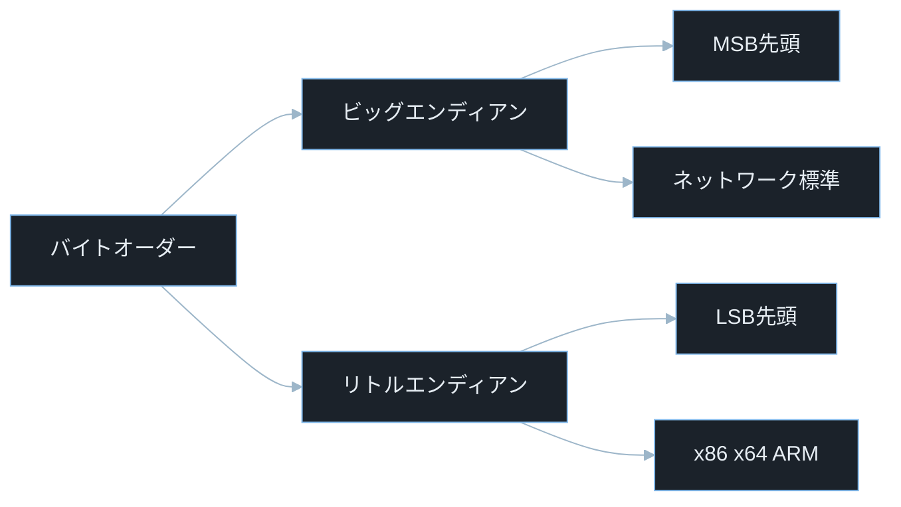
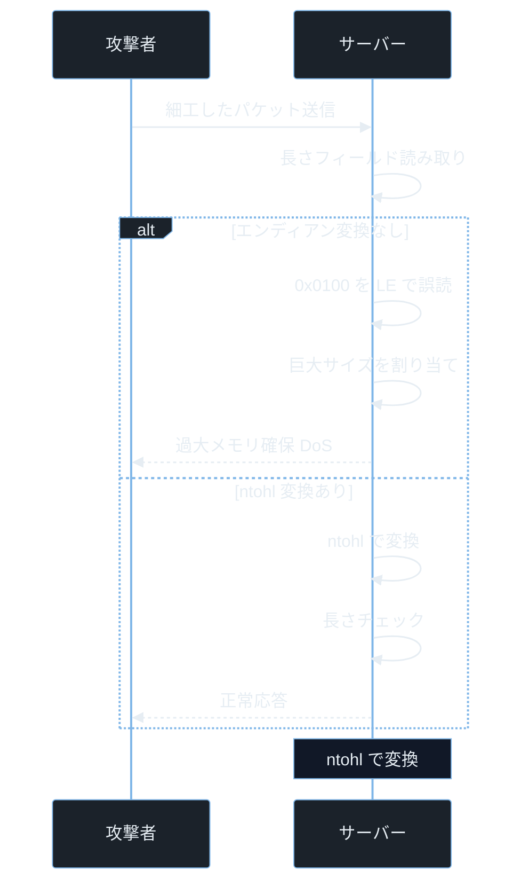

## TL;DR

- エンディアン（バイトオーダー）とは「複数バイトの数値をメモリに並べるときの順番」だ。上位バイトから並べる「ビッグエンディアン」と、下位バイトから並べる「リトルエンディアン」の 2 種類がある。
- x86 / x86-64 はリトルエンディアンで動作し、ARM は bi-endian 対応だが現代の OS では通常リトルエンディアンで運用される。ネットワークプロトコルはビッグエンディアン（ネットワークバイトオーダー）が標準だ。この違いを変換せずに使うとエンディアン誤読の原因になる。
- CTF の Pwn カテゴリでは Return Address を**リトルエンディアン**でスタックに書き込む必要があり、エンディアンを間違えると exploit が動かない。

---

## なぜ重要か

「x86 の Return Address `0xdeadbeef` をスタックに書くとき、バイト列はどの順番で送ればいいか？」

この問いに即答できないなら、この記事が助けになる。答えはシンプルだ——**リトルエンディアンの順番 `\xef\xbe\xad\xde` で送らなければ exploit は動かない**。エンディアンの仕組みを知れば、Pwn でアドレスが刺さらない原因や、ネットワークパーサーが異常な長さを読む理由が根本から理解できる。

具体的に挙げると：

- **ネットワークプロトコル解析**: TCP/IP のマルチバイト整数フィールドはネットワークバイトオーダー（ビッグエンディアン）で定義されている。x86 のサーバーで変換なしにフィールドを読むと、長さが想定より数百〜数千倍大きな値として解釈されてしまう。
- **バイナリフォーマット解析**: PNG・ELF・BMP など各ファイルフォーマットはエンディアンが決まっている。逆アセンブラやパーサーの実装を誤るとデータを誤読して脆弱性になる。
- **クロスプラットフォーム通信**: MIPS/PowerPC（ビッグエンディアン）と x86（リトルエンディアン）が通信するとき、変換なしに整数をやり取りすると双方が異なる値を見る。

---

## 読む前に確認したい用語

難しい用語は出てきたタイミングで解説するが、以下の概念は記事全体を通して何度も登場する。ざっと目を通してから先に進もう。

**バイトオーダーの 2 種**
- **エンディアン（バイトオーダー）**: 複数バイトの数値をメモリ上に並べる順番のルール。「どちらの端（end）から並べるか」から来ている。以降「エンディアン」で統一する。
- **ビッグエンディアン（Big-Endian）**: MSB（上位バイト）を先頭（低いアドレス）に置く。人間が読む数値の並び順と一致する。SPARC・PowerPC・ネットワークプロトコルが採用。
- **リトルエンディアン（Little-Endian）**: LSB（下位バイト）を先頭に置く。x86・x86-64・現代の ARM が採用。

**バイトの概念**
- **MSB（Most Significant Byte）**: 最上位バイト。最も大きな桁を担うバイト。32 ビット値 `0x12345678` では `0x12` が MSB。
- **LSB（Least Significant Byte）**: 最下位バイト。最も小さな桁を担うバイト。`0x12345678` では `0x78` が LSB。

**ネットワーク関連**
- **ネットワークバイトオーダー（Network Byte Order）**: TCP/IP などのネットワークプロトコルが使うエンディアン。ビッグエンディアンと同義。
- **ntohl / htonl**: ネットワークバイトオーダーとホストバイトオーダーを相互変換する C 標準関数。`ntohl` = network to host long（32 ビット変換）、`htonl` = host to network long。

**セキュリティ・CTF**
- **Return Address（リターンアドレス）**: 関数が終了したあとに実行を再開するアドレス。スタック上に保存されており、バッファオーバーフローによる上書きが CTF Pwn の基本テクニック。
- **exploit（エクスプロイト）**: 脆弱性を突いて攻撃を成立させるコードや手順。CTF Pwn では stack smashing + Return Address 書き込みが代表的。
- **CTF**: Capture The Flag。Pwn カテゴリではエンディアンの正確な理解が必須。
- **OOM（Out Of Memory）**: 利用可能なメモリを使い切った状態。過大なメモリ確保要求がトリガーになることがある。

**アーキテクチャ**
- **SPARC**: Sun Microsystems が開発した RISC アーキテクチャ。歴史的にビッグエンディアン環境として知られる。
- **PowerPC**: IBM・Motorola・Apple が採用した CPU アーキテクチャ。ビッグエンディアン運用で知られ、初代 Mac や一部のゲーム機（Wii・PS3）でも使われた。
- **CVSS**: Common Vulnerability Scoring System。脆弱性の深刻度を 0.0〜10.0 で評価する指標。

---

## 仕組み

### エンディアンの分類



MSB を先頭に置くか LSB を先頭に置くかという 1 つの違いが、アーキテクチャとネットワークを跨ぐすべてのバイトオーダー問題の根本だ。x86（リトルエンディアン）とネットワーク（ビッグエンディアン）が混在する環境では、変換を忘れると数値が数百〜数万倍に化ける。

**計算量まとめ**

エンディアンの特性を整理する。

- **ビッグエンディアン**: アドレス低 → 高の順に MSB から格納。人間の読み方と一致。ネットワーク標準。SPARC・PowerPC が採用。
- **リトルエンディアン**: アドレス低 → 高の順に LSB から格納。`xxd` でダンプすると「逆順に見える」。x86・x86-64・現代の ARM が採用。

**エンディアンの弱点 — 変換忘れによる誤読**

ネットワーク（ビッグエンディアン）からリトルエンディアンのサーバーへデータが届いたとき、変換なしに整数として読むと全く異なる値になる。この誤読が過大なメモリ確保・バッファオーバーフロー・認証バイパスにつながった CVE が複数存在する。

### 具体例 — 0x12345678 のメモリ配置

32 ビット値 `0x12345678` を 4 バイトのメモリに格納する例を見る。

> **`0x12345678` の読み方**: `0x` は 16 進数を示すプレフィックス。`12` が最上位バイト（MSB）、`78` が最下位バイト（LSB）。10 進数では 305,419,896 に相当する。

**ビッグエンディアン（MSB ファースト）**:

アドレス低 → 高の順に、値の上位バイトから格納する。

- アドレス `0x00`: `0x12`（MSB）
- アドレス `0x01`: `0x34`
- アドレス `0x02`: `0x56`
- アドレス `0x03`: `0x78`（LSB）

人間が左から右に読む数値の並びと一致する。

**リトルエンディアン（LSB ファースト）**:

アドレス低 → 高の順に、値の下位バイトから格納する。

- アドレス `0x00`: `0x78`（LSB）
- アドレス `0x01`: `0x56`
- アドレス `0x02`: `0x34`
- アドレス `0x03`: `0x12`（MSB）

一見「逆順」に見えるが、x86 系 CPU はこの順番でメモリを使う。ダンプを `xxd` で見ると「逆順に見える」のはこのためだ。

> **`xxd` とは**: バイナリファイルやデータを 16 進数ダンプで表示するコマンド（hex dump の略）。
> **`xxd -e`**: リトルエンディアン表示モード（`-e` = little-endian）。4 バイト単位でバイトの表示順を反転して出力するため、x86 メモリ上での見え方に近い形で確認できる。

### CTF Pwn でのエンディアン — Return Address の書き込み

バッファオーバーフローで Return Address を `0xdeadbeef` に書き換えたい場合、x86 リトルエンディアンの環境では次のバイト列をスタックに書く。

> **`0xdeadbeef` とは**: デバッグや exploit 解説で頻繁に使われる代表的なダミー値。`DEAD BEEF`（死んだ牛肉）という語呂合わせで覚えやすく、特別な機能はない。16 進数として視覚的に識別しやすいため広く使われる。

```python
import struct

addr = 0xdeadbeef
payload = struct.pack('<I', addr)
print(payload.hex())
```

> **`struct.pack('<I', value)`**: Python の `struct` モジュールで整数をバイト列に変換する関数。`<` はリトルエンディアン、`I` は 32 ビット符号なし整数を意味する。`>` に変えるとビッグエンディアン、`!` はネットワークバイトオーダー（ビッグエンディアンと同じ）になる。

出力: `efbeadde`。`0xdeadbeef` がリトルエンディアンで `\xef\xbe\xad\xde` になる。これをそのままスタックに書けば、CPU が読み取るとき正しく `0xdeadbeef` と解釈する。

### 攻撃フロー — ネットワークデータのエンディアン誤読

> **`0x0100` の意味**: 16 進数で 256 を表す。ネットワーク（ビッグエンディアン）での 4 バイト表現は `00 00 01 00`。これをリトルエンディアンとして読むと `0x00010000 = 65,536` になる。この値の違いが過大なメモリ確保を引き起こす。



変換なしのパスでは `0x0100`（256）がリトルエンディアンとして `65,536` に読まれ、巨大なメモリ確保が起きる。`ntohl` で変換してから上限チェックをかければブロックできる——この 2 段階が過大確保バグへの根本的な対策だ。

実際にバッファ範囲外アクセスへ発展するかは後続の実装（確保後の読み取り処理）に依存する。まず過大なメモリ確保が起き OOM や DoS の原因になる。

---

## よくある誤解

実装に進む前に、間違えやすいポイントを整理しておく。「あー、そうか」と思えるものがあれば、コードを書くときに思い出してほしい。

**「ビッグエンディアンが正しくて、リトルエンディアンは間違い」**
どちらが「正しい」かはない。ビッグエンディアンは「人間の読み方と一致する」という利点があり、リトルエンディアンは「下位バイトの参照がアドレス計算なしに行える」というハードウェア設計上の利点がある。**x86 がリトルエンディアンを選んだのは設計判断であり、どちらが優れているという話ではない**。

**「文字列はエンディアンの影響を受けない」**
ASCII・UTF-8 の文字列は 1 バイト単位のためエンディアンは関係ない。しかし **UTF-16 のような 2 バイト文字コードはエンディアンが問題になる**。UTF-16 の BOM（`0xFF 0xFE` = LE、`0xFE 0xFF` = BE）はまさにエンディアンを示すためのマークだ。

**「ARM はビッグエンディアン」**
ARM は「バイエンディアン（Bi-Endian）」アーキテクチャで、ビッグ・リトルどちらも動作できる。しかし**現代の ARM デバイス（スマートフォン・Raspberry Pi・Apple M シリーズ）では OS がリトルエンディアンモードで動作**するよう設定している。「ARM = ビッグ」は古い知識だ。

**「ネットワークパケットの中身をそのまま整数として使えば大丈夫」**
TCP/IP のマルチバイト整数フィールドはビッグエンディアンで定義されている。x86 のサーバーで変換なしに整数として使うと、ビッグエンディアンの値がリトルエンディアンとして読まれて全く異なる数値になる。**`ntohl()`・`ntohs()`・`struct.unpack('!', ...)` で変換してから使う**。

**「pwntools の p32() は常にリトルエンディアンでパックする」**
デフォルトはリトルエンディアンだが、`context.arch` や引数で変更できる。`p32(val, endian='big')` でビッグエンディアンにもなる。**ターゲットが MIPS や PowerPC の場合は `context.endian = 'big'` を明示する必要がある**。

---

## 脆弱なコード例

> 本記事の攻撃例は学習環境・CTF・明示的に許可された検証環境のみで実施してください。
> 実システムへの無断検証は不正アクセス禁止法や各国法令、利用規約違反となる可能性があります。

### PHP — ネットワークデータをリトルエンディアンで誤読するバイナリプロトコル実装

```php
<?php
$socket = stream_socket_client('tcp://api.example.com:8080', $errno, $errstr, 5);
if (!$socket) {
    exit("接続失敗: $errstr");
}

$header = fread($socket, 4);

$msg_length = unpack('V', $header)['V1'];

$body = fread($socket, $msg_length);

echo $body;
fclose($socket);
```

> **`unpack('V', $data)`**: PHP でバイト列を整数に変換する関数。フォーマット文字が肝心で:
> - `N` = 32 ビット符号なし整数・**ビッグエンディアン**（Network byte order）
> - `V` = 32 ビット符号なし整数・**リトルエンディアン**（little-endian）
> - `n` = 16 ビット符号なし整数・ビッグエンディアン
> - `v` = 16 ビット符号なし整数・リトルエンディアン

**どこが問題か**: ネットワークから来るデータはビッグエンディアンが標準だが、`unpack('V', ...)` でリトルエンディアンとして読んでいる。`0x00 0x00 0x01 0x00`（正しくは 256）が `0x00010000 = 65,536` と解釈される。**攻撃者は 256 バイトのペイロードを送るだけで、サーバーに `fread($socket, 65536)` を実行させ、メモリ消費や待機時間増大を引き起こせる**。

**防御策:**

```php
<?php
$socket = stream_socket_client('tcp://api.example.com:8080', $errno, $errstr, 5);
if (!$socket) {
    exit("接続失敗: $errstr");
}

$header = fread($socket, 4);

$msg_length = unpack('N', $header)['N1'];

if ($msg_length > 65536) {
    fclose($socket);
    exit("異常な長さ: $msg_length");
}

$body = fread($socket, $msg_length);
echo $body;
fclose($socket);
```

`unpack('N', ...)` でビッグエンディアン（ネットワークバイトオーダー）として正しく読む。さらに `$msg_length` の上限チェックを追加して異常値を拒否する。**「エンディアン変換 → 上限チェック」の 2 層で守るのがポイントだ。**

---

### Node.js — Buffer の readUInt32LE / readUInt32BE の取り違え

```javascript
const net = require('net');

const client = net.createConnection({ port: 8080, host: 'api.example.com' });

client.on('data', (data) => {
    const msgLen = data.readUInt32LE(0);

    const body = data.slice(4, 4 + msgLen);
    console.log(body.toString('utf8'));
});
```

> **`Buffer.readUInt32LE(offset)`**: Node.js の Buffer オブジェクトから 32 ビット符号なし整数をリトルエンディアンで読み取るメソッド。`LE` = Little-Endian、`BE` = Big-Endian。`offset` はバイト位置（0 から始まる）。

**どこが問題か**: ネットワークから受け取った `data` はビッグエンディアンで書かれているのに `readUInt32LE(0)` でリトルエンディアン解釈をしている。`[0x00, 0x00, 0x01, 0x00]`（= 256）が `0x00010000 = 65536` として読まれ、**`data.slice(4, 65540)` が呼ばれてバッファ範囲外アクセスや大量メモリ割り当てが発生する**。

**防御策:**

```javascript
const net = require('net');

const client = net.createConnection({ port: 8080, host: 'api.example.com' });

client.on('data', (data) => {
    if (data.length < 4) {
        console.error('ヘッダが短すぎます');
        return;
    }

    const msgLen = data.readUInt32BE(0);

    if (msgLen > 65536 || data.length < 4 + msgLen) {
        console.error('不正な長さ:', msgLen);
        return;
    }

    const body = data.slice(4, 4 + msgLen);
    console.log(body.toString('utf8'));
});
```

`readUInt32BE(0)` でビッグエンディアンとして正しく読む。`msgLen` の上限チェックと実際のバッファ長との整合確認も行う。**`BE` か `LE` の 2 文字の違いがバグの全てであり、メソッド名を API ドキュメントで必ず確認する習慣が重要だ。**

---

### Python — struct.unpack のフォーマット文字ミス

```python
import struct
import socket

sock = socket.socket(socket.AF_INET, socket.SOCK_STREAM)
sock.connect(('api.example.com', 8080))

header = sock.recv(4)
msg_len = struct.unpack('<I', header)[0]

body = sock.recv(msg_len)
print(body.decode('utf-8'))
sock.close()
```

> **`struct.unpack(fmt, buffer)`**: Python でバイト列を整数などの Python オブジェクトに変換する関数。`fmt`（フォーマット文字）の主な選択肢:
> - `'<I'`: `<` = リトルエンディアン、`I` = 32 ビット符号なし整数
> - `'>I'`: `>` = ビッグエンディアン
> - `'!I'`: `!` = ネットワークバイトオーダー（ビッグエンディアンと同じ）
> - `'=I'`: `=` = ネイティブ（実行マシンのエンディアン。x86 ならリトルエンディアン）
> 戻り値はタプルなので `[0]` で最初の要素を取り出す。

**どこが問題か**: `'<I'`（リトルエンディアン）でネットワークの長さフィールドを読んでいる。`b'\x00\x00\x01\x00'`（ビッグエンディアンで 256）が `0x00010000 = 65536` と誤読される。**`struct.unpack` のフォーマット文字 1 文字を変え忘れるだけで、サーバーが 256 倍のデータを読もうとする DoS の原因になる**。

**防御策:**

```python
import struct
import socket

MAX_MSG_LEN = 65536

sock = socket.socket(socket.AF_INET, socket.SOCK_STREAM)
sock.connect(('api.example.com', 8080))

header = sock.recv(4)
if len(header) < 4:
    raise ValueError("ヘッダが不完全")

msg_len = struct.unpack('!I', header)[0]

if msg_len > MAX_MSG_LEN:
    raise ValueError(f"異常な長さ: {msg_len}")

body = sock.recv(msg_len)
print(body.decode('utf-8'))
sock.close()
```

`'!I'`（ネットワークバイトオーダー = ビッグエンディアン）で正しく読む。`socket.ntohl()` を使う方法もある。**ネットワークデータには `'!'` を使うと「ネットワーク用途であること」が明示されてレビューでも気づきやすい。**

---

## 実践例 / 演習例

### Python でエンディアンを体感する

```python
import struct

value = 0x12345678
be = struct.pack('>I', value)
le = struct.pack('<I', value)

print(f"値: 0x{value:08X}")
print(f"ビッグエンディアン:    {be.hex(' ')}")
print(f"リトルエンディアン:    {le.hex(' ')}")
print(f"ネット→ホスト変換結果: {struct.unpack('!I', be)[0]:08X}")
```

> **`0x{value:08X}`**: Python の f-string フォーマット指定子。`08X` は「16 進数・8 桁・大文字・0 埋め」で表示する。`08` が桁数と 0 埋め指定、`X` が大文字 16 進数を意味する。

実行すると次のような出力になる。

```
値: 0x12345678
ビッグエンディアン:    12 34 56 78
リトルエンディアン:    78 56 34 12
ネット→ホスト変換結果: 12345678
```

### xxd でリトルエンディアンのダンプを読む

```bash
echo -n "\x78\x56\x34\x12" | xxd
echo -n "\x78\x56\x34\x12" | xxd -e
```

> **`echo -n`**: 末尾に改行を付けずに文字列を出力するオプション（`-n` = no newline）。
> **`xxd`**: バイナリを 16 進数で表示するツール（hex dump の略）。通常はバイト順そのままに表示する。
> **`xxd -e`**: リトルエンディアン表示モード（`-e` = little-endian）。4 バイト単位でバイトの表示順を反転して出力する。`\x78\x56\x34\x12` を `-e` で見ると `12345678` と読める。x86 メモリのダンプを人間が読みやすい順で確認するときに便利だ。

### ネットワークバイトオーダー変換を確認する

```python
import socket

host_value = 0x00000100

network_value = socket.htonl(host_value)
restored_value = socket.ntohl(network_value)

print(f"ホスト値:     0x{host_value:08X}")
print(f"ネットワーク: 0x{network_value:08X}")
print(f"復元後:       0x{restored_value:08X}")
```

> **`socket.htonl(x)`**: Python の socket モジュールが提供するエンディアン変換関数。`htonl` = host to network long（ホストエンディアン → ネットワークバイトオーダー 32 ビット）。x86 ではビッグエンディアンへの変換になる。`socket.ntohl()` は逆方向（ネットワーク → ホスト）。

### （発展）Return Address を pwntools でパックする

> **この項目は CTF Pwn に興味がある読者向けの発展内容だ。** まずは上の Python struct / xxd / socket の実践例でエンディアンの基礎を体感してから読むことを推奨する。

```python
from pwn import p32, p64, u32, u64

addr_32 = 0xdeadbeef
addr_64 = 0x00007ffff7a00000

packed_32 = p32(addr_32)
packed_64 = p64(addr_64)

print(f"p32(0xdeadbeef) = {packed_32.hex()}")
print(f"p64(0x7ffff7a00000) = {packed_64.hex()}")

print(f"u32({packed_32.hex()}) = 0x{u32(packed_32):08x}")
```

> **`pwntools`**: CTF の Pwn 問題を解くための Python ライブラリ。`p32()` は 32 ビット値をリトルエンディアンでパック、`u32()` はリトルエンディアンの 4 バイト列を 32 ビット整数にアンパック。`p64()`/`u64()` は 64 ビット版。インストールは `pip install pwntools`。

---

## 防御策

### 1. ネットワークデータには常にビッグエンディアン変換を適用する

```python
import struct

def read_network_uint32(data: bytes, offset: int = 0) -> int:
    return struct.unpack_from('!I', data, offset)[0]

def write_network_uint32(value: int) -> bytes:
    return struct.pack('!I', value)
```

`'!'`（ネットワークバイトオーダー）を明示的に使う。`'>'`（ビッグエンディアン）でも同じ結果だが、`'!'` の方が「ネットワーク用途であること」を意図として伝えやすい。

### 2. 受け取った長さフィールドには必ず上限チェックを追加する

```python
MAX_PAYLOAD_SIZE = 1024 * 1024

def parse_packet(data: bytes) -> bytes:
    if len(data) < 4:
        raise ValueError("パケットが短すぎます")

    payload_len = struct.unpack('!I', data[:4])[0]

    if payload_len > MAX_PAYLOAD_SIZE:
        raise ValueError(f"payload_len が上限超え: {payload_len}")

    if len(data) < 4 + payload_len:
        raise ValueError("データが宣言された長さより短い")

    return data[4:4 + payload_len]
```

エンディアン変換後の値が「ありえない大きさ」でないかを必ず検証する。

### 3. PHP では pack/unpack のフォーマット文字を明示してコメントする

```php
<?php
function read_network_uint32(string $data): int
{
    return unpack('N', $data)['N1'];
}

function write_network_uint32(int $value): string
{
    return pack('N', $value);
}
```

`N`（ビッグエンディアン 32 ビット）と `V`（リトルエンディアン 32 ビット）は 1 文字違いでバグになる。関数化してフォーマット文字を 1 か所で管理する。

### 4. CTF Pwn: pwntools でエンディアン指定を徹底する

```python
from pwn import context, p32, p64

context.arch = 'amd64'

addr = 0xdeadbeef

payload = b'A' * 64
payload += p64(0)
payload += p64(addr)
```

> **`context.arch = 'amd64'`**: pwntools にターゲットのアーキテクチャを伝える設定。これにより `p64()` が正しいサイズでパックする。`'i386'` に設定すると `p32()` が対応する。

---

## 実演ラボ案内

### 推奨学習順序

- binary-hex-bitwise（2進数・16進数・バイト列の基礎）
- endianness（本記事）
- elf-pe-format（ELF の構造とエンディアンの関係）
- network-basics（ネットワークプロトコルとバイトオーダーの実践）
- バッファオーバーフロー基礎（Return Address とエンディアン）
- CTF Pwn 入門

### Hack The Box

- **Challenges — Pwn カテゴリ**: エンディアン理解は全 Pwn 問題の前提だ。`pwntools` の `p32()`・`p64()` を使ってアドレスをパックする練習から始めよう。
- **Challenges — Reversing カテゴリ**: バイナリファイルを `xxd` でダンプし、マジックバイト・ヘッダフィールドのエンディアンを確認することが多い。

### TryHackMe

- **Buffer Overflow Prep**: Return Address の書き方でエンディアンを直接体験できる。

### 自宅 VM（合法演習）

```bash
python3 -c "
import struct
val = 0xCAFEBABE
be = struct.pack('>I', val)
le = struct.pack('<I', val)
print('BE:', be.hex(' '))
print('LE:', le.hex(' '))
"
```

> **`0xCAFEBABE`**: Java クラスファイルのマジックバイト（ビッグエンディアンで先頭 4 バイト）。`xxd` で `.class` ファイルの先頭を確認すると `ca fe ba be` が見える。`CAFE BABE`（カフェの赤ちゃん）という語呂合わせで覚えやすい代表的なマジックバイトだ。

---

## 関連 CVE と被害事例

> **CVE とは**: Common Vulnerabilities and Exposures の略。世界共通の脆弱性識別番号。
> **CVSS スコア**: 脆弱性の深刻度を 0.0〜10.0 で評価した指標。9.0 以上が Critical。

**CVE-2021-31535（libX11 1.7.1 — X11 バイトオーダーネゴシエーション整数オーバーフロー）**
X11 プロトコルは接続確立時にエンディアン識別子（`B` = ビッグエンディアン、`l` = リトルエンディアン）を交換する。libX11 1.7.1 以前はこのネゴシエーション処理において、後続のプロトコルフィールドを適切にバイトスワップせず整数オーバーフローが発生した。これを悪用すると任意コード実行につながるヒープバッファオーバーフローが成立した。CVSS スコア 9.8（Critical）。本記事との関連: バイトオーダー変換の欠如・ネットワークプロトコル実装

**CVE-2022-21449（Java SE — ECDSA 署名検証のバイパス「Psychic Signatures」）**
Java SE 15〜18 の ECDSA 署名検証コードで、BigInteger のバイト表現の処理に問題があった。Java の `BigInteger.toByteArray()` は 2 の補数表現で正の数に先頭ゼロバイトを付加するが、この処理が検証ロジックとかみ合わず、ゼロや無効な値からなる署名が有効と判定された。すべてゼロの署名が任意の鍵で検証を通過するため「Psychic Signatures（超能力署名）」と呼ばれた。CVSS スコア 7.5。本記事との関連: 整数のバイト表現・符号付き整数の先頭バイト問題

> **ECDSA とは**: Elliptic Curve Digital Signature Algorithm の略。楕円曲線暗号を使ったデジタル署名アルゴリズム。TLS 証明書・SSH 鍵・JWT のデジタル署名などに広く使われる。

**CVE-2015-7547（glibc getaddrinfo — DNS 応答ヒープオーバーフロー）**
glibc の DNS クライアント実装（`getaddrinfo()`）が複数回の UDP DNS 応答を受け取るとき、応答バッファの確保に `alloca()`（スタック割り当て）を使っていた。DNS 応答長フィールド（ネットワークバイトオーダー・16 ビット）の処理において、2 つの応答の合算サイズが適切に検証されずスタックベースのバッファオーバーフローが発生した。リモートから DNS 応答を細工することでコード実行が可能だった。CVSS スコア 8.1。本記事との関連: ネットワークバイトオーダーの整数フィールド処理・長さ検証の欠如

> **`alloca()` とは**: スタック上に動的にメモリを確保する C の関数。`malloc()` と違い関数終了時に自動解放されるが、スタックサイズに上限があるためオーバーフローしやすい。

---

## 次に学ぶべき記事

- **elf-pe-format 解剖** — ELF/PE ヘッダ内の各フィールドがどのエンディアンで書かれているかを `readelf` で確認する
- **バッファオーバーフロー入門** — リトルエンディアンの Return Address をスタックに書く実践的な exploit 構築
- **ネットワークプロトコル解析** — TCP/IP パケットのビッグエンディアンフィールドを `struct` で正しく解析する方法

---

## 参考文献

- RFC 791. "Internet Protocol". https://datatracker.ietf.org/doc/html/rfc791
- GNU C Library. "Byte Order". https://www.gnu.org/software/libc/manual/html_node/Byte-Order.html
- NVD. "CVE-2021-31535 Detail". https://nvd.nist.gov/vuln/detail/CVE-2021-31535
- NVD. "CVE-2022-21449 Detail". https://nvd.nist.gov/vuln/detail/CVE-2022-21449
- NVD. "CVE-2015-7547 Detail". https://nvd.nist.gov/vuln/detail/CVE-2015-7547
- Python Docs. "struct — Interpret bytes as packed binary data". https://docs.python.org/3/library/struct.html
- pwntools Docs. https://docs.pwntools.com/en/stable/
