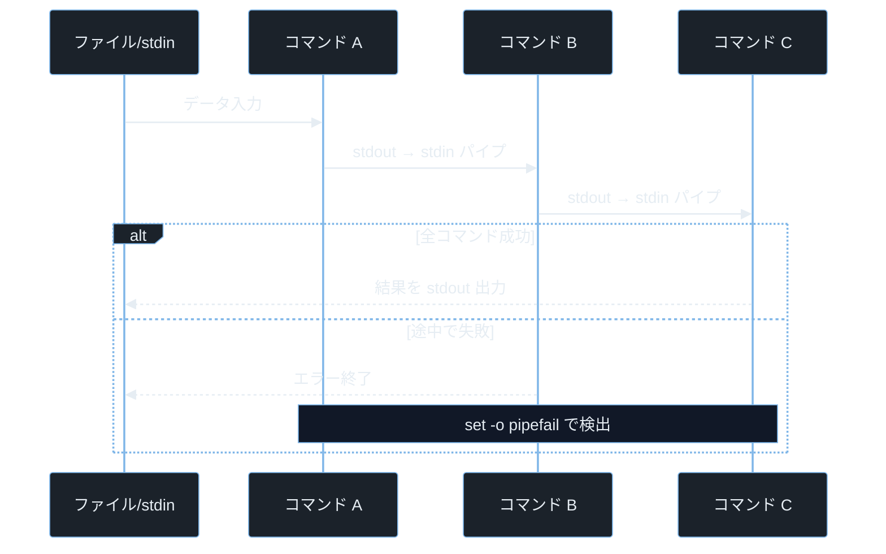
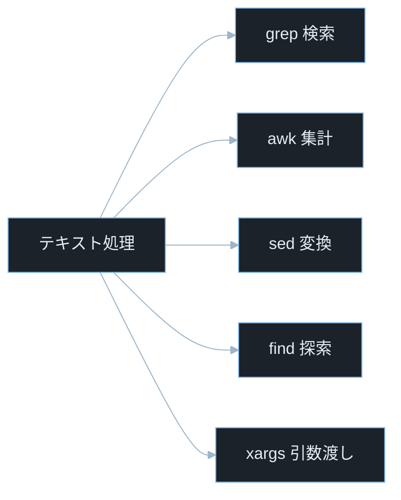
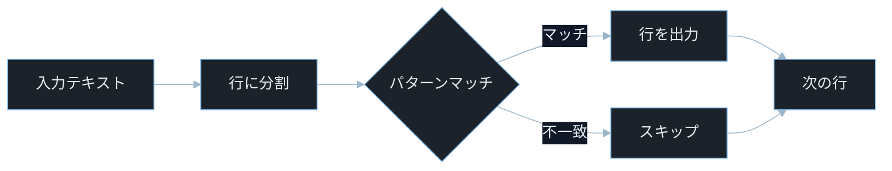
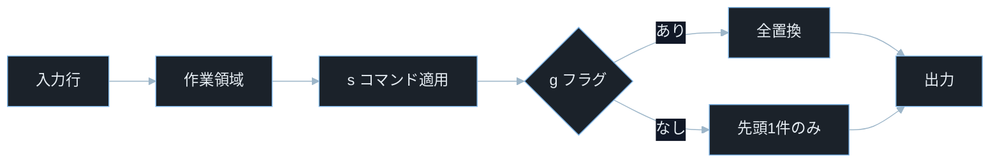

## TL;DR

- `ls`・`cat`・`grep`・`awk`・`sed` はセキュリティ実務で毎日使うコマンドだ。これらをパイプ（`｜`）でつなぐと、ログ解析・機密情報探索・インシデントレスポンスの大半が 1 行で完結する。
- パイプはカーネルの IPC 機能で前段の標準出力を後段の標準入力につなぐ。ユーザー入力がシェル経由でコマンド文字列に組み込まれると**コマンドインジェクション**が成立し、任意コードが実行される。
- `grep -r`・`find`・`xargs` の組み合わせは CTF Forensics でフラグを探す定番ツールチェーンだ。ファイルシステム全体から特定パターンを数秒で抽出できる。

---

## なぜ重要か

「GUI のファイルマネージャで操作できるのに、コマンドラインのファイル操作を覚える必要があるのか？」

この問いに即答できないなら、この記事が助けになる。**コマンドラインのファイル操作は GUI の 100 倍速く、スクリプト化・自動化・リモート実行が可能で、セキュリティ調査では唯一の選択肢になる場面が多い。** ファイル操作とパイプの仕組みを知れば、ログの海から攻撃の痕跡を数秒で見つけ出す技術が身につく。

具体的に挙げると：

- アクセスログ 100 万行から攻撃パターンを `grep` で即座に絞り込む
- ソースコードのリポジトリ全体からハードコードされたパスワードを `grep -r` で一括検出する
- CTF Forensics でディスクイメージの中身を `find`・`strings`・`grep` でフラグ形式のパターン検索する
- インシデントレスポンスで攻撃者が残した不審ファイルを `find -newer` で時刻ベースに絞り込む
- `awk` で Apache アクセスログを集計して攻撃元 IP のランキングを作る

> **CTF とは**: Capture The Flag の略。セキュリティ技術を競う演習形式。Forensics はファイル・ログ・メモリダンプの解析、Pwn はバイナリ脆弱性悪用が主題。

---

## 読む前に確認したい用語

難しい用語は出てきたタイミングで解説するが、以下の概念は記事全体を通して何度も登場する。ざっと目を通してから先に進もう。

**ファイルとストリーム**
- **標準入力（stdin）**: プログラムがデータを読み込む入口。ファイルディスクリプタ番号 `0`。デフォルトはキーボード。
- **標準出力（stdout）**: プログラムが結果を書き出す出口。ファイルディスクリプタ番号 `1`。デフォルトは画面。
- **標準エラー出力（stderr）**: エラーメッセージを書き出す出口。ファイルディスクリプタ番号 `2`。デフォルトは画面。
- **パイプ**: 前段コマンドの stdout を後段コマンドの stdin につなぐカーネルの IPC 機能。`｜` で記述する。

**正規表現の基本**
- **正規表現（regex）**: テキストのパターンを記述する書き方。`[0-9]+` は「1 桁以上の数字」を意味する。
- **BRE（Basic Regular Expression）**: `grep` のデフォルト正規表現モード。`+` や `|` をメタ文字として使うにはバックスラッシュが必要（`\+`・`\|`）。
- **ERE（Extended Regular Expression）**: `grep -E` や `awk` が使う拡張モード。`+`・`|`・`()` がそのまま使える。

**コマンドの入出力制御**
- **リダイレクト（`>`・`>>`・`<`）**: コマンドの入出力をファイルに切り替える。`>` は上書き・`>>` は追記・`<` はファイルから入力。
- **ヒアドキュメント（`<< EOF`）**: 複数行テキストをコマンドの標準入力に渡す記法。
- **プロセス置換（`<(command)`）**: コマンドの出力を一時ファイルのように別のコマンドに渡す Bash 機能。
- **`xargs`**: 標準入力の各行をコマンドの引数として渡すコマンド。`find | xargs grep` のように使う。

**セキュリティ用語**
- **コマンドインジェクション**: ユーザー入力がシェルコマンドの一部として実行される脆弱性。
- **CVE**: Common Vulnerabilities and Exposures の略。世界共通の脆弱性識別番号。
- **CVSS**: Common Vulnerability Scoring System。脆弱性の深刻度を 0.0〜10.0 で評価する指標。

---

## 仕組み

### パイプラインのデータフロー



パイプはカーネルが管理する環状バッファで前段と後段をつなぎ、両プロセスが同時に動作する。前段が出力を止めると後段はブロックして待つ。この仕組みがコマンドの組み合わせで強力なデータ処理を可能にするが、途中のエラーが無視されやすいという落とし穴もある。

**計算量まとめ**

- **パイプ転送**: O(n)。n はデータサイズ。カーネルバッファを経由したコピー。
- **`grep` 線形検索**: O(L × P)。L は行数・P はパターン長。`-F`（固定文字列）で高速化できる。
- **`awk` 行処理**: O(L)。各行を 1 回処理する。集計はハッシュテーブルで O(1) アクセス。

**パイプラインの弱点 — エラーのサイレント化**

デフォルトでは `cmd_a | cmd_b | cmd_c` の終了コードは最後の `cmd_c` のものだけが `$?` に残る。`cmd_a` がエラーで異常終了しても `cmd_c` が成功すれば全体が成功扱いになる。セキュリティスクリプトで途中の検証コマンドが無音で失敗しても処理が続いてしまう。

---

### ファイル処理コマンドの分類



各コマンドは単独でも強力だが、パイプで組み合わせることで「検索 → 集計 → 変換」のパイプラインが 1 行で完結する。セキュリティ調査ではこのチェーンを素早く組み立てる能力が直接的な調査速度に直結する。

---

### grep — パターンマッチングエンジン



`grep` はテキストを 1 行ずつ読んでパターンと照合し、マッチした行だけを出力する。オプションでマッチ前後の行も取れるため、ログ解析でエラーの前後コンテキストを確認するときに便利だ。パターンに正規表現が使えるため、複雑な条件でも 1 コマンドで絞り込める。

**計算量まとめ**

- **`grep` 基本**: O(L × P)。各行に対してパターンマッチ。
- **`grep -F`**: O(L × P) だが定数係数が小さい。固定文字列はハッシュで高速化。
- **`grep -r`**: O(ファイル数 × 行数 × P)。ディレクトリ全体を再帰的に検索。

**grep の弱点 — バイナリファイルのスキップ**

デフォルトの `grep` はバイナリファイルを検出すると「バイナリファイルにマッチ」と表示してスキップする。CTF でフラグがバイナリに埋め込まれているとき、`grep -a`（バイナリをテキストとして扱う）か `strings | grep` を使わないと見逃す。

> **`grep -a` とは**: バイナリファイルをテキストとして扱って検索するオプション（`--text` と同義）。実行ファイルやアーカイブ内の文字列を検索するときに使う。

---

### awk — フィールド指向のテキスト処理


`awk` は各行をフィールド（列）に分割し、パターンにマッチした行だけアクションを実行する。`BEGIN` で初期化・`END` で集計結果を出力するパターンが基本だ。変数・配列・算術演算を持つ完全な言語なので、ログの集計・フォーマット変換・レポート生成まで `awk` 1 本でできる。

> **`BEGIN` ブロックとは**: 入力ファイルを 1 行も読む前に 1 回だけ実行されるブロック。変数の初期化や区切り文字の設定（`FS=","` など）に使う。
> **`END` ブロックとは**: 全ての入力行を処理し終えた後に 1 回だけ実行されるブロック。集計結果の出力や合計値の表示に使う。

**計算量まとめ**

- **フィールド分割**: O(行長)。区切り文字（デフォルトはスペース・タブ）を探して分割。
- **配列集計（`count[$1]++`）**: O(1) アモータイズ。ハッシュテーブルで管理。
- **END 集計出力**: O(ユニークキー数)。

**awk の弱点 — 区切り文字の誤設定**

デフォルトの区切り文字は「1 個以上のスペースまたはタブ」だ。CSV のようにカンマ区切りのファイルを処理するときは `-F ','` を指定しないと正しく分割されない。さらにフィールド内に区切り文字が含まれるケース（クォートされた CSV）は `awk` だけでは正しく扱えず専用ツール（`csvkit`・Python の `csv` モジュール等）が必要になる。

---

### sed — ストリームエディタ



> **sed の区切り文字について**: `s/old/new/` の `/` は固定ではなく任意の文字が使える。URL など `/` を含む文字列を置換するときは `s|old|new|` や `s#old#new#` のように区切り文字を変えると読みやすい。

> **`sed` とは**: ストリームエディタ（Stream EDitor の略）。ファイルを読みながら置換・削除・変換を 1 行ずつ処理する。ファイルを直接書き換えるには `-i` オプションを使う。

`sed` は入力を「パターンスペース」（一時バッファ）に読み込み、コマンドを適用してから出力する。最も使うコマンドは `s/old/new/` の置換だ。フラグ `g` で行内全件置換・`I` で大文字小文字無視。`-i` でファイルをインプレース編集できる。

**計算量まとめ**

- **`s/old/new/`**: O(L × P)。各行にパターンマッチして置換。
- **`d`（削除）**: O(L)。条件マッチした行を捨てる。
- **`-i` インプレース**: O(ファイルサイズ)。内部で一時ファイルを作ってから元ファイルを置換。

**sed の弱点 — 区切り文字のエスケープ**

`s/old/new/` の区切り文字 `/` がパターンや置換文字列に含まれるとき（URL の置換など）、全ての `/` を `\/` にエスケープしなければならない。代替区切り文字（`s|old|new|` や `s#old#new#`）を使うと読みやすくなる。

---

## よくある誤解

実装に進む前に、間違えやすいポイントを整理しておく。「あー、そうか」と思えるものがあれば、コードを書くときに思い出してほしい。

**「`grep -r` でどんなファイルも探せる」**
`grep -r` はテキストファイルを対象に検索するが、バイナリファイル（実行ファイル・画像・アーカイブ）はデフォルトでスキップする。**バイナリ内の文字列を探すには `grep -ra`（バイナリをテキスト扱い）か `strings [ファイル] | grep [パターン]`** を使う。CTF Forensics でフラグが見つからないときはこれを疑う。

**「`sed -i` は安全に元のファイルを書き換える」**
`sed -i 's/old/new/g' file.txt` は元ファイルを上書きする。**バックアップなし**で実行すると元に戻せない。`sed -i.bak 's/old/new/g' file.txt` のように `.bak` サフィックスを付けると `file.txt.bak` にバックアップが作られる。本番ファイルを直接 `sed -i` する前に必ずバックアップを取る。

**「`awk '{print $2}'` の `$2` は 2 行目」**
`awk` の `$` はフィールド（列）を指す。`$2` は「2 番目のフィールド（列）」で、`$0` は行全体だ。**行番号は `NR` という特別な変数**で参照する。「2 行目を出力」は `awk 'NR==2'` と書く。

**「パイプの途中でエラーが起きれば後段は動かない」**
これは誤りだ。デフォルトでは前段のコマンドが異常終了しても、**パイプバッファに残ったデータで後段は動き続ける**。`set -o pipefail` を設定するか、明示的に終了コードをチェックしないとエラーを見逃す。

**「`find . -name "*.log" | xargs grep "error"` は常に安全」**
ファイル名にスペースや改行が含まれると `xargs` がファイル名を誤って分割して意図しないファイルを渡す。**`find . -name "*.log" -print0 | xargs -0 grep "error"`** のように `-print0`（NUL 区切り出力）と `-0`（NUL 区切り入力）を組み合わせることで安全になる。

---

## 脆弱なコード例

> 本記事の攻撃例は学習環境・CTF・明示的に許可された検証環境のみで実施してください。
> 実システムへの無断検証は不正アクセス禁止法や各国法令・利用規約違反となる可能性があります。

### PHP — ユーザー入力を grep コマンドに渡すインジェクション

```php
<?php
$keyword = $_GET['q'] ?? '';

$output = shell_exec("grep -r " . $keyword . " /var/log/app/");
echo "<pre>" . htmlspecialchars($output ?? '') . "</pre>";
```

> **`$_GET['q']` とは**: HTTP GET リクエストのクエリパラメータ `q` の値を取得する PHP の超グローバル変数。例えば `/search?q=error` でアクセスすると `$_GET['q']` が `"error"` になる。クエリパラメータとは URL の `?` 以降のキーと値のペアを指す。

> **`shell_exec()` とは**: PHP でシェルコマンドを実行してその出力を文字列として返す関数。内部で `/bin/sh -c` を呼ぶため、シェルのメタ文字（`;`・`|`・`$()`・バッククォート等）が全て有効になる。

**どこが問題か**: `?q=error /etc/passwd #` を送るだけで、`/var/log/app/` の代わりに `/etc/passwd` の内容が返ってくる。さらに `?q=; cat /etc/shadow;` を送れば `grep` の実行前後に任意コマンドが走り、Web サーバーの権限でシャドウファイルを読める。ユーザー入力が文字列連結でコマンドに組み込まれているため、シェルが全てを解釈してしまう。

```php
<?php
$keyword = $_GET['q'] ?? '';

if (strlen($keyword) > 100 || !preg_match('/^[\w\s\-\.]+$/', $keyword)) {
    http_response_code(400);
    exit("無効な検索キーワードです");
}

$safe_keyword = escapeshellarg($keyword);
$output = shell_exec("grep -r -F {$safe_keyword} /var/log/app/");
echo "<pre>" . htmlspecialchars($output ?? '') . "</pre>";
```

> **`escapeshellarg()` とは**: PHP で文字列をシェルの引数として安全にエスケープする関数。全体をシングルクォートで囲み、シェルのメタ文字を無効化する。
> **`grep -F` とは**: 正規表現を使わず固定文字列としてパターンを扱うオプション（Fixed string）。ユーザー入力に正規表現の特殊文字が含まれていても安全に検索できる。

ホワイトリスト正規表現で文字種を制限してから `escapeshellarg()` でエスケープする二重防御により、シェルインジェクションを防ぐ。

ユーザー入力は検証し、シェルへ渡す前に固定文字列検索（`-F`）と引数エスケープを組み合わせることが防御の基本だ。

---

### Node.js — find コマンドへのパストラバーサルとインジェクション

```javascript
const express = require('express');
const { exec } = require('child_process');
const app = express();

app.get('/search', (req, res) => {
    const dir = req.query.dir || '/var/log';
    const pattern = req.query.pattern || 'error';
    exec(`find ${dir} -name "*.log" | xargs grep ${pattern}`, (err, stdout) => {
        res.send(stdout || '');
    });
});

app.listen(3000);
```

> **`exec()` とは**: Node.js の `child_process` モジュールでシェルを経由してコマンドを実行する関数。コマンド文字列が `/bin/sh -c` にそのまま渡されるため、ユーザー入力がメタ文字を含むと危険になる。

**どこが問題か**: `?dir=/etc&pattern=shadow` を送ると `/etc` 以下の `.log` ファイル内から `shadow` という文字列を検索する。`?dir=/;id;#&pattern=` のように `dir` にコマンドを注入すれば任意コマンドが実行される。`xargs grep` の引数にも `pattern` 経由でシェルメタ文字が渡り二重インジェクションが成立する。

```javascript
const express = require('express');
const { execFile } = require('child_process');
const path = require('path');
const app = express();

const ALLOWED_BASE = '/var/log';
const SAFE_PATTERN = /^[\w\s\-\.]+$/;

app.get('/search', (req, res) => {
    const dir = req.query.dir || ALLOWED_BASE;
    const pattern = req.query.pattern || 'error';

    const resolvedDir = path.resolve(dir);
    if (!resolvedDir.startsWith(ALLOWED_BASE)) {
        return res.status(400).send('許可されていないディレクトリです');
    }
    if (!SAFE_PATTERN.test(pattern) || pattern.length > 100) {
        return res.status(400).send('無効なパターンです');
    }

    execFile('grep', ['-r', '-F', '--include=*.log', pattern, resolvedDir],
        { maxBuffer: 1024 * 1024 },
        (err, stdout) => {
            res.send(stdout || '');
        }
    );
});

app.listen(3000);
```

> **`path.resolve()` とは**: Node.js でパスを絶対パスに解決する関数。`../` などの相対参照も解決されるため、`resolvedDir.startsWith(ALLOWED_BASE)` と組み合わせてパストラバーサルを検出できる。
> **`execFile()` とは**: シェルを経由せずに直接プログラムを実行する関数。引数を配列で渡すため、シェルのメタ文字が解釈されない。
> **`grep --include=*.log` とは**: 検索対象を `.log` ファイルに限定するオプション。`find | xargs grep` の組み合わせを使わずに `grep -r --include` で同じことができる。

`execFile()` で引数を配列渡しにしてシェルを排除し、ディレクトリをパス正規化後に許可リストと照合することで、インジェクションとパストラバーサルを同時に防ぐ。

パスは許可リストで制限し、コマンドはシェルを介さず引数配列で実行することで、二つの脆弱性を同時に封じる。

---

### Python — sed を使ったログマスキングでのインジェクション

```python
import subprocess
from flask import Flask, request

app = Flask(__name__)

@app.route('/mask')
def mask_log():
    pattern = request.args.get('pattern', '')
    replace = request.args.get('replace', '***')
    log_file = '/var/log/app/access.log'

    result = subprocess.run(
        f"sed 's/{pattern}/{replace}/g' {log_file}",
        shell=True,
        capture_output=True,
        text=True
    )
    return result.stdout
```

**どこが問題か**: `?pattern=password&replace=***` というリクエスト自体は安全だが、`?pattern=x/g' /etc/passwd 'x` のような入力で `sed` コマンドの構造を壊せる。さらに `?pattern=a/g $(id) /tmp/x` のようにコマンド置換を埋め込むと、`shell=True` を通じて任意コードが実行される。`sed` の区切り文字 `/` を含む入力で即座に構文が破壊される。

```python
import re
from flask import Flask, request, abort

app = Flask(__name__)

SAFE_PATTERN = re.compile(r'^[a-zA-Z0-9_\-\.\s@]+$')

@app.route('/mask')
def mask_log():
    pattern = request.args.get('pattern', '')
    replace = request.args.get('replace', '***')
    log_file = '/var/log/app/access.log'

    if not SAFE_PATTERN.match(pattern) or not SAFE_PATTERN.match(replace):
        abort(400)
    if len(pattern) > 50 or len(replace) > 50:
        abort(400)

    with open(log_file, 'r', encoding='utf-8', errors='replace') as f:
        content = f.read()

    masked = content.replace(pattern, replace)
    return masked
```

> **`content.replace(pattern, replace)` とは**: Python の文字列メソッドで、`pattern` の全ての出現箇所を `replace` に置換する。`sed` のように外部プロセスを起動せず、Python 内で完結するため、コマンドインジェクションの経路が存在しない。

`sed` などの外部コマンドを介さず Python の `str.replace()` や `re.sub()` で直接処理することで、シェル経由のインジェクション経路そのものを排除する。

---

## 実践例 / 演習例

### アクセスログ解析ワンライナー

Apache / Nginx のアクセスログから攻撃の痕跡を調べる実践的なコマンド群だ。

```bash
awk '{print $1}' /var/log/nginx/access.log | sort | uniq -c | sort -rn | head -20
```

> **`awk '{print $1}'` とは**: 各行の 1 番目のフィールド（スペース区切り）を出力する。アクセスログではクライアント IP アドレスが 1 列目に来るため、IP を抽出できる。
> **`sort -rn` とは**: 数値（`-n`）で降順（`-r`）にソートする。出現回数でランキングを作るときに使う。
> **`head -20` とは**: 先頭 20 行を表示する（先頭 N 行表示コマンドの `-N` オプション）。上位 20 件の IP が得られる。

```bash
grep -E "(union.*select|select.*from|drop.*table)" /var/log/nginx/access.log -i | wc -l
```

> **`grep -E` とは**: 拡張正規表現（ERE: Extended Regular Expression）を使うオプション。`+`・`|`・`()` がそのままメタ文字として使える。
> **`-i` とは**: 大文字・小文字を区別しないオプション（case-insensitive）。SQL インジェクションは大文字小文字を混在させて WAF を回避しようとすることがあるため必要。
> **`wc -l` とは**: 行数を数えるコマンド（word count の `-l` は lines）。マッチ件数の集計に使う。

```bash
awk '$9 ~ /^[45]/' /var/log/nginx/access.log | awk '{print $9}' | sort | uniq -c | sort -rn
```

> **`$9 ~ /^[45]/`**: `awk` でフィールド `$9`（HTTP ステータスコード）が `4xx` または `5xx` で始まる行にマッチする条件。`~` は正規表現マッチ演算子。`^[45]` は「4 か 5 で始まる」を意味する。

```bash
grep -oE '\b([0-9]{1,3}\.){3}[0-9]{1,3}\b' /var/log/nginx/access.log | sort -u
```

> **`grep -o` とは**: マッチした部分だけを出力するオプション（only matching）。行全体ではなくパターンにマッチした文字列だけを抜き出せる。
> **`sort -u` とは**: ソートして重複行を除去するオプション（unique）。`sort | uniq` と同等だが 1 コマンドで済む。

### CTF Forensics でフラグを探す

```bash
find . -type f -print0 | xargs -0 grep -l "HTB{"
```

> **`find . -type f` とは**: カレントディレクトリ以下の全てのファイル（ディレクトリを除く）を検索する。`-type f` は通常ファイルのみを対象にする。
> **`-print0` と `xargs -0`**: ファイル名に空白や特殊文字が含まれても安全に処理するために、NUL 文字（`\0`）区切りでファイル名をやりとりする組み合わせ。

```bash
find . \( -name "*.pcap" -o -name "*.pcapng" \) | xargs strings | grep -oE 'HTB\{[^}]+\}'
```

> **`\( ... -o ... \)` とは**: `find` でOR条件をグループ化する記法。`\(` と `\)` でグループを作り、`-o` で論理 OR を表す。バックスラッシュでエスケープするのはシェルが `()` を解釈しないようにするため。グループ化しないと `-o` の優先順位が予期せぬ動作を引き起こすことがある。

> **`strings` とは**: バイナリファイルから印字可能な文字列（デフォルト 4 文字以上）を抽出するコマンド（print strings of printable characters の略）。`-n 6` で最小長を 6 文字に変更できる。
> **`-oE 'HTB\{[^}]+\}'`**: フラグ形式 `HTB{...}` にマッチする正規表現。`[^}]+` は `}` 以外の 1 文字以上を意味する。

```bash
find . -newer /tmp/reference_time -type f -ls
```

> **`-newer [ファイル]`**: 指定ファイルより更新日時が新しいファイルを検索する。インシデントレスポンスで攻撃が発生した時刻以降に作成・変更されたファイルを絞り込むのに使う。

### 機密情報の漏洩チェック

```bash
grep -r --include="*.py" --include="*.js" --include="*.php" \
    -iE "(password|passwd|secret|api_key|token)\s*=\s*['\"][^'\"]{4,}" \
    /path/to/project/
```

> **`--include="*.py"` とは**: 検索対象を指定した拡張子のファイルに限定するオプション。複数回指定で複数拡張子を対象にできる。

```bash
git log --all --full-history -- "**/.env" "**/*.pem" "**/*.key" 2>/dev/null
```

> **`git log --all --full-history`**: Git の全ブランチ・全コミット履歴を対象にファイルの変更歴を追跡する。削除済みの機密ファイルがコミット履歴に残っていないかを確認できる。

---

## 防御策

### 1. パイプラインに `set -o pipefail` を設定する

```bash
#!/bin/bash
set -euo pipefail

grep "ERROR" /var/log/app.log | awk '{print $1}' | sort | uniq -c
echo "終了コード: $?"
```

> **`set -e`**: コマンドがエラー終了したらスクリプトを即座に停止する。
> **`set -u`**: 未定義変数を参照したらエラーにする（タイポ防止）。
> **`set -o pipefail`**: パイプラインの途中でエラーが起きたとき、そのエラーコードをパイプ全体の終了コードにする。

### 2. `find | xargs` は必ず NUL 区切りを使う

```bash
find /var/log -name "*.log" -newer /tmp/ref -print0 | \
    xargs -0 grep -l "ERROR" | \
    tr '\n' '\0' | \
    xargs -0 -I{} cp {} /tmp/evidence/
```

> **`tr '\n' '\0'` とは**: 改行文字（`\n`）を NUL 文字（`\0`）に変換するコマンド。`grep -l` の出力は改行区切りなので、後段の `xargs -0` に渡す前に NUL 区切りに変換する必要がある。

> **`xargs -I{}` とは**: 標準入力から読んだ各行を `{}` の位置に埋め込んで実行するオプション。`xargs -0 -I{} cp {} /tmp/` は「各ファイルを `/tmp/` にコピーする」という意味になる。

ファイル名に空白・特殊文字が含まれる場合に備えて、`-print0` / `-0` の組み合わせを習慣にする。

### 3. `sed` の区切り文字をコンテキストに合わせる

```bash
URL='https://example.com/path'
ESCAPED=$(printf '%s\n' "$URL" | sed 's/[[\.*^$()+?{|]/\\&/g')
sed "s|${ESCAPED}|https://safe.example.com|g" config.txt
```

### 4. ログ解析スクリプトに出力制限を付ける

```python
import subprocess
import shlex

def safe_grep(pattern: str, log_file: str, max_lines: int = 1000) -> list[str]:
    if not pattern or len(pattern) > 100:
        raise ValueError("パターンが無効です")

    safe_pattern = shlex.quote(pattern)

    result = subprocess.run(
        ['grep', '-F', '-m', str(max_lines), safe_pattern, log_file],
        capture_output=True,
        text=True,
        timeout=30
    )
    return result.stdout.splitlines()
```

> **`grep -m [N]`**: 最大 N 行でマッチを停止するオプション（max-count）。大量のログで出力が爆発するのを防ぐ。
> **`shlex` モジュール**: Python でシェルのクォート・エスケープ処理を行う標準ライブラリ。`shlex.quote(string)` でシェル引数を安全にエスケープできる（Python での `escapeshellarg()` 相当）。

---

## 実演ラボ案内

### 推奨学習順序

- terminal-basics（シェルの基礎・パイプの概念）
- linux-filesystem（ファイルシステム・パーミッションの理解）
- file-pipe-commands（本記事）
- regex-grep-sed-awk（正規表現の深い理解）
- linux-privilege-escalation（ファイル操作を使った権限昇格）

### Hack The Box

- **Challenges — Forensics カテゴリ**: ディスクイメージ・ログファイル・パケットキャプチャから `grep`・`awk`・`strings`・`find` でフラグを探す問題が最頻出だ。「grep で見つからない → strings で再試行 → xxd で確認」という順序を覚える。
- **Starting Point — Dancing / Crocodile**: ファイル一覧・ダウンロード・内容確認の一連の流れを実践できる。

> **`xxd` とは**: バイナリファイルを 16 進数ダンプで表示するコマンド（hex dump の略）。`xxd [ファイル] | head -20` でファイルの先頭を 16 進数と ASCII で確認できる。

### TryHackMe

- **Linux Fundamentals Part 1〜3**: `ls`・`cat`・`grep`・`find` の基礎と実践問題が段階的に用意されている。
- **Grep**: `grep` の正規表現と応用的な使い方を専用の演習で練習できる。

### 自宅 VM（合法演習）

```bash
mkdir -p /tmp/lab && cd /tmp/lab

for i in $(seq 1 100); do
    echo "2026-06-20 12:${i}:00 [ERROR] Failed login from 192.168.1.$((RANDOM % 255))" >> access.log
done

for i in $(seq 1 50); do
    echo "2026-06-20 12:${i}:00 [INFO] Success from 10.0.0.$((RANDOM % 10))" >> access.log
done

echo "演習: ERROR の IP を集計してみよう"
grep ERROR access.log | grep -oE '([0-9]{1,3}\.){3}[0-9]{1,3}' | sort | uniq -c | sort -rn
```

> **`seq 1 100` とは**: 1 から 100 まで連続した整数を出力するコマンド（sequence の略）。`for` ループのカウンタ生成によく使う。
> **`$((RANDOM % 255))` とは**: Bash の算術展開 `$((...))` で `RANDOM`（0〜32767 のランダム整数）を 255 で割った余りを計算する。0〜254 のランダムな数が得られる。

---

## 関連 CVE と被害事例

> **CVE とは**: Common Vulnerabilities and Exposures の略。世界共通の脆弱性識別番号。
> **CVSS スコア**: 脆弱性の深刻度を 0.0〜10.0 で評価した指標。7.0 以上が High・9.0 以上が Critical。

**CVE-2014-6271（Bash — Shellshock）**
Bash の環境変数処理の欠陥により、関数定義を含む環境変数の後ろにコマンドを付けるだけで、次回 Bash 起動時にそのコマンドが実行された。CGI スクリプト・DHCP クライアント・SSH の ForceCommand など、環境変数を経由して Bash を呼び出す多くの箇所が脆弱だった。攻撃者はリモートから HTTP ヘッダに細工した環境変数を埋め込み、サーバーで任意コードを実行できた。パイプラインとシェル展開の仕組みと直結する脆弱性だ。攻撃前提: ネットワーク到達性のみ（リモートから可能）。CVSS スコア 9.8（Critical）。本記事との関連: シェルの環境変数展開・コマンドインジェクション

**CVE-2021-3156（sudo — Baron Samedit）**
`sudo` の引数処理（バックスラッシュのエスケープ処理）にヒープバッファオーバーフローがあり、一般ユーザーが `sudoedit -s` コマンドを通じて root 権限を取得できた。コマンドライン引数のパースと文字列処理のバグで、`grep`・`find` など引数を受け取るコマンドの安全なパース方法の重要性を示す事例だ。攻撃前提: ローカルユーザー権限。CVSS スコア 7.8（High）。本記事との関連: コマンドライン引数の安全な処理

**CVE-2022-1015（Linux カーネル — nftables の権限昇格）**
Linux カーネルの `nftables`（ネットワークフィルタ）で、`nft` コマンドへの特定の引数の組み合わせでカーネルの境界外書き込みが発生し、ローカルの一般ユーザーが root 権限を取得できた。`nft` というコマンドラインツールを通じた攻撃で、コマンドのパース処理がカーネルの脆弱性につながった事例だ。攻撃前提: ローカルユーザー権限。CVSS スコア 7.8（High）。本記事との関連: コマンドライン入力処理・カーネルレベルの影響

---

## 次に学ぶべき記事

- **regex-grep-sed-awk** — 正規表現の詳細・グループキャプチャ・後方参照・ReDoS（正規表現 DoS）の仕組み
- **linux-privilege-escalation** — `find -perm -4000`・書き込み可能 PATH・sudo 設定ミスを使った権限昇格の総合演習
- **binary-hex-bitwise** — `xxd`・`od`・`hexdump` でバイナリを読む方法と、エンディアン・ビット操作の基礎

---

## 参考文献

- GNU. "grep Manual". https://www.gnu.org/software/grep/manual/grep.html
- GNU. "sed Manual". https://www.gnu.org/software/sed/manual/sed.html
- GNU. "gawk Manual". https://www.gnu.org/software/gawk/manual/gawk.html
- GNU. "find Utilities". https://www.gnu.org/software/findutils/manual/html_mono/find.html
- OWASP. "Command Injection". https://owasp.org/www-community/attacks/Command_Injection
- NVD. "CVE-2014-6271 Detail (Shellshock)". https://nvd.nist.gov/vuln/detail/CVE-2014-6271
- NVD. "CVE-2021-3156 Detail (Baron Samedit)". https://nvd.nist.gov/vuln/detail/CVE-2021-3156
- NVD. "CVE-2022-1015 Detail". https://nvd.nist.gov/vuln/detail/CVE-2022-1015
