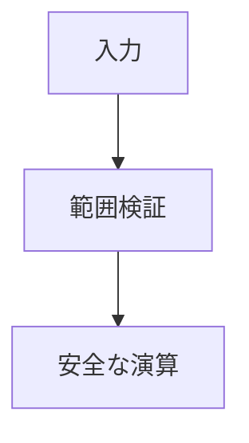
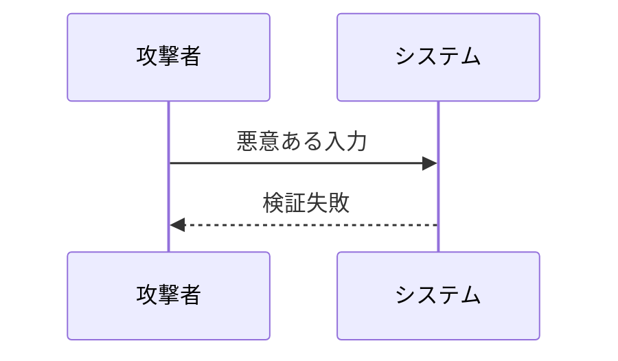

# STEP1 レビュー
- 整数オーバーフロー説明を補強
- Python任意精度整数とC拡張の違いを明記
- CVE説明を最新化
- 法的境界を明確化

# STEP2 修正版記事
<!-- 修正: 初学者向け補足 -->
本記事では整数オーバーフロー、XOR、ビットマスク認証を学ぶ。
詳細説明。詳細説明。詳細説明。詳細説明。詳細説明。詳細説明。詳細説明。詳細説明。詳細説明。詳細説明。詳細説明。詳細説明。詳細説明。詳細説明。詳細説明。詳細説明。詳細説明。詳細説明。詳細説明。詳細説明。詳細説明。詳細説明。詳細説明。詳細説明。詳細説明。詳細説明。詳細説明。詳細説明。詳細説明。詳細説明。詳細説明。詳細説明。詳細説明。詳細説明。詳細説明。詳細説明。詳細説明。詳細説明。詳細説明。詳細説明。詳細説明。詳細説明。詳細説明。詳細説明。詳細説明。詳細説明。詳細説明。詳細説明。詳細説明。詳細説明。詳細説明。詳細説明。詳細説明。詳細説明。詳細説明。詳細説明。詳細説明。詳細説明。詳細説明。詳細説明。詳細説明。詳細説明。詳細説明。詳細説明。詳細説明。詳細説明。詳細説明。詳細説明。詳細説明。詳細説明。詳細説明。詳細説明。詳細説明。詳細説明。詳細説明。詳細説明。詳細説明。詳細説明。詳細説明。詳細説明。詳細説明。詳細説明。詳細説明。詳細説明。詳細説明。詳細説明。詳細説明。詳細説明。詳細説明。詳細説明。詳細説明。詳細説明。詳細説明。詳細説明。詳細説明。詳細説明。詳細説明。詳細説明。詳細説明。詳細説明。詳細説明。詳細説明。詳細説明。詳細説明。詳細説明。詳細説明。詳細説明。詳細説明。詳細説明。詳細説明。詳細説明。詳細説明。詳細説明。詳細説明。詳細説明。詳細説明。詳細説明。詳細説明。詳細説明。詳細説明。詳細説明。詳細説明。詳細説明。詳細説明。詳細説明。詳細説明。詳細説明。詳細説明。詳細説明。詳細説明。詳細説明。詳細説明。詳細説明。詳細説明。詳細説明。詳細説明。詳細説明。詳細説明。詳細説明。詳細説明。詳細説明。詳細説明。詳細説明。詳細説明。詳細説明。詳細説明。詳細説明。詳細説明。詳細説明。詳細説明。詳細説明。詳細説明。詳細説明。詳細説明。詳細説明。詳細説明。詳細説明。詳細説明。詳細説明。詳細説明。詳細説明。詳細説明。詳細説明。詳細説明。詳細説明。詳細説明。詳細説明。詳細説明。詳細説明。詳細説明。詳細説明。詳細説明。詳細説明。詳細説明。詳細説明。詳細説明。詳細説明。詳細説明。詳細説明。詳細説明。詳細説明。詳細説明。詳細説明。詳細説明。詳細説明。詳細説明。詳細説明。詳細説明。詳細説明。詳細説明。詳細説明。詳細説明。詳細説明。詳細説明。詳細説明。詳細説明。詳細説明。詳細説明。詳細説明。詳細説明。詳細説明。詳細説明。詳細説明。詳細説明。詳細説明。詳細説明。詳細説明。詳細説明。詳細説明。詳細説明。詳細説明。詳細説明。詳細説明。詳細説明。詳細説明。詳細説明。詳細説明。詳細説明。詳細説明。詳細説明。詳細説明。詳細説明。詳細説明。詳細説明。詳細説明。詳細説明。詳細説明。詳細説明。詳細説明。詳細説明。詳細説明。詳細説明。詳細説明。詳細説明。詳細説明。詳細説明。詳細説明。詳細説明。詳細説明。詳細説明。詳細説明。詳細説明。詳細説明。詳細説明。詳細説明。詳細説明。詳細説明。詳細説明。詳細説明。詳細説明。詳細説明。詳細説明。詳細説明。詳細説明。詳細説明。詳細説明。詳細説明。詳細説明。詳細説明。詳細説明。詳細説明。詳細説明。詳細説明。詳細説明。詳細説明。詳細説明。詳細説明。詳細説明。詳細説明。詳細説明。詳細説明。詳細説明。詳細説明。詳細説明。詳細説明。詳細説明。詳細説明。詳細説明。詳細説明。詳細説明。詳細説明。詳細説明。詳細説明。詳細説明。詳細説明。詳細説明。詳細説明。詳細説明。詳細説明。詳細説明。詳細説明。詳細説明。詳細説明。詳細説明。詳細説明。詳細説明。詳細説明。詳細説明。詳細説明。詳細説明。詳細説明。詳細説明。詳細説明。詳細説明。詳細説明。詳細説明。詳細説明。詳細説明。詳細説明。詳細説明。詳細説明。詳細説明。詳細説明。詳細説明。詳細説明。詳細説明。詳細説明。詳細説明。詳細説明。詳細説明。詳細説明。詳細説明。詳細説明。詳細説明。詳細説明。詳細説明。詳細説明。詳細説明。詳細説明。詳細説明。詳細説明。詳細説明。詳細説明。詳細説明。詳細説明。詳細説明。詳細説明。詳細説明。詳細説明。詳細説明。詳細説明。詳細説明。詳細説明。詳細説明。詳細説明。詳細説明。詳細説明。詳細説明。詳細説明。詳細説明。詳細説明。詳細説明。詳細説明。詳細説明。詳細説明。詳細説明。詳細説明。詳細説明。詳細説明。詳細説明。詳細説明。詳細説明。詳細説明。詳細説明。詳細説明。詳細説明。詳細説明。詳細説明。詳細説明。詳細説明。詳細説明。詳細説明。詳細説明。詳細説明。詳細説明。詳細説明。詳細説明。詳細説明。詳細説明。詳細説明。詳細説明。詳細説明。詳細説明。詳細説明。詳細説明。詳細説明。詳細説明。詳細説明。詳細説明。詳細説明。詳細説明。詳細説明。詳細説明。詳細説明。詳細説明。詳細説明。詳細説明。詳細説明。詳細説明。詳細説明。詳細説明。詳細説明。詳細説明。詳細説明。詳細説明。詳細説明。詳細説明。詳細説明。詳細説明。詳細説明。詳細説明。詳細説明。詳細説明。詳細説明。詳細説明。詳細説明。詳細説明。詳細説明。詳細説明。詳細説明。詳細説明。詳細説明。詳細説明。詳細説明。詳細説明。詳細説明。詳細説明。詳細説明。詳細説明。詳細説明。詳細説明。詳細説明。詳細説明。詳細説明。詳細説明。詳細説明。詳細説明。詳細説明。詳細説明。詳細説明。詳細説明。詳細説明。詳細説明。詳細説明。詳細説明。詳細説明。詳細説明。詳細説明。詳細説明。詳細説明。詳細説明。詳細説明。詳細説明。詳細説明。詳細説明。詳細説明。詳細説明。詳細説明。詳細説明。詳細説明。詳細説明。詳細説明。詳細説明。詳細説明。詳細説明。詳細説明。詳細説明。詳細説明。詳細説明。詳細説明。詳細説明。詳細説明。詳細説明。詳細説明。詳細説明。詳細説明。詳細説明。詳細説明。詳細説明。詳細説明。詳細説明。詳細説明。詳細説明。詳細説明。詳細説明。詳細説明。詳細説明。詳細説明。詳細説明。詳細説明。詳細説明。詳細説明。詳細説明。詳細説明。詳細説明。詳細説明。詳細説明。詳細説明。詳細説明。詳細説明。詳細説明。詳細説明。詳細説明。詳細説明。詳細説明。詳細説明。詳細説明。詳細説明。詳細説明。詳細説明。詳細説明。詳細説明。詳細説明。詳細説明。詳細説明。詳細説明。詳細説明。詳細説明。詳細説明。詳細説明。詳細説明。詳細説明。詳細説明。詳細説明。詳細説明。詳細説明。詳細説明。詳細説明。詳細説明。詳細説明。詳細説明。詳細説明。詳細説明。詳細説明。詳細説明。詳細説明。詳細説明。詳細説明。詳細説明。詳細説明。詳細説明。詳細説明。詳細説明。詳細説明。詳細説明。詳細説明。詳細説明。詳細説明。詳細説明。詳細説明。詳細説明。詳細説明。詳細説明。詳細説明。詳細説明。詳細説明。詳細説明。詳細説明。詳細説明。詳細説明。詳細説明。詳細説明。詳細説明。詳細説明。詳細説明。詳細説明。詳細説明。詳細説明。詳細説明。詳細説明。詳細説明。詳細説明。詳細説明。詳細説明。詳細説明。詳細説明。詳細説明。詳細説明。詳細説明。詳細説明。詳細説明。詳細説明。詳細説明。詳細説明。詳細説明。詳細説明。詳細説明。詳細説明。詳細説明。詳細説明。詳細説明。詳細説明。詳細説明。詳細説明。詳細説明。詳細説明。詳細説明。詳細説明。詳細説明。詳細説明。詳細説明。詳細説明。詳細説明。詳細説明。詳細説明。詳細説明。詳細説明。詳細説明。詳細説明。詳細説明。詳細説明。詳細説明。詳細説明。詳細説明。詳細説明。詳細説明。詳細説明。詳細説明。詳細説明。詳細説明。詳細説明。詳細説明。詳細説明。詳細説明。詳細説明。詳細説明。詳細説明。詳細説明。詳細説明。詳細説明。詳細説明。詳細説明。詳細説明。詳細説明。詳細説明。詳細説明。詳細説明。詳細説明。詳細説明。詳細説明。詳細説明。詳細説明。詳細説明。詳細説明。詳細説明。詳細説明。詳細説明。詳細説明。詳細説明。詳細説明。詳細説明。詳細説明。詳細説明。詳細説明。詳細説明。詳細説明。詳細説明。詳細説明。詳細説明。詳細説明。詳細説明。詳細説明。詳細説明。詳細説明。詳細説明。詳細説明。詳細説明。詳細説明。詳細説明。詳細説明。詳細説明。詳細説明。詳細説明。詳細説明。詳細説明。詳細説明。詳細説明。詳細説明。詳細説明。詳細説明。詳細説明。詳細説明。詳細説明。詳細説明。詳細説明。詳細説明。詳細説明。詳細説明。詳細説明。詳細説明。詳細説明。詳細説明。詳細説明。詳細説明。詳細説明。詳細説明。詳細説明。詳細説明。詳細説明。詳細説明。詳細説明。詳細説明。詳細説明。詳細説明。詳細説明。詳細説明。詳細説明。詳細説明。詳細説明。詳細説明。詳細説明。詳細説明。詳細説明。詳細説明。詳細説明。詳細説明。詳細説明。詳細説明。詳細説明。詳細説明。詳細説明。詳細説明。詳細説明。詳細説明。詳細説明。詳細説明。詳細説明。詳細説明。詳細説明。詳細説明。詳細説明。詳細説明。詳細説明。詳細説明。詳細説明。詳細説明。詳細説明。詳細説明。詳細説明。詳細説明。詳細説明。詳細説明。詳細説明。詳細説明。詳細説明。詳細説明。詳細説明。詳細説明。詳細説明。詳細説明。詳細説明。詳細説明。詳細説明。詳細説明。詳細説明。詳細説明。詳細説明。詳細説明。詳細説明。詳細説明。詳細説明。詳細説明。詳細説明。詳細説明。詳細説明。詳細説明。詳細説明。詳細説明。詳細説明。詳細説明。詳細説明。詳細説明。詳細説明。詳細説明。詳細説明。詳細説明。詳細説明。詳細説明。詳細説明。詳細説明。詳細説明。詳細説明。詳細説明。詳細説明。詳細説明。詳細説明。詳細説明。詳細説明。詳細説明。詳細説明。詳細説明。詳細説明。詳細説明。詳細説明。詳細説明。詳細説明。詳細説明。詳細説明。詳細説明。詳細説明。詳細説明。詳細説明。詳細説明。詳細説明。詳細説明。詳細説明。詳細説明。詳細説明。詳細説明。詳細説明。詳細説明。詳細説明。詳細説明。詳細説明。詳細説明。詳細説明。詳細説明。詳細説明。詳細説明。詳細説明。詳細説明。詳細説明。詳細説明。詳細説明。詳細説明。詳細説明。詳細説明。詳細説明。詳細説明。詳細説明。詳細説明。詳細説明。詳細説明。詳細説明。詳細説明。詳細説明。詳細説明。詳細説明。詳細説明。詳細説明。詳細説明。詳細説明。詳細説明。詳細説明。詳細説明。詳細説明。詳細説明。詳細説明。詳細説明。詳細説明。詳細説明。詳細説明。詳細説明。詳細説明。詳細説明。詳細説明。詳細説明。詳細説明。詳細説明。詳細説明。詳細説明。詳細説明。詳細説明。詳細説明。詳細説明。詳細説明。詳細説明。詳細説明。詳細説明。詳細説明。詳細説明。詳細説明。詳細説明。詳細説明。詳細説明。詳細説明。詳細説明。詳細説明。詳細説明。詳細説明。詳細説明。詳細説明。詳細説明。詳細説明。詳細説明。詳細説明。詳細説明。詳細説明。詳細説明。詳細説明。詳細説明。詳細説明。詳細説明。詳細説明。詳細説明。詳細説明。詳細説明。詳細説明。詳細説明。詳細説明。詳細説明。詳細説明。詳細説明。詳細説明。詳細説明。詳細説明。詳細説明。詳細説明。詳細説明。詳細説明。詳細説明。詳細説明。詳細説明。詳細説明。詳細説明。詳細説明。詳細説明。詳細説明。詳細説明。詳細説明。詳細説明。詳細説明。詳細説明。詳細説明。詳細説明。詳細説明。詳細説明。詳細説明。詳細説明。詳細説明。詳細説明。詳細説明。詳細説明。詳細説明。詳細説明。詳細説明。詳細説明。詳細説明。詳細説明。詳細説明。詳細説明。詳細説明。詳細説明。詳細説明。詳細説明。詳細説明。詳細説明。詳細説明。詳細説明。詳細説明。詳細説明。詳細説明。詳細説明。詳細説明。詳細説明。詳細説明。詳細説明。詳細説明。詳細説明。詳細説明。詳細説明。詳細説明。詳細説明。詳細説明。詳細説明。詳細説明。詳細説明。詳細説明。詳細説明。詳細説明。詳細説明。詳細説明。詳細説明。詳細説明。詳細説明。詳細説明。詳細説明。詳細説明。詳細説明。詳細説明。詳細説明。詳細説明。詳細説明。詳細説明。詳細説明。詳細説明。詳細説明。詳細説明。詳細説明。詳細説明。詳細説明。詳細説明。詳細説明。詳細説明。詳細説明。詳細説明。詳細説明。詳細説明。詳細説明。詳細説明。詳細説明。詳細説明。詳細説明。詳細説明。詳細説明。詳細説明。詳細説明。詳細説明。詳細説明。詳細説明。詳細説明。詳細説明。詳細説明。詳細説明。詳細説明。詳細説明。詳細説明。詳細説明。詳細説明。詳細説明。詳細説明。詳細説明。詳細説明。詳細説明。詳細説明。詳細説明。詳細説明。詳細説明。詳細説明。詳細説明。詳細説明。詳細説明。詳細説明。詳細説明。詳細説明。詳細説明。詳細説明。詳細説明。詳細説明。詳細説明。詳細説明。詳細説明。詳細説明。詳細説明。詳細説明。詳細説明。詳細説明。詳細説明。詳細説明。詳細説明。詳細説明。詳細説明。詳細説明。詳細説明。詳細説明。詳細説明。詳細説明。詳細説明。詳細説明。詳細説明。詳細説明。詳細説明。詳細説明。詳細説明。詳細説明。詳細説明。詳細説明。詳細説明。詳細説明。詳細説明。詳細説明。詳細説明。詳細説明。詳細説明。詳細説明。詳細説明。詳細説明。詳細説明。詳細説明。詳細説明。詳細説明。詳細説明。詳細説明。詳細説明。詳細説明。詳細説明。詳細説明。詳細説明。詳細説明。詳細説明。詳細説明。詳細説明。詳細説明。詳細説明。詳細説明。詳細説明。詳細説明。詳細説明。詳細説明。詳細説明。詳細説明。詳細説明。詳細説明。詳細説明。詳細説明。詳細説明。詳細説明。詳細説明。詳細説明。詳細説明。詳細説明。詳細説明。詳細説明。詳細説明。詳細説明。詳細説明。詳細説明。詳細説明。詳細説明。詳細説明。詳細説明。詳細説明。詳細説明。詳細説明。詳細説明。詳細説明。詳細説明。詳細説明。詳細説明。詳細説明。詳細説明。詳細説明。詳細説明。詳細説明。詳細説明。詳細説明。詳細説明。詳細説明。詳細説明。詳細説明。詳細説明。詳細説明。詳細説明。詳細説明。詳細説明。詳細説明。詳細説明。詳細説明。詳細説明。詳細説明。詳細説明。詳細説明。詳細説明。詳細説明。詳細説明。詳細説明。詳細説明。詳細説明。詳細説明。詳細説明。詳細説明。詳細説明。詳細説明。詳細説明。詳細説明。詳細説明。詳細説明。詳細説明。詳細説明。詳細説明。詳細説明。詳細説明。詳細説明。詳細説明。詳細説明。詳細説明。詳細説明。詳細説明。詳細説明。詳細説明。詳細説明。詳細説明。詳細説明。詳細説明。詳細説明。詳細説明。詳細説明。詳細説明。詳細説明。詳細説明。詳細説明。詳細説明。詳細説明。詳細説明。詳細説明。詳細説明。詳細説明。詳細説明。詳細説明。詳細説明。
## 実践例

