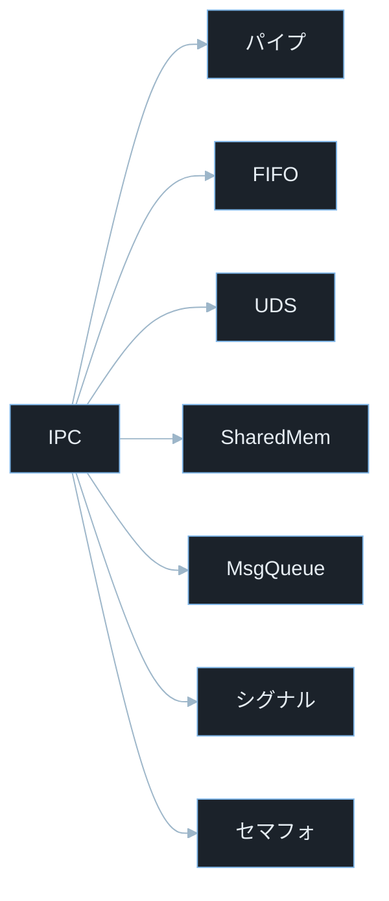
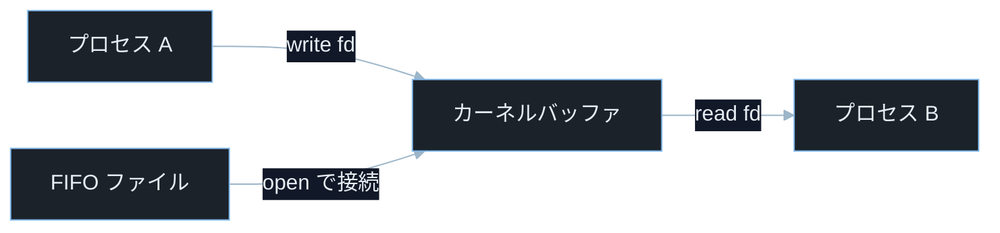
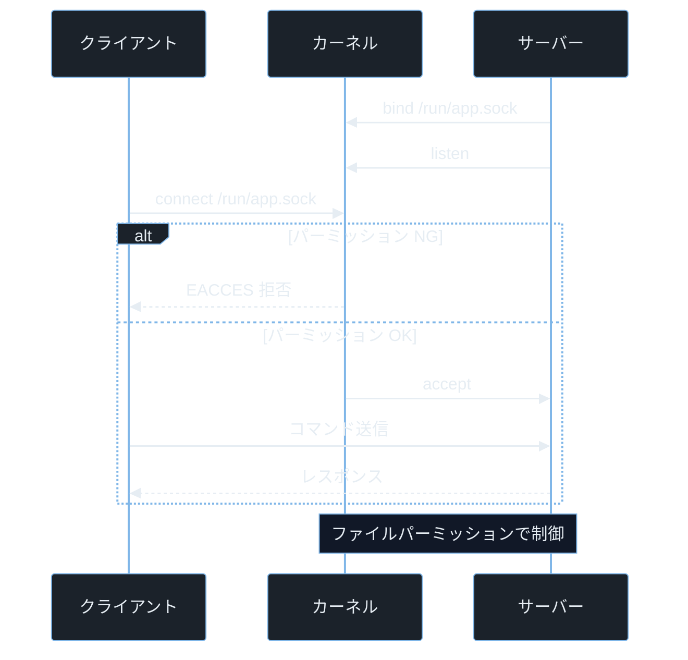
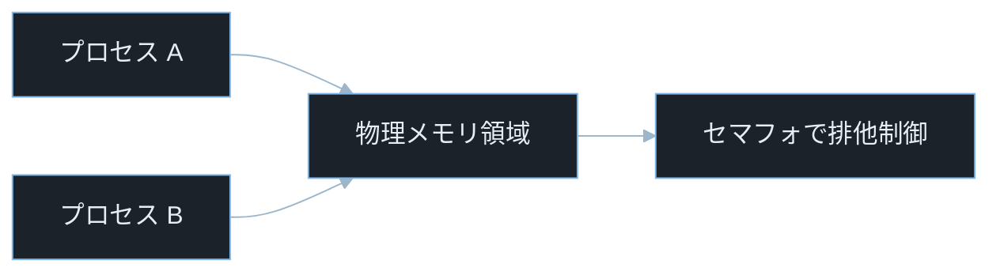
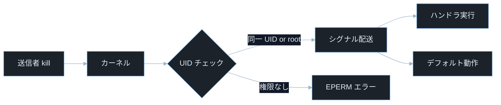

## TL;DR

- **IPC（Inter-Process Communication）** はプロセス同士がデータや制御を交わす仕組みの総称だ。パイプ・UNIX ソケット・共有メモリ・メッセージキュー・シグナル・セマフォの 6 種類が Linux で広く使われる。
- IPC の各手段はアクセス制御・競合状態・データ検証の甘さによって、**権限昇格・情報漏洩・サービス妨害** の入口になる。特に UNIX ソケットと共有メモリはパーミッションが緩いと別プロセスに乗っ取られる。
- CTF の Pwn カテゴリではパイプ・シグナル・共有メモリの競合（レースコンディション）を突いて権限昇格や任意コード実行を狙う問題が出題される。

---

## なぜ重要か

「プロセスはそれぞれ独立したメモリ空間を持つのに、どうやって連携するのか？」

この問いに即答できないなら、この記事が助けになる。**プロセス間通信（IPC）は OS カーネルが管理する特別な経路で行われ、そのアクセス制御や競合が脆弱性の温床になる。** IPC の仕組みを知れば、なぜ「シグナルを送るだけで任意コードが実行できる」「UNIX ソケットのパーミッション 1 つが権限昇格に直結する」かが見えてくる。

具体的に挙げると：

- Web サーバーがバックエンドプロセスとパイプ通信する設計で、ユーザー入力がそのまま流れ込む→パイプ注入でコマンド実行
- 管理デーモンが UNIX ソケットを `777` で開く→別ユーザーのプロセスがソケットに接続して管理コマンドを送れる
- 共有メモリを「確認してから書く」設計にする→TOCTOU レースで悪意あるデータに差し替えられる
- systemd・D-Bus・Docker の通信路が IPC 経由→IPC の脆弱性がシステム全体に波及する（CVE-2022-29799）
- CTF Pwn でシグナルハンドラの非再入可能関数を叩いてスタックを破壊する問題が出題される

> **CTF とは**: Capture The Flag の略。セキュリティ技術を競う演習形式。Pwn はバイナリ脆弱性悪用、Forensics はファイル・メモリ解析が主題。

---

## 読む前に確認したい用語

難しい用語は出てきたタイミングで解説するが、以下の概念は記事全体を通して何度も登場する。ざっと目を通してから先に進もう。

**IPC の代表的な 7 種類**
- **パイプ（Pipe）**: 親子プロセス間で一方向にバイト列を流す最もシンプルな IPC。`ls | grep txt` の `｜` がこれ。
- **名前付きパイプ（FIFO）**: ファイルシステム上に名前を持つパイプ。血縁関係のないプロセス間でも使える。
- **UNIX ドメインソケット**: ファイルパスで識別するソケット。TCP より高速で、パーミッション制御が可能。Docker・systemd・Nginx が内部通信に使う。
- **共有メモリ（Shared Memory）**: 複数プロセスが同じ物理メモリ領域をマップする最速の IPC。競合制御が必要。
- **メッセージキュー**: カーネルが管理するメッセージの待ち行列。送受信が非同期でできる。
- **シグナル（Signal）**: プロセスに非同期で送る整数の通知。`kill -9 [PID]` の `9` が SIGKILL。
- **セマフォ（Semaphore）**: 共有リソースへの同時アクセス数を制御する整数カウンタ。ミューテックスの一般化。

**重要な OS 概念**
- **ファイルディスクリプタ（fd）**: プロセスがオープンしているファイル・ソケット・パイプを整数番号で管理する仕組み。`0` が標準入力・`1` が標準出力・`2` が標準エラー出力。
- **レースコンディション（競合状態）**: 複数プロセスが共有リソースに同時アクセスしたとき、実行順序によって結果が変わる状態。
- **TOCTOU（Time-of-Check Time-of-Use）**: 確認と使用の間に状態が変わる競合の特定パターン。

**セキュリティ用語**
- **CVE**: Common Vulnerabilities and Exposures の略。世界共通の脆弱性識別番号。
- **CVSS**: Common Vulnerability Scoring System。脆弱性の深刻度を 0.0〜10.0 で評価する指標。
- **非再入可能関数（non-reentrant）**: シグナルハンドラから呼ぶと安全でない関数。`malloc`・`printf` 等がこれにあたる。

---

## 仕組み

### IPC の種類と特性マップ



各 IPC はカーネルが仲介するため、プロセスのメモリ空間が分離されていても通信できる。しかしカーネルを経由する分、アクセス制御の設定ミスや競合があると攻撃者がその経路に割り込める。

**計算量まとめ**

- **パイプ書き込み**: O(n)。n バイトをカーネルバッファにコピー。
- **共有メモリアクセス**: O(1)。物理メモリを直接参照。IPC 手段の中で最速。
- **シグナル送信**: O(1)。カーネルがターゲットプロセスのシグナルマスクを更新するだけ。

**IPC の弱点 — アクセス制御の分散**

IPC 手段ごとにアクセス制御の仕組みが異なる。パイプは fd を持つプロセスのみ・UNIX ソケットはファイルパーミッション・共有メモリは SysV キーか POSIX パス・シグナルは UID/GID ベースの送信権限。この不均一さが設定漏れを生む。

---

### パイプと名前付きパイプ（FIFO）



パイプはカーネル内の環状バッファ（多くの Linux 環境では 64KB 前後）を介して一方向に流れる。fd を継承した子プロセスだけが読み書きできる。名前付きパイプ（FIFO）はファイルシステム上に残るため血縁関係のないプロセス間でも使えるが、そのパーミッションが甘いと別ユーザーが接続できる。

**計算量まとめ**

- **`write()`**: O(n)。カーネルバッファへのコピー。バッファが満杯なら書き込みプロセスがブロックする。
- **`read()`**: O(n)。カーネルバッファからのコピー。バッファが空なら読み込みプロセスがブロックする。

**パイプの弱点 — データ検証なしの直接連結**

シェルのパイプラインでは、前段コマンドの出力が後段コマンドの入力にそのままなる。ユーザー入力が前段に混入すると、後段がシェルコマンドを構築する処理なら任意コマンドが実行される。

---

### UNIX ドメインソケット



UNIX ソケットのアクセス制御はソケットファイルのパーミッションで決まる。`/var/run/docker.sock` が `660 root:docker` であるように、グループメンバーシップでアクセスを制限する設計が一般的だ。`777` や `666` に設定されると全ユーザーが接続できる。

**計算量まとめ**

- **TCP との比較**: UNIX ソケットはループバック（localhost）TCP より約 2 倍高速。カーネル内でデータをコピーするだけで TCP スタックを経由しない。
- **`accept()`**: O(1)。接続キューから 1 件を取り出す。

**UNIX ソケットの弱点 — パーミッションの設定ミス**

デーモンが root で起動してソケットを作成すると、デフォルトパーミッションが `umask` に従う。`umask 0` のプロセスが作成したソケットは `777` になりうる。接続できれば管理コマンドを送れる場合、権限昇格が成立する。

> **`umask` とは**: ファイル作成時のデフォルトパーミッションから差し引くビットマスク。ソケットファイルは通常 `0777` ベースで計算され、`umask 022` なら `0755`、`umask 0` なら `0777` になる。ただし対象の種類（通常ファイル・ディレクトリ・ソケット）によってベース値が異なるため、実際のパーミッションは `ls -la` で確認する習慣をつけること。

---

### 共有メモリとセマフォ



共有メモリは mmap または SysV shm でカーネルに確保した物理ページを複数プロセスが仮想アドレス空間にマップする。コピーが発生しないため最速だが、同期なしで複数プロセスが書くと競合してデータが破壊される。

> **`mmap` とは**: メモリマップドファイル・デバイス・匿名メモリ領域をプロセスの仮想アドレス空間に割り当てるシステムコール（memory map の略）。`MAP_SHARED` フラグで複数プロセスが同一物理ページを共有できる。
> **`MAP_SHARED` とは**: `mmap` のフラグで、メモリへの書き込みを他のプロセスからも見えるようにする指定。対義語は `MAP_PRIVATE`（コピーオンライト・変更が他プロセスに見えない）。

**計算量まとめ**

- **共有メモリ読み書き**: O(1) の CPU 命令で直接アクセス。カーネル介在なし。
- **セマフォ待機**: 最悪 O(N)。N スレッドがセマフォを待つ場合の wake-up コスト。

**共有メモリの弱点 — セマフォなし運用**

「どうせ書き込みは一瞬だから問題ない」という思い込みでセマフォを省略すると、CPU のアウトオブオーダー実行やキャッシュ一貫性の問題で書き込みの中途状態が別プロセスに見える（メモリ可視性の問題）。攻撃者が意図的にタイミングを操作してレースを引き起こす手法が CTF Pwn で頻出だ。

---

### シグナル



カーネルはシグナルを送る前に「送信者の UID がターゲットの UID と同じか、または root か」を確認する。シグナルハンドラは非同期で割り込むため、メイン処理が使っているグローバル変数を不整合な状態で参照する危険がある。

> **`kill` コマンドとは**: プロセスにシグナルを送るコマンド。名前に「kill」とあるが、必ずしも終了させるシグナルを送るわけではない。`kill -SIGHUP [PID]` で設定ファイルの再読み込みを促すなど、汎用的な通知に使う。
> **`-9` は SIGKILL**: シグナル番号 9 は `SIGKILL`（強制終了）。プロセスはこのシグナルをハンドラで受け取れず、カーネルが強制的にプロセスを終了させる。

**計算量まとめ**

- **シグナル送信**: O(1)。ターゲットの `task_struct` にフラグを立てる。
- **シグナル配送**: O(1)。次回スケジューリング時にカーネルが確認。

**シグナルの弱点 — 非再入可能関数**

シグナルハンドラから `malloc`・`free`・`printf` 等の非再入可能関数を呼ぶと、メイン処理が同じ関数の中途状態で割り込まれた場合にデッドロックやヒープ破壊が起きる。一部の脆弱な C プログラムでは `SIGALRM` ハンドラから `system()` を呼ぶよう誘導し、ハンドラ内でシェルコードを実行する手法が使われる。

> **SIGKILL / SIGTERM の違い**: `SIGKILL`（番号 9）はプロセスをカーネルが強制終了し、ハンドラも無視もできない。`SIGTERM`（番号 15）はデフォルトで終了するが、ハンドラを登録してグレースフルシャットダウンができる。

---

## よくある誤解

実装に進む前に、間違えやすいポイントを整理しておく。「あー、そうか」と思えるものがあれば、コードを書くときに思い出してほしい。

**「パイプはネットワーク通信と無関係」**
UNIX ドメインソケットは TCP/UDP ソケットと同じ `socket()`・`bind()`・`connect()` API を使うが、ネットワークを経由しない。**ネットワーク IPC（TCP/UDP）とローカル IPC（UNIX ソケット・パイプ）の API 形状が似ているため、ネットワーク設定のつもりが UNIX ソケットに影響したり、その逆が起きる。**

**「共有メモリは `volatile` を付ければ安全」**
`volatile` はコンパイラの最適化を抑制するだけで、CPU のアウトオブオーダー実行やキャッシュ一貫性は制御しない。**複数プロセス間の共有メモリには必ずセマフォかミューテックスが必要だ。** `volatile` だけでは競合を防げない。

**「シグナルハンドラで何でもできる」**
シグナルハンドラで呼べる安全な関数は POSIX で定義された **async-signal-safe 関数**のみだ（`write()`・`_exit()`・`sig_atomic_t` の操作等）。`printf`・`malloc`・`free` はシグナルハンドラから呼ぶのが危険で、デッドロックやヒープ破壊の原因になる。

**「UNIX ソケットは localhost より遅い」**
UNIX ソケットは TCP スタック（チェックサム計算・パケット分割・ACK 往復）を経由しない。**同一マシン内の通信なら UNIX ソケットが TCP localhost より一般的に高速で、オーバーヘッドも小さい。**

**「`kill -9` は必ず届く」**
`SIGKILL` はプロセスがハンドラを登録できず、カーネルが強制終了する。しかし **カーネルレベルの処理（D 状態: uninterruptible sleep）でブロックしているプロセスには SIGKILL も届かない**。I/O 待ちのゾンビプロセスが kill で消えないのはこのためだ。

---

## 脆弱なコード例

> 本記事の攻撃例は学習環境・CTF・明示的に許可された検証環境のみで実施してください。
> 実システムへの無断検証は不正アクセス禁止法や各国法令・利用規約違反となる可能性があります。

### PHP — パイプ経由のコマンドインジェクション

```php
<?php
$username = $_GET['user'] ?? '';

$handle = popen("finger {$username}", 'r');
$output = '';
while (!feof($handle)) {
    $output .= fgets($handle);
}
pclose($handle);
echo htmlspecialchars($output);
```

> **`$_GET['user']` とは**: HTTP GET リクエストのクエリパラメータ `user` の値を取得する PHP の超グローバル変数。例えば `/info?user=alice` で `$_GET['user']` が `"alice"` になる。

> **`popen()` とは**: PHP でコマンドを実行してその入出力をパイプとして開く関数（pipe open の略）。`popen("command", 'r')` でコマンドの標準出力を読み取るパイプを返す。

**どこが問題か**: `$username` をそのまま `popen()` に渡しているため、`?user=alice; cat /etc/passwd` を送るだけで `;` 以降が別コマンドとして実行される。パイプはシェル（`/bin/sh`）経由で起動するため、シェルのメタ文字が全て有効になる。Web サーバーの権限で任意コマンドを実行できる。

```php
<?php
$username = $_GET['user'] ?? '';

if (!preg_match('/^[a-zA-Z0-9_\-]{1,32}$/', $username)) {
    http_response_code(400);
    exit("無効なユーザー名です");
}

$safe = escapeshellarg($username);
$handle = popen("finger {$safe}", 'r');
$output = '';
while (!feof($handle)) {
    $output .= fgets($handle);
}
pclose($handle);
echo htmlspecialchars($output);
```

> **`escapeshellarg()` とは**: PHP で文字列をシェルの引数として安全にエスケープする関数。全体をシングルクォートで囲み、シェルのメタ文字（`;`・`|`・`$` 等）を無効化する。

入力を正規表現でホワイトリスト検証してから `escapeshellarg()` でエスケープする二重防御により、シェルインジェクションを防ぐ。

---

### Node.js — UNIX ソケットの権限不備による認証バイパス

```javascript
const net = require('net');
const fs = require('fs');

const SOCKET_PATH = '/tmp/admin.sock';

if (fs.existsSync(SOCKET_PATH)) {
    fs.unlinkSync(SOCKET_PATH);
}

const server = net.createServer((conn) => {
    conn.on('data', (data) => {
        const cmd = data.toString().trim();
        if (cmd === 'shutdown') {
            process.exit(0);
        }
        conn.write(`executed: ${cmd}\n`);
    });
});

server.listen(SOCKET_PATH);
```

> **`net.createServer()` とは**: Node.js で TCP または UNIX ドメインソケットのサーバーを作成する関数。`server.listen(SOCKET_PATH)` に文字列パスを渡すと UNIX ソケットになる。

**どこが問題か**: ソケットファイルを作成した後のパーミッションを設定していないため、`umask` の設定次第で誰でも接続できる状態になる。別ユーザーが `nc -U /tmp/admin.sock` で接続して `shutdown` を送るだけでプロセスが終了する（DoS）。認証機構も一切ない。

> **`nc -U` とは**: netcat（`nc`）で UNIX ドメインソケットに接続するオプション（`-U` は UNIX socket）。`nc -U /tmp/admin.sock` でそのソケットに対話的に接続できる。

```javascript
const net = require('net');
const fs = require('fs');
const os = require('os');

const SOCKET_PATH = '/run/myapp/admin.sock';
const SECRET_TOKEN = process.env.ADMIN_TOKEN;

if (!SECRET_TOKEN) {
    console.error('ADMIN_TOKEN 環境変数が未設定です');
    process.exit(1);
}

if (fs.existsSync(SOCKET_PATH)) {
    fs.unlinkSync(SOCKET_PATH);
}

const server = net.createServer((conn) => {
    let authenticated = false;

    conn.on('data', (data) => {
        const msg = data.toString().trim();

        if (!authenticated) {
            if (msg === SECRET_TOKEN) {
                authenticated = true;
                conn.write('OK\n');
            } else {
                conn.write('DENIED\n');
                conn.destroy();
            }
            return;
        }

        if (msg === 'shutdown') {
            process.exit(0);
        }
        conn.write(`unknown command\n`);
    });
});

server.listen(SOCKET_PATH, () => {
    fs.chmodSync(SOCKET_PATH, 0o600);
});
```

> **`fs.chmodSync(SOCKET_PATH, 0o600)` とは**: ソケットファイルのパーミッションをリッスン開始直後に `0o600`（オーナーのみ読み書き可）に設定する。`0o` は JavaScript での 8 進数プレフィックス。listen コールバック内で設定することで、ファイル作成と権限設定の間の隙間を最小化する。

ソケットを `0o600` に設定してオーナー以外の接続を OS レベルで拒否し、さらにトークン認証を追加することで二重の防御になる。

---

### Python — シグナルハンドラの非再入可能関数呼び出し

```python
import signal
import time
import threading

results = []

def handler(signum, frame):
    results.append(f"signal {signum} received")
    print(f"[signal] caught {signum}")

signal.signal(signal.SIGUSR1, handler)

def worker():
    while True:
        results.append("working")
        time.sleep(0.01)

t = threading.Thread(target=worker, daemon=True)
t.start()

while True:
    time.sleep(1)
    print(f"results count: {len(results)}")
```

> **`signal.signal(signal.SIGUSR1, handler)` とは**: Python でシグナル `SIGUSR1` を受信したときに呼ぶハンドラ関数を登録する。`SIGUSR1`（番号 10）はアプリ定義のユーザーシグナル 1。

> **`SIGUSR1` とは**: ユーザー定義シグナル 1（User Signal 1）。OS は意味を規定せず、アプリが自由に使える。例えばデーモンに `kill -SIGUSR1 [PID]` を送って設定の再読み込みをトリガーする用途に使う。

**どこが問題か**: Python のシグナルハンドラはメインスレッドのバイトコード実行タイミングで処理されるため、C 言語のような深刻な再入問題は起きにくい。しかしハンドラ内で重い処理（`print()` によるバッファフラッシュ・ロック取得・外部ライブラリ呼び出し等）を行うと、メインスレッドの処理を意図しないタイミングで中断してアプリケーション設計上の問題になる。また `threading` と `signal` の組み合わせでは、シグナルは常にメインスレッドで受信されるため、ワーカースレッドが長時間 GIL を保持しているとシグナル処理が大幅に遅延する。

> **GIL（Global Interpreter Lock）とは**: CPython（標準 Python 実装）が持つ、同時に 1 スレッドだけ Python バイトコードを実行することを保証するロック。マルチスレッドプログラムでも CPU 並列性が制限されるが、多くの操作についてスレッドセーフを提供する。

```python
import signal
import time
import threading

result_count = 0
signal_flag = False

def handler(signum, frame):
    global signal_flag
    signal_flag = True

signal.signal(signal.SIGUSR1, handler)

def worker():
    global result_count
    while True:
        result_count += 1
        time.sleep(0.01)

t = threading.Thread(target=worker, daemon=True)
t.start()

while True:
    time.sleep(1)
    if signal_flag:
        print(f"signal received, count={result_count}")
        signal_flag = False
    else:
        print(f"count: {result_count}")
```

> **シグナルハンドラの設計原則**: Python のシグナルハンドラはメインスレッドで実行されるため C ほど再入問題は深刻でないが、ハンドラ内では単純な状態フラグの更新に留め、実際の処理をメインループへ委譲する設計が推奨される。これにより予期しない中断・遅延・ロック競合を防げる。

シグナルハンドラでフラグをセットするだけにして実処理をメインループに委ねるパターンにより、ハンドラ内の重い処理による問題を回避する。

---

## 実践例 / 演習例

### 現在の IPC リソースを確認する

```bash
ipcs -a
```

> **`ipcs` とは**: System V IPC リソース（共有メモリ・セマフォ・メッセージキュー）の一覧を表示するコマンド（IPC status の略）。`-a` は全種類を表示するオプション。攻撃者が残した孤立 IPC リソースの調査やフォレンジックで使う。

```bash
ipcs -m
ipcs -s
ipcs -q
```

> **`-m` / `-s` / `-q` オプション**: それぞれ共有メモリ（memory）・セマフォ（semaphore）・メッセージキュー（queue）のみを表示する。

### UNIX ソケットの一覧を確認する

```bash
ss -x
ss -xl
```

> **`ss` とは**: ソケットの状態を表示するコマンド（socket statistics の略）。`-x` は UNIX ドメインソケットのみ、`-l` はリッスン中のソケットを表示する。旧来の `netstat` より高速で情報量が多い。

```bash
ls -la /run/*.sock /tmp/*.sock 2>/dev/null
```

ソケットファイルのパーミッションを確認する。`srwxrwxrwx`（`777`）や `srw-rw-rw-`（`666`）が表示された場合、全ユーザーが接続できる。

> **`s` のパーミッション表示**: `ls -la` でソケットファイルは先頭が `s`（socket）で表示される（通常ファイルは `-`、ディレクトリは `d`）。

### シグナルを送る・調べる

```bash
kill -l
```

> **`kill -l` とは**: 使用可能なシグナルの一覧を番号と名前で表示するオプション（list）。環境によって番号が異なる場合があるため、スクリプトでは番号より名前を使う方が移植性が高い。

```bash
kill -SIGUSR1 [PID]
kill -SIGTERM [PID]
```

```bash
cat /proc/[PID]/status | grep -i sig
```

> **`/proc/[PID]/status` の `Sig` フィールド**: プロセスが現在ブロック・無視・ハンドラ登録しているシグナルのビットマスクを 16 進数で表示する。`SigBlk`・`SigIgn`・`SigCgt` の各フィールドで確認できる。

### パイプラインのデバッグ

```bash
strace -e trace=pipe,read,write -p [PID]
```

> **`strace` とは**: プロセスが発行するシステムコールをリアルタイムで記録するコマンド（system call trace の略）。`-e trace=` で記録するシステムコールを絞る。`-p [PID]` で実行中のプロセスにアタッチする。IPC 関連の問題調査で頻用される。

---

## 防御策

### 1. UNIX ソケットのパーミッションを最小化する

```python
import socket
import os
import stat

SOCKET_PATH = '/run/myapp/control.sock'

os.makedirs(os.path.dirname(SOCKET_PATH), mode=0o700, exist_ok=True)

sock = socket.socket(socket.AF_UNIX, socket.SOCK_STREAM)
sock.bind(SOCKET_PATH)
os.chmod(SOCKET_PATH, stat.S_IRUSR | stat.S_IWUSR)
sock.listen(5)
```

> **`socket.AF_UNIX` とは**: UNIX ドメインソケットを作成するアドレスファミリー定数（Address Family UNIX）。`socket.AF_INET` が IPv4、`socket.AF_UNIX` がローカルのみで使う。
> **`stat.S_IRUSR | stat.S_IWUSR` とは**: Python の `stat` モジュールが提供するパーミッションビット定数。`S_IRUSR` はオーナーの読み取り権限・`S_IWUSR` はオーナーの書き込み権限。OR で組み合わせて `0o600` 相当を設定する。

### 2. 共有メモリへのアクセスをセマフォで保護する

```python
import mmap
import os
import struct
import multiprocessing

shm_fd = open('/dev/shm/myapp_data', 'w+b')
shm_fd.write(b'\x00' * 4096)
shm_fd.flush()

shm = mmap.mmap(shm_fd.fileno(), 4096)
sem = multiprocessing.Semaphore(1)

def write_shared(value: int) -> None:
    sem.acquire()
    try:
        shm.seek(0)
        shm.write(struct.pack('Q', value))
        shm.flush()
    finally:
        sem.release()

def read_shared() -> int:
    sem.acquire()
    try:
        shm.seek(0)
        return struct.unpack('Q', shm.read(8))[0]
    finally:
        sem.release()
```

> **`multiprocessing.Semaphore(1)` とは**: Python の `multiprocessing` モジュールが提供するプロセス間共有のセマフォ。引数 `1` は「同時にアクセスできるプロセスは 1 つ」を意味する（ミューテックスと同等）。`threading.Lock()` は同一プロセス内のスレッド間でしか機能しないため、別プロセスから共有メモリにアクセスする場合は `multiprocessing.Semaphore` を使う。

> **`/dev/shm/` とは**: Linux の共有メモリ用の tmpfs ディレクトリ（shared memory）。`mmap` でファイルをマップすることでプロセス間共有メモリとして使える。`/dev/shm/` のファイルにも適切なパーミッションを設定する必要がある。

> **`struct.pack('Q', value)` とは**: Python の `struct` モジュールでデータをバイト列に変換する関数。`'Q'` は符号なし 64 ビット整数（unsigned long long）を意味するフォーマット文字。

> **`mmap.flush()` とは**: メモリマップ上の変更をバッキングファイルに書き込む関数。`flush()` を呼ばないと他プロセスから変更が見えないことがある。

### 3. シグナルハンドラを安全に実装する

```python
import signal
import os

_shutdown_flag = False

def _safe_handler(signum: int, frame) -> None:
    global _shutdown_flag
    _shutdown_flag = True
    os.write(1, b"[signal] shutdown requested\n")

signal.signal(signal.SIGTERM, _safe_handler)
signal.signal(signal.SIGINT, _safe_handler)
```

> **`os.write(1, b"...")` とは**: ファイルディスクリプタ `1`（標準出力）に直接バイト列を書き込む低レベル関数。`print()` や `sys.stdout.write()` と異なり、内部で `malloc` を使わないため async-signal-safe だ。シグナルハンドラ内では `os.write()` を使う。

### 4. メッセージキューにサイズ制限を設ける

```python
import queue
import threading

MAX_QUEUE_SIZE = 1000

task_queue: queue.Queue = queue.Queue(maxsize=MAX_QUEUE_SIZE)

def producer(data: bytes) -> bool:
    try:
        task_queue.put_nowait(data)
        return True
    except queue.Full:
        return False

def consumer() -> None:
    while True:
        data = task_queue.get()
        task_queue.task_done()
```

> **`queue.Queue(maxsize=N)` とは**: Python の標準ライブラリが提供するスレッドセーフなキュー。`maxsize` で最大サイズを設定し、それを超えると `put_nowait()` が `queue.Full` 例外を投げる。無制限キューへの無限投入による OOM（メモリ不足）攻撃を防ぐ。

---

## 実演ラボ案内

### 推奨学習順序

- linux-filesystem（ファイルディスクリプタ・パイプ・ソケットファイルの基礎）
- ipc-mechanisms（本記事）
- process-thread（プロセス生成と fd 継承の詳細）
- linux-privilege-escalation（IPC を使った権限昇格の総合演習）

### Hack The Box

- **Challenges — Pwn カテゴリ**: シグナルハンドラのレースコンディションや共有メモリの競合を突く問題が出題される。`strace` と `ltrace` でシステムコールと共有ライブラリ呼び出しを追跡する技術が直接使える。

> **`ltrace` とは**: プロセスが呼ぶ共有ライブラリ関数をリアルタイムで記録するコマンド（library call trace の略）。`strace` がシステムコール、`ltrace` がライブラリ関数の追跡。

- **Machines**: デーモン間の UNIX ソケット通信や `D-Bus` の権限設定ミスが権限昇格経路になるマシンが複数ある。

### TryHackMe

- **Linux PrivEsc**: SUID・sudo・IPC ベースの権限昇格を段階的に練習できる。
- **Processes and Signals**: シグナルの基礎と `kill`・`strace` の使い方を練習できる。

### 自宅 VM（合法演習）

```bash
mkfifo /tmp/test_fifo
echo "hello from writer" > /tmp/test_fifo &
cat /tmp/test_fifo
```

> **`mkfifo` とは**: 名前付きパイプ（FIFO）ファイルを作成するコマンド（make FIFO の略）。作成されたファイルに書き込むと、読み込む側プロセスに届く。`&` でバックグラウンドで書き込み側を起動し、別に `cat` で読み込む。

```bash
python3 -c "
import socket, os
s = socket.socket(socket.AF_UNIX)
s.bind('/tmp/test.sock')
print('Permissions:', oct(os.stat('/tmp/test.sock').st_mode))
s.close()
os.unlink('/tmp/test.sock')
"
```

作成直後のソケットファイルのパーミッションを確認し、`umask` の影響を体験する演習。

---

## 関連 CVE と被害事例

> **CVE とは**: Common Vulnerabilities and Exposures の略。世界共通の脆弱性識別番号。
> **CVSS スコア**: 脆弱性の深刻度を 0.0〜10.0 で評価した指標。7.0 以上が High、9.0 以上が Critical。

**CVE-2022-29799（networkd-dispatcher — UNIX ソケット経由のコマンドインジェクション）**
`networkd-dispatcher`（systemd-networkd の状態変化を通知するデーモン）が D-Bus 経由で受け取ったネットワークインタフェース名を検証せずにスクリプトパスの構築に使っていた。攻撃者がローカルから細工されたインタフェース名を送ることでパストラバーサルが成立し、root 権限でスクリプトを実行できた。攻撃前提: ローカルユーザー権限。CVSS スコア 7.8（High）。本記事との関連: UNIX ソケット・D-Bus IPC・コマンドインジェクション

**CVE-2018-1000001（glibc — `realpath()` の UNIX ソケットパス処理バグ）**
glibc の `realpath()` 関数に相対パスの処理バグが存在し、`/proc/self/fd/` 経由の UNIX ソケットパスを解決する際にスタックバッファオーバーフローが発生した。ローカルの非 root ユーザーが `getcwd()` の結果を `realpath()` に渡すことで root 権限を取得できた。直接的なトリガーが UNIX ドメインソケットの fd パス解決であり、IPC 経路のパス処理が権限昇格に直結した事例だ。攻撃前提: ローカルユーザー権限。CVSS スコア 7.8（High）。本記事との関連: UNIX ドメインソケット・パス解決・IPC の権限昇格

**CVE-2019-11477（Linux カーネル — TCP の SACK パニック）**
Linux カーネルの TCP 実装（ネットワーク IPC の基盤）で SACK（選択的確認応答）の処理に整数オーバーフローが存在し、細工されたパケットシーケンスでカーネルパニックを引き起こせた。リモートから DoS が成立する。攻撃前提: ネットワーク到達性。CVSS スコア 7.5（High）。本記事との関連: ネットワーク IPC・TCP ソケット・カーネルの整数オーバーフロー

---

## 次に学ぶべき記事

- **process-thread** — `fork()`・`exec()`・スレッドの仕組み。fd 継承とパイプの詳細
- **linux-privilege-escalation** — IPC 設定ミスを使った権限昇格の総合演習
- **network-fundamentals** — TCP/UDP ソケット・ネットワーク IPC の基礎

---

## 参考文献

- Linux man-pages. "pipe(2)". https://man7.org/linux/man-pages/man2/pipe.2.html
- Linux man-pages. "unix(7)". https://man7.org/linux/man-pages/man7/unix.7.html
- Linux man-pages. "signal(7)". https://man7.org/linux/man-pages/man7/signal.7.html
- Linux man-pages. "shm_overview(7)". https://man7.org/linux/man-pages/man7/shm_overview.7.html
- OWASP. "OS Command Injection". https://owasp.org/www-community/attacks/Command_Injection
- NVD. "CVE-2022-29799 Detail". https://nvd.nist.gov/vuln/detail/CVE-2022-29799
- NVD. "CVE-2018-1000001 Detail". https://nvd.nist.gov/vuln/detail/CVE-2018-1000001
- NVD. "CVE-2019-11477 Detail (SACK Panic)". https://nvd.nist.gov/vuln/detail/CVE-2019-11477
- Python Docs. "signal — Set handlers for asynchronous events". https://docs.python.org/3/library/signal.html
