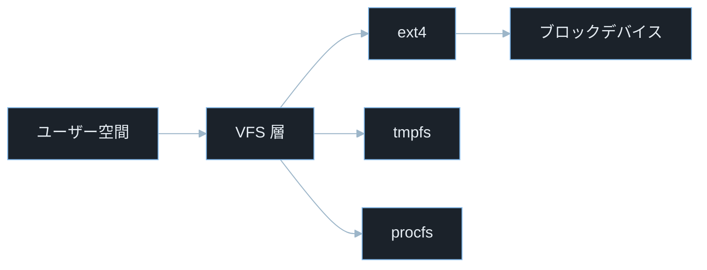
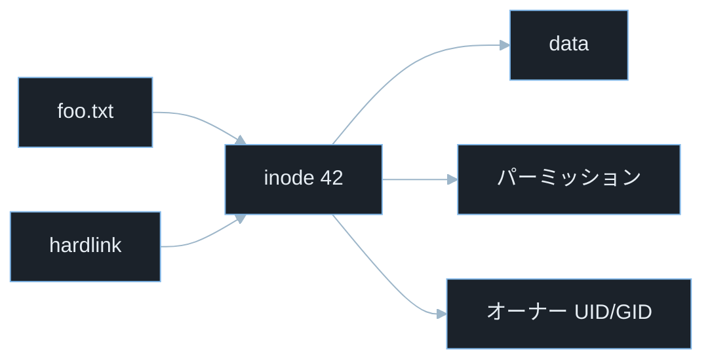
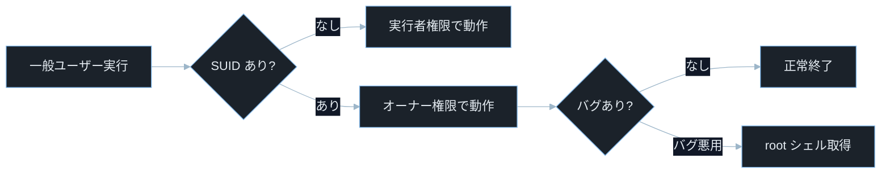

## TL;DR

- Linux ファイルシステムは **inode（ファイルのメタデータ）** と **dentry（ディレクトリエントリ）** を VFS（仮想ファイルシステム）が束ねる多層構造だ。ファイル名はファイルの実体ではなく「inode への参照」に過ぎない。
- **シンボリックリンク攻撃・パストラバーサル・TOCTOU（Time-of-Check Time-of-Use）競合** はこの構造の特性を悪用する。ファイルを操作する前に「操作対象が想定したパスかどうか」を正しく検証しないと攻撃される。
- **SUID/SGID ビット・特殊パーミッション・マウントオプション** の設定ミスが権限昇格の入口になる。`find / -perm -4000` で SUID バイナリを探すのは CTF の権限昇格チャレンジで最初に行う手順だ。

---

## なぜ重要か

「ファイルを安全に読み書きするだけなら、パスを文字列として扱えばいいのでは？」

この考え方が危険だ。**Linux のファイルシステムはパス文字列と実際の inode が 1 対 1 に対応しておらず、操作の「確認」と「実行」の間にファイルシステムの状態が変わりうる。** ファイルシステムの仕組みを知れば、なぜこれほど多くの権限昇格・情報漏洩・サービス妨害が「ファイル操作」を起点に発生するかが見えてくる。

具体的に挙げると：

- Web アプリがユーザー入力パスをそのまま使う→パストラバーサルで `/etc/shadow` を読まれる
- 一時ファイルを「存在確認してから作成」する→その間にシンボリックリンクを仕込まれ任意ファイルを上書きされる（TOCTOU）
- SUID ビットが付いたバイナリをユーザーが実行できる→プログラムのバグを突いて root 権限を取得される
- Docker・仮想マシンでディスクイメージを直接マウントされる→暗号化なしなら全ファイルが読まれる
- CTF Forensics でディスクイメージを解析してフラグを探す

> **CTF とは**: Capture The Flag の略。セキュリティ技術を競う演習形式。Forensics はディスクイメージやメモリダンプの解析、Pwn はバイナリ脆弱性悪用が主題。

---

## 読む前に確認したい用語

難しい用語は出てきたタイミングで解説するが、以下の概念は記事全体を通して何度も登場する。ざっと目を通してから先に進もう。

**ファイルシステムの内部構造**
- **inode（アイノード）**: ファイルのメタデータ（サイズ・パーミッション・タイムスタンプ・データブロックへのポインタ）を格納する整数番号付きのデータ構造。ファイル名は inode には含まれない。
- **dentry（ディレクトリエントリ）**: ファイル名と inode 番号の対応付けを保持するカーネル内のキャッシュ構造。ディレクトリの「中身」はこれの集合だ。
- **VFS（Virtual File System）**: ext4・tmpfs・procfs・NFS など異なるファイルシステムを統一的なインタフェースで扱うカーネルの抽象化層。
- **ext4**: Linux 標準の日誌付きファイルシステム（Extended File System 4）。ext2/3 の後継で、大容量ファイル・遅延割り当て・エクステントを特徴とする。

**ファイルの種類と特殊属性**
- **ハードリンク**: 同一 inode を指すディレクトリエントリを追加すること。参照カウントが 0 になるまでファイルは削除されない。
- **シンボリックリンク（symlink）**: 別のパス文字列を指す特殊ファイル。リンク先が存在しなくてもリンク自体は作れる（ダングリングシンボリックリンク）。
- **SUID（Set User ID）**: 実行時にファイルオーナーの権限で動くビット。root が所有する SUID バイナリは一般ユーザーが実行しても root 権限で動く。
- **SGID（Set Group ID）**: SUID のグループ版。ディレクトリに設定すると配下のファイルが同じグループを継承する。

**マウントとパーティション**
- **マウント**: ファイルシステムをディレクトリツリーの特定の点（マウントポイント）に接続すること。Linux は全ての記憶装置を 1 本のツリーに統合する。
- **FHS（Filesystem Hierarchy Standard）**: Linux のディレクトリ構造の標準規格。`/etc`・`/var`・`/usr`・`/tmp` 等の役割を定義する。

**セキュリティ用語**
- **TOCTOU（Time-of-Check Time-of-Use）**: ファイルの「存在確認」と「実際の使用」の間に状態が変化する競合状態の脆弱性（発音: トクトゥー）。
- **パストラバーサル**: `../` などを使ってアプリが意図したディレクトリの外に出るパス操作。
- **CVE**: Common Vulnerabilities and Exposures の略。世界共通の脆弱性識別番号。
- **CVSS**: Common Vulnerability Scoring System。脆弱性の深刻度を 0.0〜10.0 で評価する指標。

---

## 仕組み

### Linux ファイルシステムの層構造



VFS が抽象化層として機能するため、アプリは `open()`・`read()`・`write()` を呼ぶだけで ext4 でも NFS でも同じコードが動く。この抽象化は利便性の一方で、VFS 層のバグがあらゆるファイルシステム実装に横断的に影響するという攻撃面も生む。

**計算量まとめ**

- **ファイルオープン（パス解決）**: パスの深さに比例。各ディレクトリで dentry キャッシュを引く。
- **inode 参照**: O(1)。inode 番号からの直接参照。
- **ディレクトリ探索（線形）**: エントリ数 N に対して O(N)。ハッシュツリー対応の ext4 では O(1) に近い。

**ファイルシステムの弱点 — VFS 層の競合**

VFS はファイル操作をシステムコール単位で処理するため、複数のシステムコール間で「原子性」が保証されない。`access()` で確認した後に `open()` するまでの間にファイルの状態が変わりうる。これが TOCTOU の根本原因だ。

---

### inode とファイル名の分離



> **`inode 42` の `42` とは**: inode 番号の例。実際にはファイルシステム上のファイルごとに一意な整数が割り当てられる。`stat ファイル名` で表示される `Inode:` フィールドがこの番号だ。

inode とファイル名が分離されているため、「確認したパス」と「実際に開かれる inode」が一致するとは限らない。シンボリックリンクの差し替えやハードリンク操作によって参照先を変えられることが symlink 攻撃や TOCTOU の土台になる。

**計算量まとめ**

- **inode 読み取り**: O(1)。ブロックデバイス上の固定位置。
- **ハードリンク追加**: O(1)。dentry エントリを追加するだけ。
- **シンボリックリンク解決**: パス解決の再帰呼び出し。最大 40 段まで（Linux カーネルの制限）。

**inode の弱点 — inode 枯渇**

ファイルの「数」が多すぎると inode テーブルが枯渇し、ディスク容量が残っていても新規ファイルを作れなくなる。小さなファイルを大量生成するマルウェアや攻撃者がこれを DoS（サービス妨害）に使う。

> **`df -i` コマンド**: ディスクの inode 使用状況を確認するコマンド（disk free の `-i` は inode 表示フラグ）。`df -h` が容量残量、`df -i` が inode 残量を示す。両方確認する習慣をつける。

---

### SUID/SGID とスティッキービット



> **「バグ悪用」とは**: SUID プログラムに存在するバッファオーバーフロー・PATH 注入・環境変数注入などの欠陥を利用して、オーナー権限（多くの場合 root）で任意のコードを実行すること。

SUID バイナリはカーネルが実行時に eUID を切り替える仕組みで、切り替え後の動作はバイナリのコード次第だ。バグのある SUID バイナリが 1 つあるだけで権限昇格の経路になる。

**計算量まとめ**

- **SUID ビット確認**: O(1)。inode の `st_mode` フィールドを参照するだけ。
- **eUID/eGID の切り替え**: O(1)。カーネル内のプロセス構造体フィールドの更新。

> **eUID（Effective User ID）とは**: プロセスが実際に使っている権限の UID。SUID バイナリを実行すると、実行ユーザーの「本来の UID（rUID）」とは別に「ファイルオーナーの UID（eUID）」が設定される。カーネルはシステムコールの権限チェックに eUID を使う。

**SUID の弱点 — 権限昇格経路**

バグを含む SUID root バイナリにバッファオーバーフロー・パス注入・環境変数注入などを仕掛けると、eUID 0（root）として任意コードを実行できる。GTFOBins（https://gtfobins.github.io）には SUID が設定されたときに悪用できる標準バイナリのリストがある。

---

### マウントと `/proc`・`/sys`

```mermaid
%%{init: {"theme":"base","themeVariables":{"background":"#0b1117","primaryColor":"#1b222a","primaryBorderColor":"#7fb6e8","primaryTextColor":"#e6edf3","lineColor":"#9db6c9","secondaryColor":"#111827","tertiaryColor":"#0b1117"}}}%%
flowchart TD
    A[ルート /] --> B[/etc 設定]
    A --> C[/var 可変]
    A --> D[/proc カーネル情報]
    A --> E[/sys デバイス情報]
    A --> F[/tmp 一時]
    A --> G[/home ユーザー]
```

`/proc` は物理ディスク上に存在しない仮想ファイルシステム（procfs）で、カーネルが動的に生成する。

> **PID（Process ID）とは**: Linux で各プロセスに割り当てられる一意な整数番号。`ps aux` や `top` コマンドで確認できる。`/proc/[PID]/` は特定のプロセスの情報を格納するディレクトリで、`[PID]` を実際のプロセス番号（例: `/proc/1234/`）に置き換えて使う。

`/proc/[PID]/mem` でプロセスのメモリが読める・`/proc/self/environ` で環境変数が読める・`/proc/sysrq-trigger` でシステムを操作できるなど、セキュリティ上の影響が大きい疑似ファイルが多数ある。

**計算量まとめ**

- **`/proc` ファイル読み取り**: ディスク I/O なし。カーネルが直接応答する。
- **ディレクトリ走査**: O(N)。N はエントリ数。

**マウントの弱点 — noexec/nosuid オプションの欠如**

マウント時に `noexec`（実行不可）・`nosuid`（SUID 無視）・`nodev`（デバイスファイル無視）オプションを付けないと、`/tmp` や外付けドライブにマルウェアを置いて実行される。`/tmp` に `noexec` が設定されていれば、シェルコードを `/tmp` に書いて実行する攻撃が防げる。

> **`/etc/fstab` とは**: ファイルシステムのマウント設定ファイル（file system table の略）。起動時に自動マウントされる全デバイスとマウントオプションが記載される。`/tmp` のエントリに `nosuid,noexec,nodev` を追加することがセキュリティ上推奨される。

---

## よくある誤解

実装に進む前に、間違えやすいポイントを整理しておく。「あー、そうか」と思えるものがあれば、コードを書くときに思い出してほしい。

**「ファイルを削除したらデータが消える」**
`rm` はディレクトリエントリ（ファイル名）を削除するだけで、inode の参照カウントを 1 減らす。**参照カウントが 0 になって初めてデータブロックが解放される**。プロセスが既にそのファイルをオープンしていれば、`rm` しても fd（ファイルディスクリプタ）経由でデータを読み書きできる。フォレンジックで「削除済みファイル」が復元できるのはこの仕組みのためだ。

> **fd（ファイルディスクリプタ）とは**: プロセスがオープンしているファイルを整数番号で管理するもの。`0` が標準入力・`1` が標準出力・`2` が標準エラー出力で、それ以降が `open()` で取得した番号。

**「`/tmp` はプロセス間で安全に共有できる」**
`/tmp` のデフォルトパーミッションは `1777`（スティッキービット付き全ユーザー書き込み可）で、誰でも書き込める。**スティッキービットはファイルの削除を作成者のみに制限するが**、他のユーザーがファイル「名」のそばにシンボリックリンクを置く操作は防げない。TOCTOU 攻撃で `/tmp` の一時ファイルを悪用するケースが多いのはこのためだ。

> **スティッキービット（`t`）とは**: ディレクトリに設定すると、そのディレクトリ内のファイルをオーナー以外が削除できなくする保護ビット。`ls -la /tmp` で末尾の `t`（`drwxrwxrwt`）として確認できる。

**「`../` を除去すればパストラバーサルは防げる」**
単純な文字列置換（`str.replace('../', '')`）は `....//` のような二重エンコードや Unicode 正規化で回避される。正しい防御は**パスを OS 関数（`realpath`・`os.path.realpath`）で正規化してから想定ディレクトリで始まることを検証する**ことだ。

**「シンボリックリンクは相対パスでも安全」**
シンボリックリンクの解決は「実行時のカレントディレクトリ」ではなく「リンクが置かれたディレクトリ」を基準に行われる。相対パスのシンボリックリンクでも、リンクを別の場所に移動されると参照先が変わる可能性がある。重要なファイルを指すパスは **`O_NOFOLLOW` フラグ**で symlink をたどらないようにすることが防御の基本だ。

> **`open()` とは**: Linux でファイルを開くシステムコール。Python の `os.open(path, flags)` や C の `open(path, flags)` がこれに対応する。第 2 引数にフラグ（`O_RDONLY`・`O_WRONLY`・`O_NOFOLLOW` 等）を組み合わせてファイルのオープン方法を制御する。

> **`O_NOFOLLOW` とは**: `open()` システムコールのフラグ。パスの最終要素がシンボリックリンクだった場合、`ELOOP` エラーを返してオープンを拒否する。Python では `os.open(path, os.O_RDONLY | os.O_NOFOLLOW)` のように使う。

**「SUID バイナリは root が所有するものだけが危険」**
一般ユーザーが所有する SUID バイナリも、そのユーザーの権限で実行できるため危険だ。例えば `backup` ユーザーが所有する SUID バイナリを悪用すれば、`backup` ユーザー権限でファイルを読める。**`find / -perm -4000 -type f 2>/dev/null`** で SUID バイナリを全列挙して不必要なものを確認することが定期監査の基本だ。

---

## 脆弱なコード例

> 本記事の攻撃例は学習環境・CTF・明示的に許可された検証環境のみで実施してください。
> 実システムへの無断検証は不正アクセス禁止法や各国法令・利用規約違反となる可能性があります。

### PHP — パストラバーサルによるファイル読み取り

```php
<?php
$filename = $_GET['file'] ?? '';

$path = '/var/www/files/' . $filename;
echo file_get_contents($path);
```

> **`$_GET['file']` とは**: HTTP GET リクエストのクエリパラメータ `file` の値を取得する PHP の超グローバル変数。例えば `/read?file=report.txt` で `$_GET['file']` が `"report.txt"` になる。

> **`file_get_contents()` とは**: PHP でファイルの内容を文字列として読み取る関数。パスが正しければファイルを返し、読めなければ `false` を返す。

**どこが問題か**: `?file=../../etc/passwd` のような入力を送るだけで、`/var/www/files/../../etc/passwd` が解決されて `/etc/passwd`（ユーザー一覧）が読み取れる。さらに `?file=../../etc/shadow` を試せばパスワードハッシュも取得できる可能性がある。Web サーバーの実行ユーザーが読める全てのファイルが攻撃対象になる。

```php
<?php
$filename = $_GET['file'] ?? '';

$base_dir = realpath('/var/www/files');
$requested = realpath($base_dir . '/' . $filename);

if ($requested === false || strpos($requested, $base_dir . '/') !== 0) {
    http_response_code(400);
    exit("アクセスが許可されていないパスです");
}

$allowed_extensions = ['txt', 'pdf', 'png'];
$ext = strtolower(pathinfo($requested, PATHINFO_EXTENSION));
if (!in_array($ext, $allowed_extensions, true)) {
    http_response_code(400);
    exit("許可されていない拡張子です");
}

echo file_get_contents($requested);
```

> **`realpath()` とは**: PHP でシンボリックリンクと `../` を全て解決して絶対パスを返す関数。ファイルが存在しない場合は `false` を返す。`strpos($resolved, $base . '/')` との組み合わせで「解決後のパスが基準ディレクトリ配下にある」ことを検証できる。

`realpath()` で正規化した後にベースディレクトリとの前方一致を確認することで、`../` を含む全ての迂回パターンと symlink 経由の脱出を同時に防ぐ。

---

### Node.js — TOCTOU 競合状態による一時ファイルの乗っ取り

```javascript
const fs = require('fs');
const path = require('path');
const { execSync } = require('child_process');

function processUpload(userId, data) {
    const tmpPath = `/tmp/upload_${userId}.tmp`;

    if (fs.existsSync(tmpPath)) {
        fs.unlinkSync(tmpPath);
    }

    fs.writeFileSync(tmpPath, data);
    const result = execSync(`process_tool ${tmpPath}`).toString();
    fs.unlinkSync(tmpPath);
    return result;
}
```

> **`fs.existsSync()` とは**: Node.js でファイルの存在を同期的に確認する関数。存在すれば `true`、しなければ `false` を返す。

> **`execSync()` とは**: Node.js でシェルコマンドを同期的に実行する関数。コマンド完了まで処理をブロックする。

> **`fs.writeFileSync()` とは**: Node.js でファイルを同期的に書き込む関数。ファイルが存在しなければ作成し、存在すれば上書きする。

**どこが問題か**: `existsSync()` でファイルを確認してから `writeFileSync()` で書き込むまでの間に、攻撃者が `/tmp/upload_[userId].tmp` から重要なファイル（例: `/etc/passwd`）へのシンボリックリンクを作ると、`writeFileSync()` がそのシンボリックリンクをたどって重要ファイルを上書きする。確認と書き込みが別のシステムコールである以上、この「隙間」を原子的に埋めることはできない。

> **`0o` プレフィックスとは**: JavaScript で 8 進数を表すプレフィックス（Python の `0o` と同じ）。`0o600` は 8 進数の `600`、つまり「オーナーが読み書き可・グループ・その他は一切不可」を意味する。

```javascript
const fs = require('fs');
const os = require('os');
const path = require('path');
const { execFileSync } = require('child_process');

function processUpload(userId, data) {
    const safeUserId = String(userId).replace(/[^a-zA-Z0-9]/g, '');
    if (!safeUserId) throw new Error('無効なユーザーID');

    const tmpDir = fs.mkdtempSync(path.join(os.tmpdir(), `upload_${safeUserId}_`));
    const tmpPath = path.join(tmpDir, 'data.tmp');

    try {
        fs.writeFileSync(tmpPath, data, { mode: 0o600 });
        const result = execFileSync('process_tool', [tmpPath]).toString();
        return result;
    } finally {
        fs.rmSync(tmpDir, { recursive: true, force: true });
    }
}
```

> **`fs.mkdtempSync()` とは**: Node.js でランダムなサフィックスを持つ一時ディレクトリを安全に作成する関数（make directory temporary）。ディレクトリ名が推測できないため、攻撃者が事前にシンボリックリンクを置くことが困難になる。

> **`execFileSync('process_tool', [tmpPath])` とリスト形式**: `execSync` と違い、引数を配列で渡すことでシェルを経由せずに直接実行できる。これによりシェルのメタ文字によるコマンドインジェクションも防げる。

> **`mode: 0o600` とは**: ファイル作成時のパーミッションを 8 進数で指定するオプション。`0o` は 8 進数プレフィックス、`600` は「オーナーが読み書き可・グループ・その他は一切不可」を意味する。一時ファイルに他のユーザーがアクセスできないよう制限する。

一時ファイルにはランダムなディレクトリを `mkdtempSync` で生成してその中に置くことで、ファイル名の予測と事前 symlink 攻撃を同時に防ぐ。

---

### Python — SUID バイナリを呼び出す際の環境変数注入

```python
import os
import subprocess
from flask import Flask, request

app = Flask(__name__)

@app.route('/report')
def generate_report():
    report_type = request.args.get('type', 'summary')
    env = os.environ.copy()
    env['REPORT_TYPE'] = report_type

    result = subprocess.run(
        ['/usr/local/bin/report_generator'],
        env=env,
        capture_output=True,
        text=True
    )
    return result.stdout
```

**どこが問題か**: `/usr/local/bin/report_generator` が SUID root バイナリで、かつ `REPORT_TYPE` 環境変数を元にファイルパスや別のコマンドを構築している場合、`?type=../../etc/shadow` や `?type=; id` を渡すだけで root 権限での任意操作が可能になる。

> **SUID root バイナリとは**: ファイルオーナーが root であり SUID ビットが設定された実行ファイル。実行者の権限に関わらず root として動作する。環境変数・引数・設定ファイルがそのまま危険な操作に流れ込む設計は、root 権限での任意コード実行につながる。

SUID バイナリに渡す環境変数は全てが攻撃の入口になりうる。

```python
import os
import subprocess
import re
from flask import Flask, request, abort

app = Flask(__name__)

ALLOWED_TYPES = {'summary', 'detail', 'audit'}

@app.route('/report')
def generate_report():
    report_type = request.args.get('type', 'summary')

    if report_type not in ALLOWED_TYPES:
        abort(400)

    safe_env = {
        'PATH': '/usr/local/bin:/usr/bin:/bin',
        'HOME': '/tmp',
        'REPORT_TYPE': report_type,
    }

    result = subprocess.run(
        ['/usr/local/bin/report_generator'],
        env=safe_env,
        capture_output=True,
        text=True,
        timeout=10
    )
    return result.stdout
```

> **`env=safe_env` で環境変数を制限する**: デフォルトの `os.environ` をそのまま渡すと、`LD_PRELOAD`・`LD_LIBRARY_PATH`・`PYTHONPATH` など多くの危険な変数も渡される。ただし Linux カーネルは SUID バイナリ実行時に `LD_PRELOAD` 等を自動で無視するため、最大のリスクはアプリ固有の環境変数への注入だ。最小限の環境変数だけを明示的に定義した辞書を渡すことで、環境変数経由の注入全般を防ぐ。

許可する環境変数と値をホワイトリストで明示し、それ以外の変数を一切渡さないことで「環境変数という攻撃面」そのものを最小化する。

---

## 実践例 / 演習例

### ファイルシステム情報を読む基本コマンド

```bash
stat /etc/passwd
```

> **`stat` とは**: ファイルの詳細な inode 情報（inode 番号・パーミッション・UID/GID・タイムスタンプ・参照カウント）を表示するコマンド。`ls -la` より詳細な情報が得られる。

```bash
ls -lai /etc/passwd
```

> **`ls -lai` とは**: `-l`（詳細表示）・`-a`（隠しファイル含む）・`-i`（inode 番号表示）を組み合わせたオプション。inode 番号が先頭に表示される。

```bash
df -i /
df -h /
```

```bash
findmnt --verify
cat /proc/mounts
```

> **`findmnt` とは**: 現在マウントされているファイルシステムをツリー形式で表示するコマンド（find mount の略）。`--verify` はマウントの設定に問題がないかを検証するオプション。

### SUID バイナリを探す（CTF 権限昇格の第一歩）

```bash
find / -perm -4000 -type f 2>/dev/null
```

> **`-perm -4000` とは**: `find` コマンドでパーミッションのマスク検索をするオプション。`-4000` は「SUID ビット（8 進数で 4000）が立っているファイル」にマッチする。`-type f` は通常ファイルのみを対象にする。

> **`2>/dev/null` の `2` とは**: シェルのファイルディスクリプタ番号で、`2` は標準エラー出力（STDERR）を指す。`/dev/null` は書き込んだデータを全て捨てる特殊ファイル。`2>/dev/null` で「エラーメッセージを表示しない」という意味になり、権限不足でアクセスできないディレクトリのエラーが出力されなくなる。

```bash
find / -perm -2000 -type f 2>/dev/null
```

> **`-2000` とは**: SGID ビット（8 進数で 2000）が立っているファイルを探すマスク。`-perm -6000` で SUID と SGID 両方を一度に検索できる。

### シンボリックリンクと inode を実験する

```bash
echo "hello" > /tmp/original.txt
ln /tmp/original.txt /tmp/hardlink.txt
ln -s /tmp/original.txt /tmp/symlink.txt

ls -lai /tmp/original.txt /tmp/hardlink.txt /tmp/symlink.txt
```

> **`ln` とは**: ファイルのリンクを作成するコマンド（link の略）。引数なしだとハードリンク、`-s` オプションでシンボリックリンクを作成する。

出力で inode 番号を比較すると、`original.txt` と `hardlink.txt` が同じ番号を持ち、`symlink.txt` だけが異なる番号を持つことが確認できる。

```bash
rm /tmp/original.txt
cat /tmp/hardlink.txt
cat /tmp/symlink.txt
```

`original.txt` を削除しても `hardlink.txt` からデータが読める（inode の参照カウントが 1 残るため）。`symlink.txt` はパス解決が失敗して読めなくなる（ダングリングシンボリックリンク）。

### パストラバーサルを grep で検出する

```bash
grep -rn "file_get_contents\|readfile\|fopen\|include\|require" \
    --include="*.php" /var/www/html/ | grep -v "realpath\|basename"
```

> **`grep -rn` とは**: `-r` はディレクトリを再帰的に検索（recursive）、`-n` はマッチした行番号を表示（line number）するオプション。`--include="*.php"` で PHP ファイルのみを対象にする。

---

## 防御策

### 1. パス正規化の徹底

Python の `os.path.realpath()` と `os.path.abspath()` の違いを理解して使い分ける。

```python
import os

def safe_open(base_dir: str, user_input: str) -> str:
    base = os.path.realpath(base_dir)
    target = os.path.realpath(os.path.join(base, user_input))

    if not target.startswith(base + os.sep):
        raise ValueError(f"パストラバーサルを検出: {user_input!r}")

    return target
```

> **`os.path.realpath()` とは**: Python でシンボリックリンクを解決して絶対パスを返す関数。`os.path.abspath()` は `../` を処理するだけでシンボリックリンクを解決しない点が異なる。セキュリティ用途では `realpath()` を使う。

> **`os.sep` とは**: OS のパス区切り文字。Linux では `/`、Windows では `\`。`base + os.sep` とすることで「`/safe` で始まる `/safe_extra`」という誤検出を防ぐ。

### 2. `O_NOFOLLOW` で symlink を拒否する

```python
import os

def open_no_symlink(path: str) -> bytes:
    try:
        fd = os.open(path, os.O_RDONLY | os.O_NOFOLLOW)
        with os.fdopen(fd, 'rb') as f:
            return f.read()
    except OSError as e:
        if e.errno == 40:
            raise PermissionError(f"シンボリックリンクは許可されていません: {path}")
        raise
```

> **`errno 40` とは**: Linux の `ELOOP` エラーコード。シンボリックリンクが `O_NOFOLLOW` に引っかかったとき、またはシンボリックリンクのネストが上限（40 段）を超えたときに返される。

### 3. 不要な SUID ビットを除去する

```bash
chmod u-s /path/to/binary
```

> **`chmod u-s` とは**: ファイルのオーナー（`u`）の SUID ビット（`s`）を除去（`-`）するコマンド（change mode の略）。
> **`chmod 0755` の `0755` とは**: 先頭の `0` は 8 進数表記を示す。`0755` は「オーナーが読み書き実行可（`7`）・グループが読み実行可（`5`）・その他が読み実行可（`5`）」を意味する 8 進数のパーミッション指定。先頭 `0` を `4` にすると SUID ビットが立つ（`4755`）、`0` のままだと SUID なし。

```bash
find / -perm -4000 -type f 2>/dev/null | while read f; do
    echo "=== $f ==="
    ls -la "$f"
done
```

SUID バイナリを定期的に棚卸しし、OS 標準のもの（`/usr/bin/sudo`・`/usr/bin/passwd` 等）以外は必要性を確認して除去する。

### 4. `/tmp` を `noexec,nosuid,nodev` でマウントする

`/etc/fstab` に以下を追記（既存エントリを更新）する：

```
tmpfs /tmp tmpfs defaults,noexec,nosuid,nodev,size=512M 0 0
```

> **`tmpfs` とは**: RAM（またはスワップ）上に作られるファイルシステム。`/tmp` に使うと高速で、再起動のたびにクリアされる。`size=512M` で使用量を制限できる。

`noexec` は `exec()` システムコールを、`nosuid` は SUID ビットを、`nodev` はデバイスファイルを無効化する。この 3 つを `/tmp`・`/dev/shm`・外付けドライブに設定することが Linux セキュリティ強化の基本だ。

### 5. ファイルシステムの整合性監視

```bash
aide --init
aide --check
```

> **`aide` とは**: Advanced Intrusion Detection Environment の略。ファイルのハッシュ・パーミッション・オーナーを記録しておき、変更を検出するホストベース侵入検知ツール。`--init` でベースラインを作成、`--check` で差分を検出する。

---

## 実演ラボ案内

### 推奨学習順序

- boot-process（ファイルシステムがマウントされるまでの流れ）
- linux-filesystem（本記事）
- linux-permissions（パーミッション・ACL の詳細）
- linux-privilege-escalation（権限昇格の総合演習）

### Hack The Box

- **Challenges — Forensics カテゴリ**: ディスクイメージ（`.img`・`.dd`）を `mount -o loop` でマウントして inode・削除済みファイル・隠しパーティションを解析する問題が出題される。
- **Machines**: 多くの Linux マシンで SUID バイナリや書き込み可能な `/etc/passwd` が権限昇格の経路になる。`find / -perm -4000` がほぼ必須の初動コマンドだ。

> **`mount -o loop` とは**: ファイルをブロックデバイスとして扱い、ファイルシステムをマウントするオプション。`mount -o loop disk.img /mnt` でディスクイメージの中身をそのまま参照できる。CTF Forensics で頻用される。

### TryHackMe

- **Linux PrivEsc**: SUID・ファイルパーミッション・`/etc/passwd` 書き込みなど代表的な権限昇格手法を段階的に練習できる。
- **Corridor**: パストラバーサルの基礎を Web アプリで体験できる短い演習。

### 自宅 VM（合法演習）

```bash
sudo apt install sleuthkit autopsy
mmls disk.img
fsstat -f ext4 disk.img
istat -f ext4 disk.img 2
```

> **`sleuthkit` とは**: デジタルフォレンジックツールキット（The Sleuth Kit の略）。`mmls`（パーティションテーブル表示）・`fsstat`（ファイルシステム情報）・`istat`（inode 情報）・`icat`（inode からファイル内容取り出し）などのコマンドを提供する。

> **`istat -f ext4 disk.img 2` の `2` とは**: 解析する inode 番号。ext 系ファイルシステムでは inode 2 がルートディレクトリ（`/`）専用に予約されている。inode 1 は不良ブロックリスト用、inode 2 はルート、inode 11 以降がユーザーファイル用として割り当てられる設計になっている。

---

## 関連 CVE と被害事例

> **CVE とは**: Common Vulnerabilities and Exposures の略。世界共通の脆弱性識別番号。
> **CVSS スコア**: 脆弱性の深刻度を 0.0〜10.0 で評価した指標。7.0 以上が High、9.0 以上が Critical。

**CVE-2021-4034（Polkit pkexec — SUID バイナリの権限昇格、PwnKit）**
`pkexec`（SUID root バイナリ）の引数処理に out-of-bounds write が存在し、ローカルの一般ユーザーが root 権限を取得できることが発見された。`pkexec` は Polkit の認証補助バイナリで、ほぼ全ての Linux ディストリビューションにデフォルトでインストールされており影響範囲が極めて広かった。攻撃前提: ローカルユーザー権限。CVSS スコア 7.8（High）。本記事との関連: SUID バイナリ・権限昇格・eUID

**CVE-2022-0847（Linux カーネル — Dirty Pipe、パイプへの任意書き込み）**
Linux カーネルのパイプ（プロセス間通信機能）の実装に、読み取り専用ファイルのページキャッシュへの書き込みを許す欠陥が存在した。ページキャッシュのフラグ初期化漏れにより、`splice()` と `write()` を組み合わせることで `/etc/passwd` などの読み取り専用ファイルを上書きできた。攻撃前提: ローカルユーザー権限。CVSS スコア 7.8（High）。本記事との関連: VFS・ページキャッシュ・ファイルシステムの完全性

> **ページキャッシュとは**: カーネルがディスクから読み込んだファイルデータを RAM 上に保持するキャッシュ。同じファイルを複数プロセスが読む場合、ディスク I/O を省略してキャッシュから返す。Dirty Pipe はこのキャッシュを直接汚染できる脆弱性だった。

**CVE-2021-33909（Linux カーネル — seq_file の inode に関する権限昇格、Sequoia）**
Linux カーネルの `seq_file` インタフェース（`/proc` ファイルシステムの多くが使う）に、非常に長いパス（1GB 超）に対する符号なし整数アンダーフローが存在した。`/proc/self/mountinfo` のパスが極端に長いマウントポイントを作成して読み取ることで、スタックバッファオーバーフローを誘発して root 権限を取得できた。攻撃前提: ローカルユーザー権限。CVSS スコア 7.8（High）。本記事との関連: `/proc`・マウント・VFS

---

## 次に学ぶべき記事

- **linux-permissions** — ファイルパーミッション・ACL（アクセス制御リスト）・`umask`・ケーパビリティの詳細
- **linux-privilege-escalation** — SUID・sudo 設定ミス・PATH 注入・ライブラリ置き換えを使った権限昇格の総合演習
- **forensics-disk-analysis** — Sleuth Kit・Autopsy を使ったディスクイメージ解析・削除ファイル復元・タイムライン分析

---

## 参考文献

- Linux Kernel. "VFS — Virtual File System". https://www.kernel.org/doc/html/latest/filesystems/vfs.html
- Linux Kernel. "ext4 Data Structures and Algorithms". https://www.kernel.org/doc/html/latest/filesystems/ext4/index.html
- OWASP. "Path Traversal". https://owasp.org/www-community/attacks/Path_Traversal
- GTFOBins. "SUID binaries". https://gtfobins.github.io/
- NVD. "CVE-2021-4034 Detail (PwnKit)". https://nvd.nist.gov/vuln/detail/CVE-2021-4034
- NVD. "CVE-2022-0847 Detail (Dirty Pipe)". https://nvd.nist.gov/vuln/detail/CVE-2022-0847
- NVD. "CVE-2021-33909 Detail (Sequoia)". https://nvd.nist.gov/vuln/detail/CVE-2021-33909
- FHS. "Filesystem Hierarchy Standard 3.0". https://refspecs.linuxfoundation.org/FHS_3.0/fhs/index.html
- Qualys Research. "PwnKit: Local Privilege Escalation in polkit's pkexec". https://www.qualys.com/2022/01/25/cve-2021-4034/pwnkit.txt
