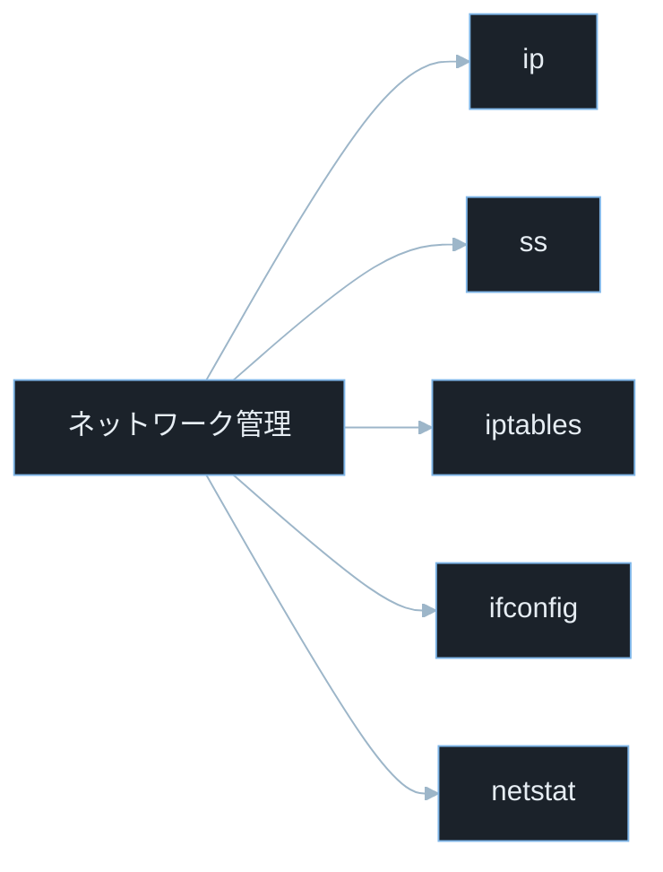
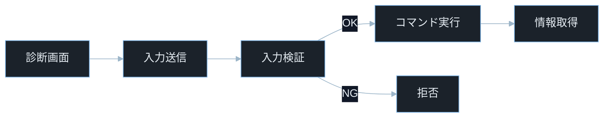
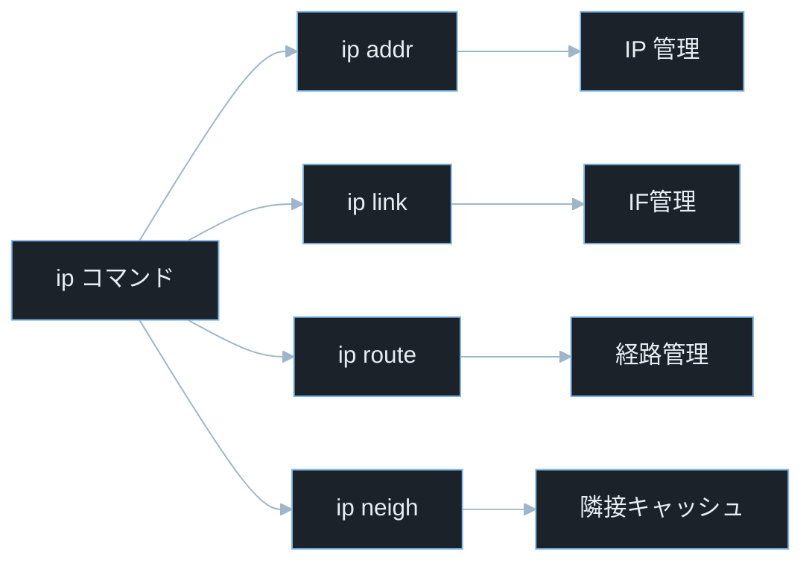
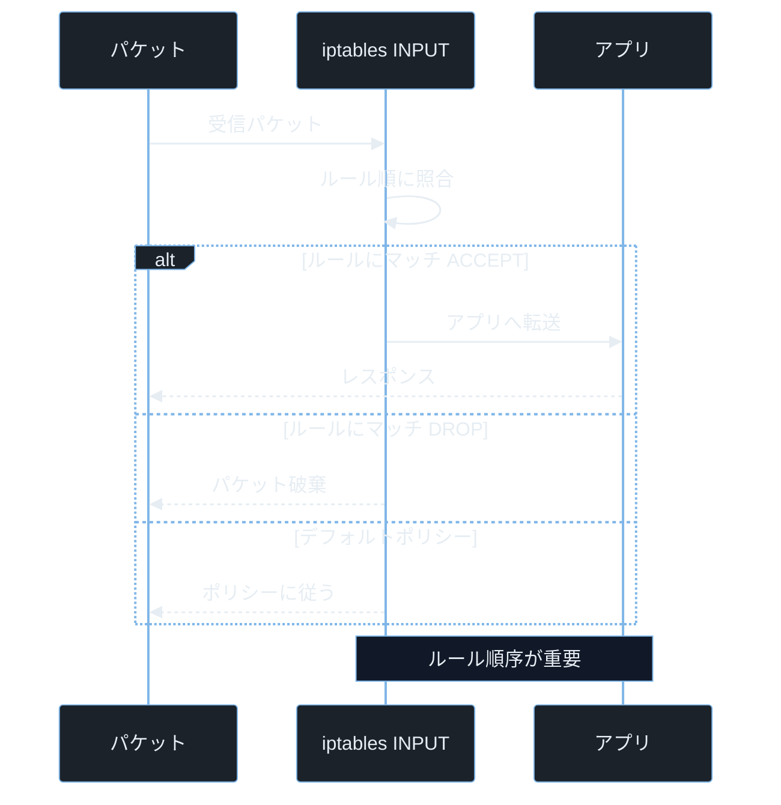

## TL;DR

- **`ip`** コマンドは `ifconfig`・`route`・`arp` の後継で、Linux ネットワーク設定のデファクト標準だ。`ip addr`・`ip route`・`ip link` で IP アドレス・経路・インタフェースを管理する。
- **`ss`**（`netstat` の後継）でリスニングポートと確立済み接続を高速に確認できる。侵入後の調査で `ss -tlnp` を実行すると、何がどのポートで動いているかが一目でわかる。
- ネットワーク設定の**確認コマンドは誰でも実行できるが、設定変更には root 権限が必要**だ。`/proc/net/` 以下のファイルも情報収集に使える。

---

## なぜ重要か

「ネットワーク設定はサーバー管理者だけが知ればいい話では？」

この問いに即答できないなら、この記事が助けになる。**ネットワーク設定コマンドの知識はペネトレーションテストの初期偵察・インシデントレスポンス・CTF の Linux 問題で必須スキルだ。** コマンドの意味を理解すれば、侵入したシステムのネットワーク構成を素早く把握して次の行動を決定できる。

具体的に挙げると：

- `ip addr` で対象マシンの全インタフェースと IP アドレスを確認し、内部ネットワークの範囲を把握する
- `ss -tlnp` で不審なリスニングポートを発見し、攻撃者が仕込んだバックドアを見つける
- `ip route` で内部ルーティングテーブルを確認し、到達可能なセグメントを特定してピボッティングを計画する
- iptables の設定ミスを発見して、本来アクセスできないポートへの接続を確立する
- CTF の Linux マシンで `netstat -anp` が使えない環境でも `/proc/net/tcp` を直接読んで接続状態を確認する

> **ペネトレーションテスト（ペンテスト）とは**: 依頼を受けてシステムへ合法的に侵入テストを行うこと。許可を得たシステムのみが対象。
> **CTF とは**: Capture The Flag の略。セキュリティ技術を競う演習形式。Linux 問題は初期偵察でネットワーク確認が必須だ。

---

## 読む前に確認したい用語

難しい用語は出てきたタイミングで解説するが、以下の概念は記事全体を通して何度も登場する。ざっと目を通してから先に進もう。

**ネットワークの基礎**
- **インタフェース（NIC）**: ネットワークカード等の物理・仮想ネットワーク接続単位。`eth0`・`ens3`・`lo`（ループバック）等の名前を持つ。
- **IP アドレス**: ネットワーク上の機器を識別する番号。IPv4 は `192.168.1.1` 形式・IPv6 は `::1` 等の形式。
- **CIDR 記法**: IP アドレスとサブネットマスクをまとめた表記。`192.168.1.0/24` の `/24` は先頭 24 ビットがネットワーク部を意味する。
- **ゲートウェイ（デフォルトルート）**: 他のネットワークへのパケットを転送するルーター。`ip route` で `default via [IP]` と表示される。
- **ループバック（lo）**: 自分自身への通信専用のインタフェース。`127.0.0.1`（`localhost`）がデフォルトアドレス。

**接続とポート**
- **ポート番号**: 同一 IP 上の複数サービスを区別する 0〜65535 の番号。80 は HTTP・443 は HTTPS・22 は SSH 等がよく知られる。
- **リスニングポート（LISTEN 状態）**: サービスが接続を待ち受けているポート。`ss -tln` で確認できる。
- **確立済み接続（ESTABLISHED 状態）**: 現在通信中の TCP 接続。
- **ソケット**: IP アドレスとポートの組み合わせ（`192.168.1.1:80` 等）で表す通信エンドポイント。

**Linux ネットワークツール**
- **`ip`**: `iproute2` パッケージが提供する最新のネットワーク設定コマンド群。
- **`ifconfig`**: 旧来のインタフェース設定コマンド（`net-tools` パッケージ）。多くの環境で非推奨・未インストールになっている。
- **`ss`**: Socket Statistics の略。接続状態を高速に表示するコマンド。`netstat` の後継。
- **`netstat`**: 旧来のネットワーク統計コマンド（`net-tools` パッケージ）。`ss` に移行が推奨される。
- **`iptables`**: Linux カーネルのパケットフィルタリングルールを管理するコマンド。firewall の設定に使う。

---

## 仕組み

### ネットワーク管理ツールの種類



`ip` と `ss` が現代の標準ツールで、`ifconfig` と `netstat` はレガシー（旧来）ツールだ。CTF や実務では両方の存在を知り、環境に応じて使い分けることが重要になる。

---

### ネットワーク診断へのコマンドインジェクション攻撃フロー



診断機能にユーザー入力が検証なしでコマンドに渡されると、攻撃者は入力にシェルメタ文字を含めて任意コードを実行できる。入力検証が機能する場合のみ安全な実行経路に進む。

---

### Linux ネットワークスタックの構成


Linux ネットワーク通信はアプリケーションから物理ネットワークまで複数の層を通過する。iptables は Netfilter フック上でパケットを検査・制御するため、INPUT・OUTPUT・FORWARD 等の複数箇所で動作する。攻撃者や防御側はどの層で通信が制御されているかを理解する必要がある。

**計算量まとめ**

- **`ip addr show`**: O(n)。n はインタフェース数。
- **`ss -tlnp`**: O(s)。s はソケット数。`/proc/net/` を走査。
- **`iptables -L`**: O(r)。r はルール数。ルールチェーンを線形スキャン。

**ネットワークスタックの弱点 — /proc/net/ の情報公開**

`/proc/net/tcp`・`/proc/net/udp` には全ての TCP/UDP ソケット情報が格納されており、多くの環境で参照可能だが、カーネル設定や権限制御により制限される場合もある。`ss` や `netstat` はこれを整形して表示するラッパーだ。`ss -tlnp` で `-p`（プロセス名）が表示されない場合でも、`/proc/net/tcp` を直接読めばポートの利用状況を把握できることがある。

---

### ip コマンドの機能マップ



`ip` コマンドはネットワーク情報の読み取りだけでなく設定変更も可能だ。偵察と設定変更の両方に利用されるため、実行には root 権限の適切な管理が重要になる。`ip neigh` が表示する隣接キャッシュ（ARP/NDP）から同一セグメントのホストを特定できる。

> **ARP（Address Resolution Protocol）とは**: IP アドレスから MAC アドレス（ハードウェアアドレス）を調べるプロトコル。IPv6 では NDP（Neighbor Discovery Protocol）が同様の役割を担う。`ip neigh show` でキャッシュされた対応表を確認できる。

**計算量まとめ**

- **`ip addr add`**: O(1)。カーネルにシステムコールを送って即時追加。
- **`ip route add`**: 実装依存だが通常は高速に処理される。カーネルの FIB（Forwarding Information Base）に追加する。

**ip コマンドの弱点 — 一時的な設定**

`ip` コマンドで設定した IP アドレスやルートは再起動すると消える。永続化するには `/etc/network/interfaces`（Debian 系）や `NetworkManager`・`systemd-networkd` の設定が必要だ。これは逆に言えば、攻撃者が `ip` で仕込んだ一時的な設定は再起動で消えるとも言える。

---

### iptables の処理フロー



iptables は上から順に評価され、最初に一致したルールで処理が決まる。そのためルール内容だけでなく並び順もセキュリティ上重要だ。

**計算量まとめ**

- **iptables ルール照合**: O(r)。r はルール数。全ルールを順番に評価する線形探索。
- **`nftables`（後継）**: セットやマップを利用することで高速な照合が可能。大規模なルールセットに向いている。

**iptables の弱点 — ルールの複雑性**

iptables の設定は直感的でなく、`INPUT`・`OUTPUT`・`FORWARD` の 3 チェーンと `PREROUTING`・`POSTROUTING`（NAT テーブル）の関係を理解しないと穴を作りやすい。特に `FORWARD` の設定ミスはコンテナ・VM のネットワーク分離を破る。

> **チェーン（chain）とは**: iptables でパケットが通過するルールのリスト。`INPUT`（外部→自分）・`OUTPUT`（自分→外部）・`FORWARD`（通過するパケット）が主要なチェーン。

---

## よくある誤解

実装に進む前に、間違えやすいポイントを整理しておく。「あー、そうか」と思えるものがあれば、コードを書くときに思い出してほしい。

**「`ifconfig` と `ip addr` は同じ」**
`ifconfig` は旧来の `net-tools` パッケージのコマンドで、多くの新しい Linux 環境ではデフォルトでインストールされていない。**`ip addr` が現代の標準**で、`ip` コマンドは VLAN・ネットワーク名前空間・ポリシールーティング等の高度な機能も扱える。CTF でコマンドが見つからない場合は `ip` を試す。

**「`netstat -tlnp` が使えれば十分」**
`netstat` は `net-tools` パッケージに含まれており、多くのサーバーや最小構成コンテナには入っていない。**`ss -tlnp` は `iproute2` に含まれ、ほぼ全ての現代 Linux にある。** さらに `ss` は `/proc/net/` を直接参照するため `netstat` より高速だ。

**「ポートが開いている＝外部から到達できる」**
`ss -tln` でポートが `LISTEN` 状態でも、**iptables が `DROP` していれば外部から到達できない。** `0.0.0.0:8080` でリスニングしていても、`iptables -A INPUT -p tcp --dport 8080 -j DROP` があれば接続できない。ポートスキャン（nmap）と `ss` の結果を組み合わせて判断する。

**「`ip route` は read-only ツール」**
`ip route` は閲覧だけでなく、`ip route add`・`ip route del` でルーティングテーブルの変更もできる（root 権限が必要）。CTF でネットワークを横断するには `ip route add 10.10.10.0/24 via 192.168.1.1` のようにルートを追加する。ただし**再起動で消えるため永続化には別途設定が必要**だ。

**「`127.0.0.1` にバインドされたサービスは安全」**
`127.0.0.1`（ループバック）にバインドされたサービスは外部から直接到達できないが、**同じサーバーにアクセスできる場合は `localhost` 経由で到達できる。** SSRF（Server-Side Request Forgery）攻撃や SSH ローカルポートフォワーディングで迂回できるため、ループバックバインドは完全な保護ではない。

> **SSRF（Server-Side Request Forgery）とは**: Web アプリケーションに、サーバー自身が内部ネットワークへリクエストを送るように仕向ける攻撃。`localhost` にバインドされた内部サービスにアクセスできる。

---

## 脆弱なコード例

> 本記事の攻撃例は学習環境・CTF・明示的に許可された検証環境のみで実施してください。
> 実システムへの無断検証は不正アクセス禁止法や各国法令・利用規約違反となる可能性があります。

### PHP — ユーザー入力を使ったネットワーク診断コマンドのインジェクション

```php
<?php
$host = $_GET['host'] ?? '';
$type = $_GET['type'] ?? 'ping';

$commands = [
    'ping' => "ping -c 3 {$host}",
    'trace' => "traceroute {$host}",
    'dns' => "dig {$host}",
];

$cmd = $commands[$type] ?? $commands['ping'];
$output = shell_exec($cmd);
echo "<pre>" . htmlspecialchars($output ?? '') . "</pre>";
```

> **`$_GET['host']` とは**: HTTP GET リクエストのクエリパラメータ `host` の値を取得する PHP の超グローバル変数。例えば `/diag?host=8.8.8.8` でアクセスすると `$_GET['host']` が `"8.8.8.8"` になる。
> **`shell_exec()` とは**: PHP でシェルコマンドを実行してその出力を文字列として返す関数。内部で `/bin/sh -c` を呼ぶためシェルのメタ文字が全て有効になる。

**どこが問題か**: `?host=8.8.8.8; cat /etc/passwd` を送るだけで、セミコロン以降が別のシェルコマンドとして実行される。`type` パラメータも辞書で制限しているが `host` の検証がないため、`?host=; id; whoami` のようなコマンドインジェクションが成立してシステムの機密情報を取得できる。

```php
<?php
$raw_host = $_GET['host'] ?? '';
$type = $_GET['type'] ?? 'ping';

$allowed_types = ['ping', 'dns'];
if (!in_array($type, $allowed_types, true)) {
    http_response_code(400);
    exit("無効な診断タイプです");
}

if (!filter_var($raw_host, FILTER_VALIDATE_IP) &&
    !preg_match('/^[a-zA-Z0-9]([a-zA-Z0-9\-]{0,61}[a-zA-Z0-9])?(\.[a-zA-Z]{2,})+$/', $raw_host)) {
    http_response_code(400);
    exit("無効なホスト名または IP アドレスです");
}

$host = escapeshellarg($raw_host);

$commands = [
    'ping' => ['ping', '-c', '3', $raw_host],
    'dns' => ['dig', '+short', $raw_host],
];

$result = proc_open(
    $commands[$type],
    [1 => ['pipe', 'w'], 2 => ['pipe', 'w']],
    $pipes
);
$output = stream_get_contents($pipes[1]);
fclose($pipes[1]);
proc_close($result);

echo "<pre>" . htmlspecialchars($output) . "</pre>";
```

> **`proc_open()` とは**: PHP でコマンドを引数配列として直接実行できる関数。`shell_exec()` と異なり、コマンド名と引数を分けて渡すためシェルを経由せずコマンドインジェクションが成立しない。
> **`filter_var($host, FILTER_VALIDATE_IP)` とは**: PHP で文字列が有効な IP アドレス形式かどうかを検証する組み込みフィルタ。IPv4 と IPv6 両方に対応する。

IP・ドメインのホワイトリスト検証とシェルを経由しないリスト形式での実行を組み合わせることで、コマンドインジェクションを根本から防ぐ。

OS コマンドにユーザー入力を直接渡さず、入力検証とシェル非経由実行を組み合わせることが、ネットワーク診断機能の安全な実装原則だ。

---

### Node.js — ネットワーク情報をそのまま API から返す

```javascript
const express = require('express');
const { execSync } = require('child_process');
const app = express();

app.get('/network-info', (req, res) => {
    const interfaces = execSync('ip addr show').toString();
    const routes = execSync('ip route show').toString();
    const connections = execSync('ss -tlnp').toString();

    res.json({
        interfaces,
        routes,
        connections,
    });
});

app.listen(3000);
```

> **`execSync()` とは**: Node.js でシェルコマンドを同期実行する関数。コマンド完了まで処理をブロックする。

**どこが問題か**: `/network-info` にアクセスするだけで、サーバーの全インタフェース IP・ルーティングテーブル・リスニングポートとプロセス名が返ってくる。攻撃者はこの情報を使って内部ネットワークの構成を把握し、次の攻撃目標を特定できる。認証なしでシステムの内部情報を公開することは情報漏洩の直接原因になる。

```javascript
const express = require('express');
const os = require('os');
const app = express();

const API_KEY = process.env.NETWORK_API_KEY;

function requireApiKey(req, res, next) {
    const key = req.headers['x-api-key'];
    if (!key || key !== API_KEY) {
        return res.status(401).json({ error: '認証が必要です' });
    }
    next();
}

app.get('/network-info', requireApiKey, (req, res) => {
    const interfaces = os.networkInterfaces();
    const safeInfo = {};

    for (const [name, addrs] of Object.entries(interfaces)) {
        if (name === 'lo') continue;
        safeInfo[name] = addrs
            .filter(a => a.family === 'IPv4')
            .map(a => ({ address: a.address, netmask: a.netmask }));
    }

    res.json({ interfaces: safeInfo });
});

app.listen(3000);
```

> **`os.networkInterfaces()` とは**: Node.js の `os` モジュールが提供するメソッド。外部コマンドを実行せずに Node.js のランタイムからネットワークインタフェース情報を取得する。シェルを介さないため安全だ。

API キー認証でエンドポイントを保護し、必要最小限の情報（IPv4 アドレスのみ）を Node.js 組み込み API から取得することで、情報漏洩とコマンドインジェクションの両方を防ぐ。

システム内部情報は認証済み管理者のみに限定し、必要最小限の情報だけを公開することが情報漏洩防止の基本原則だ。

---

### Python — iptables ルールをユーザーから受け取って動的に適用する

```python
import subprocess
from flask import Flask, request

app = Flask(__name__)

@app.route('/firewall/add', methods=['POST'])
def add_rule():
    ip = request.json.get('ip', '')
    port = request.json.get('port', '')
    action = request.json.get('action', 'DROP')

    cmd = f'iptables -A INPUT -s {ip} -p tcp --dport {port} -j {action}'
    result = subprocess.run(cmd, shell=True, capture_output=True, text=True)
    return {'output': result.stdout, 'error': result.stderr}
```

**どこが問題か**: `ip` に `0.0.0.0/0 -j ACCEPT; iptables -F` を渡すだけで、全パケットを許可した後に全ルールをフラッシュ（削除）できる。`shell=True` のためセミコロンで複数コマンドを連結可能で、iptables ルールの全削除・バックドアポートの開放・リバースシェルの起動まで可能だ。

```python
import subprocess
import re
from flask import Flask, request, abort

app = Flask(__name__)

VALID_IP = re.compile(
    r'^((25[0-5]|2[0-4][0-9]|[01]?[0-9][0-9]?)\.){3}'
    r'(25[0-5]|2[0-4][0-9]|[01]?[0-9][0-9]?)'
    r'(/(3[0-2]|[12][0-9]|[0-9]))?$'
)
ALLOWED_ACTIONS = {'ACCEPT', 'DROP', 'REJECT'}

@app.route('/firewall/add', methods=['POST'])
def add_rule():
    data = request.json or {}
    ip = data.get('ip', '')
    port_raw = data.get('port', '')
    action = data.get('action', 'DROP')

    if not VALID_IP.match(ip):
        abort(400)
    if action not in ALLOWED_ACTIONS:
        abort(400)
    try:
        port = int(port_raw)
        if not (1 <= port <= 65535):
            raise ValueError
    except (ValueError, TypeError):
        abort(400)

    result = subprocess.run(
        ['iptables', '-A', 'INPUT', '-s', ip,
         '-p', 'tcp', '--dport', str(port), '-j', action],
        capture_output=True, text=True, timeout=10
    )

    if result.returncode != 0:
        abort(500)
    return {'status': 'ok'}
```

> **`iptables -A INPUT`**: iptables の `INPUT` チェーンにルールを追記（Append）するサブコマンド。`-A` は append（末尾追加）の略。`-I` は insert（先頭挿入）。
> **`--dport`**: 宛先ポート（destination port）を指定するオプション。`-p tcp` とセットで使う。

IP・ポート・アクションをホワイトリスト検証してからリスト形式でコマンドに渡すことで、シェルインジェクションによる iptables ルールの不正操作を防ぐ。

ファイアウォールルール変更は厳格な入力検証と権限管理を前提に実施し、外部入力でルール内容を直接決定しないことが安全設計の原則だ。

---

## 実践例 / 演習例

### ネットワーク情報の確認（CTF 初動偵察）

```bash
ip addr
ip addr show eth0
```

> **`ip addr`**: 全インタフェースの IP アドレス・MAC アドレス・状態を表示する。`show eth0` で特定インタフェースに絞る。侵入直後にまず実行して現在の IP とネットワーク帯域を把握する。

```bash
ip route
ip route show default
```

> **`ip route`**: カーネルのルーティングテーブルを表示する。`default via 10.10.0.1` のようなデフォルトゲートウェイが確認できる。内部ネットワークへの経路も把握できる。

```bash
ip neigh show
arp -n
```

> **`ip neigh show`**: ARP テーブル（既知ホストの IP-MAC 対応）を表示する。`neigh` は neighbor（隣接）の略。同一セグメントの生存ホストを確認するのに使う。

### ポートとプロセスの確認

```bash
ss -tlnp
ss -tlnp4
ss -ulnp
```

> **`ss -tlnp` のオプション**: `-t` は TCP・`-l` はリスニング状態・`-n` は数値表示（名前解決なし）・`-p` はプロセス名を表示する。全オプションの意味を覚えておくと素早く条件を絞れる。
> **`-4`**: IPv4 のみ表示するオプション。`-6` は IPv6 のみ。
> **`-u`**: UDP ポートを表示するオプション。DNS・DHCP・SNMP などの調査に使う。

```bash
ss -anp | grep ESTABLISHED
ss -anp | grep ":22"
```

> **`-a`**: 全状態（LISTEN・ESTABLISHED・CLOSE_WAIT 等）のソケットを表示する（all）。`-l` とは排他で、`-a` は接続中も含む全情報が得られる。

### /proc/net/ で情報を直接読む

```bash
cat /proc/net/tcp
cat /proc/net/tcp6
```

> **`/proc/net/tcp` とは**: カーネルが公開する TCP ソケットの状態ファイル。`ss` や `netstat` が使えない環境でもここから情報が取得できる。16 進数で IP アドレスとポートが記載されている（エンディアンに注意）。

```bash
awk 'NR>1 {printf "port: %d  state: %s\n", strtonum("0x"substr($2,index($2,":")+1)), $4}' /proc/net/tcp
```

> **この例は GNU awk（gawk）を前提とする**: `strtonum()` 関数は gawk 固有の機能。`mawk` 環境（Debian/Ubuntu のデフォルト）では動作しない場合がある。`awk` の代わりに `gawk` コマンドで実行するか、Python で読み解く方法も有効だ。
> **`/proc/net/tcp` の読み方**: `$2` フィールドは `ローカルIP:ポート` の 16 進表記。`$4` はソケット状態（`0A` = LISTEN・`01` = ESTABLISHED）。

### iptables の確認

```bash
sudo iptables -L -n -v
sudo iptables -L -n -v --line-numbers
sudo iptables -t nat -L -n -v
```

> **`iptables -L -n -v`**: 全チェーンのルールを数値表示（`-n`）・詳細表示（`-v`）で一覧する（list）。`--line-numbers` でルール番号が表示されて削除・挿入の参照に使える。
> **`-t nat`**: NAT テーブルのルールを表示する。ポートフォワーディングや MASQUERADE（NAT）設定を確認できる。

---

## 防御策

### 1. ファイアウォールの基本設定（iptables）

```bash
iptables -P INPUT DROP
iptables -P FORWARD DROP
iptables -P OUTPUT ACCEPT

iptables -A INPUT -i lo -j ACCEPT
iptables -A INPUT -m conntrack --ctstate ESTABLISHED,RELATED -j ACCEPT
iptables -A INPUT -p tcp --dport 22 -j ACCEPT
iptables -A INPUT -p tcp --dport 80 -j ACCEPT
iptables -A INPUT -p tcp --dport 443 -j ACCEPT
```

> **`-P INPUT DROP`**: デフォルトポリシーを DROP に設定（Policy）。マッチするルールがないパケットは全て破棄される。「デフォルト拒否」が安全の基本だ。
> **`-m conntrack --ctstate ESTABLISHED,RELATED`**: 既に確立した接続の応答パケットを許可するモジュール。これがないと `ssh` 等の通信の返答が届かなくなる。

### 2. 不要なリスニングポートを閉じる

```bash
ss -tlnp4 | grep -v "127.0.0.1"
systemctl disable --now cups
systemctl disable --now avahi-daemon
```

> **`systemctl disable --now`**: サービスを即時停止（`stop`）しかつ次回起動時からの自動起動も無効化（`disable`）する組み合わせ引数。`--now` がなければ無効化のみで今の実行には影響しない。

### 3. ネットワーク設定の監視

```bash
ss -tlnp > /tmp/ports_baseline.txt
ss -tlnp > /tmp/ports_new.txt
diff /tmp/ports_baseline.txt /tmp/ports_new.txt
```

ベースラインと新規ファイルを明示的に指定して `diff` で新規ポートを検出する。

> **nftables について**: 現代の Linux ディストリビューション（RHEL 8 以降・Debian 10 以降等）では `nftables` が標準のファイアウォール管理ツールとなりつつある。新規構築環境では `iptables` の代わりに `nftables` の利用も検討する。`nft list ruleset` で現在のルールセットを確認できる。

```bash
ip route show > /tmp/routes_$(date +%Y%m%d).txt
```

### 4. IP スプーフィング対策（rp_filter）

```bash
echo 1 > /proc/sys/net/ipv4/conf/all/rp_filter
echo 1 > /proc/sys/net/ipv4/conf/default/rp_filter
```

> **`rp_filter`（Reverse Path Filter）とは**: 受信パケットの送信元 IP が偽装されていないか（パケットが来た経路でその IP に返信できるか）をカーネルが検証する機能。`1` を書くと厳密な検証が有効になる。IP スプーフィング攻撃の防御になる。

```bash
sysctl -w net.ipv4.conf.all.rp_filter=1
sysctl -w net.ipv4.conf.all.accept_redirects=0
```

> **`sysctl -w`**: カーネルパラメータを動的に変更するコマンド（sysctl write）。`/etc/sysctl.conf` に書くと再起動後も有効になる。

---

## 実演ラボ案内

### 推奨学習順序

- linux-permissions（ファイルパーミッションとプロセスの基礎）
- process-service-management（systemd・サービスの管理）
- linux-network-config（本記事）
- ssh-public-key-auth（SSH 経由のネットワーク操作）
- network-fundamentals（TCP/IP プロトコルの深い理解）

### Hack The Box

- **Machines**: 初期偵察で `ip addr`・`ip route`・`ss -tlnp` を実行して内部構成を把握する。`ip neigh` でセグメント上のホストを確認してピボット先を特定する手順が多くのマシンで有効だ。
- **Challenges — Linux カテゴリ**: iptables ルールのミスを発見してブロックされているポートに到達する問題も出題される。

### TryHackMe

- **Network Services**: Linux のネットワークサービスの設定と調査を体験できる。
- **Linux Fundamentals Part 3**: `ip`・`ss` の基本操作を段階的に練習できる。

### 自宅 VM（合法演習）

```bash
sudo apt install docker.io
docker network create --subnet=172.20.0.0/24 testnet
docker run -d --name server1 --network testnet --ip 172.20.0.10 nginx
docker run -it --rm --network testnet ubuntu:24.04 bash
```

コンテナ環境でネットワーク隔離と `ip route`・`ss` の動作を安全に試せる。

> **`docker network create --subnet`**: Docker でカスタムネットワークを作成するコマンド。`--subnet` でサブネット範囲を指定して、コンテナ間のネットワーク接続を制御できる。

---

## 関連 CVE と被害事例

> **CVE とは**: Common Vulnerabilities and Exposures の略。世界共通の脆弱性識別番号。
> **CVSS スコア**: 脆弱性の深刻度を 0.0〜10.0 で評価した指標。7.0 以上が High・9.0 以上が Critical。

**CVE-2023-32233（Linux カーネル — nftables の use-after-free による権限昇格）**
Linux カーネルの `nftables`（ネットワークフィルタ）で、バッチリクエスト処理中に匿名セットの参照を誤って処理することで use-after-free が発生し、ローカルの一般ユーザーが root 権限を取得できた。`nft`（nftables のコマンドラインツール）を通じてカーネルに細工したリクエストを送ることで悪用できた。攻撃前提: ローカルユーザー権限。CVSS スコア 7.8（High）。本記事との関連: iptables/nftables・ファイアウォール管理ツール・権限昇格

**CVE-2022-25636（Linux カーネル — Netfilter のヒープ範囲外書き込み）**
Linux カーネルの Netfilter（iptables/nftables の基盤）で、フロー経由のパケット処理時にヒープ範囲外書き込みが発生し、ローカルの一般ユーザーが root 権限を取得できた。`nf_tables` モジュールの `nft_fwd_dup_netdev_offload` 関数に問題があり、iptables を使うシステムでも影響を受ける可能性があった。攻撃前提: ローカルユーザー権限。CVSS スコア 7.8（High）。本記事との関連: Netfilter・iptables のカーネルモジュール・ファイアウォール脆弱性

**CVE-2019-11477（Linux カーネル — TCP SACK Panic、SACK Slowness）**
Linux カーネルの TCP スタックに、特定の SACK（Selective Acknowledgment）パケットシーケンスを送ることでカーネルパニック（システムクラッシュ）やパフォーマンス低下を引き起こす脆弱性があった。攻撃者は小さなサイズの TCP セグメントを大量に送るだけで、リモートからサービス拒否攻撃が成立した。本記事との関連: Linux TCP スタック・iptables による入力フィルタリングの重要性。攻撃前提: ネットワーク到達性のみ（認証不要）。CVSS スコア 8.0（High）。

---

## 次に学ぶべき記事

- **network-fundamentals** — TCP/IP・UDP・ICMP のプロトコル詳細とパケット構造
- **ssh-public-key-auth** — SSH を使ったポートフォワーディング・ProxyJump によるネットワーク横断
- **linux-privilege-escalation** — ネットワーク設定ミスを使った権限昇格（iptables バイパス・SSRF 等）

---

## 参考文献

- Linux man-pages. "ip(8)". https://man7.org/linux/man-pages/man8/ip.8.html
- Linux man-pages. "ss(8)". https://man7.org/linux/man-pages/man8/ss.8.html
- Linux man-pages. "iptables(8)". https://man7.org/linux/man-pages/man8/iptables.8.html
- OWASP. "Server-Side Request Forgery". https://owasp.org/www-community/attacks/Server_Side_Request_Forgery
- NVD. "CVE-2023-32233 Detail". https://nvd.nist.gov/vuln/detail/CVE-2023-32233
- NVD. "CVE-2022-25636 Detail". https://nvd.nist.gov/vuln/detail/CVE-2022-25636
- Red Hat. "iproute2 vs net-tools". https://access.redhat.com/documentation/en-us/red_hat_enterprise_linux/8/html/configuring_and_managing_networking/comparison-of-ifconfig-and-ip-commands_getting-started-with-networking
