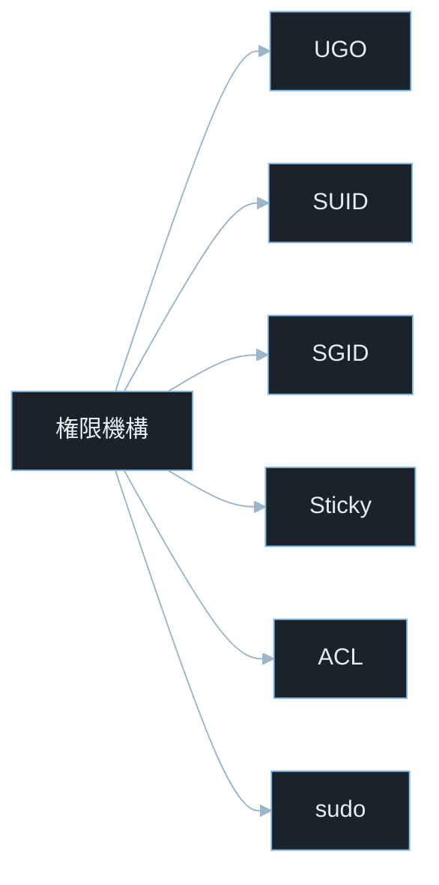
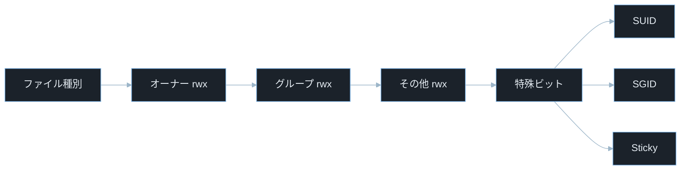
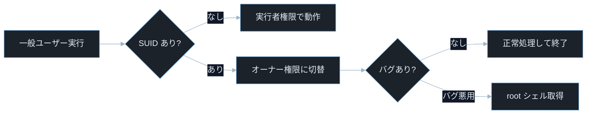
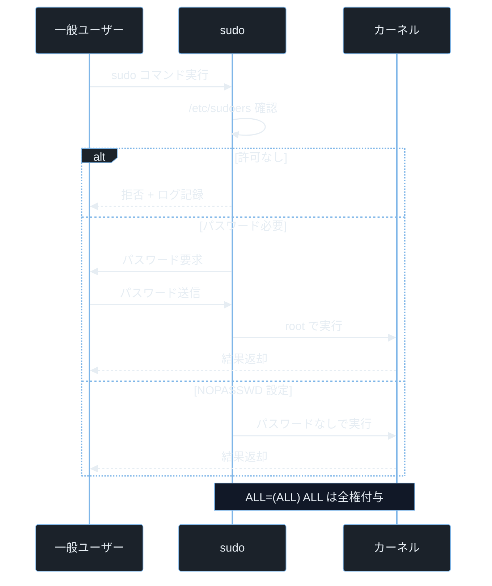
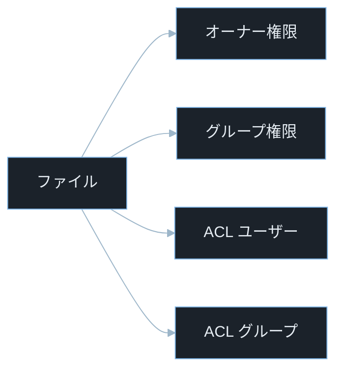

## TL;DR

- Linux のファイルには **オーナー・グループ・その他** の 3 種類の対象に対して **読み取り（r=4）・書き込み（w=2）・実行（x=1）** の権限が設定される。`chmod`・`chown` でこれを操作する。

> **`chmod` とは**: ファイルやディレクトリの権限（パーミッション）を変更するコマンド（change mode の略）。`chmod 755 file` のように使う。
> **`chown` とは**: ファイルやディレクトリの所有者・グループを変更するコマンド（change owner の略）。`chown user:group file` のように使う。
- **SUID（Set User ID）** ビットが付いたバイナリはオーナー権限で実行される。root が所有する SUID バイナリにバグがあると一般ユーザーでも root 権限が取れる（権限昇格）。
- `sudo` の設定ミス・シェルを呼び出せるコマンドの誤った許可・SUID バイナリへの PATH 注入が CTF 権限昇格チャレンジの定番手法だ。

---

## なぜ重要か

「ファイルの権限を間違えるとどんな被害が起きるのか？」

この問いに即答できないなら、この記事が助けになる。**パーミッションの設定ミスは情報漏洩・権限昇格・サービス妨害の直接原因になり、OS 標準の保護機構がこれ一つで崩壊する。** 権限の仕組みを知れば、なぜ世界中のサーバーで SUID バイナリが権限昇格の踏み台になるかが見えてくる。

具体的に挙げると：

- Web サーバーのコンフィグファイルを `777`（全ユーザー書き込み可）にするだけで、任意ユーザーが設定を書き換えられる

> **`777` とは**: パーミッションを 8 進数で表した値。オーナー・グループ・その他の全員に読み取り（4）＋書き込み（2）＋実行（1）を与える最大権限。なぜ 8 進数かというと、`rwx` の 3 ビットを 1 桁（0〜7）で表現できるためだ。`7 = 4+2+1 = rwx`。
- `sudo` で `vim` を許可すると `:!/bin/bash` でシェルエスケープして root が取れる
- SUID が付いた脆弱なバイナリ（`pkexec`・`sudo` 等）は一般ユーザーから root へ直接昇格できる（CVE-2021-4034・CVE-2021-3156）
- CTF の**権限昇格（Privilege Escalation）**チャレンジで `find / -perm -4000` が最初のコマンドになる理由はここにある
- Docker コンテナ内の root とホストの root の違いを理解するために、Linux UID 管理が前提になる

> **CTF とは**: Capture The Flag の略。セキュリティ技術を競う演習形式。Pwn はバイナリ脆弱性悪用、Forensics はファイル解析が主題。権限昇格は CTF Linux カテゴリの核心テーマだ。

---

## 読む前に確認したい用語

難しい用語は出てきたタイミングで解説するが、以下の概念は記事全体を通して何度も登場する。ざっと目を通してから先に進もう。

**パーミッションの基礎**
- **パーミッション（権限）**: ファイル・ディレクトリに対して誰が何をできるかを定義するビットフラグ。
- **オーナー（owner）**: ファイルを作成したユーザー。`chown` で変更できる。
- **グループ（group）**: ファイルに関連付けられたグループ。同一グループのユーザー全員に適用される権限を設定できる。
- **UGO（User/Group/Others）**: パーミッションを設定する 3 つの対象。オーナー・グループ・その他全員。
- **rwx**: 読み取り（read=4）・書き込み（write=2）・実行（execute=1）の 3 種類の権限。
- **8 進数表記**: パーミッションを数値で表す方法。`755`=`rwxr-xr-x`、`644`=`rw-r--r--`。

**特殊ビット**
- **SUID（Set User ID）**: 実行時にファイルオーナーの UID で動くビット。`ls -la` で `s`（4000）として表示。
- **SGID（Set Group ID）**: 実行時にファイルのグループで動くビット。ディレクトリに設定すると配下ファイルがグループを継承。
- **スティッキービット（Sticky bit）**: ディレクトリに設定すると、ファイルをオーナー以外が削除できなくなる。`/tmp` に設定されている。

**UID と sudo**
- **UID（User ID）**: Linux でユーザーを識別する整数。root は UID 0。一般ユーザーは通常 1000 以上。
- **eUID（Effective User ID）**: プロセスが実際に使っている権限の UID。SUID バイナリ実行時にオーナーの UID になる。
- **sudo**: 別ユーザー（デフォルトは root）としてコマンドを実行するツール。`/etc/sudoers` で権限を設定する。
- **シェルエスケープ**: `sudo` で許可されたコマンドからシェルを呼び出して制限を突破する技法。

**セキュリティ用語**
- **権限昇格（Privilege Escalation）**: 一般ユーザーが root などの高い権限を取得すること。
- **CVE**: Common Vulnerabilities and Exposures の略。世界共通の脆弱性識別番号。
- **CVSS**: Common Vulnerability Scoring System。脆弱性の深刻度を 0.0〜10.0 で評価する指標。

---

## 仕組み

### Linux 権限機構の分類



Linux の権限機構は「誰が」「何を」「どのリソースに対して」できるかを複数の層で定義する。UGO が基本層・SUID/SGID/Sticky が特殊ビット層・ACL が拡張層・sudo がコマンド委任層として機能し、これらの設定ミスが権限昇格の入口になる。

---

### パーミッションビットの構造



`ls -la` で表示される `-rwxr-xr-x` の 10 文字がこの構造を示す。最初の文字がファイル種別（`-` は通常ファイル・`d` はディレクトリ・`l` はシンボリックリンク）で、残り 9 文字が 3 桁 × 3 種（UGO）のパーミッションだ。この単純なビット列が Linux のアクセス制御の全てを担うため、設定ミスが即座に攻撃面になる。

**計算量まとめ**

- **パーミッションチェック**: O(1)。カーネルが inode の `st_mode` フィールドをビットマスクで比較するだけ。
- **`chmod` 再帰（`-R`）**: O(n)。n はディレクトリ以下のファイル数。大きなディレクトリでは時間がかかる。

**パーミッションの弱点 — DAC の限界**

Linux のパーミッションは **DAC（Discretionary Access Control：任意アクセス制御）** で、オーナーが自由に設定を変えられる。root になれれば全ファイルにアクセスできるため、root 権限の取得が攻撃者の最終目標になる。MAC（強制アクセス制御）の SELinux・AppArmor と組み合わせて初めて多層防御が成立する。

> **SELinux / AppArmor とは**: Linux カーネルに組み込まれた強制アクセス制御（MAC）の実装。プロセスやファイルにラベルを付け、root でも許可されていない操作を拒否できる。DAC の上位層として機能する。

---

### SUID / SGID の動作



SUID はカーネルが `exec()` 時に eUID をファイルオーナーの UID に切り替える仕組みだ。

> **`exec()` とは**: Linux が新しいプログラムを実行するシステムコール。現在のプロセスを別のプログラムイメージへ置き換える。シェルがコマンドを起動するときも内部で `fork()` + `exec()` の組み合わせを使う。`passwd` コマンドが一般ユーザーでも `/etc/shadow` を書き換えられるのは SUID root バイナリだからだ。しかしコードにバグがあるとその権限で任意コードが実行され、権限昇格が成立する。

**計算量まとめ**

- **SUID チェック**: O(1)。`st_mode & S_ISUID` のビットマスク確認。
- **eUID 切り替え**: O(1)。プロセスの `task_struct` のフィールドを更新するだけ。

**SUID の弱点 — 不要な SUID バイナリ**

OS 標準の SUID バイナリ（`passwd`・`sudo`・`ping` 等）以外に SUID が付いたバイナリが存在するとリスクになる。

> **GTFOBins とは**: Linux の標準コマンドを使った権限昇格・シェル取得・ファイル読み書きの手法をまとめたリファレンスサイト（https://gtfobins.github.io）。「Get The F*** Out Binaries」の略。

`vim`・`find`・`python`・`perl` などに SUID が付いていると即座にシェルエスケープできる。

---

### sudo の権限制御



`sudo` は `/etc/sudoers` のルールに基づいてコマンドの実行権限を判断する。`visudo` で安全に編集できる。`NOPASSWD` は利便性が高い反面、設定ミスすると任意コマンドが root で実行される。`sudo` の安全性は `sudoers` のルール品質に依存する。許可コマンドがシェルへ到達できると、認可された操作から root 権限へ脱出できる経路（シェルエスケープ）が生まれる。

> **`visudo` とは**: `/etc/sudoers` を安全に編集するコマンド。直接 `nano /etc/sudoers` で編集すると構文エラーで全ユーザーが `sudo` できなくなるロックアウトのリスクがあるため、`visudo` は編集前に構文チェックを行う。

**計算量まとめ**

- **`/etc/sudoers` 解析**: O(r)。r はルール数。通常は数十行なので実質 O(1)。
- **パスワード検証**: bcrypt などのコスト関数で意図的に遅い。

**sudo の弱点 — シェルエスケープ**

`sudo` で許可されたコマンドがシェルを呼べる場合、そこから制限を抜け出せる。例えば `sudo vim` を許可すると `:!/bin/bash` でシェルが取れる。`sudo less /var/log/syslog` を許可すると `!bash` でシェルが取れる。テキストエディタ・ページャ・スクリプト言語インタプリタはシェルエスケープの経路になる。

---

### ACL（アクセス制御リスト）

> **ACL（Access Control List）とは**: アクセス制御リスト。標準の UGO パーミッションを拡張し、特定のユーザーやグループに個別の権限を設定できる仕組み。

標準の UGO パーミッションでは「特定ユーザーだけに読み取り権限を付与する」ことができない。ACL はこれを拡張して任意のユーザー・グループに個別の権限を設定できる。



ACL はファイルに複数の「追加権限エントリ」を付与できる。標準パーミッションが「三角形」なら ACL は「任意の多角形」だ。`ls -la` では `+` が末尾に付くだけで詳細は見えないため、`getfacl` で明示的に確認する必要がある。

```bash
getfacl /var/www/html/config.php
setfacl -m u:deploy:r /var/www/html/config.php
```

> **`getfacl` とは**: ファイルの ACL（アクセス制御リスト）を表示するコマンド（get file ACL の略）。標準パーミッション以外に設定されたユーザー・グループ別の権限が確認できる。
> **`setfacl` とは**: ファイルの ACL を設定するコマンド（set file ACL の略）。`-m u:ユーザー:rwx` でユーザーごとの権限を追加できる。

**計算量まとめ**

- **ACL 確認**: O(a)。a は ACL エントリ数。
- **ACL マッチング**: O(a)。プロセスの UID/GID が各エントリと順に比較される。

**ACL の弱点 — 可視性の低さ**

`ls -la` には ACL の情報が表示されない（`+` 記号が末尾に付くだけ）。監査や権限確認の際に `getfacl` を実行しないと見落とされる。ACL で意図せず広い権限が付与されていても気づきにくい。

---

## よくある誤解

実装に進む前に、間違えやすいポイントを整理しておく。「あー、そうか」と思えるものがあれば、コードを書くときに思い出してほしい。

**「`chmod 777` は手っ取り早くて便利」**
`chmod 777` は「誰でも読み書き実行できる」状態だ。**Web サーバーのドキュメントルートや設定ファイルに `777` を設定すると、Web 経由でアクセスできる全ユーザーが内容を書き換えられる。** 一時的な回避策として使っても、本番環境でそのまま放置されるケースが後を絶たない。必要最小限の権限だけを付与する最小権限の原則を守る。

**「root になれれば SUID バイナリは関係ない」**
逆だ。**SUID バイナリは一般ユーザーから root になるための踏み台として使われる。** root になった後は全ての権限があるため SUID は無関係になるが、権限昇格前（一般ユーザー状態）では SUID バイナリの探索が最優先だ。

**「`sudo -l` で許可されているコマンドだけなら安全」**
`sudo -l` で確認できる許可コマンドでも、シェルを起動できるコマンドは全て権限昇格の経路になる。`sudo awk 'BEGIN {system("/bin/bash")}'` のように `awk`・`python`・`perl`・`vim` などは **GTFOBins に載っている悪用手法でシェルを呼び出せる**。コマンド名だけで安全性を判断してはいけない。

**「ディレクトリのパーミッションはファイルと同じ意味」**
ディレクトリの `x`（実行）は「そのディレクトリに入れる（cd できる）」権限だ。`r` は「ディレクトリの中身を一覧表示できる（ls できる）」権限。**`r` なしで `x` だけあると、ファイル名を知っている場合に限りアクセスできる**という特殊な状態になる。`r` なしでも `w` と `x` があれば新規ファイルを作れる。

**「SUID ビットはバイナリファイルだけに有効」**
シェルスクリプトに SUID を設定しても Linux カーネルは無視する（カーネルのセキュリティ設計として意図的に無効化されている）。**SUID が有効なのはバイナリ実行ファイル（ELF 形式等）のみだ。** スクリプトに SUID を設定してもシェルインタプリタが実行者の権限で起動するため効果がない。

---

## 脆弱なコード例

> 本記事の攻撃例は学習環境・CTF・明示的に許可された検証環境のみで実施してください。
> 実システムへの無断検証は不正アクセス禁止法や各国法令・利用規約違反となる可能性があります。

### PHP — Web アプリが過剰な権限でファイルを作成する

```php
<?php
$filename = $_GET['name'] ?? 'output.txt';
$content = $_POST['content'] ?? '';

$path = '/var/www/uploads/' . $filename;
file_put_contents($path, $content);
chmod($path, 0777);

echo "保存しました: " . htmlspecialchars($path);
```

> **`$_GET['name']` とは**: HTTP GET リクエストのクエリパラメータ `name` の値を取得する PHP の超グローバル変数。例えば `/upload?name=test.txt` でアクセスすると `$_GET['name']` が `"test.txt"` になる。
> **`file_put_contents()` とは**: PHP でファイルにデータを書き込む関数。ファイルが存在しなければ作成し、存在すれば上書きする。
> **`chmod($path, 0777)` とは**: PHP の `chmod()` 関数でファイルのパーミッションを変更する。`0777` は 8 進数で「全ユーザーが読み書き実行可」を意味する。PHP では先頭の `0` が 8 進数を示す。

**どこが問題か**: `?name=../../etc/cron.d/evil` のようなパストラバーサルで任意ディレクトリにファイルを作れる。作成したファイルに `chmod 0777` で全ユーザーの書き込み権限を付与しているため、他ユーザーやプロセスがそのファイルを改ざんできる。Web 経由で `/etc/cron.d/` に悪意あるスクリプトを置けば定期実行されてしまう。

```php
<?php
$raw_name = $_GET['name'] ?? 'output.txt';
$content = $_POST['content'] ?? '';

$basename = basename($raw_name);
if (!preg_match('/^[\w\-\.]+$/', $basename) || strlen($basename) > 64) {
    http_response_code(400);
    exit("無効なファイル名です");
}

$upload_dir = realpath('/var/www/uploads');
$path = $upload_dir . '/' . $basename;

file_put_contents($path, $content);
chmod($path, 0640);

echo "保存しました";
```

> **`basename()` とは**: PHP でパス文字列からファイル名部分だけを取り出す関数。`basename('../../etc/passwd')` は `'passwd'` を返す。パストラバーサルを防ぐ最初の防壁になる。
> **`0640` とは**: 8 進数の `640`。オーナーが読み書き可（`rw-`）・グループが読み取りのみ（`r--`）・その他は一切不可（`---`）。Web アプリがアップロードするファイルの適切な権限の例だ。

パス正規化・ファイル名ホワイトリスト・最小権限（`0640`）の三重防御で、パストラバーサルと過剰権限の両方を防ぐ。

アップロードファイルは保存先・ファイル名・権限を全てサーバー側で制御することが防御の基本だ。

---

### Node.js — アプリが root で動作する場合に SUID バイナリを動的生成する

```javascript
const express = require('express');
const { execSync } = require('child_process');
const fs = require('fs');
const app = express();
app.use(express.json());

app.post('/deploy', (req, res) => {
    const { script, name } = req.body;
    const path = `/opt/tools/${name}`;

    fs.writeFileSync(path, script);
    execSync(`chmod 4755 ${path}`);

    res.json({ deployed: path });
});

app.listen(3000);
```

> **`execSync()` とは**: Node.js でシェルコマンドを同期実行する関数。処理が完了するまでブロックする。ここでは `chmod 4755` を実行してファイルに SUID ビットを付与している。
> **`chmod 4755` とは**: 4 桁の 8 進数でパーミッションを設定する。先頭の `4` が SUID ビットを意味し、残りの `755` が通常の `rwxr-xr-x` だ。これにより実行時にオーナー権限（アプリが root で動いていれば root）で動くバイナリが作られる。

**どこが問題か**: リクエストボディの `script` がそのままファイルに書かれ、SUID ビットまで付与される。アプリが root で動いていれば `name=../../../usr/local/bin/evil` のようなパストラバーサルと組み合わせて、任意のパスに root SUID バイナリを設置できる。次にそのバイナリを実行した一般ユーザーが root 権限を取得できる。

```javascript
const express = require('express');
const fs = require('fs');
const path = require('path');
const crypto = require('crypto');
const app = express();
app.use(express.json());

const DEPLOY_DIR = '/opt/tools';
const ALLOWED_EXTENSIONS = ['.sh', '.py'];
const MAX_SCRIPT_SIZE = 65536;

app.post('/deploy', (req, res) => {
    const { script, name } = req.body;

    if (!name || !/^[a-zA-Z0-9_\-]+\.(sh|py)$/.test(name)) {
        return res.status(400).json({ error: '無効なファイル名' });
    }
    if (!script || script.length > MAX_SCRIPT_SIZE) {
        return res.status(400).json({ error: 'スクリプトが無効です' });
    }

    const safePath = path.join(DEPLOY_DIR, path.basename(name));
    if (!safePath.startsWith(DEPLOY_DIR + '/')) {
        return res.status(400).json({ error: 'パストラバーサルを検出' });
    }

    fs.writeFileSync(safePath, script, { mode: 0o750 });
    res.json({ deployed: safePath });
});

app.listen(3000);
```

> **`0o750` とは**: JavaScript で 8 進数を表すリテラル（`0o` プレフィックス）。`750` はオーナーが `rwx`・グループが `r-x`・その他は `---` で、SUID ビットなしの安全な権限だ。

SUID ビットを一切付与しないこと・ファイル名をホワイトリストで制限すること・パスを正規化して展開外への書き込みを防ぐことで、SUID 悪用とパストラバーサルを根本から防ぐ。

SUID をアプリケーションから動的に付与しないことが大原則で、実行権限の設定は OS 管理者がデプロイ時に管理する設計にする。

---

### Python — sudo コマンドのシェルエスケープを許す設定ミス

```python
import subprocess
from flask import Flask, request

app = Flask(__name__)

@app.route('/run')
def run_command():
    cmd = request.args.get('cmd', 'ls /tmp')
    result = subprocess.run(
        f'sudo {cmd}',
        shell=True,
        capture_output=True,
        text=True
    )
    return result.stdout
```

**どこが問題か**: `?cmd=bash` を送るだけで `sudo bash` が実行され、root シェルが取得できる。`?cmd=python3 -c "import os; os.system('/bin/bash')"` でも同様だ。`shell=True` でユーザー入力がそのままシェルに渡されるため、シェルのメタ文字（`;`・`&&`・パイプ等）も全て有効で、複数コマンドを連結して実行できる。

```python
import subprocess
import re
from flask import Flask, request, abort

app = Flask(__name__)

ALLOWED_COMMANDS = {
    'status': ['systemctl', 'status', 'nginx'],
    'reload': ['systemctl', 'reload', 'nginx'],
    'logs':   ['journalctl', '-u', 'nginx', '-n', '50'],
}

@app.route('/run')
def run_command():
    cmd_key = request.args.get('cmd', '')

    if cmd_key not in ALLOWED_COMMANDS:
        abort(400)

    result = subprocess.run(
        ['sudo', '--'] + ALLOWED_COMMANDS[cmd_key],
        capture_output=True,
        text=True,
        timeout=10
    )
    return result.stdout
```

> **`sudo --` とは**: `--` 以降をオプションではなくコマンドの引数として扱う区切り。`sudo -- /usr/bin/cmd arg` のように使うと、`arg` が `sudo` のオプションとして解釈されることを防げる。
> **`ALLOWED_COMMANDS` 辞書**: 実行可能なコマンドをキーに対応する引数リストとしてハードコードしておき、ユーザー入力はキー名のみにする設計。ユーザーがコマンドの内容を操作できない。

許可コマンドを辞書で完全固定し、`shell=True` を排除してリスト形式で実行することで、シェルエスケープとコマンドインジェクションの両方を防ぐ。

ユーザー入力で実行コマンドを組み立てず、許可済みの操作だけを選択させることがコマンドインジェクション防止の根本原則だ。

---

## 実践例 / 演習例

### パーミッションを確認する基本コマンド

```bash
ls -la /etc/passwd /etc/shadow
```

> **`ls -la` のパーミッション列の読み方**: 先頭から「ファイル種別 1 文字 ＋ オーナー rwx 3 文字 ＋ グループ rwx 3 文字 ＋ その他 rwx 3 文字」の合計 10 文字。`-rw-r--r--` は「通常ファイル・オーナー読み書き・グループ読み取り・その他読み取り」。

```bash
stat /etc/passwd
```

> **`stat` とは**: ファイルの詳細情報（inode 番号・オーナー・グループ・サイズ・タイムスタンプ・パーミッション）を表示するコマンド（file status の略）。`ls -la` より詳細な情報が得られる。

```bash
namei -l /var/www/html/index.php
```

> **`namei -l` とは**: パスの各要素のパーミッションを順に表示するコマンド（name look-up の略）。`/var/www/html/index.php` ならルートから各ディレクトリと最終ファイルまで全権限が一覧で確認できる。パストラバーサルの影響範囲調査に使う。

### SUID バイナリを探す（CTF 権限昇格の第一歩）

```bash
find / -perm -4000 -type f 2>/dev/null
```

> **`-perm -4000` とは**: `find` でパーミッションのマスク検索をするオプション。`4000` は SUID ビットを 8 進数で表した値。`-4000` は「このビットが立っているファイル」にマッチする。
> **`2>/dev/null` とは**: 標準エラー出力（ファイルディスクリプタ番号 `2`）を `/dev/null`（データを捨てる特殊ファイル）にリダイレクトして権限エラーを表示しない。

```bash
find / -perm -2000 -type f 2>/dev/null
find / -perm -1000 -type d 2>/dev/null
```

> **`-2000` と `-1000`**: それぞれ SGID ビット（8 進数 `2000`）・スティッキービット（`1000`）を持つファイルを探す。`-perm -6000` で SUID と SGID 両方を一度に検索できる。

### sudo の設定を確認する

```bash
sudo -l
```

> **`sudo -l` とは**: 現在のユーザーが `sudo` で実行できるコマンドの一覧を表示する（list の略）。CTF で最初に実行するコマンドの 1 つ。`(ALL) NOPASSWD: /usr/bin/vim` のような出力が見えたらシェルエスケープが可能だ。

```bash
cat /etc/sudoers
cat /etc/sudoers.d/*
```

### パーミッションの操作

```bash
chmod 640 secret.conf
chmod u+x,g-w script.sh
chmod -R 755 /var/www/html/
```

> **シンボリックモード**: `u`（オーナー）・`g`（グループ）・`o`（その他）・`a`（全員）に対して `+`（追加）・`-`（削除）・`=`（設定）で権限を操作する。`chmod u+x,g-w` は「オーナーに実行権限追加・グループから書き込み権限削除」を意味する。

```bash
chown www-data:www-data /var/www/html/uploads/
chown -R deploy:developers /opt/app/
```

> **`chown [ユーザー]:[グループ]` とは**: ファイルのオーナーとグループを同時に変更するコマンド（change owner の略）。`-R` で再帰的に変更できる。`chown :グループ` でグループのみ変更することもできる。

---

## 防御策

### 1. 最小権限の原則を徹底する

```bash
find /var/www -perm -002 -type f 2>/dev/null
find /var/www -perm -002 -type d 2>/dev/null
```

> **`-perm -002`**: その他（Others）の書き込みビット（`002`）が立っているファイルを探す。公開 Web ディレクトリ以下でこのフラグが立っているファイルは誰でも書き換えられる状態だ。

```bash
chmod o-w /var/www/html/config.php
find /tmp -maxdepth 1 -perm -002 -user root 2>/dev/null
```

### 2. 不要な SUID ビットを除去する

```bash
find / -perm -4000 -type f 2>/dev/null | while read f; do
    echo "SUID: $f"
    ls -la "$f"
done

chmod u-s /path/to/unnecessary_suid_binary
```

> **`while read f` とは**: `while` ループと Bash 組み込みの `read` コマンドの組み合わせ。`read` は標準入力から 1 行読み込んで変数に代入する。`find` の出力を 1 ファイルずつ処理するときに使う。

> **`chmod u-s` とは**: ファイルのオーナー（`u`）の SUID ビット（`s`）を除去（`-`）するコマンド。`4755` を `0755` に変えるのと等価。

### 3. `sudo` の設定を最小化する

```
alice  ALL=(www-data) NOPASSWD: /usr/bin/systemctl restart nginx
```

`/etc/sudoers` の設定では、実行ユーザー・対象ユーザー・許可コマンドを全て明示して最小化する。

- `ALL=(ALL) ALL` や `NOPASSWD: ALL` は絶対に使わない
- テキストエディタ・インタプリタ・デバッガ・ページャは許可しない
- コマンドパスは絶対パスで指定する（PATH 注入を防ぐ）

### 4. `umask` でデフォルト権限を安全に設定する

```bash
umask 022
```

> **`umask` とは**: ファイル・ディレクトリ作成時のデフォルトパーミッションから差し引くビットマスク。`umask 022` なら新規ファイルは最大 `644`・ディレクトリは `755` になる。`umask 0` だと `666`/`777` になり危険。デーモンのスタートアップスクリプトで明示的に設定する。

```bash
echo "umask 027" >> /etc/profile.d/security.sh
```

> **`027`**: グループに書き込み禁止・その他に読み書き実行全て禁止する `umask`。機密ファイルを扱うデーモンに推奨。

### 5. パーミッション監視をスクリプト化する

```python
import os
import stat

def check_dangerous_permissions(directory: str) -> list[str]:
    warnings = []
    for root, dirs, files in os.walk(directory):
        for name in files:
            path = os.path.join(root, name)
            try:
                mode = os.stat(path).st_mode
                if mode & stat.S_ISUID:
                    warnings.append(f"SUID: {path}")
                if mode & stat.S_IWOTH:
                    warnings.append(f"World-writable: {path}")
            except OSError:
                pass
    return warnings

issues = check_dangerous_permissions('/var/www')
for w in issues:
    print(w)
```

> **`stat.S_ISUID` と `stat.S_IWOTH`**: Python の `stat` モジュールが提供するパーミッションビット定数。`S_ISUID` は SUID ビット・`S_IWOTH` はその他ユーザーの書き込みビットを意味する。`os.stat(path).st_mode` との `&`（AND）演算でビットの有無を確認する。

---

## 実演ラボ案内

### 推奨学習順序

- linux-filesystem（inode・ファイルシステムの基礎）
- terminal-basics（基本コマンドの操作）
- linux-permissions（本記事）
- ipc-mechanisms（プロセス間通信と権限の関係）
- linux-privilege-escalation（権限昇格の総合演習）

### Hack The Box

- **Challenges — Linux カテゴリ**: SUID バイナリの探索・GTFOBins を使ったシェルエスケープ・`sudo -l` からの権限昇格が定番の出題パターンだ。`find / -perm -4000 2>/dev/null` と `sudo -l` を最初に実行する習慣をつける。
- **Machines**: Linux マシンの多くで初期侵入後の権限昇格が必要になり、パーミッション・SUID・sudo が入口になる。

### TryHackMe

- **Linux PrivEsc**: SUID・sudo 設定ミス・書き込み可能な `/etc/passwd`・Cron ジョブを使った権限昇格を段階的に練習できる専用ルームだ。
- **Linux Fundamentals Part 3**: パーミッションの基礎を練習できる。

### 自宅 VM（合法演習）

```bash
sudo apt install docker.io
docker run -it --rm ubuntu:24.04 bash
```

コンテナ内で安全に実験できる。以下のコマンドで SUID バイナリの動作を確認できる。

```bash
cp /bin/bash /tmp/mybash
chmod 4755 /tmp/mybash
ls -la /tmp/mybash
/tmp/mybash -p
id
```

> **`chmod 4755` の `4755` とは**: 先頭の `4` が SUID ビット（SUID=4000）、続く `7` がオーナーの `rwx`（7=4+2+1）、`5` がグループの `r-x`（5=4+1）、`5` がその他の `r-x` を意味する。4 桁の 8 進数でパーミッションを一括設定する。

> **防御側視点**: SUID root bash はコンテナ外の本番環境では絶対に作成してはならない。実験後は必ず `chmod u-s /tmp/mybash` で SUID を除去し、`rm /tmp/mybash` でファイルを削除する。

> **`/bin/bash -p` とは**: `-p` オプションは「特権モード（privileged mode）」で Bash を起動する。通常 Bash は SUID された場合でも安全のために eUID を実行者 UID に戻すが、`-p` を付けると SUID で設定された eUID を維持する。これにより SUID root bash から root シェルを取得できる。**必ず合法ラボ環境のみで実施すること。**

---

## 関連 CVE と被害事例

> **CVE とは**: Common Vulnerabilities and Exposures の略。世界共通の脆弱性識別番号。
> **CVSS スコア**: 脆弱性の深刻度を 0.0〜10.0 で評価した指標。7.0 以上が High・9.0 以上が Critical。

**CVE-2021-4034（Polkit pkexec — PwnKit、SUID バイナリの権限昇格）**
SUID root バイナリ `pkexec` の引数処理に out-of-bounds write が存在し、ローカルの一般ユーザーが引数を一切渡さずに実行するだけで root 権限を取得できることが発見された。`pkexec` はほぼ全ての Linux ディストリビューションにインストールされており、影響範囲が非常に広かった。攻撃前提: ローカルユーザー権限。CVSS スコア 7.8（High）。本記事との関連: SUID バイナリ・eUID・権限昇格

**CVE-2023-22809（sudo — sudoedit の権限昇格）**
`sudoedit` が環境変数 `SUDO_EDITOR` と組み合わせることで通常アクセスできないファイル（`/etc/sudoers` 等）を編集できることが発見された。`sudoedit` 権限が付与された一般ユーザーが `sudoers` を改ざんして完全な root 権限を取得できた。攻撃前提: `sudoedit` の sudo 権限が付与されているローカルユーザー。CVSS スコア 7.8（High）。本記事との関連: sudo・権限設定ミス・シェルエスケープ

**CVE-2021-3156（sudo — Baron Samedit、ヒープ BOF）**
`sudo` の引数エスケープ処理（バックスラッシュ処理）にヒープバッファオーバーフローが存在し、ローカルの一般ユーザーがパスワードなしで root 権限を取得できた。`sudoedit -s '\' $(python3 -c 'print("A"*65536)')` のような引数で引き起こせた。攻撃前提: ローカルユーザー権限。CVSS スコア 7.8（High）。本記事との関連: sudo コマンド・権限昇格・引数処理の安全性

---

## 次に学ぶべき記事

- **linux-privilege-escalation** — SUID・sudo・Cron・PATH 注入・書き込み可能ファイルを組み合わせた権限昇格の総合演習
- **linux-filesystem** — inode・パーミッションビットがファイルシステムレベルでどう保存されているか
- **ipc-mechanisms** — プロセス間通信のアクセス制御と、権限とソケット・共有メモリの関係

---

## 参考文献

- Linux man-pages. "chmod(2)". https://man7.org/linux/man-pages/man2/chmod.2.html
- Linux man-pages. "sudo(8)". https://man7.org/linux/man-pages/man8/sudo.8.html
- GTFOBins. "SUID & sudo の悪用手法". https://gtfobins.github.io/
- OWASP. "Least Privilege". https://owasp.org/www-community/vulnerabilities/Least_Privilege_Violation
- NVD. "CVE-2021-4034 Detail (PwnKit)". https://nvd.nist.gov/vuln/detail/CVE-2021-4034
- NVD. "CVE-2023-22809 Detail (sudoedit)". https://nvd.nist.gov/vuln/detail/CVE-2023-22809
- NVD. "CVE-2021-3156 Detail (Baron Samedit)". https://nvd.nist.gov/vuln/detail/CVE-2021-3156
- Qualys Research. "PwnKit: Local Privilege Escalation in Polkit". https://www.qualys.com/2022/01/25/cve-2021-4034/pwnkit.txt
