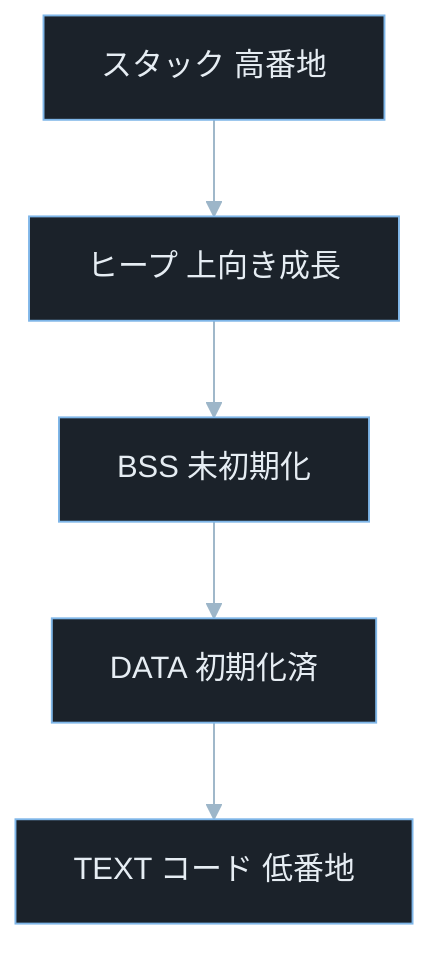
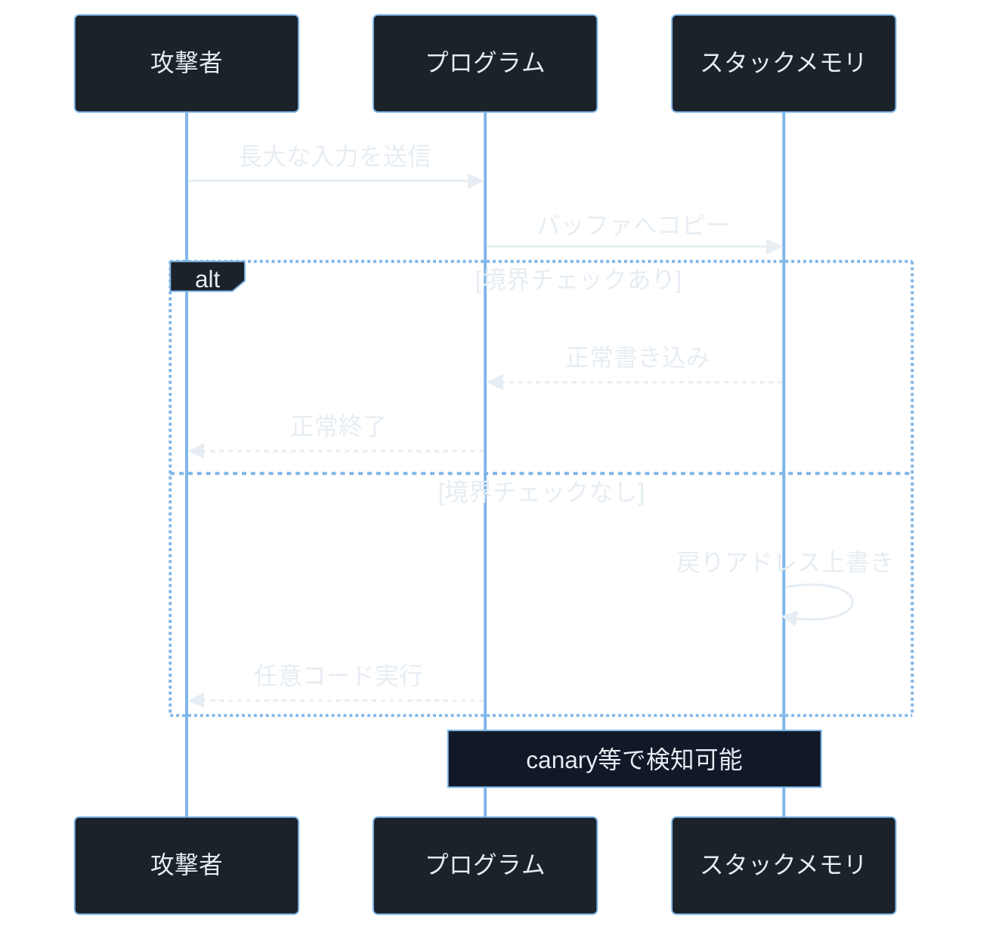

## TL;DR

- プログラムが起動するとメモリはテキスト・BSS・ヒープ・スタックの 4 領域に分割され、それぞれ役割が違う。
- スタックはサイズが固定で境界チェックがないと隣のデータを上書きでき、関数の戻りアドレスを書き換えると攻撃者が制御フローを奪える（バッファオーバーフロー）。
- ヒープは動的確保・解放の管理が複雑なため、解放後のポインタ参照（Use-After-Free）や初期化忘れによる情報漏洩が起きやすい。

> **本記事で前提とする用語の超ざっくり整理**
> - **スタック**: 関数が呼ばれるたびに積み重なる作業メモリ。LIFO（後入れ先出し）構造。
> - **ヒープ**: プログラムが動的に好きなサイズで確保・解放できるメモリ領域。`malloc` / `new` / `ctypes` などで使う。
> - **BSS**: 初期化されていないグローバル変数や静的変数が置かれる領域。プログラム起動時に OS が 0 で埋める。
> - **テキストセグメント**: プログラムの機械語命令（コード）が格納される読み取り専用領域。
> - **バッファオーバーフロー**: 配列やバッファの境界を超えてデータを書き込む脆弱性。スタック上で起きると戻りアドレスを破壊できる。
> - **CTF**: Capture The Flag。セキュリティコンテスト。Pwn カテゴリでは主にバッファオーバーフローを使う。
> - **Pwn**: CTF 用語で「プログラムの脆弱性を突いて制御を奪う」カテゴリ。
> - **シェルコード**: 攻撃者がメモリに送り込む小さな機械語コード。`/bin/sh` を起動するものが典型的。

---

## なぜ重要か

ペネトレーションテスト（合法的な侵入テスト）や CTF の Pwn カテゴリを理解するには、プログラムがメモリをどう使うかを知ることが避けられない。

「バッファオーバーフロー」という言葉は知っていても、**なぜ戻りアドレスを書き換えると任意のコードが実行できるのか**を説明できる人は少ない。その理由はスタックの構造にある。「ヒープ上でシェルコードを実行する」と聞いたとき、ヒープとスタックの違いが分からなければ攻撃のメカニズムを追えない。

実際の CVE（脆弱性識別番号。後述）を読んでいると、記述の中に必ず「スタックオーバーフロー」「ヒープコラプション」「BSS セクションへの書き込み」といった用語が出てくる。これらを感覚的に理解しているかどうかが、攻撃者視点と防御者視点の両方を持てるかどうかの分水嶺だ。

---

## 仕組み

### プログラムのメモリレイアウト

プロセス（実行中のプログラム）が起動すると、OS がメモリ空間を確保し、大きく 4 つの領域（セグメント）に分割する。

> **セグメントとは**: メモリを役割ごとに区切ったブロックのこと。「どのデータをどこに置くか」を決める仕切りだと思えばよい。

この図は、メモリアドレスを縦に並べたときの典型的なレイアウトを示している。上が高アドレス（数字が大きい）、下が低アドレス（数字が小さい）だ。



各セグメントの役割は次の通りだ。

- **TEXT（テキストセグメント）**: プログラムの機械語命令（コード）が置かれる。読み取り専用。誤って上書きしようとすると Segmentation Fault（セグフォ）になる。
- **DATA（データセグメント）**: 初期値ありのグローバル変数が置かれる。例: `int x = 42;`（グローバルスコープで定義）
- **BSS（Block Started by Symbol）**: 初期値なしのグローバル変数・静的変数が置かれる。OS が起動時に 0 で埋める。例: `static int count;`
- **ヒープ**: `malloc()`（C）、`new`（C++/Java）、Python の `bytearray` など、プログラムが動的に確保・解放するメモリ。低アドレス方向から高アドレス方向に向けて成長する。
- **スタック**: 関数の呼び出しに使われる領域。引数・ローカル変数・戻りアドレスが積まれる。高アドレスから低アドレス方向に向けて成長する（ヒープと逆方向）。

> **Segmentation Fault（セグフォ）とは**: アクセスしてはいけないメモリ領域に触れたとき OS が強制終了させるエラー。略して「セグフォ」と呼ぶ。CTF で「セグフォが出た」は「境界を超えた証拠」を意味することが多い。

### スタックの詳細構造

関数 `func()` が呼ばれると、スタック上に「スタックフレーム」と呼ばれるひとまとまりのブロックが積まれる。

スタックフレームには次の情報が含まれる（上から低アドレス方向へ）。

- **ローカル変数**: 関数内で宣言した変数
- **保存レジスタ**: 呼び出し元の状態を保持する値
- **戻りアドレス（リターンアドレス）**: 関数が終わった後にどこへ戻るかのアドレス
- **引数**: 呼び出し元が渡した値

> **戻りアドレス（リターンアドレス）とは**: `func()` の呼び出しが終わった後、プログラムが「次に実行すべき命令のアドレス」を記録した値。スタック上の固定された位置に保存されているため、バッファがこの位置まで溢れると上書きできてしまう。

**バッファオーバーフローの仕組み**: ローカル変数として確保したバッファ（例: `char buf[64]`）に 64 バイトを超えるデータを書き込むと、隣接するスタック領域が上書きされる。書き込みが続くと戻りアドレスにまで到達し、攻撃者が好きなアドレスに書き換えられる。

### ヒープの管理構造

ヒープはスタックと違い、プログラムが任意のタイミングで確保・解放を繰り返す。確保した領域を使い終わったら「解放（`free()`）」するが、解放後のポインタをそのまま使い続けると**Use-After-Free（UAF）** という脆弱性になる。

> **ポインタとは**: メモリのアドレスを格納した変数。「住所が書かれたメモ」のようなもの。そのアドレスが指す場所が解放されても、ポインタ自体は古いアドレスを持ち続ける（ダングリングポインタ）。

### 攻撃フロー — スタックバッファオーバーフロー

この図は「境界チェックがないプログラムに大量の入力を送ると何が起きるか」と「境界チェックがある場合との違い」を示している。



> **スタックカナリア（canary）とは**: コンパイラが自動的にスタックフレームに埋め込む「見張り値」。バッファオーバーフローが起きると戻りアドレスより先にカナリアが上書きされるため、関数終了時にカナリアの値が変わっていたら攻撃を検出できる仕組み。炭鉱のカナリア（有毒ガスを先に検知する）が語源。

---

## 脆弱なコード例

> 本記事の攻撃例は学習環境・CTF・明示的に許可された検証環境のみで実施してください。
> 実システムへの無断検証は不正アクセス禁止法や各国法令、利用規約違反となる可能性があります。

### PHP — unserialize() によるヒープ上のオブジェクト注入

```php
<?php
class Config {
    public string $path = "/etc/app/config.json";

    public function load(): string {
        return file_get_contents($this->path);
    }
}

$data = $_GET['data'] ?? '';
$obj = unserialize($data);

if ($obj instanceof Config) {
    echo $obj->load();
}
```

> **`$_GET['data']`**: PHP で URL のクエリパラメータ（例: `?data=xxx`）の値を取り出す書き方。攻撃者がブラウザから自由な値を送れる。
> **`unserialize()`**: PHP でシリアライズされた（文字列化された）データをオブジェクトに復元する関数。ヒープ上に PHP オブジェクトを生成するため、細工したシリアライズ文字列を渡すと意図しないオブジェクトを復元させられる。

**問題点:** 攻撃者は `$path` を `/etc/passwd` に書き換えた Config オブジェクトをシリアライズして `?data=` に渡すことができる。`unserialize()` はヒープ上にオブジェクトを復元するとき、`$path` の値もそのまま復元するため、任意ファイルが読まれる。

細工したペイロードの例:

```bash
php -r 'echo serialize((function(){$c=new stdClass;$c->path="/etc/passwd";return $c;})());'
```

> **`stdClass`**: PHP の汎用オブジェクト。プロパティを自由に追加できる。攻撃者はこれを Config オブジェクトに見せかけたシリアライズ文字列を手動で作成する。

---

### Node.js — Buffer.allocUnsafe() によるヒープ情報漏洩

```javascript
const http = require('http');

http.createServer((req, res) => {
    const size = parseInt(req.url.slice(1)) || 64;

    const buf = Buffer.allocUnsafe(size);

    res.writeHead(200);
    res.end(buf);
}).listen(3000);
```

> **`Buffer.allocUnsafe(size)`**: Node.js でヒープ上に `size` バイトのバッファを確保する関数。**初期化なし**でメモリを返すため、直前に別の処理が使っていたヒープデータがそのまま残っている可能性がある。`Buffer.alloc(size)` はゼロ初期化するが、`allocUnsafe` はゼロ初期化をスキップして高速化している。

**問題点:** クライアントが `http://server/1024` にアクセスすると、1024 バイトの未初期化ヒープメモリがレスポンスとして返る。このデータには直前の HTTP リクエスト・セッショントークン・パスワード断片が含まれる可能性がある。これはかつて Node.js 本体に存在した実際の問題だ（GHSA-c4w7-xm78-47vh）。

```bash
curl http://localhost:3000/256 | xxd | head -5
```

> **`xxd`**: バイナリデータを 16進数ダンプで表示するコマンド（hex dump の略）。`| xxd` で直前のコマンドの出力をバイト単位で見られる。`| head -5` は先頭 5 行だけ表示。

安全な書き方:

```javascript
const buf = Buffer.alloc(size);
```

---

### Python — ctypes によるヒープの任意アドレス読み取り

```python
import ctypes

secret = "password: hunter2"

addr = id(secret)

raw = ctypes.string_at(addr, 128)
print("ヒープダンプ:", raw.hex())
```

> **`ctypes`**: Python から C 言語の関数やメモリ操作を直接呼び出すための標準ライブラリ。通常 Python は GC（ガベージコレクション）とサンドボックスで保護されるが、`ctypes` を使うと C レベルでメモリに直接アクセスできる。
> **`id(obj)`**: Python でオブジェクトのメモリアドレスを取得する関数。CPython 実装では `id()` がそのままオブジェクトのアドレスになる。
> **`ctypes.string_at(addr, n)`**: 指定したメモリアドレスから `n` バイトを読み取る。C の `memcpy` に相当する危険な操作。

**問題点:** `ctypes.string_at()` は Python のサンドボックスを無視して任意アドレスのメモリを読む。`id(secret)` が返すアドレスには `secret` 文字列の内容が格納されているため、`password: hunter2` がダンプに含まれる。

Web サーバーがユーザー入力をアドレスとして受け付け `ctypes.string_at()` に渡すような実装があれば、ヒープ全体を読まれるリスクがある。

---

## 実践例 / 演習例

### Python でスタックフレームを覗く

```python
import inspect

def inner():
    frame = inspect.currentframe()
    caller = frame.f_back
    print("呼び出し元の関数名:", caller.f_code.co_name)
    print("呼び出し元のローカル変数:", caller.f_locals)

def outer():
    secret_local = "top_secret_value"
    inner()

outer()
```

> **`inspect.currentframe()`**: Python の実行フレーム（スタックフレームに対応）を取得する標準ライブラリ関数。`f_back` で一つ上のフレーム（呼び出し元）を参照できる。`f_locals` でそのフレームのローカル変数が読める。

実行すると `inner()` から `outer()` の `secret_local` の値が読めることが確認できる。フレームに格納されたローカル変数は、呼び出しスタック上のどのフレームからでも理論上アクセスできることを示す演習だ。

### /proc/[PID]/maps でメモリレイアウトを確認する

Linux では動作中のプロセスのメモリマップを次のコマンドで確認できる。

```bash
cat /proc/self/maps | head -20
```

> **`/proc/self/maps`**: Linux の `/proc` 仮想ファイルシステム（プロセス情報を提供するファイルシステム）が提供するファイル。`self` は現在実行中のプロセス自身を指す。各行に「アドレス範囲・パーミッション・マッピング元ファイル」が表示される。
> **`/proc/[PID]/maps`** の `[PID]` はプロセス ID（Process Identifier）に置換する。例: `/proc/1234/maps`

出力例の見方:

```
7ffce4000000-7ffce4021000 rw-p 00000000 00:00 0  [stack]
7f8b2c000000-7f8b2c200000 rw-p 00000000 00:00 0  [heap]
```

- 左端の 16進数 2つがアドレス範囲
- `r`（読取）`w`（書込）`x`（実行）`p`（プライベート）がパーミッション
- 末尾の `[stack]` や `[heap]` がセグメントの種類

### GDB でスタックフレームを解析する

```bash
gdb ./target_binary
(gdb) break main
(gdb) run
(gdb) info frame
(gdb) x/32xw $rsp
```

> **GDB**: GNU Debugger。Linux でバイナリを動的解析する標準デバッガ。CTF の Pwn カテゴリでは必須ツール。
> **`x/32xw $rsp`**: メモリダンプコマンド。`x` は examine（調べる）、`/32xw` は「32 個・16進形式・4バイト単位」で表示、`$rsp` はスタックポインタ（現在のスタックトップを指すレジスタ）。

---

## 防御策

### 1. 境界チェックの徹底（スタック対策）

C / C++ 以外のほぼすべての言語はランタイムが境界チェックを自動で行うが、`ctypes` や Node.js の `Buffer` など低水準 API を使うときは明示的にチェックが必要だ。

```python
def safe_read(addr: int, size: int, max_size: int = 256) -> bytes:
    if size <= 0 or size > max_size:
        raise ValueError(f"不正なサイズ: {size}")
    return ctypes.string_at(addr, size)
```

### 2. ゼロ初期化の徹底（ヒープ情報漏洩対策）

Node.js では必ず `Buffer.alloc()` を使う。`Buffer.allocUnsafe()` は高速だが本番コードには使わない。

```javascript
const buf = Buffer.alloc(size);
```

PHP では `unserialize()` をユーザー入力に対して**絶対に使わない**。代わりに `json_decode()` を使い、受け取った後に型・値を検証する。

```php
<?php
$json = $_GET['data'] ?? '{}';
$data = json_decode($json, true);

if (!is_array($data) || !isset($data['path'])) {
    http_response_code(400);
    exit;
}

$allowed = ['/etc/app/config.json'];
if (!in_array($data['path'], $allowed, true)) {
    http_response_code(403);
    exit;
}

echo file_get_contents($data['path']);
```

### 3. コンパイラ・OS レベルの保護機構を有効化

C / C++ でコードを書く場合（または低水準ライブラリを使う場合）は以下の保護を有効化する。

- **スタックカナリア** (`-fstack-protector-strong`): 戻りアドレスの前にカナリア値を置き、上書きを検出する。
- **ASLR**（Address Space Layout Randomization）: OS レベルで各セグメントのベースアドレスをランダム化し、攻撃者がアドレスを予測できなくする。

> **ASLR とは**: プログラムを起動するたびにスタック・ヒープ・ライブラリの配置アドレスをランダムに変える OS の機能。同じバイナリでも実行のたびにアドレスが変わるため、攻撃者がハードコードしたアドレスに飛べなくなる。

```bash
cat /proc/sys/kernel/randomize_va_space
```

> 出力が `2` なら ASLR が完全に有効。`0` なら無効（脆弱な状態）。CTF でまず確認するコマンドだ。

- **NX ビット / DEP**（Non-Executable bit / Data Execution Prevention）: スタックやヒープ上のデータを「実行不可」にする。シェルコードをバッファに書き込んでも、実行しようとすると OS が拒否する。

> **NX ビット**: CPU レベルでメモリページを「実行可能かどうか」フラグで管理する機能。AMD では XD（eXecute Disable）、Intel では XD もしくは NX と呼ぶ。

---

## 実演ラボ案内

### Hack The Box

推奨学習順: Linux Fundamentals → Introduction to Binary Exploitation → Pwn カテゴリ

- **Starting Point**: まず Linux コマンドラインに慣れる。`/proc/[PID]/maps` を見る練習はここで。
- **Challenges — Pwn カテゴリ**: `ret2win`（戻りアドレスを特定の関数に向ける）系問題でスタックオーバーフローを体験できる。

### TryHackMe

- **Buffer Overflow Prep モジュール**: 実際に脆弱なバイナリを渡されて、Immunity Debugger でオフセットを計算する実習がある。
- **Intro to x86-64**: スタックフレームの構造をアセンブリレベルで確認できる。

### 自宅 VM（合法環境）

ASLR を一時的に無効にして（検証専用 VM のみ）スタックオーバーフローを体験できる。

```bash
echo 0 | sudo tee /proc/sys/kernel/randomize_va_space

python3 -c "print('A' * 200)" | ./vulnerable_program
```

> **`tee`**: コマンドの出力をファイルに書き込むと同時に標準出力にも流すコマンド。`echo 0 | sudo tee /proc/sys/kernel/randomize_va_space` は root 権限でカーネルパラメータを変更している。

---

## よくある誤解

**誤解 1: 「Python や PHP はメモリ安全だからバッファオーバーフローは関係ない」**
Python や PHP のランタイム自体は C で書かれており、`ctypes`・C 拡張・unserialize などを経由してメモリ脆弱性が発生する。ランタイムが安全でもその上で動く API の使い方次第でリスクが生まれる。

**誤解 2: 「スタックとヒープの違いは速さだけ」**
速さの違いは副産物だ。本質的な違いは「管理方法」だ。スタックはコンパイラが自動管理（関数が終わると自動解放）、ヒープはプログラマが手動で確保・解放を管理する。この「手動管理」が Use-After-Free や Double-Free などのバグを生む。

**誤解 3: 「ASLR があればバッファオーバーフローは無効化される」**
ASLR はアドレスをランダム化するが、情報漏洩があってアドレスがリークした場合は突破できる。また 32 ビット環境ではランダム性が低くブルートフォースが現実的な時間で成立する。ASLR は有効な対策のひとつだが、単独では完全防御にならない。

**誤解 4: 「BSS と DATA の違いはどうでもいい」**
攻撃者視点では「書き込める BSS 変数が関数ポインタの隣に配置されているか」が重要になる。コンパイラがどの変数をどのセグメントに置くかを理解することで、攻撃のターゲットを絞れる。

**誤解 5: 「Buffer.allocUnsafe() は単に少し速いだけ」**
名前に `Unsafe` とある通り、**情報漏洩のリスクがある**。ヒープの未初期化領域には前のリクエストで扱ったパスワードやトークンが残っていることがある。本番環境では `Buffer.alloc()` を使う。

---

## 関連 CVE と被害事例

> **CVE とは**: Common Vulnerabilities and Exposures の略。世界共通の脆弱性識別番号。
> **CVSS スコア**: 脆弱性の深刻度を 0.0〜10.0 で評価した指標。9.0 以上が Critical。

**CVE-2021-3156（sudo Baron Samedit）**
sudo のヒープベースバッファオーバーフロー脆弱性。`sudoedit` のバックスラッシュ処理でヒープに想定外のデータが書き込まれ、ローカルユーザーが root 権限を取得できた。CVSS スコア 7.8。本記事との関連: ヒープバッファオーバーフロー

**CVE-2021-33909（Sequoia）**
Linux カーネルの仮想ファイルシステム `seq_file` において、非常に長いパスを作成したときにスタックバッファが溢れる脆弱性。`size_t`（符号なし整数）を `int`（符号付き整数）に変換する際の切り捨てが原因でスタックの境界を超え、ローカル権限昇格が可能だった。CVSS スコア 7.8。本記事との関連: スタックオーバーフロー・整数型変換

**CVE-2022-0185（Linux カーネル heap out-of-bounds write）**
`fsconfig()` システムコールの `legacy_parse_param()` でサイズ検証が不十分なままヒープへの書き込みが発生し、コンテナ環境からホスト OS への権限昇格が可能になった。CVSS スコア 8.4。本記事との関連: ヒープ境界外書き込み

---

## 次に学ぶべき記事

- **スタックバッファオーバーフロー実践 — ret2win から ROP チェーンまで** — 本記事で学んだスタック構造を使い、実際に CTF の Pwn 問題を解く
- **Use-After-Free 完全解説** — ヒープの動的管理の仕組みと、解放後のポインタ参照がどう悪用されるかを深掘りする
- **ASLR / NX / PIE のバイパス技法** — 各種保護機構の弱点と、情報漏洩を組み合わせた現代的な攻撃手法を理解する

---

## 参考文献

- OWASP Foundation. "Buffer Overflow". https://owasp.org/www-community/vulnerabilities/Buffer_Overflow
- NVD. "CVE-2021-3156 Detail". https://nvd.nist.gov/vuln/detail/CVE-2021-3156
- NVD. "CVE-2021-33909 Detail". https://nvd.nist.gov/vuln/detail/CVE-2021-33909
- NVD. "CVE-2022-0185 Detail". https://nvd.nist.gov/vuln/detail/CVE-2022-0185
- Qualys Security Advisory. "Sequoia: A Local Privilege Escalation Vulnerability in Linux". https://www.qualys.com/2021/07/20/cve-2021-33909/sequoia-local-privilege-escalation-linux.txt
- Node.js Foundation. "Buffer.allocUnsafe() Security Considerations". https://nodejs.org/api/buffer.html#static-method-bufferallocunsafesize
- Linux man-pages. "proc(5) — /proc filesystem". https://man7.org/linux/man-pages/man5/proc.5.html
