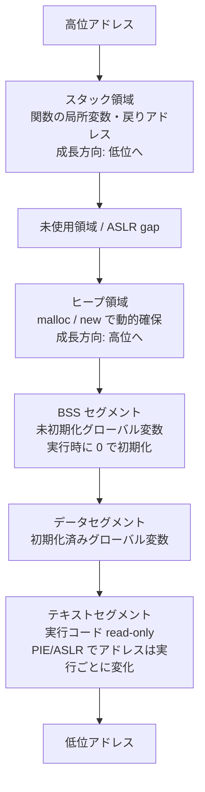
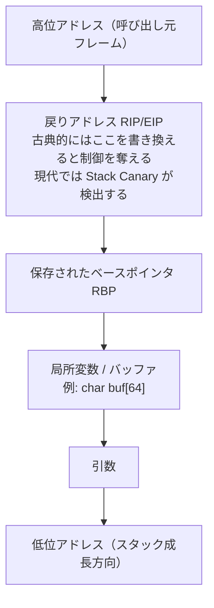

## TL;DR

- プロセスのメモリは **テキスト・データ・BSS・ヒープ・スタック** の 5 領域に分かれており、それぞれ役割と境界がある。
- **スタック** は関数呼び出しの記録場所で、古典的には境界を超えて書き込むと戻りアドレスを書き換えられる（現代環境では Stack Canary・ASLR・NX が防御する）。
- **ヒープ** は動的に確保する領域で、管理ミスが Use-After-Free や Heap Overflow の原因になる。

---

## なぜ重要か

セキュリティエンジニアが「メモリの構造」を知らないと、脆弱性レポートに書かれた次のような文章を理解できない。

```
stack-based buffer overflow in function process_input()
heap use-after-free in libssl
BSS segment overwrite via uninitialized global
```

メモリモデルを知ることで：

| 知識 | 活用場面 |
|------|----------|
| スタックの構造 | バッファオーバーフローの原因理解 |
| ヒープの仕組み | Use-After-Free / Heap Spray の理解 |
| BSS / データ領域 | グローバル変数汚染の理解 |
| テキスト領域 | コード注入・ROP チェーンの前提知識 |
| 領域ごとのアクセス権 | セグメンテーションフォルトの読み方 |

この記事で「なぜその脆弱性が起きるか」を構造レベルで説明できるようになる。

---

## 仕組み

### 1. プロセスメモリの全体像

Linux でプログラムを起動すると、カーネルがプロセスに **仮想アドレス空間** を割り当てる。その内部は以下の 5 つの領域に分かれている。



```
高位アドレス
┌──────────────────────────┐
│        スタック          │ ← 関数呼び出しのたびに成長（低位方向）
├──────────────────────────┤
│    （未使用領域 / MMAP）  │
├──────────────────────────┤
│        ヒープ            │ ← malloc で動的確保（高位方向に成長）
├──────────────────────────┤
│     BSS セグメント       │ ← 未初期化グローバル変数（実行時に 0）
├──────────────────────────┤
│    データセグメント       │ ← 初期化済みグローバル変数
├──────────────────────────┤
│    テキストセグメント     │ ← 実行コード（read-only）
└──────────────────────────┘
低位アドレス
```

実際のアドレスは `/proc/[PID]/maps` で確認できる。

```bash
# 自分のシェルプロセスのメモリマップを見る
cat /proc/$$/maps | head -20
```

---

### 2. テキストセグメント（`.text`）

**役割**: コンパイル済みの機械語命令列を格納する。

- アクセス権: **read + execute のみ**（書き込み不可）
- なぜ read-only か: 実行中のコードを自分自身が書き換えないようにする保護
- `NX bit`（No-eXecute）でスタック/ヒープの実行を防ぐ現代のセキュリティ機構はここに起源がある
- **PIE（Position Independent Executable）と ASLR が有効な場合、テキストセグメントのアドレスも実行ごとにランダム化される**。静的なアドレスを前提にした攻撃はこれにより困難になる

```bash
# ELF バイナリのセクション情報を確認
readelf -S /bin/ls | grep -E '\.text|\.rodata'
# → .text  PROGBITS  ... AX（Allocate + eXecute）
```

---

### 3. データセグメント（`.data`） と BSS（`.bss`）

| 領域 | 内容 | 例 |
|------|------|-----|
| `.data` | **初期化済み**グローバル変数・静的変数 | `int g = 42;` |
| `.bss` | **未初期化**グローバル変数・静的変数 | `int g;`（実行時に 0） |

BSS は "Block Started by Symbol" の略。バイナリサイズを削減するため、未初期化変数の実際の 0 値はバイナリに埋め込まず、ローダーが実行時に書き込む。

セキュリティ上の注意点: **未初期化変数を初期値 0 だと思い込んだコードが、初期化忘れによりゴミ値を読むバグ** は C/C++ で頻出。

---

### 4. ヒープ（Heap）

**役割**: 実行時に動的確保するメモリ領域。`malloc` / `new` / `mmap` がここに確保する。

- ヒープは **低位 → 高位方向** に成長する
- 解放（`free`）した領域は再利用される → **断片化**が起きる
- 管理は `glibc` の `ptmalloc2`（Linux）が担う

重要な概念：

```
確保: malloc(n) → ヒープ上にチャンクを割り当て、ポインタを返す
解放: free(ptr) → チャンクを解放リストに戻す
問題: free 後にポインタを使い続ける → Use-After-Free（発展）
     同じポインタを 2 回 free → Double-Free（発展）
     割り当てサイズを超えて書き込む → Heap Overflow（発展）
```

これらの攻撃手法の詳細は後続の「ヒープ攻撃入門」で扱う。

---

### 5. スタック（Stack）

**役割**: 関数呼び出しの情報（戻りアドレス・局所変数・引数）を積み重ねる領域。

- スタックは **高位 → 低位方向** に成長する（ヒープと逆）
- 関数を呼ぶたびに **スタックフレーム** が積まれ、return で取り除かれる



スタックフレームの構造（x86-64 の例）：

```
高位アドレス
┌────────────────┐ ← 呼び出し元のスタックフレーム
│  戻りアドレス   │ ← return 後にジャンプする先（RIP）
│  保存 RBP      │ ← 呼び出し元のベースポインタ
│  局所変数      │ ← char buf[64] などがここに置かれる
│  （パディング） │
└────────────────┘ ← 呼び出し先の RSP（スタックポインタ）
低位アドレス
```

**バッファオーバーフローの原因**: `buf[64]` に 65 バイト以上書き込むと、上位にある戻りアドレスを上書きできる。これがスタックベースのバッファオーバーフローだ。詳細は後続の「バッファオーバーフロー入門」で扱う。

---

## 脆弱なコード例（PHP / Node.js / Python）

### PHP — `extract()` による変数注入（グローバル変数汚染の概念）

> **C の .bss との関係**: C では未初期化グローバル変数が `.bss` セグメントに置かれ実行時に 0 で埋められる。PHP の変数モデルは C と別概念だが、「初期化されていない変数をそのまま権限判定に使う」という設計ミスは共通のアンチパターンだ。以下は PHP で **実際に認証バイパスが成立する**具体例を示す。

```php
<?php
/**
 * 脆弱なコード例: extract() による変数注入
 *
 * PHP の extract() は連想配列のキーをそのまま変数名として展開する。
 * 外部入力をそのまま渡すと、攻撃者が任意の変数を上書きできる。
 * 実際に PHP アプリで発見されてきた認証バイパスパターン。
 *
 * 注意: 未定義変数参照は PHP 8.x で Warning を発生させる。
 *       文脈によって null 相当として扱われることがあるが、
 *       それ自体を脆弱性として利用する方法は extract() 等の方が典型的。
 */

// ❌ 脆弱: $_GET / $_POST を extract() に直接渡している
function auth_vulnerable(array $params): string {
    $is_admin = false;  // 安全な初期値のつもり

    // extract() は $params のキーをそのまま変数名に展開する
    // 攻撃者が $params["is_admin"] = true を渡すと $is_admin が上書きされる
    extract($params);   // ← これが問題

    if ($is_admin) {
        return "管理者パネルへようこそ";
    }
    return "一般ユーザー";
}

// 正常なリクエスト
echo auth_vulnerable(["username" => "alice"]) . "\n";
// → 一般ユーザー

// 攻撃: is_admin=true を注入（GETパラメータ ?is_admin=1 相当）
echo auth_vulnerable(["username" => "eve", "is_admin" => true]) . "\n";
// → 管理者パネルへようこそ  ← バイパス成立

// ✅ 安全: extract() を使わず、必要なキーだけ明示的に取り出す
function auth_safe(array $params): string {
    $is_admin = false;  // 必ず初期化
    $username = $params["username"] ?? "anonymous";  // キーを明示指定

    // is_admin は外部入力から絶対に受け取らない
    // 必要なら DB から取得してセット
    if ($username === "alice_admin") {
        $is_admin = true;
    }

    if ($is_admin) {
        return "管理者パネルへようこそ";
    }
    return "一般ユーザー";
}

echo auth_safe(["username" => "alice_admin"]) . "\n";  // → 管理者パネルへようこそ
echo auth_safe(["username" => "eve", "is_admin" => true]) . "\n";  // → 一般ユーザー
?>
```

> **なぜこうなるか**: `extract()` は「配列のキー名 = 変数名」として展開するため、攻撃者が `is_admin` というキーを送れば既存の変数を上書きできる。同様のパターンが `$$varname`（可変変数）にも存在する。`extract()` への外部入力は PHP セキュリティの古典的禁忌だ。

---

### Node.js — ヒープ上の未初期化バッファによる情報漏洩

```javascript
/**
 * 脆弱なコード例: Buffer.allocUnsafe() による情報漏洩
 *
 * Node.js の Buffer.allocUnsafe(n) はヒープ上の未初期化領域を返す。
 * 以前のプロセスデータ（パスワード・トークン等）が混入する可能性がある。
 * これが safe-buffer パッケージが生まれた背景。
 *
 * Heartbleed (CVE-2014-0160) との概念的な共通点:
 *   「長さ検証なしに他の領域のメモリを読み取れる」という設計ミス。
 *   ただし Node.js の Buffer API 自体は境界チェックを行うため、
 *   以下は「未初期化領域がそのまま返る」という別種の情報漏洩を示す。
 */

// ❌ 脆弱: allocUnsafe はヒープの未初期化領域をそのまま返す
function createResponse_vulnerable(size) {
    // 初期化されていない → 直前にヒープを使っていたデータが残っている可能性
    const buf = Buffer.allocUnsafe(size);
    return buf;
}

// ✅ 安全: alloc はゼロ初期化してから返す
function createResponse_safe(size) {
    const buf = Buffer.alloc(size);  // 0x00 で埋めてから返す
    return buf;
}

// デモ: 未初期化バッファの内容を確認
const secret = Buffer.from("TOP_SECRET_TOKEN");  // ヒープ上に配置
secret.fill(0);  // 使い終わったつもりでゼロ埋め

const leaked = createResponse_vulnerable(16);
const safe   = createResponse_safe(16);

console.log("allocUnsafe (hex):", leaked.toString('hex'));
// → ゼロの場合も多いが、実行環境によっては残存データが含まれる
console.log("alloc       (hex):", safe.toString('hex'));
// → 0000000000000000000000000000000000000000（保証された安全）

// 長さ検証の重要性（Heartbleed の概念的なデモ）
function heartbeat_concept(payload, requestedLength) {
    // Node.js の Buffer.copy は境界チェックを行うため
    // 実際には payload 範囲外のメモリは読まれない（ゼロ埋めになる）
    // これは「Node.js は安全」という意味ではなく、
    // 「C では起きる問題が高レベル言語では別の形で現れる」ことを示すためのデモ
    const safeLength = Math.min(requestedLength, payload.length);  // ← 正しい対処
    const response = Buffer.alloc(requestedLength);  // ゼロ初期化
    payload.copy(response, 0, 0, safeLength);        // safeLength 分だけコピー
    return response;
}

const payload  = Buffer.from("PING");
const response = heartbeat_concept(payload, 64);
// 不足分は 0x00 埋め（C の実装では隣接メモリが漏れる可能性がある）
console.log("response (hex):", response.toString('hex'));

// ヒープ使用量の確認
const mem = process.memoryUsage();
console.log(`heap used: ${(mem.heapUsed / 1024).toFixed(0)} KB`);
console.log(`heap total: ${(mem.heapTotal / 1024).toFixed(0)} KB`);
```

> **なぜこうなるか**: `Buffer.allocUnsafe()` はパフォーマンスのためゼロ初期化をスキップする。OS がプロセスに割り当てたヒープ領域には直前の操作で使ったデータが残っていることがあり、それがそのまま返ってしまう。Node.js は境界チェックを行うため C の Heartbleed と完全に同じ挙動ではないが、未初期化データが露出するという点で同種のリスクだ。

---

### Python — スタック深度の枯渇と UAF コンセプト

```python
#!/usr/bin/env python3
"""
脆弱なコード例 + 安全なコード例:
再帰によるスタック枯渇と、その防御策

スタックフレームは有限。際限なく積み上げると
CPython は通常 RecursionError を送出して停止する。
極端なケース（C 拡張・OS のスタックサイズ設定）では
SIGSEGV でクラッシュする可能性もある。
"""
import sys

# ─────────────────────────────────────────────
# ❌ 脆弱: 入力値で再帰深度を制御できる関数
# ─────────────────────────────────────────────

def vulnerable_recursive(n: int) -> int:
    """
    攻撃者が n に巨大な値を渡すとスタックを枯渇させられる。
    サービス拒否（DoS）攻撃の典型パターン。
    """
    if n <= 0:
        return 0
    # スタックフレームが積み重なり続ける
    return n + vulnerable_recursive(n - 1)

# ─────────────────────────────────────────────
# ✅ 安全: 再帰深度を上限で制限する
# ─────────────────────────────────────────────

MAX_DEPTH = 500  # 安全な上限（sys.getrecursionlimit() = 1000 の半分以下）

def safe_recursive(n: int, depth: int = 0) -> int:
    """
    depth カウンターで再帰深度を監視し、
    上限を超えたら例外を送出して安全に停止する。
    """
    if depth > MAX_DEPTH:
        raise RecursionError(f"深度上限 {MAX_DEPTH} を超えました: n={n}")
    if n <= 0:
        return 0
    return n + safe_recursive(n - 1, depth + 1)


# ─────────────────────────────────────────────
# メモリレイアウトの観察（教育用）
# ─────────────────────────────────────────────

def show_memory_layout():
    """
    Python オブジェクトのアドレスを観察してメモリ配置を理解する。

    注意: CPython では id() は実装上メモリアドレスに近い値を返すが、
    Python 言語仕様としては保証されていない。実装依存の動作。
    また CPython のオブジェクトはすべてヒープ上に配置される。
    C の .data/.bss との対応はあくまで「概念的な比較」として捉えること。
    """
    # モジュールレベルのオブジェクト（概念上「グローバル」相当、実体はヒープ）
    GLOBAL_VAR = 0xCAFEBABE

    # スタックフレームから参照されるオブジェクト（実体はヒープ上）
    local_a = bytearray(8)
    local_b = bytearray(8)

    # ヒープ上のオブジェクト（明示的に大きく確保）
    heap_obj = bytearray(1024)

    print(f"GLOBAL_VAR id (概念的参照値): {hex(id(GLOBAL_VAR))}")
    print(f"local_a id   (概念的参照値): {hex(id(local_a))}")
    print(f"local_b id   (概念的参照値): {hex(id(local_b))}")
    print(f"heap_obj id  (概念的参照値): {hex(id(heap_obj))}")
    print(f"  ※ id() は CPython 実装依存。言語仕様での保証なし")
    print(f"\nrecursion limit : {sys.getrecursionlimit()}")

    import traceback
    depth = len(traceback.extract_stack())
    print(f"current stack depth: {depth}")


# ─────────────────────────────────────────────
# Use-After-Free の概念（Python での安全なデモ）
# ─────────────────────────────────────────────

def uaf_concept_demo():
    """
    Python では GC があるため本物の UAF は起きないが、
    C 相当の「解放済みポインタへのアクセス」の概念を示す。
    """
    class Node:
        def __init__(self, secret: str):
            self.secret = secret

    obj = Node("PASSWORD_123")
    obj_id = id(obj)
    print(f"[+] 確保: Node at {hex(obj_id)}, secret={obj.secret}")

    del obj  # 解放（C の free 相当）

    # Python では del 後に同名変数でアクセスすると NameError
    try:
        print(obj.secret)  # type: ignore
    except NameError:
        print("[!] Python は解放済み変数へのアクセスを NameError で防ぐ")

    print("→ C/C++ では同アドレスに別データが入り、機密情報が読める可能性がある")


if __name__ == "__main__":
    print("=== メモリレイアウト観察 ===")
    show_memory_layout()

    print("\n=== 再帰深度テスト ===")
    try:
        result = safe_recursive(600)  # 上限 500 を超える
    except RecursionError as e:
        print(f"[!] 安全に停止: {e}")

    result = safe_recursive(100)  # 安全な範囲
    print(f"[+] safe_recursive(100) = {result}")

    print("\n=== UAF コンセプトデモ ===")
    uaf_concept_demo()
```

---

## 実践例 / 演習例

> ⚠️ **注意**: 以下の演習はすべて自分が所有・管理する環境、または HTB / TryHackMe のような **利用規約に明示された合法ラボ** のみで実施すること。許可のない第三者システムへの適用は **不正アクセス禁止法（第 3 条）** に違反する（日本法）。海外在住の読者は各国の法令およびサービス利用規約にも必ず従うこと。

### 演習 1: 自プロセスのメモリマップを読む

```bash
# 実行中プロセスのメモリ領域を確認
cat /proc/$$/maps

# 出力例:
# 55a1b2c3d000-55a1b2c3e000 r--p ... /bin/bash  ← テキスト
# 55a1b2c3e000-55a1b2c4a000 r-xp ... /bin/bash  ← テキスト(実行可)
# 55a1b3f00000-55a1b3f21000 rw-p ... [heap]      ← ヒープ
# 7ffd1234a000-7ffd1234b000 rw-p ... [stack]     ← スタック

# Python でメモリマップを読む
python3 -c "
import os
pid = os.getpid()
with open(f'/proc/{pid}/maps') as f:
    for line in f:
        if any(seg in line for seg in ['heap', 'stack', 'r-xp']):
            print(line.rstrip())
"
```

### 演習 2: GDB でスタックフレームを観察する

```bash
# gdb で簡単なプログラムのスタックを見る（Kali Linux）
cat > /tmp/stack_demo.c << 'EOF'
#include <stdio.h>
#include <string.h>

void inner(char *input) {
    char buf[32];
    strcpy(buf, input);  // ← 脆弱な関数（演習用）
    printf("buf: %s\n", buf);
}

void outer() {
    inner("Hello");
}

int main() {
    outer();
    return 0;
}
EOF

# コンパイル（保護機能を一時的に無効化した演習用バイナリ）
gcc -g -fno-stack-protector -z execstack -o /tmp/stack_demo /tmp/stack_demo.c

# GDB で解析
gdb /tmp/stack_demo << 'GDBEOF'
break inner
run
info frame
x/32xw $rsp
backtrace
quit
GDBEOF
```

### 演習 3: Python でヒープの動的確保を観察する

```python
#!/usr/bin/env python3
"""ヒープ確保・解放のパターンを tracemalloc で観察する"""
import tracemalloc
import sys

tracemalloc.start()

# ヒープに大量確保
chunks = []
for i in range(10):
    chunks.append(bytearray(1024 * 1024))  # 1MB ずつ確保

snapshot1 = tracemalloc.take_snapshot()
print(f"10MB 確保後: {sys.getsizeof(chunks) + sum(sys.getsizeof(c) for c in chunks)} bytes approx")

# 解放
del chunks[::2]  # 偶数インデックスを解放（断片化）

snapshot2 = tracemalloc.take_snapshot()
top_stats = snapshot2.compare_to(snapshot1, 'lineno')

print("\n--- 変化上位 3 件 ---")
for stat in top_stats[:3]:
    print(stat)
```

### 演習 4: HTB / pwntools でスタックを操作する（発展）

```bash
# pwntools のインストール（Kali Linux）
pip3 install pwntools --break-system-packages

# 基本的なスタック操作の確認（ローカルバイナリ）
python3 - << 'EOF'
from pwn import *

# ローカルバイナリの情報取得
binary = ELF('/tmp/stack_demo')
print(f"Architecture : {binary.arch}")
print(f"Entry point  : {hex(binary.entry)}")
print(f"NX enabled   : {binary.nx}")
print(f"PIE enabled  : {binary.pie}")
print(f"Stack canary : {binary.canary}")
EOF
```

---

## 防御策

### 1. スタック保護機能（コンパイラ / OS レベル）

| 機構 | 説明 | 有効化 |
|------|------|--------|
| **Stack Canary** | 戻りアドレスの手前に番兵値を置き、変化を検出 | `gcc -fstack-protector-strong` |
| **ASLR** | メモリ領域のアドレスをランダム化 | `/proc/sys/kernel/randomize_va_space = 2` |
| **NX / DEP** | スタック・ヒープを実行不可に設定 | `gcc -z noexecstack`（デフォルト有効） |
| **PIE** | 実行ファイル本体もランダムアドレスに配置 | `gcc -fPIE -pie` |

```bash
# 現在の ASLR 設定確認
cat /proc/sys/kernel/randomize_va_space
# 0: 無効, 1: 部分的, 2: 完全（推奨）

# バイナリの保護機能を確認
checksec --file=/tmp/stack_demo
```

### 2. 言語レベルの安全策

```python
# ✅ Python: 再帰深度を必ず制限する
import sys
sys.setrecursionlimit(500)  # デフォルト 1000 より保守的に

# ✅ 外部入力のサイズを必ず検証する
def safe_process(data: bytes, max_size: int = 4096) -> bytes:
    if len(data) > max_size:
        raise ValueError(f"入力が上限 {max_size} bytes を超えています")
    return data
```

```javascript
// ✅ Node.js: Buffer のサイズを必ず検証する
function safeRead(buffer, offset, length) {
    if (offset < 0 || length < 0 || offset + length > buffer.length) {
        throw new RangeError(`境界外アクセス: offset=${offset}, length=${length}`);
    }
    return buffer.slice(offset, offset + length);
}

// ✅ Node.js: 必ず Buffer.alloc() を使う（allocUnsafe は使わない）
const safe = Buffer.alloc(64);        // ゼロ初期化保証
// const unsafe = Buffer.allocUnsafe(64);  // ← 未初期化、使わない
```

### 3. ヒープ安全策

- **Use-After-Free 防止**: ポインタを `free` したら即座に `NULL` に設定（C/C++）
- **Double-Free 防止**: 解放済みフラグを変数で管理する
- **境界チェック付き関数を使う**: `strcpy` → `strncpy` / `strlcpy`、`sprintf` → `snprintf`
- **メモリ安全言語を採用**: Rust（所有権システムで UAF を型レベルで防ぐ）

---

## 実演ラボ案内

| プラットフォーム | 推奨コンテンツ | 難易度 |
|---|---|---|
| **HTB Academy** | [Introduction to Binary Exploitation](https://academy.hackthebox.com/module/details/31) | ⭐⭐ |
| **TryHackMe** | [Buffer Overflow Prep](https://tryhackme.com/room/bufferoverflowprep) | ⭐⭐ |
| **TryHackMe** | [Intro to x86-64](https://tryhackme.com/room/introtox8664) | ⭐ |
| **pwn.college** | [Memory Errors](https://pwn.college/system-security/memory-errors/) | ⭐⭐ |
| **自宅 VM** | GDB + pwntools で stack_demo を解析 | ⭐ |
| **LiveOverflow** | YouTube: "Binary Exploitation / Memory Corruption" プレイリスト | ⭐ |

### 自宅 VM でのセットアップ（Kali Linux）

```bash
# 必要ツールをインストール
sudo apt install -y gdb gcc python3 python3-pip binutils
pip3 install pwntools --break-system-packages

# GDB の拡張（peda / pwndbg / gef のいずれか）
# GEF が最もインストールが簡単
bash -c "$(curl -fsSL https://gef.blah.cat/sh)"

# 演習バイナリの保護設定を確認
checksec --file=/tmp/stack_demo
```

---

## よくある誤解

### 誤解 1: 「スタックとヒープは同じもの」

**実際**: 用途・成長方向・管理方法がまったく異なる。スタックは関数呼び出しの記録を **コンパイラが自動管理**し、高位→低位方向に成長する。ヒープはプログラマ（または GC）が **手動で管理**し、低位→高位方向に成長する。混同すると脆弱性の原因分析が根本的にずれる。

### 誤解 2: 「バッファオーバーフローはスタックだけで起きる」

**実際**: **ヒープオーバーフロー**も同様に危険だ。ヒープ上の管理構造（チャンクヘッダ）を破壊すると、`malloc` / `free` の動作を乗っ取り任意コード実行につながる。CVE の分類でも "heap-based buffer overflow" と "stack-based buffer overflow" は区別される。攻撃手法の詳細は後続の「ヒープ攻撃入門」で扱う。

### 誤解 3: 「ASLR があれば BOF は防げる」

**実際**: ASLR はアドレスをランダム化するが、**アドレスリーク** があれば無効化される。また 32bit プロセスでは探索空間が小さいためブルートフォースで突破できる場合もある。ASLR は多層防御の 1 つに過ぎず、Stack Canary・NX・PIE を組み合わせて初めて効果が高まる。

### 誤解 4: 「Python / Node.js はメモリ安全なので関係ない」

**実際**: GC 付き言語でもメモリ関連の脆弱性は存在する。Node.js の `Buffer.allocUnsafe()` は初期化されていないヒープ領域を返し、情報漏洩につながった事例がある（`safe-buffer` パッケージが生まれた背景）。Python の `ctypes` を使えば生メモリを操作でき、C 拡張モジュール経由の脆弱性も報告されている。

### 誤解 5: 「BSS はバイナリサイズに含まれる」

**実際**: BSS セグメントはバイナリファイルには **実データが格納されない**。"この変数が n バイト必要" という情報だけが記録され、実行時にローダーが 0 で埋める。これがバイナリが小さく見える理由の 1 つだ。`size` コマンドで各セクションのサイズを確認できる。

```bash
size /bin/ls
# text    data    bss     dec     hex
# 133930  4824    4696    143450  2305a
```

---

## 関連 CVE と被害事例

| CVE | 脆弱性種別 | メモリ領域 | 概要 |
|-----|-----------|-----------|------|
| **CVE-2014-0160** (Heartbleed) | ヒープ境界外読み取り | ヒープ | OpenSSL の `memcpy` サイズ未検証。秘密鍵・セッショントークンが漏洩。世界中の HTTPS サーバーに影響 |
| **CVE-2021-3156** (Sudo Baron Samedit) | ヒープオーバーフロー | ヒープ | Sudo の引数処理でオフバイワン。root 権限昇格。Linux ほぼ全ディストリに影響 |
| **CVE-2023-0386** (Linux OverlayFS) | 権限ビット不正昇格 | BSS / データ | ファイル権限フラグの検証不足。非特権ユーザーが SUID ファイルを配置可能 |
| **CVE-2017-5638** (Apache Struts) | スタック経由のRCE | スタック | Content-Type ヘッダーのパース処理でコード実行。Equifax 大規模漏洩の原因 |
| **Node.js safe-buffer 問題** | 情報漏洩 | ヒープ | `new Buffer(n)` が未初期化ヒープを返すため、他プロセスのデータが混入する可能性 |

---

## 次に学ぶべき記事

- **[バッファオーバーフロー入門: スタックの仕組み]** — 本記事のスタック知識を攻撃手法に応用
- **[GDB 入門: バイナリデバッグの基礎]** — メモリをリアルタイムで観察するツールの使い方
- **[ヒープ攻撃入門: Use-After-Free と Heap Spray]** — ヒープ管理構造の破壊手法（中級）
- **[Return-Oriented Programming (ROP) 入門]** — NX/DEP を回避する現代的な攻撃手法
- **[2進数・16進数・ビット演算]** — メモリダンプを読むための数値表現の基礎（前提記事）

---

## 参考文献

1. **Intel 64 and IA-32 Architectures Software Developer's Manual Vol. 1 — Chapter 5: Data Types and Addressing Modes**  
   https://www.intel.com/content/www/us/en/developer/articles/technical/intel-sdm.html

2. **Linux man-page: proc(5) — /proc/[pid]/maps**  
   https://man7.org/linux/man-pages/man5/proc.5.html

3. **CVE-2014-0160 (Heartbleed) 詳細**  
   https://heartbleed.com/

4. **CVE-2021-3156 (Baron Samedit) Qualys 解析レポート**  
   https://www.qualys.com/2021/01/26/cve-2021-3156/baron-samedit-heap-based-buffer-overflow-sudo.txt

5. **HTB Academy: Introduction to Binary Exploitation**  
   https://academy.hackthebox.com/module/details/31

6. **pwn.college: Memory Errors**  
   https://pwn.college/system-security/memory-errors/

7. **OWASP: Buffer Overflow**  
   https://owasp.org/www-community/vulnerabilities/Buffer_Overflow

8. **Node.js safe-buffer パッケージ（Buffer 初期化問題への対応）**  
   https://github.com/feross/safe-buffer

9. **不正アクセス行為の禁止等に関する法律（不正アクセス禁止法）第 3 条**  
   https://elaws.e-gov.go.jp/document?lawid=411AC0000000128
