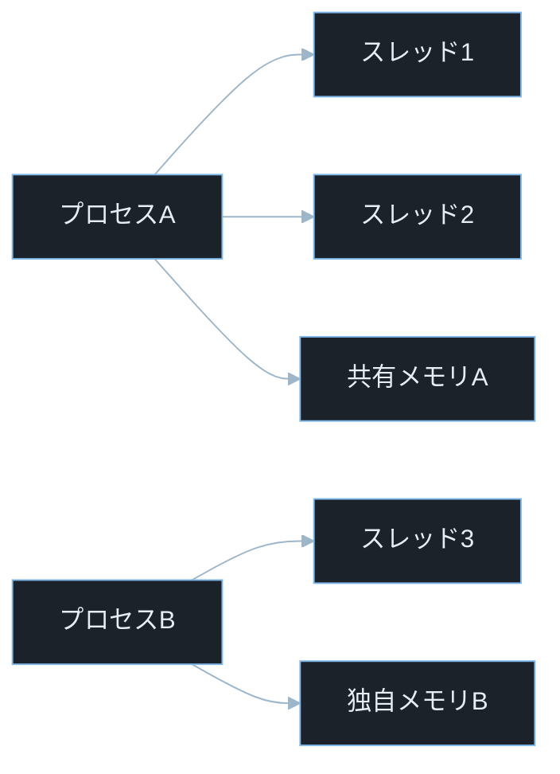
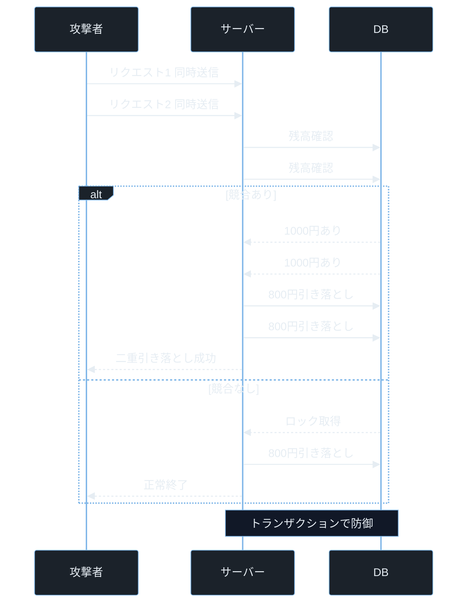

## TL;DR

- プロセスは OS が隔離して管理する実行単位で、プロセス間のメモリは原則として互いに見えない。スレッドはプロセス内の軽量な実行単位で、同じプロセスのスレッド間ではメモリを共有する。
- スレッド間でメモリを共有するため「確認してから操作する」2ステップの間に別スレッドが割り込める——これが競合状態（Race Condition）だ。
- Race Condition は二重引き落とし・ファイル上書き・権限昇格など、セキュリティ上の重大な結果につながる実際の脆弱性カテゴリだ。

> **本記事で前提とする用語の超ざっくり整理**
> - **プロセス**: 実行中のプログラム 1 インスタンス。OS が独立したメモリ空間を割り当てる。
> - **スレッド**: プロセスの中に複数作れる実行の流れ。同じメモリ空間を共有する。
> - **Race Condition（競合状態）**: 複数のスレッド・プロセスが同じリソースに「確認 → 操作」の 2 ステップで触れるとき、その間に別の処理が割り込んで結果が変わる問題。
> - **TOCTOU**: Time-Of-Check Time-Of-Use の略。「確認した時点」と「使う時点」の間にズレが生じる脆弱性。
> - **Mutex（ミューテックス）**: Mutual Exclusion の略。複数スレッドが同時に同じリソースを操作しないよう「鍵」をかける仕組み。
> - **デッドロック**: 2 つのスレッドが互いに相手の鍵が開くのを待ち続けて永久に止まる状態。
> - **CTF**: Capture The Flag。セキュリティコンテスト。Race Condition は Pwn カテゴリや Web カテゴリで頻出。
> - **権限昇格**: 低い権限のユーザーが root など高い権限を不正に取得すること。

---

## なぜ重要か

現代のサーバーは 1 つのリクエストを処理しながら、同時に何百もの別リクエストを並行して処理している。この「並行処理」を実現するのがプロセスとスレッドだ。

セキュリティの文脈でプロセス・スレッドの知識が必要になる場面は多い。

- **Race Condition 脆弱性**: 銀行アプリの二重引き落とし、ファイルアップロードの検証バイパス、コンテナエスケープ
- **プロセス間通信の攻撃**: 共有メモリ・パイプ・ソケットを悪用した情報漏洩
- **タイミング攻撃（Timing Attack）**: 処理時間の差から秘密情報を推測する攻撃
- **フォーク爆弾（Fork Bomb）**: プロセスを爆発的に生成して OS を DoS 状態にする攻撃

`CVE-2022-0847`（Dirty Pipe）・`CVE-2021-4034`（pkexec）・`CVE-2019-5736`（runc）はすべてプロセス・スレッドの仕組みに起因する脆弱性だ。これらの詳細は記事後半で解説する。

---

## 仕組み

### プロセスとスレッドの構造

この図は「プロセスが 2 つある状態」を示している。見るポイントは、プロセスA 内のスレッド 1 と 2 が共有メモリA を持ち合うのに対し、プロセスB の独自メモリB とは完全に隔離されている点だ。



### プロセスの特徴

- **独立したメモリ空間**: プロセスごとに仮想アドレス空間が割り当てられる。プロセスA からプロセスB のメモリを直接読み書きできない。
- **生成コストが高い**: `fork()`（プロセスのコピー）は子プロセスにメモリ空間全体を複製するため、スレッド生成より重い処理になる。
- **プロセス間通信（IPC）が必要**: データをやり取りするには、パイプ・ソケット・共有メモリ・メッセージキューなどの仕組みを使う必要がある。

> **fork() とは**: Unix 系 OS でプロセスを複製して子プロセスを作るシステムコール。親プロセスの完全なコピーが子プロセスとして起動する。Apache HTTP Server などはリクエストごとに `fork()` で子プロセスを生成する。

> **IPC（Inter-Process Communication）とは**: プロセス間通信の略。独立したメモリ空間を持つプロセス同士がデータをやり取りする仕組みの総称。

### スレッドの特徴

- **同一プロセス内でメモリを共有**: ヒープ・グローバル変数・ファイルディスクリプタを全スレッドが参照できる。これが高速な反面、Race Condition の温床になる。
- **生成コストが低い**: メモリ空間を新たに確保しないためプロセスより軽く、数マイクロ秒で生成できる。
- **スタックだけは各スレッド独自**: 各スレッドは独自のスタック（ローカル変数・戻りアドレス）を持つ。ヒープは共有。

> **ファイルディスクリプタとは**: ファイルやソケットなど「開いたリソース」を識別する整数値。0 が標準入力、1 が標準出力、2 が標準エラー。同じプロセスのスレッドはこれを共有するため、あるスレッドが開いたファイルを別スレッドが読み書きできる。

### プロセスとスレッドの比較

- **メモリ共有**: プロセスは「なし（隔離）」、スレッドは「あり（同一プロセス内）」
- **生成コスト**: プロセスは「重い」、スレッドは「軽い」
- **クラッシュの影響**: プロセスは「他プロセスに影響なし」、スレッドは「プロセス全体がクラッシュする可能性あり」
- **通信方法**: プロセスは「IPC 経由」、スレッドは「共有メモリ直接アクセス」
- **セキュリティ境界**: プロセスは「OS が強制隔離」、スレッドは「プログラマが管理する必要あり」

### Race Condition が生まれる仕組み

Race Condition は「確認（Check）」と「操作（Use）」が別々のステップになっているときに起きる。

```
スレッド1: 残高確認 → 残高 = 1000円
スレッド2: 残高確認 → 残高 = 1000円  （← 同時に確認）
スレッド1: 800円引き落とし → 残高 = 200円
スレッド2: 800円引き落とし → 残高 = 200円  （← スレッド1の結果を無視）
```

最終残高は本来 1000 - 800 = 200円にならなければならないが、Race Condition により 1000 - 800 - 800 = -600円が引き落とされてしまう。

### 攻撃フロー — Race Condition による残高操作

この図は「2 つのリクエストが競合してトランザクション保護のない DB から二重引き落としを引き起こす攻撃」と「トランザクション保護がある正しい実装」の違いを示している。



---

## 脆弱なコード例

> 本記事の攻撃例は学習環境・CTF・明示的に許可された検証環境のみで実施してください。
> 実システムへの無断検証は不正アクセス禁止法や各国法令、利用規約違反となる可能性があります。

### PHP — TOCTOU によるファイル上書き脆弱性

```php
<?php
session_start();
$user_id = $_SESSION['user_id'] ?? 'unknown';
$upload_dir = '/var/www/uploads/';
$filename = $upload_dir . basename($_POST['filename'] ?? 'file.txt');

if (!file_exists($filename)) {
    file_put_contents($filename, $_POST['content'] ?? '');
    echo "保存しました: " . htmlspecialchars($filename);
} else {
    echo "エラー: ファイルが既に存在します";
}
```

> **`$_SESSION`**: PHP でセッション変数を取り出す書き方。セッションはサーバー側にユーザーごとのデータを保持する仕組み。
> **`file_exists()`**: ファイルが存在するかどうかを確認する PHP 関数。存在すれば `true`、なければ `false` を返す。
> **`file_put_contents()`**: ファイルにデータを書き込む PHP 関数。ファイルが存在しなければ新規作成する。
> **`htmlspecialchars()`**: HTML 特殊文字をエスケープする関数。XSS 対策で使う。

**問題点（TOCTOU）**: `file_exists()` で「存在しない」と確認してから `file_put_contents()` で書き込むまでの間に、別のリクエストが同じファイル名で書き込む可能性がある。攻撃者が同時に大量リクエストを送ると、本来上書きできないはずのファイルが上書きされる。

また、`basename()` だけでは `../` によるディレクトリトラバーサルを完全には防げない場合がある。

**防御策:**

```php
<?php
session_start();
$upload_dir = '/var/www/uploads/';
$filename = $upload_dir . bin2hex(random_bytes(16)) . '.txt';

$flags = FILE_APPEND | LOCK_EX;
$handle = fopen($filename, 'x');

if ($handle === false) {
    echo "エラー: ファイル作成に失敗しました";
    exit;
}

fwrite($handle, $_POST['content'] ?? '');
fclose($handle);
echo "保存しました";
```

> **`fopen($filename, 'x')`**: `'x'` モードは「ファイルが存在しない場合のみ新規作成して開く」。存在する場合は `false` を返す。`file_exists()` の確認と書き込みが **1 つのアトミックなシステムコール** になるため Race Condition を防げる。

---

### Node.js — 非同期処理の Race Condition による残高二重引き落とし

```javascript
const balances = { user1: 1000 };

async function withdraw(userId, amount) {
    const balance = balances[userId];

    if (balance >= amount) {
        await new Promise(resolve => setTimeout(resolve, 50));

        balances[userId] = balance - amount;
        console.log(`${amount}円引き落とし。残高: ${balances[userId]}円`);
        return { success: true };
    }

    return { success: false, error: "残高不足" };
}

withdraw("user1", 800);
withdraw("user1", 800);
```

> **`async / await`**: JavaScript の非同期処理構文。`await` が付いた行は「非同期処理が完了するまで待つ」が、その間に他の処理が割り込める。Node.js はシングルスレッドだが、`await` の前後でイベントループに制御が戻るため Race Condition が発生する。
> **`setTimeout(resolve, 50)`**: 50 ミリ秒待つ Promise。DB へのクエリのような「非同期待機」を模擬している。

**問題点**: `balance` を読み取った直後に `await` があるため、2 つの `withdraw()` 呼び出しが同じ `balance = 1000` を読んだ後にそれぞれ引き落とす。結果は `1000 - 800 = 200` ではなく、両方 `1000 - 800 = 200` になる（合計 1600 円引き落とし）。

**防御策:**

```javascript
const Mutex = require('async-mutex').Mutex;
const mutex = new Mutex();

async function safeWithdraw(userId, amount) {
    const release = await mutex.acquire();
    try {
        const balance = balances[userId];
        if (balance >= amount) {
            await new Promise(resolve => setTimeout(resolve, 50));
            balances[userId] = balance - amount;
            console.log(`${amount}円引き落とし。残高: ${balances[userId]}円`);
            return { success: true };
        }
        return { success: false, error: "残高不足" };
    } finally {
        release();
    }
}
```

> **Mutex（ミューテックス）**: `mutex.acquire()` で鍵を取得し、`release()` で返すまで他の処理が同じ区間に入れなくなる。`try...finally` で必ず `release()` されるようにするのがポイント。

---

### Python — スレッドの Race Condition と Mutex による修正

```python
import threading
import time

balance = 1000
lock = threading.Lock()

def withdraw_unsafe(amount):
    global balance
    if balance >= amount:
        time.sleep(0.05)
        balance -= amount
        print(f"{amount}円引き落とし。残高: {balance}円")
    else:
        print(f"残高不足。現在の残高: {balance}円")

threads = [
    threading.Thread(target=withdraw_unsafe, args=(800,)),
    threading.Thread(target=withdraw_unsafe, args=(800,)),
]
for t in threads:
    t.start()
for t in threads:
    t.join()
print(f"最終残高: {balance}円")
```

> **`threading.Thread`**: Python の標準ライブラリ `threading` が提供するスレッドクラス。`target` に関数、`args` に引数を渡し、`start()` で起動する。
> **`time.sleep(0.05)`**: 50 ミリ秒スリープ。DB アクセスなど「時間がかかる処理」を模擬している。この間に別スレッドが割り込む。
> **`threading.Lock()`**: Mutex を実現するクラス。`acquire()` で鍵を取得、`release()` で解放する。

**問題点**: `balance >= amount` の確認後に `time.sleep()` で 50ms 待つ間に、もう一方のスレッドも `balance >= amount`（1000 >= 800）を True と判断して実行する。最終残高は 200 円になるはずだが、200 円が 2 回表示される（合計 1600 円引き落とし）。

**防御策:**

```python
import threading
import time

balance = 1000
lock = threading.Lock()

def withdraw_safe(amount):
    global balance
    with lock:
        if balance >= amount:
            time.sleep(0.05)
            balance -= amount
            print(f"{amount}円引き落とし。残高: {balance}円")
        else:
            print(f"残高不足。現在の残高: {balance}円")

threads = [
    threading.Thread(target=withdraw_safe, args=(800,)),
    threading.Thread(target=withdraw_safe, args=(800,)),
]
for t in threads:
    t.start()
for t in threads:
    t.join()
print(f"最終残高: {balance}円")
```

> **`with lock:`**: コンテキストマネージャ構文で Mutex を使う書き方。`with` ブロックを抜けると自動的に `release()` される。例外が発生してもデッドロックを防げる。

---

## 実践例 / 演習例

### Linux でプロセスとスレッドを確認する

```bash
ps aux | head -10
```

> **`ps`**: プロセス状態を表示するコマンド（Process Status の略）。`a` は全ユーザーのプロセス、`u` はユーザー情報付き、`x` は端末なしのプロセスも表示する。

```bash
ps -eLf | grep nginx
```

> **`ps -eLf`**: `-e` は全プロセス、`-L` はスレッドも表示、`-f` はフルフォーマット。`LWP`（Light Weight Process）列がスレッド ID を示す。

```bash
cat /proc/self/status | grep -E "Pid|Threads"
```

> **`/proc/self/status`**: 現在のプロセスの詳細情報を含む仮想ファイル。`Pid` 行でプロセス ID、`Threads` 行でそのプロセスが持つスレッド数を確認できる。

### Race Condition を自分で再現する

HTB / TryHackMe の環境、または自宅 VM で次のスクリプトを使って Race Condition を体験できる。

```python
import threading
import time

counter = 0

def increment():
    global counter
    for _ in range(100000):
        counter += 1

threads = [threading.Thread(target=increment) for _ in range(4)]
for t in threads:
    t.start()
for t in threads:
    t.join()

print(f"期待値: 400000, 実際: {counter}")
```

4 スレッドで 10 万回ずつインクリメントして合計 40 万を期待するが、Race Condition により毎回違う値（例: 347829 など）になる。

### Web の Race Condition を curl で試す

```bash
for i in $(seq 1 20); do
    curl -s -X POST http://localhost/withdraw -d "amount=800" &
done
wait
```

> **`seq 1 20`**: 1 から 20 までの連番を生成するコマンド。
> **`&`（バックグラウンド実行）**: コマンドの末尾に `&` を付けると、結果を待たずに次のコマンドへ進む。20 個のリクエストがほぼ同時に送られる。
> **`wait`**: バックグラウンドで実行した全プロセスが終了するまで待つコマンド。

---

## 防御策

### 1. アトミック操作を使う

「確認」と「操作」を 1 つの分割不可能な操作（アトミック操作）にする。

- **ファイル操作**: `open(filename, 'x')` や `O_CREAT | O_EXCL` フラグで「存在しない場合のみ作成」をアトミックに実現する。
- **DB 操作**: `UPDATE accounts SET balance = balance - 800 WHERE user_id = 1 AND balance >= 800` のように、確認と更新を 1 つの SQL 文にまとめる。
- **キャッシュ操作**: Redis の `SETNX`（Set if Not eXists）・`INCR` などのアトミックコマンドを使う。

### 2. Mutex / ロックで排他制御する

複数スレッドが同じリソースを操作する前に「鍵」を取得させる。

```python
with lock:
    if balance >= amount:
        balance -= amount
```

**デッドロックを避けるポイント**:
- ロックの取得順序を全スレッドで統一する
- `try...finally` や `with` 構文で必ず解放する
- ロックを保持する時間を最小限にする

### 3. DB トランザクションと楽観的ロックを使う

```bash
BEGIN TRANSACTION;
SELECT balance FROM accounts WHERE user_id = 1 FOR UPDATE;
UPDATE accounts SET balance = balance - 800 WHERE user_id = 1 AND balance >= 800;
COMMIT;
```

> **`FOR UPDATE`**: SELECT 文でその行に「書き込みロック」をかける SQL 構文。ロックが取得された行は `COMMIT` か `ROLLBACK` まで他のトランザクションが変更できない。

### 4. プロセス隔離で影響範囲を限定する

重要な処理を別プロセスで実行することで、スレッドのメモリ共有によるリスクを避ける。コンテナ（Docker）や VM 間はプロセス隔離が効いているため、Race Condition による横断的な攻撃が難しくなる。

---

## 実演ラボ案内

### 推奨学習順序

- linux-command-basics（`ps`・`top`・`/proc` の基礎）
- memory-model（プロセスのメモリレイアウト）
- process-and-thread（本記事）
- Race Condition 実践（Web / Pwn 問題）

### Hack The Box

- **Challenges — Web カテゴリ**: Race Condition を使った二重引き落としや重複登録の問題が複数ある。Burp Suite の Repeater でリクエストを並列送信して試せる。
- **Challenges — Pwn カテゴリ**: プロセスの `fork()` 後のメモリ状態を利用した問題（ASLR リーク・親子プロセスのメモリ共有）が出る。

### TryHackMe

- **Linux Fundamentals**: `ps`・`top`・`/proc` ファイルシステムに慣れる。
- **Advent of Cyber**: Race Condition 問題が毎年出題されており、実際に Web アプリへ同時リクエストを送る演習ができる。

### 自宅 VM（合法環境）

```bash
stress --cpu 4 --timeout 60s
top
```

> **`stress`**: CPU・メモリ・I/O に負荷をかけるテストツール。`--cpu 4` は 4 スレッドで CPU ストレス、`--timeout 60s` は 60 秒後に停止。`top` コマンドで並行して動作するプロセスとスレッドをリアルタイム確認できる。

---

## よくある誤解

**誤解 1: 「Node.js はシングルスレッドだから Race Condition は起きない」**
Node.js のメインスレッドはシングルスレッドだが、`await` によって非同期操作の前後でイベントループに制御が戻る。この「制御が戻る瞬間」に別のリクエストが割り込むため Race Condition は発生する。特に残高確認→引き落としのような 2 ステップ処理は危険だ。

**誤解 2: 「プロセスは重いからスレッドを使えばいい」**
スレッドは確かに軽いが、メモリを共有するぶん Race Condition・デッドロック・メモリ破壊のリスクがある。セキュリティ上重要な処理（認証・課金・権限変更）はプロセス隔離のほうが安全な場合が多い。

**誤解 3: 「Mutex を使えば Race Condition はすべて解決する」**
Mutex は正しく使えば有効だが、使い忘れ・ロック粒度の誤り・デッドロックが起きるリスクがある。DB を使う場合はトランザクション（`FOR UPDATE` など）と組み合わせるか、アトミックな SQL 文で一括処理する方が確実だ。

**誤解 4: 「Race Condition は理論上の問題でリアルな攻撃は難しい」**
Burp Suite の「Turbo Intruder」や Python の `threading` モジュールを使えば、数十ミリ秒以内に数百リクエストを並列送信できる。実際に CVE になった Race Condition（後述）の多くは現実の攻撃として悪用されている。

**誤解 5: 「Docker コンテナ間は完全に隔離されている」**
Docker はプロセス隔離（ネームスペース）とファイルシステム隔離（cgroup）を使うが、ホスト OS のカーネルは共有している。`CVE-2019-5736` はこの「カーネル共有」を利用した Race Condition でコンテナからホストへエスケープする脆弱性だ。

---

## 関連 CVE と被害事例

> **CVE とは**: Common Vulnerabilities and Exposures の略。世界共通の脆弱性識別番号。
> **CVSS スコア**: 脆弱性の深刻度を 0.0〜10.0 で評価した指標。7.0 以上が High、9.0 以上が Critical。

**CVE-2022-0847（Dirty Pipe）**
Linux カーネル 5.8 以降のパイプ（プロセス間通信の仕組み）における Race Condition 脆弱性。スプライスとパイプの組み合わせで任意のファイルを上書きでき、ローカルユーザーが root 権限を取得できた。2022 年 3 月に公開され、Dirty COW に並ぶ衝撃を与えた。CVSS スコア 7.8。本記事との関連: プロセス間通信・Race Condition

**CVE-2021-4034（Polkit pkexec 権限昇格）**
Linux の権限昇格ツール `pkexec` における引数処理の Race Condition を含む脆弱性。12 年以上にわたってすべての主要 Linux ディストリビューションに存在し、ローカルユーザーが root 権限を取得できた。CVSS スコア 7.8。本記事との関連: プロセスの TOCTOU・権限昇格

> **pkexec とは**: PolicyKit の一部で、指定したコマンドを別の権限（通常 root）で実行するツール。`sudo` に似た役割を持つ。

**CVE-2019-5736（runc コンテナエスケープ）**
Docker・Kubernetes などで使われるコンテナランタイム `runc` の Race Condition 脆弱性。コンテナ内の攻撃者がホスト上の `runc` バイナリを上書きでき、次回コンテナ起動時にホスト上で任意コードを実行できた。コンテナ技術の根本を揺るがす問題として注目された。CVSS スコア 8.6。本記事との関連: プロセス隔離・Race Condition

---

## 次に学ぶべき記事

- **Race Condition 攻撃の実践 — Burp Suite による並列リクエスト** — 本記事で学んだ理論を使って、実際に Web アプリの Race Condition を Burp Suite で突く
- **Use-After-Free 完全解説** — スレッドのメモリ共有を悪用した解放後の再利用攻撃を深掘りする
- **コンテナ隔離の仕組みと突破技法** — Docker のプロセス隔離（namespace・cgroup）と CVE-2019-5736 のような脱出技法を理解する

---

## 参考文献

- OWASP. "Race Conditions". https://owasp.org/www-community/vulnerabilities/Race_Conditions
- NVD. "CVE-2022-0847 Detail". https://nvd.nist.gov/vuln/detail/CVE-2022-0847
- NVD. "CVE-2021-4034 Detail". https://nvd.nist.gov/vuln/detail/CVE-2021-4034
- NVD. "CVE-2019-5736 Detail". https://nvd.nist.gov/vuln/detail/CVE-2019-5736
- Linux man-pages. "fork(2)". https://man7.org/linux/man-pages/man2/fork.2.html
- Python Docs. "threading — Thread-based parallelism". https://docs.python.org/3/library/threading.html
- Node.js Docs. "The Event Loop". https://nodejs.org/en/docs/guides/event-loop-timers-and-nexttick
