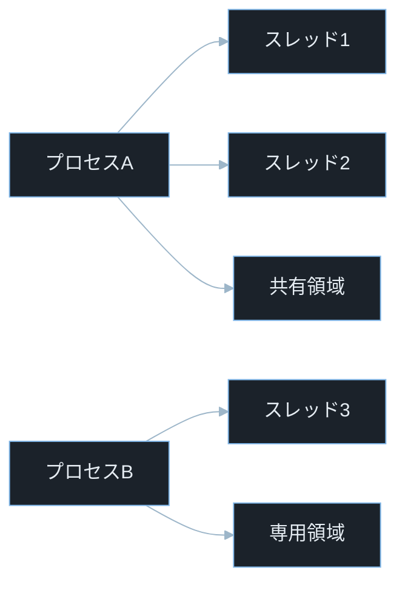
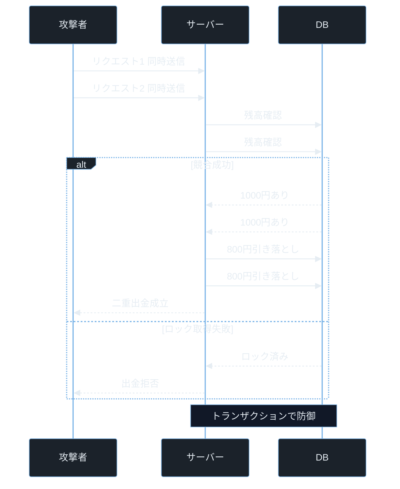

## TL;DR

- プロセスは OS が隔離して管理する実行単位で、プロセス間のメモリは原則として互いに見えない。スレッドはプロセス内の軽量な実行単位で、同じプロセスのスレッド間ではメモリを共有する。
- スレッド間でメモリを共有するため「確認してから操作する」2 ステップの間に別スレッドが割り込める——これが競合状態（Race Condition）だ。
- 競合状態は二重引き落とし・ファイル上書き・権限昇格など、セキュリティ上の重大な結果につながる実際の脆弱性カテゴリだ。

---

## なぜ重要か

「なぜ『確認してから操作する』2 ステップで書いたコードが、セキュリティ上の問題になるのか？」

この問いに即答できないなら、この記事が助けになる。答えはシンプルだ——**スレッドがメモリを共有しているため、確認と操作の隙間に別スレッドが割り込んで状態を変えられるから**。プロセスとスレッドの仕組みを知れば、競合状態がなぜ二重引き落としや権限昇格に発展するかを根本から理解できる。

具体的に挙げると：

- **競合状態脆弱性**: 銀行アプリの二重引き落とし、ファイルアップロードの検証バイパス、コンテナエスケープ
- **プロセス間通信の攻撃**: 共有メモリ・パイプ・ソケットを悪用した情報漏洩
- **タイミング攻撃（Timing Attack）**: 処理時間の差から秘密情報を推測する攻撃
- **フォーク爆弾（Fork Bomb）**: プロセスを爆発的に生成して OS を DoS 状態にする攻撃

`CVE-2022-0847`（Dirty Pipe）・`CVE-2021-4034`（pkexec）・`CVE-2019-5736`（runc）は OS の権限管理・プロセス実行・IPC に関連する脆弱性だ。これらの詳細は記事後半で解説する。

---

## 読む前に確認したい用語

難しい用語は出てきたタイミングで解説するが、以下の概念は記事全体を通して何度も登場する。ざっと目を通してから先に進もう。

**実行単位の 2 種**
- **プロセス**: 実行中のプログラム 1 インスタンス。OS が独立したメモリ空間を割り当てる。
- **スレッド**: プロセスの中に複数作れる実行の流れ。同じメモリ空間を共有する。

**競合状態と同期**
- **競合状態（Race Condition）**: 複数のスレッド・プロセスが同じリソースに「確認 → 操作」の 2 ステップで触れるとき、その間に別の処理が割り込んで結果が変わる問題。
- **TOCTOU**: Time-Of-Check Time-Of-Use の略。「確認した時点」と「使う時点」の間にズレが生じる脆弱性。
- **Mutex（ミューテックス）**: Mutual Exclusion の略。複数スレッドが同時に同じリソースを操作しないよう「鍵」をかける仕組み。
- **デッドロック**: 2 つのスレッドが互いに相手の鍵が開くのを待ち続けて永久に止まる状態。

**OS の仕組み**
- **スケジューラ**: CPU をどのスレッド・プロセスに割り当てるかを決定する OS の機能。スレッドの実行順序はスケジューラが制御するため、プログラマは順序を保証できない。

**攻撃・競技**
- **CTF**: Capture The Flag。セキュリティコンテスト。競合状態は Pwn カテゴリや Web カテゴリで頻出。
- **権限昇格**: 低い権限のユーザーが root など高い権限を不正に取得すること。

---

## 仕組み

### プロセスとスレッドの構造

> **共有領域とは**: 同一プロセス内のスレッドが共通利用するヒープ領域やグローバル変数のこと。スレッド 1 が書き換えた値はスレッド 2 からも即座に見える。これが競合状態の温床になる。



プロセス間は「専用領域」で完全に隔離され、プロセス内のスレッドは「共有領域」を介して互いにアクセスできる——この構造の違いがセキュリティ境界の有無を決める。共有領域への同時アクセスが競合状態を生む。

**計算量まとめ**

プロセスとスレッドの特性の違いを整理する。

- **メモリ共有**: プロセスは「なし（隔離）」、スレッドは「あり（同一プロセス内）」
- **生成コスト**: プロセスは「重い（COW で軽減されるが構造体の複製が必要）」、スレッドは「軽い」
- **クラッシュの影響**: プロセスは「他プロセスに影響なし」、スレッドは「プロセス全体がクラッシュする可能性あり」
- **通信方法**: プロセスは「IPC 経由」、スレッドは「共有メモリ直接アクセス」
- **セキュリティ境界**: プロセスは「OS が強制隔離」、スレッドは「プログラマが管理する必要あり」

**プロセスの特徴**

- **独立したメモリ空間**: プロセスごとに仮想アドレス空間が割り当てられる。プロセスA からプロセスB のメモリを直接読み書きできない。
- **生成コストが高い**: `fork()` は論理的には親プロセスのコピーを作るが、実際の Linux では Copy-on-Write（COW）により即座に全メモリをコピーするわけではない。書き込みが発生した時点で初めて実際のコピーが行われる。

> **fork() とは**: Unix 系 OS でプロセスを複製して子プロセスを作るシステムコール（system call の略。OS のカーネル機能を呼び出す仕組み）。
> **Copy-on-Write（COW）**: メモリのコピーを「書き込みが発生したときだけ」実行して効率化する Linux カーネルの最適化。`fork()` 直後は親子が同じ物理メモリを参照し、どちらかが書き込んだときに初めて分離される。

- **プロセス間通信（IPC）が必要**: データをやり取りするには、パイプ・ソケット・共有メモリ・メッセージキューなどの仕組みを使う必要がある。

> **IPC（Inter-Process Communication）とは**: プロセス間通信の略。独立したメモリ空間を持つプロセス同士がデータをやり取りする仕組みの総称。
> **Apache の MPM について**: Apache HTTP Server はリクエスト処理方式（MPM: Multi-Processing Module）として prefork・worker・event など複数の方式を持つ。prefork は `fork()` を使うが、worker や event はスレッドを活用する。「Apache は常にリクエストごとに `fork()` する」わけではなく、設定による。

**スレッドの特徴**

- **同一プロセス内でメモリを共有**: ヒープ・グローバル変数・ファイルディスクリプタを全スレッドが参照できる。これが高速な反面、競合状態の温床になる。
- **生成コストが低い**: メモリ空間を新たに確保しないためプロセスより軽く、数マイクロ秒で生成できる。
- **スタックだけは各スレッド独自**: 各スレッドは独自のスタック（ローカル変数・戻りアドレス）を持つ。ヒープは共有。

> **ファイルディスクリプタとは**: ファイルやソケットなど「開いたリソース」を識別する整数値。0 が標準入力、1 が標準出力、2 が標準エラー。同じプロセスのスレッドはこれを共有するため、あるスレッドが開いたファイルを別スレッドが読み書きできる。

**プロセス・スレッドの弱点 — 共有メモリへの競合アクセス**

スレッドは「共有が速い」という利点を持つが、同時アクセスの制御を怠ると競合状態が生まれる。TOCTOU は確認と操作の間にスケジューラが別スレッドを動かすことで発生し、防御には「確認と操作をアトミックにまとめる」しかない。

### 競合状態が生まれる仕組み

競合状態は「確認（Check）」と「操作（Use）」が別々のステップになっているときに起きる。

```
スレッド1: 残高確認 → 残高 = 1000円
スレッド2: 残高確認 → 残高 = 1000円  （← 同時に確認）
スレッド1: 800円引き落とし → 残高 = 200円
スレッド2: 800円引き落とし → 残高 = 200円  （← スレッド1の結果を無視）
```

本来は片方だけ成功して残高 200 円になるべきだが、競合状態により両方の処理が成功扱いになる。表示上の残高は 200 円でも、合計 1600 円の出金処理が成立してしまう。

### 攻撃フロー — 競合状態による残高操作



「競合成功」と「ロック取得失敗」の分岐点は、DB へのアクセスがトランザクションで保護されているかどうかだけだ。ロックがなければ 2 つのリクエストが同じ残高を読んで二重出金が成立し、ロックがあれば片方が弾かれる。

---

## よくある誤解

実装に進む前に、間違えやすいポイントを整理しておく。「あー、そうか」と思えるものがあれば、コードを書くときに思い出してほしい。

**「Node.js はシングルスレッドだから競合状態は起きない」**
Node.js のメインスレッドはシングルスレッドだが、`await` によって非同期操作の前後でイベントループに制御が戻る。**この「制御が戻る瞬間」に別のリクエストが割り込むため競合状態は発生する**。特に残高確認→引き落としのような 2 ステップ処理は危険だ。

**「プロセスは重いからスレッドを使えばいい」**
スレッドは確かに軽いが、**メモリを共有するぶん競合状態・デッドロック・メモリ破壊のリスクがある**。セキュリティ上重要な処理（認証・課金・権限変更）はプロセス隔離のほうが安全な場合が多い。

**「Mutex を使えば競合状態はすべて解決する」**
Mutex は正しく使えば有効だが、使い忘れ・ロック粒度の誤り・デッドロックが起きるリスクがある。**DB を使う場合はトランザクション（`FOR UPDATE` など）と組み合わせるか、アトミックな SQL 文で一括処理する方が確実**だ。

**「競合状態は理論上の問題でリアルな攻撃は難しい」**
Burp Suite の「Turbo Intruder」や Python の `threading` モジュールを使えば、数十ミリ秒以内に数百リクエストを並列送信できる。**実際に CVE になった競合状態の多くは現実の攻撃として悪用されている**。

**「Docker コンテナ間は完全に隔離されている」**
Docker はプロセス隔離（ネームスペース）とファイルシステム隔離（cgroup）を使うが、**ホスト OS のカーネルは共有している**。`CVE-2019-5736` はこの「カーネル共有」を利用した競合状態でコンテナからホストへエスケープする脆弱性だ。

---

## 脆弱なコード例

> 本記事の攻撃例は学習環境・CTF・明示的に許可された検証環境のみで実施してください。
> 実システムへの無断検証は不正アクセス禁止法や各国法令、利用規約違反となる可能性があります。

### PHP — TOCTOU によるファイル上書き脆弱性

```php
<?php
session_start();
$user_id = $_SESSION['user_id'] ?? 'unknown';
$upload_dir = '/var/www/uploads/';
$filename = $upload_dir . basename($_POST['filename'] ?? 'file.txt');

if (!file_exists($filename)) {
    file_put_contents($filename, $_POST['content'] ?? '');
    echo "保存しました: " . htmlspecialchars($filename);
} else {
    echo "エラー: ファイルが既に存在します";
}
```

> **`$_SESSION`**: PHP でセッション変数を取り出す書き方。セッションはサーバー側にユーザーごとのデータを保持する仕組み。
> **`file_exists()`**: ファイルが存在するかどうかを確認する PHP 関数。
> **`htmlspecialchars()`**: HTML 特殊文字をエスケープする関数。XSS 対策に使う。

**どこが問題か**: `file_exists()` で「存在しない」と確認してから `file_put_contents()` で書き込むまでの間に、別のリクエストが同じファイル名で書き込む可能性がある。**攻撃者は同じファイル名で同時に 2 つのリクエストを送るだけで、`file_exists()` が両方とも「存在しない」と返す瞬間を狙い、本来上書きできないはずのファイルを上書きできる**。

**防御策:**

```php
<?php
session_start();
$upload_dir = '/var/www/uploads/';
$filename = $upload_dir . bin2hex(random_bytes(16)) . '.txt';

$handle = fopen($filename, 'x');

if ($handle === false) {
    echo "エラー: ファイル作成に失敗しました";
    exit;
}

fwrite($handle, $_POST['content'] ?? '');
fclose($handle);
echo "保存しました";
```

> **`fopen($filename, 'x')`**: `'x'` モードは「ファイルが存在しない場合のみ新規作成して開く」。存在する場合は `false` を返す。確認と作成が 1 つのアトミックなシステムコールになるため競合状態を防げる。
> **アトミック（atomic）**: 「分割不可能」の意。「確認」と「操作」が 1 ステップで実行され、その間に割り込めない状態。

**「確認と操作を 1 つのアトミックなシステムコールにまとめる」——これが TOCTOU 全般への根本的な対策だ。**

---

### Node.js — 非同期処理の競合状態による残高二重引き落とし

```javascript
const balances = { user1: 1000 };

async function withdraw(userId, amount) {
    const balance = balances[userId];

    if (balance >= amount) {
        await new Promise(resolve => setTimeout(resolve, 50));

        balances[userId] = balance - amount;
        console.log(`${amount}円引き落とし。残高: ${balances[userId]}円`);
        return { success: true };
    }

    return { success: false, error: "残高不足" };
}

withdraw("user1", 800);
withdraw("user1", 800);
```

> **`async / await`**: JavaScript の非同期処理構文。`await` が付いた行は「非同期処理が完了するまで待つ」が、その間に他の処理が割り込める。Node.js はシングルスレッドだが、`await` の前後でイベントループに制御が戻るため競合状態が発生する。
> **`setTimeout(resolve, 50)`**: 50 ミリ秒待つ Promise。DB へのクエリのような「非同期待機」を模擬している。

**どこが問題か**: `balance` を読み取った直後に `await` があるため、2 つの `withdraw()` 呼び出しが同じ `balance = 1000` を読んだ後にそれぞれ引き落とす。**両方が「残高十分あり」と判定してしまうため、1000 円の残高から合計 1600 円の出金が成立する**。Node.js はシングルスレッドでも `await` をまたぐ競合状態は起きる。

**防御策:**

```javascript
const { Mutex } = require('async-mutex');
const mutex = new Mutex();

async function safeWithdraw(userId, amount) {
    const release = await mutex.acquire();
    try {
        const balance = balances[userId];
        if (balance >= amount) {
            await new Promise(resolve => setTimeout(resolve, 50));
            balances[userId] = balance - amount;
            console.log(`${amount}円引き落とし。残高: ${balances[userId]}円`);
            return { success: true };
        }
        return { success: false, error: "残高不足" };
    } finally {
        release();
    }
}
```

> **async-mutex**: Node.js 向けの排他制御ライブラリ。`npm install async-mutex` で導入できる。`mutex.acquire()` で鍵を取得し、`release()` を呼ぶまで他の処理が同じ区間に入れなくなる。`try...finally` で必ず `release()` されるようにするのがポイント。

**`try...finally` で必ず `release()` されるようにする——ロックの解放漏れがデッドロックの主因なので、この構造は鉄則だ。**

---

### Python — スレッドの競合状態と Mutex による修正

GIL（Global Interpreter Lock）の影響で、Python のシンプルな `counter += 1` では競合状態が再現しない場合がある。「読み取り → 待機 → 書き込み」を明示的に分けることで確実に再現させる。

> **GIL（Global Interpreter Lock）**: CPython（標準の Python 実装）が持つ「1 度に 1 スレッドしか Python コードを実行しない」という制約。マルチスレッドでも CPU バウンドな処理は並列化できないが、I/O 待機中は他スレッドに制御が移る。

```python
import threading
import time

counter = 0

def increment():
    global counter
    for _ in range(1000):
        current = counter       # ① 現在の値を読み取る
        time.sleep(0.000001)   # ② 別スレッドへの切り替えを誘発
        counter = current + 1  # ③ ①の値を使って書き込む（他スレッドの更新を無視）

threads = [threading.Thread(target=increment) for _ in range(4)]
for t in threads:
    t.start()
for t in threads:
    t.join()

print(f"期待値: 4000, 実際: {counter}")
```

> **`threading.Thread`**: Python の標準ライブラリ `threading` が提供するスレッドクラス。`target` に実行する関数、`args` に引数を渡し、`start()` で起動する。`join()` は全スレッドの終了を待つ。
> **`time.sleep(0.000001)`**: 1 マイクロ秒スリープ。GIL を一時解放して別スレッドへの切り替えを意図的に誘発する。

**どこが問題か**: ①で読み取った `current` の値が、②の待機中に別スレッドによって更新されても、③は古い `current` を使って書き込む。**実行するたびにスケジューラの動作が変わり結果が変化するため、テストで偶然通っても本番環境で問題が顕在化する**——これが競合状態バグの厄介な特性だ。

**防御策:**

```python
import threading
import time

counter = 0
lock = threading.Lock()

def increment_safe():
    global counter
    for _ in range(1000):
        with lock:
            current = counter
            time.sleep(0.000001)
            counter = current + 1

threads = [threading.Thread(target=increment_safe) for _ in range(4)]
for t in threads:
    t.start()
for t in threads:
    t.join()

print(f"期待値: 4000, 実際: {counter}")
```

> **`with lock:`**: コンテキストマネージャ構文で Mutex を使う書き方。`with` ブロックを抜けると自動的にロックが解放される。例外が発生してもデッドロックを防げる。

**`with lock:` 構文は例外が起きても自動でロックを解放する——ロック忘れを構造的に防ぐ最も確実な書き方だ。**

---

## 実践例 / 演習例

### Linux でプロセスとスレッドを確認する

```bash
ps aux | head -10
```

> **`ps`**: プロセス状態を表示するコマンド（Process Status の略）。`a` は全ユーザーのプロセス、`u` はユーザー情報付き、`x` は端末なしのプロセスも表示する。

```bash
ps -eLf | grep nginx
```

> **`ps -eLf`**: `-e` は全プロセス、`-L` はスレッドも表示、`-f` はフルフォーマット。`LWP`（Light Weight Process）列がスレッド ID を示す。

```bash
cat /proc/self/status | grep -E "Pid|Threads"
```

> **`/proc/self/status`**: 現在のプロセスの詳細情報を含む仮想ファイル。`Pid` 行でプロセス ID、`Threads` 行でそのプロセスが持つスレッド数を確認できる。

### 競合状態を自分で再現する

HTB / TryHackMe の環境、または自宅 VM で次のスクリプトを使って競合状態を体験できる。前掲の Python コードをそのまま実行すると、スケジューラの動作次第で実際のカウントが 4000 を下回る。

### Web の競合状態を curl で試す

```bash
for i in $(seq 1 20); do
    curl -s -X POST http://localhost/withdraw -d "amount=800" &
done
wait
```

> **`curl`**: HTTP リクエストを送信するコマンドラインツール。API テストや脆弱性検証で広く利用される。
> **`-s`**: 進捗表示（プログレスバーやエラーメッセージ）を消す（silent モード）。
> **`-X POST`**: HTTP メソッドを POST に指定する。デフォルトは GET。
> **`-d "amount=800"`**: リクエストボディ（POST で送るデータ）を指定する。
> **`seq 1 20`**: 1 から 20 までの連番を生成するコマンド。
> **`&`（バックグラウンド実行）**: コマンド末尾に付けると結果を待たずに次のコマンドへ進む。20 個のリクエストがほぼ同時に送られる。
> **`wait`**: バックグラウンドで実行した全プロセスが終了するまで待つコマンド。

---

## 防御策

### 1. アトミック操作を使う

「確認」と「操作」を 1 つの分割不可能な操作にする。

- **ファイル操作**: `open(filename, 'x')` や `O_CREAT | O_EXCL` フラグで「存在しない場合のみ作成」をアトミックに実現する。
- **DB 操作**: `UPDATE accounts SET balance = balance - 800 WHERE user_id = 1 AND balance >= 800` のように、確認と更新を 1 つの SQL 文にまとめる。
- **キャッシュ操作**: Redis の `SETNX`（Set if Not eXists）・`INCR` などのアトミックコマンドを使う。

### 2. Mutex / ロックで排他制御する

複数スレッドが同じリソースを操作する前に「鍵」を取得させる。

```python
with lock:
    if balance >= amount:
        balance -= amount
```

**デッドロックを避けるポイント**:
- ロックの取得順序を全スレッドで統一する
- `try...finally` や `with` 構文で必ず解放する
- ロックを保持する時間を最小限にする

### 3. DB トランザクションと排他ロックを使う

```bash
BEGIN TRANSACTION;
SELECT balance FROM accounts WHERE user_id = 1 FOR UPDATE;
UPDATE accounts SET balance = balance - 800 WHERE user_id = 1 AND balance >= 800;
COMMIT;
```

> **トランザクション（Transaction）**: 複数の DB 操作を「全部成功するか全部失敗するか」で扱う仕組み。
> - `BEGIN TRANSACTION`: トランザクションの開始。
> - `COMMIT`: すべての操作を確定する。
> - `ROLLBACK`: すべての操作を取り消す（エラー時などに使う）。
> **`FOR UPDATE`**: SELECT 文でその行に「書き込みロック」をかける SQL 構文。ロックが取得された行は `COMMIT` か `ROLLBACK` まで他のトランザクションが変更できない。

### 4. プロセス隔離で影響範囲を限定する

重要な処理を別プロセスで実行することで、スレッドのメモリ共有によるリスクを避ける。コンテナ（Docker）や VM 間はプロセス隔離が効いているため、プロセス間の競合状態による横断的な影響は限定できる。ただし、**アプリケーション内部の競合状態自体は防げない**点に注意が必要だ。隔離はあくまで影響範囲を絞る手段であり、競合状態の根本的な修正はロック・トランザクション・アトミック操作で行う。

---

## 実演ラボ案内

### 推奨学習順序

- linux-command-basics（`ps`・`top`・`/proc` の基礎）
- memory-model（プロセスのメモリレイアウト）
- process-and-thread（本記事）
- Race Condition 実践（Web / Pwn 問題）
- Use-After-Free 完全解説（ヒープ管理の深掘り）

### Hack The Box

- **Challenges — Web カテゴリ**: 競合状態を使った二重引き落としや重複登録の問題が複数ある。Burp Suite の Repeater でリクエストを並列送信して試せる。
- **Challenges — Pwn カテゴリ**: プロセスの `fork()` 後のメモリ状態を利用した問題（ASLR リーク・親子プロセスのメモリ共有）が出る。

### TryHackMe

- **Linux Fundamentals**: `ps`・`top`・`/proc` ファイルシステムに慣れる。
- **Advent of Cyber**: 競合状態問題が毎年出題されており、実際に Web アプリへ同時リクエストを送る演習ができる。

### 自宅 VM（合法環境）

```bash
stress --cpu 4 --timeout 60s &
top
```

> **`stress`**: CPU・メモリ・I/O に負荷をかけるテストツール。`--cpu 4` は 4 スレッドで CPU ストレス、`--timeout 60s` は 60 秒後に停止。`&` でバックグラウンド実行しながら `top` コマンドでプロセスとスレッドをリアルタイム確認できる。
> **`top`**: 実行中のプロセスを CPU 使用率順にリアルタイム表示するコマンド。`H` キーを押すとスレッド単位の表示に切り替わる。

---

## 関連 CVE と被害事例

> **CVE とは**: Common Vulnerabilities and Exposures の略。世界共通の脆弱性識別番号。
> **CVSS スコア**: 脆弱性の深刻度を 0.0〜10.0 で評価した指標。7.0 以上が High、9.0 以上が Critical。

**CVE-2022-0847（Dirty Pipe）**
Linux カーネル 5.8 以降のパイプ（プロセス間通信の仕組み）における競合状態脆弱性。スプライスとパイプの組み合わせで任意のファイルを上書きでき、ローカルユーザーが root 権限を取得できた。2022 年 3 月に公開された。CVSS スコア 7.8。本記事との関連: プロセス間通信・競合状態

**CVE-2021-4034（Polkit pkexec 権限昇格）**
Linux の権限昇格ツール `pkexec` における引数処理の競合状態を含む脆弱性。12 年以上にわたってすべての主要 Linux ディストリビューションに存在し、ローカルユーザーが root 権限を取得できた。CVSS スコア 7.8。本記事との関連: プロセスの TOCTOU・権限昇格

> **pkexec とは**: PolicyKit の一部で、指定したコマンドを別の権限（通常 root）で実行するツール。`sudo` に似た役割を持つ。

**CVE-2019-5736（runc コンテナエスケープ）**
Docker・Kubernetes などで使われるコンテナランタイム `runc` の競合状態脆弱性。コンテナ内の攻撃者がホスト上の `runc` バイナリを上書きでき、次回コンテナ起動時にホスト上で任意コードを実行できた。コンテナ技術の根本を揺るがす問題として注目された。CVSS スコア 8.6。本記事との関連: プロセス隔離・競合状態

---

## 次に学ぶべき記事

- **Race Condition 攻撃の実践 — Burp Suite による並列リクエスト** — 本記事で学んだ理論を使って、実際に Web アプリの競合状態を Burp Suite で突く
- **Use-After-Free 完全解説** — スレッドのメモリ共有を悪用した解放後の再利用攻撃を深掘りする
- **コンテナ隔離の仕組みと突破技法** — Docker のプロセス隔離（namespace・cgroup）と CVE-2019-5736 のような脱出技法を理解する

---

## 参考文献

- OWASP. "Race Conditions". https://owasp.org/www-community/vulnerabilities/Race_Conditions
- NVD. "CVE-2022-0847 Detail". https://nvd.nist.gov/vuln/detail/CVE-2022-0847
- NVD. "CVE-2021-4034 Detail". https://nvd.nist.gov/vuln/detail/CVE-2021-4034
- NVD. "CVE-2019-5736 Detail". https://nvd.nist.gov/vuln/detail/CVE-2019-5736
- Linux man-pages. "fork(2)". https://man7.org/linux/man-pages/man2/fork.2.html
- Python Docs. "threading — Thread-based parallelism". https://docs.python.org/3/library/threading.html
- Node.js Docs. "The Event Loop". https://nodejs.org/en/docs/guides/event-loop-timers-and-nexttick
