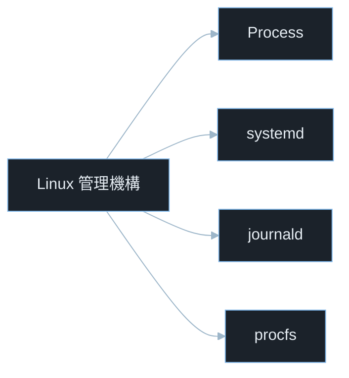
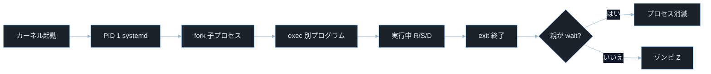
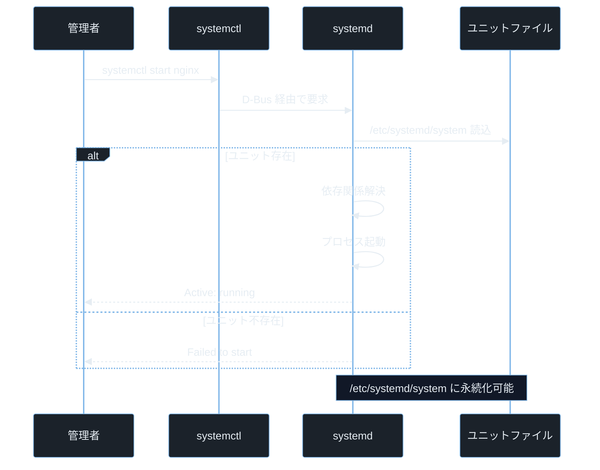
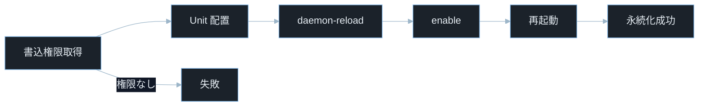

## TL;DR

- Linux では全てのプログラムが **プロセス** として動作し、各プロセスは一意の **PID**（Process ID）を持つ。`ps`・`top`・`htop` でプロセスの状態を確認し、`kill` でシグナルを送って制御する。

> **`ps` とは**: 実行中のプロセスを一覧表示するコマンド（process status の略）。
> **`top` とは**: CPU・メモリ使用状況をリアルタイムで表示するインタラクティブな監視コマンド。
> **`kill` とは**: プロセスにシグナルを送るコマンド。名前に反して終了以外の通知にも使う。
- **systemd** は現代 Linux の init システム（PID 1）で、サービスの起動・停止・自動再起動を管理する。**ユニットファイル**（`.service`）に攻撃者が永続化コードを仕込むのが権限昇格後の定番手法だ。
- **journalctl** は systemd のログを管理する。ログは攻撃の痕跡調査に不可欠だが、不適切なログ権限や改ざん可能な設定は情報漏洩の原因になる。

---

## なぜ重要か

「プロセスの仕組みを知らなくても、アプリは動くのでは？」

この問いに即答できないなら、この記事が助けになる。**プロセス管理の知識はマルウェアの永続化・権限昇格・フォレンジックの全ての基礎であり、これを理解しないと攻撃も防御も手探りになる。** プロセスとサービスの仕組みを知れば、なぜ `systemd` のユニットファイル 1 つで再起動後も攻撃者のバックドアが生き続けるかが見えてくる。

具体的に挙げると：

- CTF Forensics でメモリダンプから実行中のプロセスを列挙して攻撃者のツールを特定する
- 侵害後の永続化調査で `/etc/systemd/system/` の不審なユニットファイルを `systemctl list-units` で発見する
- `journalctl -u sshd --since "2026-01-01"` で SSH ブルートフォースの痕跡を時刻ベースで確認する
- `ps aux` で一般ユーザーが root 所有のプロセスに環境変数を渡している箇所を発見して権限昇格に使う

> **`ps aux` のオプション**: `a` は全ユーザーのプロセス・`u` は詳細形式（CPU・メモリ等）・`x` は端末（tty）なしのバックグラウンドプロセスも含む。3 つ合わせて「全プロセスを詳細表示」になる。

- プロセスの `/proc/[PID]/environ` から機密情報（DB パスワード・API キー）が漏洩していないか確認する

> **`/proc/[PID]/` の `[PID]`**: 実際のプロセス番号が入る場所。例えば PID が 1234 のプロセスなら `/proc/1234/environ` を参照する。`$$` で現在のシェルの PID が得られる。

> **CTF とは**: Capture The Flag の略。セキュリティ技術を競う演習形式。Forensics はメモリ・ディスクダンプの解析、Pwn はバイナリ脆弱性悪用が主題。

---

## 読む前に確認したい用語

難しい用語は出てきたタイミングで解説するが、以下の概念は記事全体を通して何度も登場する。ざっと目を通してから先に進もう。

**プロセスの基礎**
- **プロセス**: 実行中のプログラムの実体。コード・データ・スタック・ファイルディスクリプタ・環境変数を持つ OS の管理単位。
- **PID（Process ID）**: 各プロセスに割り当てられる一意の整数番号。`ps`・`top` で確認できる。
- **PPID（Parent Process ID）**: プロセスを生成した親プロセスの PID。Linux ではプロセスは必ず親を持つ（孤児プロセスの親は init/systemd に引き取られる）。
- **fork()**: 親プロセスのコピーを作って子プロセスを生成するシステムコール。
- **exec()**: 現在のプロセスを別のプログラムに置き換えるシステムコール。`fork()` 直後に呼ぶのが基本パターン。
- **ゾンビプロセス（Z 状態）**: 終了したが親が `wait()` を呼んでいないプロセス。PID テーブルのエントリは残る。

**プロセスの状態**
- **R（Running）**: CPU で実行中または実行待ちキューにある状態。
- **S（Sleeping）**: I/O 待ちなどで中断している状態（割り込み可能）。
- **D（Disk Sleep）**: ディスク I/O 待ちで中断中（割り込み不可能）。`kill` も効かない。
- **Z（Zombie）**: 終了済みだが親に回収されていない状態。
- **T（Stopped）**: シグナルで停止中（`Ctrl+Z` で送れる `SIGTSTP` など）。

**systemd と init**
- **init**: Linux カーネルが最初に起動するプロセス（PID 1）。全プロセスの祖先。
- **systemd**: 現代 Linux の標準 init システム。並列起動・依存関係管理・ログ管理を行う。
- **ユニットファイル（Unit File）**: systemd がサービス・マウント・タイマー等を管理するための設定ファイル。`.service`・`.timer`・`.socket` 等の拡張子を持つ。
- **target**: systemd でシステムの動作モードを表す単位。`multi-user.target`（テキストモード）・`graphical.target`（GUI）等。

**セキュリティ用語**
- **永続化（Persistence）**: 再起動後も攻撃者のコードが自動起動するように仕込む手法。
- **CVE**: Common Vulnerabilities and Exposures の略。世界共通の脆弱性識別番号。
- **CVSS**: Common Vulnerability Scoring System。脆弱性の深刻度を 0.0〜10.0 で評価する指標。

---

## 仕組み

### Linux プロセス管理の全体像



これら 4 つが連携してシステム全体を管理する。Process が動作の実体・systemd がサービスライフサイクルを管理・journald がログを収集・procfs がカーネル情報を公開するという役割分担だ。

---

### プロセスの生成と終了



fork → exec → exit → wait の流れが Linux プロセス管理の中核だ。攻撃者はこのライフサイクルを利用して永続化やプロセス隠蔽を行う（`nohup` で親子関係を切り離す・ゾンビを意図的に残してリソースを枯渇させる等）。

> **`task_struct` とは**: Linux カーネル内部でプロセス情報（PID・状態・メモリマップ・ファイルディスクリプタ等）を保持するデータ構造。シグナル送信はこの構造体のフラグを操作することで実現される。

**計算量まとめ**

- **`fork()`**: O(1) ～ O(ページ数)。現代 Linux はコピーオンライトで遅延コピーするため起動は速い。
- **`ps aux`**: O(n)。n は実行中プロセス数。`/proc` を走査する。
- **シグナル送信**: O(1)。カーネルがターゲットの `task_struct` にフラグを立てるだけ。

**プロセスの弱点 — `/proc` 経由の情報漏洩**

Linux では `/proc/[PID]/` 以下にプロセスの詳細情報が公開される。`/proc/[PID]/environ` には環境変数（DB パスワード・API キーを含む場合がある）が、`/proc/[PID]/cmdline` には起動コマンドが格納される。デフォルトではプロセスオーナーとスーパーユーザーしか読めないが、パーミッション設定ミスや SUID バイナリ経由で読めることがある。

---

### systemd のサービス管理フロー



systemd は最終的にユニットファイルの内容を信頼して実行する。そのためユニットファイルへの書き込み権限を得た攻撃者は即座に永続化と権限昇格を成立させられる。

> **D-Bus とは**: Linux の標準プロセス間通信（IPC）システム。`systemctl` コマンドと `systemd` デーモンは D-Bus 経由でメッセージをやりとりする。D-Bus の権限設定ミスも権限昇格の経路になる（CVE-2022-29799）。

**計算量まとめ**

- **依存関係解決**: O(u)。u はユニット数。グラフ探索で並列起動可能なものを判定。
- **`systemctl status`**: O(1)。DBus 経由でキャッシュされた状態を返す。

**systemd の弱点 — ユニットファイルの書き込み権限**

`/etc/systemd/system/` 以下への書き込み権限を持つユーザーは、任意のコマンドを次回起動時に root として実行できる。`systemctl daemon-reload` + `systemctl enable [unit]` の組み合わせで永続化（Persistence）が完成する。



この攻撃フローはシンプルだが検出が難しい。再起動後も動き続けるため、インシデントレスポンスでは必ず `/etc/systemd/system/` の棚卸しと `systemctl list-unit-files` での有効サービス確認が必要だ。

---

### ログのライフサイクル

```mermaid
%%{init: {"theme":"base","themeVariables":{"background":"#0b1117","primaryColor":"#1b222a","primaryBorderColor":"#7fb6e8","primaryTextColor":"#e6edf3","lineColor":"#9db6c9","secondaryColor":"#111827","tertiaryColor":"#0b1117"}}}%%
flowchart LR
    A[プロセス stdout/stderr] --> B[journald]
    C[カーネルログ] --> B
    D[syslog] --> B
    B --> E[/run/log/journal]
    B --> F[/var/log/journal]
    E --> G[再起動で消える]
    F --> H[永続ログ]
```

ログは生成から保存まで複数段階を経由する。どこか 1 箇所でも改ざん可能ならフォレンジックの信頼性が低下する。攻撃者がローカルのジャーナルだけを削除しても外部転送先にログが残れば証拠になる。

> **`journald` とは**: systemd が提供するログ収集デーモン（systemd-journald の略称）。カーネル・サービス・アプリの出力を一元管理する。`journalctl` はその閲覧ツールだ。

デフォルトで `/run/log/journal`（揮発性・再起動で消える）に書き、`/etc/systemd/journald.conf` で `Storage=persistent` を設定すると `/var/log/journal`（永続）に書かれる。フォレンジックでは永続ログの有無が調査範囲を決める。

**計算量まとめ**

- **`journalctl -u nginx`**: O(l)。l はそのユニットのログ行数。インデックスで高速フィルタ。
- **`journalctl --since`**: O(log l)。時刻インデックスで二分探索。

**ジャーナルの弱点 — ローテーションとサイズ制限**

デフォルトのジャーナルはサイズ上限（`SystemMaxUse=`）を超えると古いログを削除する。攻撃者が大量のログを意図的に生成すると攻撃前後の痕跡が押し流される。`journalctl --vacuum-size` や `--vacuum-time` で手動削除もできるため、ログの整合性を保証するには転送先（rsyslog・SIEM 等）が必要だ。

---

## よくある誤解

実装に進む前に、間違えやすいポイントを整理しておく。「あー、そうか」と思えるものがあれば、コードを書くときに思い出してほしい。

**「`kill` コマンドはプロセスを終了させる」**
`kill` はシグナルを送るコマンドで、デフォルトは `SIGTERM`（番号 15）だ。`SIGTERM` を受け取ったプロセスはハンドラで後処理（ファイルのフラッシュ等）を行ってから終了できる。**プロセスを無条件に終了させるのは `kill -9`（`SIGKILL`）で、こちらはハンドラを無視してカーネルが強制終了する。** ただし D 状態のプロセスには `SIGKILL` も届かない。

**「`ps aux` で全プロセスが見える」**
`ps aux` はコマンド実行時点のスナップショットだ。**短命なプロセス（数ミリ秒で終わるシェルスクリプトなど）は表示されないことがある。** また権限によっては他ユーザーのプロセスの詳細が省略される場合がある。リアルタイム監視には `top` か `htop`、履歴調査には `auditd` のログが必要だ。

**「systemd サービスを停止すれば完全に無効化できる」**
`systemctl stop nginx` はサービスを停止するが、次回起動時に自動起動する設定（`WantedBy=multi-user.target`）は残る。**完全に無効化するには `systemctl disable nginx` が必要**で、`disable` はシンボリックリンクを削除して自動起動を防ぐ。`stop` と `disable` は独立した操作だ。

**「journalctl のログは改ざんできない」**
systemd のジャーナルには FSS（Forward Secure Sealing）という改ざん検出機能があるが、**デフォルトでは無効だ**。有効化するには `journalctl --setup-keys` でシールキーを生成する必要がある。FSS なしのジャーナルは root 権限があれば削除・書き換えが可能なため、外部ログ転送と組み合わせて初めて証拠能力を持つ。

**「PID 1 が落ちるとカーネルパニックになる」**
これは正しい。PID 1（systemd）がクラッシュすると Linux はカーネルパニックを起こしてシステムが停止する。**攻撃者が意図的に PID 1 をクラッシュさせれば DoS が成立する**。ただし通常のユーザーは PID 1 にシグナルを送れないため、この攻撃には root 権限か PID 1 自体の脆弱性が必要になる。

---

## 脆弱なコード例

> 本記事の攻撃例は学習環境・CTF・明示的に許可された検証環境のみで実施してください。
> 実システムへの無断検証は不正アクセス禁止法や各国法令・利用規約違反となる可能性があります。

### PHP — プロセス情報をユーザーに漏洩する

```php
<?php
$pid = $_GET['pid'] ?? '';

if (is_numeric($pid)) {
    $cmdline = file_get_contents("/proc/{$pid}/cmdline");
    $environ = file_get_contents("/proc/{$pid}/environ");
    echo "<pre>" . htmlspecialchars($cmdline ?? '') . "</pre>";
    echo "<pre>" . htmlspecialchars($environ ?? '') . "</pre>";
}
```

> **`$_GET['pid']` とは**: HTTP GET リクエストのクエリパラメータ `pid` の値を取得する PHP の超グローバル変数。例えば `/info?pid=1` でアクセスすると `$_GET['pid']` が `"1"` になる。
> **`/proc/[PID]/cmdline` とは**: プロセスの起動コマンドライン引数が NUL 文字区切りで格納された仮想ファイル。
> **`/proc/[PID]/environ` とは**: プロセスの環境変数が NUL 文字区切りで格納された仮想ファイル。DB パスワード・API キーが含まれることがある。

**どこが問題か**: `?pid=1` を送るだけで PID 1（systemd）の起動コマンドが取得できる。さらに Web サーバープロセスの PID を指定すれば、そのプロセスに渡された環境変数（`DATABASE_PASSWORD`・`SECRET_KEY` 等）が全て読まれる。`is_numeric()` は整数チェックのみで、どの PID へのアクセスも制限していない。

```php
<?php
$pid = (int)($_GET['pid'] ?? 0);

if ($pid <= 0) {
    http_response_code(400);
    exit("無効な PID です");
}

$own_pid = getmypid();
$own_ppid = posix_getppid();

if ($pid !== $own_pid && $pid !== $own_ppid) {
    http_response_code(403);
    exit("自プロセス以外の情報は取得できません");
}

$cmdline = file_get_contents("/proc/{$pid}/cmdline");
echo "<pre>" . htmlspecialchars($cmdline ?? '') . "</pre>";
```

> **`getmypid()` とは**: PHP で現在のプロセスの PID を返す関数。
> **`posix_getppid()` とは**: PHP で現在のプロセスの親プロセス PID（PPID）を返す関数（POSIX 拡張）。

アクセスできる PID を自プロセスと親プロセスのみに限定することで、任意プロセス情報の漏洩を防ぐ。環境変数ファイルは絶対に公開しない設計にすることが防御の基本だ。

プロセス情報は必要最小限のみ公開し、環境変数（`/proc/[PID]/environ`）は外部から絶対にアクセスできない設計にする。

---

### Node.js — systemd ユニットファイルの動的生成における検証不足

```javascript
const express = require('express');
const fs = require('fs');
const { execSync } = require('child_process');
const app = express();
app.use(express.json());

app.post('/service/create', (req, res) => {
    const { name, command } = req.body;
    const unitContent = `[Unit]
Description=${name}

[Service]
ExecStart=${command}

[Install]
WantedBy=multi-user.target
`;
    fs.writeFileSync(`/etc/systemd/system/${name}.service`, unitContent);
    execSync('systemctl daemon-reload');
    res.json({ created: true });
});

app.listen(3000);
```

> **`execSync('systemctl daemon-reload')` とは**: systemd にユニットファイルの変更を再読み込みさせるコマンドを同期実行する。これを呼ばないと新しいユニットファイルが認識されない。

**どこが問題か**: `name` に `../../etc/cron.d/evil` のようなパストラバーサルを渡すと意図しないディレクトリにファイルが書かれる。`command` に任意のシェルコマンドを指定でき、`systemctl enable` された後の再起動で root として実行される。Web API 経由で systemd 永続化バックドアを一発で仕込めるため、初期侵入後の権限昇格と永続化が同時に成立する。

```javascript
const express = require('express');
const fs = require('fs');
const path = require('path');
const { execFile } = require('child_process');
const app = express();
app.use(express.json());

const UNIT_DIR = '/etc/systemd/system/';
const ALLOWED_NAME = /^[a-zA-Z0-9\-_]{1,64}$/;
const ALLOWED_EXEC = /^\/usr\/local\/bin\/[a-zA-Z0-9\-_]+$/;

app.post('/service/create', (req, res) => {
    const { name, command } = req.body;

    if (!ALLOWED_NAME.test(name)) {
        return res.status(400).json({ error: 'サービス名が不正です' });
    }
    if (!ALLOWED_EXEC.test(command)) {
        return res.status(400).json({ error: 'コマンドパスが不正です' });
    }

    const unitPath = path.join(UNIT_DIR, `${name}.service`);
    if (!unitPath.startsWith(UNIT_DIR)) {
        return res.status(400).json({ error: 'パストラバーサルを検出しました' });
    }

    const unitContent = `[Unit]\nDescription=${name}\n\n[Service]\nExecStart=${command}\n\n[Install]\nWantedBy=multi-user.target\n`;
    fs.writeFileSync(unitPath, unitContent, { mode: 0o644 });

    execFile('systemctl', ['daemon-reload'], (err) => {
        if (err) return res.status(500).json({ error: 'reload 失敗' });
        res.json({ created: unitPath });
    });
});

app.listen(3000);
```

> **`path.join()` と `startsWith()` の組み合わせ**: `path.join` でパスを正規化してから `startsWith(UNIT_DIR)` で想定ディレクトリ配下かどうかを確認する。これによりパストラバーサルを検出できる。
> **`0o644`**: JavaScript での 8 進数リテラル（`0o` プレフィックス）。`644` はオーナー読み書き・グループとその他は読み取りのみ。ユニットファイルに適切な権限を設定する。

サービス名とコマンドをホワイトリスト正規表現で厳格に制限し、パスを正規化して展開外への書き込みを防ぐことで、永続化バックドアの設置を根本から防ぐ。

systemd ユニット生成機能はアプリケーションから極力排除し、必要な場合は許可済みサービス名・コマンドのみをホワイトリストで制御することが原則だ。

---

### Python — プロセス監視スクリプトでの競合状態（TOCTOU）

```python
import os
import subprocess
from flask import Flask, request

app = Flask(__name__)

@app.route('/kill')
def kill_process():
    pid = request.args.get('pid', '')

    if not pid.isdigit():
        return "無効なPID", 400

    proc_path = f"/proc/{pid}"
    if os.path.exists(proc_path):
        result = subprocess.run(['kill', '-TERM', pid], capture_output=True)
        return f"送信完了: {pid}"
    return "プロセスが存在しません", 404
```

> **`os.path.exists(proc_path)`**: `/proc/[PID]` ディレクトリの存在確認。PID に対応するプロセスが存在する場合にのみ `kill` を送る意図だが、確認と実行の間に状態が変わりうる。
> **`subprocess.run(['kill', '-TERM', pid])`**: プロセスに `SIGTERM`（終了要求シグナル）を送る。

**どこが問題か**: `os.path.exists()` で確認してから `subprocess.run(['kill', ...])` で実行するまでの間にプロセスが終了して別のプロセスが同じ PID を再利用すると、意図しないプロセスを終了させる TOCTOU 競合が発生する。また `pid` のバリデーションが `isdigit()` のみで範囲チェックがないため、`pid=1`（systemd）を送ればシステム全体が停止する DoS が成立する。

```python
import os
import subprocess
import re
from flask import Flask, request, abort

app = Flask(__name__)

ALLOWED_PID_RANGE = (2, 65535)

@app.route('/kill')
def kill_process():
    pid_str = request.args.get('pid', '')

    if not pid_str.isdigit():
        abort(400)

    pid = int(pid_str)
    if pid < ALLOWED_PID_RANGE[0] or pid > ALLOWED_PID_RANGE[1]:
        abort(400)

    try:
        os.kill(pid, 15)
        return f"SIGTERM を送信しました: {pid}"
    except ProcessLookupError:
        abort(404)
    except PermissionError:
        abort(403)
```

> **`os.kill(pid, 15)`**: Python の `os.kill()` は OS の `kill()` システムコールを直接呼び出す原子的な操作だ。`/proc` の存在確認と `kill` の送信を別のステップに分けない分、TOCTOU の隙間がなくなる。`15` は `SIGTERM` のシグナル番号。
> **`ProcessLookupError`**: 指定した PID のプロセスが存在しない場合に `os.kill()` が投げる例外。
> **`PermissionError`**: 指定した PID のプロセスにシグナルを送る権限がない場合に投げる例外。

システムコールを直接使って確認と実行を原子的にまとめ、PID の範囲（2〜65535）を制限して PID 1 の DoS を防ぐことで、競合と悪用の両方を封じる。

確認と実行を分離せず OS が提供する原子的な API（`os.kill()`）を使うことが、TOCTOU 競合を根本から防ぐ設計原則だ。

---

## 実践例 / 演習例

### プロセスの状態を確認する

```bash
ps aux
```

> **`ps aux` とは**: 全ユーザーの全プロセスを詳細表示するコマンド（process status の略）。`a` は全ユーザー・`u` は詳細形式・`x` は端末なしのプロセスも含む。

```bash
ps aux --sort=-%cpu | head -10
ps aux --sort=-%mem | head -10
```

> **`head -10` とは**: 先頭 10 行のみ表示するコマンド（`head -N` で先頭 N 行）。大量の出力から上位だけ確認するときに使う。

> **`--sort=-%cpu`**: CPU 使用率（`%cpu` 列）の降順（`-` が降順）でソートする。高 CPU プロセスの特定に使う。マルウェアや不審なマイニングプロセスを見つけるときに役立つ。

```bash
ps -eo pid,ppid,user,stat,cmd --forest
```

> **`--forest`**: プロセスを親子関係のツリー形式で表示するオプション。攻撃者が起動した子プロセスのチェーンを追跡するのに便利。
> **`-eo pid,ppid,user,stat,cmd`**: 表示する列を指定するオプション。PID・PPID・ユーザー・状態・コマンドを選択している。

### systemd サービスの調査

```bash
systemctl list-units --type=service --state=running
systemctl list-units --type=service --state=failed
```

> **`systemctl list-units`**: 現在読み込まれている全ユニットを一覧表示するコマンド。`--type=service` でサービスのみ・`--state=running` で実行中のみに絞れる。

```bash
systemctl list-unit-files --type=service | grep enabled
```

> **`grep enabled` とは**: `grep` で `enabled` という文字列を含む行だけを抽出する。`systemctl list-unit-files` の出力から自動起動が有効なサービスだけを絞り込む。

> **`list-unit-files`**: インストールされている全ユニットファイルとその有効状態を表示する。`enabled`（自動起動する）・`disabled`（しない）・`static`（手動のみ）等の状態がある。

```bash
find /etc/systemd/system/ -newer /etc/passwd -name "*.service" 2>/dev/null
```

> **`-newer /etc/passwd`**: `/etc/passwd` より更新日時が新しいファイルを探す。侵害後に追加された不審なユニットファイルを時刻ベースで特定する。

### journalctl でログを調査する

```bash
journalctl -u nginx --since "2026-01-01" --until "2026-06-01"
```

> **`journalctl -u [unit]`**: 指定したサービス（ユニット）のログのみ表示するオプション（unit の略）。`--since` と `--until` で時刻範囲を絞れる。

```bash
journalctl -p err -b -1
```

> **`-p err`**: 優先度（priority）が `err`（エラー）以上のログのみ表示するオプション。`emerg`・`alert`・`crit`・`err` の 4 レベルが対象。
> **`-b -1`**: 前回のブート（`-1`）のログを表示する。`-b 0` が今回のブート・`-b -1` が前回。クラッシュ前のログ調査に使う。

```bash
journalctl -f -u sshd
```

> **`-f`**: 新しいログをリアルタイムで表示する follow モード（`tail -f` 相当）。SSH ブルートフォース攻撃の監視などに使う。

### `/proc` を使ったプロセス調査

```bash
cat /proc/$(pgrep nginx | head -1)/cmdline | tr '\0' ' '
ls -la /proc/$(pgrep nginx | head -1)/fd/
```

> **`pgrep [名前]`**: プロセス名から PID を検索するコマンド（process grep の略）。`pgrep nginx` は nginx プロセスの全 PID を返す。
> **`tr '\0' ' '`**: NUL 文字（`\0`）をスペースに変換する。`/proc/[PID]/cmdline` は引数が NUL 区切りのため、人間が読める形にするために使う。
> **`/proc/[PID]/fd/`**: プロセスが開いているファイルディスクリプタのシンボリックリンクが入るディレクトリ。開きっぱなしのソケットやファイルが確認できる。

---

## 防御策

### 1. 不審なサービスを定期的に棚卸しする

```bash
systemctl list-unit-files --type=service --state=enabled | \
    grep -v "^UNIT\|^Legend\|^$" | \
    awk '{print $1}' | \
    sort > /tmp/services_$(date +%Y%m%d).txt
```

> **`awk '{print $1}'` とは**: 各行の 1 番目のフィールド（スペース区切り）を出力するテキスト処理コマンド。ここではサービス名列だけを抽出する。
> **`sort` とは**: 行を辞書順に並び替えるコマンド。`diff` で差分を取るときに順序を揃えるために使う。

ベースラインを定期的に記録し、差分（`diff`）で新規追加されたサービスを検出する。

> **`diff` とは**: 2 つのファイルの差分を行単位で比較して表示するコマンド（difference の略）。`diff baseline_20260101.txt baseline_20260620.txt` で追加・削除された行が確認できる。

### 2. ユニットファイルの権限を確認・制限する

```bash
find /etc/systemd/system/ -type f -name "*.service" \
    -exec stat --format="%a %U %G %n" {} \;
```

> **`stat --format="%a %U %G %n"`**: ファイルのパーミッション（8 進数）・オーナー・グループ・パスを表示する書式指定。ユニットファイルのオーナーが root 以外になっていないかを確認する。

適切な権限は `root:root 644`（読み取りは全員・書き込みは root のみ）だ。

### 3. ジャーナルを外部に転送する

```bash
sudo apt install rsyslog
sudo systemctl enable rsyslog
```

```
*.* @siem.example.com:514
```

> **`rsyslog` とは**: 高機能なシステムログデーモン。`/etc/rsyslog.conf` に転送先を設定することで、ローカルのジャーナルと同時に外部 SIEM（Security Information and Event Management）サーバーにもログを送れる。ローカルのジャーナルが削除・改ざんされても証拠が残る。

### 4. systemd サービスのサンドボックス設定

```
[Service]
ExecStart=/usr/bin/myapp
User=myappuser
NoNewPrivileges=true
ProtectSystem=strict
ProtectHome=true
PrivateTmp=true
CapabilityBoundingSet=
```

> **`NoNewPrivileges=true`**: プロセスが SUID バイナリや `setuid()` 呼び出しで新たな特権を取得できないようにする systemd のセキュリティオプション。
> **`ProtectSystem=strict`**: `/usr`・`/boot`・`/etc` を読み取り専用にマウントする。サービスがシステムファイルを書き換えることを防ぐ。
> **`PrivateTmp=true`**: サービス専用の `/tmp` と `/var/tmp` を用意する。他のサービスの一時ファイルにアクセスできなくなる。

### 5. auditd でプロセス生成を監視する

```bash
sudo apt install auditd
sudo auditctl -a always,exit -F arch=b64 -S execve -k process_exec
```

> **`auditd` とは**: Linux カーネルの監査フレームワークのデーモン。プロセス生成・ファイルアクセス・システムコール等をカーネルレベルで記録する。`auditctl` でルールを追加し、`ausearch -k process_exec` で検索できる。
> **`-S execve`**: `execve` システムコール（プログラムの実行）を監査対象にする指定。新しいプロセスが起動するたびに記録が残る。

---

## 実演ラボ案内

### 推奨学習順序

- linux-permissions（プロセスと権限の関係）
- process-service-management（本記事）
- ipc-mechanisms（プロセス間通信の詳細）
- linux-privilege-escalation（プロセス・サービス悪用の総合演習）

### Hack The Box

- **Challenges — Forensics カテゴリ**: メモリダンプ（`.dmp`・`.mem`）から実行プロセスを抽出する問題が頻出。`volatility3` の `windows.pslist`・`linux.pslist` でプロセスリストを取得する技術が直接使える。
- **Machines — Linux**: 侵害後の権限昇格で `systemctl list-units`・`find /etc/systemd -newer` を実行して不審なサービスを発見するパターンが多い。

> **`volatility3` とは**: メモリフォレンジックのオープンソースフレームワーク。`pip install volatility3` でインストールできる。メモリダンプからプロセス・ネットワーク接続・ファイルシステムキャッシュを解析する。

### TryHackMe

- **Linux PrivEsc**: `ps aux` で特権プロセスを見つけ、ユニットファイルを使った永続化を実践できる。
- **Investigating Windows / Linux**: プロセスとサービスのフォレンジック調査を体験できる。

### 自宅 VM（合法演習）

```bash
sudo apt install docker.io
docker run -it --rm ubuntu:24.04 bash
```

コンテナ内で安全に実験できる。以下でゾンビプロセスを作って `ps` で確認する。

```bash
python3 -c "
import os, time
pid = os.fork()
if pid == 0:
    os._exit(0)
else:
    print(f'子プロセス PID: {pid}')
    time.sleep(30)
" &
sleep 1
ps aux | grep Z
```

> **`os.fork()` とは**: Python で子プロセスを作る関数。戻り値が `0` なら子プロセス・正の整数なら親プロセスに返る。`os._exit(0)` で子プロセスを終了させるが、親が `wait()` を呼ばないとゾンビ（Z 状態）になる。

---

## 関連 CVE と被害事例

> **CVE とは**: Common Vulnerabilities and Exposures の略。世界共通の脆弱性識別番号。
> **CVSS スコア**: 脆弱性の深刻度を 0.0〜10.0 で評価した指標。7.0 以上が High・9.0 以上が Critical。

**CVE-2021-4034（Polkit pkexec — PwnKit）**
systemd と連携して動作する Polkit の `pkexec`（SUID root バイナリ）に引数処理の欠陥があり、脆弱な `pkexec` が存在する Linux システムで一般ユーザーが引数なしで実行するだけで root 権限を取得できた。`pkexec` は systemd 環境に標準搭載されており影響範囲が広大だった。root 権限取得後はシェルを起動して任意の操作が可能になる。攻撃前提: ローカルユーザー権限。CVSS スコア 7.8（High）。本記事との関連: プロセス・SUID・systemd 連携

**CVE-2022-29799（networkd-dispatcher — D-Bus 経由の権限昇格）**
systemd-networkd の状態変化を通知する `networkd-dispatcher` デーモンが、D-Bus 経由で受け取ったネットワークインタフェース名を検証せずにスクリプトパスとして使用した。攻撃者がローカルから細工されたインタフェース名を送ることでパストラバーサルが成立し、root 権限でスクリプトを実行できた。攻撃前提: ローカルユーザー権限。CVSS スコア 7.8（High）。本記事との関連: systemd サービス・プロセス間通信・パストラバーサル

**CVE-2021-33909（Linux カーネル — Sequoia、`/proc` の権限昇格）**
Linux カーネルの `seq_file` インタフェース（`/proc` ファイルシステムが使う）に、1GB を超える長いパスのマウントポイントを作成して `/proc/self/mountinfo` を読み取るとスタックバッファオーバーフローが発生し、root 権限を取得できた。`/proc` の読み取りが引き金になるカーネル脆弱性の典型例だ。攻撃前提: ローカルユーザー権限。CVSS スコア 7.8（High）。本記事との関連: `/proc` ファイルシステム・プロセス情報

---

## 次に学ぶべき記事

- **linux-privilege-escalation** — プロセス・サービス・cron ジョブ・書き込み可能パスを組み合わせた権限昇格の総合演習
- **ipc-mechanisms** — プロセス間通信（パイプ・UNIX ソケット・共有メモリ・シグナル）の詳細
- **network-fundamentals** — プロセスがオープンするネットワークソケットと、`ss`・`lsof` によるネットワーク接続の調査

---

## 参考文献

- Linux man-pages. "proc(5)". https://man7.org/linux/man-pages/man5/proc.5.html
- systemd. "systemd.service(5)". https://www.freedesktop.org/software/systemd/man/systemd.service.html
- systemd. "journalctl(1)". https://www.freedesktop.org/software/systemd/man/journalctl.html
- Linux man-pages. "signal(7)". https://man7.org/linux/man-pages/man7/signal.7.html
- OWASP. "Information Exposure Through Process". https://owasp.org/www-community/vulnerabilities/Information_exposure_through_process_listing
- NVD. "CVE-2021-4034 Detail (PwnKit)". https://nvd.nist.gov/vuln/detail/CVE-2021-4034
- NVD. "CVE-2022-29799 Detail". https://nvd.nist.gov/vuln/detail/CVE-2022-29799
- NVD. "CVE-2021-33909 Detail (Sequoia)". https://nvd.nist.gov/vuln/detail/CVE-2021-33909
