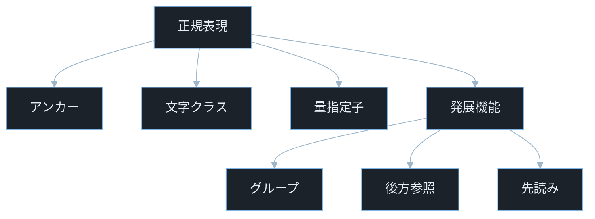
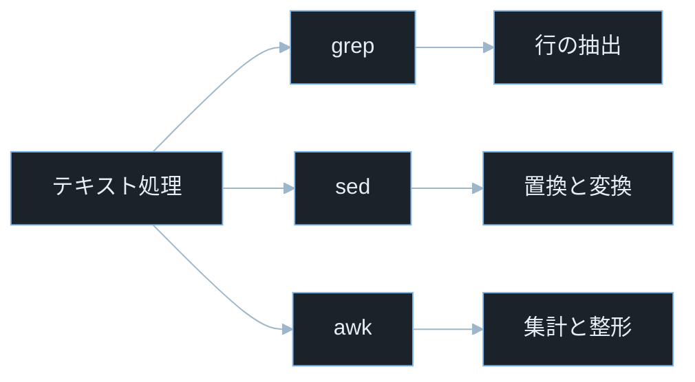
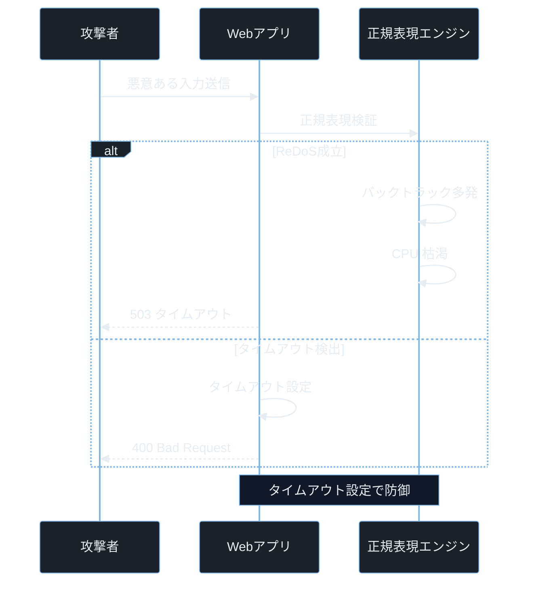

## TL;DR

- 正規表現（Regular Expression、略して regex）はテキストのパターンを記述する書き方だ。`grep`・`sed`・`awk` はその正規表現を使ってログ解析・文字列置換・列抽出を行う Linux 標準ツールで、セキュリティ実務で頻繁に利用される。
- セキュリティの文脈では、ユーザー入力で正規表現を構築したり、脆弱なパターンを書いたりすると **ReDoS（正規表現を使った DoS 攻撃）** や **正規表現インジェクション** の原因になる。
- 攻撃者が `grep` で探していることを把握し、自分も同じ技術でログを監視することで「攻撃と防御の両面」が見えるようになる。

---

## なぜ重要か

「インシデントが発生したとき、大量のアクセスログから攻撃の痕跡を数分で見つけるには？」

この問いに即答できないなら、この記事が助けになる。答えはシンプルだ——**正規表現と grep/sed/awk を組み合わせれば、数十万行のログから特定パターンを秒単位で抽出できる**。正規表現の仕組みを知れば、ログ解析もコード検査も「パターンで考える」思考に切り替えられる。

具体的に挙げると：

- **ログ解析**: アクセスログから攻撃パターンを検出する。SQL インジェクション・XSS・パストラバーサルの痕跡を正規表現で検索する。
- **機密情報の漏洩調査**: ソースコードやログファイルにパスワード・API キー・トークンが書かれていないかを正規表現でスキャンする。
- **インシデントレスポンス**: 短時間で大量のログから特定 IP・特定エラー・異常なリクエストパターンを絞り込む。
- **CTF Forensics / Pwn**: ダンプされたメモリや通信ログからフラグパターンを `grep` で探す。
- **コード検査**: 危険な関数呼び出し（`eval`・`system()`・`shell_exec()` など）をソースコードから全探索する。

そして攻撃者も同じ技術を使う。標的の設定ファイルやログを取得できれば、`grep` でパスワードを探し、`awk` でユーザー一覧を抽出し、`sed` でフォーマットを整える。

> **本記事の grep / sed / awk の利用例は、自組織・CTF・許可された検証環境を前提とする。他者システムや取得権限のないデータへの利用は不正アクセス禁止法等に違反する可能性があり、禁止する。**

---

## 読む前に確認したい用語

難しい用語は出てきたタイミングで解説するが、以下の概念は記事全体を通して何度も登場する。ざっと目を通してから先に進もう。

**Linux テキスト処理ツール**
- **正規表現（regex）**: テキストのパターンを記述する書き方。`[0-9]+` は「1 桁以上の数字」を意味する。以降は「正規表現」に統一する。
- **grep**: ファイルやストリームから正規表現にマッチする行を抽出するコマンド（Global Regular Expression Print の略）。
- **sed**: ストリームエディタ（Stream EDitor の略）。テキストを読みながら置換・削除・変換を行う。
- **awk**: テキストを列（フィールド）に分割して処理するスクリプト言語ツール。名前は開発者 Aho・Weinberger・Kernighan の頭文字。
- **PCRE**: Perl Compatible Regular Expressions の略。PHP・grep・多くのツールで使われる正規表現エンジン。

**正規表現の機能**
- **キャプチャグループ**: `(...)` で囲んだ部分が「後から参照できるグループ」になる正規表現の機能。
- **後方参照**: 以前にキャプチャグループでマッチした内容を再利用する機能。`\1`（パターン内）や `$1`（置換時）で参照する。
- **先読み（Lookahead）**: `(?=...)` や `(?!...)` で「後ろに何が来るか」を条件にするが文字を消費しない正規表現の機能。

**セキュリティ用語**
- **ReDoS（Regular Expression Denial of Service）**: 意図的に複雑な入力で正規表現エンジンのバックトラッキングを爆発させ、CPU を枯渇させる DoS 攻撃。
- **バックトラッキング**: マッチ失敗時に前の選択肢へ戻って再探索する仕組み。通常は効率的だが、特定のパターンと入力の組み合わせで指数関数的に増加する。
- **カタストロフィックバックトラッキング**: 正規表現エンジンが解を探すために指数関数的に試行回数が増える状態。ReDoS の原因。
- **正規表現インジェクション**: ユーザー入力がそのまま正規表現パターンに組み込まれ、攻撃者が任意のパターンを注入できる脆弱性。

**競技・評価**
- **CTF**: Capture The Flag。セキュリティ技術を競う演習形式。Forensics カテゴリではログ解析、Reversing はバイナリ解析、Pwn はプログラム脆弱性悪用、Crypto は暗号解読が主題となる。grep/awk でログを解析してフラグを探す問題が頻出。
- **CVE**: Common Vulnerabilities and Exposures の略。世界共通の脆弱性識別番号。
- **CVSS**: Common Vulnerability Scoring System。脆弱性の深刻度を 0.0〜10.0 で評価する指標。

---

## 仕組み

### 正規表現の構成要素



「アンカー・文字クラス・量指定子」が土台で、「グループ・後方参照・先読み」は発展機能だ。この階層を意識することで、複雑なパターンを読むときも「どの機能が組み合わさっているか」を分解して理解できる。

**計算量まとめ**

各構成要素の役割を整理する。

**アンカー** — 位置を指定する:
- `^`: 行の先頭。`^ERROR` は "ERROR" で始まる行にマッチ
- `$`: 行の末尾。`\.log$` は ".log" で終わる文字列にマッチ

> **`\b` は word boundary（単語境界）を意味する特殊記号。バックスペース文字ではない。** `\bpassword\b` は "password" という単語全体にマッチし、"passwords" にはマッチしない。

**文字クラス** — どの文字を許すかを指定する:
- `.`: 任意の 1 文字（改行以外）
- `[abc]`: a・b・c のいずれか 1 文字
- `[^abc]`: a・b・c **以外**の 1 文字
- `[a-z]`: a から z の小文字 1 文字
- `[0-9]`: 数字 1 文字
- `\w`: 英数字とアンダースコア（`[a-zA-Z0-9_]`）
- `\s`: 空白文字（スペース・タブ・改行）
- `\d`: 多くの実装では数字を表す。ただし Unicode 対応エンジン（Python の `re.UNICODE` モード等）では `[0-9]` と完全一致しない場合がある。基本的な ASCII 数字を確実に扱いたい場合は `[0-9]` を使う方が安全だ。

**量指定子** — 繰り返し回数を指定する:
- `*`: 0 回以上（なくてもよい）
- `+`: 1 回以上
- `?`: 0 回または 1 回（任意）
- `{3}`: ちょうど 3 回
- `{2,5}`: 2 回以上 5 回以下
- `{3,}`: 3 回以上

> **グリーディ（貪欲）マッチとは**: `.*` のような量指定子は「できるだけ多く」マッチしようとする。`.*?` のように `?` を末尾に付けると「できるだけ少なく」になる（レイジー/怠惰マッチ）。

**グループと代替**:

> **注意: 本文の説明では Markdown レンダリングの都合により全角縦棒「｜」を使用しているが、実際の grep・sed・awk・正規表現コードでは半角「|」を使用する。** 初学者が全角縦棒を実際のコマンドに貼り付けると動作しないので注意。

- `(abc)`: キャプチャグループ。マッチした内容を後から参照できる。

> **`$1` とは**: 置換時に「1 番目のキャプチャグループにマッチした内容」を参照する記法。`sed` の `\1`、JavaScript の `$1`、Python の `\1` として使われる。

- `(?:abc)`: 非キャプチャグループ。グループ化だけ行い、`\1` や `\2` の番号を消費しない。グループを参照する必要がなく、単に「まとめてグループ化したい」だけのときに使う。

- `a｜b`: `a` または `b`（正規表現の「または」演算子は半角 `|`。本文中では全角「｜」で表記）

> **`｜` は正規表現の「OR」**: `cat|dog` は "cat" または "dog" にマッチする。Markdown テーブルの列区切りと衝突するため、本文中では全角縦棒「｜」で表記している。実際のコマンド・コードブロック内では半角 `|` を使う。

**先読み**:
- `(?=abc)`: 直後に "abc" が続く位置（肯定先読み）
- `(?!abc)`: 直後に "abc" が**続かない**位置（否定先読み）

**正規表現の弱点 — ネストした量指定子による ReDoS**

量指定子を組み合わせると ReDoS の温床になる。後述するが `(a+)+` のようにネストした構造と「マッチしない入力」が組み合わさると、バックトラッキングが指数関数的に増大してサーバーをフリーズさせられる。

### grep / sed / awk の使い分け



「選ぶ（grep）」「変換する（sed）」「集計する（awk）」——この役割の違いを把握することが 3 ツールの使い分けの出発点だ。現場では `grep | awk | sort | uniq -c` のようにパイプで繋いで使うことがほとんどだ。

- **grep**: パターンにマッチする行を「選ぶ」。フィルタリング専用。
- **sed**: マッチした部分を「置換・削除・変換」する。テキスト変換ツール。
- **awk**: 行を列に分割して「集計・計算・整形」する。軽量プログラミング環境。

### ReDoS — カタストロフィックバックトラッキングの原理

正規表現エンジンは「バックトラッキング（後戻り探索）」を使ってパターンを試す。通常は効率的だが、`(a+)+$` のような「ネストした量指定子」があると、マッチしない入力（例: `aaaaaaaaab`）に対してエンジンが指数関数的に試行して CPU を使い果たす。

試行回数の例（`(a+)+$` に対して `aaab` を試す場合）:
- `a、aaa、b` → 失敗 → 戻る
- `aa、a、b` → 失敗 → 戻る
- `a、a、a、b` → 失敗 → 戻る
- …（組み合わせ爆発）

入力長 n が増えると試行回数が `2^n` に近づく。30 文字の入力で何十億回もの試行が発生し、サーバーが数分間フリーズする。



タイムアウト設定の有無で「フリーズが続く」か「即座に 400 を返す」かが分かれる。このフローが示す通り、ReDoS への防御はパターンの改善とタイムアウトの 2 層が必要だ。

**ReDoS を招く脆弱なパターンの特徴**:
- `(a+)+` のようにネストした量指定子がある
- `(a｜aa)+` のように同じ文字列に複数の方法でマッチできる
- これらパターンの末尾に `$` や `\z` があって「マッチしない入力」が来ると爆発する

---

## よくある誤解

実装に進む前に、間違えやすいポイントを整理しておく。「あー、そうか」と思えるものがあれば、コードを書くときに思い出してほしい。

**「正規表現でバリデーションすれば安全」**
正規表現はパターンの「形式チェック」はできるが、セマンティクス（意味）の検証はできない。メールアドレスの形式は正しくてもドメインが実在するかはわからない。また ReDoS のリスクがあるため、**正規表現だけに依存せず長さ制限・ホワイトリスト・専用ライブラリと組み合わせる**。

**「`.*` は任意の文字列にマッチするから万能」**
`.*` は「改行を除く任意の文字の 0 回以上の繰り返し」だ。複数行テキストの全体にマッチさせたい場合は `re.DOTALL` フラグ（Python）や `/s` フラグを使う必要がある。**これを知らずに書くとセキュリティチェックが改行を含む入力で回避される**。

**「grep の `|` は OS のパイプ」**
`grep -E "cat|dog"` の `|` は正規表現の「または」演算子で、「grep の出力を別コマンドに渡す」OS のパイプ（`|`）とは別物だ。**コマンドを組み合わせるパイプはコマンドとコマンドの間に置く**。

**「awk はアーカイブ展開ツール」**
`awk` は **A**ho・**W**einberger・**K**ernighan というプログラマー 3 名の名前から来たテキスト処理ツールだ。**`tar`・`zip` のような圧縮展開ツールとは無関係**。列指向の簡易プログラミング環境で、CSV や空白区切りテキストの集計に強い。

**「正規表現インジェクションは RCE にならないから低リスク」**
`re.compile(user_input)` のような正規表現インジェクションは、直接コマンド実行にはならないが **DoS（ReDoS）・情報漏洩（任意のログ行を取得）・バリデーション回避の原因になる**。WAF や認証チェックをバイパスするために使われることもある。

---

## 脆弱なコード例

> 本記事の攻撃例は学習環境・CTF・明示的に許可された検証環境のみで実施してください。
> 実システムへの無断検証は不正アクセス禁止法や各国法令、利用規約違反となる可能性があります。

### PHP — カタストロフィックバックトラッキングを起こすパターン

```php
<?php
$input = $_GET['email'] ?? '';

if (preg_match('/^([\w.]+@[\w.]+)+$/', $input)) {
    echo "有効なメールアドレス形式です";
} else {
    echo "無効な形式です";
}
```

> **`preg_match()`**: PHP の正規表現マッチング関数。`/パターン/フラグ` の形式で PCRE 正規表現を使う。マッチしたら `1`、しなかったら `0` を返す。タイムアウトはデフォルトでない。
> **`$_GET['email']`**: HTTP GET リクエストのクエリパラメータ `email` の値を取得する PHP の超グローバル変数。例えば `/form?email=test@example.com` というリクエストで `$_GET['email']` が `test@example.com` になる。`?? ''` は値が存在しない場合に空文字列を返す Null 合体演算子。

**どこが問題か**: `([\w.]+@[\w.]+)+` はネストした量指定子を持つ。攻撃者が `aaaaaaaaaaaaa@aaaaaaaaaaaaa@` のような無効なメールアドレスを送ると、エンジンが指数関数的な試行を行いサーバーが数秒〜数分間フリーズする。**攻撃者は 30 文字程度のリクエストを 1 回送るだけでサーバーを長時間占有できる**。

**防御策:**

```php
<?php
$input = $_GET['email'] ?? '';

if (strlen($input) > 254) {
    http_response_code(400);
    exit("入力が長すぎます");
}

if (filter_var($input, FILTER_VALIDATE_EMAIL)) {
    echo "有効なメールアドレス形式です";
} else {
    echo "無効な形式です";
}
```

> **`filter_var($input, FILTER_VALIDATE_EMAIL)`**: PHP 標準の入力フィルタ関数。内部で ReDoS が起きないように最適化されたバリデーションを行う。自前の正規表現より安全で簡潔だ。

長さ制限を先に行うことで入力の大きさを制限し、正規表現の試行回数の上限を抑える。**「長さ制限 → 専用バリデーション関数」の 2 層で、自前の正規表現よりも安全で確実な防御になる。**

---

### Node.js — ユーザー入力で正規表現を構築する正規表現インジェクション

```javascript
const express = require('express');
const app = express();

app.get('/search', (req, res) => {
    const term = req.query.term || '';
    const logs = require('fs').readFileSync('/var/log/app.log', 'utf8');

    const pattern = new RegExp(term, 'i');
    const matches = logs.split('\n').filter(line => pattern.test(line));

    res.json({ results: matches.slice(0, 100) });
});

app.listen(3000);
```

> **`new RegExp(term, 'i')`**: 文字列から正規表現オブジェクトを動的に生成する JavaScript のコンストラクタ。`'i'` は case-insensitive（大文字小文字を区別しない）フラグ。`term` がそのまま正規表現パターンになるため、ユーザー入力を渡すと危険だ。

**どこが問題か**: 3 つの問題が重なっている。①`?term=(a%2B)%2B%24` のような ReDoS ペイロードを送られると CPU が枯渇する、②`?term=password` で全ログのパスワード行が返る（情報漏洩）、③`?term=[invalid` のような不正パターンで例外が発生する。**ユーザーがログ検索のパターン自体を自由に指定できる設計は、1 リクエストで DoS と情報漏洩の両方を成立させられる**。

**防御策:**

```javascript
const express = require('express');
const escapeRegExp = require('lodash/escapeRegExp');
const app = express();

const MAX_TERM_LENGTH = 100;

app.get('/search', (req, res) => {
    const rawTerm = req.query.term || '';

    if (rawTerm.length > MAX_TERM_LENGTH) {
        return res.status(400).json({ error: '検索語が長すぎます' });
    }

    const safeTerm = escapeRegExp(rawTerm);
    const logs = require('fs').readFileSync('/var/log/app.log', 'utf8');

    const pattern = new RegExp(safeTerm, 'i');
    const matches = logs.split('\n').filter(line => pattern.test(line));

    res.json({ results: matches.slice(0, 100) });
});

app.listen(3000);
```

> **`escapeRegExp(str)`**: lodash ライブラリが提供する関数。正規表現の特殊文字（`.`・`*`・`+`・`?`・`[`・`]`・`{`・`}`・`(`・`)`・`^`・`$`・`\`）を全てエスケープして、文字列リテラルとして安全に検索できるようにする。`re.escape()` の JavaScript 版。

**`escapeRegExp()` でエスケープすることで、ユーザーの入力が「正規表現パターン」ではなく「リテラル文字列検索」として扱われ、ReDoS インジェクションの両方を無効化できる。**

---

### Python — ユーザー入力を `re.compile()` に渡す正規表現インジェクション

```python
import re
from flask import Flask, request, jsonify

app = Flask(__name__)

@app.route('/validate')
def validate():
    pattern_str = request.args.get('pattern', '')
    test_input = request.args.get('input', '')

    pattern = re.compile(pattern_str)
    match = pattern.fullmatch(test_input)

    return jsonify({'valid': bool(match)})
```

> **`re.compile(pattern)`**: Python で正規表現をコンパイルして `Pattern` オブジェクトを作る関数。コンパイル済みパターンは高速だが、ユーザー入力をそのまま渡すと正規表現インジェクションになる。
> **`pattern.fullmatch(text)`**: 文字列全体がパターンにマッチするか確認するメソッド。`match()` は先頭のみ、`search()` は途中も、`fullmatch()` は全体。

**どこが問題か**: `?pattern=(a%2B)%2B&input=aaaaaaaaaaaaaab`（`(a+)+` と長い `a...b`）を送ると ReDoS が発生する。**Python の `re` モジュールはデフォルトでタイムアウトなしのため処理が返ってこなくなり、攻撃者はサーバーを無制限に占有できる**。さらに攻撃者が自由にパターンを指定できるため任意の情報を抽出することも可能だ。

**防御策:**

```python
import re
from flask import Flask, request, jsonify, abort

app = Flask(__name__)

ALLOWED_PATTERNS = {
    'email': re.compile(r'^[a-zA-Z0-9._%+-]+@[a-zA-Z0-9.-]+\.[a-zA-Z]{2,}$'),
    'phone': re.compile(r'^\+?[0-9\-\s]{7,15}$'),
    'username': re.compile(r'^[a-zA-Z0-9_]{3,20}$'),
}

@app.route('/validate')
def validate():
    pattern_name = request.args.get('type', '')
    test_input = request.args.get('input', '')

    if pattern_name not in ALLOWED_PATTERNS:
        abort(400)

    if len(test_input) > 500:
        abort(400)

    pattern = ALLOWED_PATTERNS[pattern_name]
    match = pattern.fullmatch(test_input)

    return jsonify({'valid': bool(match)})
```

ユーザーが正規表現パターンを指定できる設計を避け、許可リスト方式でパターン名から選ぶ。各パターンは事前に安全性を確認したうえでコンパイル済みオブジェクトとして用意する。**「ユーザーはパターン名を選ぶだけ」という設計にすることで、正規表現インジェクションと ReDoS を構造的に排除できる。**

---

## 実践例 / 演習例

### grep でログを解析する

```bash
grep -E "ERROR|CRITICAL" /var/log/apache2/error.log
```

> **`grep -E`**: 拡張正規表現（ERE: Extended Regular Expression）を使うオプション。`-E` なしの基本正規表現では `+`・`?`・`|` などがそのまま使えない（バックスラッシュが必要）。

```bash
grep -oE "\b([0-9]{1,3}\.){3}[0-9]{1,3}\b" access.log | sort | uniq -c | sort -rn | head -20
```

> **`grep -o`**: マッチした部分だけを出力するオプション（only matching）。行全体でなくパターンにマッチした文字列のみを抽出する。
> **`uniq -c`**: 連続する重複行を 1 つにまとめてその出現回数を先頭に付けるコマンド。`sort | uniq -c` で全体の頻度集計になる。
> **`sort -rn`**: 数値（`-n`）で降順（`-r` = reverse）に並べ替えるオプション。

```bash
grep -iE "(union.*select|select.*from|drop.*table|exec.*xp_)" access.log
```

> **`grep -i`**: 大文字小文字を区別しない（case-insensitive）オプション。SQL インジェクション文字列は大文字小文字を混在させて回避しようとすることがあるので `-i` を使う。

SQL インジェクション・パストラバーサル・XSS の痕跡を探す典型パターンを挙げる。

```bash
grep -iE "(\.\.\/|\.\.\\\\)" access.log

grep -iE "(<script|javascript:|on(load|click|error|mouseover)=)" access.log

grep -E "HTTP/[0-9.]+ [45][0-9]{2}" access.log | awk '{print $9}' | sort | uniq -c
```

### sed で機密情報をマスキングする

```bash
sed -E 's/(password|passwd|secret|token)=[^ &"]*/\1=***MASKED***/gi' config.log
```

> **`sed -E`**: 拡張正規表現を使うオプション（`grep -E` と同じ）。
> **`s/パターン/置換/フラグ`**: sed の置換コマンド。`g` = 行内の全マッチを置換（global）、`i` = 大文字小文字を区別しない。
> **`\1`**: 最初のキャプチャグループ（`(password|passwd|secret|token)` の部分）の内容を参照する後方参照。置換後もキー名を保持したままバリューだけをマスクできる。

```bash
sed -E 's/[a-zA-Z0-9._%+-]+@[a-zA-Z0-9.-]+\.[a-zA-Z]{2,}/***EMAIL***/g' data.txt
```

### awk でアクセスログを集計する

```bash
awk '$9 ~ /^[45]/ {count[$9]++} END {for(s in count) print count[s], s}' access.log | sort -rn
```

> **`awk '$9 ~ /pattern/ {...}'`**: `$9` は 9 番目のフィールド（列）を意味する。Apache / Nginx のアクセスログは空白区切りで、`$9` が HTTP ステータスコードに対応する。`~` は「正規表現にマッチする」演算子。
> **`END {...}`**: awk の特殊なブロック。全行の処理が終わった後に実行される。集計結果の出力に使う。

```bash
awk '{print $1}' access.log | sort | uniq -c | sort -rn | head -10
```

上位 10 件のアクセス元 IP アドレスを集計する。DDoS 攻撃の送信元や総当たり攻撃元の特定に使える。

```bash
awk 'BEGIN{OFS=","} {print $1, $7, $9, $NF}' access.log > extracted.csv
```

> **`BEGIN{OFS=","}`**: awk の特殊なブロック。最初の行を処理する前に実行される。`OFS`（Output Field Separator）を `,` に設定すると CSV 形式で出力できる。
> **`$NF`**: 最後のフィールドを意味する（Number of Fields の値）。Nginx ログではレスポンスバイト数がここに来ることが多い。

### ソースコードから危険なパターンを探す

```bash
grep -rn "eval\|exec\|system\|shell_exec\|popen" --include="*.php" /var/www/html/
```

> **`grep -r`**: ディレクトリを再帰的に検索するオプション（recursive）。
> **`grep -n`**: 一致した行の行番号を表示するオプション（line number）。
> **`--include="*.php"`**: 検索対象のファイルを拡張子でフィルタするオプション。

```bash
grep -rn "password\s*=\s*['\"][^'\"]\+" --include="*.py" --include="*.js" ./ | grep -v ".env"
```

ハードコードされたパスワードを探す例。`.env` ファイルは除外している。

---

## 防御策

### 1. ReDoS を起こすパターンを避ける

安全なパターンの原則:
- ネストした量指定子 `(a+)+` を書かない
- 代替を含む繰り返し `(a｜ab)+` を書かない
- 同じ位置に複数の方法でマッチできる構造を避ける
- `^`・`$` ではなく `\A`・`\z`（Python/Ruby）を使って改行バイパスを防ぐ

代わりに使える安全なパターン:
- `([a-z]+)` → `[a-z]+` に変更（不要なグループを外す）
- `(a+)+` → `a+` に変更（ネストを解消）
- 複雑なパターンは段階的に検証する

### 2. 正規表現にタイムアウトを設定する

```python
import re
import signal

class RegexTimeout(Exception):
    pass

def timeout_handler(signum, frame):
    raise RegexTimeout("正規表現がタイムアウト")

signal.signal(signal.SIGALRM, timeout_handler)
signal.alarm(2)

try:
    result = re.match(pattern, user_input)
    signal.alarm(0)
except RegexTimeout:
    result = None
```

> **`signal.SIGALRM`**: UNIX のアラームシグナル。`signal.alarm(n)` で n 秒後にシグナルを発生させる。Python の `re` モジュール自体にはタイムアウトがないため、OS レベルのシグナルで制御する（Linux 専用）。

### 3. 入力の長さを制限する

```javascript
function safeMatch(pattern, input, maxLen = 200) {
    if (input.length > maxLen) {
        return null;
    }
    return pattern.exec(input);
}
```

長さ制限だけでも ReDoS の試行回数の上限を大幅に抑えられる。バックトラッキングは入力長に対して指数関数的に増えるため、短い入力は問題になりにくい。

### 4. ユーザー入力を正規表現パターンに直接使わない

```python
import re

def search_logs(keyword: str) -> list:
    if not isinstance(keyword, str) or len(keyword) > 100:
        return []
    safe_keyword = re.escape(keyword)
    pattern = re.compile(safe_keyword, re.IGNORECASE)
    ...
```

> **`re.escape(text)`**: Python でユーザー入力の全ての正規表現特殊文字をエスケープする関数。これにより `(a+)+` のような危険なパターンが `\(a\+\)\+` という安全なリテラル検索になる。

### 5. セキュリティ向けの grep ワンライナーをチームで共有する

よく使うパターンを `~/.bashrc` や Wiki に記録しておくと、インシデント時に即使える。

```bash
alias find-creds="grep -rniE '(password|passwd|secret|apikey|api_key)\s*[:=]\s*\S+'"
alias find-ips="grep -oE '\b([0-9]{1,3}\.){3}[0-9]{1,3}\b'"
alias http-errors="awk '\$9 ~ /^[45]/' "
```

> **`alias`**: シェルのコマンド短縮名を定義する機能。`alias ll='ls -la'` のように使い、`~/.bashrc` に書くとターミナル起動時に自動設定される。

---

## 実演ラボ案内

### 推奨学習順序

- binary-hex-bitwise（16進数・ASCIIの基礎）
- regex-grep-sed-awk（本記事）
- character-encoding（正規表現と文字コードの関係）
- ログ解析実践（CTF Forensics）
- Burp Suite でのパターン検索

### Hack The Box

- **Challenges — Forensics カテゴリ**: ダンプされたログや通信キャプチャから `grep` / `awk` でフラグを探す問題が多い。`grep -roa "HTB{[^}]\+}" dump.bin` のようなフラグパターン検索が定番だ。
- **Challenges — Web カテゴリ**: ReDoS を使って WAF のタイムアウトを引き起こす問題も存在する。

> **`-a`**: バイナリファイルをテキストとして扱って検索するオプション。メモリダンプや実行ファイルから文字列を探すときに使う。

### TryHackMe

- **Linux Fundamentals Part 2**: `grep`・`sed`・`awk` の基礎操作を練習できる。
- **OWASP Top 10**: ReDoS はサービス妨害（DoS）の一形態として登場する。

### 自宅 VM（合法演習）

```bash
cat /var/log/auth.log | grep -iE "failed|invalid|error" | awk '{print $(NF-3)}' | sort | uniq -c | sort -rn | head -10
```

SSH 認証失敗のソース IP を集計する。自分の VM に対して `fail2ban` の動作確認を兼ねた演習として使える。

> **`/var/log/auth.log`**: Linux の認証ログ。SSH ログイン試行・sudo 実行・PAM 認証の成否が記録される。

---

## 関連 CVE と被害事例

> **CVE とは**: Common Vulnerabilities and Exposures の略。世界共通の脆弱性識別番号。
> **CVSS スコア**: 脆弱性の深刻度を 0.0〜10.0 で評価した指標。9.0 以上が Critical。

**CVE-2021-3807（ansi-regex — ReDoS）**
Node.js の ansi-regex パッケージ（バージョン 5.0.1 未満・6.0.1 未満）が ANSI エスケープシーケンス検出に使う正規表現にカタストロフィックバックトラッキングが存在した。攻撃者が細工した文字列を入力するとアプリケーションが数秒〜数分間フリーズした。ansi-regex は chalk・strip-ansi など多数のパッケージの依存関係に含まれるため影響範囲が広かった。CVSS スコア 7.5。本記事との関連: ReDoS・カタストロフィックバックトラッキング

**CVE-2022-29078（EJS — テンプレートインジェクション、正規表現バイパス）**
EJS（Embedded JavaScript テンプレートエンジン）3.1.7 以前に、テンプレートオプションの `outputFunctionName` に対する不十分な入力検証があった。パターンマッチングによるブロックリストが機能せず、攻撃者がサーバーサイドテンプレートインジェクション（SSTI）を引き起こしてリモートコード実行（RCE）が可能だった。正規表現によるセキュリティチェックを迂回した事例。CVSS スコア 9.8（Critical）。本記事との関連: 正規表現によるセキュリティチェックのバイパス

> **SSTI（Server-Side Template Injection）とは**: テンプレートエンジンの処理に悪意ある入力を注入する攻撃。テンプレートが実行されると任意コードが動く。EJS・Jinja2・Twig などが対象になる。

**CVE-2015-8315（moment.js — 日付解析 ReDoS）**
JavaScript の日付処理ライブラリ moment.js が日付文字列解析に使う正規表現にカタストロフィックバックトラッキングが存在した。攻撃者が細工した日付文字列（例: 大量の空白を含む入力）を渡すとアプリケーションが数秒間フリーズした。moment.js は当時最もダウンロードされた npm パッケージの一つであったため影響が広かった。CVSS スコア 7.5。本記事との関連: ReDoS・量指定子の組み合わせによるカタストロフィックバックトラッキング

---

## 次に学ぶべき記事

- **character-encoding 完全解説** — 正規表現と文字コードの関係。マルチバイト文字が正規表現の `\w`・`\d` にどう影響するか
- **ログ解析実践** — 実際のインシデントシナリオで grep/awk を使ったフォレンジック調査
- **WAF とバイパス技法** — WAF のパターンマッチングをどう回避するか。ReDoS による WAF 無効化も含む

---

## 参考文献

- OWASP. "Regular Expression Denial of Service". https://owasp.org/www-community/attacks/ReDoS
- NVD. "CVE-2021-3807 Detail". https://nvd.nist.gov/vuln/detail/CVE-2021-3807
- NVD. "CVE-2022-29078 Detail". https://nvd.nist.gov/vuln/detail/CVE-2022-29078
- NVD. "CVE-2015-8315 Detail". https://nvd.nist.gov/vuln/detail/CVE-2015-8315
- GNU. "grep Manual". https://www.gnu.org/software/grep/manual/grep.html
- GNU. "sed Manual". https://www.gnu.org/software/sed/manual/sed.html
- GNU. "awk Manual". https://www.gnu.org/software/gawk/manual/gawk.html
- Python Docs. "re — Regular expression operations". https://docs.python.org/3/library/re.html
