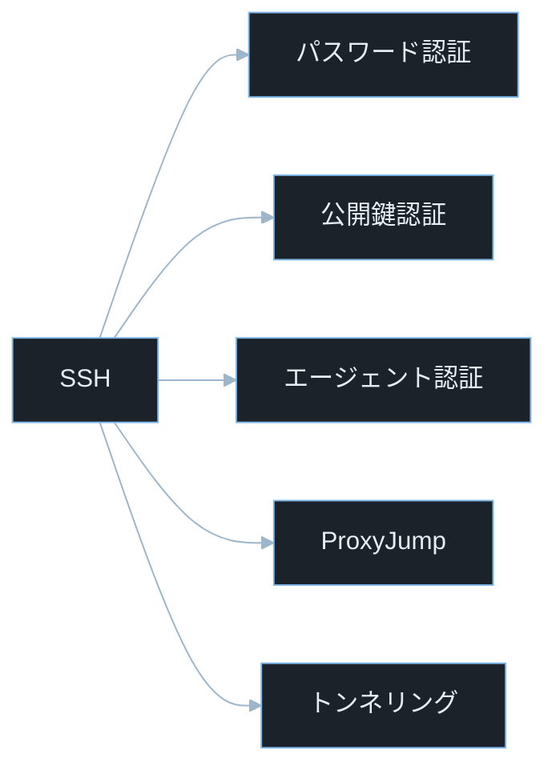
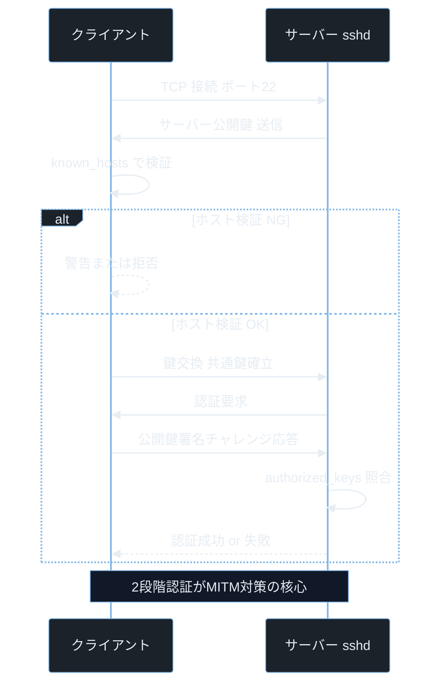
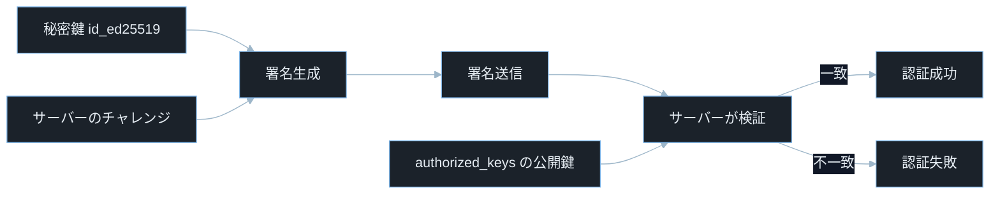
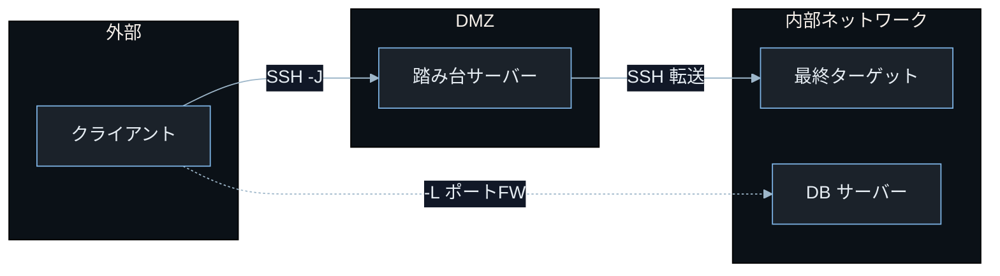
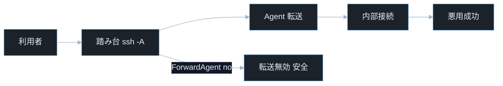

## TL;DR

- SSH（Secure Shell）は暗号化されたリモートシェル接続プロトコルだ。**公開鍵認証**はパスワード認証より安全で、秘密鍵を持つクライアントだけが接続できる。`~/.ssh/authorized_keys` に公開鍵を登録することで設定する。
- **ProxyJump**（`-J` オプション）は踏み台サーバーを経由して最終ターゲットへ接続する。CTF・ペネトレーションテストで「多段 SSH」を使うときの現代的な方法だ。

> **`-J` とは**: ProxyJump を有効化する SSH オプション。`ssh -J 踏み台 最終ターゲット` の形式で踏み台サーバー経由で接続する。
> **`ForwardAgent` とは**: SSH エージェントの認証情報を踏み台サーバーへ転送する設定。便利だが踏み台が侵害されていると悪用される。
- SSH の設定ミス（`PermitRootLogin yes`・`PasswordAuthentication yes`・パーミッション不正な `authorized_keys`）と、SSH エージェントの転送（`ForwardAgent`）の悪用は典型的な攻撃経路だ。

---

## なぜ重要か

「SSH のパスワード認証でリモートサーバーに接続できるなら、公開鍵認証は不要では？」

この問いに即答できないなら、この記事が助けになる。**パスワード認証はブルートフォース・フィッシング・ネットワーク盗聴で破られるが、正しく運用した公開鍵認証はこれらの攻撃を原理的に防ぐ。** SSH の仕組みを知れば、なぜ「設定ファイル 1 行の変更」でサーバーが侵害されるかが見えてくる。

具体的に挙げると：

- CTF のペネトレーションテストで発見した秘密鍵ファイル（`id_rsa`）を使ってターゲットへ直接 SSH ログインする
- 多段 SSH で内部ネットワークのデータベースサーバーに到達する ProxyJump チェーンを設定する
- `authorized_keys` への不正な公開鍵追加が永続化手法として悪用されるため、定期的な棚卸しと変更監査が重要になる
- 開発サーバーの `PermitRootLogin yes` 設定を見つけてブルートフォースで root を取る
- SSH エージェント転送を悪用して踏み台サーバー上の他ユーザーの SSH 鍵を使い回す

> **CTF とは**: Capture The Flag の略。セキュリティ技術を競う演習形式。SSH 操作は Linux マシン問題で必須スキルだ。
> **ペネトレーションテスト（ペンテスト）とは**: 依頼を受けてシステムへ合法的に侵入テストを行うこと。許可を得たシステムのみが対象。

---

## 読む前に確認したい用語

難しい用語は出てきたタイミングで解説するが、以下の概念は記事全体を通して何度も登場する。ざっと目を通してから先に進もう。

**暗号の基礎**
- **公開鍵暗号（非対称暗号）**: 数学的に関連付けられた「公開鍵」と「秘密鍵」のペアを使う暗号方式。公開鍵で暗号化したデータは対応する秘密鍵でのみ復号できる。逆に秘密鍵で署名したデータは公開鍵で検証できる。
- **デジタル署名**: 秘密鍵で作成して公開鍵で検証できる電子的な署名。「このデータの送信者が秘密鍵を持つ本人であること」を証明する。
- **鍵交換（Key Exchange）**: 通信開始時に暗号化用の共通鍵を安全に確立するプロセス。SSH では Diffie-Hellman や ECDH 等を使う。
- **ECDSA / Ed25519**: 楕円曲線暗号を使った署名アルゴリズム。RSA より短い鍵で同等以上の安全性を持つ。SSH の鍵タイプとして推奨される。

**SSH の主要コンポーネント**
- **sshd（SSH デーモン）**: サーバー側で動作する SSH のデーモン（常駐プロセス）。`/etc/ssh/sshd_config` で設定する。
- **ssh_config**: クライアント側の SSH 設定ファイル。`~/.ssh/config`（ユーザー設定）と `/etc/ssh/ssh_config`（システム全体設定）がある。
- **authorized_keys**: サーバーの `~/.ssh/authorized_keys` に登録された公開鍵のリスト。ここに登録された鍵でのみログインを許可する。
- **known_hosts**: クライアントが過去に接続したホストの公開鍵フィンガープリントを記録するファイル（`~/.ssh/known_hosts`）。MITM 攻撃の検出に使う。
- **SSH エージェント（ssh-agent）**: 秘密鍵をメモリに保持してパスフレーズの入力を省略するデーモン。`SSH_AUTH_SOCK` 環境変数でソケットパスを公開する。

**SSH の接続オプション**
- **ProxyJump（`-J`）**: 踏み台サーバーを経由して最終ターゲットへ接続するオプション。`ssh -J 踏み台 最終ターゲット` の形式。
- **ポートフォワーディング**: SSH トンネル経由で別のポートへ通信を転送する機能。`-L`（ローカルフォワード）・`-R`（リモートフォワード）・`-D`（SOCKS プロキシ）がある。
- **ForwardAgent**: SSH エージェントの認証情報を踏み台経由で転送する設定。便利だが悪用リスクがある。

**セキュリティ用語**
- **MITM（Man in the Middle）攻撃**: 通信の途中に攻撃者が入り込んで盗聴・改ざんを行う攻撃。
- **CVE**: Common Vulnerabilities and Exposures の略。世界共通の脆弱性識別番号。
- **CVSS**: Common Vulnerability Scoring System。脆弱性の深刻度を 0.0〜10.0 で評価する指標。

---

## 仕組み

### SSH 認証方式の分類



SSH は単なるリモートシェルではなく、認証・転送・トンネリングを統合したプロトコルだ。各機能の設定ミスが独立した攻撃経路になるため、全体像を把握して設定を管理する必要がある。

---

### SSH 接続の確立フロー



SSH はホスト認証（known_hosts）とユーザー認証（公開鍵・パスワード）を分離している。どちらか一方を省略すると MITM やなりすましの危険が生じる。この 2 層構造を理解することが SSH セキュリティの出発点だ。

**計算量まとめ**

- **鍵交換（ECDH）**: O(1) 回の楕円曲線演算。鍵サイズに比例する定数時間演算。
- **公開鍵認証（Ed25519 署名）**: O(1)。数百マイクロ秒の演算コスト。
- **authorized_keys 検索**: O(n)。n は登録鍵の数。ファイルを先頭から線形探索する。

**SSH 接続の弱点 — known_hosts のスキップ**

`StrictHostKeyChecking no` または `SSHPASS` 等でホスト検証を無効にすると、MITM 攻撃者が本物のサーバーになりすましてクレデンシャルを盗める。スクリプト化された SSH 接続でよく見られる設定ミスだ。

---

### 公開鍵認証の仕組み



サーバーは秘密鍵そのものではなく署名能力を検証している。そのため秘密鍵は通信中に送信されず、盗聴されても鍵は漏洩しない。

**計算量まとめ**

- **Ed25519 鍵生成**: O(1)。数ミリ秒で完了。
- **RSA 鍵生成（4096bit）**: O(鍵長の 3 乗)。数秒かかる場合がある。
- **パスフレーズ検証（PBKDF2）**: 意図的に遅い。ブルートフォース耐性のため。

> **PBKDF2 とは**: パスフレーズから暗号鍵を導出する関数（Password-Based Key Derivation Function 2）。意図的に計算コストを高くして、鍵ファイルを盗まれた場合のブルートフォース攻撃を遅くする。

**公開鍵認証の弱点 — authorized_keys のパーミッション不備**

`~/.ssh/authorized_keys` のパーミッションが適切でないと問題が生じる。

> **パーミッション数値の意味**:
> - `600`: オーナーが読み書き可、グループ・その他は一切不可。`authorized_keys` の適切な設定。
> - `644`: オーナーが読み書き可、その他ユーザーは読み取りのみ。`authorized_keys` には緩すぎる場合がある。
> - `666`: 全ユーザーが読み書き可。`authorized_keys` に設定すると SSH デーモンが無効と判断することがある。
> - `777`: 全ユーザーが読み書き実行可。セキュリティ上最も危険な設定。

`authorized_keys` が他ユーザーに書き込み可能（`666`・`777`）なら、攻撃者が自分の公開鍵を追記してバックドアを作れる。

---

### ProxyJump と SSH トンネリング



SSH の本質は「接続経路を延長しても認証境界は維持される」点にある。そのため踏み台の扱いを誤ると内部ネットワーク全体が露出する。ProxyJump は踏み台に秘密鍵を置かずに済むため、古いプロキシコマンド手法よりはるかに安全だ。

**計算量まとめ**

- **ProxyJump の遅延**: 踏み台を経由する分の RTT（往復時間）が追加される。
- **ポートフォワーディングのスループット**: SSH 暗号化のオーバーヘッドが加わるが、現代の CPU では通常問題にならない。

> **RTT（Round Trip Time）とは**: パケットを送信して応答が返ってくるまでの往復時間。踏み台が増えるほど RTT が積み重なりレイテンシが増加する。

### SSH エージェント転送の悪用フロー



エージェント転送を有効にすると踏み台サーバーの管理者（または root）が `SSH_AUTH_SOCK` ソケット経由で転送された認証情報を悪用できる。`ForwardAgent no`（デフォルト）のままにするか、代わりに `-J` を使うことで安全に多段接続できる。

**SSH トンネルの弱点 — ForwardAgent の悪用**

`ForwardAgent yes` で SSH エージェントを転送すると、踏み台サーバーの管理者（または root）が `SSH_AUTH_SOCK` のソケットにアクセスして、転送されたエージェントの認証情報を悪用できる。踏み台サーバーが侵害されている場合、エージェント転送を通じてクライアントの全 SSH 鍵が使われる可能性がある。

---

## よくある誤解

実装に進む前に、間違えやすいポイントを整理しておく。「あー、そうか」と思えるものがあれば、コードを書くときに思い出してほしい。

**「公開鍵を誰かに知られても問題ない」**
その通りだ。**公開鍵は公開するためのものだ。** ただし `authorized_keys` に登録されている公開鍵を読まれると、「どの鍵がこのサーバーへの接続を許可されているか」がわかる。攻撃者は GitHub や他の公開場所から公開鍵を収集して `authorized_keys` と照合できる。公開鍵の漏洩は直接の問題ではないが、攻撃の糸口になりうる。

**「秘密鍵はファイルとして安全に保管できる」**
秘密鍵ファイル（`~/.ssh/id_ed25519`）のパーミッションは `600`（オーナーのみ読み書き可）でなければならない。**パーミッションが緩いと SSH クライアント自身が「安全でない鍵」として使用を拒否する。** さらにパスフレーズなしの秘密鍵ファイルは、ファイルを盗むだけで即座に使われる。CTF でサーバーから発見した `id_rsa` が即使えるのはパスフレーズがないためだ。

**「`ssh-keygen` で生成した鍵はすべて同じ安全性」**
鍵のアルゴリズムと長さで安全性が大きく異なる。**RSA 1024bit は現在では安全でないとされており、最低 4096bit か Ed25519 を使うべきだ。** `ssh-keygen -t ed25519` が現在の推奨だ。デフォルト（`ssh-keygen` のみ）で生成される鍵は環境によってアルゴリズムや長さが変わるため、明示的に指定する。

**「踏み台サーバーでは `ssh -A`（エージェント転送）を使うべき」**
エージェント転送は便利だが、**踏み台サーバーを信頼している場合のみ有効にすべきだ。** 踏み台が侵害されていると、転送されたエージェント経由でクライアントの秘密鍵が悪用される。代わりに `-J`（ProxyJump）を使えば秘密鍵は転送されない。

**「`/etc/ssh/sshd_config` の変更はすぐに反映される」**
`sshd_config` の変更は `systemctl reload sshd` または `systemctl restart sshd` を実行するまで反映されない。**既存のセッションには影響せず、新しい接続から新設定が適用される。** 設定変更後に誤って `sshd` を停止してしまうとリモートから接続できなくなるため、変更前に別の接続セッションを維持しておくのが安全だ。

---

## 脆弱なコード例

> 本記事の攻撃例は学習環境・CTF・明示的に許可された検証環境のみで実施してください。
> 実システムへの無断検証は不正アクセス禁止法や各国法令・利用規約違反となる可能性があります。

### PHP — SSH 公開鍵をユーザー入力から直接 authorized_keys に追加する

```php
<?php
$user = $_GET['user'] ?? '';
$pubkey = $_POST['pubkey'] ?? '';

$authorized_keys = "/home/{$user}/.ssh/authorized_keys";

if (!empty($pubkey)) {
    file_put_contents($authorized_keys, $pubkey . "\n", FILE_APPEND);
    echo "公開鍵を登録しました";
}
```

> **`$_GET['user']` とは**: HTTP GET リクエストのクエリパラメータ `user` の値を取得する PHP の超グローバル変数。例えば `/keyadd?user=alice` でアクセスすると `$_GET['user']` が `"alice"` になる。
> **`FILE_APPEND` とは**: PHP の `file_put_contents()` オプション。ファイル末尾に追記するフラグ（ファイルを上書きしない）。

**どこが問題か**: `user=../../root` のようなパストラバーサルで `root` の `authorized_keys` に公開鍵を追加できる。さらに `user=alice` でも、任意の公開鍵を追加するだけでその後 SSH でそのユーザーとしてログインできる。コードはユーザー認証も公開鍵の形式検証も行っていない。

```php
<?php
session_start();

if (!isset($_SESSION['authenticated_user'])) {
    http_response_code(401);
    exit("認証が必要です");
}

$pubkey = $_POST['pubkey'] ?? '';

if (!preg_match('/^(ssh-ed25519|ssh-rsa|ecdsa-sha2-nistp256) [A-Za-z0-9+\/=]+ .{0,200}$/', $pubkey)) {
    http_response_code(400);
    exit("無効な公開鍵フォーマットです");
}

$current_user = $_SESSION['authenticated_user'];
$ssh_dir = "/home/{$current_user}/.ssh";
$auth_keys = "{$ssh_dir}/authorized_keys";

if (!is_dir($ssh_dir)) {
    mkdir($ssh_dir, 0700, true);
}

$existing = file_get_contents($auth_keys) ?: '';
if (strpos($existing, trim($pubkey)) !== false) {
    exit("この公開鍵はすでに登録されています");
}

file_put_contents($auth_keys, trim($pubkey) . "\n", FILE_APPEND | LOCK_EX);
chmod($auth_keys, 0600);

echo "公開鍵を登録しました";
```

> **`LOCK_EX` とは**: PHP の `file_put_contents()` のオプション。ファイルへの書き込み中に排他ロックを取得する。複数のリクエストが同時に追記するときの競合を防ぐ。
> **`0700` と `0600` の先頭の `0`**: PHP ではパーミッション値を 8 進数として扱うために先頭に `0` を付ける。`0700` は `.ssh` ディレクトリ（オーナーのみ rwx）・`0600` は `authorized_keys`（オーナーのみ rw）。SSH デーモンはこのパーミッションを要求する。

セッションで認証済みユーザーを確認し、公開鍵フォーマットを正規表現で検証し、パーミッションを適切に設定することで、パストラバーサルと不正な鍵追加を防ぐ。

公開鍵の登録権限は本人確認と入力検証を通過したユーザーだけに限定することが、`authorized_keys` の完全性を守る防御の原則だ。

---

### Node.js — SSH 接続時の StrictHostKeyChecking 無効化

```javascript
const { NodeSSH } = require('node-ssh');
const ssh = new NodeSSH();

async function runRemoteCommand(host, command) {
    await ssh.connect({
        host: host,
        username: 'deploy',
        privateKey: '/home/deploy/.ssh/id_rsa',
        readyTimeout: 5000,
        strictVendor: false,
        algorithms: {
            serverHostKey: ['ssh-rsa', 'ssh-dss'],
        },
    });

    const result = await ssh.execCommand(command);
    return result.stdout;
}
```

> **`strictVendor: false` とは**: node-ssh ライブラリでベンダー識別検証に関する設定。デフォルトから変更することでホスト検証の一部が緩まる場合があるため、運用環境では推奨されない。
> **`ssh-dss` とは**: DSA（デジタル署名アルゴリズム）を使った SSH 鍵タイプ。現在は脆弱とされており、OpenSSH 7.0 以降ではデフォルトで無効化されている。

**どこが問題か**: `algorithms.serverHostKey` に `ssh-dss`（廃止済みの脆弱なアルゴリズム）を許可しているため、脆弱なアルゴリズムを使うサーバーへの接続が許容される。また `host` が外部入力から来る場合、攻撃者が制御するサーバーへ接続させて `id_rsa` の使用を観察できる。正規のサーバーを MITM で偽装されてもホスト検証が弱ければ検出できない。

```javascript
const { NodeSSH } = require('node-ssh');

const ALLOWED_HOSTS = new Set(['192.168.1.10', '192.168.1.11', 'prod.example.com']);
const KNOWN_HOSTS_FILE = path.join(process.env.HOME, '.ssh', 'known_hosts');

async function runRemoteCommand(host, command) {
    if (!ALLOWED_HOSTS.has(host)) {
        throw new Error(`許可されていないホスト: ${host}`);
    }

    const ssh = new NodeSSH();
    await ssh.connect({
        host: host,
        username: 'deploy',
        privateKey: '/home/deploy/.ssh/id_ed25519',
        algorithms: {
            serverHostKey: ['ssh-ed25519', 'ecdsa-sha2-nistp256', 'rsa-sha2-256', 'rsa-sha2-512'],
        },
    });

    const result = await ssh.execCommand(command);
    await ssh.dispose();
    return result.stdout;
}
```

> **`id_ed25519` を使う理由**: RSA（`id_rsa`）より短い鍵で高い安全性を持つ Ed25519 アルゴリズムを使った鍵ファイル。`ssh-keygen -t ed25519` で生成する。
> **`ssh.dispose()` とは**: node-ssh で SSH 接続を明示的に閉じるメソッド。使い終わったら接続を解放してリソースリークを防ぐ。

接続先をホワイトリストで制限し、安全なアルゴリズムのみを許可することで、MITM 攻撃と脆弱なアルゴリズムへのダウングレード攻撃を防ぐ。

接続先と使用アルゴリズムを明示的に制限し、known_hosts によるホスト鍵検証を強制することが SSH クライアントコードの防御原則だ。

---

### Python — SSH 秘密鍵ファイルの不適切な権限とパスの露出

```python
import paramiko
import os
from flask import Flask, request

app = Flask(__name__)

@app.route('/connect')
def connect_server():
    host = request.args.get('host', '')
    key_path = request.args.get('key_path', '/root/.ssh/id_rsa')

    client = paramiko.SSHClient()
    client.set_missing_host_key_policy(paramiko.AutoAddPolicy())

    client.connect(
        hostname=host,
        username='root',
        key_filename=key_path
    )

    stdin, stdout, stderr = client.exec_command('id')
    return stdout.read().decode()
```

> **`paramiko` とは**: Python で SSH 接続を実装するライブラリ。`pip install paramiko` でインストールできる。
> **`AutoAddPolicy()` とは**: paramiko で未知のホストキーを自動的に受け入れるポリシー。`known_hosts` の検証をスキップするため、MITM 攻撃に対して脆弱になる。

**どこが問題か**: `key_path` をクエリパラメータから受け取っているため、`?key_path=/etc/shadow` や `?key_path=/root/.ssh/id_rsa` を指定すれば任意のファイルパスを読む経路になる。さらに `AutoAddPolicy()` でホスト検証を無効にしているため、攻撃者が MITM で偽のサーバーへ誘導できる。`host` もクエリパラメータで制御できるため、SSRF（Server Side Request Forgery）にも使われる。

> **SSRF（Server Side Request Forgery）とは**: サーバーに外部から内部ネットワークのリソースへリクエストを送らせる攻撃。`?host=192.168.1.1` のように内部 IP を指定して、外部から直接アクセスできないサーバーに到達できる。

```python
import paramiko
import os
from flask import Flask, request, abort

app = Flask(__name__)

ALLOWED_HOSTS = {'10.0.1.10', '10.0.1.11'}
SSH_KEY_PATH = '/home/deploy/.ssh/id_ed25519'
KNOWN_HOSTS_PATH = os.path.expanduser('~/.ssh/known_hosts')

@app.route('/connect')
def connect_server():
    host = request.args.get('host', '')

    if host not in ALLOWED_HOSTS:
        abort(400)

    if not os.path.exists(KNOWN_HOSTS_PATH):
        abort(500)

    client = paramiko.SSHClient()
    client.load_host_keys(KNOWN_HOSTS_PATH)
    client.set_missing_host_key_policy(paramiko.RejectPolicy())

    try:
        client.connect(
            hostname=host,
            username='deploy',
            key_filename=SSH_KEY_PATH,
            timeout=10
        )
        stdin, stdout, stderr = client.exec_command('id')
        result = stdout.read().decode()
        return result
    except paramiko.SSHException as e:
        abort(502)
    finally:
        client.close()
```

> **`paramiko.RejectPolicy()` とは**: paramiko で未知のホストキーを拒否するポリシー。`known_hosts` に登録されていないサーバーへの接続を拒否する。セキュアな設定では `RejectPolicy` または `WarningPolicy` を使う。
> **`client.load_host_keys()` とは**: paramiko で `known_hosts` ファイルを読み込み、ホストキーの検証に使うメソッド。

接続先ホストをホワイトリストで制限し、`RejectPolicy` でホスト検証を有効化し、秘密鍵パスをハードコードしてユーザー入力から切り離すことで、SSRF・MITM・任意ファイルアクセスの 3 つの脆弱性を同時に封じる。

接続先と認証情報はユーザー入力から分離し、known_hosts による検証を強制することがSSH クライアントライブラリの安全な使い方の原則だ。

---

## 実践例 / 演習例

### 鍵の生成と登録

```bash
ssh-keygen -t ed25519 -C "user@example.com" -f ~/.ssh/id_ed25519
```

> **`ssh-keygen` とは**: SSH 鍵ペアを生成するコマンド（SSH key generation の略）。
> **`-t ed25519`**: 鍵タイプを Ed25519 に指定する。現在最も推奨されるアルゴリズム。
> **`-C "コメント"`**: 公開鍵に付けるコメント（comment）。誰の鍵かを識別するために使う。メールアドレスが慣習だが任意。
> **`-f ~/.ssh/id_ed25519`**: 生成する鍵ファイルのパスを指定する（file）。省略するとデフォルトパスに保存される。

```bash
ssh-copy-id -i ~/.ssh/id_ed25519.pub user@target-server
```

> **`ssh-copy-id` とは**: 公開鍵をリモートサーバーの `authorized_keys` に安全にコピーするコマンド。手動でコピペするより確実にパーミッションを設定してくれる。`-i` は鍵ファイルを指定するオプション（identity）。

```bash
cat ~/.ssh/id_ed25519.pub >> ~/.ssh/authorized_keys
chmod 600 ~/.ssh/authorized_keys
```

### SSH 設定ファイルの活用

`~/.ssh/config` に接続設定を書くと、`ssh prod` のような短縮コマンドで接続できる。

```
Host bastion
    HostName 203.0.113.10
    User admin
    IdentityFile ~/.ssh/id_ed25519
    Port 22

Host internal-db
    HostName 192.168.1.50
    User dbadmin
    IdentityFile ~/.ssh/id_ed25519
    ProxyJump bastion

Host *.internal
    User ubuntu
    IdentityFile ~/.ssh/internal_key
    ProxyJump bastion
    StrictHostKeyChecking yes
```

> **`ProxyJump bastion`**: この Host に接続するとき、`bastion` を踏み台として使う設定。`ssh internal-db` とだけ入力すれば、自動的に `bastion` 経由で接続される。
> **`IdentityFile`**: この接続に使う秘密鍵のパスを指定するオプション。複数の鍵を使い分けるときに便利。
> **`Host *.internal`**: ワイルドカードを使ってパターンマッチする設定。`*.internal` で末尾が `.internal` のホスト全てに適用される。

### 多段 SSH と ProxyJump

```bash
ssh -J bastion.example.com user@internal.server.local
```

```bash
ssh -J admin@203.0.113.10:22 ubuntu@192.168.1.100
```

```bash
ssh -J host1,host2 user@final-target
```

> **多段 ProxyJump**: `-J` にカンマ区切りで複数ホストを指定すると複数の踏み台を経由できる。`host1 → host2 → final-target` の順に接続する。`ssh -J host1 -J host2` の形式も使えるが、カンマ区切り形式が OpenSSH の推奨記法だ。

### ポートフォワーディング

```bash
ssh -L 5432:db.internal:5432 user@bastion
```

> **`-L [ローカルポート]:[転送先ホスト]:[転送先ポート]`**: ローカルポートフォワーディング。`bastion` 経由で `db.internal:5432`（PostgreSQL のデフォルトポート）をローカルの `localhost:5432` に転送する。これで `psql -h localhost -p 5432` でリモートの DB に接続できる。

```bash
ssh -D 1080 user@bastion
```

> **`-D [ポート]`**: SOCKS5 プロキシを作成するオプション（Dynamic port forwarding）。ブラウザのプロキシ設定を `localhost:1080` にすると、`bastion` 経由でインターネットやイントラネットにアクセスできる。

### sshd の設定を確認する

```bash
sudo grep -E "^(PermitRootLogin|PasswordAuthentication|AuthorizedKeysFile|AllowUsers|Port)" /etc/ssh/sshd_config
```

> **`grep -E "^..."` の `^`**: 行頭にマッチする正規表現。先頭が `#`（コメント）の設定行を除外して実際に有効な設定のみを表示する。

```bash
sudo sshd -T | grep -E "permitrootlogin|passwordauth|pubkeyauth"
```

> **`sshd -T` とは**: sshd の実際に適用されている設定（デフォルト値を含む）をダンプするオプション（test mode）。設定ファイルに書かれていない項目もデフォルト値で表示されるため、実際の動作設定を確認するときに便利だ。

---

## 防御策

### 1. sshd_config のセキュリティ設定

```
PermitRootLogin no
PasswordAuthentication no
PubkeyAuthentication yes
AuthorizedKeysFile .ssh/authorized_keys
AllowUsers deploy admin
MaxAuthTries 3
LoginGraceTime 30
ClientAliveInterval 300
ClientAliveCountMax 2
X11Forwarding no
AllowTcpForwarding no
```

> **`PermitRootLogin no`**: root への直接 SSH ログインを禁止する。root が必要な場合は一般ユーザーでログイン後に `sudo` を使う。
> **`PasswordAuthentication no`**: パスワード認証を無効化する。公開鍵認証のみを許可する最重要設定。
> **`AllowUsers`**: SSH ログインを許可するユーザーをホワイトリストで制限する。`AllowUsers deploy admin` で deploy と admin のみを許可。
> **`MaxAuthTries 3`**: 1 回の接続で最大 3 回まで認証を試みることができる。ブルートフォースを制限する。
> **`ClientAliveInterval 300`**: 300 秒（5 分）ごとにクライアントへ生存確認を送る。
> **`AllowTcpForwarding no`**: TCP ポートフォワーディングを無効化する。攻撃者が SSH トンネルを使って内部ネットワークにアクセスするのを防ぐ。

### 2. 秘密鍵のパーミッションを確認する

```bash
chmod 700 ~/.ssh
chmod 600 ~/.ssh/id_ed25519
chmod 644 ~/.ssh/id_ed25519.pub
chmod 600 ~/.ssh/authorized_keys
chmod 644 ~/.ssh/known_hosts
```

### 3. fail2ban で SSH ブルートフォースを防ぐ

```bash
sudo apt install fail2ban
```

```
[sshd]
enabled = true
port = ssh
maxretry = 3
bantime = 3600
findtime = 600
```

> **`fail2ban` とは**: ログファイルを監視して、一定回数認証失敗したIPアドレスをファイアウォールでブロックするツール。SSH ブルートフォース攻撃の緩和に広く使われる。
> **`bantime = 3600`**: ブロックする時間を秒単位で指定。`3600` は 1 時間。
> **`findtime = 600`**: この時間内（600 秒 = 10 分）に `maxretry` 回失敗したら Ban する。

### 4. SSH 鍵を定期的に棚卸しする

```bash
for user in $(getent passwd | awk -F: '$7 ~ /bash|sh$/ {print $1}'); do
    auth_keys="/home/${user}/.ssh/authorized_keys"
    if [[ -f "$auth_keys" ]]; then
        echo "=== ${user} ==="
        cat "$auth_keys"
    fi
done
```

> **`getent passwd`**: システムの全ユーザー情報を取得するコマンド（get entries from password database の略）。`/etc/passwd` だけでなく LDAP 等のデータベースにも対応する。
> **`awk -F: '$7 ~ /bash|sh$/ {print $1}'`**: フィールド区切りを `:` にして、7 番目のフィールド（ログインシェル）が `bash` か `sh` で終わるユーザーの 1 番目のフィールド（ユーザー名）を出力する。

---

## 実演ラボ案内

### 推奨学習順序

- linux-permissions（ファイルパーミッションと権限の基礎）
- bash-scripting-basics（SSH 自動化スクリプトの基礎）
- ssh-public-key-auth（本記事）
- network-fundamentals（ネットワークと TCP/IP の基礎）
- linux-privilege-escalation（SSH を使った権限昇格の応用）

### Hack The Box

- **Machines**: 多くの Linux マシンで SSH がエントリポイントになる。発見した秘密鍵ファイル（`id_rsa`・`id_ed25519`）が即ログインに使えることが多い。`chmod 600 id_rsa && ssh -i id_rsa user@target` の手順を覚える。
- **Challenges — Misc カテゴリ**: SSH トンネリング・ProxyJump を使ったネットワーク横断問題が出題される。

> **`chmod 600 id_rsa`**: CTF でサーバーから秘密鍵を入手した場合、パーミッションを修正しないと SSH クライアントが「安全でない鍵」として拒否する。接続前に必ず実行する。

### TryHackMe

- **Linux PrivEsc**: SSH 鍵の探索・`authorized_keys` への書き込みによる永続化を演習できる。
- **Post-Exploitation Basics**: SSH エージェントハイジャックの手法を体験できる。

### 自宅 VM（合法演習）

```bash
sudo apt install openssh-server
sudo systemctl enable --now ssh
```

2 台の VM でクライアント・サーバーを構成して、鍵生成から公開鍵認証・ProxyJump の設定まで一通り試す。

```bash
ssh -v user@target-vm
```

> **`ssh -v` とは**: SSH 接続のデバッグ情報を詳細表示するオプション（verbose）。`-vv`・`-vvv` でさらに詳細になる。認証失敗の原因調査やどの鍵が試されているかの確認に使う。

---

## 関連 CVE と被害事例

> **CVE とは**: Common Vulnerabilities and Exposures の略。世界共通の脆弱性識別番号。
> **CVSS スコア**: 脆弱性の深刻度を 0.0〜10.0 で評価した指標。7.0 以上が High・9.0 以上が Critical。

**CVE-2024-6387（OpenSSH — regreSSHion、リモートコード実行）**
OpenSSH サーバー（sshd）の `LoginGraceTime` 処理でシグナルハンドラの競合状態（レースコンディション）が存在し、認証前にリモートから root 権限でコード実行が可能なことが発見された。glibc ベースの Linux システムで 32 ビットのデフォルト設定の場合に悪用できる。2006 年に修正された CVE-2006-5051 の回帰バグだった。攻撃前提: ネットワーク到達性のみ（認証不要）。CVSS スコア 8.1（High）。本記事との関連: sshd・LoginGraceTime・認証前の処理

**CVE-2023-38408（OpenSSH — SSH エージェントのリモートコード実行）**
SSH エージェント（`ssh-agent`）が転送先サーバーからの要求を適切に検証せずに共有ライブラリを読み込む問題が発見された。攻撃者が制御するサーバーへ SSH エージェント転送（`ForwardAgent`）を使って接続すると、そのサーバーがエージェントに悪意あるライブラリをロードさせてリモートコード実行が可能だった。攻撃前提: エージェント転送（`ForwardAgent yes`）が設定されていて攻撃者のサーバーへ接続する。CVSS スコア 9.8（Critical）。本記事との関連: SSH エージェント・ForwardAgent・エージェントハイジャック

**CVE-2016-0777（OpenSSH — Roaming 機能の秘密鍵漏洩）**
OpenSSH クライアント 5.4〜7.1 に存在した実験的な「Roaming」機能に、サーバーが細工したレスポンスを返すことでクライアントの秘密鍵を含むメモリ内容が漏洩する脆弱性があった。接続先サーバーを信頼しているユーザーが悪意あるサーバーへ接続すると、その接続で使った秘密鍵が盗まれる。攻撃前提: クライアントが攻撃者のサーバーへ接続する。CVSS スコア 6.4（Medium）。本記事との関連: 秘密鍵の保護・known_hosts の重要性

---

## 次に学ぶべき記事

- **network-fundamentals** — TCP/IP・ポート・プロトコルの基礎。SSH が使うトランスポート層の理解
- **linux-privilege-escalation** — SSH 秘密鍵の探索・`authorized_keys` 改ざん・エージェントハイジャックを使った権限昇格の総合演習
- **ipc-mechanisms** — SSH トンネル内部で使われる IPC の仕組み

---

## 参考文献

- OpenSSH. "OpenSSH Manual Pages". https://www.openssh.com/manual.html
- OpenSSH. "sshd_config(5)". https://man.openbsd.org/sshd_config
- OpenSSH. "ssh_config(5)". https://man.openbsd.org/ssh_config
- OWASP. "Transport Layer Protection". https://owasp.org/www-project-transport-layer-protection/
- NVD. "CVE-2024-6387 Detail (regreSSHion)". https://nvd.nist.gov/vuln/detail/CVE-2024-6387
- NVD. "CVE-2023-38408 Detail". https://nvd.nist.gov/vuln/detail/CVE-2023-38408
- NVD. "CVE-2016-0777 Detail". https://nvd.nist.gov/vuln/detail/CVE-2016-0777
- Qualys. "regreSSHion: Remote Unauthenticated Code Execution". https://www.qualys.com/2024/07/01/cve-2024-6387/regresshion.txt
