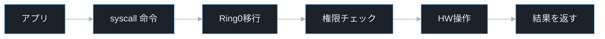
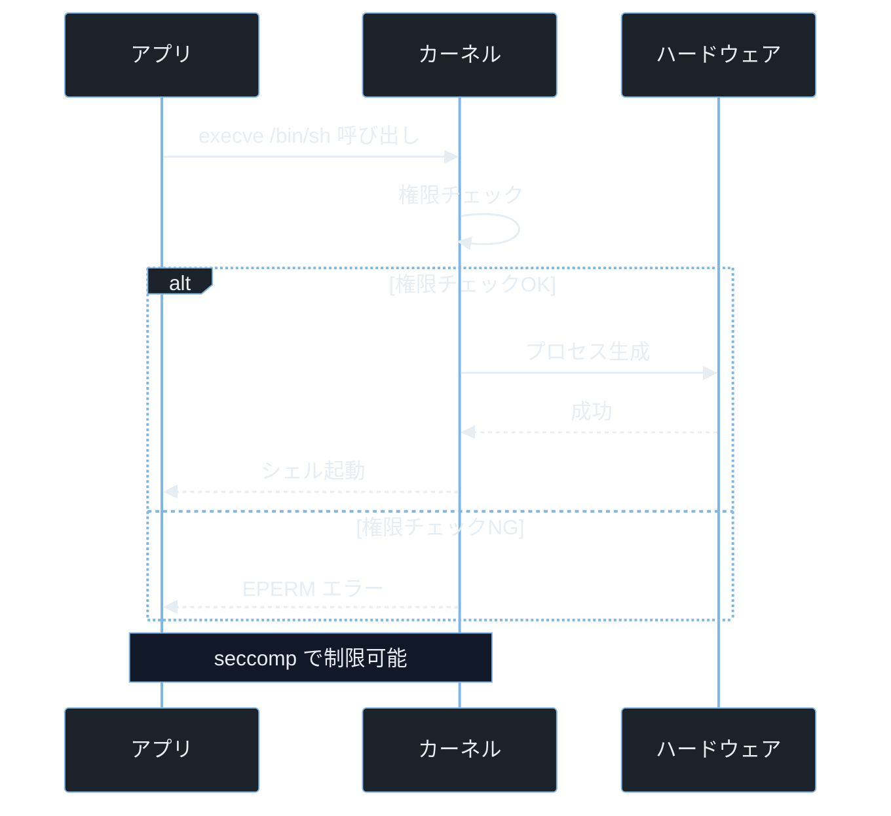
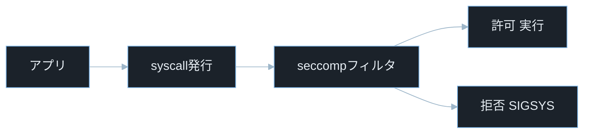

## TL;DR

- システムコール（syscall）は、ユーザー空間で動くプログラムがファイル読み書き・プロセス生成・ネットワーク通信など OS の機能を利用するとき、最終的にカーネル機能利用の入口となる仕組みだ。
- カーネルはすべての syscall を受け取り、呼び出し元の権限を検証してからハードウェアを操作する。この境界を突破できれば、攻撃者は任意コード実行・権限昇格・コンテナエスケープを実現できる。
- 攻撃者は `execve()` で任意コマンドを起動し、`mmap()` でメモリを操作し、脆弱な eBPF 実装や検証不備を悪用して権限昇格につながる場合がある——いずれも syscall を通じて行われる。

> **本記事で前提とする用語の超ざっくり整理**
> - **システムコール（syscall）**: プログラムが OS の機能を呼び出すための仕組み。Linux x86-64 では数百種類以上が定義されている。
> - **syscall 番号**: カーネルへ「どの機能を使いたいか」を伝える整数 ID。`read = 0`、`write = 1`、`execve = 59` など。
> - **ユーザー空間（User Space）**: 一般のプログラムが動く領域。ハードウェアに直接アクセスできない。
> - **カーネル空間（Kernel Space）**: OS のコアが動く特権領域。ハードウェアを直接制御できる。
> - **特権レベル（Ring）**: CPU が「どこまでの命令を実行できるか」を段階的に管理する仕組み。Ring 0 がカーネル（全権限）、Ring 3 が一般プログラム（制限あり）。
> - **execve()**: 指定したプログラムを起動する syscall。コマンドインジェクション攻撃の最終ゴールはここに到達すること。
> - **mmap()**: ファイルや匿名メモリを仮想アドレス空間へ割り当てる syscall（Memory MAP の略）。
> - **fork()**: 現在のプロセスを複製して子プロセスを作る syscall。
> - **seccomp**: Secure Computing の略。プロセスが呼び出せる syscall を制限するカーネル機能。コンテナや sandbox に広く使われる。
> - **strace**: プロセスが発行する syscall をリアルタイムで記録するデバッグツール（system call trace の略）。
> - **CTF**: Capture The Flag。Pwn カテゴリでは syscall の悪用が頻出テーマ。
> - **eBPF**: 拡張 Berkeley Packet Filter の略。Linux カーネル内でプログラムを動的に実行できる仕組み。`bpf()` syscall 経由で操作する。
> - **UID**: User ID の略。Linux がユーザーを識別するための数値 ID。root は 0、一般ユーザーは 1000 以上が多い。

---

## なぜ重要か

先に `process-and-thread` を読んだ方は、プロセスとスレッドがメモリ空間を使うことを知っている。では、ファイルを開いたりネットワーク通信したりするとき、プログラムは一体何をしているのか——その答えがすべて syscall に書かれている。

Web アプリが `/etc/passwd` を読んでいれば `open()` と `read()` が呼ばれる。新しいプロセスを起動すれば `fork()` と `execve()` が呼ばれる。ネットワーク通信があれば `socket()`・`connect()`・`send()` が呼ばれる。

セキュリティの文脈で syscall の知識が必要になる場面は多い。

- **コマンドインジェクション**: `shell_exec()`・`exec()` は内部で `execve()` を呼ぶ。入力が汚染されていると攻撃者が任意の `execve()` を実行できる。
- **権限昇格**: `execve()`・`mmap()`・`mprotect()` の組み合わせがバッファオーバーフロー後の典型的な攻撃チェーンだ。
- **コンテナエスケープ**: コンテナ内のプログラムがホストカーネルの脆弱な syscall ハンドラを呼ぶことで隔離を破る（CVE-2022-0847 など）。
- **サンドボックス検出・回避**: seccomp が `execve()` を禁止しているかどうかを確認する技術は CTF でも頻出だ。
- **マルウェア解析**: `strace` で発行 syscall を記録すれば、難読化されたコードが実際に何をしているかを把握できる。

---

## 仕組み

### ユーザー空間とカーネル空間の分離

CPU は「どの命令を実行できるか」を特権レベル（Ring）で管理している。Linux では次の 2 つが主に使われる。

- **Ring 0（カーネルモード）**: OS カーネルが動作する。すべての命令・すべてのメモリアドレスにアクセスできる。
- **Ring 3（ユーザーモード）**: 一般のプログラムが動作する。ハードウェアへの直接アクセスは禁止され、カーネルが許可した操作だけが実行できる。

この分離がなければ、どのプログラムも任意のメモリを読み書きでき、OS そのものを破壊できてしまう。syscall はこの境界を「安全に越えるための公式手段」だ。

### syscall が呼ばれるまでの流れ

この図は「アプリが `write()` を呼ぶ」ときのフローを示している。見るポイントは Ring3 から Ring0 への特権レベル移行（Ring0移行）、権限チェックの位置、そして seccomp が割り込める場所だ。



具体的な手順は次の通りだ。

- アプリが C 標準ライブラリの `write()` を呼ぶ
- libc が syscall 番号（`write = 1`）をレジスタ `rax` にセットし、`syscall` 命令を実行する
- CPU が Ring 3 から Ring 0 に切り替わり、カーネルの syscall ハンドラが起動する
- カーネルが呼び出し元の UID・権限・引数を検証する
- 検証通過後、ハードウェア（ディスク・ネットワーク・メモリ等）を操作する
- カーネル内部では負の errno 値でエラーを表現し、libc が受け取って通常は戻り値 `-1`・`errno` にマッピングしてアプリに返す

> **syscall 番号と x86-64 Linux の代表例**: `read = 0`、`write = 1`、`open = 2`（現在のユーザーランドでは `openat = 257` が広く利用される）、`mmap = 9`、`execve = 59`、`fork = 57`。これらは `` <sys/syscall.h> `` でマクロとして参照できる。
> **`syscall` 命令とは**: x86-64 CPU がユーザーモードからカーネルモードに高速に切り替えるための命令。古い 32 ビット時代は `int 0x80`（ソフトウェア割り込み）が使われていた。ARM では `svc` 命令がこれにあたる。
> **`int 0x80` とは**: 割り込み番号 128（16進数で `0x80`）を発生させる命令。Linux カーネルがこの割り込みをかつて syscall 処理のエントリポイントとして使っていた。
> **errno とは**: エラーの種類を示すグローバル変数。EPERM = 1（権限不足）、ENOENT = 2（ファイルなし）など。カーネルが負の errno をカーネル内部で返し、libc が変換する。

### 攻撃フロー — execve() への到達と権限チェック

この図は「攻撃者がコマンドインジェクションを通じて `execve()` に到達し、シェルを起動しようとする流れ」と「カーネルの権限チェックでブロックされる流れ」を示している。

> **`/bin/sh` とは**: Linux に標準搭載されているシェルプログラム（`/bin` ディレクトリにある `sh` コマンド）。コマンドの解釈・実行を担当する。`execve('/bin/sh', ...)` の呼び出しに成功すると攻撃者が対話的シェルを手に入れる。
> **EPERM とは**: Error PERMission の略。カーネルが「この操作を行う権限がない」と判断したときに返すエラーコード（errno 値は 1）。libc 経由では `-1` が戻り値になり `errno` に 1 がセットされる。



> **seccomp（Secure Computing）とは**: プロセスが呼び出せる syscall の種類を制限するカーネル機能。Docker コンテナは seccomp プロファイルで `ptrace()`・`mount()` などの危険な syscall を自動的にブロックしている。

---

## 脆弱なコード例

> 本記事の攻撃例は学習環境・CTF・明示的に許可された検証環境のみで実施してください。
> 実システムへの無断検証は不正アクセス禁止法や各国法令、利用規約違反となる可能性があります。

### PHP — shell_exec() を通じた execve() の悪用

```php
<?php
$filename = $_GET['file'] ?? 'output.txt';
$content = shell_exec("cat " . $filename);
echo htmlspecialchars($content ?? '');
```

> **`shell_exec()`**: PHP から OS のシェルコマンドを実行して結果を文字列で返す関数。内部的には `/bin/sh -c "コマンド"` を起動するため、最終的に `execve('/bin/sh', ['-c', コマンド], ...)` という syscall が呼ばれる。
> **`$_GET['file']`**: URL のクエリパラメータ（`?file=xxx`）を取り出す PHP の記法。攻撃者がブラウザから自由な値を送れる。

**問題点**: `$filename` を検証せずにシェルコマンドに連結している。攻撃者が `?file=output.txt;id;cat /etc/passwd` を送ると、セミコロン（`;`）がコマンド区切りとして機能し、3 つのコマンドが順番に実行される。最終的に発行される syscall は `execve('/bin/sh', ['-c', 'cat output.txt; id; cat /etc/passwd'], ...)` だ。

**防御策:**

```php
<?php
$base_dir = realpath('/var/www/files') . '/';
$filename = basename($_GET['file'] ?? '');
$path = realpath($base_dir . $filename);

if ($path === false || strncmp($path, $base_dir, strlen($base_dir)) !== 0) {
    http_response_code(403);
    exit;
}

$content = file_get_contents($path);
echo htmlspecialchars($content);
```

> **`realpath()`**: シンボリックリンクや `../` を解決して絶対パスを返す PHP 関数。戻り値が `false` の場合はファイルが存在しないか読み取り不可。
> **`strncmp($path, $base_dir, strlen($base_dir))`**: 文字列の先頭 N 文字だけを比較する関数。`realpath()` で正規化したパスが `$base_dir` で始まるかを確認する。`strpos()` による比較より安全で、`/var/www/files-extra/` のような隣接ディレクトリへの誤許可を防ぐ。

`shell_exec()` や `system()` をユーザー入力と組み合わせて使わない。どうしても必要な場合は `escapeshellarg()` でエスケープするか、`file_get_contents()` のようなシェルを経由しない API に置き換える。

---

### Node.js — child_process.exec() を通じた execve() の悪用

```javascript
const { exec } = require('child_process');
const express = require('express');
const app = express();

app.get('/lookup', (req, res) => {
    const host = req.query.host || 'localhost';

    exec(`nslookup ${host}`, (err, stdout) => {
        res.send(stdout);
    });
});

app.listen(3000);
```

> **`child_process.exec()`**: Node.js でシェルコマンドを実行するモジュール。`/bin/sh -c` 経由でコマンドを実行するため、`shell_exec()` と同様に `execve('/bin/sh', ...)` syscall が発行される。

**問題点**: `host` を検証せずに `nslookup ${host}` に埋め込んでいる。攻撃者が `?host=localhost;cat /etc/passwd` を送ると、シェルは `nslookup localhost; cat /etc/passwd` として実行する。

**防御策:**

```javascript
const { execFile } = require('child_process');

app.get('/lookup', (req, res) => {
    const host = req.query.host || 'localhost';

    if (!/^[a-zA-Z0-9.\-]+$/.test(host)) {
        return res.status(400).send('不正なホスト名');
    }

    execFile('nslookup', [host], (err, stdout) => {
        res.send(stdout);
    });
});
```

> **`execFile()`**: `exec()` と違い、シェルを経由せずに直接プログラムを起動する。引数を配列で渡すためシェル解釈によるコマンドインジェクションを防げる。発行される syscall は `execve('/usr/bin/nslookup', ['nslookup', 'localhost'], ...)` のように引数が分離されている。なお、対象プログラム（nslookup 等）側の引数解釈による問題は別途考慮が必要だ。

---

### Python — subprocess の shell=True による execve() の悪用

```python
import subprocess
from flask import Flask, request

app = Flask(__name__)

@app.route('/ping')
def ping():
    host = request.args.get('host', 'localhost')
    result = subprocess.run(
        f"ping -c 1 {host}",
        shell=True,
        capture_output=True,
        text=True
    )
    return result.stdout
```

> **`subprocess.run(shell=True)`**: Python でシェルコマンドを実行する関数。`shell=True` を指定すると `/bin/sh -c "コマンド"` 経由で実行されるため、コマンドインジェクションが発生しうる。
> **`flask`**: Python 用の軽量 Web フレームワーク。`request.args.get()` で URL クエリパラメータを取得する。

**問題点**: `host` が `?host=localhost;id` のような値を持つと `ping -c 1 localhost; id` が実行される。`shell=True` がシェル解釈を有効にしているため、セミコロンや `&&`・`｜` が機能してしまう。

**防御策:**

```python
import subprocess
import re
from flask import Flask, request, abort

app = Flask(__name__)

ALLOWED_INPUT = re.compile(r'^[a-zA-Z0-9.\-]{1,253}$')

@app.route('/ping')
def ping():
    host = request.args.get('host', 'localhost')

    if not ALLOWED_INPUT.match(host):
        abort(400)

    result = subprocess.run(
        ['ping', '-c', '1', host],
        capture_output=True,
        text=True,
        timeout=5
    )
    return result.stdout
```

> **`re.compile()`**: 正規表現パターンをコンパイルして再利用可能にする Python 関数。`^[a-zA-Z0-9.\-]{1,253}$` はアルファベット・数字・ドット・ハイフンのみ 1〜253 文字を許可する。
> **`shell=True` を使わない**: コマンドと引数を配列で渡すと `/bin/sh` を経由しないため、シェル特殊文字が解釈されない。

**3 言語共通の防御原則**:
- **許可リスト（Allowlist）方式**: 受け入れる文字・形式を正規表現で明示的に指定し、それ以外をすべて拒否する
- **長さ制限**: 入力値の最大文字数を制限する
- **型・形式検証**: ホスト名なら RFC 準拠の形式、ID なら整数のみ、など意味レベルで検証する

---

## 実践例 / 演習例

### strace でアプリが発行する syscall を監視する

```bash
strace -e trace=execve,open,read,write,connect ls 2>&1 | head -30
```

> **`-e trace=`**: 監視する syscall の種類を絞り込むオプション。`execve,open,read,write,connect` と指定すれば 5 種類のみ表示する。
> **`2>&1`**: 標準エラー出力（`2`）を標準出力（`1`）にリダイレクトする。strace は syscall 情報を標準エラーに出力するため、`｜` でパイプするにはこの変換が必要。
> **`head -30`**: 先頭 30 行だけ表示するコマンド。`head` は出力が長すぎる場合に先頭 N 行に絞るときに使う。

`ls` コマンドが発行する `execve()` の行を見てみると次のようになる。

```
execve("/usr/bin/ls", ["ls"], 0x... /* 環境変数 */) = 0
```

1 行に「syscall 名・引数・戻り値」がすべて書かれている。引数の `["ls"]` が `argv`（引数配列）、`0x...` が `envp`（環境変数ポインタ）だ。

### PHP アプリが裏で何の syscall を発行しているか調べる

```bash
strace -f -p $(pgrep php-fpm | head -1) -e trace=execve 2>&1 | grep execve
```

> **`-f`**: 子プロセス（fork/clone で生成されたプロセス）も追跡するオプション。PHP-FPM はリクエスト処理に子プロセスを使うためこのフラグが必要。
> **`-p [PID]`**: 実行中のプロセスに後からアタッチする。`$(pgrep php-fpm | head -1)` で PHP-FPM の先頭プロセス ID を取得している。
> **`pgrep`**: プロセス名でプロセス ID を検索するコマンド（Process GREP の略）。
> **`grep execve`**: `grep` は指定文字列を含む行だけを抽出するコマンド（Global Regular Expression Print の略）。ここでは strace の出力から `execve` を含む行だけを絞り込む。

### /proc/[PID]/syscall で現在の syscall を確認する

```bash
cat /proc/$(pgrep sleep | head -1)/syscall
```

> **`/proc/[PID]/syscall`**: 指定プロセスが現在実行中の syscall 番号と引数をリアルタイムで表示する仮想ファイル。`[PID]` は実際のプロセス ID（Process Identifier）に置き換える。

出力例: `35 0x1 0x55d... 0x1000 0x0 0x0 0x7ffe... 0x7ffe...`

先頭の `35` が syscall 番号で、x86-64 Linux の syscall テーブルでは 35 は `nanosleep`（指定時間スリープする syscall）に対応する。`sleep` コマンドが実行中のためこの番号が表示されている。

> **`nanosleep` とは**: ナノ秒単位でスリープする syscall（番号 35）。`sleep` コマンドはこれを呼んで待機する。

### seccomp フィルタが syscall をブロックする仕組み

この図は「seccomp フィルタが有効なプロセスが syscall を発行したとき、フィルタが許可か拒否を判定する流れ」を示している。



> **`SIGSYS` とは**: syscall が seccomp によりブロックされたときにプロセスへ送られるシグナル。デフォルトでプロセスをクラッシュさせる。

---

## 防御策

### 1. ユーザー入力をシェルに渡さない

`shell_exec()`・`system()`・`exec()`（PHP）、`child_process.exec()`（Node.js）、`subprocess.run(shell=True)`（Python）はすべてシェルを経由するため、ユーザー入力を渡してはいけない。シェルを経由しない API（`execFile()`・`subprocess.run(['cmd', 'arg'])`）を使い、許可リスト方式で入力を検証する。

### 2. seccomp BPF フィルタで不要な syscall を禁止する

`SECCOMP_MODE_STRICT`（`read`・`write`・`exit`・`sigreturn` のみ許可する厳格モード）は一般的な Web アプリではほぼ動作しない。実運用では BPF フィルタ方式（`SECCOMP_MODE_FILTER`）を使って許可する syscall を個別に指定する。

```python
import ctypes
import ctypes.util

libc = ctypes.CDLL(ctypes.util.find_library('c'), use_errno=True)

PR_SET_SECCOMP = 22
SECCOMP_MODE_STRICT = 1

result = libc.prctl(PR_SET_SECCOMP, SECCOMP_MODE_STRICT, 0, 0, 0)
if result != 0:
    raise OSError("seccomp の設定に失敗しました（Web アプリには STRICT は適さない）")
```

> **`prctl()`**: プロセス自身の動作を制御する syscall（Process ConTRoL の略）。`PR_SET_SECCOMP` + `SECCOMP_MODE_STRICT` で厳格モード。実運用では Docker の seccomp プロファイルや `libseccomp` ライブラリを使って BPF フィルタを設定する。

Docker・Kubernetes・Chrome などはより細かい BPF フィルタ付きの seccomp プロファイルを使っている。

### 3. ptrace() を制限してデバッガアタッチを禁止する

本番環境では `ptrace()` syscall を禁止することで、外部からのプロセスへのデバッガアタッチを防ぐ。

```bash
echo 1 | sudo tee /proc/sys/kernel/yama/ptrace_scope
```

> **`ptrace()`**: 別プロセスにアタッチして syscall・メモリ・レジスタを監視・変更できる強力な syscall。デバッガ（GDB・strace）はこれを使う。悪用されるとプロセスのメモリから秘密情報を抜き取られる。
> **`/proc/sys/kernel/yama/ptrace_scope`**: `0` = 制限なし、`1` = 親プロセスのみ許可、`2` = カーネルモジュールのみ許可、`3` = 完全禁止。

### 4. コンテナ実行時は最小権限の seccomp プロファイルを使う

```bash
docker run --rm --security-opt seccomp=/etc/docker/seccomp-profile.json myapp
```

Docker のデフォルト seccomp プロファイルはすでに 44 の危険な syscall を禁止しているが、さらに絞り込むことでコンテナエスケープのリスクを減らせる。

### 5. ASLR が有効になっているかを確認する

```bash
cat /proc/sys/kernel/randomize_va_space
```

> この値の意味は次の通り。
> - `0`: ASLR 無効（脆弱な状態。CTF 環境や検証時に無効化することがある）
> - `1`: スタック・mmap・VDSO を部分的にランダム化
> - `2`: ヒープも含めて完全ランダム化（本番環境の通常設定）

CTF でまず確認するコマンドのひとつだ。`0` であれば攻撃者がアドレスを固定値で予測できるため、エクスプロイトが容易になる。

---

## 実演ラボ案内

### 推奨学習順序

- linux-command-basics（`ls`・`cat`・`ps` の基礎）
- process-and-thread（プロセス・スレッドの概念。`fork()` の理解に役立つ）
- memory-model（仮想アドレス空間。`mmap()` との関連を理解しやすくなる）
- syscall-basics（本記事）
- コマンドインジェクション実践
- seccomp バイパス技法

### Hack The Box

- **Challenges — Pwn カテゴリ**: `ret2syscall` 問題では ROP チェーンで `execve('/bin/sh', NULL, NULL)` syscall を直接発行する。syscall 番号とレジスタ設定の知識が直接使える。
- **Challenges — Web カテゴリ**: コマンドインジェクション問題で `strace` を使って何の syscall が呼ばれるか追跡するとフラグへの経路が見えやすい。

> **ROP（Return-Oriented Programming）とは**: NX（実行不可メモリ保護）を迂回するために、既存コード断片（ガジェット）を `ret` 命令で繋いで任意の操作を実現する攻撃手法。`ret2syscall` は ROP で `execve()` syscall を直接発行する。

### TryHackMe

- **Linux Fundamentals**: `strace`・`ltrace` の基礎操作を練習できる。
- **Intro to x86-64**: syscall がどのようにアセンブリレベルで呼ばれるかを確認できる。

### 自宅 VM（合法環境）

```bash
strace -c ls /tmp 2>&1
```

> **`strace -c`**: `-c`（count）フラグで「どの syscall が何回・合計何秒かかったか」の統計をまとめて表示する。`ls` 一回で 20 種類以上の syscall が呼ばれていることが分かる。

```bash
python3 -c "import ctypes; ctypes.CDLL(None).write(1, b'hello syscall\n', 14)"
```

これは Python から C の `write()` 関数を直接呼ぶ例。最終的に `write(1, 'hello syscall\n', 14)` syscall（`fd=1` は標準出力、`14` はバイト数）が発行される。

> **`CDLL(None)`**: Python の `ctypes` で現在のプロセスにリンクされている libc を取得する方法。`None` を渡すと `dlopen(NULL)` と同等で、デフォルトの共有ライブラリが使われる。

---

## よくある誤解

**誤解 1: 「Python / PHP は高水準言語だから syscall は関係ない」**
すべての言語ランタイムは最終的に syscall を発行する。ファイルを開くと `open()`/`openat()`、ネットワーク通信すると `connect()`・`send()` が呼ばれる。高水準 API はそれらの薄いラッパーにすぎない。

**誤解 2: 「syscall は何でも自由に呼べる」**
ユーザー空間からカーネル空間への移行時に、カーネルは呼び出し元の UID・GID・ケーパビリティ（capability）を必ず検証する。たとえば一般ユーザーが `mount()` を呼ぶと `EPERM` エラーが返る。seccomp が有効なら禁止された syscall は `SIGSYS` シグナルでプロセスが kill される。

> **ケーパビリティ（capability）とは**: root の権限を細かく分割した仕組み。`CAP_NET_BIND_SERVICE`（1024 番以下のポートにバインド）・`CAP_SYS_PTRACE`（ptrace 許可）・`CAP_SYS_ADMIN`（広範な管理操作）などがある。コンテナは通常、多くのケーパビリティを持たない状態で起動する。

**誤解 3: 「strace は本番環境では使えない」**
`strace -p [PID]` はルート権限があれば実行中のプロセスにアタッチできる。ただし `ptrace_scope` が 1 以上だと制限される。インシデント対応や forensics（デジタルフォレンジクス：攻撃の痕跡を解析する調査手法）では本番環境で strace を使う場面がある。

**誤解 4: 「seccomp を設定すればコマンドインジェクションを防げる」**
seccomp は「どの syscall を許可するか」を制御するが、許可された syscall（`execve` など）の引数は制御しない。`execve('/bin/sh', ...)` を禁止していなければコマンドインジェクションは成立する。入力バリデーションと seccomp は補完関係であり、どちらか一方だけでは不十分だ。

**誤解 5: 「コンテナ内では外部への syscall は届かない」**
Docker コンテナはホスト OS のカーネルを共有している。コンテナ内のプロセスが発行する syscall はホストカーネルの syscall ハンドラに届く。カーネル自体に脆弱性があれば（CVE-2022-0847 など）、コンテナ内から syscall を悪用してホストを攻撃できる。

---

## 関連 CVE と被害事例

> **CVE とは**: Common Vulnerabilities and Exposures の略。世界共通の脆弱性識別番号。
> **CVSS スコア**: 脆弱性の深刻度を 0.0〜10.0 で評価した指標。9.0 以上が Critical。

**CVE-2022-0847（Dirty Pipe）**
Linux カーネルの `pipe()` と `splice()` syscall の実装にある競合状態。`O_RDONLY` で開いたファイルのページキャッシュをパイプバッファ経由で上書きでき、一般ユーザーが `/etc/passwd` や SUID バイナリを改ざんして root 権限を取得できた。CVSS スコア 7.8。本記事との関連: syscall の引数チェック不備

> **`pipe()`**: 2 つのファイルディスクリプタを作成し、一方への `write()` がもう一方からの `read()` で読める「パイプ」を作る syscall。プロセス間通信に使う。
> **`splice()`**: パイプとファイル間でカーネルバッファ内データをコピーするゼロコピー syscall。

**CVE-2016-5195（Dirty COW）**
Linux カーネルの Copy-on-Write（COW）実装の競合状態。`mmap()` で読み取り専用にマップしたファイルに `write()` syscall と `madvise(MADV_DONTNEED)` を競合させることで、書き込み不可のメモリを上書きできた。9 年間存在した脆弱性として大きな注目を集めた。CVSS スコア 7.0。本記事との関連: mmap・write syscall の競合悪用

> **`madvise(MADV_DONTNEED)`**: カーネルに「このメモリページはもう要らない」とヒントを与える syscall。COW ページを強制リセットさせる効果があり、Dirty COW の攻撃チェーンの一部として使われた。

**CVE-2022-23222（Linux eBPF 特権昇格）**
`bpf()` syscall を通じてロードされる eBPF プログラムの検証器（verifier）に、ポインタ演算のバグがあった。脆弱な eBPF 検証器の不備を悪用して一般ユーザーがカーネルメモリを読み書きし、root 権限を取得できた。CVSS スコア 7.8。本記事との関連: bpf() syscall の検証不備

> **eBPF verifier とは**: `bpf()` syscall でロードされるプログラムが「安全かどうか」を事前に検証するカーネル内の検証器。無限ループや不正なメモリアクセスを禁止する役割を持つが、検証ロジック自体にバグがあると迂回される。

---

## 次に学ぶべき記事

- **コマンドインジェクション完全解説** — `execve()` に到達するための注入パターンとバイパス技法を網羅する
- **ret2syscall — ROP チェーンで execve を直接呼ぶ** — Pwn CTF でのスタックバッファオーバーフロー + syscall 直接呼び出しの実践
- **seccomp バイパス技法** — seccomp フィルタを解析して許可された syscall だけで攻撃を組み立てる方法

---

## 参考文献

- Linux man-pages. "syscall(2)". https://man7.org/linux/man-pages/man2/syscall.2.html
- Linux man-pages. "execve(2)". https://man7.org/linux/man-pages/man2/execve.2.html
- Linux man-pages. "seccomp(2)". https://man7.org/linux/man-pages/man2/seccomp.2.html
- NVD. "CVE-2022-0847 Detail". https://nvd.nist.gov/vuln/detail/CVE-2022-0847
- NVD. "CVE-2016-5195 Detail". https://nvd.nist.gov/vuln/detail/CVE-2016-5195
- NVD. "CVE-2022-23222 Detail". https://nvd.nist.gov/vuln/detail/CVE-2022-23222
- OWASP. "Command Injection". https://owasp.org/www-community/attacks/Command_Injection
- Docker Docs. "Seccomp security profiles for Docker". https://docs.docker.com/engine/security/seccomp/
