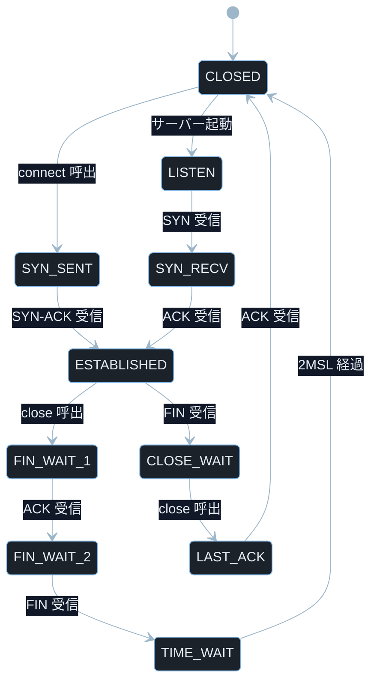
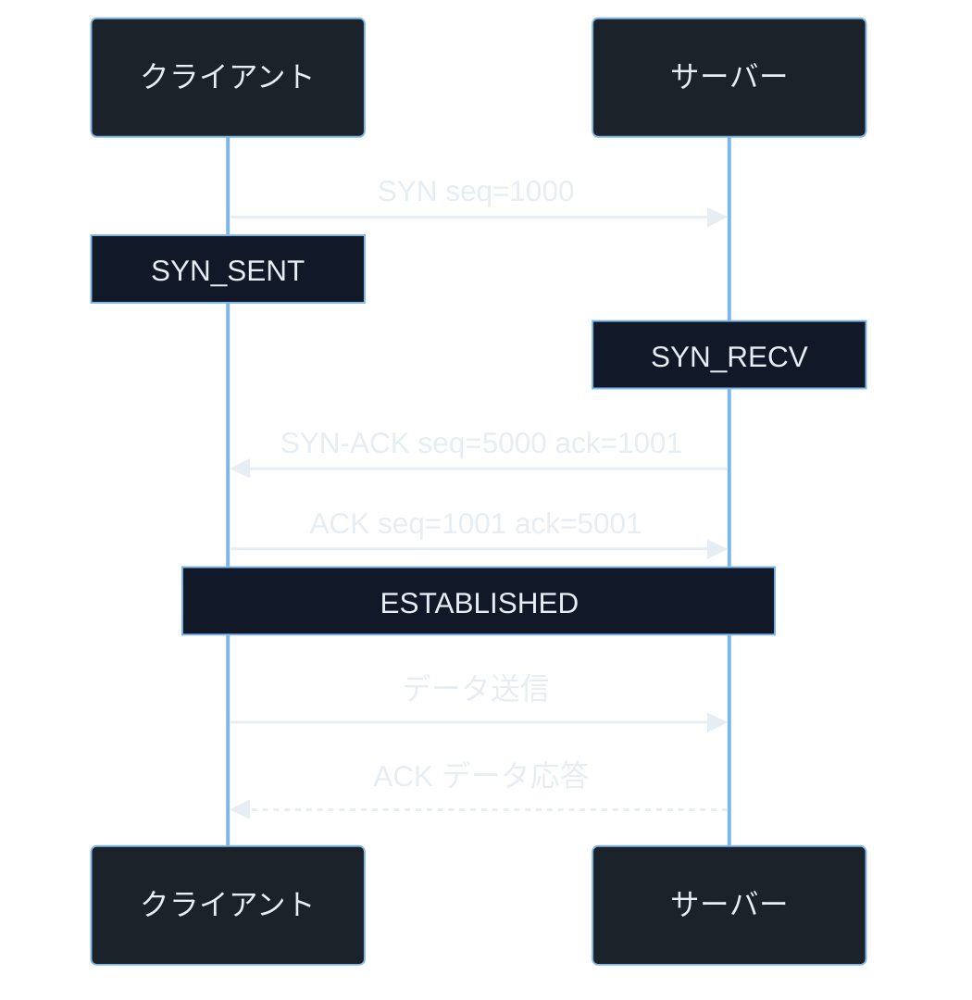
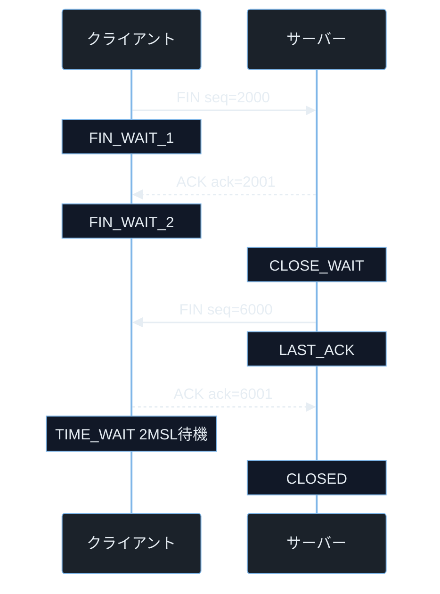
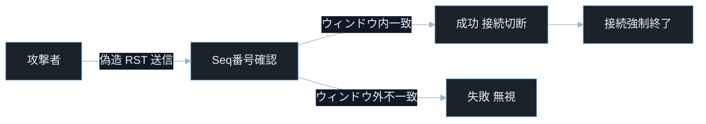

## TL;DR

- **TCP の接続確立**は SYN → SYN-ACK → ACK の 3 ステップ（3-way handshake）で行われる。各パケットにはシーケンス番号とフラグが含まれ、サーバーは接続ごとにリソースを確保する。この「確立前にリソースを使う」仕様が SYN フラッド攻撃の根本原因だ。
- **シーケンス番号**は送受信するバイト数を追跡してパケットの順序と欠損を検出する。現代の OS はシーケンス番号を擬似ランダムに生成する（ISN ランダム化）が、予測できた時代には TCP セッションハイジャック攻撃が成立していた。
- **接続終了**は FIN → ACK → FIN → ACK の 4 ステップで行われ、終了後は `TIME_WAIT` 状態で一定時間待機する。`TIME_WAIT` が大量に溜まるとポートが枯渇し、新しい接続が張れなくなる。

---

## なぜ重要か

「TCP の詳細はライブラリが処理するから知らなくていいのでは？」

この問いに即答できないなら、この記事が助けになる。**TCP のライフサイクルを理解しないと、SYN フラッド・TCP リセット攻撃・TIME_WAIT 枯渇といった攻撃の原理も防御策も手探りになる。** TCP の仕組みを知れば、Wireshark でキャプチャしたパケットを読んで「今何が起きているか」を正確に把握できる。

具体的に挙げると：

- CTF の Forensics で `.pcap` ファイルを解析し、TCP のフラグとシーケンス番号から接続状態の異常を見つける
- 本番サーバーが `ss -s` で大量の `SYN_RECV` を返しているのを見て SYN フラッド攻撃を検知する
- ペネトレーションテストで `nmap -sS`（SYN スキャン）がなぜポートスキャンに有効かを理解する
- アプリケーションの `close()` 漏れで `CLOSE_WAIT` が積み上がる理由をデバッグする
- `TIME_WAIT` が枯渇してデプロイ直後に接続失敗が続くインシデントを再現・解消する

> **CTF とは**: Capture The Flag の略。セキュリティ技術を競う演習形式。Forensics はパケット・メモリダンプ解析が主題。
> **ペネトレーションテスト（ペンテスト）とは**: 依頼を受けてシステムへ合法的に侵入テストを行うこと。許可を得たシステムのみが対象。

---

## 読む前に確認したい用語

難しい用語は出てきたタイミングで解説するが、以下の概念は記事全体を通して何度も登場する。ざっと目を通してから先に進もう。

**TCP の基礎構造**
- **セグメント（Segment）**: TCP がデータを分割した送受信単位。各セグメントには TCP ヘッダ（20〜60 バイト）とデータが含まれる。
- **シーケンス番号（Sequence Number）**: 送信済みバイト数を示す 32 ビットの番号。接続ごとにランダムな値（ISN）から始まり、送るバイト数ぶんだけ増加する。
- **確認応答番号（Acknowledgment Number / ACK 番号）**: 「次にこのバイトから受け取りたい」を相手に伝える番号。受信済みシーケンス番号 + 1 の値を送る。
- **ウィンドウサイズ（Window Size）**: 受信バッファに余裕がある量。相手が一度に送ってよいバイト数の上限（フロー制御）。

**TCP フラグ（制御ビット）**
- **SYN（Synchronize）**: 接続要求。ISN を伝えて「接続を開始したい」を示す。
- **ACK（Acknowledgment）**: 確認応答。受信したことを相手に知らせる。
- **FIN（Finish）**: 接続終了要求。「これ以上送信するデータはない」を示す。
- **RST（Reset）**: 強制リセット。異常な状態を検知したときに接続を即座に切断する。
- **PSH（Push）**: データをすぐにアプリケーションに渡すよう指示する。

**TCP の状態機械**
- **LISTEN**: サーバーが接続を待機している状態。
- **SYN_SENT**: クライアントが SYN を送って SYN-ACK を待っている状態。
- **SYN_RECV**: サーバーが SYN を受け取って SYN-ACK を返し、ACK を待っている状態。
- **ESTABLISHED**: 接続が確立されてデータ転送中の状態。
- **TIME_WAIT**: 接続終了後に遅延パケットを処理するために待機する状態。デフォルトは 2MSL（最大セグメント生存時間の 2 倍、通常 1〜4 分）。
- **CLOSE_WAIT**: FIN を受け取ったがアプリケーションがまだクローズを呼んでいない状態。

---

## 仕組み

### TCP 状態遷移の全体マップ



TCP は状態機械として実装されており、各状態でどのパケットを受け付けるかが厳密に定義されている。TCP の多くの攻撃は状態遷移の途中状態を悪用する。そのため現在どの状態にいるかを把握することが防御の第一歩になる。

**計算量まとめ**

- **状態遷移の判定**: O(1)。フラグのビット演算で即座に決まる。
- **接続テーブル検索**: O(1)。ハッシュテーブルで `(srcIP, srcPort, dstIP, dstPort)` の 4 タプルを参照。

**状態遷移の弱点 — TIME_WAIT の蓄積**

短時間に大量のコネクションを開閉すると、`TIME_WAIT` 状態のソケットが蓄積してローカルポートを占有する。デフォルト（`ip_local_port_range`）では 32768〜60999 のポートが使えるが、全て `TIME_WAIT` で埋まると新規接続が張れなくなる。`SO_REUSEADDR` はサーバー再起動時の待機ソケット再利用に有効だが、TIME_WAIT 問題そのものの万能な解決策ではない。アプリケーション側での接続管理と OS チューニングを組み合わせて対処する。

---

### 3-way handshake の詳細



3-way handshake でクライアントとサーバーは互いの ISN（Initial Sequence Number）を交換する。`seq=1000` と `seq=5000` はそれぞれの ISN だ。ACK 番号は「次に受け取りたいバイト番号」なので `ISN + 1` になる。SYN と FIN はそれぞれシーケンス空間を 1 消費するため、ACK は ISN+1 の値になる。handshake の本質は双方が送受信状態を同期することにある。この同期が崩れるとセッションハイジャックや DoS の原因になる。

> **ISN（Initial Sequence Number）とは**: TCP 接続ごとにランダム生成されるシーケンス番号の初期値。現代の OS はセキュリティのためにランダム化している。`seq=1000` は例示の値で、実際は 0〜2³²−1 のランダムな値になる。

**計算量まとめ**

- **handshake の往復**: O(1)。RTT（ラウンドトリップタイム）に比例した一定時間。
- **SYN-ACK 生成（SYN Cookie）**: O(1)。HMAC 計算でテーブル不要のバックログ処理。

> **RTT（Round Trip Time）とは**: パケットを送信して返答が届くまでの往復時間。日本国内では数ミリ秒・海外では数十〜数百ミリ秒。handshake に RTT × 1.5 かかる。

**handshake の弱点 — SYN フラッド攻撃**

3-way handshake の 2 ステップ目でサーバーは半開き接続エントリをバックログキューに追加する。ACK が届かなければそのエントリは数秒〜数十秒残り続ける。攻撃者が大量の SYN を送り続けるとバックログキューが溢れ、正当な接続が弾かれる（SYN フラッド DDoS）。Linux の `tcp_syncookies` を有効にするとキューなしで接続を確立でき、SYN フラッドを大幅に緩和できる。

> **`tcp_syncookies` とは**: SYN Cookie を有効にするカーネルパラメータ。SYN を受けた際にバックログキューを使わず、シーケンス番号に接続情報を埋め込む手法。`sysctl -w net.ipv4.tcp_syncookies=1` で有効にする。

---

### FIN による正常終了と TIME_WAIT



TCP の終了は「アクティブクローズ側」（最初に FIN を送る側）が `TIME_WAIT` に入る。**`TIME_WAIT` は重複した古いパケットが届いた場合に正しく処理するための保護期間だ。** この 2MSL 待機がないと、古い接続のパケットが新しい接続に混入してデータ破壊が起きる。TCP は終了処理にも状態管理を行う。この状態管理の負荷が TIME_WAIT 枯渇などの運用問題につながる。

**計算量まとめ**

- **FIN 処理**: O(1)。状態遷移と ACK 生成のみ。
- **`TIME_WAIT` からの復帰**: O(1)。タイマー満了で自動的に `CLOSED` へ遷移。

> **2MSL とは**: MSL（Maximum Segment Lifetime、最大セグメント生存時間）の 2 倍。RFC では 2 分を推奨している。`tcp_fin_timeout` は `FIN_WAIT_2` 状態を保持する最大時間であり、`TIME_WAIT` の期間とは別のパラメータだ。Linux の TIME_WAIT はカーネル実装に依存し、通常は約 60 秒前後で管理される。

**FIN/TIME_WAIT の弱点 — CLOSE_WAIT 蓄積**

サーバーが FIN を受け取った後、アプリケーションが `close()` を呼ばないと `CLOSE_WAIT` で停止する。`CLOSE_WAIT` は「相手から FIN を受信後にアプリケーションが `close()` を呼んでいない」状態であり、根本的な対策はアプリケーション側で確実に `close()` を呼ぶことだ。`close()` 忘れ・例外処理の漏れ・コネクションプールのバグがあると `CLOSE_WAIT` が積み上がり、ファイルディスクリプタが枯渇してサーバーが新規接続を受け付けられなくなる。

---

### TCP リセット攻撃フロー



RST パケットは接続を即座に切断する。攻撃者が被害者の TCP 接続のシーケンス番号を正確に予測して偽造 RST を送ると、正当な接続を強制切断できる。シーケンス番号が予測できない（ISN ランダム化済み）場合は成立しない。

**計算量まとめ**

- **RST 検証**: O(1)。シーケンス番号がウィンドウ内かどうかをチェックするだけ。
- **シーケンス番号ブルートフォース**: O(2³²)。32 ビット空間の探索。現実的ではない。

**RST 攻撃の弱点 — ウィンドウ内シーケンス番号**

RST パケットが受け入れられる条件は「シーケンス番号が受信ウィンドウ内に収まること」だ。ウィンドウサイズが大きいほど有効な RST の範囲が広がりブルートフォースが容易になる。RFC 5961（2010）では RST の検証を強化して、より厳密なシーケンス番号チェックを要求している。

---

## よくある誤解

実装に進む前に、間違えやすいポイントを整理しておく。「あー、そうか」と思えるものがあれば、コードを書くときに思い出してほしい。

**「3-way handshake は 3 パケット交換するから 3RTT かかる」**
handshake 自体は 1.5 RTT で完了する。SYN が届いて SYN-ACK が返り（1 RTT）、ACK が届いた時点でサーバーは接続確立と見なすからだ。**TLS を使う場合は追加の TLS ハンドシェイクが必要になる**ため、TLS 1.3 では 1-RTT（または 0-RTT）への最適化が行われている。

**「FIN を送ればすぐに接続が閉じる」**
FIN は「自分はもう送信するデータがない」という意味だが、相手はまだデータを送り続けられる。**FIN を送った後でも相手からのデータ受信は続く**（半二重クローズ）。`TIME_WAIT` を経て完全にクローズするまで接続エントリは残る。

**「RST を受け取ったら接続エラーが起きる」**
RST を受け取った側はアプリケーションに `Connection reset by peer` エラーを通知する。攻撃者が偽造 RST を送ると、**正当な通信を切断させてサービス妨害や中間者攻撃の補助に使える**。VPN やトンネル等でランダムな RST が届く場合もあるため、原因特定には Wireshark でパケットを確認する。

**「TIME_WAIT は無駄だから無効化すべき」**
`TIME_WAIT` には重要な役割（遅延パケットの処理・旧接続のパケットが新接続に混入しないよう保護）がある。**`net.ipv4.tcp_tw_reuse` や `SO_REUSEADDR` を適切に使えば `TIME_WAIT` を減らせる**が、無効化すると古いパケットによるデータ破壊リスクがある。

**「SYN スキャン（ハーフオープンスキャン）はバレない」**
`nmap -sS` による SYN スキャンは ACK を返さずに接続を中断するため「ステルス」と呼ばれるが、**現代のファイアウォール・IDS はハーフオープン接続を検出する**。`SYN_RECV` 状態で終わる接続が多数あればスキャンを疑える。完全にステルスとは言えない。

> **IDS（Intrusion Detection System）とは**: 不正アクセスや攻撃を検知するシステム（侵入検知システム）。パケットパターンや接続の異常を監視する。

---

## 脆弱なコード例

> 本記事の攻撃例は学習環境・CTF・明示的に許可された検証環境のみで実施してください。
> 実システムへの無断検証は不正アクセス禁止法や各国法令・利用規約違反となる可能性があります。

### PHP — ソケットのタイムアウト未設定によるリソースリーク

```php
<?php
function fetch_data(string $host, int $port): string {
    $sock = socket_create(AF_INET, SOCK_STREAM, SOL_TCP);
    socket_connect($sock, $host, $port);
    socket_write($sock, "GET / HTTP/1.1\r\nHost: {$host}\r\nConnection: close\r\n\r\n");

    $response = '';
    while ($chunk = socket_read($sock, 4096)) {
        $response .= $chunk;
    }
    return $response;
}

echo fetch_data('10.0.0.1', 80);
```

> **`socket_create(AF_INET, SOCK_STREAM, SOL_TCP)` とは**: PHP でソケットを作成する関数。`AF_INET` は IPv4・`SOCK_STREAM` は TCP・`SOL_TCP` は TCP プロトコルを指定する定数。

**どこが問題か**: `socket_connect()` にタイムアウトを設定していないため、応答しないホストへの接続はシステムデフォルト（数分）まで待ち続ける。また `socket_close()` を呼んでいないため、例外やエラーが発生した場合にソケットがリークしてファイルディスクリプタ枯渇の原因になる。多数のリクエストでソケットリークが積み上がるとサーバーが新規接続を受け付けられなくなる。

```php
<?php
function fetch_data(string $host, int $port, int $timeout_sec = 5): string {
    $sock = socket_create(AF_INET, SOCK_STREAM, SOL_TCP);
    if ($sock === false) {
        throw new RuntimeException("ソケット作成失敗");
    }

    socket_set_option($sock, SOL_SOCKET, SO_RCVTIMEO, ['sec' => $timeout_sec, 'usec' => 0]);
    socket_set_option($sock, SOL_SOCKET, SO_SNDTIMEO, ['sec' => $timeout_sec, 'usec' => 0]);

    try {
        if (!@socket_connect($sock, $host, $port)) {
            throw new RuntimeException("接続失敗: " . socket_strerror(socket_last_error($sock)));
        }
        socket_write($sock, "GET / HTTP/1.1\r\nHost: {$host}\r\nConnection: close\r\n\r\n");

        $response = '';
        while (($chunk = socket_read($sock, 4096)) !== false && $chunk !== '') {
            $response .= $chunk;
        }
        return $response;
    } finally {
        socket_close($sock);
    }
}

echo fetch_data('10.0.0.1', 80);
```

> **`SO_RCVTIMEO` / `SO_SNDTIMEO` とは**: ソケットの受信・送信タイムアウトを設定するオプション。`sec` と `usec`（マイクロ秒）の辞書で時間を指定する。タイムアウトを超えるとエラーが返り、処理がブロックされ続けることを防ぐ。
> **`finally` ブロックとは**: PHP の例外処理構文で、`try` ブロックが正常終了・例外発生のどちらの場合でも必ず実行されるブロック。ソケットのクリーンアップに使う。

`finally` ブロックで必ずソケットをクローズし、送受信タイムアウトを設定することで、ソケットリークとリソース枯渇を防ぐ。

防御原則: ネットワーク通信は必ずタイムアウトと確実なリソース解放をセットで実装する。

---

### Node.js — TCP 接続数の制限なしによるリソース枯渇

```javascript
const net = require('net');

const server = net.createServer((socket) => {
    socket.on('data', (data) => {
        socket.write('HTTP/1.1 200 OK\r\nContent-Length: 5\r\n\r\nHello');
    });
});

server.listen(8080);
```

> **`net.createServer()` とは**: Node.js の `net` モジュールで TCP サーバーを作成する関数。コールバック関数に接続ごとのソケットオブジェクトが渡される。

**どこが問題か**: 接続数の上限を設定していないため、攻撃者が大量の TCP 接続を張ったまま維持すると（Slowloris 亜種）、サーバーのファイルディスクリプタが枯渇して新規接続を受け付けられなくなる。ソケットのタイムアウトも設定していないため、放置された接続が永続する。大量の半開き接続でメモリも枯渇しうる。

```javascript
const net = require('net');

const MAX_CONNECTIONS = 1000;
const SOCKET_TIMEOUT_MS = 30000;
let connectionCount = 0;

const server = net.createServer((socket) => {
    connectionCount++;

    if (connectionCount > MAX_CONNECTIONS) {
        socket.destroy();
        connectionCount--;
        return;
    }

    socket.setTimeout(SOCKET_TIMEOUT_MS);
    socket.on('timeout', () => {
        socket.destroy();
    });

    let closed = false;
    const cleanup = () => {
        if (closed) return;
        closed = true;
        connectionCount--;
    };

    socket.on('close', cleanup);
    socket.on('error', cleanup);

    socket.on('data', (data) => {
        socket.write('HTTP/1.1 200 OK\r\nContent-Length: 5\r\n\r\nHello');
    });
});

server.maxConnections = MAX_CONNECTIONS;
server.listen(8080);
```

> **`socket.setTimeout(ms)`**: ソケットの非アクティブタイムアウトを設定する。指定ミリ秒間データのやり取りがないと `timeout` イベントが発生する。デフォルトはタイムアウトなし。
> **`socket.destroy()`**: ソケットを強制的に破棄して接続を切断する。`end()` と異なり FIN を送らずに即座にクローズする。
> **`server.maxConnections`**: Node.js の `net.Server` が受け付ける最大接続数。これを超えた接続はキューで待機するかリジェクトされる。

接続数の上限設定とタイムアウトを組み合わせることで、放置接続によるリソース枯渇と接続数爆発の両方を防ぐ。`close` と `error` の両イベントを同一の `cleanup` 関数でガードすることで、二重減算による接続カウント不整合を防いでいる。

防御原則: 接続数と接続時間の両方に上限を設けてリソース枯渇を防ぐ。

---

### Python — TCP 接続レート監視の実装例（防御側の視点）

```python
import socket
import time
from collections import defaultdict

def monitor_connections(iface_port: int = 8080) -> None:
    srv = socket.socket(socket.AF_INET, socket.SOCK_STREAM)
    srv.bind(('0.0.0.0', iface_port))
    srv.listen(1024)
    print(f"監視開始: port {iface_port}")

    while True:
        conn, addr = srv.accept()
        time.sleep(0.1)
        conn.close()
        print(f"接続: {addr}")
```

**どこが問題か**: `accept()` してすぐ `close()` するだけでは接続のレート制限ができない。大量の接続が来てもカウントも制限もないため、バックログキューが溢れてサービスに影響する。また接続元 IP を追跡していないため、同一 IP からの大量接続を検知できない。

```python
import socket
import time
import threading
from collections import defaultdict
from datetime import datetime

MAX_CONN_PER_IP = 20
WINDOW_SEC = 10.0

class ConnectionMonitor:
    def __init__(self, port: int = 8080):
        self.port = port
        self.conn_log: dict[str, list[float]] = defaultdict(list)
        self.lock = threading.Lock()

    def _is_rate_limited(self, ip: str) -> bool:
        now = time.monotonic()
        with self.lock:
            timestamps = self.conn_log[ip]
            timestamps = [t for t in timestamps if now - t < WINDOW_SEC]
            self.conn_log[ip] = timestamps
            if len(timestamps) >= MAX_CONN_PER_IP:
                return True
            timestamps.append(now)
            return False

    def run(self) -> None:
        srv = socket.socket(socket.AF_INET, socket.SOCK_STREAM)
        srv.setsockopt(socket.SOL_SOCKET, socket.SO_REUSEADDR, 1)
        srv.bind(('0.0.0.0', self.port))
        srv.listen(128)
        print(f"監視開始: port {self.port}")

        while True:
            conn, (ip, port) = srv.accept()
            conn.settimeout(5.0)

            if self._is_rate_limited(ip):
                print(f"[ALERT] レート超過: {ip} ({WINDOW_SEC}秒間に{MAX_CONN_PER_IP}接続以上)")
                conn.close()
                continue

            print(f"[{datetime.now().isoformat()}] 接続: {ip}:{port}")
            conn.close()

monitor = ConnectionMonitor(8080)
monitor.run()
```

> **`socket.SO_REUSEADDR`**: ソケットオプション定数。`TIME_WAIT` 状態のポートを即座に再利用できるようにする。サーバー再起動時に `Address already in use` エラーを避けるために設定する。
> **`time.monotonic()`**: Python で単調増加するクロックを取得する関数。`time.time()` と異なり、システム時刻の変更に影響されないため、時間差の計算に適している。
> **`threading.Lock()`**: スレッド間でデータを排他的に保護するロック。`conn_log` を複数スレッドから同時に変更しないようにするために使う。

IP ごとの接続レートをウィンドウで追跡してレート超過を検知し、タイムアウトを設定することで、接続確立後の異常な接続頻度を検知する。なお、このコードは `accept()` 後の TCP 接続のみを観測するため、SYN フラッドはカーネルの SYN キュー段階で発生しこのコードからは観測できない点に注意。

防御原則: 接続イベントを継続的に監視し、異常な頻度のアクセスを早期に検知する。

---

## 実践例 / 演習例

### Wireshark / tshark で handshake を観察する

```bash
sudo tcpdump -i lo -n 'tcp port 8080 and (tcp[tcpflags] & tcp-syn != 0 or tcp[tcpflags] & tcp-fin != 0 or tcp[tcpflags] & tcp-rst != 0)' -w /tmp/handshake.pcap
```

> **`tcp[tcpflags]`**: `tcpdump` のフィルタ表現で TCP フラグバイトを取り出す。`tcp-syn`・`tcp-fin`・`tcp-rst` はそれぞれのフラグビットを表す定数。`!=0` でそのフラグが立っているパケットのみを選ぶ。
> **`-i lo`**: ループバックインタフェース（`lo`）をキャプチャ対象にする。ローカルで通信テストするときに使う。

```bash
tshark -r /tmp/handshake.pcap -T fields \
    -e frame.number -e ip.src -e ip.dst \
    -e tcp.flags -e tcp.seq -e tcp.ack -e tcp.len
```

> **`tcp.flags`**: Wireshark/tshark のフィールド名。TCP フラグバイト全体を 16 進数で表示する。`0x002` は SYN のみ・`0x012` は SYN+ACK（ACK を表す `0x010` と SYN を表す `0x002` のビット和）・`0x010` は ACK のみ・`0x011` は FIN+ACK。

### ss コマンドで接続状態を確認する

```bash
ss -tnp state ESTABLISHED
ss -tnp state SYN_RECV
ss -tnp state TIME_WAIT | wc -l
ss -tnp state CLOSE_WAIT
```

> **`ss -tnp state [状態]`**: 特定の TCP 状態のソケットのみを絞り込んで表示する。`state CLOSE_WAIT` で開きっぱなしの接続を調査できる。`-t` は TCP・`-n` は数値表示・`-p` はプロセス情報。

```bash
ss -s
```

> **`ss -s`**: ソケットの統計サマリーを表示する（summary）。各状態のソケット数が一覧で確認できる。`SYN_RECV` が異常に多ければ SYN フラッドの疑いがある。

### /proc/net/tcp で生のデータを読む

```bash
awk 'NR>1 {
    split($2, local, ":")
    split($3, remote, ":")
    state=$4
    printf "local=%d.%d.%d.%d:%d remote=%d.%d.%d.%d:%d state=%s\n",
        strtonum("0x"substr(local[1],7,2)), strtonum("0x"substr(local[1],5,2)),
        strtonum("0x"substr(local[1],3,2)), strtonum("0x"substr(local[1],1,2)),
        strtonum("0x"local[2]),
        strtonum("0x"substr(remote[1],7,2)), strtonum("0x"substr(remote[1],5,2)),
        strtonum("0x"substr(remote[1],3,2)), strtonum("0x"substr(remote[1],1,2)),
        strtonum("0x"remote[2]), state
}' /proc/net/tcp
```

> **`/proc/net/tcp` のエンコード**: IP アドレスはリトルエンディアンの 8 桁 16 進数（例：`0100007F` = `127.0.0.1`）、ポートは 4 桁 16 進数（例：`1F90` = `8080`）で格納されている。状態コード `0A` = LISTEN・`01` = ESTABLISHED・`06` = TIME_WAIT・`08` = CLOSE_WAIT。

---

## 防御策

### 1. SYN フラッド対策

```bash
sysctl -w net.ipv4.tcp_syncookies=1
sysctl -w net.ipv4.tcp_max_syn_backlog=4096
sysctl -w net.ipv4.tcp_synack_retries=2
```

> **`tcp_max_syn_backlog`**: SYN キューの最大サイズ。デフォルト（128〜1024）より大きくして、突発的なバースト接続を吸収する。
> **`tcp_synack_retries`**: SYN-ACK の再送回数。デフォルト（5 回 = 約 3 分待機）を小さくして、半開き接続の保持時間を短縮する。

```bash
iptables -A INPUT -p tcp --syn -m limit --limit 50/s --limit-burst 200 -j ACCEPT
iptables -A INPUT -p tcp --syn -j DROP
```

> **`-m limit --limit 50/s --limit-burst 200`**: iptables の `limit` モジュール。1 秒あたり最大 50 パケット（バーストは 200 まで）の SYN を許可し、超えた分は DROP する。

### 2. TIME_WAIT の適切な管理

```bash
sysctl -w net.ipv4.tcp_tw_reuse=1
sysctl -w net.ipv4.tcp_fin_timeout=30
sysctl -w net.ipv4.ip_local_port_range="1024 65535"
```

> **`tcp_tw_reuse`**: `TIME_WAIT` 状態のソケットを安全に再利用するオプション。カーネルバージョンや運用要件（NAT 環境など）によって挙動が異なるため、利用前にカーネルバージョンと運用要件を確認する。
> **`tcp_fin_timeout`**: `FIN_WAIT_2` 状態を保持する最大時間（秒）。`TIME_WAIT` の期間そのものとは別のパラメータであることに注意。これを超えると強制的に `CLOSED` にする。
> **`ip_local_port_range`**: エフェメラルポート（動的に割り当てられる送信元ポート）の範囲。範囲を広げると `TIME_WAIT` による枯渇が起きにくくなる。

### 3. RST 攻撃の緩和

```bash
sysctl -w net.ipv4.tcp_rfc1337=1
```

> **`tcp_rfc1337`**: RFC 1337 に従って `TIME_WAIT` 状態の接続に RST パケットが来た場合に無視する設定。偽造 RST による TIME_WAIT 早期終了攻撃（Land Attack の一種）を防ぐ。

### 4. アイドル接続の検出と切断

```bash
sysctl -w net.ipv4.tcp_keepalive_time=60
sysctl -w net.ipv4.tcp_keepalive_intvl=10
sysctl -w net.ipv4.tcp_keepalive_probes=3
```

> **TCP Keepalive とは**: 一定時間通信がない接続に対して定期的に確認パケット（keepalive probe）を送り、相手が応答しなければ接続を切断する仕組み。アイドル接続の検出に有効だが、`CLOSE_WAIT` の根本対策はアプリケーション側で適切に `close()` を呼ぶことだ。`tcp_keepalive_time`（秒）= 最初の keepalive まで待つ時間・`tcp_keepalive_intvl`（秒）= probe の間隔・`tcp_keepalive_probes`（回）= probe の最大回数。

---

## 実演ラボ案内

### 推奨学習順序

- osi-tcpip-model（OSI 層と TCP/IP の全体像）
- tcp-connection-lifecycle（本記事）
- http-fundamentals（TCP の上で動く HTTP の詳細）
- network-scanning（Nmap によるポートスキャンの実践）

### Hack The Box

- **Challenges — Forensics カテゴリ**: `.pcap` を Wireshark で開き TCP ストリームをフォローする（`Follow TCP Stream`）。接続確立〜切断のシーケンスを追うことで、どのデータが送受信されたか再構築できる。フラグが TCP ペイロードに埋め込まれていることも多い。
- **Machines**: 初期偵察で `nmap -sS` の出力を見て `SYN_RECV` のまま止まるポートを見つけ、ファイアウォールのフィルタリング状況を推測する手順が頻出だ。

### TryHackMe

- **Networking Concepts**: TCP の状態遷移とパケットフローを段階的に学べる。
- **Wireshark: The Basics**: TCP ストリームの追跡・フィルタリング・ファイル復元を体験できる。

### 自宅 VM（合法演習）

```bash
sudo apt install tcpdump nmap netcat
```

```bash
nc -lp 8080 &
tcpdump -i lo -n 'tcp port 8080' -w /tmp/test.pcap &
nc localhost 8080
```

> **`nc`（netcat）とは**: 任意の TCP/UDP 接続を作成・受信できる汎用ツール。「ネットワークの Swiss Army Knife」と呼ばれる。`-l` はリッスンモード・`-p` はポート指定。

```bash
tshark -r /tmp/test.pcap -T fields -e tcp.flags.syn -e tcp.flags.ack -e tcp.flags.fin -e tcp.seq
```

handshake から FIN まで 1 ファイルにキャプチャし、フラグとシーケンス番号の変化を自分で読む演習が最も理解を深める。

---

## 関連 CVE と被害事例

> **CVE とは**: Common Vulnerabilities and Exposures の略。世界共通の脆弱性識別番号。
> **CVSS スコア**: 脆弱性の深刻度を 0.0〜10.0 で評価した指標。7.0 以上が High・9.0 以上が Critical。

**CVE-2019-11477（Linux カーネル — TCP SACK Panic）**
Linux カーネルの TCP 処理で、小さい MSS（Maximum Segment Size）で接続した相手から特定の SACK（Selective Acknowledgment）シーケンスを送られると整数オーバーフローが発生し、カーネルパニック（システムクラッシュ）が起きた。ネットワークから到達できる相手であれば認証なしに DoS 攻撃が成立した。攻撃前提: ネットワーク到達性のみ（認証不要）。CVSS スコア 8.0（High）。本記事との関連: TCP の SACK オプション・MSS 処理・L4 の DoS

> **MSS（Maximum Segment Size）とは**: TCP セグメントのデータ部分の最大サイズ。MTU から TCP/IP ヘッダ長を引いた値で決まり、環境によって異なる（一般的なイーサネット環境では 1460 バイト前後）。接続相手と SYN/SYN-ACK 時に negotiation される。
> **SACK（Selective Acknowledgment）とは**: 欠損したセグメントだけを再送できる TCP 拡張。通常の ACK は最後に受け取ったバイトまでを確認するが、SACK は「ここは届いた・ここは欠けている」を細かく指定できる。

**CVE-2004-0230（TCP RST 攻撃 — BGP セッション切断）**
TCP シーケンス番号の範囲内に収まる偽造 RST パケットを送ることで、BGP（Border Gateway Protocol）ルーティングセッションを強制切断できる脆弱性。ランダムなシーケンス番号でも大きいウィンドウサイズがあれば確率的に有効な RST が作れた。複数の ISP のルーティングが切断されてインターネット障害が起きた実例がある。攻撃前提: ネットワーク到達性のみ。CVSS スコア 5.0（Medium）。本記事との関連: TCP RST・シーケンス番号・ウィンドウサイズ

> **BGP（Border Gateway Protocol）とは**: インターネットの経路情報を交換するルーティングプロトコル。TCP ポート 179 番の長期セッションで動作するため、RST 攻撃で切断されると経路テーブルが更新されてインターネット障害になる。

**CVE-2023-44487（HTTP/2 Rapid Reset — 大規模 DDoS）**
HTTP/2 の RST_STREAM フレームを悪用して大量のリクエストを送信しすぐリセットする手法で、サーバーのリソースを枯渇させる大規模 DDoS 攻撃が成立した。TCP の接続自体は維持したままアプリケーション層のリセットを繰り返す手法で、CDN を含む大手サービスが影響を受けた。攻撃前提: ネットワーク到達性のみ（認証不要）。CVSS スコア 7.5（High）。本記事との関連: TCP 接続の維持とリセット・L4 と L7 の相互作用・DoS 攻撃

---

## 次に学ぶべき記事

- **http-fundamentals** — TCP の上で動く HTTP の詳細とセキュリティ
- **tls-ssl-basics** — TLS ハンドシェイクが TCP handshake の後に何をするか
- **network-scanning** — nmap の SYN スキャン・ステルス技法の仕組み

---

## 参考文献

- RFC 793. "Transmission Control Protocol". https://datatracker.ietf.org/doc/html/rfc793
- RFC 5961. "Improving TCP's Robustness to Blind In-Window Attacks". https://datatracker.ietf.org/doc/html/rfc5961
- RFC 6528. "Defending against Sequence Number Attacks". https://datatracker.ietf.org/doc/html/rfc6528
- Linux man-pages. "tcp(7)". https://man7.org/linux/man-pages/man7/tcp.7.html
- NVD. "CVE-2019-11477 Detail (TCP SACK Panic)". https://nvd.nist.gov/vuln/detail/CVE-2019-11477
- NVD. "CVE-2004-0230 Detail (TCP RST)". https://nvd.nist.gov/vuln/detail/CVE-2004-0230
- NVD. "CVE-2023-44487 Detail (HTTP/2 Rapid Reset)". https://nvd.nist.gov/vuln/detail/CVE-2023-44487
