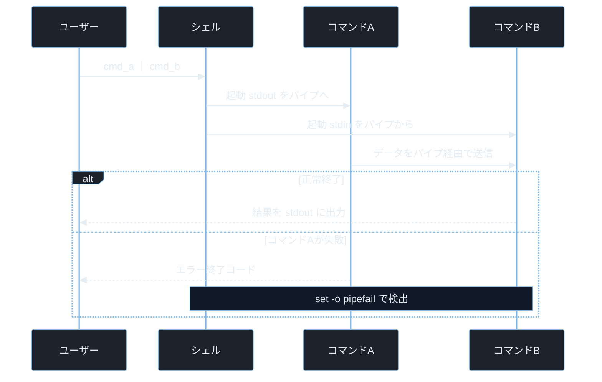

## TL;DR

- **ターミナル**はシェルに命令を入力する画面、**シェル**はその命令を解釈して OS に渡すプログラムだ。Linux の標準シェルは Bash（Bourne Again Shell）で、CTF や実務のほぼ全場面で使う。
- コマンドは「コマンド名 オプション 引数」の形で構成される。ユーザー入力がコマンドの引数にそのまま渡されると**コマンドインジェクション**が成立し、任意コードを実行できる。
- シェルはパイプ・リダイレクト・変数展開・グロブ展開など多くの「魔法」を解釈する。この展開の仕組みを理解しないと、防御も攻撃もできない。

---

## なぜ重要か

「ターミナルは覚えなくても GUI で操作できるのでは？」

この考え方が危険だ。**セキュリティの現場では GUI が存在しないサーバー・コンテナ・CTF 環境への操作が日常であり、ターミナルは唯一の操作手段になる。** コマンドラインの仕組みを知れば、なぜコマンドインジェクションが成立するか・シェルのどこがセキュリティホールになるかが見えてくる。

具体的に挙げると：

- SSH でリモートサーバーにログインして調査・インシデントレスポンスを行う
- CTF Forensics・Pwn でコマンド一発でファイル解析・バイナリ操作する
- シェルスクリプトが `eval`・`$()` をユーザー入力に使っていると任意コードが実行できる
- `.bash_history` にパスワードやトークンが平文で残り情報漏洩につながる
- `sudo` の設定ミスでシェルエスケープによる権限昇格が成立する

> **CTF とは**: Capture The Flag の略。セキュリティ技術を競う演習形式。Forensics はファイル・ログ解析、Pwn はバイナリ脆弱性悪用、Reversing はバイナリ解析が主題。

---

## 読む前に確認したい用語

難しい用語は出てきたタイミングで解説するが、以下の概念は記事全体を通して何度も登場する。ざっと目を通してから先に進もう。

**シェルとターミナルの関係**
- **ターミナル（端末）**: コマンドを入力してシェルの出力を表示するインタフェース（画面）。GNOME Terminal・Alacritty・Windows Terminal 等がある。
- **シェル**: ターミナルから受け取ったコマンドを解釈して OS に渡すプログラム。Bash・Zsh・Fish・sh 等がある。
- **Bash（Bourne Again Shell）**: GNU プロジェクトが開発した Linux 標準のシェル。`/bin/bash` で起動する。
- **プロンプト**: シェルが「入力を待っています」と示す文字列。`user@host:~$` の形式が多い。

**コマンドの構造**
- **オプション**: コマンドの動作を変えるフラグ。`-l`（短縮）や `--long`（長い名前）の形式がある。
- **引数（アーギュメント）**: コマンドに渡すデータ。ファイル名・URL・テキスト等。
- **環境変数**: シェルが保持するキーと値のペア。`PATH`・`HOME`・`USER` 等。`$変数名` で参照する。
- **終了コード（exit code）**: コマンドが終了時に返す整数。`0` が成功・それ以外が失敗。`$?` で確認できる。

**シェルの展開機能**
- **グロブ展開**: `*`・`?`・`[abc]` などのワイルドカードをファイル名に展開する機能。
- **コマンド置換**: `` `command` `` または `$(command)` でコマンドの出力を文字列として埋め込む。
- **パイプ（`｜`）**: 前のコマンドの標準出力を次のコマンドの標準入力につなぐ。
- **リダイレクト**: `>` で標準出力をファイルへ、`<` でファイルを標準入力へ、`2>` でエラー出力を渡す。

**セキュリティ用語**
- **コマンドインジェクション**: ユーザー入力がシェルコマンドの一部として実行される脆弱性。
- **シェルエスケープ**: `sudo` や制限されたシェル環境から抜け出して通常シェルを取得する技法。
- **CVE**: Common Vulnerabilities and Exposures の略。世界共通の脆弱性識別番号。
- **CVSS**: Common Vulnerability Scoring System。脆弱性の深刻度を 0.0〜10.0 で評価する指標。

---

## 仕組み

### シェルのコマンド解釈フロー


シェルは実行前に変数展開・グロブ展開・コマンド置換の順で処理する。攻撃者の入力がこの展開対象に含まれると、コマンドとして解釈されてコマンドインジェクションにつながる。この処理順序を理解することが防御の出発点になる。

> **`fork` とは**: 親プロセスを複製して子プロセスを作る Linux のシステムコール。シェルはコマンドを実行する前に `fork` で子プロセスを作る。
> **`exec` とは**: 現在のプロセスイメージを別のプログラムに置き換えるシステムコール。`fork` した子プロセスが `exec` で実際のコマンド（`ls` 等）に切り替わる。

**計算量まとめ**

- **コマンド検索（PATH 探索）**: O(n)。n は PATH 内のディレクトリ数。`hash` コマンドでキャッシュされると O(1)。
- **グロブ展開**: O(f)。f はマッチするファイル数。`*` が大量のファイルにマッチするとシェルが遅くなる。

**シェルの弱点 — 展開の先行評価**

シェルは文字列をコマンドとして実行する前に展開を行う。`eval "$(user_input)"` や `sh -c "$user_input"` のようなパターンでは、展開後の文字列がそのままシェルコマンドとして走る。引数を配列・リスト形式で渡せばシェルを介さずに実行できるため、文字列連結を避けることが根本的な防御になる。

---

### ファイルシステムの基本ナビゲーション

```mermaid
%%{init: {"theme":"base","themeVariables":{"background":"#0b1117","primaryColor":"#1b222a","primaryBorderColor":"#7fb6e8","primaryTextColor":"#e6edf3","lineColor":"#9db6c9","secondaryColor":"#111827","tertiaryColor":"#0b1117"}}}%%
flowchart LR
    A[/ ルート] --> B[/etc 設定]
    A --> C[/home ユーザー]
    A --> D[/tmp 一時]
    A --> E[/var 可変]
    A --> F[/usr コマンド群]
```

`/` がすべてのファイルの起点だ。現在地（カレントディレクトリ）を `pwd` で確認し、`cd` で移動する。`~` は自分のホームディレクトリを指す省略記法だ。

**計算量まとめ**

- **`ls`**: O(n)。n はディレクトリ内のエントリ数。
- **`find / -name xxx`**: O(f)。f はファイルシステム全体のエントリ数。深い検索は時間がかかる。

**ナビゲーションの弱点 — 相対パスの罠**

`PATH` 変数に `.`（カレントディレクトリ）が含まれていて、かつ `.` が優先順位の高い位置（先頭など）に存在すると、攻撃者がカレントディレクトリに `ls` という名前の悪意あるスクリプトを置くことで、本来の `/bin/ls` の代わりに実行される可能性がある。本番環境の `PATH` に `.` を含めてはならない。

---

### パイプとリダイレクト



パイプはカーネルの IPC 機能を使って前段の標準出力を後段の標準入力につなぐ。デフォルトではパイプラインの最後のコマンドの終了コードしか `$?` に残らない。`set -o pipefail` を設定すると途中でエラーが起きたときに検出できる。

**計算量まとめ**

- **パイプスループット**: コマンド間のコピーコスト O(n)。n はデータサイズ。
- **リダイレクト**: ファイルへの書き込み O(n)。ファイルシステムの速度に依存。

**パイプの弱点 — エラーサイレント**

`set -o pipefail` がないパイプラインは、途中のコマンドがエラーを出しても最後のコマンドが成功すれば全体が「成功」と判定される。セキュリティスクリプトで途中の検証コマンドが失敗しても気づかず処理が続いてしまうパターンが危険だ。

---

### 必須コマンド 50 — カテゴリ別

**ファイル操作**

- `ls -la`: ファイル一覧（隠しファイル含む詳細表示）
- `pwd`: 現在のディレクトリパスを表示（print working directory）
- `cd [ディレクトリ]`: ディレクトリを移動（change directory）
- `mkdir -p [パス]`: ディレクトリを作成（-p は親ディレクトリも同時作成）
- `rm -rf [パス]`: ファイル・ディレクトリを強制再帰削除（-r は再帰・-f は確認なし）
- `cp -r [元] [先]`: ファイル・ディレクトリをコピー（-r は再帰）
- `mv [元] [先]`: 移動またはリネーム
- `touch [ファイル]`: 空ファイル作成またはタイムスタンプ更新
- `find [ディレクトリ] -name [パターン]`: ファイル検索
- `stat [ファイル]`: inode・パーミッション・タイムスタンプの詳細表示

> **`rm -rf` の危険性**: `rm -rf /` や `rm -rf *` は復旧不可能なデータ消去になる。ルートが指定されないよう引数を常に確認する。

**テキスト閲覧・処理**

- `cat [ファイル]`: ファイルの内容を表示（concatenate）
- `less [ファイル]`: ページング表示（`q` で終了・`/` で検索）
- `head -n [N] [ファイル]`: 先頭 N 行を表示
- `tail -n [N] [ファイル]`: 末尾 N 行を表示（`-f` でリアルタイム追跡）
- `grep [パターン] [ファイル]`: 行を絞り込み（global regular expression print）
- `grep -r [パターン] [ディレクトリ]`: ディレクトリを再帰検索
- `grep -v [パターン]`: マッチしない行を表示（invert）
- `awk '{print $1}' [ファイル]`: 列を抽出

> **`$1` とは（awk での意味）**: awk がスペース・タブで分割した各行の「1 番目のフィールド（列）」を指す。`$2` なら 2 列目、`$NF` なら最後の列になる。
- `sed 's/old/new/g' [ファイル]`: 文字列を置換（stream editor）
- `sort [ファイル]`: 行を辞書順ソート
- `uniq -c`: 重複行を集計（sort と組み合わせる）
- `wc -l [ファイル]`: 行数を数える（word count）
- `diff [ファイル1] [ファイル2]`: ファイルの差分を表示
- `strings [バイナリ]`: バイナリから印字可能文字列を抽出

> **`tail -f` とは**: ファイルの末尾をリアルタイムで追跡するオプション（follow）。ログ監視で `tail -f /var/log/syslog` のように使う。

**パーミッション・オーナー**

- `chmod [モード] [ファイル]`: パーミッションを変更（change mode）
- `chown [ユーザー]:[グループ] [ファイル]`: オーナーを変更（change owner）
- `id`: 現在のユーザーの UID・GID・グループ一覧を表示
- `whoami`: 現在のユーザー名を表示
- `sudo [コマンド]`: 別ユーザー（デフォルトは root）としてコマンドを実行
- `su [ユーザー]`: ユーザーを切り替える（substitute user）

> **`chmod` の数値表記**: `chmod 755 file` の `755` は 8 進数。Linux の権限は `r`（読み取り）=4・`w`（書き込み）=2・`x`（実行）=1 の合計で表す。`7`=4+2+1（`rwx`）・`5`=4+1（`r-x`）・各桁がオーナー・グループ・その他に対応する。

**プロセス管理**

- `ps aux`: 全プロセスの一覧を表示
- `top`: CPU・メモリ使用率をリアルタイム表示
- `htop`: `top` の高機能版（カラー表示・キー操作）
- `kill [PID]`: プロセスにシグナルを送る（デフォルトは SIGTERM）
- `kill -9 [PID]`: プロセスを強制終了（SIGKILL）
- `bg` / `fg`: バックグラウンド／フォアグラウンドに切り替え
- `jobs`: バックグラウンドジョブの一覧表示
- `nohup [コマンド] &`: ターミナルを閉じても継続実行する

> **`PID` とは**: Process ID の略。プロセスを識別する一意の整数番号。`ps aux` の 2 列目が PID。

> **`&`（アンパサンド）とは**: コマンド末尾に付けるとバックグラウンドで実行する。プロンプトをすぐに返してくれる。

**ネットワーク**

- `ip a`: ネットワークインタフェースと IP アドレスを表示
- `ping [ホスト]`: 疎通確認（ICMP エコー送信）
- `curl [URL]`: HTTP リクエストを送る
- `wget [URL]`: ファイルをダウンロードする
- `ss -tlnp`: リッスン中の TCP ポートを一覧表示
- `netstat -tlnp`: `ss` の旧来版（環境によっては利用可能）
- `nmap [ホスト]`: ポートスキャン（ネットワーク探索）
- `dig [ドメイン]`: DNS クエリを送る
- `traceroute [ホスト]`: パケットの経路を表示
- `scp [元] [先]`: SSH 経由でファイルをコピー（secure copy）

> **`ss -tlnp` のオプション**: `-t` は TCP・`-l` はリッスン中・`-n` は名前解決なし（数値表示）・`-p` はプロセス情報表示。

> **`nmap` とは**: Network Mapper の略。ポートスキャン・OS 検出・サービス検出ができる。許可を得たホストにのみ実行する。

**アーカイブ・圧縮**

- `tar -czf [出力.tar.gz] [ディレクトリ]`: gzip 圧縮アーカイブ作成
- `tar -xzf [ファイル.tar.gz]`: 展開（-x は extract・-z は gzip・-f はファイル指定）
- `zip -r [出力.zip] [ディレクトリ]`: zip 圧縮
- `unzip [ファイル.zip]`: zip 展開

> **`tar` オプションまとめ**: `-c` は作成（create）・`-x` は展開（extract）・`-z` は gzip フィルタ・`-v` は詳細表示（verbose）・`-f` はファイル指定（file）。

**シェル操作**

- `history`: コマンド履歴を表示
- `Ctrl+R`: 履歴をインクリメンタル検索
- `Ctrl+C`: 実行中のコマンドを中断（SIGINT 送信）
- `Ctrl+D`: 標準入力の EOF を送る（ターミナルを閉じる）
- `Ctrl+L`: 画面をクリア（`clear` と同じ）
- `!!`: 直前のコマンドを再実行
- `!$`: 直前のコマンドの最後の引数を参照
- `alias [名前]='[コマンド]'`: コマンドの別名を定義

---

## よくある誤解

実装に進む前に、間違えやすいポイントを整理しておく。「あー、そうか」と思えるものがあれば、コードを書くときに思い出してほしい。

**「シェルとターミナルは同じもの」**
ターミナルは「画面と入力装置の仕組み」、シェルは「コマンドを解釈するプログラム」だ。**GNOME Terminal（ターミナル）の中で Bash（シェル）が動いている**という関係で、ターミナルを変えてもシェルは変わらず、シェルを変えてもターミナルは変わらない。

**「`rm` は元に戻せる」**
Linux の `rm` はゴミ箱に移動せず即座に inode の参照を切る。**`rm` したファイルは通常の手段では復元できない**。重要な操作の前には `cp`・`tar` でバックアップを取る習慣をつける。テスト時は `rm` の代わりに `echo rm [対象]` で何が消えるかを先に確認する。

**「`sudo` を使えば何でも安全」**
`sudo` は権限を付与するだけで入力の安全性は保証しない。`sudo sh -c "$user_input"` のように `sudo` の下でユーザー入力をシェル経由で実行すると、**root 権限でコマンドインジェクションが成立する**。`sudo` は最小権限の原則で必要なコマンドのみに制限する。

**「`history` に秘密の情報は残らない」**
Bash はデフォルトで `~/.bash_history` に最大 1000 件のコマンド履歴を保存する。`mysql -u root -pSecret123` のようにパスワードをコマンドライン引数に渡すと **`~/.bash_history` に平文で記録される**。パスワードは対話的に入力するか、環境変数か設定ファイルで渡す。

**「`curl URL | bash` は問題ない」**
`curl https://example.com/install.sh | bash` というインストール手順はよく見られる。しかし TLS の信頼性がなければ**中間者攻撃でスクリプトを差し替えられて任意コードを実行できる**。ダウンロードしてハッシュ検証してから実行するのが安全だ。

---

## 脆弱なコード例

> 本記事の攻撃例は学習環境・CTF・明示的に許可された検証環境のみで実施してください。
> 実システムへの無断検証は不正アクセス禁止法や各国法令・利用規約違反となる可能性があります。

### PHP — コマンドインジェクション

```php
<?php
$host = $_GET['host'] ?? '';

$output = shell_exec("ping -c 3 {$host}");
echo "<pre>" . htmlspecialchars($output ?? '') . "</pre>";
```

> **`$_GET['host']` とは**: HTTP GET リクエストのクエリパラメータ `host` の値を取得する PHP の超グローバル変数。例えば `/ping?host=8.8.8.8` で `$_GET['host']` が `"8.8.8.8"` になる。
> **`shell_exec()` とは**: PHP でシェルコマンドを実行してその出力文字列を返す関数。内部で `/bin/sh -c` を呼ぶため、シェルのメタ文字（`;`・`|`・`&&`・`` ` ``）が全て有効になる。

**どこが問題か**: `?host=8.8.8.8; cat /etc/passwd` を送るだけで、`;` 以降が別のシェルコマンドとして実行される。Web サーバーの実行権限で任意コマンドが走るため、設定によっては `/etc/shadow` の読み取りやリバースシェルの取得まで可能だ。

```php
<?php
$host = $_GET['host'] ?? '';

if (!filter_var($host, FILTER_VALIDATE_IP)) {
    http_response_code(400);
    exit("無効な IP アドレスです");
}

$output = shell_exec("ping -c 3 " . escapeshellarg($host));
echo "<pre>" . htmlspecialchars($output ?? '') . "</pre>";
```

> **`filter_var($host, FILTER_VALIDATE_IP)` とは**: PHP で文字列が有効な IPv4/IPv6 アドレス形式かどうかを検証する組み込みフィルタ関数。IP アドレス以外の入力は `false` を返す。
> **`escapeshellarg()` とは**: PHP で文字列をシェルの引数として安全にエスケープする関数。全体をシングルクォートで囲み、シェルメタ文字を無効化する。

入力を IP アドレス形式にホワイトリスト検証してから `escapeshellarg()` でエスケープする二重防御により、シェルインジェクションを防ぐ。

ユーザー入力はホワイトリストで形式を限定してから、シェルに渡す前に必ず引数として分離することが防御の基本だ。

---

### Node.js — コマンド文字列連結によるインジェクション

```javascript
const express = require('express');
const { exec } = require('child_process');
const app = express();

app.get('/lookup', (req, res) => {
    const domain = req.query.domain || '';
    exec(`dig ${domain}`, (err, stdout) => {
        res.send(stdout || err?.message);
    });
});

app.listen(3000);
```

> **`exec()` とは**: Node.js の `child_process` モジュールでシェルを経由してコマンドを実行する関数。文字列をそのまま `/bin/sh -c` に渡すため、シェルのメタ文字が有効になる。

**どこが問題か**: `?domain=example.com;id` を送るだけで `id` コマンドの出力がレスポンスに含まれる。`?domain=example.com%0Acat%20/etc/passwd` のように URL エンコードした改行（`%0A`）でも別コマンドとして実行できる。Node.js プロセスの権限で任意コマンドが実行できる。

```javascript
const express = require('express');
const { execFile } = require('child_process');
const app = express();

const DOMAIN_PATTERN = /^[a-zA-Z0-9]([a-zA-Z0-9\-]{0,61}[a-zA-Z0-9])?(\.[a-zA-Z]{2,})+$/;

app.get('/lookup', (req, res) => {
    const domain = req.query.domain || '';

    if (!DOMAIN_PATTERN.test(domain)) {
        return res.status(400).send('無効なドメイン名です');
    }

    execFile('dig', [domain], (err, stdout) => {
        res.send(stdout || err?.message || '');
    });
});

app.listen(3000);
```

> **`execFile()` とは**: Node.js でシェルを経由せずに直接プログラムを実行する関数。引数を配列で渡すため、シェルのメタ文字が解釈されない。`exec()` の代わりに `execFile()` を使うことがコマンドインジェクション防止の鉄則だ。

`execFile()` に引数を配列で渡してシェルを介さないことと、ドメイン名をホワイトリスト正規表現で検証することで、インジェクションの経路を二重に断つ。

コマンドは文字列連結せず引数配列で直接実行することで、シェルの展開機能をバイパスしてインジェクションを根本から防ぐ。

---

### Python — シェル文字列の動的生成によるインジェクション

```python
from flask import Flask, request
import subprocess

app = Flask(__name__)

@app.route('/scan')
def scan():
    target = request.args.get('target', '')
    result = subprocess.run(
        f'nmap -sV {target}',
        shell=True,
        capture_output=True,
        text=True
    )
    return result.stdout
```

> **`subprocess.run(..., shell=True)` とは**: Python でシェル（`/bin/sh -c`）を経由してコマンドを実行するモード。コマンド文字列がそのままシェルに渡るため、`target` にメタ文字が含まれると危険になる。

**どこが問題か**: `?target=192.168.1.1;cat /etc/passwd` を送るだけでセミコロン以降が別コマンドとして実行される。Web アプリケーションの実行権限で任意コマンドが走るため、設定・ログ・データベースの内容が漏洩したり、内部ネットワークへの横展開に悪用される。

```python
from flask import Flask, request, abort
import subprocess
import re

app = Flask(__name__)

IP_PATTERN = re.compile(
    r'^((25[0-5]|2[0-4][0-9]|[01]?[0-9][0-9]?)\.){3}'
    r'(25[0-5]|2[0-4][0-9]|[01]?[0-9][0-9]?)$'
)
CIDR_PATTERN = re.compile(
    r'^((25[0-5]|2[0-4][0-9]|[01]?[0-9][0-9]?)\.){3}'
    r'(25[0-5]|2[0-4][0-9]|[01]?[0-9][0-9]?)/([0-9]|[12][0-9]|3[0-2])$'
)

@app.route('/scan')
def scan():
    target = request.args.get('target', '')

    if not (IP_PATTERN.match(target) or CIDR_PATTERN.match(target)):
        abort(400)

    result = subprocess.run(
        ['nmap', '-sV', target],
        capture_output=True,
        text=True,
        timeout=30
    )
    return result.stdout
```

> **`subprocess.run(['nmap', '-sV', target])` とリスト形式**: 引数をリストで渡すと `shell=True` なしで動作し、各要素が個別の引数として渡されてシェルのメタ文字が解釈されない。`shell=True` を使う代わりにリスト形式を使うことが安全の鉄則だ。

引数をリスト形式で渡してシェルを経由しないことが最大の防御で、IP アドレス正規表現でのホワイトリスト検証はさらなる多層防御になる。

`shell=True` を避けてリスト形式で実行することが、Python でのコマンドインジェクション防止の最優先手段だ。

---

## 実践例 / 演習例

### シェルの展開を理解する実験

```bash
echo "現在時刻: $(date)"
echo "ユーザー: $USER"
echo 'シングルクォートでは展開しない: $USER'
```

> **シングルクォートとダブルクォートの違い**: ダブルクォート `"..."` の中では変数展開とコマンド置換が有効。シングルクォート `'...'` の中ではあらゆる展開が無効になりリテラル文字列として扱われる。

```bash
ls /tmp/*.txt 2>/dev/null
ls /tmp/[0-9]*.log 2>/dev/null
```

グロブ展開を試す。`*` は任意の文字列、`[0-9]` は 0〜9 のいずれか 1 文字にマッチする。

### 履歴ファイルの調査（フォレンジック）

```bash
cat ~/.bash_history
grep -i "password\|passwd\|secret\|token\|key" ~/.bash_history
```

> **`grep -i` とは**: 大文字・小文字を区別せずに検索するオプション（case-insensitive）。`Password`・`PASSWORD` のような表記ゆれも同時に検索できる。

```bash
grep -r "password\|passwd\|PASS" /home/*/.bash_history 2>/dev/null
```

> **`grep -r` とは**: ディレクトリを再帰的に検索するオプション（recursive）。指定ディレクトリ以下の全ファイルを対象にする。

> **`~/.bash_history` とは**: Bash がコマンド履歴を保存するファイル。`HISTFILE` 環境変数で変更できる。インシデントレスポンスや CTF Forensics では攻撃者の行動追跡・パスワード発見に使う。

### プロセスとネットワークの状態確認

```bash
ps aux | grep -v grep | grep "nginx\|apache\|python\|node"
ss -tlnp
lsof -i :80 -i :443 -i :22
```

> **`lsof` とは**: List Open Files の略。プロセスが開いているファイル・ソケット・パイプを一覧表示するコマンド。`-i :80` でポート 80 を使っているプロセスを特定できる。インシデントレスポンスで不審なプロセスのネットワーク接続を調査するときに使う。

### コマンドインジェクション検証（CTF 演習）

クォートの有無でシェル展開の挙動がどう変わるかを確認する。

```bash
target="127.0.0.1; id"

ping -c 1 $target 2>&1 || true
```

> **`2>&1` とは**: 標準エラー出力（fd `2`）を標準出力（fd `1`）に結合するリダイレクト記法。エラー出力もまとめてパイプやファイルに渡せる。
> **`|| true` とは**: 直前のコマンドが失敗（終了コード非 0）しても、`|| true` でスクリプトを継続させる記法。`set -e` が有効な環境でのエラー伝播を防ぐ。

クォートなしで `$target` を展開すると `;` が区切り文字として解釈され、`id` が別コマンドとして実行される。

```bash
ping -c 1 "$target" 2>&1 || true
```

ダブルクォートで囲むと `$target` 全体が 1 つの引数として渡され、`; id` がホスト名として扱われてエラーになる。この差が「変数はダブルクォートで囲む」というシェルスクリプトの鉄則の根拠だ。

---

## 防御策

### 1. ユーザー入力をコマンドに渡す場合は必ずリスト形式を使う

```python
import re
import subprocess

def run_tool(user_input: str) -> str:
    allowed = re.compile(r'^[a-zA-Z0-9.\-]{1,253}$')
    if not allowed.match(user_input):
        raise ValueError("不正な入力")
    result = subprocess.run(
        ['dig', '+short', user_input],
        capture_output=True, text=True, timeout=10
    )
    return result.stdout
```

シェルを経由しないリスト形式は、どの言語でもコマンドインジェクション防止の最優先手段だ。

### 2. 履歴ファイルへのパスワード流出を防ぐ

```bash
export HISTIGNORE="*password*:*passwd*:*secret*:*token*"
export HISTCONTROL=ignorespace
```

> **`HISTIGNORE` とは**: パターンに一致するコマンドを履歴に保存しないようにする環境変数。コロン区切りで複数パターンを指定できる。
> **`HISTCONTROL=ignorespace` とは**: 先頭にスペースを入れたコマンドを履歴に保存しないようにする設定。`  mysql -u root -pSecret` のように先頭スペースで機密コマンドの記録を回避できる。

```bash
echo "export HISTIGNORE='*password*:*passwd*:*secret*:*token*'" >> ~/.bashrc
echo "export HISTCONTROL=ignorespace" >> ~/.bashrc
source ~/.bashrc
```

### 3. `sudo` を必要最小限のコマンドに制限する

```bash
sudo visudo
```

> **`visudo` とは**: `/etc/sudoers` を安全に編集するコマンド。直接 `sudo nano /etc/sudoers` で編集すると書き方ミスでロックアウトされる危険があるため、必ず `visudo` を使う。

```
# 特定のコマンドのみ許可する例
deploy  ALL=(www-data) NOPASSWD: /usr/bin/systemctl restart nginx
```

`ALL=(ALL) NOPASSWD: ALL` のような全権付与は禁止する。シェルを呼べるコマンド（`vim`・`less`・`awk`・`python`）を `sudo` で許可するとシェルエスケープで root が取れる。

### 4. シェルスクリプトのセーフモードを有効にする

```bash
#!/bin/bash
set -euo pipefail
```

> **`set -e`**: エラー（終了コード非 0）が起きたらスクリプトを即座に終了する。
> **`set -u`**: 未定義の変数を参照したらエラーにする。タイポによるバグ防止。
> **`set -o pipefail`**: パイプラインの途中のコマンドが失敗したらその終了コードをパイプ全体の終了コードにする。

### 5. 機密情報を環境変数で管理する

```bash
export DB_PASSWORD="$(cat /run/secrets/db_password)"
mysql -u root -p"$DB_PASSWORD" mydb
```

> **`$(cat /run/secrets/db_password)`**: Docker Secrets などで提供されるファイルからパスワードを読み込むパターン。コマンドライン引数にパスワードを渡すと `ps aux` で丸見えになるため、環境変数か標準入力で渡す。

---

## 実演ラボ案内

### 推奨学習順序

- linux-filesystem（ディレクトリ構造・パーミッションの基礎）
- terminal-basics（本記事）
- ipc-mechanisms（パイプ・シェルの内部動作）
- linux-privilege-escalation（シェルエスケープ・SUID・sudo 権限昇格）

### Hack The Box

- **Starting Point — Meow・Fawn・Dancing**: SSH ログイン・FTP・ファイル操作の基礎を実践できる最初の機械群。本記事のコマンドを全て使う。
- **Challenges — Forensics**: `strings`・`grep`・`xxd`・`file` コマンドでバイナリを解析してフラグを探す問題が頻出。

> **`xxd` とは**: バイナリファイルを 16 進数ダンプで表示するコマンド（hex dump の略）。`xxd [ファイル]` で 16 進数と ASCII 表示を並べて出力する。CTF でバイナリの中身を確認するときに使う。
> **`xxd -r` とは**: 16 進数ダンプをバイナリデータに戻す（reverse）オプション。`-p` と組み合わせると `xxd -r -p hex.txt binary.bin` でプレーン 16 進テキストからバイナリを復元できる。
> **`xxd -p` とは**: プレーン 16 進形式（区切りなし）で表示するオプション（plain）。スクリプトで処理しやすい形式だ。

### TryHackMe

- **Linux Fundamentals Part 1〜3**: ターミナル操作の基礎から `find`・`grep`・パイプまで段階的に練習できる。
- **Command Injection**: Web アプリのコマンドインジェクション脆弱性を実際に悪用する演習。

### 自宅 VM（合法演習）

```bash
sudo apt install docker.io
docker run -it --rm ubuntu:24.04 bash
```

> **`docker run -it --rm ubuntu:24.04 bash`**: Ubuntu 24.04 コンテナを対話的（`-i` interactive・`-t` tty）に起動し、終了後に自動削除（`--rm`）する。ホスト OS に影響なくコマンドを試せる安全な環境だ。

```bash
echo "練習用のコマンドインジェクション模擬"
target="192.168.1.1; echo INJECTED"
ping -c 1 $target 2>&1 || true
ping -c 1 "$target" 2>&1 || true
```

クォートの有無でインジェクションが防げるかを確認する演習。変数展開の挙動の違いを体感できる。

---

## 関連 CVE と被害事例

> **CVE とは**: Common Vulnerabilities and Exposures の略。世界共通の脆弱性識別番号。
> **CVSS スコア**: 脆弱性の深刻度を 0.0〜10.0 で評価した指標。7.0 以上が High・9.0 以上が Critical。

**CVE-2014-6271（Bash — Shellshock）**
Bash の環境変数処理に欠陥があり、関数定義に続けてコマンドを記述した環境変数を設定するだけで、その後に Bash を起動した際にコマンドが実行されることが発見された。CGI スクリプト・DHCP クライアント・SSH の ForceCommand など、環境変数を経由して Bash を呼び出す箇所が全て攻撃対象になった。攻撃者はリモートからヘッダや DHCP オプションに細工した環境変数を埋め込み、サーバー上で任意コードを実行できた。攻撃前提: ネットワーク到達性のみ（リモートから可能）。CVSS スコア 9.8（Critical）。本記事との関連: シェルの環境変数展開・コマンドインジェクション

**CVE-2021-3156（sudo — sudoedit のヒープ BOF、Baron Samedit）**
`sudo` の引数エスケープ処理（バックスラッシュの処理）にヒープバッファオーバーフローが存在し、ローカルの一般ユーザーが `sudo` を通じて root 権限を取得できることが発見された。対話的なパスワード入力なしに root シェルを取得できるため、影響範囲は非常に広かった。攻撃前提: ローカルユーザー権限。CVSS スコア 7.8（High）。本記事との関連: `sudo` コマンド・権限昇格・シェルエスケープ

**CVE-2023-22809（sudo — sudoedit の権限昇格）**
`sudoedit` が編集対象ファイルとして追加のファイルを指定できる仕組みに問題があり、通常は読み書きできないファイル（`/etc/sudoers` 等）を `SUDO_EDITOR` 環境変数を組み合わせて編集できることが発見された。`sudoedit` を許可された一般ユーザーが `sudoers` を改ざんして完全な root 権限を取得できた。攻撃前提: `sudoedit` 権限が付与されているローカルユーザー。CVSS スコア 7.8（High）。本記事との関連: `sudo`・環境変数・シェルエスケープ・権限昇格

---

## 次に学ぶべき記事

- **ipc-mechanisms** — パイプ・UNIX ソケット・シグナルの内部動作。シェルのパイプがカーネルレベルでどう動くかを理解する
- **linux-privilege-escalation** — `sudo` 設定ミス・SUID バイナリ・PATH 注入などシェルを使った権限昇格の総合演習
- **regex-grep-sed-awk** — `grep`・`sed`・`awk` の正規表現を使った高度なテキスト処理と、正規表現 DoS（ReDoS）の仕組み

---

## 参考文献

- GNU. "Bash Reference Manual". https://www.gnu.org/software/bash/manual/bash.html
- OWASP. "Command Injection". https://owasp.org/www-community/attacks/Command_Injection
- NVD. "CVE-2014-6271 Detail (Shellshock)". https://nvd.nist.gov/vuln/detail/CVE-2014-6271
- NVD. "CVE-2021-3156 Detail (Baron Samedit)". https://nvd.nist.gov/vuln/detail/CVE-2021-3156
- NVD. "CVE-2023-22809 Detail (sudoedit)". https://nvd.nist.gov/vuln/detail/CVE-2023-22809
- GTFOBins. "Shell escape via sudo". https://gtfobins.github.io/
- SANS. "Linux Command Line Cheat Sheet". https://www.sans.org/blog/the-ultimate-list-of-sans-cheat-sheets/
