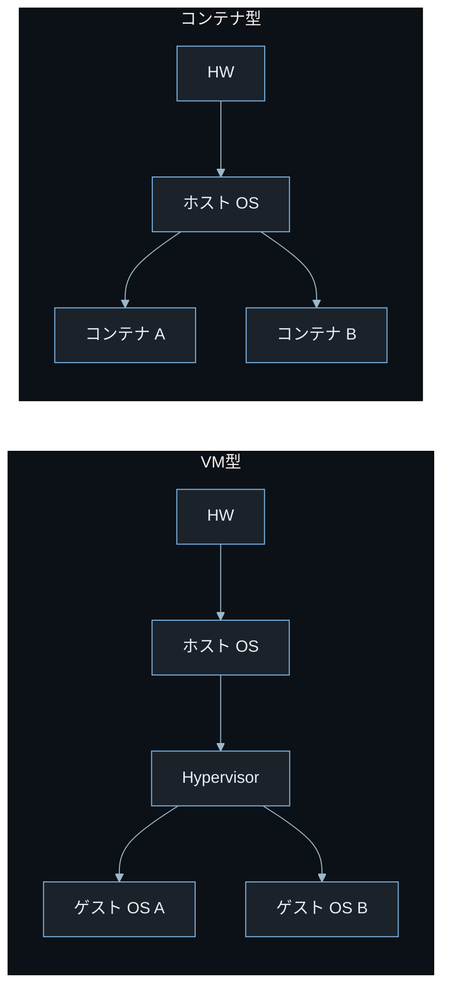
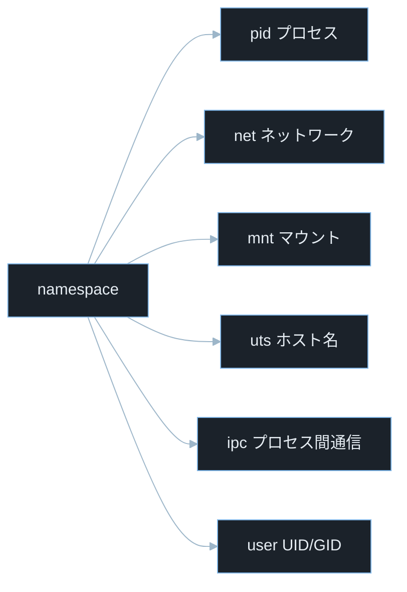
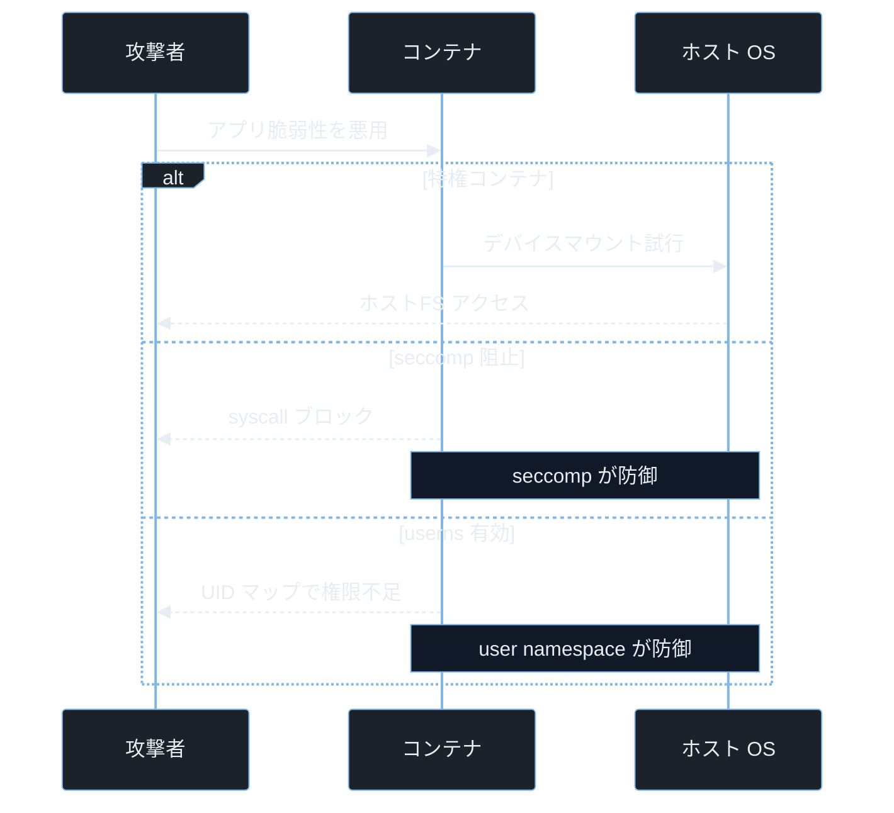

## TL;DR

- **仮想化（VM）** はハイパーバイザーが CPU・メモリ・デバイスを完全にエミュレートし、ゲスト OS ごとに独立した環境を作る。**コンテナ（Docker 等）** はホスト OS のカーネルを共有しつつ `namespace` と `cgroups` でプロセスを分離する。VM より軽量だがカーネルを共有するため攻撃面が異なる。
- コンテナのセキュリティリスクとして **コンテナエスケープ**（コンテナ内からホストへ脱出）・**特権コンテナの乱用**・**イメージに仕込まれたマルウェア** が実際の脆弱性として発生している。
- `--privileged` フラグ・ソケットのマウント・`seccomp` 無効化など、よくある設定ミスがエスケープの入口になる。

---

## なぜ重要か

「なぜ `--privileged` コンテナはすぐにホストを乗っ取れるのか？」

この問いに即答できないなら、この記事が助けになる。答えはシンプルだ——**`--privileged` を付けると namespace の分離が事実上解除され、ホストのデバイスとシステムコールにほぼ無制限にアクセスできるから**。コンテナの仕組みを知れば、設定ミスが即座にエスケープ経路になる理由を根本から理解できる。

具体的に挙げると：

- **CTF Cloud / Pwn カテゴリ**: 意図的に脆弱な Docker 設定からホストへエスケープする問題が頻出
- **ペネトレーションテスト**: コンテナ内に侵入後のラテラルムーブメント（横移動）経路を調査する
- **コードレビュー**: `Dockerfile` や `docker-compose.yml` の危険な設定を発見する
- **インシデントレスポンス**: コンテナ内のプロセスとホストプロセスを比較してエスケープの痕跡を調査する

> **ラテラルムーブメントとは**: 侵入した端点から同一ネットワーク内の他のシステムへ移動すること。コンテナ侵害後にホストや隣接コンテナへ移動する行為が該当する。

> **ペネトレーションテストとは**: 依頼を受けてシステムへ合法的に侵入テストを行うこと。自組織・許可を得たシステムのみを対象とする。

---

## 読む前に確認したい用語

難しい用語は出てきたタイミングで解説するが、以下の概念は記事全体を通して何度も登場する。ざっと目を通してから先に進もう。

**仮想化技術の 2 種**
- **ハイパーバイザー**: 物理マシン上で複数の仮想マシン（VM）を動かすソフトウェア。KVM・VMware・VirtualBox が代表例。
- **VM（Virtual Machine）**: ハイパーバイザーが作り出す仮想的なコンピュータ。独自の OS カーネルを持ち、物理マシンとほぼ同じ環境を提供する。
- **KVM（Kernel-based Virtual Machine）**: Linux カーネル内で動作するハイパーバイザー機能。文献によって分類の扱いは異なるが、Type-1（ベアメタル）相当として扱われることが多い。
- **コンテナ**: ホスト OS のカーネルを共有しながら、プロセス・ファイルシステム・ネットワークを分離した軽量な実行環境。Docker が代表的な実装。
- **Docker**: コンテナの作成・配布・実行を管理するプラットフォーム。`Dockerfile` でイメージを定義し、`docker run` でコンテナを起動する。

**コンテナの分離機構**
- **namespace（名前空間）**: Linux カーネルの機能で、プロセス・ネットワーク・ファイルシステムなどのリソースをプロセスグループ単位で分離する仕組み。
- **cgroups（Control Groups）**: Linux カーネルの機能で、プロセスグループが使える CPU・メモリ・I/O の量を制限・計測する仕組み。
- **seccomp（Secure Computing Mode）**: Linux カーネルの機能で、プロセスが呼べるシステムコールを制限するフィルタ。コンテナのシステムコールを限定するために使う。

**セキュリティリスク**
- **コンテナエスケープ**: コンテナ内のプロセスが分離を突破してホスト OS や他のコンテナにアクセスする攻撃。
- **特権コンテナ**: `--privileged` フラグで起動したコンテナ。ほぼ全てのデバイスとシステムコールにアクセスできる。

**競技・評価**
- **CTF**: Capture The Flag。セキュリティ技術を競う演習形式。Pwn はバイナリ脆弱性悪用、Reversing はバイナリ解析が主題。コンテナエスケープは Pwn・Cloud カテゴリで頻出。
- **CVE**: Common Vulnerabilities and Exposures の略。世界共通の脆弱性識別番号。
- **CVSS**: Common Vulnerability Scoring System。脆弱性の深刻度を 0.0〜10.0 で評価する指標。

---

## 仕組み

### VM とコンテナのアーキテクチャ比較



VM 型はゲスト OS カーネルを持つが、コンテナ型はホストカーネルを直接共有する——この差がセキュリティ境界の強さを決める。カーネルを共有するコンテナはカーネル脆弱性（CVE-2019-5736 など）が即座にエスケープ経路になり得る。

**計算量まとめ**

主な違いを整理する。

- **起動速度**: VM は数十秒〜数分、コンテナは数秒以内
- **リソース消費**: VM はゲスト OS 分のメモリを常時消費、コンテナはプロセス分のみ
- **分離強度**: VM はハードウェアレベルで分離、コンテナはカーネル機能で分離（カーネル脆弱性の影響を受ける）
- **移植性**: コンテナイメージはどのホストでも同じ動作が期待できる

**アーキテクチャの弱点 — カーネル共有によるエスケープリスク**

コンテナの「軽量さ」の代償はカーネル共有だ。VM ならゲスト OS ごとにカーネルが分かれているため、ゲスト内の攻撃がホストに到達するにはハイパーバイザーを突破する必要がある。コンテナでは namespace・cgroups・seccomp の設定ミスだけでエスケープが成立してしまう。

---

### KVM の仕組み

KVM は Linux カーネルに組み込まれたハイパーバイザーモジュールで、CPU の仮想化支援命令（Intel VT-x / AMD-V）を使ってゲスト OS を直接 CPU 上で実行する。

> **Intel VT-x / AMD-V とは**: CPU が持つ仮想化支援機能。ハイパーバイザーがゲスト OS の命令を直接 CPU 実行させながら、特権命令だけをトラップして制御できる。これにより「全命令をソフトウェアでエミュレート」する遅い方式を避けられる。

KVM は `/dev/kvm` というデバイスファイルとして Linux に露出している。

```bash
ls -la /dev/kvm
file /dev/kvm
```

> **`/dev/kvm` とは**: KVM ハイパーバイザーのデバイスファイル。存在すれば CPU の仮想化支援機能が有効でハードウェア仮想化が使えることを示す。QEMU や libvirt はこのデバイス経由でゲスト VM を制御する。

---

### Docker のコンテナ分離の仕組み

Docker コンテナの分離は主に 3 つの Linux カーネル機能で実現される。

**1. namespace（名前空間）**



6 種類それぞれが異なるリソースを分離しているのがポイントだ。`user` namespace だけが「コンテナ内の root をホストの一般ユーザーにマップする」という権限の話をしており、これが有効かどうかがエスケープ後の影響範囲を大きく変える。

- **pid namespace**: プロセス ID を分離。コンテナ内の PID 1 はホストからは別の PID に見える
- **net namespace**: ネットワークインタフェース・ルーティングテーブルを分離。コンテナが独立した IP を持てる
- **mnt namespace**: マウントポイントを分離。コンテナ独自のファイルシステムビューを提供する
- **uts namespace**: ホスト名・ドメイン名を分離。コンテナが独自のホスト名を持てる
- **ipc namespace**: プロセス間通信リソース（共有メモリ・セマフォ）を分離する
- **user namespace**: UID/GID のマッピングを分離。コンテナ内の root（UID 0）をホストの非特権ユーザーにマップできる

> **UID / GID とは**: User ID / Group ID。Linux でユーザーとグループを識別する整数。UID 0 が root（スーパーユーザー）を意味する。user namespace が有効なら、コンテナ内の UID 0 がホスト上では UID 1000 等の一般ユーザーに対応する。

**2. cgroups（Control Groups）**

cgroups はリソースの「量」を制限する。

```bash
cat /sys/fs/cgroup/memory/docker/[コンテナID]/memory.limit_in_bytes
```

Docker で `--memory=512m` を指定すると、このファイルに `536870912`（512 × 1024 × 1024）が書き込まれ、コンテナが 512MB を超えるメモリを使おうとすると OOM Killer に強制終了される。

> **OOM Killer とは**: Out Of Memory Killer の略。Linux がメモリ不足になったとき、最もメモリを消費しているプロセスを強制終了する仕組み。cgroups のメモリ制限を超えたコンテナのプロセスが対象になる。

**3. seccomp（Secure Computing Mode）**

Docker はデフォルトの `seccomp` プロファイルで、危険なシステムコール（`unshare`・`mount`・`ptrace` 等）を多数ブロックする。ブロックされるシステムコールの具体的な数はカーネル・Docker バージョンによって異なるため、公式ドキュメントで最新のプロファイルを確認することを推奨する。

> **システムコール（syscall）とは**: プロセスが OS カーネルの機能（ファイル操作・ネットワーク通信・プロセス生成等）を呼び出す仕組み。Linux では `read`・`write`・`execve`・`clone` 等がある。コンテナエスケープには `unshare`・`mount` 等のシステムコールが悪用されることが多い。

---

### コンテナエスケープの攻撃フロー



特権コンテナ・seccomp 阻止・user namespace 有効の 3 分岐が、コンテナのセキュリティ設定の善し悪しを直接反映している。防御の層が多いほど攻撃者は次の分岐に進めなくなる。

---

## よくある誤解

実装に進む前に、間違えやすいポイントを整理しておく。「あー、そうか」と思えるものがあれば、コードを書くときに思い出してほしい。

**「コンテナ内の root は安全」**
user namespace が有効なら「コンテナ内の root = ホストの一般ユーザー」だが、user namespace を使わないデフォルト Docker では、カーネル内部でコンテナ内の root は UID 0 として扱われる。**`--userns-remap` を設定することでエスケープ後の影響を大幅に限定できる**。

**「Docker は VM と同じくらい安全」**
VM はゲスト OS カーネルとホストカーネルがハードウェアレベルで分離される。**コンテナはカーネルを共有するため、カーネルの脆弱性（CVE-2019-5736・CVE-2022-0492 等）がコンテナエスケープに直結する**。セキュリティ要件が高い環境では gVisor・Kata Containers などのサンドボックスランタイムを検討する。

> **gVisor とは**: Google が開発したコンテナランタイム。システムコールをユーザー空間で処理する独自カーネル（Sentry）を挟むことで、ホストカーネルへの直接アクセスを制限する。セキュリティは向上するがオーバーヘッドがある。

**「`docker` グループに追加するのは sudo を避けるための良い方法」**
`docker` グループのメンバーは `sudo` なしで Docker を操作できるが、`docker run -v /:/host -it ubuntu chroot /host bash` で即座にホスト root になれる。**`docker` グループへの追加 = root 権限の付与と同義**だ。

**「プライベートレジストリのイメージは安全」**
プライベートレジストリに置いたイメージでも、ビルドに使ったベースイメージや依存パッケージに脆弱性があれば危険だ。**`trivy` や `grype` で定期的にスキャンし、ベースイメージを最新に保つことが必要**。

**「環境変数はプロセス内にあるから外から見えない」**
コンテナ内では `/proc/[PID]/environ` を読める権限があれば環境変数を確認できる。また `docker inspect` でホスト側から全環境変数が見える。**秘密情報は環境変数ではなく Docker Secrets や Vault 等の秘密管理システムに置くべき**だ。

> **`/proc/[PID]/environ` とは**: Linux の仮想ファイル。対象プロセスの環境変数を null 区切りで格納する。同一コンテナ内のプロセスからなら読めることがある。`[PID]` はプロセス ID の整数値（例: `/proc/1/environ`）で置き換える。

---

## 脆弱なコード例

> 本記事の攻撃例は学習環境・CTF・明示的に許可された検証環境のみで実施してください。
> 実システムへの無断検証は不正アクセス禁止法や各国法令・利用規約違反となる可能性があります。

### PHP — Docker ソケットへの不用意なアクセス

Web アプリがコンテナを動的に生成する機能を持つ場合、Docker ソケットを PHP から叩くことがある。

```php
<?php
$image = $_GET['image'] ?? '';

$ch = curl_init();
curl_setopt($ch, CURLOPT_UNIX_SOCKET_PATH, '/var/run/docker.sock');
curl_setopt($ch, CURLOPT_URL, 'http://localhost/containers/create');
curl_setopt($ch, CURLOPT_POST, true);
curl_setopt($ch, CURLOPT_POSTFIELDS, json_encode([
    'Image' => $image,
    'HostConfig' => ['Binds' => ['/data:/data']]
]));
curl_setopt($ch, CURLOPT_RETURNTRANSFER, true);
$result = curl_exec($ch);
curl_close($ch);
echo $result;
```

> **`/var/run/docker.sock` とは**: Docker デーモンの UNIX ドメインソケットファイル。このファイルへの書き込み権限があれば Docker API を直接呼び出せる。コンテナにこのソケットをマウントすると、そのコンテナが Docker デーモン（ホスト root 相当）を操作できる状態になる。

> **`curl_init()` とは**: PHP の cURL 拡張でHTTP リクエストを行う関数。`CURLOPT_UNIX_SOCKET_PATH` を指定することで Unix ドメインソケット経由の HTTP 通信ができる。Docker API は HTTP/JSON インタフェースを提供しているため、この組み合わせで Docker を操作できる。

> **`'Binds' => ['/data:/data']` の意味**: Docker の `HostConfig.Binds` はホストのパスをコンテナにマウントするオプション。`/data:/data` は「ホストの `/data` ディレクトリをコンテナの `/data` にマウントする」という意味。これ自体は必要な操作だが、検証なしに `$image` をそのまま渡しているため、攻撃者が任意のイメージを指定してマウント先に悪意ある操作を行える。さらにマウントパスをホスト全体（例: ルートファイルシステム）に変更するリクエストも送られかねない。

**どこが問題か**: `?image=` の値を検証せず Docker API に渡している。攻撃者が任意のイメージを指定でき、さらにバインドマウントのパスを操作することでホスト全体のファイルシステムを読み書き可能なコンテナを起動できる。**クエリパラメータを 1 つ書き換えるだけで、ホスト上のあらゆるファイルにアクセスできる状態を作れる**。

**防御策:**

```php
<?php
$ALLOWED_IMAGES = ['myapp:latest', 'myapp:stable'];
$image = $_GET['image'] ?? '';

if (!in_array($image, $ALLOWED_IMAGES, true)) {
    http_response_code(400);
    exit("許可されていないイメージです");
}

$ch = curl_init();
curl_setopt($ch, CURLOPT_UNIX_SOCKET_PATH, '/var/run/docker.sock');
curl_setopt($ch, CURLOPT_URL, 'http://localhost/containers/create');
curl_setopt($ch, CURLOPT_POST, true);
curl_setopt($ch, CURLOPT_POSTFIELDS, json_encode([
    'Image' => $image,
    'HostConfig' => [
        'Binds' => [],
        'ReadonlyRootfs' => true,
        'SecurityOpt' => ['no-new-privileges:true']
    ]
]));
curl_setopt($ch, CURLOPT_RETURNTRANSFER, true);
$result = curl_exec($ch);
curl_close($ch);
echo $result;
```

> **`'no-new-privileges:true'` とは**: コンテナ内のプロセスが `setuid` バイナリや `sudo` などで新たな特権を取得できないようにするセキュリティオプション。Linux の `PR_SET_NO_NEW_PRIVS` フラグに対応する。

**「イメージ名をホワイトリストで固定し、バインドマウントを空にして `ReadonlyRootfs` を有効にする」——この 3 つの組み合わせが Docker API 悪用への多層防御だ。**

---

### Node.js — 環境変数経由の秘密情報漏洩

コンテナでは DB パスワード・API キーなどを環境変数で渡すことが多い。その扱いを誤ると漏洩する。

```javascript
const express = require('express');
const app = express();

app.get('/debug', (req, res) => {
    res.json({
        env: process.env,
        pid: process.pid,
        platform: process.platform
    });
});

app.listen(3000);
```

> **`process.env` とは**: Node.js でプロセスの環境変数全体を表すオブジェクト。`process.env.DATABASE_URL` のように個別にアクセスできる。全体を JSON で返すとコンテナに渡されたシークレット（DB パスワード・API キー）が全て露出する。

**どこが問題か**: `/debug` エンドポイントが `process.env` を丸ごと返している。Docker で `-e DATABASE_PASSWORD=secret123` のように渡した秘密情報が HTTP リクエスト 1 本で取得できる。**エンドポイントの URL を知っている人間なら誰でも、コンテナに渡されたすべての環境変数を読み出せる**。

**防御策:**

```javascript
const express = require('express');
const app = express();

const SAFE_ENV_KEYS = ['NODE_ENV', 'PORT', 'APP_VERSION'];

app.get('/debug', (req, res) => {
    const safeEnv = {};
    for (const key of SAFE_ENV_KEYS) {
        if (process.env[key] !== undefined) {
            safeEnv[key] = process.env[key];
        }
    }
    res.json({
        env: safeEnv,
        pid: process.pid,
        platform: process.platform
    });
});

app.listen(3000);
```

公開して良い環境変数キーをホワイトリストで明示し、シークレット系（`PASSWORD`・`SECRET`・`KEY`・`TOKEN` を含むキー）は絶対に含めない。**「公開する変数名を明示的に列挙する」ホワイトリスト方式が、シークレット漏洩への唯一確実な防御だ。**

---

### Python — `cgroups` のリソース制限を無視したループ

コンテナ内から cgroups のメモリ制限を迂回しようとするコードは書けないが、制限を意識せずに実装すると OOM Kill でアプリが落ちる。

```python
from flask import Flask, request, jsonify

app = Flask(__name__)

@app.route('/process')
def process_data():
    size = int(request.args.get('size', 1000))
    data = []
    for i in range(size):
        data.append('X' * 1024 * 1024)
    return jsonify({'processed': size, 'bytes': len(data) * 1024 * 1024})

if __name__ == '__main__':
    app.run()
```

> **`'X' * 1024 * 1024` とは**: Python で文字列を繰り返す記法。`1024 * 1024` は 1,048,576 で約 1MB を意味する。`size=500` を渡すと約 500MB のリストがメモリ上に作られ、コンテナのメモリ制限を超えると OOM Kill が発生してアプリが終了する。

**どこが問題か**: `size` の値に制限がなく、攻撃者が大きな値を送るとコンテナが OOM Kill で落ちる（DoS）。また cgroups のメモリ制限が設定されていないとホストのメモリを食い尽くす。**攻撃者は `?size=10000` のようなパラメータを 1 つ送るだけで、サービスをダウンさせるだけでなくホスト全体のメモリを枯渇させられる**。

**防御策:**

```python
from flask import Flask, request, jsonify, abort

app = Flask(__name__)

MAX_SIZE = 10
MAX_ITEM_BYTES = 1024

@app.route('/process')
def process_data():
    try:
        size = int(request.args.get('size', 1))
    except ValueError:
        abort(400)

    if size < 1 or size > MAX_SIZE:
        abort(400)

    data = []
    for i in range(size):
        data.append('X' * MAX_ITEM_BYTES)

    return jsonify({'processed': size, 'bytes': len(data) * MAX_ITEM_BYTES})

if __name__ == '__main__':
    app.run()
```

アプリ側でサイズ上限を設けた上で、Docker 起動時も `--memory=256m --memory-swap=256m` でコンテナレベルの制限を設定する。

> **`--memory-swap` とは**: Docker のメモリスワップ制限オプション。`--memory` と同じ値を設定するとスワップを無効化できる。スワップを許可すると OOM Kill が遅れてホストへの影響が長引く。

**「アプリ側の上限チェック」と「Docker の `--memory` 制限」の 2 層で守ることで、単一の設定漏れが致命的にならない構造にできる。**

---

## 実践例 / 演習例

### コンテナの namespace 分離を確認する

```bash
docker run --rm -it ubuntu:22.04 bash -c "echo 'コンテナ PID 1:'; ls /proc/1/ns/"
```

> **`--rm` とは**: コンテナが終了したとき自動的に削除するオプション。テスト用途で後片付けを省略できる。
> **`-it` とは**: `-i`（標準入力を開いたままにする interactive）と `-t`（仮想端末を割り当てる tty）を組み合わせたオプション。シェルをインタラクティブに操作するときに使う。

> **`/proc/1/ns/` とは**: PID 1 のプロセスが属する全 namespace へのシンボリックリンクが入るディレクトリ。`ls /proc/1/ns/` でそのプロセスの namespace 構成（pid・net・mnt 等）を確認できる。コンテナ内で実行するとホストとは異なる namespace ID が表示される。

```bash
ls -la /proc/self/ns/
```

ホスト側でも同じコマンドを実行して namespace ID（`inode` 番号）を比較すると、コンテナとホストで namespace が異なることが数値で確認できる。

### 特権コンテナのリスクを確認する（合法 VM 内のみ）

```bash
docker run --rm --privileged -v /:/host ubuntu:22.04 ls /host/etc/ | head -5
```

> **`-v /:/host` とは**: ホストのルートファイルシステム `/` をコンテナの `/host` にマウントするオプション。`--privileged` と組み合わせると、コンテナ内からホストのファイルシステム全体を参照できる状態になる。ここではディレクトリ一覧の確認のみを行い、設定変更・ファイル書き込みは実施しない。

この演習は自分が管理する VM 内の Docker 環境のみで実施すること。`/host/etc/` 配下にホストの `/etc` が見えることで、特権コンテナがホストのファイルシステムにアクセスできることを確認できる。

### Docker ソケットの権限を確認する

```bash
ls -la /var/run/docker.sock
stat /var/run/docker.sock
```

> **`stat` とは**: ファイルの詳細情報（パーミッション・オーナー・サイズ・タイムスタンプ）を表示するコマンド。`/var/run/docker.sock` のオーナーと権限グループを確認することで、誰が Docker デーモンを操作できるかを把握できる。

```bash
groups
docker run --rm alpine id
```

> **`groups` とは**: 現在のユーザーが所属するグループ一覧を表示するコマンド。`docker` グループに属していると `sudo` なしで Docker を操作できる。`docker` グループメンバー = ホスト root 相当の権限を持つことを意味するため注意が必要。

### Trivy でイメージの脆弱性をスキャンする

```bash
trivy image ubuntu:22.04
trivy image --severity HIGH,CRITICAL myapp:latest
```

> **`trivy` とは**: コンテナイメージ・ファイルシステム・Git リポジトリの脆弱性をスキャンするオープンソースツール。`apt install trivy` や公式スクリプトでインストールできる。`--severity HIGH,CRITICAL` で重要度が高い脆弱性のみ表示する。

---

## 防御策

### 1. Dockerfile のセキュリティベストプラクティス

```dockerfile
FROM ubuntu:24.04

RUN apt-get update && apt-get install -y --no-install-recommends \
    python3 python3-pip \
    && rm -rf /var/lib/apt/lists/*

RUN groupadd -r appuser && useradd -r -g appuser appuser

WORKDIR /app
COPY requirements.txt .
RUN pip3 install --no-cache-dir -r requirements.txt
COPY . .

RUN chown -R appuser:appuser /app

USER appuser

EXPOSE 8000
CMD ["python3", "app.py"]
```

> **`useradd -r` とは**: システムユーザー（`-r` = system account）を作成する Linux コマンド。ホームディレクトリやログインシェルを持たず、デーモン用途に使う。`USER appuser` でコンテナのプロセスを非 root ユーザーで動かすことがセキュリティの基本。

> **`--no-install-recommends` とは**: `apt-get install` で推奨パッケージを除外するオプション。不要なパッケージを含めないことでイメージサイズと攻撃面を減らす。

### 2. docker-compose.yml のセキュリティ設定

```yaml
version: '3.9'
services:
  app:
    image: myapp:latest
    user: "1000:1000"
    read_only: true
    tmpfs:
      - /tmp
      - /var/run
    cap_drop:
      - ALL
    cap_add:
      - NET_BIND_SERVICE
    security_opt:
      - no-new-privileges:true
      - seccomp:seccomp-profile.json
    mem_limit: 256m
    memswap_limit: 256m
    pids_limit: 100
```

> **`cap_drop: ALL` とは**: Linux ケーパビリティを全て削除するオプション。Linux では root 権限を細かい「ケーパビリティ」に分割しており、`CAP_NET_RAW`（raw ソケット）・`CAP_SYS_ADMIN`（システム管理）等を個別に付与・剥奪できる。全て落としてから必要なものだけ `cap_add` で追加するのが最小権限原則。
> **`pids_limit: 100` とは**: コンテナ内のプロセス数上限を設定するオプション。Fork Bomb（プロセスを指数関数的に増やす攻撃）でホストのプロセステーブルを埋め尽くすことを防ぐ。
> **`mem_limit` の注意**: Docker Compose の実装バージョンによっては `mem_limit` が `deploy.resources.limits.memory` として記述する必要がある場合がある。環境に応じて公式ドキュメントを確認すること。

### 3. Docker ソケットの保護

Docker ソケット（`/var/run/docker.sock`）をコンテナにマウントしない。どうしてもコンテナ内から Docker を使う必要がある場合は `Rootless Docker`・`BuildKit`・専用 CI ランナーを検討する。

> **Rootless Docker とは**: Docker デーモン自体を root 権限なしで実行するモード。コンテナがエスケープしてもホストの root 権限を取得できないため、ソケット漏洩リスクを大幅に低減できる。

```bash
dockerd --userns-remap=default &
```

> **`--userns-remap` とは**: Docker デーモンで user namespace のリマップを有効にするオプション。コンテナ内の root（UID 0）をホストの非特権ユーザーにマップし、コンテナエスケープ後の影響を限定する。

### 4. 実行時の seccomp プロファイルを適用する

```bash
docker run --security-opt seccomp=seccomp-profile.json myapp:latest
```

デフォルトの Docker seccomp プロファイルをベースに、アプリが使わないシステムコール（`unshare`・`mount`・`ptrace` 等）を追加でブロックする独自プロファイルを作成する。

> **`ptrace` とは**: 別プロセスのメモリ・レジスタを読み書きするシステムコール。デバッガが使う機能だが、コンテナエスケープにも悪用される。デフォルト Docker プロファイルでは制限されているが、`--privileged` では解除される。

### 5. 定期的なイメージスキャンと最小イメージの使用

```dockerfile
FROM gcr.io/distroless/python3-debian12

COPY app.py /
CMD ["/app.py"]
```

> **distroless とは**: Google が提供するベースイメージ群で、シェル・パッケージマネージャ・デバッグツールを含まない最小構成。攻撃者がコンテナ内に侵入しても使えるツールがほぼなく、横展開が難しくなる。

---

## 実演ラボ案内

### 推奨学習順序

- compile-link-flow（ELF・プロセスの基礎）
- linux-permissions（ファイル権限・UID/GID の基礎）
- vm-container-virtualization（本記事）
- process-thread（プロセス分離の詳細）
- container-escape-lab（コンテナエスケープ実践）
- kubernetes-security（K8s 環境のセキュリティ）

### Hack The Box

- **Challenges — Cloud カテゴリ**: 意図的に脆弱な Docker 設定（特権コンテナ・Docker ソケットマウント・環境変数漏洩）からホストへエスケープする問題が多い。本記事の「コンテナエスケープの攻撃フロー」が直接使える。
- **Machines**: Linux マシンでコンテナが動いている場合、コンテナ内への侵入とその後のエスケープがルートまでの経路になることがある。

> **`docker inspect` とは**: コンテナやイメージの詳細情報（マウント・ネットワーク・環境変数・セキュリティ設定）を JSON で表示するコマンド。CTF でコンテナ設定を確認する際の基本コマンド。

### TryHackMe

- **Docker Security**: Docker の設定ミスとエスケープ手法を段階的に学べる。
- **Linux Privilege Escalation**: コンテナ内での `docker` グループ悪用・`cap_sys_admin` 悪用が含まれる。

### 自宅 VM（合法演習）

```bash
docker run -d --name vuln-test \
    --cap-add SYS_ADMIN \
    --security-opt apparmor=unconfined \
    ubuntu:22.04 sleep infinity

docker exec -it vuln-test bash

ls -la /proc/self/ns/
cat /proc/self/status | grep -i cap
```

> **`--cap-add SYS_ADMIN` とは**: コンテナに `CAP_SYS_ADMIN` ケーパビリティを付与するオプション。マウント操作・namespace 操作など多くの特権操作が可能になり、コンテナエスケープのリスクが高まる。
> **`/proc/self/status` の `Cap` フィールド**: 現在のプロセスが持つ Linux ケーパビリティを 16 進数で表示する。`CapPrm`（許可）・`CapEff`（有効）の値を `capsh --decode=` で人間が読める形に変換できる。ここでは namespace の構成とケーパビリティの有無を確認するにとどめる。

`CAP_SYS_ADMIN` が付与されているとケーパビリティ値が大きくなり、namespace の構成がホストと異なることが数値で確認できる。CVE-2022-0492 はこの権限を持つコンテナで成立したエスケープ脆弱性であり、不必要なケーパビリティ付与が危険である理由を実感できる。

---

## 関連 CVE と被害事例

> **CVE とは**: Common Vulnerabilities and Exposures の略。世界共通の脆弱性識別番号。
> **CVSS スコア**: 脆弱性の深刻度を 0.0〜10.0 で評価した指標。7.0 以上が High、9.0 以上が Critical。

**CVE-2019-5736（runc — コンテナエスケープ）**
Docker・containerd・CRI-O などが使うコンテナランタイム `runc` に、コンテナ内のプロセスがホスト上の `runc` バイナリを上書きできる脆弱性が存在した。コンテナ内で root 権限を持つ攻撃者が次回の `docker exec` や `docker run` をトリガーさせることで、ホスト上で任意コードを実行できた。影響を受けた Docker・Kubernetes 環境は広範で、緊急パッチが必要だった。CVSS スコア 8.6（High）。本記事との関連: コンテナエスケープ・runc・コンテナランタイムの信頼境界

**CVE-2022-0492（Linux カーネル — cgroups v1 経由のコンテナエスケープ）**
Linux カーネルの cgroups v1 の `release_agent` 機能に欠陥があり、`CAP_SYS_ADMIN` を持つコンテナ内プロセスが `release_agent` を書き換えてホスト上で任意コマンドを実行できた。Docker デフォルト設定では `CAP_SYS_ADMIN` がないため影響を受けないが、`--privileged` コンテナや `--cap-add SYS_ADMIN` のコンテナは脆弱だった。CVSS スコア 7.8（High）。本記事との関連: cgroups・CAP_SYS_ADMIN・特権コンテナのリスク

**CVE-2020-15257（containerd — UNIX ソケットの権限ミス）**
containerd の UNIX ドメインソケットが `network=host` モードのコンテナからアクセスできる状態になっており、攻撃者がコンテナ内から containerd を操作して新しいコンテナをホスト mount で起動しエスケープできた。`--network=host` を使うコンテナは多く、影響範囲が広かった。CVSS スコア 5.2。本記事との関連: UNIX ドメインソケット・Docker ソケットの危険性

---

## 次に学ぶべき記事

- **process-thread** — Linux のプロセスモデルと namespace の詳細。`clone()` システムコールがどのように namespace を作るか
- **network-fundamentals** — コンテナの net namespace とブリッジネットワーク・iptables の仕組み
- **kubernetes-security** — Kubernetes での Pod セキュリティポリシー・RBAC・ネットワークポリシーの設定

---

## 参考文献

- Docker. "Docker security". https://docs.docker.com/engine/security/
- Docker. "seccomp security profiles for Docker". https://docs.docker.com/engine/security/seccomp/
- OWASP. "Docker Security Cheat Sheet". https://cheatsheetseries.owasp.org/cheatsheets/Docker_Security_Cheat_Sheet.html
- NVD. "CVE-2019-5736 Detail". https://nvd.nist.gov/vuln/detail/CVE-2019-5736
- NVD. "CVE-2022-0492 Detail". https://nvd.nist.gov/vuln/detail/CVE-2022-0492
- NVD. "CVE-2020-15257 Detail". https://nvd.nist.gov/vuln/detail/CVE-2020-15257
- Google. "distroless container images". https://github.com/GoogleContainerTools/distroless
- Aqua Security. "Trivy". https://github.com/aquasecurity/trivy
